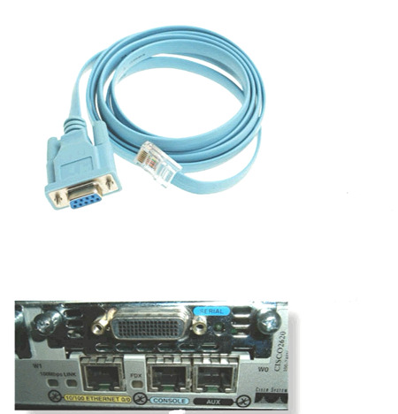
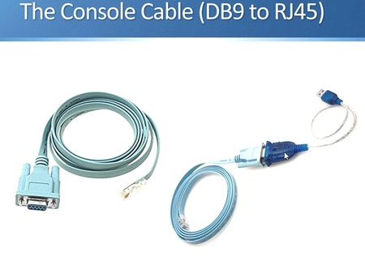

# কনসোল কেবল এবং রোল-ওভার কেবল

একটি **কনসোল কেবল** হল এমন একটি কেবল যা কম্পিউটার (অথবা টার্মিনাল) এবং একটি নেটওয়ার্ক ডিভাইস যেমন রাউটার বা সুইচের কনসোল পোর্ট সংযোগ করতে ব্যবহৃত হয়। এটি ব্যবহারকারীদের নেটওয়ার্ক ডিভাইসগুলি সরাসরি কনসোল পোর্টের মাধ্যমে পরিচালনা এবং কনফিগার করতে সাহায্য করে, এমনকি ডিভাইসটির যদি কোনও নেটওয়ার্ক সংযোগ না থাকে।

একটি **রোল-ওভার কেবল** হল একটি বিশেষ ধরনের কনসোল কেবল যার একটি অনন্য তারের স্কিম রয়েছে। এই কেবলে, পিনআউটগুলি বিপরীত বা "রোলড ওভার" হয়। উদাহরণস্বরূপ, যেটি একটি প্রান্তে পিন ১-এ সংযুক্ত থাকে, সেটি অন্য প্রান্তে পিন ৮-এ সংযুক্ত থাকে। এটি একটি স্ট্রেইট-থ্রু কেবলের থেকে আলাদা, যেখানে একটি প্রান্তে প্রতিটি পিন অন্য প্রান্তের সমান পিনের সাথে সরাসরি সংযুক্ত থাকে।

এগুলি কীভাবে আলাদা এবং কেন ব্যবহার করা হয় তা এখানে দেওয়া হল:

### **কনসোল কেবল:**
- এটি একটি কম্পিউটার বা টার্মিনালকে একটি নেটওয়ার্ক ডিভাইসের কনসোল পোর্টের সাথে সংযোগ করতে ব্যবহৃত হয়।
- মূলত এমন ডিভাইসগুলির প্রাথমিক কনফিগারেশন বা সমস্যার সমাধানের জন্য ব্যবহৃত হয়, যখন ডিভাইসটির কোনও নেটওয়ার্ক সংযোগ উপলব্ধ থাকে না।
- এর একটি প্রান্তে **DB9** অথবা **RJ-45** কনেক্টর থাকতে পারে, এটি ডিভাইসের কনসোল পোর্টের উপর নির্ভর করে। অন্য প্রান্তটি সাধারণত **USB** অথবা **সিরিয়াল** কনেক্টর থাকে কম্পিউটারের জন্য।




### **রোল-ওভার কেবল:**
- এটি একটি বিশেষ ধরনের কনসোল কেবল, যা "সিস্কো কনসোল কেবল" হিসাবেও পরিচিত।
- এর একটি প্রান্তে **RJ-45** কনেক্টর (ডিভাইসের জন্য) এবং অন্য প্রান্তে **DB9** বা **DB25** কনেক্টর (কম্পিউটারের জন্য) থাকে।
- রোল-ওভার কেবলের তারের কনফিগারেশনটি বিশেষ, যেখানে এক প্রান্তে প্রতিটি পিন বিপরীতভাবে অন্য প্রান্তে সংযুক্ত থাকে।


### **সংযোগ সেটআপ:**
- রোল-ওভার কেবলটি ডিভাইসের **কনসোল পোর্ট** (রাউটার বা সুইচ) থেকে কম্পিউটারের **সিরিয়াল পোর্ট** (DB9) এ সংযুক্ত করা হয়।
- যদি কম্পিউটারে সিরিয়াল পোর্ট না থাকে, তবে একটি **USB-টু-সিরিয়াল** অ্যাডাপ্টার ব্যবহার করা যেতে পারে।
- একবার সংযুক্ত হলে, আপনি **PuTTY**, **Tera Term**, অথবা **HyperTerminal** মতো টার্মিনাল সফটওয়্যার ব্যবহার করে ডিভাইসের সাথে সংযোগ স্থাপন এবং কনফিগারেশন শুরু করতে পারেন।

### **রোল-ওভার কেবলের ব্যবহার কেন?**
- রোল-ওভার কেবলের মাধ্যমে নেটওয়ার্ক ডিভাইসগুলির সাথে সরাসরি অ্যাক্সেস পাওয়া যায়, যা কনফিগারেশন এবং সমস্যার সমাধান করতে সহায়ক হয়, যখন অন্য কোনো নেটওয়ার্ক সংযোগ উপলব্ধ থাকে না।
- এগুলি বিশেষভাবে গুরুত্বপূর্ণ **সিস্কো ডিভাইস** এবং অন্যান্য নেটওয়ার্কিং সরঞ্জামগুলির জন্য, যেখানে কনসোল ম্যানেজমেন্ট প্রাথমিক সেটআপ বা রক্ষণাবেক্ষণের জন্য প্রয়োজন।

# Cisco IOS Mode
Cisco IOS (Internetwork Operating System) এ কিছু নির্দিষ্ট মোড রয়েছে, যেগুলির মাধ্যমে আপনি বিভিন্ন স্তরের কার্যক্রম সম্পাদন করতে পারেন। প্রতিটি মোডের নিজস্ব ফিচার এবং প্রিভিলেজ (অধিকার) থাকে। সাধারণত, সিসকো IOS এ মোট চারটি প্রধান মোড রয়েছে, যেগুলি হল:

1. **User EXEC Mode (ইউজার এক্সিকিউট মোড)**
প্রম্পট: > (যেমন: Router1>)
ব্যাখ্যা: এটি সিসকো ডিভাইসে প্রবেশের প্রথম মোড। এই মোডে, আপনি কেবলমাত্র ডিভাইসের স্ট্যাটাস দেখতে পারবেন, এবং কিছু কমান্ড (যেমন ping, traceroute, show কমান্ড) চালাতে পারবেন। আপনি কনফিগারেশন পরিবর্তন বা সিস্টেমের গুরুত্বপূর্ণ কাজ করতে পারবেন না।
কমান্ড উদাহরণ: show ip interface brief, ping, show version
2. **Privileged EXEC Mode (প্রিভিলেজড এক্সিকিউট মোড)**
প্রম্পট: # (যেমন: Router1#)
ব্যাখ্যা: এই মোডে, আপনি আরও উন্নত কমান্ড ব্যবহার করতে পারেন এবং ডিভাইসের কনফিগারেশন পরিবর্তন করতে পারবেন। আপনি ইউজার মোড থেকে enable কমান্ড দিয়ে এই মোডে প্রবেশ করতে পারেন। এটি কনফিগারেশন মোডে যাওয়ার জন্য একটি ধাপের পূর্ববর্তী মোড।
কমান্ড উদাহরণ: show running-config, configure terminal, copy, reload
3. **Global Configuration Mode (গ্লোবাল কনফিগারেশন মোড)**
প্রম্পট: (config) (যেমন: Router1(config)#)
ব্যাখ্যা: এই মোডে, আপনি ডিভাইসের কনফিগারেশন পরিবর্তন করতে পারবেন। আপনি বিভিন্ন কনফিগারেশন অপশন যেমন ইন্টারফেস, রাউটিং প্রোটোকল, এবং অন্যান্য সেটিংস কনফিগার করতে পারেন।
কমান্ড উদাহরণ: interface GigabitEthernet0/1, ip address 192.168.1.1 255.255.255.0, hostname Router2
4. **Interface Configuration Mode (ইন্টারফেস কনফিগারেশন মোড)**
প্রম্পট: (config-if) (যেমন: Router1(config-if)#)
ব্যাখ্যা: এই মোডে, আপনি একক ইন্টারফেসের জন্য কনফিগারেশন পরিবর্তন করতে পারেন। উদাহরণস্বরূপ, আপনি একটি ইন্টারফেসে IP ঠিকানা সেট করতে পারেন অথবা কোনো ইন্টারফেসের স্ট্যাটাস পরিবর্তন করতে পারেন।
কমান্ড উদাহরণ: ip address 192.168.1.1 255.255.255.0, no shutdown

# Console Cable connection to pc
Windows-এ Cisco ডিভাইসের সাথে কনসোল কেবল সংযোগ এবং টার্মিনাল চালানোর জন্য নিম্নলিখিত ধাপগুলি অনুসরণ করতে হবে:

১. কনসোল কেবল সংযোগ করুন:
কনসোল কেবল ( RJ-45 to DB9 বা RJ-45 to USB) ব্যবহার করে আপনার Cisco ডিভাইস (যেমন রাউটার বা সুইচ) এবং কম্পিউটার এর মধ্যে সংযোগ স্থাপন করুন।
যদি আপনি RJ-45 to DB9 কেবল ব্যবহার করেন, তবে DB9 পোর্টটি কম্পিউটারের পুরনো সিরিয়াল পোর্টে (COM port) সংযুক্ত হবে।
যদি আপনি RJ-45 to USB কেবল ব্যবহার করেন, তবে USB পোর্টের মাধ্যমে ডিভাইসটি সংযুক্ত হবে এবং আপনাকে একটি নতুন COM পোর্ট ড্রাইভার ইনস্টল করতে হতে পারে।
২. টার্মিনাল সিস্টেম ইন্সটল করুন:
Windows-এ কনসোল পোর্টের মাধ্যমে Cisco ডিভাইসের সাথে যোগাযোগ করতে PuTTY বা Tera Term মতো টার্মিনাল সফটওয়্যার ব্যবহার করা হয়। এখানে আমরা PuTTY ব্যবহার করার পদ্ধতি দেখাব:

- PuTTY ডাউনলোড করুন:
- PuTTY ইনস্টল করুন:

৩. PuTTY দিয়ে সংযোগ স্থাপন:
- PuTTY ওপেন করুন।
- Serial অপশনটি সিলেক্ট করুন।
- Serial line (COM port) এ সঠিক COM পোর্ট নম্বর দিন:
- আপনি Device Manager এ গিয়ে দেখতে পারবেন যে কোন COM পোর্টটি সংযুক্ত হয়েছে। সাধারণত এটি COM1, COM2 ইত্যাদি হতে পারে।
যেমন: COM1, COM2 ইত্যাদি।
- Speed (baud rate) সেট করুন: 9600 (এটি সাধারণত ডিফল্ট থাকে, তবে আপনি আপনার ডিভাইসের কনফিগারেশন চেক করে এটি নিশ্চিত করতে পারেন)।
- Data bits: 8
- Parity: None
- Stop bits: 1
- Flow control: None
- এরপর Open ক্লিক করুন।

৪. Cisco ডিভাইসে লগইন করুন:
আপনি যদি সবকিছু সঠিকভাবে সেটআপ করেন, তবে PuTTY টার্মিনাল উইন্ডোটি খুলবে এবং Cisco ডিভাইসের কনসোল থেকে লগইন প্রম্পট আসবে। আপনি তখন ডিভাইসে লগইন করতে পারবেন।

# Hostname configure
Cisco IOS-এ hostname কনফিগার করার জন্য আপনাকে নিম্নলিখিত ধাপগুলি অনুসরণ করতে হবে:

1. **রাউটার বা সুইচে লগইন করুন:**
   - প্রথমে আপনার ডিভাইসে লগইন করুন।
```bash
<swhtch> ?

connect       Open a terminal connection
disable       Turn off privileged commands
disconnect    Disconnect an existing network connection
enable        Turn on privileged commands
exit          Exit from the EXEC
logout        Exit from the EXEC
ping          send echo messages
resume 	      Resume an active network connection
show          Show running system information
telnet        Open a telnet connection
terminal	    Set terminal line parameters
traceroute    Trace route to destination
<switch> 

```
2. **গ্লোবাল কনফিগারেশন মোডে প্রবেশ করুন:**
   - প্রম্পট থেকে `enable` টাইপ করুন এবং Enter চাপুন।
     ```cmd
     enable
     ```
   - তারপর `configure terminal` টাইপ করুন এবং Enter চাপুন।
     ```cmd
     configure terminal 
     ```

```bash
<switch> en
<switch> enable
Switch#
Switch#?
Exec          commands:
clear         Reset functions
clock         Manage the system clock
configure     Enter configuration mode
connect       Open a terminal connection
copy          Copy from one file to another
debug         Debugging functions (see also 'undebug')
delete        Delete a file
dir           List files on a filesystem
disable       Turn off privileged commands
disconnect    Disconnect an existing network connection
enable        Turn on privileged commands
erase         Erase a filesystem
exit          Exit from the EXEC
logout        Exit from the EXEC
more          Display the contents of a file
no            Disable debugging informations
ping          Send echo messages
reload        Halt and perform a cold restart
resume        Resume an active network connection
setup         Run the SETUP command facility
show          Show running system information
ssh           Open a secure shell client connection
telnet        Open a telnet connection
terminal      Set terminal line parameters
traceroute    Trace route to destination
undebug       Disable debugging functions (see also 'debug')
vlan          Configure VLAN parameters
write Write   running configuration to memory, network, or terminal
```
```bash
Switch# configure terminal 
Enter configuration commands, one per line. End with CNTL/Z.
```
3. **hostname কনফিগার করুন:**
   - `hostname` কমান্ড ব্যবহার করে আপনার ডিভাইসের নতুন নাম সেট করুন। উদাহরণস্বরূপ:
     ```cmd
     hostname ciscoswitch1
     ```
```css
Switch(config)# hostname ?
WORD This system's network name

Switch(config)# hostname ciscoswitch1

ciscoswitch1(config)# exit

ciscoswitch1#
%SYS-5-CONFIG_I: Configured from console by console

ciscoswitch1# exit

<ciscoswitch1>

```
4. **কনফিগারেশন সেভ করুন:**
   - কনফিগারেশন সংরক্ষণ করতে `write memory` বা `copy running-config startup-config` কমান্ড ব্যবহার করুন।

এভাবে আপনি Cisco IOS ডিভাইসে hostname কনফিগার করতে পারবেন।

# Negetive Command
Cisco IOS-এ no কমান্ড ব্যবহার করা হয় কোনো কনফিগারেশন অপশনকে নিষ্ক্রিয় (disable) বা মুছে ফেলার জন্য। এর মাধ্যমে আপনি কোনো সেটিংস বা কনফিগারেশন পরিবর্তন করতে পারেন। এই কমান্ডটি সাধারণত কোনো পূর্ববর্তী কনফিগারেশন বা অপশনকে বিপরীত করতে ব্যবহৃত হয়।

no কমান্ডের উদাহরণ:
হোস্টনেম (Hostname) পরিবর্তন: যদি আপনি আগে হোস্টনেম সেট করে থাকেন এবং সেটি মুছে দিতে চান, তাহলে no hostname কমান্ড ব্যবহার করতে পারেন।

```bash
Router(config)# no hostname
```
