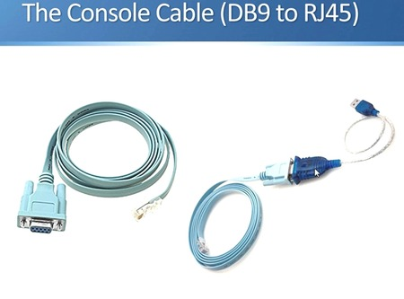

# কনসোল কেবল এবং রোল-ওভার কেবল

একটি **কনসোল কেবল** হল এমন একটি কেবল যা কম্পিউটার (অথবা টার্মিনাল) এবং একটি নেটওয়ার্ক ডিভাইস যেমন রাউটার বা সুইচের কনসোল পোর্ট সংযোগ করতে ব্যবহৃত হয়। এটি ব্যবহারকারীদের নেটওয়ার্ক ডিভাইসগুলি সরাসরি কনসোল পোর্টের মাধ্যমে পরিচালনা এবং কনফিগার করতে সাহায্য করে, এমনকি ডিভাইসটির যদি কোনও নেটওয়ার্ক সংযোগ না থাকে।

একটি **রোল-ওভার কেবল** হল একটি বিশেষ ধরনের কনসোল কেবল যার একটি অনন্য তারের স্কিম রয়েছে। এই কেবলে, পিনআউটগুলি বিপরীত বা "রোলড ওভার" হয়। উদাহরণস্বরূপ, যেটি একটি প্রান্তে পিন ১-এ সংযুক্ত থাকে, সেটি অন্য প্রান্তে পিন ৮-এ সংযুক্ত থাকে। এটি একটি স্ট্রেইট-থ্রু কেবলের থেকে আলাদা, যেখানে একটি প্রান্তে প্রতিটি পিন অন্য প্রান্তের সমান পিনের সাথে সরাসরি সংযুক্ত থাকে।

এগুলি কীভাবে আলাদা এবং কেন ব্যবহার করা হয় তা এখানে দেওয়া হল:

### **কনসোল কেবল:**
- এটি একটি কম্পিউটার বা টার্মিনালকে একটি নেটওয়ার্ক ডিভাইসের কনসোল পোর্টের সাথে সংযোগ করতে ব্যবহৃত হয়।
- মূলত এমন ডিভাইসগুলির প্রাথমিক কনফিগারেশন বা সমস্যার সমাধানের জন্য ব্যবহৃত হয়, যখন ডিভাইসটির কোনও নেটওয়ার্ক সংযোগ উপলব্ধ থাকে না।
- এর একটি প্রান্তে **DB9** অথবা **RJ-45** কনেক্টর থাকতে পারে, এটি ডিভাইসের কনসোল পোর্টের উপর নির্ভর করে। অন্য প্রান্তটি সাধারণত **USB** অথবা **সিরিয়াল** কনেক্টর থাকে কম্পিউটারের জন্য।




### **রোল-ওভার কেবল:**
- এটি একটি বিশেষ ধরনের কনসোল কেবল, যা "সিস্কো কনসোল কেবল" হিসাবেও পরিচিত।
- এর একটি প্রান্তে **RJ-45** কনেক্টর (ডিভাইসের জন্য) এবং অন্য প্রান্তে **DB9** বা **DB25** কনেক্টর (কম্পিউটারের জন্য) থাকে।
- রোল-ওভার কেবলের তারের কনফিগারেশনটি বিশেষ, যেখানে এক প্রান্তে প্রতিটি পিন বিপরীতভাবে অন্য প্রান্তে সংযুক্ত থাকে।


### **সংযোগ সেটআপ:**
- রোল-ওভার কেবলটি ডিভাইসের **কনসোল পোর্ট** (রাউটার বা সুইচ) থেকে কম্পিউটারের **সিরিয়াল পোর্ট** (DB9) এ সংযুক্ত করা হয়।
- যদি কম্পিউটারে সিরিয়াল পোর্ট না থাকে, তবে একটি **USB-টু-সিরিয়াল** অ্যাডাপ্টার ব্যবহার করা যেতে পারে।
- একবার সংযুক্ত হলে, আপনি **PuTTY**, **Tera Term**, অথবা **HyperTerminal** মতো টার্মিনাল সফটওয়্যার ব্যবহার করে ডিভাইসের সাথে সংযোগ স্থাপন এবং কনফিগারেশন শুরু করতে পারেন।

### **রোল-ওভার কেবলের ব্যবহার কেন?**
- রোল-ওভার কেবলের মাধ্যমে নেটওয়ার্ক ডিভাইসগুলির সাথে সরাসরি অ্যাক্সেস পাওয়া যায়, যা কনফিগারেশন এবং সমস্যার সমাধান করতে সহায়ক হয়, যখন অন্য কোনো নেটওয়ার্ক সংযোগ উপলব্ধ থাকে না।
- এগুলি বিশেষভাবে গুরুত্বপূর্ণ **সিস্কো ডিভাইস** এবং অন্যান্য নেটওয়ার্কিং সরঞ্জামগুলির জন্য, যেখানে কনসোল ম্যানেজমেন্ট প্রাথমিক সেটআপ বা রক্ষণাবেক্ষণের জন্য প্রয়োজন।

# Cisco IOS Mode
Cisco IOS (Internetwork Operating System) এ কিছু নির্দিষ্ট মোড রয়েছে, যেগুলির মাধ্যমে আপনি বিভিন্ন স্তরের কার্যক্রম সম্পাদন করতে পারেন। প্রতিটি মোডের নিজস্ব ফিচার এবং প্রিভিলেজ (অধিকার) থাকে। সাধারণত, সিসকো IOS এ মোট চারটি প্রধান মোড রয়েছে, যেগুলি হল:

1. **User EXEC Mode (ইউজার এক্সিকিউট মোড)**
প্রম্পট: > (যেমন: Router1>)
ব্যাখ্যা: এটি সিসকো ডিভাইসে প্রবেশের প্রথম মোড। এই মোডে, আপনি কেবলমাত্র ডিভাইসের স্ট্যাটাস দেখতে পারবেন, এবং কিছু কমান্ড (যেমন ping, traceroute, show কমান্ড) চালাতে পারবেন। আপনি কনফিগারেশন পরিবর্তন বা সিস্টেমের গুরুত্বপূর্ণ কাজ করতে পারবেন না।
কমান্ড উদাহরণ: show ip interface brief, ping, show version
2. **Privileged EXEC Mode (প্রিভিলেজড এক্সিকিউট মোড)**
প্রম্পট: # (যেমন: Router1#)
ব্যাখ্যা: এই মোডে, আপনি আরও উন্নত কমান্ড ব্যবহার করতে পারেন এবং ডিভাইসের কনফিগারেশন পরিবর্তন করতে পারবেন। আপনি ইউজার মোড থেকে enable কমান্ড দিয়ে এই মোডে প্রবেশ করতে পারেন। এটি কনফিগারেশন মোডে যাওয়ার জন্য একটি ধাপের পূর্ববর্তী মোড।
কমান্ড উদাহরণ: show running-config, configure terminal, copy, reload
3. **Global Configuration Mode (গ্লোবাল কনফিগারেশন মোড)**
প্রম্পট: (config) (যেমন: Router1(config)#)
ব্যাখ্যা: এই মোডে, আপনি ডিভাইসের কনফিগারেশন পরিবর্তন করতে পারবেন। আপনি বিভিন্ন কনফিগারেশন অপশন যেমন ইন্টারফেস, রাউটিং প্রোটোকল, এবং অন্যান্য সেটিংস কনফিগার করতে পারেন।
কমান্ড উদাহরণ: interface GigabitEthernet0/1, ip address 192.168.1.1 255.255.255.0, hostname Router2
4. **Interface Configuration Mode (ইন্টারফেস কনফিগারেশন মোড)**
প্রম্পট: (config-if) (যেমন: Router1(config-if)#)
ব্যাখ্যা: এই মোডে, আপনি একক ইন্টারফেসের জন্য কনফিগারেশন পরিবর্তন করতে পারেন। উদাহরণস্বরূপ, আপনি একটি ইন্টারফেসে IP ঠিকানা সেট করতে পারেন অথবা কোনো ইন্টারফেসের স্ট্যাটাস পরিবর্তন করতে পারেন।
কমান্ড উদাহরণ: ip address 192.168.1.1 255.255.255.0, no shutdown

# Console Cable connection to pc
Windows-এ Cisco ডিভাইসের সাথে কনসোল কেবল সংযোগ এবং টার্মিনাল চালানোর জন্য নিম্নলিখিত ধাপগুলি অনুসরণ করতে হবে:

১. কনসোল কেবল সংযোগ করুন:
কনসোল কেবল ( RJ-45 to DB9 বা RJ-45 to USB) ব্যবহার করে আপনার Cisco ডিভাইস (যেমন রাউটার বা সুইচ) এবং কম্পিউটার এর মধ্যে সংযোগ স্থাপন করুন।
যদি আপনি RJ-45 to DB9 কেবল ব্যবহার করেন, তবে DB9 পোর্টটি কম্পিউটারের পুরনো সিরিয়াল পোর্টে (COM port) সংযুক্ত হবে।
যদি আপনি RJ-45 to USB কেবল ব্যবহার করেন, তবে USB পোর্টের মাধ্যমে ডিভাইসটি সংযুক্ত হবে এবং আপনাকে একটি নতুন COM পোর্ট ড্রাইভার ইনস্টল করতে হতে পারে।

২. টার্মিনাল সিস্টেম ইন্সটল করুন:
Windows-এ কনসোল পোর্টের মাধ্যমে Cisco ডিভাইসের সাথে যোগাযোগ করতে PuTTY বা Tera Term মতো টার্মিনাল সফটওয়্যার ব্যবহার করা হয়। এখানে আমরা PuTTY ব্যবহার করার পদ্ধতি দেখাব:

- PuTTY ডাউনলোড করুন:
- PuTTY ইনস্টল করুন:

  **Different Terminal Pogram**
     - Putty (free)
     - Tera Term (free)
     - Hyper Term (free)
     - SecureCRT (paid and best)
     - Minicom  (free for linux,apple)
       
৩. PuTTY দিয়ে সংযোগ স্থাপন:
- PuTTY ওপেন করুন।
- Serial অপশনটি সিলেক্ট করুন।
- Serial line (COM port) এ সঠিক COM পোর্ট নম্বর দিন:
- আপনি Device Manager এ গিয়ে দেখতে পারবেন যে কোন COM পোর্টটি সংযুক্ত হয়েছে। সাধারণত এটি COM1, COM2 ইত্যাদি হতে পারে।
যেমন: COM1, COM2 ইত্যাদি।
- Speed (baud rate) সেট করুন: 9600 (এটি সাধারণত ডিফল্ট থাকে, তবে আপনি আপনার ডিভাইসের কনফিগারেশন চেক করে এটি নিশ্চিত করতে পারেন)।
- Data bits: 8
- Parity: None
- Stop bits: 1
- Flow control: None
- এরপর Open ক্লিক করুন।

৪. Cisco ডিভাইসে লগইন করুন:
আপনি যদি সবকিছু সঠিকভাবে সেটআপ করেন, তবে PuTTY টার্মিনাল উইন্ডোটি খুলবে এবং Cisco ডিভাইসের কনসোল থেকে লগইন প্রম্পট আসবে। আপনি তখন ডিভাইসে লগইন করতে পারবেন।
# Cisco IOS Booting Process
Cisco IOS (Internetwork Operating System) একটি প্রপারাইটরি অপারেটিং সিস্টেম যা Cisco ডিভাইসের (যেমন রাউটার এবং সুইচ) জন্য ব্যবহৃত হয়। Cisco IOS বুটিং প্রক্রিয়া নিম্নলিখিত ধাপগুলোতে সম্পন্ন হয়:

### ১. POST (Power-On Self-Test)
ডিভাইস চালু হলে প্রথমে POST চালু হয়, যা সিস্টেমের হার্ডওয়্যার চেক করে এবং নিশ্চিত করে যে সব কিছু সঠিকভাবে কাজ করছে। যদি কোনো সমস্যা থাকে, তখন লগ রিপোর্ট করা হয় এবং বুট প্রক্রিয়া থেমে যেতে পারে।

### ২. ROM (Read-Only Memory) লোডিং
POST পরীক্ষার পর, ডিভাইসটি ROM থেকে একটি মৌলিক বুটলোডার লোড করে। ROM মূলত একটি ছোট ফার্মওয়্যার যা সিস্টেম চালু করার জন্য প্রাথমিক কোড প্রদান করে।

### ৩. IOS লোডিং
বুটলোডার তারপরে একটি স্থানীয় বা রিমোট সার্ভার থেকে Cisco IOS সিস্টেমের মূল কোডটি লোড করে। এটি সাধারণত Flash মেমরিতে সঞ্চিত থাকে। যদি সিস্টেমটি রিমোট সার্ভার থেকে লোড করতে চায়, তাহলে TFTP বা অন্যান্য প্রোটোকল ব্যবহার করা হতে পারে।

### ৪. স্বয়ংক্রিয় কনফিগারেশন লোডিং
IOS লোড হওয়ার পর, সিস্টেমটি কনফিগারেশন ফাইলটি লোড করতে শুরু করে। কনফিগারেশন ফাইলটি সাধারাণত "startup-config" নামে Flash মেমরিতে থাকে। যদি কোনো কনফিগারেশন ফাইল পাওয়া না যায়, তাহলে ডিভাইসটি "initial configuration dialog" মোডে চলে যেতে পারে, যেখানে ব্যবহারকারীকে কনফিগারেশন সেটআপ করতে বলা হয়।

### ৫. চালু হওয়া এবং লগইন
সব কিছু লোড হওয়ার পর, ডিভাইসটি প্রস্তুত হয় এবং আপনাকে লগইন করার জন্য প্রম্পট দেখায়। এটি সাধারণত একটি CLI (Command Line Interface) যা আপনি কমান্ড দিতে পারেন।

### ৬. রুটিন প্রসেস
সবশেষে, ডিভাইসটি নেটওয়ার্ক কার্যক্রম পরিচালনা করতে শুরু করে এবং আপনি এটি পরিচালনা করতে বিভিন্ন নেটওয়ার্ক কনফিগারেশন পরিবর্তন করতে পারেন।

এভাবেই Cisco IOS বুটিং প্রক্রিয়া সম্পন্ন হয়।

# Hostname configure
Cisco IOS-এ hostname কনফিগার করার জন্য আপনাকে নিম্নলিখিত ধাপগুলি অনুসরণ করতে হবে:

1. **রাউটার বা সুইচে লগইন করুন:**
   - প্রথমে আপনার ডিভাইসে লগইন করুন।
```bash
<swhtch> ?

connect       Open a terminal connection
disable       Turn off privileged commands
disconnect    Disconnect an existing network connection
enable        Turn on privileged commands
exit          Exit from the EXEC
logout        Exit from the EXEC
ping          send echo messages
resume 	      Resume an active network connection
show          Show running system information
telnet        Open a telnet connection
terminal	    Set terminal line parameters
traceroute    Trace route to destination
<switch> 

```
2. **গ্লোবাল কনফিগারেশন মোডে প্রবেশ করুন:**
   - প্রম্পট থেকে `enable` টাইপ করুন এবং Enter চাপুন।
     ```cmd
     enable
     ```
   - তারপর `configure terminal` টাইপ করুন এবং Enter চাপুন।
     ```cmd
     configure terminal 
     ```

```bash
<switch> en
<switch> enable
Switch#
Switch#?
Exec          commands:
clear         Reset functions
clock         Manage the system clock
configure     Enter configuration mode
connect       Open a terminal connection
copy          Copy from one file to another
debug         Debugging functions (see also 'undebug')
delete        Delete a file
dir           List files on a filesystem
disable       Turn off privileged commands
disconnect    Disconnect an existing network connection
enable        Turn on privileged commands
erase         Erase a filesystem
exit          Exit from the EXEC
logout        Exit from the EXEC
more          Display the contents of a file
no            Disable debugging informations
ping          Send echo messages
reload        Halt and perform a cold restart
resume        Resume an active network connection
setup         Run the SETUP command facility
show          Show running system information
ssh           Open a secure shell client connection
telnet        Open a telnet connection
terminal      Set terminal line parameters
traceroute    Trace route to destination
undebug       Disable debugging functions (see also 'debug')
vlan          Configure VLAN parameters
write Write   running configuration to memory, network, or terminal
```
```bash
Switch# configure terminal 
Enter configuration commands, one per line. End with CNTL/Z.
```
3. **hostname কনফিগার করুন:**
   - `hostname` কমান্ড ব্যবহার করে আপনার ডিভাইসের নতুন নাম সেট করুন। উদাহরণস্বরূপ:
     ```cmd
     hostname ciscoswitch1
     ```
```css
Switch(config)# hostname ?
WORD This system's network name

Switch(config)# hostname ciscoswitch1

ciscoswitch1(config)# exit

ciscoswitch1#
%SYS-5-CONFIG_I: Configured from console by console

ciscoswitch1# exit

<ciscoswitch1>

```
4. **কনফিগারেশন সেভ করুন:**
   - কনফিগারেশন সংরক্ষণ করতে `write memory` বা `copy running-config startup-config` কমান্ড ব্যবহার করুন।

এভাবে আপনি Cisco IOS ডিভাইসে hostname কনফিগার করতে পারবেন।

# Negetive Command
Cisco IOS-এ no কমান্ড ব্যবহার করা হয় কোনো কনফিগারেশন অপশনকে নিষ্ক্রিয় (disable) বা মুছে ফেলার জন্য। এর মাধ্যমে আপনি কোনো সেটিংস বা কনফিগারেশন পরিবর্তন করতে পারেন। এই কমান্ডটি সাধারণত কোনো পূর্ববর্তী কনফিগারেশন বা অপশনকে বিপরীত করতে ব্যবহৃত হয়।

no কমান্ডের উদাহরণ:
হোস্টনেম (Hostname) পরিবর্তন: যদি আপনি আগে হোস্টনেম সেট করে থাকেন এবং সেটি মুছে দিতে চান, তাহলে no hostname কমান্ড ব্যবহার করতে পারেন।
```cmd
no hostname
```
```bash
ciscoswitch1(config)# no hostname
switch(config)# exit
switch# exit
switch> 
```
# Console Password
Cisco ডিভাইসে console password কনফিগার করার মাধ্যমে আপনি console পোর্টের মাধ্যমে রাউটার বা সুইচে প্রবেশ করার সময় পাসওয়ার্ড সুরক্ষা যোগ করতে পারেন। এই পাসওয়ার্ড শুধুমাত্র যখন আপনি কনসোল পোর্টের মাধ্যমে ডিভাইসে লগইন করবেন তখনই কার্যকর হবে। নিচে কিভাবে console password কনফিগার করবেন, তা বিস্তারিতভাবে দেওয়া হলো:

### Console Password কনফিগার করার ধাপ:
- **সুইচে কনফিগারেশন মোডে প্রবেশ করুন:**
      Console Password কনফিগার করার ধাপ:
রাউটারের কনফিগারেশন মোডে প্রবেশ করুন:
   ```cmd
      enable
      configure terminal
   ```
```bash
switch> enable
switch# configure terminal
Enter configuration commands, one per line. End with CNTL/Z.

```
- **Console পোর্ট নির্বাচন করুন:**
  ```cmd 
      line console 0
   ```
```bash

switch(config)# line ?
<0-16>      First Line number
  console   Primary terminal line
  vty       Virtual terminal
<0-0>       First Line number

switch(config)#line console ?
<0-0>  First Line number

switch(config)#line console 0
switch(config-line)#
switch(config-line)# ?
Line configuration commands:
   access-class           Filter connections based on an IP access list
  autocommand             Automatically execute an EXEC command
  autocommand-options     Autocommand options
  data-character-bits     Size of characters being handled
  databits                Set number of data bits per character
  default                 Set a command to its defaults
  domain-lookup           Enable domain lookups in show commands
  editing                 Enable command line editing
  escape-character        Change the current line's escape character
  exec                    Configure EXEC
  exec-banner             Enable the display of the EXEC banner
  exec-character-bits     Size of characters to the command exec
  exec-timeout            Set the EXEC timeout
  exit                    Exit from line configuration mode
  flowcontrol             Set the flow control
  full-help               Provide help to unprivileged user
  help                    Description of the interactive help system
  history                 Enable and control the command history function
  international           Enable international 8-bit character support
  ip                      IP options
  ipv6                    IPv6 options
  length                  Set number of lines on a screen
  location                Enter terminal location description
  logging                 Modify message logging facilities
  login                   Enable password checking
  media-type              Console connection media type
  modem                   Configure the Modem Control Lines
  monitor                 Copy debug output to the current terminal line
  motd-banner             Enable the display of the MOTD banner
  no                      Negate a command or set its defaults
  notify                  Inform users of output from concurrent sessions
  padding                 Set padding for a specified output character
  parity                  Set terminal parity
  password                Set a password
  prc                     PRC commands
  privilege               Change privilege level for line
  refuse-message          Define a refuse banner
  rotary                  Add line to a rotary group
  rxspeed                 Set the receive speed
  session-timeout         Set interval for closing connection when there is no
                          input traffic
  special-character-bits  Size of the escape (and other special) characters
  speed                   Set the transmit and receive speeds
  start-character         Define the start character
  stop-character          Define the stop character
  stopbits                Set async line stop bits
  terminal-type           Set the terminal type
  timeout                 Timeouts for the line
  transport               Define transport protocols for line
  txspeed                 Set the transmit speeds
  usb-inactivity-timeout  Inactivity timeout for USB media type
  vacant-message          Define a vacant banner
  width                   Set width of the display terminal

```
- **Console পাসওয়ার্ড সেট করুন:**
   ```cmd
      password cisco
   ```
```bash

Switch(config-line)#password ?
7             Specifies a HIDDEN password will follow
LINE          The UNENCRYPTED (cleartext) line password
0             specified unencrypted password
encryption    Encrypt system passwords

Switch(config-line)# password cisco
Switch(config-line)# end

Switch# show running-config 
Building configuration...

Current configuration : 1096 bytes
!
version 12.2
no service timestamps log datetime msec
no service timestamps debug datetime msec
no service password-encryption
!
hostname Switch
!
!
spanning-tree mode pvst
spanning-tree extend system-id
!
interface FastEthernet0/1
!
interface FastEthernet0/2
!
interface FastEthernet0/3
!
interface FastEthernet0/4
!
interface FastEthernet0/5
!
interface FastEthernet0/6
!
interface FastEthernet0/7
!
interface FastEthernet0/8
!
interface FastEthernet0/9
!
interface FastEthernet0/10
!
interface FastEthernet0/11
!
interface FastEthernet0/12
!
interface FastEthernet0/13
!
interface FastEthernet0/14
!
interface FastEthernet0/15
!
interface FastEthernet0/16
!
interface FastEthernet0/17
!
interface FastEthernet0/18
!
interface FastEthernet0/19
!
interface FastEthernet0/20
!
interface FastEthernet0/21
!
interface FastEthernet0/22
!
interface FastEthernet0/23
!
interface FastEthernet0/24
!
interface GigabitEthernet0/1
!
interface GigabitEthernet0/2
!
interface Vlan1
no ip address
shutdown
!
!
line con 0               [console port]
password cisco             
!
line vty 0 4
login
line vty 5 15
login
!
!
end
```
  
- **Login প্রম্পট এনাবল করুন (যাতে পাসওয়ার্ড চাওয়া হয়):**
   ```cmd
      login
   ```
```bash
switch> enable
switch# configure terminal
Enter configuration commands, one per line. End with CNTL/Z.


switch(config)#line console 0

Switch(config-line)#
Switch(config-line)# login
Switch(config-line)# end

switch# exit

Press RETURN to get started!

User Access Verification

Password: 
switch>   enable
Switch#

Switch# show running-config | ?
   begin          Begins unfiltered output of the show command with the first line
                    that contains the regular expression.
  exclude         Displays output lines that do not contain the regular expression.
  include         Displays output lines that contain the regular expression.	
  section         Filter a section of output

Switch# show running-config | begin ?
  LINE  Regular expression.

Switch# show running-config | begin line con
line con 0
password cisco
login
!
line vty 0 4
login
line vty 5 15
login
!
end 
```
- **কনফিগারেশন সেভ করুন:**
```bash
Switch# write memory
```
ব্যাখ্যা:
- **line console 0:** কনসোল পোর্টের জন্য কনফিগারেশন মোডে প্রবেশ করা হয়।
- **password <your_password>:** console পোর্টের জন্য পাসওয়ার্ড নির্ধারণ করা হয়।
- **login:** পাসওয়ার্ড চাওয়ার জন্য login প্রম্পট সক্রিয় করা হয়।
- **write memory:** আপনার কনফিগারেশন পরিবর্তনগুলি সেভ করা হয়।
# Telnet Password
Cisco switch-এ Telnet password কনফিগার করার মাধ্যমে আপনি সুইচের দূরবর্তী (remote) অ্যাক্সেস নিরাপদ করতে পারবেন। Telnet একটি প্রোটোকল যা আপনাকে সুইচ বা রাউটার থেকে দূরবর্তী অবস্থান থেকে কনফিগারেশন করতে দেয়। তবে, Telnet প্রটোকল সিকিউরিটি ক্ষেত্রে তেমন নিরাপদ নয়, তাই সাধারণত SSH ব্যবহারের পরামর্শ দেওয়া হয়। তবে এখানে আমরা Telnet password কনফিগারেশন দেখব।
Switch-এ প্রবেশ করুন:

-**প্রথমে, সুইচের enable মোডে প্রবেশ করুন।**
```bash
Switch> enable
Switch# configure terminal
Switch(config)#
```
- **VTY লাইনের কনফিগারেশন করুন:**
Telnet সেশনের জন্য VTY (Virtual Terminal) লাইনের কনফিগারেশন করতে হবে:
```bash
Switch(config)# line vty 0 15
```
- **Telnet পাসওয়ার্ড সেট করুন:**
এবার আপনি Telnet সেশনের জন্য পাসওয়ার্ড সেট করতে পারেন:
```bash
Switch(config-line)# password <your_password>
উদাহরণস্বরূপ, পাসওয়ার্ড cisco123 সেট করতে:
```bash
Switch(config-line)# password cisco123
Login প্রম্পট সক্রিয় করুন:
```
- **Telnet লগইন প্রম্পট সক্রিয় করার জন্য login কমান্ডটি ব্যবহার করুন:**
```bash
Switch(config-line)# login
```
**Telnet অ্যাক্সেসের জন্য সিসকো সুইচকে Telnet পোর্ট চালু করুন:**

যদি আপনার switch-এ IP address না থাকে, তবে আপনাকে একটি IP address কনফিগার করতে হবে যাতে আপনি Telnet এর মাধ্যমে অ্যাক্সেস করতে পারেন:

```bash
Switch(config)# interface vlan 1
Switch(config-if)# ip address 192.168.1.1 255.255.255.0
Switch(config-if)# no shutdown
```
কনফিগারেশন সেভ করুন:

এখন কনফিগারেশন শেষ হয়ে গেলে, সেগুলি সেভ করুন:
```bash
Switch(config-line)# exit
Switch(config)# exit
Switch# write memory
```

ব্যাখ্যা:
- line vty 0 15: ১৬টি VTY লাইনের কনফিগারেশন নির্বাচন করা হয়েছে (সুইচে ১৬টি ভ্যারচুয়াল টার্মিনাল সেশন অনুমোদিত থাকে)।
- password <your_password>: Telnet পাসওয়ার্ড সেট করা হচ্ছে।
- login: পাসওয়ার্ড প্রম্পট সক্রিয় করা হচ্ছে।
- ip address: সুইচের জন্য একটি IP address কনফিগার করা হচ্ছে যাতে Telnet অ্যাক্সেস করা যায়।

# Enable Password
Cisco switch-এ enable password কনফিগার করার মাধ্যমে আপনি সুইচের privileged EXEC mode (enable mode) নিরাপদ করতে পারবেন। এটি সুইচে enable মোডে প্রবেশ করার সময় পাসওয়ার্ড চাওয়ার ব্যবস্থা করবে। নিচে enable password কনফিগার করার সম্পূর্ণ প্রক্রিয়া বাংলা ভাষায় ব্যাখ্যা করা হলো।

- **Enable Password কনফিগারেশন করার ধাপ:**
Switch-এ প্রবেশ করুন:

প্রথমে, সুইচে privileged EXEC mode (enable mode) এ প্রবেশ করুন:
```bash
Switch> enable
Switch# configure terminal
Enable পাসওয়ার্ড সেট করুন:
```
- **enable password কমান্ড ব্যবহার করে আপনি একটি পাসওয়ার্ড সেট করতে পারবেন:**
```bash
Switch(config)# enable password <your_password>
```
উদাহরণস্বরূপ, যদি আপনি পাসওয়ার্ড হিসেবে cisco123 ব্যবহার করতে চান:

```bash
Switch(config)# enable password cisco123
```
- **Enable Secret Password সেট করুন (এটি আরো সুরক্ষিত):**

enable password সাধারণত সাদাসিধে পাসওয়ার্ড হিসেবে ব্যবহার করা হয়, কিন্তু এটি এনক্রিপ্টেড নয়। তাই সুরক্ষিতভাবে পাসওয়ার্ড রাখতে enable secret ব্যবহার করা ভালো।

```bash
Switch(config)# enable secret <your_secret_password>
```
### enable secrete
```bash
Switch(config)#enable ?
  password  Assign the privileged level password
  secret    Assign the privileged level secret

Switch(config)#enable secret ?
  0      Specifies an UNENCRYPTED password will follow
  5      Specifies an ENCRYPTED secret will follow
  LINE   The UNENCRYPTED (cleartext) 'enable' secret
  level  Set exec level password

Switch(config)#enable secret cisco
Switch(config)#exit
Switch#
%SYS-5-CONFIG_I: Configured from console by console
show r
Switch#show running-config 
Building configuration...

Current configuration : 1154 bytes
!
version 15.0
no service timestamps log datetime msec
no service timestamps debug datetime msec
no service password-encryption
!
hostname Switch
!
enable secret 5 $1$mERr$hx5rVt7rPNoS4wqbXKX7m0
enable password cisco123
!
!
!
!
!
!
spanning-tree mode pvst
spanning-tree extend system-id
!
 --More-- 

```
- **কনফিগারেশন সেভ করুন:**

কনফিগারেশন শেষ হলে, পরিবর্তনগুলো সেভ করে ফেলুন:
```bash
Switch(config)# exit
Switch# write memory
```
পূর্ণ উদাহরণ:
ধরা যাক, আপনি cisco123 পাসওয়ার্ড দিয়ে enable password এবং cisco123secret দিয়ে enable secret password কনফিগার করতে চান। তাহলে পুরো কমান্ডগুলো হবে:

```bash
Switch> enable
Switch# configure terminal
Switch(config)# enable password cisco123
Switch(config)# enable secret cisco123secret
Switch(config)# exit
Switch# write memory
```
ব্যাখ্যা:
- enable password <your_password>: এটি enable মোডে প্রবেশের জন্য একটি পাসওয়ার্ড সেট করবে, কিন্তু এই পাসওয়ার্ডটি প্লেইন টেক্সটে সেভ হবে।
- enable secret <your_secret_password>: এটি enable মোডে প্রবেশের জন্য একটি পাসওয়ার্ড সেট করবে এবং এই পাসওয়ার্ডটি এনক্রিপ্টেড থাকবে, যা অধিক সুরক্ষিত।
- write memory: আপনার কনফিগারেশন সেভ করে ফেলতে এই কমান্ডটি ব্যবহার করা হয়।

# Cisco সুইচের timeout time পরিবর্তন
Cisco সুইচের **timeout time** পরিবর্তন করতে হলে আপনাকে কিছু নির্দিষ্ট পদ্ধতি অনুসরণ করতে হবে। এটি সাধারণত **console session timeout** বা **inactive timeout** হিসেবে পরিচিত, যা সুইচের CLI-তে লগ ইন করার পর কত সময় পর কনসোল সেশনটি স্বয়ংক্রিয়ভাবে বন্ধ হবে তা নিয়ন্ত্রণ করে।

### ১. **Console Timeout পরিবর্তন:**

আপনি যদি **console timeout** পরিবর্তন করতে চান, তাহলে নিচের ধাপগুলো অনুসরণ করতে পারেন:

1. **Global Configuration Mode**-এ প্রবেশ করুন:
   ```bash
   Switch# configure terminal
   ```

2. **Console Line Configuration Mode**-এ প্রবেশ করুন:
   ```bash
   Switch(config)# line con 0
   ```

3. **Timeout পরিবর্তন করুন**:  
   এখানে `exec-timeout` কমান্ড ব্যবহার করা হবে, যার মাধ্যমে আপনি সেশনটির ইনঅ্যাকটিভিটি টাইম আউট সময় সেট করতে পারবেন। 
   উদাহরণস্বরূপ, যদি আপনি টাইম আউট সময় ১০ মিনিট (১০০ মিনিট) সেট করতে চান, তাহলে এই কমান্ড ব্যবহার করুন:
   ```bash
   Switch(config-line)# exec-timeout 10 0
   ```
   এখানে:
   - প্রথম সংখ্যা (১০) মিনিটের জন্য,
   - দ্বিতীয় সংখ্যা (০) সেকেন্ডের জন্য।

4. **কনফিগারেশন সেভ করুন**:
   ```bash
   Switch(config-line)# end
   Switch# write memory
   ```

এটি আপনার কনসোল সেশনটির টাইমআউট সময় ১০ মিনিটে সেট করবে। অর্থাৎ, ১০ মিনিট ইনঅ্যাকটিভ থাকার পর সেশনটি স্বয়ংক্রিয়ভাবে বন্ধ হয়ে যাবে।

### ২. **VTY (Virtual Terminal) Timeout পরিবর্তন:**

যদি আপনি VTY (Telnet বা SSH) সেশনের জন্য টাইমআউট সময় পরিবর্তন করতে চান, তাহলে নিচের পদ্ধতি অনুসরণ করুন:

1. **Global Configuration Mode**-এ প্রবেশ করুন:
   ```bash
   Switch# configure terminal
   ```

2. **VTY Line Configuration Mode**-এ প্রবেশ করুন:
   ```bash
   Switch(config)# line vty 0 4
   ```

3. **Timeout পরিবর্তন করুন**:
   উদাহরণস্বরূপ, আপনি যদি VTY সেশনের জন্য ১৫ মিনিট টাইম আউট সেট করতে চান, তাহলে এই কমান্ডটি ব্যবহার করুন:
   ```bash
   Switch(config-line)# exec-timeout 15 0
   ```

4. **কনফিগারেশন সেভ করুন**:
   ```bash
   Switch(config-line)# end
   Switch# write memory
   ```

### ৩. **Never Timeout পরিবর্তন (Optional)**:

  ```bash
   Switch# configure terminal
   Switch(config)# line con 0
   Switch(config-line)# exec-timeout 0 0
   ```

এভাবে আপনি Cisco সুইচের টাইম আউট সময় পরিবর্তন করতে পারবেন।
# Logging synchronous
**Logging synchronous** কমান্ডটি Cisco সুইচ বা রাউটারের CLI-তে ব্যবহৃত হয় যাতে যখন কোনো লগ মেসেজ আসে, তখন সেটি আপনার কনসোল বা টেলনেট/SSH সেশনের মধ্যে পূর্বের কমান্ড বা আউটপুটের সঙ্গে মিশে না যায়। এটি CLI-তে নতুন লগ মেসেজগুলিকে সঠিকভাবে সিঙ্ক্রোনাইজ করার জন্য ব্যবহৃত হয়, যাতে কমান্ড প্রম্পটটি পরিষ্কারভাবে প্রদর্শিত হয় এবং লগ মেসেজের কারণে আপনার কাজ বিরক্ত না হয়।

### **Logging synchronous কিভাবে ব্যবহার করবেন:**

1. **Global Configuration Mode**-এ প্রবেশ করুন:
   ```bash
   Switch# configure terminal
   ```

2. **Line Configuration Mode**-এ প্রবেশ করুন (যেখানে আপনি কনসোল বা VTY সেশন কনফিগার করবেন):
   - কনসোল সেশন জন্য:
     ```bash
     Switch(config)# line con 0
     ```
   - VTY সেশন (Telnet বা SSH) জন্য:
     ```bash
     Switch(config)# line vty 0 4
     ```

3. **Logging synchronous কমান্ডটি ব্যবহার করুন**:
   ```bash
   Switch(config-line)# logging synchronous
   ```

4. **কনফিগারেশন সেভ করুন**:
   ```bash
   Switch(config-line)# end
   Switch# write memory
   ```

### **বিস্তারিত ব্যাখ্যা:**
- যখন আপনি `logging synchronous` কমান্ডটি কনফিগার করেন, তখন যেকোনো লগ মেসেজ আপনার কমান্ড প্রম্পট বা আপনার শেষ কমান্ডের পরে সঠিকভাবে সিঙ্ক্রোনাইজ হয়ে প্রদর্শিত হবে।
- এর মাধ্যমে আপনি আউটপুটে ফ্লাশিং লগ মেসেজগুলির কারণে কনসোল বা VTY সেশনের মধ্যে বিভ্রান্তিকর বা অপ্রত্যাশিত ফলাফল এড়াতে পারবেন।

এটি বিশেষত তখন ব্যবহারযোগ্য যখন আপনার ডিভাইসটি একটি বড় নেটওয়ার্কে এবং অনেক লগ মেসেজ জেনারেট করছে, যেমন যখন কিছু ত্রুটি বা সতর্কতা বার্তা আসে। `logging synchronous` নিশ্চিত করবে যে লগ মেসেজগুলির কারণে আপনার কাজের ক্ষেত্রে কোনো বিঘ্ন সৃষ্টি হবে না।
# service password-encryption
**`service password-encryption`** কমান্ডটি Cisco সুইচ বা রাউটারে ব্যবহৃত হয় যাতে ডিভাইসের কনফিগারেশন ফাইলে থাকা পাসওয়ার্ডগুলি এনক্রিপ্ট (গোপন) হয়ে যায়। এই কমান্ডটি সক্রিয় করার মাধ্যমে, সুইচের কনফিগারেশন ফাইলে লেখা পাসওয়ার্ডগুলি সরাসরি পাঠযোগ্য না হয়ে একটি এনক্রিপ্টেড ফর্মে সেভ হয়, যা সুরক্ষা বাড়ানোর জন্য গুরুত্বপূর্ণ।

### **`service password-encryption` কমান্ড ব্যবহারের উপকারিতা:**
- **পাসওয়ার্ড নিরাপত্তা:** এটি কনফিগারেশন ফাইলে থাকা পাসওয়ার্ডকে নিরাপদ করে তোলে, যাতে কেউ যদি কনফিগারেশন ফাইলটি পড়তে পারে, তবে পাসওয়ার্ডগুলি পড়া যাবে না।
- **এনক্রিপ্টেড পাসওয়ার্ড:** এনক্রিপ্ট করা পাসওয়ার্ডগুলি আরও সুরক্ষিত, কারণ এগুলি কেবল একটি এনক্রিপশন কী ব্যবহার করে ডিকোড করা যায়।

### **`service password-encryption` কিভাবে ব্যবহার করবেন:**

1. **Global Configuration Mode**-এ প্রবেশ করুন:
   ```bash
   Switch# configure terminal
   ```

2. **`service password-encryption` কমান্ড ব্যবহার করুন**:
   ```bash
   Switch(config)# service password-encryption
   ```

3. **কনফিগারেশন সেভ করুন**:
   ```bash
   Switch(config)# end
   Switch# write memory
   ```

### **উদাহরণ:**
ধরা যাক, আপনি `enable` পাসওয়ার্ড সেট করেছেন:
```bash
Switch(config)# enable secret cisco123
```
```bash
Switch>
Switch>ena
Switch>enable 
Switch#conf
Switch#configure t
Switch#configure terminal 
Enter configuration commands, one per line.  End with CNTL/Z.
Switch(config)#line co
Switch(config)#line console 0
Switch(config-line)#pass
Switch(config-line)#password cisco
Switch(config-line)#login
Switch(config-line)#exit
Switch(config)#line vty
Switch(config)#line vty ?
  <0-15>  First Line number
Switch(config)#line vty 0 15
Switch(config-line)#passw
Switch(config-line)#password cisc
Switch(config-line)#password cisc
Switch(config-line)#login
Switch(config-line)#exit
Switch(config)#
Switch(config)#enable secret cisco123

Switch(config)#end
Switch#
%SYS-5-CONFIG_I: Configured from console by console
show running-config 
Building configuration...

Current configuration : 1204 bytes
!
version 15.0
no service timestamps log datetime msec
no service timestamps debug datetime msec
service password-encryption
!
hostname Switch
!
enable secret 5 $1$mERr$5.a6P4JqbNiMX01usIfka/
!
spanning-tree mode pvst
spanning-tree extend system-id
!
interface FastEthernet0/1
 --More-- 

Switch#
%SYS-5-CONFIG_I: Configured from console by console
show running-config | begin  line
line con 0
 password 7 0822455D0A16
 login
!
line vty 0 4
 password 7 0822455D0A
 login
line vty 5 15
 password 7 0822455D0A
 login
!
!
end
```

এখন, যদি আপনি `service password-encryption` কমান্ডটি ব্যবহার করেন, তাহলে `enable secret` পাসওয়ার্ডটি কনফিগারেশন ফাইলে সরাসরি `cisco123` হিসেবে না থেকে, এনক্রিপ্টেড আকারে থাকবে।

### **এনক্রিপ্টেড পাসওয়ার্ডের উদাহরণ:**
যখন আপনি `service password-encryption` ব্যবহার করেন, তখন কনফিগারেশন ফাইলে পাসওয়ার্ডের মান এমন কিছু হতে পারে:
```bash
enable secret 5 $1$S0y7$FqP5Szh79fZCk/ghvWFAow
```

এটি দেখাচ্ছে যে পাসওয়ার্ডটি এনক্রিপ্ট করা হয়েছে এবং আর সরাসরি পড়া সম্ভব নয়।

### **সারাংশ:**
`service password-encryption` কমান্ডটি Cisco সুইচের কনফিগারেশন ফাইলে পাসওয়ার্ডগুলি এনক্রিপ্ট করতে ব্যবহৃত হয়, যা ডিভাইসের নিরাপত্তা উন্নত করতে সহায়ক। service password encryption decrypt এই সাইট থেকে [Cisco Type 7 Password Decrypt]( https://www.firewall.cx/cisco/cisco-routers/cisco-type7-password-crack.html).

Cisco switch-এ VLAN এবং তার IP ঠিকানা সেটআপ করার জন্য আপনাকে কিছু নির্দিষ্ট পদক্ষেপ অনুসরণ করতে হবে। নিচে আমি সেটআপ করার প্রক্রিয়া বাংলায় ব্যাখ্যা করছি।

# VLAN তৈরি ও IP ঠিকানা সেট করা:

1. **Switch-এ লগ ইন করুন:**
   প্রথমে আপনাকে Cisco switch-এ লগ ইন করতে হবে। যদি আপনি console বা SSH ব্যবহার করে সুইচে প্রবেশ করেন, তাহলে আপনাকে প্রম্পট থেকে নিচের মতো কমান্ড ব্যবহার করতে হবে।

2. **Global Configuration Mode এ প্রবেশ করুন:**
   সুইচের প্রিভিলেজড EXEC মোড থেকে (যেখানে প্রম্পট `Switch#` থাকে) টাইপ করুন:
   ```
   configure terminal
   ```
   অথবা সংক্ষেপে:
   ```
   conf t
   ```

3. **VLAN তৈরি করুন:**
   এখন আপনি যে VLAN তৈরি করতে চান, সেটি তৈরি করতে হবে। ধরুন আপনি VLAN 10 তৈরি করতে চান, তাহলে কমান্ড হবে:
   ```
   vlan 10
   ```
   এরপর VLAN 10-এ একটি নাম দিতে চাইলে টাইপ করুন:
   ```
   name VLAN10
   ```

4. **VLAN Interface Configuration Mode এ প্রবেশ করুন:**
   VLAN 10-এর জন্য একটি ভ্ল্যান ইন্টারফেস (SVI - Switched Virtual Interface) কনফিগার করতে হবে যাতে আপনি VLAN এর জন্য IP ঠিকানা সেট করতে পারেন। এজন্য কমান্ড হবে:
   ```
   interface vlan 10
   ```

5. **VLAN Interface-এ IP ঠিকানা সেট করুন:**
   এখন VLAN 10 এর ইন্টারফেসে একটি IP ঠিকানা সেট করতে হবে। উদাহরণস্বরূপ, যদি আপনি VLAN 10-এ IP ঠিকানা 192.168.10.1/24 দিতে চান, তাহলে কমান্ড হবে:
   ```
   ip address 192.168.10.1 255.255.255.0
   ```

6. **VLAN Interface সক্রিয় করুন (No Shutdown):**
   এখন এই VLAN ইন্টারফেসটি সক্রিয় করতে হবে। এটি করতে নিচের কমান্ড ব্যবহার করুন:
   ```
   no shutdown
   ```

7. **কনফিগারেশন সংরক্ষণ করুন:**
   সব কিছু করার পর, কনফিগারেশনটি সংরক্ষণ করতে `end` কমান্ড ব্যবহার করুন এবং তারপর `write memory` বা `copy running-config startup-config` দিয়ে কনফিগারেশন সেভ করুন।

   ```
   end
   write memory
   ```

### সম্পূর্ণ প্রক্রিয়ার উদাহরণ:

```bash
Switch> enable
Switch# configure terminal
Switch(config)# vlan 10
Switch(config-vlan)# name VLAN10
Switch(config-vlan)# exit
Switch(config)# interface vlan 10
Switch(config-if)# ip address 192.168.10.1 255.255.255.0
Switch(config-if)# no shutdown
Switch(config-if)# end
Switch# write memory
```
এখন আপনার VLAN 10-এ IP ঠিকানা 192.168.10.1/24 সেট হয়ে গেছে এবং এটি সক্রিয় আছে।
```bash

Switch>
Switch>
Switch>enable
Switch#show ip interface brief
Interface              IP-Address      OK? Method Status                Protocol 
FastEthernet0/1        unassigned      YES manual down                  down 
FastEthernet0/2        unassigned      YES manual down                  down 
FastEthernet0/3        unassigned      YES manual down                  down 
FastEthernet0/4        unassigned      YES manual down                  down 
FastEthernet0/5        unassigned      YES manual down                  down 
FastEthernet0/6        unassigned      YES manual down                  down 
FastEthernet0/7        unassigned      YES manual down                  down 
FastEthernet0/8        unassigned      YES manual down                  down 
FastEthernet0/9        unassigned      YES manual down                  down 
FastEthernet0/10       unassigned      YES manual down                  down 
FastEthernet0/11       unassigned      YES manual down                  down 
FastEthernet0/12       unassigned      YES manual down                  down 
FastEthernet0/13       unassigned      YES manual down                  down 
FastEthernet0/14       unassigned      YES manual down                  down 
FastEthernet0/15       unassigned      YES manual down                  down 
FastEthernet0/16       unassigned      YES manual down                  down 
FastEthernet0/17       unassigned      YES manual down                  down 
FastEthernet0/18       unassigned      YES manual down                  down 
FastEthernet0/19       unassigned      YES manual down                  down 
FastEthernet0/20       unassigned      YES manual down                  down 
FastEthernet0/21       unassigned      YES manual down                  down 
FastEthernet0/22       unassigned      YES manual down                  down 
FastEthernet0/23       unassigned      YES manual down                  down 
FastEthernet0/24       unassigned      YES manual down                  down 
GigabitEthernet0/1     unassigned      YES manual down                  down 
GigabitEthernet0/2     unassigned      YES manual down                  down 
Vlan1                  unassigned      YES manual administratively down down
Switch#
Switch#show vlan 

VLAN Name                             Status    Ports
---- -------------------------------- --------- -------------------------------
1    default                          active    Fa0/1, Fa0/2, Fa0/3, Fa0/4
                                                Fa0/5, Fa0/6, Fa0/7, Fa0/8
                                                Fa0/9, Fa0/10, Fa0/11, Fa0/12
                                                Fa0/13, Fa0/14, Fa0/15, Fa0/16
                                                Fa0/17, Fa0/18, Fa0/19, Fa0/20
                                                Fa0/21, Fa0/22, Fa0/23, Fa0/24
                                                Gig0/1, Gig0/2
1002 fddi-default                     active    
1003 token-ring-default               active    
1004 fddinet-default                  active    
1005 trnet-default                    active    

VLAN Type  SAID       MTU   Parent RingNo BridgeNo Stp  BrdgMode Trans1 Trans2
---- ----- ---------- ----- ------ ------ -------- ---- -------- ------ ------
1    enet  100001     1500  -      -      -        -    -        0      0
1002 fddi  101002     1500  -      -      -        -    -        0      0   
1003 tr    101003     1500  -      -      -        -    -        0      0   
1004 fdnet 101004     1500  -      -      -        ieee -        0      0   
1005 trnet 101005     1500  -      -      -        ibm  -        0      0   

VLAN Type  SAID       MTU   Parent RingNo BridgeNo Stp  BrdgMode Trans1 Trans2
---- ----- ---------- ----- ------ ------ -------- ---- -------- ------ ------

Remote SPAN VLANs
------------------------------------------------------------------------------

Primary Secondary Type              Ports
------- --------- ----------------- ------------------------------------------

Switch#conf
Switch#configure t
Switch#configure terminal 
Enter configuration commands, one per line.  End with CNTL/Z.
Switch(config)#interface ?
  Ethernet         IEEE 802.3
  FastEthernet     FastEthernet IEEE 802.3
  GigabitEthernet  GigabitEthernet IEEE 802.3z
  Port-channel     Ethernet Channel of interfaces
  Vlan             Catalyst Vlans
  range            interface range command
Switch(config)#interface vla
Switch(config)#interface vlan ?
  <1-4094>  Vlan interface number
Switch(config)#interface vlan 1
Switch(config-if)#?
Interface configuration commands:
  arp          Set arp type (arpa, probe, snap) or timeout
  description  Interface specific description
  exit         Exit from interface configuration mode
  ip           Interface Internet Protocol config commands
  no           Negate a command or set its defaults
  shutdown     Shutdown the selected interface
  standby      HSRP interface configuration commands
Switch(config-if)#ip ?
  address         Set the IP address of an interface
  helper-address  Specify a destination address for UDP broadcasts
Switch(config-if)#ip address ?
  A.B.C.D  IP address
  dhcp     IP Address negotiated via DHCP
Switch(config-if)#ip address 192.168.0.2 ?
  A.B.C.D  IP subnet mask
Switch(config-if)#ip address 192.168.0.2 255.255.255.0
Switch(config-if)#^Z
Switch#
%SYS-5-CONFIG_I: Configured from console by console

Switch#show ip inter
Switch#show ip interface brie
Switch#show ip interface brief 
Interface              IP-Address      OK? Method Status                Protocol 
FastEthernet0/1        unassigned      YES manual down                  down 
FastEthernet0/2        unassigned      YES manual down                  down 
FastEthernet0/3        unassigned      YES manual down                  down 
FastEthernet0/4        unassigned      YES manual down                  down 
FastEthernet0/5        unassigned      YES manual down                  down 
FastEthernet0/6        unassigned      YES manual down                  down 
FastEthernet0/7        unassigned      YES manual down                  down 
FastEthernet0/8        unassigned      YES manual down                  down 
FastEthernet0/9        unassigned      YES manual down                  down 
FastEthernet0/10       unassigned      YES manual down                  down 
FastEthernet0/11       unassigned      YES manual down                  down 
FastEthernet0/12       unassigned      YES manual down                  down 
FastEthernet0/13       unassigned      YES manual down                  down 
FastEthernet0/14       unassigned      YES manual down                  down 
FastEthernet0/15       unassigned      YES manual down                  down 
FastEthernet0/16       unassigned      YES manual down                  down 
FastEthernet0/17       unassigned      YES manual down                  down 
FastEthernet0/18       unassigned      YES manual down                  down 
FastEthernet0/19       unassigned      YES manual down                  down 
FastEthernet0/20       unassigned      YES manual down                  down 
FastEthernet0/21       unassigned      YES manual down                  down 
FastEthernet0/22       unassigned      YES manual down                  down 
FastEthernet0/23       unassigned      YES manual down                  down 
FastEthernet0/24       unassigned      YES manual down                  down 
GigabitEthernet0/1     unassigned      YES manual down                  down 
GigabitEthernet0/2     unassigned      YES manual down                  down 
Vlan1                  192.168.0.2     YES manual administratively down down
Switch#show ru
Switch#show running-config 
Building configuration...

Current configuration : 1103 bytes
!
version 15.0
no service timestamps log datetime msec
no service timestamps debug datetime msec
no service password-encryption
!
hostname Switch
!
!
!
!
!
!
spanning-tree mode pvst
spanning-tree extend system-id
!
interface FastEthernet0/1
!
interface FastEthernet0/2
!
interface FastEthernet0/3
!
interface FastEthernet0/4
!
interface FastEthernet0/5
!
interface FastEthernet0/6
!
interface FastEthernet0/7
!
interface FastEthernet0/8
!
interface FastEthernet0/9
!
interface FastEthernet0/10
!
interface FastEthernet0/11
!
interface FastEthernet0/12
!
interface FastEthernet0/13
!
interface FastEthernet0/14
!
interface FastEthernet0/15
!
interface FastEthernet0/16
!
interface FastEthernet0/17
!
interface FastEthernet0/18
!
interface FastEthernet0/19
!
interface FastEthernet0/20
!
interface FastEthernet0/21
!
interface FastEthernet0/22
!
interface FastEthernet0/23
!
interface FastEthernet0/24
!
interface GigabitEthernet0/1
!
interface GigabitEthernet0/2
!
interface Vlan1
 ip address 192.168.0.2 255.255.255.0
 shutdown
!
!
!
!
line con 0
!
line vty 0 4
 login
line vty 5 15
 login
!
!
!
!
end

Switch#conf
Switch#configure t
Switch#configure terminal 
Enter configuration commands, one per line.  End with CNTL/Z.
Switch(config)#i?
interface  ip  
Switch(config)#?
Configure commands:
  aaa                Authentication, Authorization and Accounting.
  access-list        Add an access list entry
  banner             Define a login banner
  boot               Boot Commands
  cdp                Global CDP configuration subcommands
  clock              Configure time-of-day clock
  crypto             Encryption module
  default            Set a command to its defaults
  do-exec            To run exec commands in config mode
  dot1x              IEEE 802.1X Global Configuration Commands
  enable             Modify enable password parameters
  end                Exit from configure mode
  exit               Exit from configure mode
  hostname           Set system's network name
  interface          Select an interface to configure
  ip                 Global IP configuration subcommands
  line               Configure a terminal line
  lldp               Global LLDP configuration subcommands
  logging            Modify message logging facilities
  mac                MAC configuration
  mls                mls global commands
  monitor            SPAN information and configuration
  no                 Negate a command or set its defaults
  ntp                Configure NTP
  port-channel       EtherChannel configuration
  privilege          Command privilege parameters
  sdm                Switch database management
  service            Modify use of network based services
  snmp-server        Modify SNMP engine parameters
  spanning-tree      Spanning Tree Subsystem
  tacacs-server      Modify TACACS query parameters
  username           Establish User Name Authentication
  vlan               Vlan commands
  vtp                Configure global VTP state
Switch(config)#interfa
Switch(config)#interface vlan 1
Switch(config-if)#no shutdown

Switch(config-if)#
%LINK-5-CHANGED: Interface Vlan1, changed state to up

Switch(config-if)#ip address 192.168.0.2 255.255.255.0^Z
Switch#
%SYS-5-CONFIG_I: Configured from console by console
show ip interface brief 
Interface              IP-Address      OK? Method Status                Protocol 
FastEthernet0/1        unassigned      YES manual down                  down 
FastEthernet0/2        unassigned      YES manual down                  down 
FastEthernet0/3        unassigned      YES manual down                  down 
FastEthernet0/4        unassigned      YES manual down                  down 
FastEthernet0/5        unassigned      YES manual down                  down 
FastEthernet0/6        unassigned      YES manual down                  down 
FastEthernet0/7        unassigned      YES manual down                  down 
FastEthernet0/8        unassigned      YES manual down                  down 
FastEthernet0/9        unassigned      YES manual down                  down 
FastEthernet0/10       unassigned      YES manual down                  down 
FastEthernet0/11       unassigned      YES manual down                  down 
FastEthernet0/12       unassigned      YES manual down                  down 
FastEthernet0/13       unassigned      YES manual down                  down 
FastEthernet0/14       unassigned      YES manual down                  down 
FastEthernet0/15       unassigned      YES manual down                  down 
FastEthernet0/16       unassigned      YES manual down                  down 
FastEthernet0/17       unassigned      YES manual down                  down 
FastEthernet0/18       unassigned      YES manual down                  down 
FastEthernet0/19       unassigned      YES manual down                  down 
FastEthernet0/20       unassigned      YES manual down                  down 
FastEthernet0/21       unassigned      YES manual down                  down 
FastEthernet0/22       unassigned      YES manual down                  down 
FastEthernet0/23       unassigned      YES manual down                  down 
FastEthernet0/24       unassigned      YES manual down                  down 
GigabitEthernet0/1     unassigned      YES manual down                  down 
GigabitEthernet0/2     unassigned      YES manual down                  down 
Vlan1                  192.168.0.2     YES manual up                    down
Switch#

Switch#
%LINK-5-CHANGED: Interface FastEthernet0/1, changed state to up

%LINEPROTO-5-UPDOWN: Line protocol on Interface FastEthernet0/1, changed state to up

%LINEPROTO-5-UPDOWN: Line protocol on Interface Vlan1, changed state to up
 
Switch#show ip interface brief 
Interface              IP-Address      OK? Method Status                Protocol 
FastEthernet0/1        unassigned      YES manual up                    up 
FastEthernet0/2        unassigned      YES manual down                  down 
FastEthernet0/3        unassigned      YES manual down                  down 
FastEthernet0/4        unassigned      YES manual down                  down 
FastEthernet0/5        unassigned      YES manual down                  down 
FastEthernet0/6        unassigned      YES manual down                  down 
FastEthernet0/7        unassigned      YES manual down                  down 
FastEthernet0/8        unassigned      YES manual down                  down 
FastEthernet0/9        unassigned      YES manual down                  down 
FastEthernet0/10       unassigned      YES manual down                  down 
FastEthernet0/11       unassigned      YES manual down                  down 
FastEthernet0/12       unassigned      YES manual down                  down 
FastEthernet0/13       unassigned      YES manual down                  down 
FastEthernet0/14       unassigned      YES manual down                  down 
FastEthernet0/15       unassigned      YES manual down                  down 
FastEthernet0/16       unassigned      YES manual down                  down 
FastEthernet0/17       unassigned      YES manual down                  down 
FastEthernet0/18       unassigned      YES manual down                  down 
FastEthernet0/19       unassigned      YES manual down                  down 
FastEthernet0/20       unassigned      YES manual down                  down 
FastEthernet0/21       unassigned      YES manual down                  down 
FastEthernet0/22       unassigned      YES manual down                  down 
FastEthernet0/23       unassigned      YES manual down                  down 
FastEthernet0/24       unassigned      YES manual down                  down 
GigabitEthernet0/1     unassigned      YES manual down                  down 
GigabitEthernet0/2     unassigned      YES manual down                  down 
Vlan1                  192.168.0.2     YES manual up                    up
Switch#ping 192.168.0.5

Type escape sequence to abort.
Sending 5, 100-byte ICMP Echos to 192.168.0.5, timeout is 2 seconds:
.....
Success rate is 0 percent (0/5)

Switch#ping 192.168.0.5

Type escape sequence to abort.
Sending 5, 100-byte ICMP Echos to 192.168.0.5, timeout is 2 seconds:
!!!!!
Success rate is 100 percent (5/5), round-trip min/avg/max = 0/0/0 ms
```

VLAN switch-এ **default gateway** সেট আপ করার জন্য, আপনাকে VLAN এর জন্য একটি IP ঠিকানা কনফিগার করতে হবে এবং সেই IP ঠিকানাটি সুইচের জন্য ডিফল্ট গেটওয়ে হিসেবে সেট করতে হবে। সাধারণত, সুইচের জন্য ডিফল্ট গেটওয়ে সেট করা হয় যখন সুইচটি বিভিন্ন VLAN-এর মধ্যে রাউটিং বা অন্যান্য নেটওয়ার্কের সাথে যোগাযোগ করবে।

# Steps to Set Default Gateway on a Cisco Switch:

1. **Global Configuration Mode এ প্রবেশ করুন:**
   প্রথমে আপনাকে **Global Configuration Mode**-এ যেতে হবে। সুইচে লগ ইন করে নিচের কমান্ড দিন:
   ```
   enable
   configure terminal
   ```

2. **Default Gateway সেট করুন:**
   সুইচের ডিফল্ট গেটওয়ে সেট করতে, নিচের কমান্ডটি ব্যবহার করুন (ধরি, ডিফল্ট গেটওয়ে 192.168.0.1):
   ```
   ip default-gateway 192.168.0.1
   ```

   এখানে `192.168.0.1` হল সেই রাউটার বা গেটওয়ে ডিভাইসের IP ঠিকানা যা সুইচটি ব্যবহার করবে ডেটা ট্রাফিকের জন্য।

3. **কনফিগারেশন সংরক্ষণ করুন:**
   সব কিছু সম্পন্ন হলে, কনফিগারেশন সংরক্ষণ করতে `end` এবং পরে `write memory` অথবা `copy running-config startup-config` ব্যবহার করুন:
   ```
   end
   write memory
   ```

### Example Configuration:

```bash
Switch> enable
Switch# configure terminal
Switch(config)# ip default-gateway 192.168.0.1
Switch(config)# end
Switch# write memory
```
# `do` কমান্ড
**`do` কমান্ড** হলো একটি বিশেষ কমান্ড যা **Cisco devices** (যেমন রাউটার বা সুইচ) এর **Global Configuration Mode**-এ থেকে **privileged EXEC mode**-এ থাকা কমান্ডগুলি চালানোর সুযোগ দেয়। এটি মূলত **Global Configuration Mode** থেকে **privileged EXEC mode**-এর কমান্ডগুলি কার্যকর করার জন্য ব্যবহৃত হয়।

### **`do` কমান্ডের ব্যবহার:**
যখন আপনি **Global Configuration Mode**-এ থাকবেন এবং আপনি যদি **privileged EXEC mode**-এর কোনো কমান্ড চালাতে চান, তাহলে `do` কমান্ড ব্যবহার করতে হবে। এটি আপনাকে সরাসরি EXEC মোডের কমান্ড চালাতে সাহায্য করবে।

### **`do` কমান্ডের উদাহরণ:**

1. **Show Command ব্যবহার করা (Show Command ব্যবহার করা হলে):**
   আপনি যদি **Global Configuration Mode**-এ থাকেন এবং সুইচের স্ট্যাটাস দেখতে চান, তখন `show` কমান্ড ব্যবহার করতে `do` ব্যবহার করতে হবে।

   **কমান্ড**:
   ```bash
   do show running-config
   ```

   এটি **running configuration** দেখাবে।

2. **Ping কমান্ড ব্যবহার করা (Ping Test):**
   যদি আপনি **ping** কমান্ড চালাতে চান, তবে আপনি Global Configuration Mode থেকে `do` ব্যবহার করে এটি করতে পারেন।

   **কমান্ড**:
   ```bash
   do ping 192.168.1.1
   ```

3. **Copy Command ব্যবহার করা:**
   যদি আপনি **running-config** কপি করতে চান **startup-config** এ, তাহলে `do` কমান্ড ব্যবহার করতে হবে।

   **কমান্ড**:
   ```bash
   do copy running-config startup-config
   ```

### **কিভাবে `do` কমান্ড ব্যবহার করবেন:**

1. **Global Configuration Mode-এ প্রবেশ করুন:**
   প্রথমে আপনাকে **Global Configuration Mode**-এ প্রবেশ করতে হবে।
   ```bash
   Switch> enable
   Switch# configure terminal
   ```

2. **`do` কমান্ড ব্যবহার করুন:**
   আপনি যদি **privileged EXEC mode**-এর কমান্ড চালাতে চান তবে `do` ব্যবহার করুন। উদাহরণস্বরূপ:

   ```bash
   do show ip interface brief
   ```

   অথবা:

   ```bash
   do ping 192.168.1.1
   ```

### **`do` কমান্ডের সুবিধা:**
- এটি আপনাকে **Global Configuration Mode** থেকে **privileged EXEC mode**-এর কমান্ড সরাসরি চালানোর সুযোগ দেয়।
- আপনার কমান্ড প্রম্পট পরিবর্তন না করেই আপনি বিভিন্ন EXEC কমান্ড পরীক্ষা বা চালাতে পারেন।

### **সারাংশ:**
`do` কমান্ড আপনাকে **Global Configuration Mode**-এ থাকাকালীন **privileged EXEC mode**-এর কমান্ড চালানোর সুবিধা দেয়, যা আপনাকে সহজভাবে EXEC কমান্ড কার্যকর করার সুযোগ দেয়।
# Interface Shutdown & Up
এখন আপনার সুইচের ডিফল্ট গেটওয়ে সফলভাবে সেট হয়ে গেছে। এই গেটওয়ে IP ঠিকানার মাধ্যমে সুইচটি অন্য নেটওয়ার্ক বা ইন্টারনেটে যোগাযোগ করতে সক্ষম হবে।

Cisco switch-এ ইন্টারফেস বন্ধ (shutdown) এবং চালু (no shutdown) করার জন্য কিছু বিশেষ কমান্ড ব্যবহার করা হয়। নিচে আমি বিস্তারিতভাবে ব্যাখ্যা করছি কিভাবে ইন্টারফেস shutdown ও up করতে হয়:

### 1. **Interface Shutdown**:
   একটি ইন্টারফেস বন্ধ (disable) করতে, আপনাকে প্রথমে সেই ইন্টারফেসে প্রবেশ করতে হবে এবং তারপর **shutdown** কমান্ডটি ব্যবহার করতে হবে।

   **কমান্ড**:
   ```
   interface <interface-name>
   shutdown
   ```

   উদাহরণস্বরূপ, যদি আপনি **FastEthernet0/1** ইন্টারফেসটি বন্ধ করতে চান, তাহলে কমান্ড হবে:
   ```
   interface FastEthernet0/1
   shutdown
   ```

### 2. **Interface Up (No Shutdown)**:
   একটি ইন্টারফেস পুনরায় চালু (enable) করতে, **no shutdown** কমান্ডটি ব্যবহার করতে হয়। এটি ইন্টারফেসকে সক্রিয় করে।

   **কমান্ড**:
   ```
   interface <interface-name>
   no shutdown
   ```

   উদাহরণস্বরূপ, যদি আপনি **FastEthernet0/1** ইন্টারফেসটি চালু করতে চান, তাহলে কমান্ড হবে:
   ```
   interface FastEthernet0/1
   no shutdown
   ```

### **কনফিগারেশন প্রক্রিয়া:**

1. **Global Configuration Mode-এ প্রবেশ করুন:**
   প্রথমে আপনাকে **Global Configuration Mode**-এ যেতে হবে:
   ```
   enable
   configure terminal
   ```

2. **ইন্টারফেস নির্বাচন করুন এবং Shutdown/No Shutdown করুন:**

   - ইন্টারফেস বন্ধ করতে (shutdown):
     ```bash
     interface FastEthernet0/1
     shutdown
     ```

   - ইন্টারফেস চালু করতে (no shutdown):
     ```bash
     interface FastEthernet0/1
     no shutdown
     ```

3. **কনফিগারেশন সংরক্ষণ করুন:**
   সব কিছু শেষ হলে কনফিগারেশন সংরক্ষণ করতে `end` এবং তারপর `write memory` বা `copy running-config startup-config` কমান্ড ব্যবহার করুন:
   ```bash
   end
   write memory
   ```

### **সম্পূর্ণ উদাহরণ:**

**1. ইন্টারফেস বন্ধ (shutdown):**
```bash
Switch> enable
Switch# configure terminal
Switch(config)# interface FastEthernet0/1
Switch(config-if)# shutdown
Switch(config-if)# end
Switch# write memory
```

**2. ইন্টারফেস চালু (no shutdown):**
```bash
Switch> enable
Switch# configure terminal
Switch(config)# interface FastEthernet0/1
Switch(config-if)# no shutdown
Switch(config-if)# end
Switch# write memory
```
Cisco switch-এ একাধিক ইন্টারফেস একসাথে **shutdown** (বন্দ) করতে হলে, আপনি **range command** ব্যবহার করতে পারেন। এর মাধ্যমে একাধিক ইন্টারফেসকে একযোগে কনফিগার করা সহজ হয়।

### একাধিক ইন্টারফেস shutdown করার পদক্ষেপ:

1. **Global Configuration Mode-এ প্রবেশ করুন:**
   প্রথমে আপনাকে **Global Configuration Mode**-এ প্রবেশ করতে হবে।
   ```bash
   Switch> enable
   Switch# configure terminal
   ```

2. **Interface Range নির্বাচন করুন:**
   একাধিক ইন্টারফেসে একযোগে কাজ করতে, আপনাকে **interface range** কমান্ড ব্যবহার করতে হবে। উদাহরণস্বরূপ, যদি আপনি **FastEthernet0/1 থেকে FastEthernet0/5** পর্যন্ত ইন্টারফেসগুলো বন্ধ করতে চান, তাহলে কমান্ড হবে:
   ```bash
   Switch(config)# interface range FastEthernet0/1 - 5
   ```

   এখানে, **FastEthernet0/1 - 5** মানে হলো আপনি **FastEthernet0/1 থেকে FastEthernet0/5** পর্যন্ত সব ইন্টারফেস একসাথে সিলেক্ট করছেন।

3. **Shutdown কমান্ড দিন:**
   ইন্টারফেস রেঞ্জ নির্বাচন করার পর, **shutdown** কমান্ডটি দিন:
   ```bash
   Switch(config-if-range)# shutdown
   ```

   এটি **FastEthernet0/1 থেকে FastEthernet0/5** পর্যন্ত সব ইন্টারফেস বন্ধ করে দেবে।

4. **কনফিগারেশন সংরক্ষণ করুন:**
   সব কিছু শেষ হলে, কনফিগারেশন সংরক্ষণ করতে `end` কমান্ড দিয়ে Global Configuration Mode থেকে বের হয়ে যান এবং `write memory` বা `copy running-config startup-config` ব্যবহার করুন:
   ```bash
   Switch(config-if-range)# end
   Switch# write memory
   ```

### **পূর্ণ উদাহরণ:**

ধরি, আপনাকে **FastEthernet0/1 থেকে FastEthernet0/5** পর্যন্ত ইন্টারফেসগুলো বন্ধ করতে হবে। এর জন্য কমান্ড হবে:

```bash
Switch> enable
Switch# configure terminal
Switch(config)# interface range FastEthernet0/1 - 5
Switch(config-if-range)# shutdown
Switch(config-if-range)# end
Switch# write memory
```

এভাবে আপনি একাধিক ইন্টারফেসকে একসাথে **shutdown** (বন্দ) করতে পারবেন।

### **অতিরিক্ত:**
- আপনি যদি **interface range**-এ **different types of interfaces** যেমন **FastEthernet** এবং **GigabitEthernet** এর কম্বিনেশন ব্যবহার করতে চান, সেটা করতে পারবেন। যেমন:
   ```bash
   interface range FastEthernet0/1 - 5, GigabitEthernet0/1 - 2
   ```
- এটি **FastEthernet0/1 থেকে FastEthernet0/5** এবং **GigabitEthernet0/1 থেকে GigabitEthernet0/2** পর্যন্ত সব ইন্টারফেস একসাথে সিলেক্ট করবে।


এভাবে আপনি Cisco switch-এ একটি ইন্টারফেস shutdown এবং no shutdown (চালু) করতে পারেন।
# Login Banner
Cisco switch-এ **banner** সেট করা হলে, যখন কেউ সুইচে লগ ইন করবে, তখন তাকে একটি নির্দিষ্ট বার্তা দেখানো হয়। এই বার্তাটি সাধারণত **Welcome message** বা **Warning message** হিসেবে ব্যবহৃত হয়। আপনি বিভিন্ন ধরণের banner তৈরি করতে পারেন, যেমন:

- **Login Banner**: এটি ব্যবহারকারীকে লগ ইন করার সময় দেখানো হয়।
- **Motd (Message of the Day) Banner**: এটি সুইচে লগ ইন করার পর দেখা যায় এবং সাধারণত গুরুত্বপূর্ণ তথ্য বা নোটিফিকেশন দেখানোর জন্য ব্যবহৃত হয়।
- **Exec Banner**: এটি EXEC মোডে প্রবেশের সময় দেখানো হয়।

### Banner সেট করার পদক্ষেপ:

1. **Global Configuration Mode-এ প্রবেশ করুন:**
   প্রথমে আপনাকে **Global Configuration Mode**-এ প্রবেশ করতে হবে:
   ```bash
   Switch> enable
   Switch# configure terminal
   ```

2. **Message of the Day (MOTD) Banner সেট করুন:**
   আপনি যদি **MOTD** (Message of the Day) banner সেট করতে চান, তাহলে এই কমান্ডটি ব্যবহার করতে হবে:
   ```bash
   banner motd # আপনার বার্তা এখানে লিখুন #
   ```

   এখানে, **#** একটি delimiter চিহ্ন হিসেবে ব্যবহৃত হয়। আপনি যেকোনো চিহ্ন ব্যবহার করতে পারেন, তবে দুটি চিহ্নের মধ্যে বার্তা লিখতে হবে। উদাহরণস্বরূপ:
   ```bash
   banner motd # স্বাগতম! এই সুইচটি শুধুমাত্র অনুমোদিত ব্যবহারকারীদের জন্য #
   ```

3. **Login Banner সেট করুন:**
   যদি আপনি **Login Banner** সেট করতে চান, তাহলে এই কমান্ডটি ব্যবহার করুন:
   ```bash
   banner login # সতর্কতা: শুধুমাত্র অনুমোদিত ব্যবহারকারীরা লগ ইন করতে পারবেন! #
   ```

4. **Exit করুন এবং কনফিগারেশন সংরক্ষণ করুন:**
   সব কিছু শেষ করার পর, আপনি **exit** কমান্ড ব্যবহার করে Global Configuration Mode থেকে বের হয়ে যেতে পারেন, এবং কনফিগারেশন সংরক্ষণ করতে পারেন:
   ```bash
   Switch(config)# end
   Switch# write memory
   ```

### **ব্যানারের উদাহরণ:**

1. **MOTD Banner**:
   ```bash
   Switch> enable
   Switch# configure terminal
   Switch(config)# banner motd # স্বাগতম! এই সুইচটি শুধুমাত্র অনুমোদিত ব্যবহারকারীদের জন্য #
   Switch(config)# end
   Switch# write memory
   ```

2. **Login Banner**:
   ```bash
   Switch> enable
   Switch# configure terminal
   Switch(config)# banner login # সতর্কতা: শুধুমাত্র অনুমোদিত ব্যবহারকারীরা লগ ইন করতে পারবেন! #
   Switch(config)# end
   Switch# write memory
   ```

### **Banner ব্যবহারের সুবিধা:**
- **Security Warning**: সুইচ বা রাউটার ব্যবহার করার আগে ব্যবহারকারীদের জন্য নিরাপত্তা সতর্কতা প্রদান করা যায়।
- **Custom Messages**: ব্যবহারকারীদের জন্য স্বাগত বার্তা, নির্দেশনা বা অন্য কোন প্রাসঙ্গিক বার্তা প্রদর্শন করা যায়।
- **Legal Notice**: আপনি যেকোনো আইনি বা নীতি সম্পর্কিত বার্তা প্রদর্শন করতে পারেন, যা ব্যবহারকারীদের সুইচ ব্যবহার করার আগে পড়তে হবে।

এভাবে আপনি Cisco switch-এ বিভিন্ন ধরনের **banner** সেট করতে পারেন।

Cisco switch-এ কনফিগারেশন সেভ (সংরক্ষণ) করার জন্য আপনাকে **running configuration** (বর্তমান কনফিগারেশন) কে **startup configuration** (স্টার্টআপ কনফিগারেশন) এ কপি করতে হবে। এটি করতে, **write memory** বা **copy running-config startup-config** কমান্ড ব্যবহার করা হয়। 

# কনফিগারেশন সেভ করার প্রক্রিয়া:

1. **Privileged EXEC Mode-এ প্রবেশ করুন:**
   প্রথমে আপনাকে **privileged EXEC mode** (যেখানে `Switch#` প্রম্পট থাকে) এ যেতে হবে।
   ```bash
   Switch> enable
   ```

2. **Running Configuration সেভ করুন:**
   এখন, আপনি কনফিগারেশন সেভ করতে **write memory** অথবা **copy running-config startup-config** কমান্ড ব্যবহার করতে পারেন। দুটোই একই কাজ করে, অর্থাৎ **running-config** কে **startup-config** এ কপি করবে।

   **কমান্ড ১:**
   ```bash
   Switch# write memory
   ```

   অথবা

   **কমান্ড ২:**
   ```bash
   Switch# copy running-config startup-config
   ```

   উক্ত কমান্ডগুলির মধ্যে কোনটিও ব্যবহার করলে আপনার **running configuration** সংরক্ষণ হয়ে **startup configuration** এ চলে যাবে, যার ফলে পরবর্তী রিবুটের সময় আপনার কনফিগারেশন অটোমেটিকালি লোড হবে।

3. **কনফিগারেশন চেক করুন:**
   যদি আপনি নিশ্চিত হতে চান যে কনফিগারেশন সেভ হয়েছে কিনা, তাহলে আপনি **show startup-config** কমান্ড ব্যবহার করতে পারেন:
   ```bash
   Switch# show startup-config
   ```

### **পূর্ণ উদাহরণ:**

1. **Privileged EXEC Mode-এ প্রবেশ করুন:**
   ```bash
   Switch> enable
   ```

2. **Running Configuration সেভ করুন:**
   ```bash
   Switch# write memory
   ```

   অথবা

   ```bash
   Switch# copy running-config startup-config
   ```

3. **কনফিগারেশন চেক করুন (Optional):**
   ```bash
   Switch# show startup-config
   ```

### **কনফিগারেশন সেভ করার গুরুত্ব:**
- **Running Configuration** হচ্ছে বর্তমান কনফিগারেশন, যা আপনি এখন প্রয়োগ করেছেন।
- **Startup Configuration** হচ্ছে সেই কনফিগারেশন যা ডিভাইস রিবুট করার পর লোড হয়।
- যদি আপনি কনফিগারেশন সেভ না করেন, তাহলে ডিভাইস রিবুট হওয়ার পর সমস্ত পরিবর্তন হারিয়ে যাবে।

এভাবে, আপনি Cisco switch-এ কনফিগারেশন সেভ করতে পারেন, যাতে পরবর্তী রিবুটে আপনার সব কনফিগারেশন অটোমেটিকালি লোড হয়।

# SSH কনফিগার
Cisco switch-এ SSH কনফিগার করার জন্য নিচের স্টেপগুলো অনুসরণ করুন:

### ১. **হোস্টনেম এবং ডোমেইন নাম সেট করুন:**
SSH ব্যবহারের জন্য সুইচের হোস্টনেম এবং ডোমেইন নাম কনফিগার করা প্রয়োজন।

```bash
Switch# configure terminal
Switch(config)# hostname YourSwitchName
Switch(config)# ip domain-name yourdomain.com
```

### ২. **RSA কী জেনারেট করুন:**
SSH এনক্রিপশন ব্যবহৃত হয়, তাই নিরাপদ যোগাযোগের জন্য RSA কী জেনারেট করতে হবে।

```bash
Switch(config)# crypto key generate rsa
```
আপনি যখন কী সাইজের জন্য প্রম্পট পাবেন, তখন কমপক্ষে ১০২৪ বিট নির্বাচন করুন (২০৪৮ বিট নিরাপত্তার জন্য ভালো)।

```bash
The key modulus size is 2048
```

### ৩. **SSH সংস্করণ ২ সক্রিয় করুন:**
Cisco সুইচগুলি SSH সংস্করণ ১ এবং সংস্করণ ২ উভয়ই সাপোর্ট করে, তবে সংস্করণ ২ নিরাপদ। SSH সংস্করণ ২ সক্রিয় করতে নিচের কমান্ড ব্যবহার করুন:

```bash
Switch(config)# ip ssh version 2
```

### ৪. **একটি ব্যবহারকারীর নাম এবং পাসওয়ার্ড তৈরি করুন:**
SSH লগইন অ্যাক্সেসের জন্য একটি ব্যবহারকারীর নাম এবং পাসওয়ার্ড তৈরি করতে হবে।

```bash
Switch(config)# username yourusername privilege 15 secret yourpassword
```
- `privilege 15` পুরো প্রশাসনিক অ্যাক্সেস দেয়।
- `yourusername` এবং `yourpassword` পরিবর্তন করে আপনার পছন্দসই ব্যবহারকারীর নাম এবং পাসওয়ার্ড দিন।

### ৫. **VTY লাইনগুলিকে SSH অ্যাক্সেসের জন্য সক্ষম করুন:**
VTY লাইনগুলিতে SSH অ্যাক্সেস সক্ষম করতে হবে।

```bash
Switch(config)# line vty 0 15
Switch(config-line)# transport input ssh
Switch(config-line)# login local
```
এখানে, `line vty 0 15` মানে ০ থেকে ১৫ পর্যন্ত সকল VTY লাইন কনফিগার করা হবে।

### ৬. **SSH এর জন্য সুইচ রিবুট করুন:**
সব কনফিগারেশন করার পর, SSH অ্যাক্সেস পরীক্ষা করতে সুইচ রিবুট করতে পারেন বা শুধু SSH ব্যবহার করে সুইচে লগইন করার চেষ্টা করুন।

এখন আপনি SSH দিয়ে সুইচে লগইন করতে পারবেন। SSH ক্লায়েন্টের মাধ্যমে আপনার সুইচের IP ব্যবহার করে লগইন করুন:

```bash
ssh yourusername@Switch_IP_address
```

 ### উদাহরণ

```bash
Switch>enable
Switch#configure terminal
Enter configuration commands, one per line.  End with CNTL/Z.
Switch(config)#
Switch(config)#hostname ? [হোস্টনেম]
  WORD  This system's network name
Switch(config)#hostname cisco
cisco(config)#
cisco(config)#ip domain?
domain  domain-lookup  domain-name  
cisco(config)#ip domain-n
cisco(config)#ip domain-name ? [ ডোমেইন নাম]
  WORD  Default domain name
cisco(config)#ip domain-name cisco.com?
WORD  
cisco(config)#ip domain-name cisco.com
cisco(config)#
cisco(config)#crypto ? [*RSA কী জেনারেট]
  key  Long term key operations
cisco(config)#crypto key ?
  generate  Generate new keys
  zeroize   Remove keys
cisco(config)#crypto key gene
cisco(config)#crypto key generate ?
  rsa  Generate RSA keys
cisco(config)#crypto key generate rs
cisco(config)#crypto key generate rsa ?
  general-keys  Generate a general purpose RSA key pair for signing and
                encryption
  <cr>
cisco(config)#crypto key generate rsa 
The name for the keys will be: cisco.cisco.com
Choose the size of the key modulus in the range of 360 to 4096 for your
  General Purpose Keys. Choosing a key modulus greater than 512 may take
  a few minutes.

How many bits in the modulus [512]: 512
% Generating 512 bit RSA keys, keys will be non-exportable...[OK]

cisco(config)#
cisco(config)# ip ?
*Mar 1 0:4:30.372: RSA key size needs to be at least 768 bits for ssh version 2
*Mar 1 0:4:30.372: %SSH-5-ENABLED: SSH 1.5 has been enabled
  access-list      Named access-list
  arp              IP ARP global configuration
  default-gateway  Specify default gateway (if not routing IP)
  dhcp             Configure DHCP server and relay parameters
  domain           IP DNS Resolver
  domain-lookup    Enable IP Domain Name System hostname translation
  domain-name      Define the default domain name
  ftp              FTP configuration commands
  host             Add an entry to the ip hostname table
  name-server      Specify address of name server to use
  scp              Scp commands
  ssh              Configure ssh options
cisco(config)# ip ssh ?  [SSH ]
  authentication-retries  Specify number of authentication retries
  time-out                Specify SSH time-out interval
  version                 Specify protocol version to be supported
cisco(config)# ip ssh ver
cisco(config)# ip ssh version ?
  <1-2>  Protocol version
cisco(config)# ip ssh version 2
Please create RSA keys (of at least 768 bits size) to enable SSH v2.
cisco(config)#username ?  [username & Password]
  WORD  User name
cisco(config)#username cisco?
WORD  
cisco(config)#username cisco ?
  password   Specify the password for the user
  privilege  Set user privilege level
  secret     Specify the secret for the user
  <cr>
cisco(config)#username cisco se
cisco(config)#username cisco secret ? 
  0     Specifies an UNENCRYPTED secret will follow
  5     Specifies a HIDDEN secret will follow
  LINE  The UNENCRYPTED (cleartext) user secret
cisco(config)#username cisco secret cisco
cisco(config)#
cisco(config)#do show run
Building configuration...

Current configuration : 1178 bytes
!
version 15.0
no service timestamps log datetime msec
no service timestamps debug datetime msec
no service password-encryption
!
hostname cisco
!
!
!
ip ssh version 1
ip domain-name cisco.com
!
username cisco secret 5 $1$mERr$hx5rVt7rPNoS4wqbXKX7m0   [username & passsowrd]
!
!
!
spanning-tree mode pvst
spanning-tree extend system-id
 --More-- 
cisco(config)#do show ip interface brief 
Interface              IP-Address      OK? Method Status                Protocol 
FastEthernet0/1        unassigned      YES manual up                    up 
FastEthernet0/2        unassigned      YES manual down                  down 
FastEthernet0/3        unassigned      YES manual down                  down 
FastEthernet0/4        unassigned      YES manual down                  down 
FastEthernet0/5        unassigned      YES manual down                  down 
FastEthernet0/6        unassigned      YES manual down                  down 
FastEthernet0/7        unassigned      YES manual down                  down 
FastEthernet0/8        unassigned      YES manual down                  down 
FastEthernet0/9        unassigned      YES manual down                  down 
FastEthernet0/10       unassigned      YES manual down                  down 
FastEthernet0/11       unassigned      YES manual down                  down 
FastEthernet0/12       unassigned      YES manual down                  down 
FastEthernet0/13       unassigned      YES manual down                  down 
FastEthernet0/14       unassigned      YES manual down                  down 
FastEthernet0/15       unassigned      YES manual down                  down 
FastEthernet0/16       unassigned      YES manual down                  down 
FastEthernet0/17       unassigned      YES manual down                  down 
FastEthernet0/18       unassigned      YES manual down                  down 
FastEthernet0/19       unassigned      YES manual down                  down 
FastEthernet0/20       unassigned      YES manual down                  down 
FastEthernet0/21       unassigned      YES manual down                  down 
FastEthernet0/22       unassigned      YES manual down                  down 
FastEthernet0/23       unassigned      YES manual down                  down 
FastEthernet0/24       unassigned      YES manual down                  down 
GigabitEthernet0/1     unassigned      YES manual down                  down 
GigabitEthernet0/2     unassigned      YES manual down                  down 
Vlan1                  unassigned      YES manual administratively down down

cisco(config)#interface
cisco(config)#interface vlan 1
cisco(config-if)#no shutdown

cisco(config-if)#
%LINK-5-CHANGED: Interface Vlan1, changed state to up

%LINEPROTO-5-UPDOWN: Line protocol on Interface Vlan1, changed state to up

cisco(config-if)#do show ip interface brief 
Interface              IP-Address      OK? Method Status                Protocol 
FastEthernet0/1        unassigned      YES manual up                    up 
FastEthernet0/2        unassigned      YES manual down                  down 
FastEthernet0/3        unassigned      YES manual down                  down 
FastEthernet0/4        unassigned      YES manual down                  down 
FastEthernet0/5        unassigned      YES manual down                  down 
FastEthernet0/6        unassigned      YES manual down                  down 
FastEthernet0/7        unassigned      YES manual down                  down 
FastEthernet0/8        unassigned      YES manual down                  down 
FastEthernet0/9        unassigned      YES manual down                  down 
FastEthernet0/10       unassigned      YES manual down                  down 
FastEthernet0/11       unassigned      YES manual down                  down 
FastEthernet0/12       unassigned      YES manual down                  down 
FastEthernet0/13       unassigned      YES manual down                  down 
FastEthernet0/14       unassigned      YES manual down                  down 
FastEthernet0/15       unassigned      YES manual down                  down 
FastEthernet0/16       unassigned      YES manual down                  down 
FastEthernet0/17       unassigned      YES manual down                  down 
FastEthernet0/18       unassigned      YES manual down                  down 
FastEthernet0/19       unassigned      YES manual down                  down 
FastEthernet0/20       unassigned      YES manual down                  down 
FastEthernet0/21       unassigned      YES manual down                  down 
FastEthernet0/22       unassigned      YES manual down                  down 
FastEthernet0/23       unassigned      YES manual down                  down 
FastEthernet0/24       unassigned      YES manual down                  down 
GigabitEthernet0/1     unassigned      YES manual down                  down 
GigabitEthernet0/2     unassigned      YES manual down                  down 
Vlan1                  unassigned      YES manual up                    up

cisco(config-if)#ip address 192.168.0.2 255.255.255.0
cisco(config-if)#do show ip interface brief
Interface              IP-Address      OK? Method Status                Protocol 
FastEthernet0/1        unassigned      YES manual up                    up 
FastEthernet0/2        unassigned      YES manual down                  down 
FastEthernet0/3        unassigned      YES manual down                  down 
FastEthernet0/4        unassigned      YES manual down                  down 
FastEthernet0/5        unassigned      YES manual down                  down 
FastEthernet0/6        unassigned      YES manual down                  down 
FastEthernet0/7        unassigned      YES manual down                  down 
FastEthernet0/8        unassigned      YES manual down                  down 
FastEthernet0/9        unassigned      YES manual down                  down 
FastEthernet0/10       unassigned      YES manual down                  down 
FastEthernet0/11       unassigned      YES manual down                  down 
FastEthernet0/12       unassigned      YES manual down                  down 
FastEthernet0/13       unassigned      YES manual down                  down 
FastEthernet0/14       unassigned      YES manual down                  down 
FastEthernet0/15       unassigned      YES manual down                  down 
FastEthernet0/16       unassigned      YES manual down                  down 
FastEthernet0/17       unassigned      YES manual down                  down 
FastEthernet0/18       unassigned      YES manual down                  down 
FastEthernet0/19       unassigned      YES manual down                  down 
FastEthernet0/20       unassigned      YES manual down                  down 
FastEthernet0/21       unassigned      YES manual down                  down 
FastEthernet0/22       unassigned      YES manual down                  down 
FastEthernet0/23       unassigned      YES manual down                  down 
FastEthernet0/24       unassigned      YES manual down                  down 
GigabitEthernet0/1     unassigned      YES manual down                  down 
GigabitEthernet0/2     unassigned      YES manual down                  down 
Vlan1                  192.168.0.2     YES manual up                    up
cisco(config)#ip default-gateway 192.168.0.1
cisco(config)#line vty 0 15
cisco(config-line)#password ?
  7     Specifies a HIDDEN password will follow
  LINE  The UNENCRYPTED (cleartext) line password
cisco(config-line)#password cisco
cisco(config-line)#login
cisco(config-line)#exit
cisco(config-line)#password ?
  7     Specifies a HIDDEN password will follow
  LINE  The UNENCRYPTED (cleartext) line password
cisco(config-line)#password cisco
cisco(config-line)#login
cisco(config-line)#exit
cisco(config)#enable secret cisco
cisco(config)#service passw
cisco(config)#service password-encryption 
cisco(config)#do show run 
Building configuration...

Current configuration : 1320 bytes
!
version 15.0
no service timestamps log datetime msec
no service timestamps debug datetime msec
service password-encryption
!
hostname cisco
!
enable secret 5 $1$mERr$hx5rVt7rPNoS4wqbXKX7m0
!
!
!
ip ssh version 1
ip domain-name cisco.com
!
username cisco secret 5 $1$mERr$hx5rVt7rPNoS4wqbXKX7m0
!
!
!
spanning-tree mode pvst
spanning-tree extend system-id
!
interface FastEthernet0/1
!
interface FastEthernet0/2
!
interface FastEthernet0/3
!
interface FastEthernet0/4
!
interface FastEthernet0/5
!
interface FastEthernet0/6
!
interface FastEthernet0/7
!
interface FastEthernet0/8
!
interface FastEthernet0/9
!
interface FastEthernet0/10
!
interface FastEthernet0/11
!
interface FastEthernet0/12
!
interface FastEthernet0/13
!
interface FastEthernet0/14
!
interface FastEthernet0/15
!
interface FastEthernet0/16
!
interface FastEthernet0/17
!
interface FastEthernet0/18
!
interface FastEthernet0/19
!
interface FastEthernet0/20
!
interface FastEthernet0/21
!
interface FastEthernet0/22
!
interface FastEthernet0/23
!
interface FastEthernet0/24
!
interface GigabitEthernet0/1
!
interface GigabitEthernet0/2
!
interface Vlan1
 ip address 192.168.0.2 255.255.255.0
!
ip default-gateway 192.168.0.1
!
!
!
!
line con 0
!
line vty 0 4
 password 7 0822455D0A16
 login
line vty 5 15
 password 7 0822455D0A16
 login
!
!
!
!
end

cisco(config)#line vty 0 15  [ssh/telnet allow]
cisco(config-line)#trans
cisco(config-line)#tra
cisco(config-line)#transport ?
  input   Define which protocols to use when connecting to the terminal server
  output  Define which protocols to use for outgoing connections
cisco(config-line)#transport inpu
cisco(config-line)#transport input ?
  all     All protocols
  none    No protocols
  ssh     TCP/IP SSH protocol
  telnet  TCP/IP Telnet protocol
cisco(config-line)# transport input all 
cisco(config-line)# do show run
Building configuration...

Current configuration : 1320 bytes
!
version 15.0
no service timestamps log datetime msec
no service timestamps debug datetime msec
service password-encryption
!
hostname cisco
!
enable secret 5 $1$mERr$hx5rVt7rPNoS4wqbXKX7m0
!
!
!
ip ssh version 1
ip domain-name cisco.com
!
username cisco secret 5 $1$mERr$hx5rVt7rPNoS4wqbXKX7m0
!
!
!
spanning-tree mode pvst
spanning-tree extend system-id
!
interface FastEthernet0/1
!
interface FastEthernet0/2
!
interface FastEthernet0/3
!
interface FastEthernet0/4
!
interface FastEthernet0/5
!
interface FastEthernet0/6
!
interface FastEthernet0/7
!
interface FastEthernet0/8
!
interface FastEthernet0/9
!
interface FastEthernet0/10
!
interface FastEthernet0/11
!
interface FastEthernet0/12
!
interface FastEthernet0/13
!
interface FastEthernet0/14
!
interface FastEthernet0/15
!
interface FastEthernet0/16
!
interface FastEthernet0/17
!
interface FastEthernet0/18
!
interface FastEthernet0/19
!
interface FastEthernet0/20
!
interface FastEthernet0/21
!
interface FastEthernet0/22
!
interface FastEthernet0/23
!
interface FastEthernet0/24
!
interface GigabitEthernet0/1
!
interface GigabitEthernet0/2
!
interface Vlan1
 ip address 192.168.0.2 255.255.255.0
!
ip default-gateway 192.168.0.1
!
!
!
!
line con 0
!
line vty 0 4
 password 7 0822455D0A16
 login
line vty 5 15
 password 7 0822455D0A16
 login
!
!
!
!
end
```

এই ছিলো SSH কনফিগারেশন প্রক্রিয়া!
# ফ্যাক্টরি রিসেট
আপনি enable পাসওয়ার্ড হারিয়ে ফেলেন, তবে পাসওয়ার্ড রিকভারি কিভাবে করবেন। প্রথমে ফ্যাক্টরি রিসেট করা যাক। এটি করার পদ্ধতি খুবই সহজ; enable প্রম্পটে গিয়ে 'write erase' কমান্ড ব্যবহার করতে হবে। এটি স্টার্টআপ কনফিগ মুছে ফেলবে। এরপর, ডিভাইসটি রিলোড করতে হবে এবং এটি একটি ফাঁকা কনফিগারেশন নিয়ে বুট হবে। যেহেতু কোনো স্টার্টআপ কনফিগ নেই, সেহেতু Setup Wizard চলবে।
এখন ফ্যাক্টরি রিসেট করতে চাইলে 'write erase' কমান্ড ব্যবহার করবেন, যা NVRAM ফাইল সিস্টেম মুছে ফেলবে এবং স্টার্টআপ কনফিগ অপসারণ করবে। এরপর 'show start' দিলে দেখাবে যে স্টার্টআপ কনফিগ নেই এবং যদি 'reload' করেন, তাহলে ডিভাইসটি আবার বুট হবে Setup Wizard দিয়ে কারণ কোনো কনফিগারেশন নেই।
```cmd
enable
write erase
reload
```
```bash
Switch>
Switch>enable
Switch# configure terminal
Switch(config)# hostname host
hsot(config)# exit
host# write erase
host#reload 
Proceed with reload? [confirm]
C2960 Boot Loader (C2960-HBOOT-M) Version 12.2(25r)FX, RELEASE SOFTWARE (fc4)
Cisco WS-C2960-24TT (RC32300) processor (revision C0) with 21039K bytes of memory.
2960-24TT starting...
Base ethernet MAC Address: 00D0.973C.E254
Xmodem file system is available.
Initializing Flash...
flashfs[0]: 1 files, 0 directories
flashfs[0]: 0 orphaned files, 0 orphaned directories
flashfs[0]: Total bytes: 64016384
flashfs[0]: Bytes used: 4670455
flashfs[0]: Bytes available: 59345929
flashfs[0]: flashfs fsck took 1 seconds.
...done Initializing Flash.

Boot Sector Filesystem (bs:) installed, fsid: 3
Parameter Block Filesystem (pb:) installed, fsid: 4


Loading "flash:/2960-lanbasek9-mz.150-2.SE4.bin"...
########################################################################## [OK]
Smart Init is enabled
smart init is sizing iomem
                  TYPE      MEMORY_REQ
                TOTAL:      0x00000000
Rounded IOMEM up to: 0Mb.
Using 6 percent iomem. [0Mb/512Mb]

              Restricted Rights Legend
Use, duplication, or disclosure by the Government is
subject to restrictions as set forth in subparagraph
(c) of the Commercial Computer Software - Restricted
Rights clause at FAR sec. 52.227-19 and subparagraph
(c) (1) (ii) of the Rights in Technical Data and Computer
Software clause at DFARS sec. 252.227-7013.
           cisco Systems, Inc.
           170 West Tasman Drive
           San Jose, California 95134-1706
Cisco IOS Software, C2960 Software (C2960-LANBASEK9-M), Version 15.0(2)SE4, RELEASE SOFTWARE (fc1)
Technical Support: http://www.cisco.com/techsupport
Copyright (c) 1986-2013 by Cisco Systems, Inc.
Compiled Wed 26-Jun-13 02:49 by mnguyen
Initializing flashfs...
fsck: Disable shadow buffering due to heap fragmentation.
flashfs[2]: 2 files, 1 directories
flashfs[2]: 0 orphaned files, 0 orphaned directories
flashfs[2]: Total bytes: 32514048
flashfs[2]: Bytes used: 11952128
flashfs[2]: Bytes available: 20561920
flashfs[2]: flashfs fsck took 2 seconds.
flashfs[2]: Initialization complete....done Initializing flashfs.
Checking for Bootloader upgrade..
Boot Loader upgrade not required (Stage 2)
POST: CPU MIC register Tests : Begin
POST: CPU MIC register Tests : End, Status Passed
POST: PortASIC Memory Tests : Begin
POST: PortASIC Memory Tests : End, Status Passed
POST: CPU MIC interface Loopback Tests : Begin
POST: CPU MIC interface Loopback Tests : End, Status Passed
POST: PortASIC RingLoopback Tests : Begin
POST: PortASIC RingLoopback Tests : End, Status Passed
POST: PortASIC CAM Subsystem Tests : Begin
POST: PortASIC CAM Subsystem Tests : End, Status Passed
POST: PortASIC Port Loopback Tests : Begin
POST: PortASIC Port Loopback Tests : End, Status Passed
Waiting for Port download...Complete

This product contains cryptographic features and is subject to United
States and local country laws governing import, export, transfer and
use. Delivery of Cisco cryptographic products does not imply
third-party authority to import, export, distribute or use encryption.
Importers, exporters, distributors and users are responsible for
compliance with U.S. and local country laws. By using this product you
agree to comply with applicable laws and regulations. If you are unable
to comply with U.S. and local laws, return this product immediately.
A summary of U.S. laws governing Cisco cryptographic products may be found at:
http://www.cisco.com/wwl/export/crypto/tool/stqrg.html
If you require further assistance please contact us by sending email to
export@cisco.com.
cisco WS-C2960-24TT-L (PowerPC405) processor (revision B0) with 65536K bytes of memory.
Processor board ID FOC1010X104
Last reset from power-on
1 Virtual Ethernet interface
24 FastEthernet interfaces
2 Gigabit Ethernet interfaces
The password-recovery mechanism is enabled.
64K bytes of flash-simulated non-volatile configuration memory.
Base ethernet MAC Address       : 00:D0:97:3C:E2:54
Motherboard assembly number     : 73-10390-03
Power supply part number        : 341-0097-02
Motherboard serial number       : FOC10093R12
Power supply serial number      : AZS1007032H
Model revision number           : B0
Motherboard revision number     : B0
Model number                    : WS-C2960-24TT-L
System serial number            : FOC1010X104
Top Assembly Part Number        : 800-27221-02
Top Assembly Revision Number    : A0
Version ID                      : V02
CLEI Code Number                : COM3L00BRA
Hardware Board Revision Number  : 0x01

Switch Ports Model              SW Version            SW Image
------ ----- -----              ----------            ----------
*    1 26    WS-C2960-24TT-L    15.0(2)SE4            C2960-LANBASEK9-M

Cisco IOS Software, C2960 Software (C2960-LANBASEK9-M), Version 15.0(2)SE4, RELEASE SOFTWARE (fc1)
Technical Support: http://www.cisco.com/techsupport
Copyright (c) 1986-2013 by Cisco Systems, Inc.
Compiled Wed 26-Jun-13 02:49 by mnguyen


Press RETURN to get started!


%LINK-5-CHANGED: Interface FastEthernet0/1, changed state to up

%LINEPROTO-5-UPDOWN: Line protocol on Interface FastEthernet0/1, changed state to up


Switch>
```
# পাসওয়ার্ড রিকভারি রাউটার 
পাসওয়ার্ড রিকভারি করার জন্য প্রথমে আপনাকে কনফিগারেশন রেজিস্টার জানতে হবে, যা রাউটার বা সুইচের বুটিং পদ্ধতি পরিবর্তন করতে ব্যবহৃত হয়। আপনি 'config-register' কমান্ড ব্যবহার করতে পারেন গ্লোবাল কনফিগারেশন মোডে, অথবা যদি ডিভাইসটি রিবুট হওয়ার সময় ROMMON প্রম্পটে চলে আসে, তখন 'confreg' কমান্ড ব্যবহার করতে পারেন। উদাহরণস্বরূপ, 'config-register 0x2142' অথবা 'confreg 0x2142' ব্যবহার করলে সেটি স্টার্টআপ কনফিগ এর কন্টেন্ট উপেক্ষা করবে।অর্থাৎ এটি বুট হওয়ার সময় NVRAM-এর কনটেন্ট গুলি উপেক্ষা করবে। এর মানে হলো, স্টার্টআপ-কনফিগ ব্যবহার হবে না। এগুলোর মধ্যে সবচেয়ে সাধারণ যে তিনটি কনফিগারেশন ব্যবহার করা হয়, তা হল:
- 0x2102 যা ডিফল্ট রেজিস্টার,
- 0x2120 যা ROMMON মোডে বুট করবে, এবং
- 0x2142 যা NVRAM এর কন্টেন্ট উপেক্ষা করবে।
পাসওয়ার্ড রিকভারি শুরু করার জন্য, 
- প্রথমে আপনি ডিভাইসটি রিবুট করবেন। রিবুট করার সময়, কীবোর্ডে ব্রেক সিকোয়েন্স চাপবেন, যা সাধারণত Ctrl + Break হয়, তবে এটি আপনার ব্যবহৃত কনসোল সংযোগ সফটওয়্যারের উপর নির্ভর করে। যদি এটি Ctrl + Break না হয়, তবে গুগল করে খুঁজে নিতে পারেন।
- তারপর, ডিভাইসটি প্রথম এক মিনিটে পাওয়ার অন হওয়ার সময়, এটি ROMMON প্রম্পটে প্রবেশ করবে। সেখানে 'confreg 0x2142' কমান্ড দিন, যা বুট করার সময় স্টার্টআপ-কনফিগ উপেক্ষা করার নির্দেশ দেয়। স্টার্টআপ-কনফিগ এখনও সেখানে থাকবে, এবং ডিভাইসে পূর্বে কনফিগার করা সমস্ত কনফিগারেশন, যেমন আইপি অ্যাড্রেস এবং অন্যান্য সেটিংসও থাকবে। এছাড়া, enable secret এখনও সেখানে থাকবে, যা আপনি জানেন না, তবে রাউটার যখন বুট হবে তখন এটি স্টার্টআপ-কনফিগ ব্যবহার করবে না, তাই আপনাকে enable secret জানার দরকার হবে না।
-  এরপর ROMMON প্রম্পটে 'reset' কমান্ড দিন যাতে ডিভাইসটি বুট হয়। রাউটার কোন কনফিগারেশন ছাড়াই বুট হবে, ফলে সেটআপ উইজার্ড চালু হবে।
-   আপনি 'no' টাইপ করে সেটআপ উইজার্ডটি বাইপাস করতে পারবেন।
-   এরপর 'enable' কমান্ড দিয়ে enable মোডে প্রবেশ করুন। এখন, আপনি enable secret এর জন্য প্রম্পট পাবেন না, কারণ এটি বর্তমান রানিং-কনফিগে নেই, যা এখন খালি।
-   এখন, আপনাকে স্টার্টআপ-কনফিগ রানিং-কনফিগে কপি করতে হবে। এই পদক্ষেপটি ভুলবেন না। যদি আপনি এই পদক্ষেপটি ভুলে যান এবং অন্যান্য সমস্ত নির্দেশনা সঠিকভাবে অনুসরণ করেন, তবে আপনি ডিভাইসটি ফ্যাক্টরি রিসেট করে ফেলবেন এবং পূর্ববর্তী কনফিগ হারিয়ে ফেলবেন। যদি আপনি পাসওয়ার্ড রিকভারি করছেন কারণ অ্যাডমিনিস্ট্রেটর চলে গেছে এবং আপনাকে সেই কনফিগ বজায় রাখতে হবে, তবে এটি একটি বড় ভুল হবে। তাই স্টার্টআপ-কনফিগ রানিং-কনফিগে কপি করা ভুলবেন না। এটি পুরনো কনফিগের সমস্ত তথ্য, যেমন অজানা enable secret, রানিং-কনফিগে কপি করবে। তবে, আপনি ইতিমধ্যে enable মোডে আছেন, তাই আপনাকে সেই enable secret জানার দরকার নেই।
-    এরপর গ্লোবাল কনফিগারেশন মোডে গিয়ে একটি নতুন enable secret দিন, যা পুরনো একটিকে ওভাররাইট করবে এবং তা বর্তমান রানিং-কনফিগে চলে যাবে।
-    তারপর 'config-register 0x2102' টাইপ করুন যাতে রাউটার পরবর্তী রিস্টার্টে স্বাভাবিকভাবে বুট হয়। আবার, এটি ভুলবেন না, কারণ যদি ভুলে যান, তবে প্রতি বার বুট করার সময় এটি খালি কনফিগ সহ বুট হবে এবং আপনি ভাববেন যে রাউটারে কিছু সমস্যা রয়েছে। যদি কখনও এমন লक्षण দেখেন, যেখানে প্রতি বার বুট করার সময় মনে হয় এটি ফ্যাক্টরি রিসেট হয়ে গেছে, তবে এটি হবে কারণ কনফিগ রেজিস্টার 0x2102 তে সেট করা আছে।
-    শেষে, 'copy run start' কমান্ড দিন কনফিগারেশনটি সেভ করতে এবং আপনি এখন আবার আপনার জায়গায় ফিরে এসেছেন, তবে এবার আপনি লগ ইন আছেন এবং নতুন enable secret দিয়ে। 

এটি হলো রাউটারে পাসওয়ার্ড রিকভারি করার প্রক্রিয়া। যদি আপনি সুইচ ব্যবহার করেন, তবে এটি কিছুটা আলাদা হতে পারে, আপনার যেই মডেলটি ব্যবহার করছেন তার উপর নির্ভর করে। কিছু রাউটারও একটু ভিন্ন হতে পারে। তবে যেই ডিভাইসই হোক না কেন, এটি সেই নির্দেশনাগুলোর সাথে খুবই সাদৃশ্যপূর্ণ, যা আমি আপনাকে দেখিয়েছি, তবে কিছুটা ভিন্ন হতে পারে। আবার, গুগল করে সঠিক নির্দেশনা খুঁজে বের করে সেগুলো অনুসরণ করুন।

# Cisco সুইচের পাসওয়ার্ড রিকভারি
Cisco Catalyst 2960-X Series সুইচের পাসওয়ার্ড রিকভারি বা রিসেট প্রক্রিয়া সাধারণত নিম্নলিখিত ধাপগুলোর মাধ্যমে সম্পন্ন করা যায়:

### 1. **সুইচ রিস্টার্ট করুন**
   প্রথমে সুইচটি বন্ধ করুন (Power off)। এরপর আবার সুইচটি চালু করুন (Power on)। 

### 2. **ROMMON মোডে প্রবেশ করুন**
   সুইচ চালু হওয়ার পর, যখন লোড হচ্ছে, তখন "Mode" বাটনটি (ফ্রন্ট প্যানেলে) 10 সেকেন্ডের জন্য ধরে রাখুন। এতে আপনি "ROMMON" মোডে প্রবেশ করবেন। 

### 3. **কনফিগ রেজিস্টার পরিবর্তন করুন**
   ROMMON মোডে প্রবেশ করার পর, নিচের কমান্ডটি ব্যবহার করুন:
   ```
   confreg 0x2142
   ```
   এই কমান্ডটি সুইচকে স্টার্টআপ কনফিগ লোড না করতে বলে, যার ফলে পাসওয়ার্ড ছাড়াই সুইচটি বুট হবে।

### 4. **সুইচ রিস্টার্ট করুন**
   এরপর `reset` কমান্ড দিন:
   ```
   reset
   ```
   সুইচটি আবার রিস্টার্ট হবে এবং স্টার্টআপ কনফিগ ছাড়া নতুনভাবে বুট হবে।

### 5. **Enable মোডে প্রবেশ করুন**
   যখন সুইচটি বুট হয়ে যাবে, তখন `enable` কমান্ড ব্যবহার করে enable মোডে প্রবেশ করুন:
   ```
   enable
   ```

### 6. **স্টার্টআপ কনফিগ কপি করুন**
   স্টার্টআপ কনফিগ কপি করতে নিচের কমান্ডটি দিন:
   ```
   copy startup-config running-config
   ```
   এতে আপনি পূর্বের কনফিগ ব্যবহার করতে পারবেন, তবে পাসওয়ার্ড সুরক্ষিত থাকবে না।

### 7. **নতুন Enable পাসওয়ার্ড সেট করুন**
   এখন আপনি নতুন পাসওয়ার্ড সেট করতে পারবেন। `enable secret` কমান্ড দিয়ে নতুন পাসওয়ার্ড নির্ধারণ করুন:
   ```
   configure terminal
   enable secret [new_password]
   ```

### 8. **কনফিগ রেজিস্টার পরিবর্তন করুন**
   কনফিগ রেজিস্টারটি আবার 0x2102 এ পরিবর্তন করুন, যাতে পরবর্তী বুটে স্বাভাবিক কনফিগ লোড হয়:
   ```
   config-register 0x2102
   ```

### 9. **কনফিগ সেভ করুন**
   অবশেষে, নতুন কনফিগারেশনটি সেভ করতে `copy running-config startup-config` কমান্ড দিন:
   ```
   copy running-config startup-config
   ```

এখন আপনার সুইচ রিসেট এবং নতুন পাসওয়ার্ড সেট করা হয়ে গেছে। পরবর্তী বুটে এটি স্বাভাবিকভাবে কাজ করবে।

FOR PACKET TRACER
```bash
Router>
Router>
Router>
Router>
Router>enable
Router#config
Router#configure ter
Router#configure terminal 
Enter configuration commands, one per line.  End with CNTL/Z.
Router(config)#config-re
Router(config)#config-register 0x2120
Router(config)#end
Router#
%SYS-5-CONFIG_I: Configured from console by console

Router#copy run start
Destination filename [startup-config]? 
Building configuration...
[OK]
Router#
Router#reload 
Proceed with reload? [confirm]
System Bootstrap, Version 15.1(4)M4, RELEASE SOFTWARE (fc1)
Technical Support: http://www.cisco.com/techsupport
Copyright (c) 2010 by cisco Systems, Inc.
Total memory size = 512 MB - On-board = 512 MB, DIMM0 = 0 MB
CISCO2901/K9 platform with 524288 Kbytes of main memory
Main memory is configured to 72/-1(On-board/DIMM0) bit mode with ECC disabled

Readonly ROMMON initialized

rommon 1 >confreg 0x2142
rommon 2 > reset
System Bootstrap, Version 15.1(4)M4, RELEASE SOFTWARE (fc1)
Technical Support: http://www.cisco.com/techsupport
Copyright (c) 2010 by cisco Systems, Inc.
Total memory size = 512 MB - On-board = 512 MB, DIMM0 = 0 MB
CISCO2901/K9 platform with 524288 Kbytes of main memory
Main memory is configured to 72/-1(On-board/DIMM0) bit mode with ECC disabled

Readonly ROMMON initialized

program load complete, entry point: 0x80803000, size: 0x1b340
program load complete, entry point: 0x80803000, size: 0x1b340

IOS Image Load Test
___________________
Digitally Signed Release Software
program load complete, entry point: 0x81000000, size: 0x3bcd3d8
Self decompressing the image :
########################################################################## [OK]
Smart Init is enabled
smart init is sizing iomem
                  TYPE      MEMORY_REQ
     Onboard devices &
          buffer pools      0x0228F000
-----------------------------------------------
                TOTAL:      0x0228F000
Rounded IOMEM up to: 36Mb.
Using 6 percent iomem. [36Mb/512Mb]

              Restricted Rights Legend

Use, duplication, or disclosure by the Government is
subject to restrictions as set forth in subparagraph
(c) of the Commercial Computer Software - Restricted
Rights clause at FAR sec. 52.227-19 and subparagraph
(c) (1) (ii) of the Rights in Technical Data and Computer
Software clause at DFARS sec. 252.227-7013.

           cisco Systems, Inc.
           170 West Tasman Drive
           San Jose, California 95134-1706

Cisco IOS Software, C2900 Software (C2900-UNIVERSALK9-M), Version 15.1(4)M5, RELEASE SOFTWARE (fc2)Technical Support: http://www.cisco.com/techsupport
Copyright (c) 1986-2007 by Cisco Systems, Inc.
Compiled Wed 18-Jul-07 04:52 by pt_team
Image text-base: 0x2100F918, data-base: 0x24729040

This product contains cryptographic features and is subject to United
States and local country laws governing import, export, transfer and
use. Delivery of Cisco cryptographic products does not imply
third-party authority to import, export, distribute or use encryption.
Importers, exporters, distributors and users are responsible for
compliance with U.S. and local country laws. By using this product you
agree to comply with applicable laws and regulations. If you are unable
to comply with U.S. and local laws, return this product immediately.

A summary of U.S. laws governing Cisco cryptographic products may be found at:
http://www.cisco.com/wwl/export/crypto/tool/stqrg.html

If you require further assistance please contact us by sending email to
export@cisco.com.

Cisco CISCO2901/K9 (revision 1.0) with 491520K/32768K bytes of memory.
Processor board ID FTX152400KS
2 Gigabit Ethernet interfaces
DRAM configuration is 64 bits wide with parity disabled.
255K bytes of non-volatile configuration memory.
249856K bytes of ATA System CompactFlash 0 (Read/Write)


         --- System Configuration Dialog ---

Would you like to enter the initial configuration dialog? [yes/no]: no


Press RETURN to get started!

Router>en
Router>enable 
Router#copy start run
Destination filename [running-config]? 

608 bytes copied in 0.416 secs (1461 bytes/sec)
Router#
%SYS-5-CONFIG_I: Configured from console by console
Router#conf
Router#configure te
Router#configure terminal 
Enter configuration commands, one per line.  End with CNTL/Z.
Router(config)#no enable se
Router(config)#no enable secret
Router(config)#no enable password 
Router(config)#end
Router#
%SYS-5-CONFIG_I: Configured from console by console

Router#copy run start
Destination filename [startup-config]? 
Building configuration...
[OK]
Router#config t
Router#config terminal 
Enter configuration commands, one per line.  End with CNTL/Z.
Router(config)#config
Router(config)#config-register 0x2102
Router(config)#end
Router#
%SYS-5-CONFIG_I: Configured from console by console

Router#copy run start
Destination filename [startup-config]? 
Building configuration...
[OK]
Router>enable
Router#configur
Router#configure ter
Router#configure terminal 
Enter configuration commands, one per line.  End with CNTL/Z.
Router(config)#enable secret router
Router(config)#end
Router#
%SYS-5-CONFIG_I: Configured from console by console

Router#copy run start
Destination filename [startup-config]? 
Building configuration...
[OK]
Router#exit
Router>ena
Router>enable 
Password: 
Router#
```
# CISCO IOS আপগ্রেড
CISCO IOS আপগ্রেড একটি গুরুত্বপূর্ণ প্রক্রিয়া যা রাউটার বা সুইচের পারফরম্যান্স উন্নত করতে এবং নিরাপত্তা বা নতুন বৈশিষ্ট্যগুলি যোগ করতে সাহায্য করে। IOS আপগ্রেডের মাধ্যমে আপনি নতুন ফিচার, বাগ ফিক্স, নিরাপত্তা প্যাচ, এবং অন্যান্য উন্নতি পেতে পারেন। এখানে CISCO IOS আপগ্রেডের জন্য প্রয়োজনীয় কিছু ধাপ উল্লেখ করা হল:

### ১. সঠিক IOS ইমেজ নির্বাচন:
আপনার ডিভাইসের জন্য সঠিক IOS ইমেজ নির্বাচন করা খুবই গুরুত্বপূর্ণ। CISCO এর অফিসিয়াল ওয়েবসাইট বা আপনার সাপোর্ট কনট্রাক্টের মাধ্যমে আপনি সঠিক ভার্সন পেতে পারেন।

### ২. ব্যাকআপ নেওয়া:
আপগ্রেড করার আগে, আপনার বর্তমান কনফিগ ফাইল এবং সিস্টেম ইমেজের ব্যাকআপ নেওয়া উচিত। আপনি এটি TFTP সার্ভার, USB ড্রাইভ অথবা ফ্ল্যাশে সেভ করতে পারেন। ব্যাকআপ ছাড়া আপগ্রেড করা উচিত নয়, কারণ কোনো সমস্যা হলে আপনি সহজেই ফিরে আসতে পারবেন।

### ৩. নতুন IOS ইমেজ ডাউনলোড:
আপনি CISCO এর সাপোর্ট ওয়েবসাইটে গিয়ে আপনার ডিভাইসের জন্য নতুন IOS ইমেজ ডাউনলোড করতে পারেন। এছাড়া আপনি ফ্ল্যাশে সরাসরি আপলোড করতে পারেন।

### ৪. IOS ইমেজ ফ্ল্যাশে কপি করা:
নতুন IOS ইমেজ আপনার রাউটার বা সুইচের ফ্ল্যাশে কপি করতে হবে। আপনি এই কাজটি TFTP, FTP বা USB ব্যবহার করে করতে পারেন। উদাহরণস্বরূপ:
```
copy tftp flash
```
এই কমান্ডের মাধ্যমে আপনি TFTP সার্ভার থেকে ফ্ল্যাশে ইমেজ কপি করবেন।

### ৫. নতুন IOS ভার্সনে স্যুইচ করা:
একবার ইমেজ ফ্ল্যাশে কপি হয়ে গেলে, আপনাকে ডিভাইসটি নতুন IOS ভার্সনে স্যুইচ করতে হবে। এর জন্য আপনি নিচের কমান্ডটি ব্যবহার করতে পারেন:
```
boot system flash <filename>
```
এখানে `<filename>` হলো আপনার নতুন IOS ইমেজের নাম।

### ৬. রাউটার/সুইচ রিবুট:
নতুন IOS ভার্সনকে লোড করার জন্য ডিভাইসটি রিবুট করতে হবে। কমান্ডটি হল:
```
reload
```
এটি ডিভাইসটি নতুন IOS ভার্সনে রিস্টার্ট করবে।

### ৭. কনফিগ চেক করা:
আপগ্রেড সফলভাবে সম্পন্ন হলে, আপনাকে নতুন IOS ভার্সনটি চালু করার পর কনফিগ চেক করতে হবে যাতে নিশ্চিত হতে পারেন সবকিছু ঠিকঠাক কাজ করছে। 'show version' কমান্ড দিয়ে আপনি বর্তমানে চলমান IOS ভার্সন দেখতে পারবেন:
```
show version
```

### ৮. পূর্ববর্তী কনফিগ ব্যবহার:
যদি আপনি নতুন আপগ্রেডের পরে কোন সমস্যা দেখেন, আপনি পূর্ববর্তী কনফিগ ব্যবহার করতে পারেন যেটি আপনার ব্যাকআপ থেকে পুনরুদ্ধার করা যেতে পারে।

### সতর্কতা:
- IOS আপগ্রেড করার সময় কোনো গুরুত্বপূর্ণ ডেটা হারানোর ঝুঁকি থাকে, তাই ব্যাকআপ নেওয়া অত্যন্ত গুরুত্বপূর্ণ।
- আপনার রাউটারের রিসোর্স (RAM, Flash) নতুন IOS ইমেজ সমর্থন করতে সক্ষম কি না, তা নিশ্চিত করুন।

এই প্রক্রিয়া অনুসরণ করে আপনি সফলভাবে CISCO IOS আপগ্রেড করতে পারেন।

- প্রথম কাজ হলো নতুন সফটওয়্যার ইমেজটি ডাউনলোড করা, যা আপনি CISCO এর ওয়েবসাইট থেকে পেতে পারেন [ISO download link](https://software.cisco.com/#)। সেখানে সফটওয়্যার ডাউনলোড লিঙ্কে ক্লিক করলে একটি নতুন ট্যাব খুলবে যেখানে আপনি আপনার প্রয়োজনীয় মডেল অনুসারে সার্চ করতে পারবেন।
- যেমন, যদি আপনি 2960 সুইচ আপগ্রেড করতে চান, তাহলে এটি অনুসন্ধান করুন এবং আপনার মডেল নির্বাচন করুন। তারপর, আপনি ডাউনলোড করার জন্য ইমেজটি বেছে নিতে পারবেন।
- এরপর, আপনি ইমেজটি TFTP সার্ভারে কপি করবেন এবং TFTP সার্ভার থেকে ডিভাইসে ফ্ল্যাশে ডাউনলোড করবেন।
- একবার ফ্ল্যাশে ইমেজ চলে এলে, আপনি পুরানো ইমেজটি মুছে ফেলতে পারেন, যাতে নতুন ইমেজ থেকে বুট হবে, অথবা যদি আপনি পুরানো ইমেজটি রাখার সিদ্ধান্ত নেন, তবে 'boot system' কমান্ড ব্যবহার করতে হবে যাতে ডিভাইসটি নতুন ইমেজটি ব্যবহার করে।
- উদাহরণস্বরূপ, একটি সুইচে নতুন IOS ইমেজ আপলোড করতে গিয়ে, প্রথমে 'show flash' কমান্ড ব্যবহার করে চেক করা হয় যে বর্তমানে কোন ইমেজ চলছে। এরপর, TFTP সার্ভার থেকে নতুন ইমেজ ডাউনলোড করা হয় এবং ফ্ল্যাশে কপি করা হয়। তারপর 'boot system' কমান্ড ব্যবহার করে নতুন ইমেজটি বুট করার জন্য সেট করা হয়।
- সুইচ রিবুট করার পর, 'show version' কমান্ড দিয়ে নতুন ইমেজটি নিশ্চিত করা হয় এবং দেখা যায় যে, নতুন IOS ভার্সনটি সফলভাবে ইনস্টল হয়েছে।
```
Switch>
Switch>
Switch>sh flash
Directory of flash:/

    1  -rw-     4670455          <no date>  2960-lanbasek9-mz.150-2.SE4.bin

64016384 bytes total (59345929 bytes free)
Switch>sh ver
Switch>sh version 
Cisco IOS Software, C2960 Software (C2960-LANBASEK9-M), Version 15.0(2)SE4, RELEASE SOFTWARE (fc1)
Technical Support: http://www.cisco.com/techsupport
Copyright (c) 1986-2013 by Cisco Systems, Inc.
Compiled Wed 26-Jun-13 02:49 by mnguyen

ROM: Bootstrap program is C2960 boot loader
BOOTLDR: C2960 Boot Loader (C2960-HBOOT-M) Version 12.2(25r)FX, RELEASE SOFTWARE (fc4)

Switch uptime is 39 minutes
System returned to ROM by power-on
System image file is "flash:c2960-lanbasek9-mz.150-2.SE4.bin"


This product contains cryptographic features and is subject to United
States and local country laws governing import, export, transfer and
use. Delivery of Cisco cryptographic products does not imply
third-party authority to import, export, distribute or use encryption.
Importers, exporters, distributors and users are responsible for
compliance with U.S. and local country laws. By using this product you
agree to comply with applicable laws and regulations. If you are unable
to comply with U.S. and local laws, return this product immediately.

A summary of U.S. laws governing Cisco cryptographic products may be found at:
http://www.cisco.com/wwl/export/crypto/tool/stqrg.html

If you require further assistance please contact us by sending email to
export@cisco.com.

cisco WS-C2960-24TT-L (PowerPC405) processor (revision B0) with 65536K bytes of memory.
Processor board ID FOC1010X104
Last reset from power-on
1 Virtual Ethernet interface
24 FastEthernet interfaces
2 Gigabit Ethernet interfaces
The password-recovery mechanism is enabled.

64K bytes of flash-simulated non-volatile configuration memory.
Base ethernet MAC Address       : 00:E0:F9:6B:A2:13
Motherboard assembly number     : 73-10390-03
Power supply part number        : 341-0097-02
Motherboard serial number       : FOC10093R12
Power supply serial number      : AZS1007032H
Model revision number           : B0
Motherboard revision number     : B0
Model number                    : WS-C2960-24TT-L
System serial number            : FOC1010X104
Top Assembly Part Number        : 800-27221-02
Top Assembly Revision Number    : A0
Version ID                      : V02
CLEI Code Number                : COM3L00BRA
Hardware Board Revision Number  : 0x01

Switch Ports Model              SW Version            SW Image
------ ----- -----              ----------            ----------
*    1 26    WS-C2960-24TT-L    15.0(2)SE4            C2960-LANBASEK9-M

Configuration register is 0xF

Switch>
Switch>sh flash
Directory of flash:/

    1  -rw-     4670455          <no date>  2960-lanbasek9-mz.150-2.SE4.bin

64016384 bytes total (59345929 bytes free)
Switch>sh ver
Switch>sh version 
Cisco IOS Software, C2960 Software (C2960-LANBASEK9-M), Version 15.0(2)SE4, RELEASE SOFTWARE (fc1)
Technical Support: http://www.cisco.com/techsupport
Copyright (c) 1986-2013 by Cisco Systems, Inc.
Compiled Wed 26-Jun-13 02:49 by mnguyen

ROM: Bootstrap program is C2960 boot loader
BOOTLDR: C2960 Boot Loader (C2960-HBOOT-M) Version 12.2(25r)FX, RELEASE SOFTWARE (fc4)

Switch uptime is 39 minutes
System returned to ROM by power-on
System image file is "flash:c2960-lanbasek9-mz.150-2.SE4.bin"


This product contains cryptographic features and is subject to United
States and local country laws governing import, export, transfer and
use. Delivery of Cisco cryptographic products does not imply
third-party authority to import, export, distribute or use encryption.
Importers, exporters, distributors and users are responsible for
compliance with U.S. and local country laws. By using this product you
agree to comply with applicable laws and regulations. If you are unable
to comply with U.S. and local laws, return this product immediately.

A summary of U.S. laws governing Cisco cryptographic products may be found at:
http://www.cisco.com/wwl/export/crypto/tool/stqrg.html

If you require further assistance please contact us by sending email to
export@cisco.com.

cisco WS-C2960-24TT-L (PowerPC405) processor (revision B0) with 65536K bytes of memory.
Processor board ID FOC1010X104
Last reset from power-on
1 Virtual Ethernet interface
24 FastEthernet interfaces
2 Gigabit Ethernet interfaces
The password-recovery mechanism is enabled.

64K bytes of flash-simulated non-volatile configuration memory.
Base ethernet MAC Address       : 00:E0:F9:6B:A2:13
Motherboard assembly number     : 73-10390-03
Power supply part number        : 341-0097-02
Motherboard serial number       : FOC10093R12
Power supply serial number      : AZS1007032H
Model revision number           : B0
Motherboard revision number     : B0
Model number                    : WS-C2960-24TT-L
System serial number            : FOC1010X104
Top Assembly Part Number        : 800-27221-02
Top Assembly Revision Number    : A0
Version ID                      : V02
CLEI Code Number                : COM3L00BRA
Hardware Board Revision Number  : 0x01


Switch Ports Model              SW Version            SW Image
------ ----- -----              ----------            ----------
*    1 26    WS-C2960-24TT-L    15.0(2)SE4            C2960-LANBASEK9-M


Configuration register is 0xF


Switch>en
Switch>enable 
Switch#co
Switch#cop
Switch#copy tftp flash
Switch#copy tftp flash
Address or name of remote host []? 192.168.0.4
Source filename []? c2960-lanbasek9-mz.150-2.SE4.bin
Destination filename [c2960-lanbasek9-mz.150-2.SE4.bin]? 

Accessing tftp://192.168.0.4/c2960-lanbasek9-mz.150-2.SE4.bin....
Loading c2960-lanbasek9-mz.150-2.SE4.bin from 192.168.0.4: !!!!!!!!!!!!!!!!!!!!!!!!!!!!!!!!!!!!!!!!!!!!!!!!!!!!!!!!!!!!!!!!!!!!!!!!!!!!!!!!!!!!!!!!!!!!
[OK - 4670455 bytes]

4670455 bytes copied in 3.072 secs (122229 bytes/sec)
Switch#sh flas
Switch#sh flash: 
Directory of flash:/

    1  -rw-     4670455          <no date>  2960-lanbasek9-mz.150-2.SE4.bin
    2  -rw-     4670455          <no date>  c2960-lanbasek9-mz.150-2.SE4.bin

64016384 bytes total (54675474 bytes free)
Switch# config t
Enter configuration commands, one per line.  End with CNTL/Z.
Switch(config)# boot syst
Switch(config)# boot system flas
Switch(config)# boot system ?
WORD  pathlist of boot file(s) ... file1;file2;...
Switch(config)# boot system flash:c2960-lanbasek9-mz.150-2.SE4.bin
Switch(config)#end
Switch#
%SYS-5-CONFIG_I: Configured from console by console

Switch#copy run start
Destination filename [startup-config]? 
Building configuration...
[OK]
Switch#reload
Proceed with reload? [confirm]
C2960 Boot Loader (C2960-HBOOT-M) Version 12.2(25r)FX, RELEASE SOFTWARE (fc4)
Cisco WS-C2960-24TT (RC32300) processor (revision C0) with 21039K bytes of memory.
2960-24TT starting...
Base ethernet MAC Address: 00E0.F96B.A213
Xmodem file system is available.
Initializing Flash...
flashfs[0]: 3 files, 0 directories
flashfs[0]: 0 orphaned files, 0 orphaned directories
flashfs[0]: Total bytes: 64016384
flashfs[0]: Bytes used: 9342036
flashfs[0]: Bytes available: 54674348
flashfs[0]: flashfs fsck took 1 seconds.
...done Initializing Flash.

Boot Sector Filesystem (bs:) installed, fsid: 3
Parameter Block Filesystem (pb:) installed, fsid: 4


Loading "flash:/c2960-lanbasek9-mz.150-2.SE4.bin"...
########################################################################## [OK]
Smart Init is enabled
smart init is sizing iomem
                  TYPE      MEMORY_REQ
                TOTAL:      0x00000000
Rounded IOMEM up to: 0Mb.
Using 6 percent iomem. [0Mb/512Mb]

C2960 Boot Loader (C2960-HBOOT-M) Version 12.2(25r)FX, RELEASE SOFTWARE (fc4)
Cisco WS-C2960-24TT (RC32300) processor (revision C0) with 21039K bytes of memory.
2960-24TT starting...
Base ethernet MAC Address: 00E0.F96B.A213
Xmodem file system is available.
Initializing Flash...
flashfs[0]: 3 files, 0 directories
flashfs[0]: 0 orphaned files, 0 orphaned directories
flashfs[0]: Total bytes: 64016384
flashfs[0]: Bytes used: 9342036
flashfs[0]: Bytes available: 54674348
flashfs[0]: flashfs fsck took 1 seconds.
...done Initializing Flash.

Boot Sector Filesystem (bs:) installed, fsid: 3
Parameter Block Filesystem (pb:) installed, fsid: 4


Loading "flash:/c2960-lanbasek9-mz.150-2.SE4.bin"...
########################################################################## [OK]
Smart Init is enabled
smart init is sizing iomem
                  TYPE      MEMORY_REQ
                TOTAL:      0x00000000
Rounded IOMEM up to: 0Mb.
Using 6 percent iomem. [0Mb/512Mb]

              Restricted Rights Legend
Use, duplication, or disclosure by the Government is
subject to restrictions as set forth in subparagraph
(c) of the Commercial Computer Software - Restricted
Rights clause at FAR sec. 52.227-19 and subparagraph
(c) (1) (ii) of the Rights in Technical Data and Computer
Software clause at DFARS sec. 252.227-7013.
           cisco Systems, Inc.
           170 West Tasman Drive
           San Jose, California 95134-1706
Cisco IOS Software, C2960 Software (C2960-LANBASEK9-M), Version 15.0(2)SE4, RELEASE SOFTWARE (fc1)
Technical Support: http://www.cisco.com/techsupport
Copyright (c) 1986-2013 by Cisco Systems, Inc.
Compiled Wed 26-Jun-13 02:49 by mnguyen
Initializing flashfs...
fsck: Disable shadow buffering due to heap fragmentation.
flashfs[2]: 2 files, 1 directories
flashfs[2]: 0 orphaned files, 0 orphaned directories
flashfs[2]: Total bytes: 32514048
flashfs[2]: Bytes used: 11952128
flashfs[2]: Bytes available: 20561920
flashfs[2]: flashfs fsck took 2 seconds.
flashfs[2]: Initialization complete....done Initializing flashfs.
Checking for Bootloader upgrade..
Boot Loader upgrade not required (Stage 2)
POST: CPU MIC register Tests : Begin
POST: CPU MIC register Tests : End, Status Passed
POST: PortASIC Memory Tests : Begin
POST: PortASIC Memory Tests : End, Status Passed
POST: CPU MIC interface Loopback Tests : Begin
POST: CPU MIC interface Loopback Tests : End, Status Passed
POST: PortASIC RingLoopback Tests : Begin
POST: PortASIC RingLoopback Tests : End, Status Passed
POST: PortASIC CAM Subsystem Tests : Begin
POST: PortASIC CAM Subsystem Tests : End, Status Passed
POST: PortASIC Port Loopback Tests : Begin
POST: PortASIC Port Loopback Tests : End, Status Passed
Waiting for Port download...Complete

This product contains cryptographic features and is subject to United
States and local country laws governing import, export, transfer and
use. Delivery of Cisco cryptographic products does not imply
third-party authority to import, export, distribute or use encryption.
Importers, exporters, distributors and users are responsible for
compliance with U.S. and local country laws. By using this product you
agree to comply with applicable laws and regulations. If you are unable
to comply with U.S. and local laws, return this product immediately.
A summary of U.S. laws governing Cisco cryptographic products may be found at:
http://www.cisco.com/wwl/export/crypto/tool/stqrg.html
If you require further assistance please contact us by sending email to
export@cisco.com.
cisco WS-C2960-24TT-L (PowerPC405) processor (revision B0) with 65536K bytes of memory.
Processor board ID FOC1010X104
Last reset from power-on
1 Virtual Ethernet interface
24 FastEthernet interfaces
2 Gigabit Ethernet interfaces
The password-recovery mechanism is enabled.
64K bytes of flash-simulated non-volatile configuration memory.
Base ethernet MAC Address       : 00:E0:F9:6B:A2:13
Motherboard assembly number     : 73-10390-03
Power supply part number        : 341-0097-02
Motherboard serial number       : FOC10093R12
Power supply serial number      : AZS1007032H
Model revision number           : B0
Motherboard revision number     : B0
Model number                    : WS-C2960-24TT-L
System serial number            : FOC1010X104
Top Assembly Part Number        : 800-27221-02
Top Assembly Revision Number    : A0
Version ID                      : V02
CLEI Code Number                : COM3L00BRA
Hardware Board Revision Number  : 0x01

Switch Ports Model              SW Version            SW Image
------ ----- -----              ----------            ----------
*    1 26    WS-C2960-24TT-L    15.0(2)SE4            C2960-LANBASEK9-M

Cisco IOS Software, C2960 Software (C2960-LANBASEK9-M), Version 15.0(2)SE4, RELEASE SOFTWARE (fc1)
Technical Support: http://www.cisco.com/techsupport
Copyright (c) 1986-2013 by Cisco Systems, Inc.
Compiled Wed 26-Jun-13 02:49 by mnguyen

Press RETURN to get started!

%SYS-5-CONFIG_I: Configured from console by console

Switch>
```
