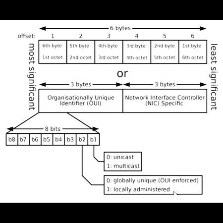

# অক্টেট
অক্টেট (Octet) হল একটি কম্পিউটার সিস্টেমে ব্যবহৃত একটি শব্দ, যা ৮ বিটের একটি গ্রুপ বা একককে বোঝায়। এক বিট একটি সিস্টেমের সবচেয়ে ছোট তথ্যের একক, এবং ৮টি বিট একত্রিত হয়ে একটি অক্টেট তৈরি করে।

IPv4 ঠিকানার ক্ষেত্রে, একটি IP ঠিকানা মোট ৪টি অক্টেট নিয়ে গঠিত হয়। প্রতিটি অক্টেট ৮ বিটের সমন্বয়ে তৈরি হয়, যা একটি পূর্ণসংখ্যা হিসেবে ০ থেকে ২৫৫ পর্যন্ত মান ধারণ করতে পারে। উদাহরণস্বরূপ, একটি IP ঠিকানা যেমন 192.168.10.15-এ:

| 192 | . | 168 | . | 10 | . | 15 |  
| -- | -- | -- | --| -- | -- | -- | 
| 11111111 | . | 11111111 | . | 11111111 | . | 1111111 | . | 11111111 |  

```css
11111111 + 11111111 + 1111111 + 11111111

8+8+8+8 = 32
```

192 প্রথম অক্টেট
168 দ্বিতীয় অক্টেট
10 তৃতীয় অক্টেট
15 চতুর্থ অক্টেট
এটি একটি ৪টি অক্টেটের সিস্টেম, যেখানে প্রতিটি অক্টেট ৮ বিট বা ১ বাইটের সমান।

# IP ঠিকানা

IP অ্যাড্রেস একটি লেয়ার 3-এ লজিক্যাল অ্যাড্রেস যা একটি অ্যাডমিনিস্ট্রেটর দ্বারা নির্ধারিত হয়। MAC অ্যাড্রেসের মতো যা সাধারণত হার্ড-কোডেড থাকে, একটি IP অ্যাড্রেস একটি নেটওয়ার্কের সাবনেটের মধ্যে পরিবর্তিত হতে পারে, উদাহরণস্বরূপ DHCP বা ডায়নামিক হোস্ট কনফিগারেশন প্রোটোকলের মাধ্যমে। এটি ডিভাইসগুলোকে নেটওয়ার্কে চিহ্নিত করতে ব্যবহৃত হয় এবং রাউটার তাদের গন্তব্য IP অ্যাড্রেসের উপর ভিত্তি করে ট্রাফিক রাউট করে। একটি IP অ্যাড্রেস ঠিক যেমন একটি বাড়ি তার ঠিকানা দ্বারা চিহ্নিত হয়, একটি নেটওয়ার্কে একটি ডিভাইসও তার IP অ্যাড্রেসের মাধ্যমে চিহ্নিত হয়।

DNS বা ডোমেন নেম সার্ভিস নামক একটি প্রোটোকল সহজে মনোযোগযোগ্য ডোমেন নাম যেমন "yahoo.com" বা "cisco.com"-কে IP অ্যাড্রেসে রূপান্তর করে। উদাহরণস্বরূপ, "yahoo.com" IP অ্যাড্রেসে রূপান্তরিত হয়ে 87.248.112.181 এ পৌঁছায়। এটি ঠিক যেমন একটি ফোনবুক ব্যবহার করে মানুষের নাম খুঁজে বের করা হয়। DNS-এর মাধ্যমে IP অ্যাড্রেস রেজল্ভ করার মাধ্যমে ডিভাইসগুলো যোগাযোগ স্থাপন করে।

উদাহরণস্বরূপ, HP ডোমেনটি 15.192.45.139 IP অ্যাড্রেসে রূপান্তরিত হয়। কিছু ওয়েবসাইটে ICMP (পিং) ব্যবহার নিষেধ থাকায় অনুরোধ সময়ের মধ্যে পূর্ণতা লাভ করে না। তবে DNS সার্ভারটি IP অ্যাড্রেস রেজল্ভ করে দেয়। HP-এর 15 ক্লাস A পাবলিক অ্যাড্রেস রেঞ্জের আওতায় থাকে, এবং এর প্রথম অক্ষরে "15" থাকলে এটি HP-এর IP অ্যাড্রেসের অধীনস্থ।

অন্য একটি উদাহরণ হলো গুগল-এর জন্য DNS রেজল্ভ 74.125.233.50 IP অ্যাড্রেসে পৌঁছায়। এটি DNS-এর মাধ্যমে একটি সহজ নামের IP অ্যাড্রেসে রূপান্তরের একটি বাস্তব উদাহরণ।

সংক্ষেপে বললে, ইন্টারনেটে সংযুক্ত ডিভাইসগুলো আইপি ভার্সন ৪ (IPv4) ঠিকানার মাধ্যমে সংযোগ স্থাপন করে। তবে এখন বুঝে নেওয়া গুরুত্বপূর্ণ যে, প্রতিটি ডিভাইসের একটি আইপি ঠিকানা থাকে, যা স্থানীয় কম্পিউটার সিস্টেমে ipconfig কমান্ডের মাধ্যমে দেখা যায়। উদাহরণস্বরূপ, উইন্ডোজে আমি 192.168.0.60 আইপি ঠিকানাটি ব্যবহার করছি।
এছাড়াও, আমার একটি আইপি ভার্সন ৬ (IPv6) ঠিকানাও আছে, যেমন 2001:0db8:0000:0000:0000:0000:0000:0001। বর্তমানে, আমরা আইপি ভার্সন ৪ নিয়ে আলোচনা করছি, তবে ভবিষ্যতে আইপি ভার্সন ৬-ও গুরুত্বপূর্ণ হয়ে উঠছে।


পুনরায় বলতে গেলে, প্রতিটি ওয়েবসাইট বিভিন্ন আইপি ঠিকানায় রেজলভ হয়। উদাহরণস্বরূপ, যদি আমি CNN.com পিং করি, লক্ষ্য করুন যে এটি পূর্ববর্তী উদাহরণের মতো একই আইপি ঠিকানায় রেজলভ হয় না। এটি ডিএনএস (DNS) নাম রেজলভেশনের মাধ্যমে ঘটে, যা একটি ডোমেন নামকে আইপি ঠিকানায় রূপান্তরিত করে। এই প্রক্রিয়ার মাধ্যমে আমি CNN.com বা Google.com এর আইপি ঠিকানা জানতে পারি। আপনি ইন্টারনেটে অনেক বিখ্যাত ওয়েবসাইটের পিং পরীক্ষা করতে পারেন বা ডিএনএস রেজলভেশনের জন্য **"লুক আপ"** ব্যবহার করতে পারেন। এটি সাধারণত পিং ছাড়া শুধুমাত্র নাম রেজলভেশনের কাজ করে।


 TCP (Transmission Control Protocol) একটি সংযোগভিত্তিক প্রটোকল যেখানে সংযোগ তৈরি এবং নিশ্চিতীকরণের জন্য তিনটি ধাপ (three-way handshake) সম্পন্ন হয়। কিন্তু আইপি (IP) প্রটোকল প্রতিটি প্যাকেটকে স্বাধীনভাবে প্রেরণ করে এবং কোনও সংযোগ তৈরি করে না। রাউটার প্যাকেটের পথ নির্ধারণে বিভিন্ন মানদণ্ডের উপর ভিত্তি করে সিদ্ধান্ত গ্রহণ করে, যেমন লোড ব্যালেন্সিং, ব্যান্ডউইথ বা হপ কাউন্ট। বিভিন্ন রাউটিং প্রটোকল যেমন RIP, OSPF এসব মানদণ্ডের মাধ্যমে সবচেয়ে ভাল পথ নির্বাচন করে। এই রাউটিং প্রটোকলগুলি ট্রাফিকের জন্য সর্বোত্তম রাউট নির্ধারণে ব্যবহৃত হয়। আইপি প্রটোকল অবশ্যই প্যাকেট ডেলিভারির জন্য সর্বোচ্চ প্রচেষ্টা করবে, কিন্তু এটি গ্যারান্টি দেয় না যে প্যাকেটগুলি ঠিক মতো পৌঁছাবে। ট্রান্সমিশনের সময় প্যাকেট হারিয়ে যাওয়া, দ্বিগুণ হওয়া বা ক্ষতিগ্রস্ত হওয়া সম্ভাব্য। এটি TCP বা UDP সহ বিভিন্ন উচ্চ স্তরের প্রটোকল দ্বারা মোকাবিলা করা হয়। 


উদাহরণস্বরূপ, আপনি যদি নিউজ পড়তে cnn.com বা usatoday.com-এ যান, তখন আপনার আইপ্যাড সেই সার্ভারের সাথে যোগাযোগের জন্য ট্রাফিক পাঠায় এবং সার্ভার আবার সেই ট্রাফিকটি আপনার ডিভাইসে ফেরত পাঠায়। এর জন্য রাউটারগুলো ট্রাফিকের পথ নির্ধারণ করে এবং গন্তব্য সার্ভারে পৌঁছায়। এই প্রক্রিয়াটি নেটওয়ার্ক এবং হোস্ট অংশের মাধ্যমে সম্পন্ন হয়।
একটি তুলনা দ্বারা বুঝতে হলে শহরের একটি রাস্তা ধরে চলার মতো ভাবুন। একটি রাস্তার নাম যেমন অক্সফোর্ড স্ট্রিট (Oxford St.) রয়েছে এবং সেই রাস্তার মধ্যে বিভিন্ন বাড়ি রয়েছে, যেমন ১ অক্সফোর্ড স্ট্রিট, ২ অক্সফোর্ড স্ট্রিট, ৩ অক্সফোর্ড স্ট্রিট। প্রতিটি বাড়ির একটি ইউনিক নম্বর থাকে, যা সেই বাড়িটিকে নির্দিষ্ট করে। এভাবে নেটওয়ার্ক ঠিকানাগুলিও নির্দিষ্ট নেটওয়ার্কের প্রতিনিধিত্ব করে, এবং হোস্ট ঠিকানাগুলো একটি নির্দিষ্ট ডিভাইসের প্রতিনিধিত্ব করে।
যখন রাউটার কোনও গন্তব্যে পৌঁছানোর পথ নির্ধারণ করে, তখন সে রাস্তার নাম বা নেটওয়ার্ক ঠিকানা দেখে এবং সঠিক গন্তব্য নেটওয়ার্কে পৌঁছানোর জন্য রাউটিং টেবিল ব্যবহার করে। তবে নির্দিষ্ট ডিভাইসে ট্রাফিক পৌঁছানোর জন্য আইপি ঠিকানা বা হোস্ট আইডি ব্যবহার করা হয়। উদাহরণস্বরূপ, 10.1.1.0 একটি নেটওয়ার্কের প্রতিনিধিত্ব করে এবং 10.1.1.1 একটি ডিভাইসের প্রতিনিধিত্ব করে যা ঐ নেটওয়ার্কের মধ্যে একটি নির্দিষ্ট ডিভাইস হতে পারে।
আরপর মতো কিছু প্রোটোকল (ARP) ট্রাফিকের গন্তব্যে পৌঁছানোর জন্য হোস্ট ঠিকানাগুলির সঠিক অবস্থান খুঁজে বের করতে সাহায্য করে। রাউটার শুধুমাত্র নেটওয়ার্ক ঠিকানার উপর ভিত্তি করে ট্রাফিকের পথ নির্ধারণ করে এবং নির্দিষ্ট ডিভাইসে পৌঁছানোর জন্য হোস্ট ঠিকানা ব্যবহার করে। রাউটিং টেবিল শুধুমাত্র নেটওয়ার্ক ঠিকানাগুলির সাথে পূর্ণ থাকে, এবং ট্রাফিক পৌঁছানোর জন্য ডেটা টেবিলের ভিত্তিতে গন্তব্য ঠিকানা মিলিয়ে সিদ্ধান্ত নেওয়া হয়।

একটি আইপি ঠিকানা দুটি প্রধান অংশ নিয়ে গঠিত: নেটওয়ার্ক ঠিকানা অংশ (Network Address Portion) এবং হোস্ট ঠিকানা অংশ (Host Address Portion)। নেটওয়ার্ক ঠিকানা, যাকে নেটওয়ার্ক আইডি (Network ID) বলা হয়, একটি নির্দিষ্ট নেটওয়ার্কের প্রতিনিধিত্ব করে এবং রাউটাররা রাউটিং টেবিল তৈরি করার সময় নেটওয়ার্ক ঠিকানার উপর ভিত্তি করে কাজ করে, হোস্ট ঠিকানার উপর নয়। এর মানে হল যে রাউটাররা সরাসরি আইপি ঠিকানাগুলির উপর ভিত্তি করে ট্রাফিক পরিচালনা করে না, বরং শুধুমাত্র নেটওয়ার্ক ঠিকানার উপর ভিত্তি করে রাউটিং সিদ্ধান্ত গ্রহণ করে। আইপি ঠিকানার নেটওয়ার্ক অংশ একটি নির্দিষ্ট নেটওয়ার্কের প্রতিনিধিত্ব করে এবং হোস্ট অংশ, যাকে হোস্ট আইডি (Host ID) বলা হয়, একটি নির্দিষ্ট ডিভাইস বা এন্ডপয়েন্টের প্রতিনিধিত্ব করে। এই ডিভাইসগুলির মধ্যে একটি কম্পিউটার, সার্ভার, স্মার্টফোন বা অন্যান্য ডিভাইস হতে পারে।

আমরা IP ঠিকানা লিখি, তখন আমরা এটি ৪টি অক্টেটের একটি সেট হিসেবে ডটেড ডেসিমেল ফরম্যাটে লিখি। আপনি এখানে একটি IPv4 ঠিকানার উদাহরণ দেখছেন, যেমন 192.168.10.15। প্রতিটি সংখ্যার সেট একটি অক্টেট। সুতরাং, 192 প্রথম অক্টেট, 168 দ্বিতীয়, 10 তৃতীয়, এবং 15 চতুর্থ অক্টেট। প্রতিটি অক্টেট ৮ বিট দীর্ঘ। ৮ বিটের কারণে এটিকে অক্টেট বলা হয়, এবং যদি আপনি ৮ গুণ ৪ করেন, তাহলে আপনি ৩২ বিট পাবেন যা IPv4 ঠিকানাকে গঠন করে।

| 192 | . | 168 | . | 10 | . | 15 |  
| -- | -- | -- | --| -- | -- | -- | 
| 11111111 | . | 11111111 | . | 11111111 | . | 1111111 | . | 11111111 |  
| 255 | . | 255 | . | 255 | . | 255  | 

```css
8 * 4 = 32
```

আইপি অ্যাড্রেসে ৪টি অকটেট থাকে। প্রতিটি অকটেটের মান ০ থেকে ২৫৫-এর মধ্যে হয় এবং এর জন্য কিছু নিয়ম অনুসরণ করতে হয়। একটি নেটওয়ার্কে প্রতিটি কম্পিউটারের নিজস্ব আইপি অ্যাড্রেস প্রয়োজন। এই আইপি অ্যাড্রেস একটি সাবনেট মাস্ক এবং একটি ডিফল্ট গেটওয়ের সাথে সংযুক্ত থাকে। আইপি অ্যাড্রেস আপনার অবস্থানকে নির্ধারণ করে, অর্থাৎ অন্যরা কীভাবে আপনার নেটওয়ার্কে পৌঁছাবে। আর সাবনেট মাস্ক নির্ধারণ করে আপনার আশপাশের এলাকা বা নেটওয়ার্ককে। উদাহরণস্বরূপ, 172.30.100.30 এবং 255.255.255.0 এই দুটি আইপি এবং সাবনেট মাস্কে আপনি যে নেটওয়ার্কে আছেন তা বোঝা যায়।

প্রথমে উইন্ডোজে কটি কমান্ড প্রম্পট খুলব, তাই CMD দিয়ে কমান্ড প্রম্পট খুলতে হবে, এবং উইন্ডোজের কমান্ড 'ipconfig' হল, দেখতে পাবেন আমার IPv4 ঠিকানা হল 192.168.1.9। আমার সাবনেট মাস্ক, যা আপনি পরবর্তী লেকচারে শিখবেন, তা হল 255.255.255.0, যা ডটেড ডেসিমেল ফরম্যাটে। ডিফল্ট গেটওয়ে, যা হল সেই রাউটার যার মাধ্যমে আমার PC অন্য নেটওয়ার্কে পৌঁছানোর জন্য ব্যবহার করবে, তা হল 192.168.1.1। যদি ট্রাফিক একটি ভিন্ন সাবনেটে যাওয়ার জন্য হয়, তবে এটি একটি রাউটার মাধ্যমে সেখানে পৌঁছাতে হবে। আপনি দেখতে পাচ্ছেন, আমার IP ঠিকানা হল 192.168.1.9, যা আমার ল্যাপটপে ব্যবহৃত IP ঠিকানা। অন্য নেটওয়ার্কে যেতে যে রাউটারটি ব্যবহার করব, তার IP ঠিকানা হল 192.168.1.1।

# Internet Control Message Protocol

পিং কীভাবে কাজ করে?
- পিং কমান্ড ICMP (Internet Control Message Protocol) ইকো রিকোয়েস্ট প্যাকেট প্রেরণ করে।
- গন্তব্য ডিভাইস যদি সংযুক্ত থাকে এবং তার কাছে পৌঁছানো সম্ভব হয়, তাহলে এটি ICMP ইকো রিপ্লাই পাঠায়।
- এই রিপ্লাই-এর সময়ের ভিত্তিতে সংযোগের লেটেন্সি (Latency) পরিমাপ করা হয়। এটি প্যাকেটের গন্তব্যে পৌঁছাতে এবং ফিরে আসতে কত সময় লাগল তা পরিমাপ করে।
- পিং কমান্ডের সাধারণ সিনট্যাক্সঃ

```bash
ping [হোস্টনেম বা আইপি ঠিকানা]
```

উদাহরণ:
1.	কোনো ওয়েবসাইট পিং করুন:
```bash
ping google.com
```
2.	লোকাল আইপি ঠিকানা পিং করুন:
```bash
ping 192.168.0.60
```
3.	নির্দিষ্ট প্যাকেট সংখ্যা পাঠানোর জন্য (Linux বা Windows):
 - Linux-এ 4টি প্যাকেট পাঠানোর জন্য:
```bash
ping -c 4 google.com
```
 - Windows-এ 4টি প্যাকেট পাঠানোর জন্য:
```bash
ping -n 4 google.com
```
### পিং-এর ফলাফল (Output) উদাহরণঃ
পিং সফল হলে এমন কিছু দেখতে পাবেন:
```plaintext
PING google.com (142.250.190.4) 56(84) bytes of data.
64 bytes from 142.250.190.4: icmp_seq=1 ttl=115 time=12.4 ms
64 bytes from 142.250.190.4: icmp_seq=2 ttl=115 time=12.1 ms
64 bytes from 142.250.190.4: icmp_seq=3 ttl=115 time=12.3 ms
64 bytes from 142.250.190.4: icmp_seq=4 ttl=115 time=12.2 ms

--- google.com ping statistics ---
4 packets transmitted, 4 received, 0% packet loss, time 3063ms
rtt min/avg/max/mdev = 12.1/12.3/12.4/0.1 ms
```

### মূল শব্দ:
1.	লেটেন্সি __(*Latency*)__: প্যাকেট গন্তব্যে পৌঁছানোর জন্য সময়। সাধারণত মিলিসেকেন্ড __(*ms*)__ এ মাপা হয়।
2.	প্যাকেট লস __(*Packet Loss*)__: যদি কোনো প্যাকেট গন্তব্যে পৌঁছতে ব্যর্থ হয়, তাহলে এটি প্যাকেট লস নির্দেশ করে। এটি সংযোগে সমস্যা নির্দেশ করতে পারে।
3.	**TTL** (Time to Live): প্যাকেট কতগুলো হপ পেরিয়ে যেতে পারবে তা নির্ধারণ করে। এটি প্যাকেটকে চিরকাল চলতে বাধা দেয়।
### পিং-এর উপকারিতা:
1.	**সংযোগ পরীক্ষা**: ডিভাইসের সংযোগ সঠিক কিনা পরীক্ষা করতে।
2.	**নেটওয়ার্ক লেটেন্সি পরিমাপ**: কত দ্রুত সংযোগ স্থাপন হচ্ছে তা যাচাই করতে।
3.	**প্যাকেট লস নির্ধারণ**: ডেটা ট্রান্সমিশনে সমস্যা আছে কিনা বোঝার জন্য।
4.	**DNS সমস্যা পরীক্ষা**: ডোমেইন নাম সঠিক IP ঠিকানায় রেজলভ হচ্ছে কিনা তা যাচাই করতে।
5.	**ফায়ারওয়াল পরীক্ষা**: ফায়ারওয়াল সঠিকভাবে কাজ করছে কিনা যাচাই করতে।

# ARP
এআরপি (ARP) কী এবং এটি কীভাবে কাজ করে?

এআরপি (ARP - Address Resolution Protocol) হলো একটি নেটওয়ার্ক প্রোটোকল যা একটি ডিভাইসের আইপির (IP Address) সাথে সংশ্লিষ্ট ম্যাক ঠিকানা (MAC Address) নির্ধারণে ব্যবহৃত হয়। এটি সাধারণত LAN (Local Area Network)-এ ডিভাইসগুলির মধ্যে যোগাযোগের জন্য গুরুত্বপূর্ণ ভূমিকা পালন করে।

এআরপি কী করে?

এআরপ একটি ডিভাইসের জন্য তার আইপির (IP Address) উপর ভিত্তি করে ম্যাক ঠিকানা (MAC Address) খুঁজে বের করে। এটি দুটি প্রধান কাজ সম্পাদন করে:
1.	একটি ডিভাইসের IP Address-এর জন্য ম্যাক ঠিকানা সন্ধান করা।
2.	ডেটা প্রেরণের জন্য সঠিক ম্যাক ঠিকানা ব্যবহার করা।

### এআরপির কাজের প্রক্রিয়া (How ARP Works)
ধরি আমাদের একটি LAN-এ দুটি ডিভাইস রয়েছে:

 - Source Device (A): যেটি ডেটা প্রেরণ করতে চায়।
 - Destination Device (B): যেটির কাছে ডেটা পাঠাতে হবে।
   
এখন এই দুটি ডিভাইসের মধ্যে সংযোগ স্থাপনের জন্য এআরপি কীভাবে কাজ করবে তা নিচে ব্যাখ্যা করা হলো:

1. **ARP Request** (রিকোয়েস্ট প্রেরণ)

যখন Source Device একটি নির্দিষ্ট IP ঠিকানায় ডেটা প্রেরণ করতে চায়, তবে সে সেই আইপির সাথে সংশ্লিষ্ট ম্যাক ঠিকানা জানে না। এ সময় সে একটি ARP Request প্রেরণ করবে।
এই রিকোয়েস্টটি LAN-এ ব্রডকাস্ট (Broadcast) করা হয়।

উদাহরণস্বরূপ:

যদি Source Device A ডিভাইসটির IP Address 192.168.1.5 এর ম্যাক ঠিকানা জানতে চায়, তবে ARP Request-এর মাধ্যমে LAN-এ একটি বার্তা পাঠায়:
```arduino
"192.168.1.5 এর জন্য ম্যাক ঠিকানা কোনটি?"
```
এই ARP Request টি LAN-এ সংযুক্ত সমস্ত ডিভাইসের কাছে পৌঁছে যায়।

2. **ARP Reply** (রিপ্লাই প্রেরণ)

যদি Destination Device (B) আইপির সাথে ম্যাক ঠিকানা সম্পর্কিত থাকে, তাহলে এটি ARP Reply প্রেরণ করবে।

উদাহরণস্বরূপ:

Destination Device-টির ম্যাক ঠিকানা 00:1A:2B:3C:4D:5E, এটি ARP Reply-এর মাধ্যমে Source Device-কে জানায়:
```arduino
"192.168.1.5 এর ম্যাক ঠিকানা হল 00:1A:2B:3C:4D:5E"
```
এই রিপ্লাইটি শুধুমাত্র Source Device-এর কাছে পৌঁছায়, অর্থাৎ সরাসরি ARP রেসপন্স প্রেরণ করা হয়।

3. **ARP Cache** এ ম্যাক ঠিকানা সংরক্ষণ
Source Device ARP Reply পাওয়ার পর সেই ম্যাক ঠিকানাটি তার ARP Cache-এ সংরক্ষণ করে। ARP Cache হলো একটি টেবিল, যেখানে আইপি এবং ম্যাক ঠিকানাগুলির মধ্যে সম্পর্ক সংরক্ষিত থাকে।
তাহলে ভবিষ্যতে আরেকটি ডেটা প্রেরণের সময় ARP Request-এর প্রয়োজন হবে না।

উদাহরণঃ

ধরি, Source Device A ডেটা Destination Device B-তে পাঠাতে চায়:

1.	Source Device A-এ একটি ARP Request তৈরি হয় এবং LAN-এ ব্রডকাস্ট হয়:
```arduino
"192.168.1.5 এর ম্যাক ঠিকানা কোনটি?"
```
2.	Destination Device B তার ম্যাক ঠিকানা পাঠায় ARP Reply-এর মাধ্যমে:
```arduino
"00:1A:2B:3C:4D:5E"
```
3.	Source Device A তার ARP Cache-এ 192.168.1.5 এর সাথে 00:1A:2B:3C:4D:5E ম্যাক ঠিকানা সংরক্ষণ করে।
4.	এরপর Source Device A এই ম্যাক ঠিকানার মাধ্যমে ডেটা Destination Device B-তে প্রেরণ করবে।

ARP কিভাবে সমস্যা সৃষ্টি করতে পারে?
1.	ARP Spoofing / ARP Poisoning:
 - এটি একটি হামলা পদ্ধতি যেখানে হ্যাকার ARP Replies এর মাধ্যমে ভুল ম্যাক ঠিকানা প্রেরণ করে। এর ফলে, ডেটা হ্যাকার বা আক্রমণকারী ডিভাইসে চলে যায়।
3.	নেটওয়ার্ক ট্রাফিক সমস্যা:
 - যদি ARP Request বা রিপ্লাই-এর সংখ্যা খুব বেশি হয়, তাহলে LAN-এ ট্রাফিকের সমস্যা সৃষ্টি হতে পারে।


উপসংহার:
ARP (Address Resolution Protocol) হলো একটি প্রোটোকল যা একটি ডিভাইসের IP ঠিকানা থেকে তার ম্যাক ঠিকানা নির্ধারণে ব্যবহৃত হয়। এটি LAN-এ ডিভাইসগুলির মধ্যে সংযোগ এবং ডেটা প্রেরণের জন্য একটি গুরুত্বপূর্ণ ভূমিকা পালন করে।
ARP Request এবং ARP Reply এর মাধ্যমে একটি নির্দিষ্ট IP ঠিকানার সাথে সংশ্লিষ্ট ম্যাক ঠিকানা খুঁজে বের করে ডেটা প্রেরণ সক্ষম হয়।

# MAC Address
MAC ঠিকানা (MAC Address) কী?
MAC ঠিকানা বা Media Access Control Address হলো একটি ইউনিক হার্ডওয়্যার ঠিকানা যা একটি ডিভাইসের নেটওয়ার্ক ইন্টারফেস (যেমন নেটওয়ার্ক কার্ড বা ওয়াই-ফাই অ্যাডাপ্টার) এর সাথে সংযুক্ত থাকে। এটি একটি স্থায়ী এবং অনন্য ঠিকানা যা একটি নির্দিষ্ট ডিভাইসের জন্য নির্ধারিত থাকে।

এখন চলুন আমরা একটি MAC ঠিকানাকে আরো বিস্তারিতভাবে দেখি, এটি আবার ৬ বাইটের দৈর্ঘ্য। এবং যদি আপনি মনে করেন, একটি বাইটের দৈর্ঘ্য ৮ বিট, তাই ৬ x ৬ এর ফলে ৪৮ বিট হয়। ৩ বাইট বা ২৪ বিট হল ঠিকানার OUI অংশ। ৩ বাইট বা ২৪ বিট হল নেটওয়ার্ক ইন্টারফেস কার্ড (NIC)-এর জন্য নির্দিষ্ট অংশ এবং এটি ওই নেটওয়ার্ক ইন্টারফেস কার্ডের ইউনিক আইডেন্টিফায়ার। এখন OUI অংশের প্রথম অক্টেটে বা সর্বাধিক গুরুত্বপূর্ণ অক্টেটে, অন্য কথায় OUI এর প্রথম বাইটে, শেষ বিট, অর্থাৎ প্রথম অক্টেটের শেষ বিট বা প্রথম বাইটের শেষ বিট, সেট করা হয় ০, যা ইউনিকাস্ট নির্দেশ করে বা সেট করা হয় ১, যা মাল্টিকাস্ট নির্দেশ করে। ইউনিকাস্ট ট্রাফিক যদি আপনি মনে রাখেন, দুইটি ডিভাইসের মধ্যে একটি সংলাপ, যেখানে এক ডিভাইস ট্রাফিক পাঠাচ্ছে এবং অন্য ডিভাইস এটি গ্রহণ করছে। মাল্টিকাস্ট হল যেখানে একটি ডিভাইস একাধিক ডিভাইসকে ট্রাফিক পাঠাচ্ছে যারা মাল্টিকাস্টে সাবস্ক্রাইব করেছে। এটি ইথারনেট সুইচগুলোর জন্য খুবই দক্ষ, কারণ এটি জানে যে ট্রাফিকটি কি সুইচে প্রতিটি পোর্টে প্রেরণ করতে হবে কিনা। যখন মাল্টিকাস্ট ট্রাফিক একটি লেয়ার 2 সুইচ দ্বারা গ্রহণ করা হয়, তখন এটি সমস্ত পোর্টে ফ্লাড করা হয়, যেখানে ইউনিকাস্ট ট্রাফিক সাধারণত ফ্লাড করা হয় না। তাই ফ্রেমের বিটটি পড়ে, লেয়ার 2 সুইচ জানে কিভাবে ট্রাফিক প্রক্রিয়া করতে হবে। প্রথম অটেক্টের দ্বিতীয় সর্বনিম্ন বিট, অর্থাৎ আমরা এখনও প্রথম অটেক্টের দিকে তাকাচ্ছি, তবে দ্বিতীয় সর্বনিম্ন বিটটি ০ সেট করা হয় যা নির্দেশ করে এটি একটি বৈশ্বিকভাবে অনন্য MAC ঠিকানা বা এটি ১ সেট করা হয় যা নির্দেশ করে যে একজন প্রশাসক MAC ঠিকানা পরিবর্তন করেছেন। 



ইথারনেটের মধ্যে, যখন একটি বাস টপোলজি ব্যবহার করা হয়, তখন ডিভাইসগুলি যা ব্যবহার করে সেটি হলো ক্যারিয়ার সেন্স মাল্টিপল অ্যাক্সেস / কোলিশন ডিটেকশন বা CSMA/CD। এটি এইভাবে কাজ করে, যখন একটি ডিভাইস ট্রাফিক পাঠাতে চায়, এটি প্রথমে শুনতে চায় যদি অন্য কোন ডিভাইস কথা বলছে। তাই ডিভাইসটি নেটওয়ার্কে যোগাযোগ করবে না যদি এটি অন্য কোনো ডিভাইস শোনে, এটিকে বলা হয় ক্যারিয়ার সেন্স, ক্যারিয়ার সেন্স হল মূলত নেটওয়ার্কে অন্য কোনো ডিভাইস কথা বলছে কিনা তা শোনা। মাল্টিপল অ্যাক্সেস মানে হলো যে কোনো ডিভাইস সেই সেগমেন্টে যোগাযোগ করতে পারে যদি অন্য কোনো ডিভাইস কথা না বলে। এটি পুরনো মেইনফ্রেম দিনগুলির থেকে আলাদা যেখানে একটি কেন্দ্রীয় ডিভাইস টার্মিনালগুলোকে যোগাযোগ করার অনুমতি দিতে পোল করত। ইথারনেটের মধ্যে আমরা একটি বিতরণ করা পরিবেশ ব্যবহার করছি যেখানে প্রতিটি ডিভাইস স্বাধীনভাবে নেটওয়ার্কে যোগাযোগ করতে পারে অন্য ডিভাইসগুলোর অনুমতি ছাড়া। তবে একটি ডিভাইস শুধুমাত্র ট্রাফিক প্রেরণ করবে যদি কোনো অন্য ডিভাইস কথা না বলে এবং এটি কারণ আমরা ইথারনেট পরিবেশে সংঘর্ষ এড়াতে চাই। একটি অন্য রূপক হিসেবে যখন ঐতিহ্যবাহী টেলিফোনগুলি PDX এর সাথে সংযুক্ত থাকে, তখন PDX যোগাযোগের জন্য দায়িত্বে থাকে। কিন্তু ইথারনেট পরিবেশে এটা সত্য নয়, প্রতিটি ডিভাইস অন্য ডিভাইস থেকে স্বাধীন থাকে। তবে যদি সংঘর্ষ ঘটে, তখন ইথারনেটে সংঘর্ষ সনাক্ত করার একটি অপশন আছে। যখন একটি ডিভাইস দেখে যে একটি সংঘর্ষ ঘটেছে, তখন এটি একটি ব্যাক অফ বা জামিং সিগন্যাল পাঠাতে পারে যা জানিয়ে দেয় যে একটি সংঘর্ষ ঘটেছে। একে একে এই পরিবেশে, টার্মিনেটরগুলো ব্যবহার করা হয় কেবলটির শেষে যাতে সংকেতগুলি ফিরে না আসে এবং অতিরিক্ত সংঘর্ষ সৃষ্টি না হয়। এখন একটি নির্দিষ্ট পরিস্থিতিতে এটি ঘটতে পারে যে দুটি ডিভাইস একেবারে একই সময় যোগাযোগ করতে চায়, তবে সেই সময়ে, কোনো ডিভাইস কথা বলছে না। যেমন ধরুন এই উদাহরণে A চায় C এর সাথে যোগাযোগ করতে। তাই A চায় নেটওয়ার্কে ট্রাফিক পাঠাতে যা A এর সোর্স ঠিকানা এবং C এর গন্তব্য ঠিকানা থাকবে। তবে ঠিক সেই সময়, D ও যোগাযোগ করতে চায়। এই ক্ষেত্রে D চায় B এর সাথে যোগাযোগ করতে। তাই এটি চায় নেটওয়ার্কে ট্রাফিক পাঠাতে যার সোর্স ঠিকানা D এবং গন্তব্য ঠিকানা B। এখন CSMA/CD অনুসারে, A এবং D উভয়ই প্রথমে চেক করে দেখে যে কেউ কি কথা বলছে। তাই তারা ক্যারিয়ার সেন্স বা CS ব্যবহার করে তারে চেক করবে। সেই সময়ে, নেটওয়ার্কে কোনো ডিভাইস কথা বলছে না। তবে, মাল্টিপল অ্যাক্সেসের কারণে কোনো ডিভাইস যেকোনো সময় কেবলে অ্যাক্সেস করতে পারে, অন্য কোনো ডিভাইসের অনুমতি ছাড়াই। তাই A এবং D উভয়ই নেটওয়ার্কে ট্রাফিক পাঠাতে শুরু করবে, তবে যেহেতু এটি 10base2 বা অন্য কথায় বেসব্যান্ড, কেবলে একবারে একটিই সংকেত পাঠানো যেতে পারে। তাই এই উদাহরণে একটি সংঘর্ষ ঘটে। এখন যদি A ট্রান্সমিটিং ডেটা স্টেশন বা পিসি তার ফ্রেম ট্রান্সমিট করার সময় তারে অন্য কোনো সংকেত সনাক্ত করে, তখন এটি ট্রান্সমিট করা বন্ধ করে দেয় এবং একটি জামিং সিগন্যাল পাঠায় এবং তারপর একটি এলোমেলো সময়ের জন্য অপেক্ষা করে যা ব্যাক অফ ডিলে নামে, তারপর আবার সংকেত পাঠানোর চেষ্টা করে। এটি প্রতিরোধ করবে যে মেশিন বা পিসি একই সময় পুনরায় পাঠানোর চেষ্টা করবে। তবে, সংঘর্ষের সম্ভাবনা বৃদ্ধি পায় যখন কেবলটির দৈর্ঘ্য বৃদ্ধি পায় এবং আরো ডিভাইস যুক্ত করা হয়। অন্য কথায়, এটি আরও সম্ভাব্য যে সংঘর্ষ ঘটবে যখন কেবল দৈর্ঘ্য বেশি এবং ডিভাইসের সংখ্যা বাড়বে। তাই যত বেশি ডিভাইস আপনি এই নেটওয়ার্কে যোগ করবেন এবং কেবলের দৈর্ঘ্য বাড়াবেন, সংঘর্ষের সম্ভাবনা তত বেশি বেড়ে যাবে।

10base2 এর একটি সমস্যা ছিল ক্যাবলের দৈর্ঘ্য। যত বড় হবে ক্যাবল, তত বেশি সংকেতের অবনতি হতে পারে। অন্য কথায়, ক্যাবল যত দীর্ঘ হবে, তত বেশি সম্ভাবনা থাকে যে একটি হোস্টের সংকেত আরেকটি হোস্টের কাছে পৌঁছাবে না। ক্যাবলের একপ্রান্তে একটি হোস্ট সংকেত পাঠাতে পারে, কিন্তু অবনতি হওয়ায় ক্যাবলের অপর প্রান্তে থাকা হোস্ট সেই সংকেত গ্রহণ বা বিশ্লেষণ করতে পারবে না। অন্য একটি সমস্যা ছিল ক্যাবল ভেঙে যাওয়া। ক্যাবলে কোথাও একটি ভাঙন ঘটলে পুরো নেটওয়ার্ক বন্ধ হয়ে যেত। যদি কেউ ভুলক্রমে ক্যাবল ভেঙে ফেলত, তাহলে পুরো নেটওয়ার্ক কাজ করত না। হোস্ট A অন্যান্য ডিভাইসের সঙ্গে যোগাযোগ করতে পারত না এবং সেগুলি হোস্ট A এর সঙ্গে যোগাযোগ করতে পারত না। এই ক্যাবল ভাঙনের কারণে ক্যাবলে কোনো টার্মিনেটর না থাকায় সংকেত প্রতিফলিত হতো। ফলে, ডিভাইস D যদি C এর কাছে সংকেত পাঠাতো, তবে তা ক্যাবল ধরে চলে যেত এবং প্রতিফলিত হয়ে নেটওয়ার্কে সংঘর্ষ সৃষ্টি করতো। তাই এই নেটওয়ার্কটি খুবই দুর্বল ছিল এবং ক্যাবল ভাঙলে পুরো নেটওয়ার্ক ব্যাহত হয়ে যেত। এরপর আরও খারাপ ছিল, 10base2 বলতে 10Mbps Ethernet বোঝানো হয়, কিন্তু এটি প্রতিটি ডিভাইসের জন্য 10Mbps নয়, বরং পুরো সেগমেন্টের জন্য এটি ভাগ হয়ে যায়। তাছাড়া, সংঘর্ষের কারণে ব্যবহৃত ব্যান্ডউইথ 30-40% এর মধ্যে সীমাবদ্ধ থাকে। এর মানে হল যে 30-40% ব্যবহারযোগ্যতা পাওয়া যায়। উদাহরণস্বরূপ, যদি সেগমেন্টে 4টি ডিভাইস থাকে, তবে 10Mbps ভাগ করে নেওয়া হয় 4টি ডিভাইসের মধ্যে, যার ফলে প্রতিটি ডিভাইসের জন্য 0.75Mbps পাওয়া যায়, যা 10Mbps নয়। এটি আদর্শ নয়, কারণ এই অবস্থায় পিসি বা ডিভাইসের জন্য উপলব্ধ ব্যান্ডউইথ খুবই কম হয়ে যায়, বিশেষ করে বড় নেটওয়ার্কে। তাই যত বেশি ডিভাইস নেটওয়ার্কে যুক্ত হবে, প্রতিটি ডিভাইসের জন্য ব্যান্ডউইথ তত কম হবে। এটি একটি একক সংঘর্ষ ডোমেন হিসেবেও পরিচিত, যার মানে হল যে নেটওয়ার্কের যে কোনো পয়েন্টে সংঘর্ষ হলে, ওই নেটওয়ার্কের সকল ডিভাইসের ওপর তার প্রভাব পড়বে এবং তাদেরকে ব্যাক অফ করতে হবে।


MAC ঠিকানার বৈশিষ্ট্য (Features of MAC Address)
1.	**ইউনিক:**
প্রতিটি ডিভাইসের ম্যাক ঠিকানা অনন্য। এটি একই নেটওয়ার্কে দুটি ডিভাইসের মধ্যে সংঘর্ষ (conflict) ঘটায় না।
2.	**হার্ডওয়্যার লেভেলে নির্ধারিত:**
MAC ঠিকানা ডিভাইসের হার্ডওয়্যারের সাথে যুক্ত থাকে এবং ডিভাইসের হার্ডওয়্যার পরিবর্তন না হওয়া পর্যন্ত এটি অপরিবর্তিত থাকে।
3.	**12টি হেক্সাডেসিমেল ডিজিট:**
MAC ঠিকানা 12টি হেক্সাডেসিমেল (0-9 এবং A-F) চিহ্ন দিয়ে গঠিত।
4.	**6 বাইটের গঠন:**
MAC ঠিকানা 48-বিটের একটি সংখ্যা, যা সাধারণত 6টি হেক্সাডেসিমেল সংখ্যা দিয়ে প্রকাশ করা হয়।

#### MAC ঠিকানার গঠন (Structure of MAC Address)
MAC ঠিকানা সাধারণত নিচের ফরম্যাটে থাকে:
XX:XX:XX:XX:XX:XX
 - প্রথম 3টি অক্ষর (প্রথম 24 বিট):
এটি OUI (Organizationally Unique Identifier) বা প্রতিষ্ঠান নির্ধারিত অংশ, যা একটি নির্দিষ্ট কোম্পানির ডিভাইসের সাথে সংযুক্ত থাকে।
উদাহরণস্বরূপ, Apple-এর MAC ঠিকানাগুলিতে নির্দিষ্ট OUI থাকে।
 - পরবর্তী 3টি অক্ষর (শেষ 24 বিট):
এটি নির্দিষ্ট ডিভাইসের জন্য নির্ধারিত ইউনিক অংশ।

উদাহরণ:
একটি MAC ঠিকানার উদাহরণ হতে পারে:
00:1A:2B:3C:4D:5E
এখানে:
•	00:1A:2B: এটি ডিভাইস প্রস্তুতকারকের OUI।
•	3C:4D:5E: এটি নির্দিষ্ট ডিভাইসের ইউনিক আইডি।

#### MAC ঠিকানা কোথায় ব্যবহৃত হয়?
1.	**ইথারনেট এবং ল্যানের জন্য:**
MAC ঠিকানা ডিভাইসগুলির মধ্যে ইথারনেট সংযোগে ডেটা প্রেরণ করতে ব্যবহৃত হয়।
2.	**ওয়াই-ফাই নেটওয়ার্কে:**
ওয়াই-ফাই ডিভাইসগুলির সংযোগ স্থাপন এবং নিরাপত্তা ব্যবস্থাপনায় MAC ঠিকানা ব্যবহৃত হয়।
3.	**নেটওয়ার্ক সিকিউরিটিতে:**
MAC ফিল্টারিংয়ের মাধ্যমে নির্দিষ্ট ডিভাইসকে একটি ওয়াই-ফাই নেটওয়ার্কে অনুমতি বা ব্লক করা হতে পারে।

#### MAC ঠিকানার ভূমিকা কী?
1.	**ডেটা ট্রান্সমিশনে:**
ডেটা প্রেরণের সময় MAC ঠিকানা নির্ধারণ করে ডেটা কোন ডিভাইসে যাবে।
2.	**নিরাপত্তা ব্যবস্থায়:**
MAC ফিল্টারিং ব্যবহারের মাধ্যমে একটি নেটওয়ার্কে অনুমোদিত ডিভাইসগুলিকে সংযোগে সীমাবদ্ধ করা যায়।
3.	**ডিভাইসের সনাক্তকরণে:**
বিভিন্ন ডিভাইসের MAC ঠিকানা একে অপরকে শনাক্ত করার জন্য ব্যবহৃত হয়।

### MAC ঠিকানার সাথে IP ঠিকানার পার্থক্য
| বিষয় | MAC ঠিকানা | IP ঠিকানা |   
| -- | -- | -- |
| ধরন | হার্ডওয়্যার ঠিকানা | লজিক্যাল ঠিকানা |
| উদ্দেশ্য | একটি নির্দিষ্ট ডিভাইসের হার্ডওয়্যারে সংযুক্ত থাকে | নেটওয়ার্কের উপর ডেটা স্থানান্তরের জন্য |
| গঠন | 48 বিটের হেক্সাডেসিমেল সংখ্যা (6টি হেক্সাডেসিমেল ব্লক) | IP ঠিকানা ভের্সন অনুযায়ী পরিবর্তিত হতে পারে (IPv4 বা IPv6) |
| স্থিতি | পরিবর্তনহীন এবং স্থায়ী (হার্ডওয়্যারের সাথে যুক্ত) | পরিবর্তনশীল হতে পারে |
| ব্যবহার স্থান | LAN-এর মধ্যে ডিভাইস শনাক্তকরণে | WAN বা LAN-এর মধ্যে রাউটিংয়ের জন্য |

যেমন A 172.30.100.150 এবং B 172.30.100.30 একে অপরের সাথে যোগাযোগ করার জন্য প্রথমে পিং (ping) ব্যবহার করবে। প্রতিটি অকটেটের মান ০ থেকে ২৫৫-এর মধ্যে থাকে এবং এর জন্য কিছু নিয়ম রয়েছে। প্রতিটি কম্পিউটারকে একটি আইপি ঠিকানার প্রয়োজন হয়। এই আইপি ঠিকানা, সাবনেট মাস্ক এবং ডিফল্ট গেটওয়ে একসাথে কাজ করে। আইপি ঠিকানা আপনার অবস্থান নির্ধারণ করে, অর্থাৎ, কিভাবে অন্যরা আপনার সাথে নেটওয়ার্কে যোগাযোগ করবে, আর সাবনেট মাস্ক আপনার প্রতিবেশী বা নেটওয়ার্ক সীমা নির্ধারণ করে। উদাহরণস্বরূপ, 172.30.100.30 সাবনেট মাস্ক 255.255.255.0 দিয়ে একটি নেটওয়ার্ক তৈরি করা হয়েছে। এখানে আইপি ঠিকানা 172.30.100.150 এবং 172.30.100.30 যদি একে অপরের সাথে প্রথমবার পিংয়ের মাধ্যমে যোগাযোগ করতে চায়, তবে তারা একই নেটওয়ার্কে রয়েছে। সুতরাং, তারা একে অপরের সাথে ব্রডকাস্ট বার্তা ব্যবহার করে যোগাযোগ করতে পারে, যেখানে সুইচ (Switch) এই বার্তাটি সকলের কাছে প্রেরণ করে।

## ডেটা ট্রান্সমিশন মোড
**ডেটা ট্রান্সমিশন মোড (Data Transmission Mode)** হল সেই প্রক্রিয়া যা ব্যবহার করে একটি ডিভাইস অন্য একটি ডিভাইসকে ডেটা পাঠায়। এটি বিভিন্ন ধরণের হতে পারে, যা নির্ভর করে কিভাবে ডেটা এক ডিভাইস থেকে অন্য ডিভাইসে পাঠানো হয় এবং ডেটা কিভাবে প্রবাহিত হয়। সাধারণত তিনটি প্রধান ডেটা ট্রান্সমিশন মোড ব্যবহৃত হয়:

### ১. **সিঙ্গলএক্স (Simplex) মোড**
   - **বর্ণনা:** এই মোডে, ডেটা শুধুমাত্র একদিকে প্রবাহিত হয়। অর্থাৎ, একটি ডিভাইস শুধুমাত্র ডেটা পাঠাতে পারে, আর অন্য ডিভাইস শুধুমাত্র ডেটা গ্রহণ করতে পারে।
   - **উদাহরণ:** টেলিভিশন সম্প্রচার বা রেডিও সম্প্রচার, যেখানে শুধুমাত্র স্টেশন (সার্ভার) থেকে তথ্য গ্রহণ করা হয়, তবে দর্শকরা (ক্লায়েন্ট) কোনও তথ্য পাঠাতে পারে না।

   - **বিশেষত্ব:** 
     - শুধুমাত্র এক দিকে ডেটা প্রবাহিত হয়।
     - উদাহরণস্বরূপ, কীবোর্ড এবং মাউস কম্পিউটারের সাথে সংযুক্ত থাকলে, কীবোর্ড শুধু কম্পিউটারে ইনপুট পাঠায়, কিন্তু কম্পিউটার থেকে কিছু প্রতিক্রিয়া পাঠায় না।

### ২. **হাফ-ডুপ্লেক্স (Half-Duplex) মোড**
   - **বর্ণনা:** এই মোডে ডেটা দুই দিকেই প্রবাহিত হতে পারে, তবে একে একে। অর্থাৎ, একটি ডিভাইস এক সময়ে ডেটা পাঠাতে পারে এবং অন্য ডিভাইস ডেটা গ্রহণ করতে পারে। কিন্তু একই সময়ে উভয় ডিভাইস একে অপরকে ডেটা পাঠাতে পারবে না।
   - **উদাহরণ:** টেলিফোন, Walkie-Talkie (হ্যান্ডহেল্ড রেডিও), অথবা CB রেডিও। এক ব্যক্তি কথা বললে অন্য ব্যক্তি শুনতে পায়, কিন্তু একসাথে কথা বলা সম্ভব নয়।

   - **বিশেষত্ব:**
     - একে একে দুই দিকেই ডেটা ট্রান্সমিশন।
     - এটি সাধারণত দুটি ডিভাইসের মধ্যে তথ্য আদান-প্রদানের জন্য ব্যবহার করা হয়, যেখানে সময়ে সময়ে পাঠানো এবং গ্রহণ করা হয়।

### ৩. **ফুল-ডুপ্লেক্স (Full-Duplex) মোড**
   - **বর্ণনা:** এই মোডে ডেটা উভয় দিকেই একসাথে প্রবাহিত হতে পারে। অর্থাৎ, দুটি ডিভাইস একে অপরকে ডেটা পাঠাতে এবং গ্রহণ করতে পারে একই সময়ে।
   - **উদাহরণ:** মোবাইল ফোন, ইন্টারনেট যোগাযোগ (VoIP), বা ইথারনেট, যেখানে দুটি ডিভাইস একে অপরকে সেম সময়ে তথ্য পাঠাচ্ছে এবং গ্রহণ করছে।

   - **বিশেষত্ব:**
     - ডেটা দুই দিকেই একসাথে পাঠানো এবং গ্রহণ করা সম্ভব।
     - এটি দ্রুত এবং আরও কার্যকরী যোগাযোগ নিশ্চিত করে।

### **সারাংশ:**
- **Simplex:** একদিকের যোগাযোগ, যেখানে শুধুমাত্র পাঠানো হয় বা শুধুমাত্র গ্রহণ করা হয়।
- **Half-Duplex:** একে একে দুই দিকের যোগাযোগ, এক সময়ে এক দিক থেকে ডেটা পাঠানো এবং অন্য দিক থেকে গ্রহণ করা হয়।
- **Full-Duplex:** একসাথে দুই দিকের যোগাযোগ, ডেটা একে অপরকে একই সময়ে পাঠানো এবং গ্রহণ করা হয়।

এগুলি হল প্রধান ডেটা ট্রান্সমিশন মোড, এবং এগুলোর ব্যবহার নির্ভর করে নির্দিষ্ট নেটওয়ার্ক বা ডিভাইসের প্রয়োজনীয়তার উপর।

# IP address classes

যখন IPv4 প্রথম তৈরি হয়েছিল, তখন কীভাবে আইপি অ্যাড্রেসিং কাজ করার কথা ছিল। তখন ডিজাইনাররা জানতেন না যে ইন্টারনেট কত বড় হবে এবং সবাই এটি ব্যবহার করবে, এবং সবাই আইপি অ্যাড্রেসের প্রয়োজন হবে। সুতরাং, যখন প্রথম এটি ডিজাইন করা হয়েছিল, তখন এটি সেই সময়ের জন্য যথাযথ ছিল। এই অংশটি শিখতে, আপনাকে সেই সময়ের ইন্টারনেট সম্পর্কে চিন্তা করতে হবে, যাতে আপনি বুঝতে পারেন কেন IPv4 এইভাবে ডিজাইন করা হয়েছিল।
IPv4 ডিজাইন করার সময় কিছু সমস্যা ছিল, এবং সেগুলি সময়ের সাথে প্রকট হয়ে ওঠে কারণ ডিজাইনাররা ভবিষ্যতে কী হবে তা জানতেন না। তবে যদি আপনি এটি সেই দৃষ্টিকোণ থেকে ভাবেন, তবে সবকিছু পরিষ্কার হয়ে যাবে।

IPv4 অ্যাড্রেসিংয়ের মূল উদ্দেশ্য ছিল যে, যখন একটি কোম্পানি ইন্টারনেটে যোগাযোগ করতে চায়, তখন তারা আইপি অ্যাড্রেসের একটি পরিসরের জন্য আবেদন করবে। আইপি অ্যাড্রেসের বৈশ্বিক বরাদ্দটি IANA দ্বারা পরিচালিত হয়, যা হল ইন্টারনেট অ্যাসাইনড নাম্বারস অথরিটি। তারা বিশ্বের বিভিন্ন অঞ্চলে স্থানীয় কর্তৃপক্ষদের কাছে বড় ব্লক অ্যাড্রেস বরাদ্দ করে। একটি কোম্পানি যদি 6000টি হোস্টের প্রয়োজন হয়, তারা একটি আইপি অ্যাড্রেসের পরিসরের জন্য আবেদন করবে যা সেগুলি পূর্ণ করতে সক্ষম হবে এবং ভবিষ্যতের বৃদ্ধির জন্য কিছু স্থান থাকবে।

কিন্তু IPv4 তৈরির সময় ডিজাইনাররা জানতেন না যে ইন্টারনেট কত বড় হবে, এবং তারা যথেষ্ট অ্যাড্রেস স্পেস তৈরি করেননি। IPv4 অ্যাড্রেসের পর্যাপ্ততা ছিল না এবং অনেক হোস্টের জন্য আইপি অ্যাড্রেসের প্রয়োজন ছিল। এর ফলে IPv4 অ্যাড্রেসের অভাব দেখা দেয়। এর দীর্ঘমেয়াদী সমাধান হল IPv6, যার একটি অনেক বড় অ্যাড্রেস স্পেস রয়েছে। IPv4 হল 32-বিট অ্যাড্রেস এবং IPv6 হল 128-বিট অ্যাড্রেস। 

## IPv6 এবং তার 128-বিট অ্যাড্রেস ফরম্যাট

IPv6 (Internet Protocol version 6) হল ইন্টারনেট প্রোটোকলের একটি সংস্করণ যা IPv4 এর উন্নত ভার্সন। এটি 128-বিট অ্যাড্রেস ব্যবহার করে, যা IPv4-এর 32-বিট অ্যাড্রেসের তুলনায় অনেক বড়। IPv6 এর উদ্দেশ্য হল ইন্টারনেটের জন্য একটি বৃহত্তর ঠিকানা স্পেস প্রদান করা এবং IPv4 অ্যাড্রেসের সঙ্কট মোকাবেলা করা।

## IPv6 এর 128-বিট অ্যাড্রেস কাঠামো
IPv6 অ্যাড্রেসে 128 বিট থাকে, যা ৮টি ১৬-বিট হেক্সাডেসিমেল ব্লকে বিভক্ত থাকে। প্রতিটি ব্লক ৪টি হেক্সাডেসিমেল সংখ্যা দ্বারা প্রতিনিধিত্ব করা হয় এবং একটি কোলন (":") দিয়ে পৃথক করা হয়।

উদাহরণস্বরূপ, একটি IPv6 অ্যাড্রেস হতে পারে:

2001:0db8:0000:0042:0000:8a2e:0370:7334

এখানে, ৮টি ব্লক ৪টি হেক্সাডেসিমেল ডিজিট দ্বারা গঠিত:

- 2001
- 0db8
- 0000
- 0042
- 0000
- 8a2e
- 0370
- 7334

## কিভাবে IPv6 অ্যাড্রেস কাজ করে?
IPv6 অ্যাড্রেসে 128 বিট থাকে, যা ২^128 (৩৪৮.৭৮৭ ট্রিলিয়ন ট্রিলিয়ন) সম্ভাব্য আইপি ঠিকানা তৈরি করতে সক্ষম। এই বিশাল ঠিকানা স্পেসের মাধ্যমে প্রতিটি ডিভাইস, সার্ভার, বা ব্যবহারকারীর জন্য একটি ইউনিক আইপি অ্যাড্রেস দেওয়া সম্ভব হয়।

IPv6 অ্যাড্রেস 128-বিট লম্বা এবং এটি কিভাবে হিসাব করা হয়, তা বর্ণনা করতে গেলে প্রথমে এটি বোঝা দরকার যে 128-বিট মানে মোট 128টি বিট (বাইনারি সংখ্যা), যা 16টি হেক্সাডেসিমেল সংখ্যায় বিভক্ত থাকে। প্রতিটি হেক্সাডেসিমেল সংখ্যা ৪টি বিট দিয়ে গঠিত।

IPv6 অ্যাড্রেসের ক্ষেত্রে, 128 বিটকে ৮টি গ্রুপে ভাগ করা হয়, যেখানে প্রতিটি গ্রুপের মধ্যে ১৬ বিট থাকে (বা ৪টি হেক্সাডেসিমেল সংখ্যা)। একটি হেক্সাডেসিমেল সংখ্যা ৪টি বিট প্রতিনিধিত্ব করে, তাই একটি IPv6 অ্যাড্রেসের মোট ৮টি গ্রুপ থাকবে, এবং এই ৮টি গ্রুপ মিলিয়ে মোট ১২৮ বিট হবে।

## IPv6 অ্যাড্রেস কিভাবে গণনা হয়?
IPv6 অ্যাড্রেসে ১২৮ বিট থাকে, যা ৮টি গ্রুপে বিভক্ত থাকে। প্রতিটি গ্রুপের ভিতরে ৪টি হেক্সাডেসিমেল সংখ্যা থাকে, যা ১৬ বিটের সমান।

তাহলে, এই ৮টি গ্রুপ মিলিয়ে আমরা পাবো:

**প্রতিটি গ্রুপের বিট সংখ্যা = 4 হেক্সাডেসিমেল সংখ্যা × 4 বিট প্রতি হেক্সাডেসিমেল সংখ্যা = 16 বিট** 

এখন, পুরো অ্যাড্রেসে ৮টি গ্রুপ থাকলে:

**8 গ্রুপ × 16 বিট = 128 বিট**  

এটাই IPv6 অ্যাড্রেসের মোট দৈর্ঘ্য।

উদাহরণ:
IPv6 অ্যাড্রেসের একটি সাধারণ উদাহরণ হতে পারে:

```makefile
2001:0db8:0000:0042:0000:8a2e:0370:7334
```
এটি ৮টি গ্রুপে বিভক্ত, যেখানে প্রতিটি গ্রুপ ১৬ বিটের সমান।

- 2001 = 4 হেক্সাডেসিমেল সংখ্যা × 4 বিট = 16 বিট
- 0db8 = 4 হেক্সাডেসিমেল সংখ্যা × 4 বিট = 16 বিট
- 0000 = 4 হেক্সাডেসিমেল সংখ্যা × 4 বিট = 16 বিট
- 0042 = 4 হেক্সাডেসিমেল সংখ্যা × 4 বিট = 16 বিট
- 0000 = 4 হেক্সাডেসিমেল সংখ্যা × 4 বিট = 16 বিট
- 8a2e = 4 হেক্সাডেসিমেল সংখ্যা × 4 বিট = 16 বিট
- 0370 = 4 হেক্সাডেসিমেল সংখ্যা × 4 বিট = 16 বিট
- 7334 = 4 হেক্সাডেসিমেল সংখ্যা × 4 বিট = 16 বিট

এভাবে, প্রতিটি গ্রুপে ১৬ বিট থাকার ফলে, পুরো অ্যাড্রেসের মোট বিট হবে:

**16 বিট × 8 গ্রুপ = 128 বিট**

এটি 128-বিট IPv6 অ্যাড্রেসের গণনা।


তবে বর্তমানে, নেটওয়ার্ক অ্যাড্রেস ট্রান্সলেশন (NAT) এবং প্রাইভেট আইপি অ্যাড্রেসগুলি অধিকাংশ এন্টারপ্রাইজ নেটওয়ার্কে একটি কাজের সমাধান হিসেবে ব্যবহৃত হয়। সুতরাং, IPv6 হল দীর্ঘমেয়াদী সমাধান, কিন্তু আজকাল প্রাইভেট অ্যাড্রেসগুলি NAT সহ অনেক বেশি ব্যবহৃত হয়। তবে সময়ের সাথে IPv6 গ্রহণ আরও বাড়বে।

# সাবনেট মাস্ক (Subnet Mask)
সাবনেট মাস্ক (Subnet Mask) হলো একটি নেটওয়ার্কের ভেতরে ঠিকানাগুলি (IP Addresses) বিভক্ত করার জন্য ব্যবহৃত একটি পদ্ধতি। এটি একটি ৩২-বিটের সংখ্যা যা একটি IP ঠিকানার সঙ্গে যুক্ত থাকে এবং নির্ধারণ করে কোন অংশটি নেটওয়ার্ক আইডেন্টিফায়ার (Network ID) এবং কোন অংশটি হোস্ট আইডেন্টিফায়ার (Host ID) হিসেবে ব্যবহার হবে। সহজভাবে বললে, সাবনেট মাস্ক IP ঠিকানার নেটওয়ার্ক এবং হোস্ট অংশকে আলাদা করে।

### সাবনেট মাস্কের কাঠামো:
একটি সাবনেট মাস্ক সাধারণত ডটেড ডেসিমেল ফরম্যাটে লেখা হয়, যেমন 255.255.255.0। এটি ৩২ বিটের একটি সংখ্যার প্রতিনিধিত্ব, যেখানে প্রতিটি ৮ বিটের একটি সংখ্যা ডট দিয়ে আলাদা করা হয়। উদাহরণ হিসেবে:

255.255.255.0: এটি ৩২-বিট সাবনেট মাস্কের একটি উদাহরণ, যেখানে প্রথম ২৪ বিট (255) নেটওয়ার্ক অংশকে চিহ্নিত করে এবং বাকি ৮ বিট (0) হোস্ট অংশকে চিহ্নিত করে।

### সাবনেট মাস্ক কীভাবে কাজ করে:
সাবনেট মাস্ক একটি IP ঠিকানার সাথে ব্যবহার করা হয় এটি জানার জন্য যে IP ঠিকানার কোন অংশটি নেটওয়ার্ককে নির্দেশ করছে এবং কোন অংশটি ডিভাইস বা হোস্টকে নির্দেশ করছে।

উদাহরণ:

ধরা যাক, আপনার একটি IP ঠিকানা 192.168.1.10 এবং সাবনেট মাস্ক 255.255.255.0। এখানে:

IP ঠিকানা: 192.168.1.10 (এটি হলো IP অ্যাড্রেস)
সাবনেট মাস্ক: 255.255.255.0
সাবনেট মাস্কের প্রথম ২৪ বিট 255 হলো নেটওয়ার্ক অংশ এবং বাকি ৮ বিট 0 হলো হোস্ট অংশ। এটি মানে যে:

নেটওয়ার্ক আইডি: 192.168.1 (প্রথম তিনটি অক্টেট)
হোস্ট আইডি: 10 (চতুর্থ অক্টেট)
সাবনেট মাস্কের ধরন:
IP ঠিকানার সাবনেট মাস্কের বিভিন্ন ধরন থাকে। কিছু সাধারণ সাবনেট মাস্কের উদাহরণ:

255.0.0.0 (বা /8 CIDR): Class A IP ঠিকানার জন্য ব্যবহৃত।
255.255.0.0 (বা /16 CIDR): Class B IP ঠিকানার জন্য ব্যবহৃত।
255.255.255.0 (বা /24 CIDR): Class C IP ঠিকানার জন্য ব্যবহৃত।

## CIDR নোটেশন:
CIDR (Classless Inter-Domain Routing) হল একটি আরো সংক্ষিপ্ত পদ্ধতি যা সাবনেট মাস্কের দৈর্ঘ্য প্রকাশ করতে ব্যবহৃত হয়। CIDR-এ সাবনেট মাস্কের অংশের সংখ্যা "/" চিহ্ন দিয়ে পরিমাণ প্রকাশ করা হয়। উদাহরণস্বরূপ:

192.168.1.10/24 মানে 255.255.255.0 সাবনেট মাস্ক, যেখানে /24 নির্দেশ করছে যে প্রথম ২৪ বিট নেটওয়ার্ক অংশ।

উদাহরণ:
ধরা যাক, আপনার IP ঠিকানা 192.168.1.10 এবং সাবনেট মাস্ক 255.255.255.0:

- সাবনেট মাস্ক 255.255.255.0 এর মধ্যে প্রথম তিনটি অক্টেট (255.255.255) নেটওয়ার্ক অংশ এবং চতুর্থ অক্টেট (0) হোস্ট অংশ।
- এই IP ঠিকানা নেটওয়ার্ক 192.168.1.0 এর অন্তর্গত, যেখানে 192.168.1 হলো নেটওয়ার্ক আইডি এবং 10 হলো হোস্ট আইডি।

### সাবনেট মাস্কের ব্যবহার:
নেটওয়ার্ক ভাগ করা: সাবনেট মাস্ক ব্যবহারের মাধ্যমে একটি বড় নেটওয়ার্ককে ছোট ছোট সেগমেন্ট বা সাবনেটে ভাগ করা যায়। এটি কার্যকরীভাবে IP ঠিকানার সংরক্ষণ এবং নেটওয়ার্কের পরিমাণ কমাতে সাহায্য করে।
নেটওয়ার্ক ট্রাফিক নিয়ন্ত্রণ: সাবনেট মাস্ক ব্যবহার করে নেটওয়ার্কের ট্রাফিক আরও কার্যকরীভাবে নিয়ন্ত্রিত হয় এবং ইন্টারনাল ট্রাফিকও ভালোভাবে পরিচালিত হয়।

সাবনেট মাস্ক একটি আইপি ঠিকানার নেটওয়ার্ক অংশ এবং হোস্ট অংশ নির্ধারণ করে, যাতে একটি পিসি নির্ধারণ করতে পারে যে, এটি যে ডিভাইসের সাথে যোগাযোগ করতে চায়, তা কি রিমোট নেটওয়ার্কে এবং ডিফল্ট গেটওয়ের মাধ্যমে পৌঁছানো সম্ভব, না কি এটি লোকাল সাবনেটেই রয়েছে এবং সরাসরি যোগাযোগ করা যাবে। উদাহরণস্বরূপ, যদি পিসি A এবং পিসি B একই সাবনেটে থাকে, তবে তাদের যোগাযোগে ডিফল্ট গেটওয়ে প্রয়োজন হবে না। তবে, যদি তারা আলাদা সাবনেটে থাকে, তবে সাধারণত তাদের যোগাযোগের জন্য ডিফল্ট গেটওয়ে প্রয়োজন হবে।

এখন, একটি ক্লাস A নেটওয়ার্কের ক্ষেত্রে সাবনেট মাস্ক 255.0.0.0 হয়। যখন একটি আইপি ঠিকানা 10.1.1.1 এর মতো একটি ক্লাস A ঠিকানা নেওয়া হয় এবং সেটি বাইনারিতে রূপান্তর করা হয়, তখন এটি কিছুটা এই রকম দেখাবে। যখন সাবনেট মাস্ক 255.0.0.0 রূপান্তর করা হয়, তখন এটি 8টি বাইনারি 1 এবং 24টি বাইনারি 0 হবে। এই বাইনারি রূপে, 1 এর অবস্থানে নেটওয়ার্ক অংশ এবং 0 এর অবস্থানে হোস্ট অংশ থাকে। অর্থাৎ, 10.0.0.0 হবে নেটওয়ার্ক অংশ এবং 1.1.1 হবে হোস্ট অংশ।
এইভাবে, সাবনেট মাস্কের মাধ্যমে একটি পিসি বুঝতে পারে, যদি তার যোগাযোগের জন্য অন্য পিসিটি একই নেটওয়ার্কে থাকে, তাহলে এটি সরাসরি যোগাযোগ করতে পারবে, অন্যথায় ডিফল্ট গেটওয়ের মাধ্যমে রাউটিং করতে হবে। সাবনেট মাস্কের জটিলতা আরও বাড়তে পারে যখন নেটওয়ার্কের বিভাজন আরও সূক্ষ্ম হয়।

এই উদাহরণে, দুটি ডিভাইস একই সাবনেটের মধ্যে আছে না কি আলাদা সাবনেটে, সেটি বোঝার জন্য পিসিটি কীভাবে কাজ করে তা দেখানো হচ্ছে। পিসি যে ডিভাইসটির সাথে যোগাযোগ করতে চায়, সেটির আইপি ঠিকানা 10.1.1.1 এবং সাবনেট মাস্ক 255.255.0.0, এবং অন্য ডিভাইসটির আইপি ঠিকানা 10.2.2.1 এবং সাবনেট মাস্ক 255.255.0.0। যখন পিসি ডিভাইসটির সাথে যোগাযোগ করতে চায়, তখন প্রথমে এটি তার ঠিকানার নেটওয়ার্ক অংশ নির্ধারণ করে এবং তারপর অন্য ডিভাইসের নেটওয়ার্ক অংশের সাথে তুলনা করে। এই উদাহরণে, প্রথম দুটি অকটেট (10.1) নেটওয়ার্ক অংশ এবং দ্বিতীয় পিসির নেটওয়ার্ক অংশও 10.1, তাই পিসিটি সরাসরি যোগাযোগ করবে, ডিফল্ট গেটওয়ের মাধ্যমে নয়। এটি একটি ARP (Address Resolution Protocol) মেসেজ পাঠাবে, যাতে 10.1.2.1 এর সাথে সম্পর্কিত MAC ঠিকানা জানতে পারে এবং সরাসরি যোগাযোগ করবে। যদি সাবনেট মাস্ক 255.255.255.0 পরিবর্তে 255.255.255.252 হয়, তবে পিসিটি বুঝবে যে দুটি ডিভাইস আলাদা সাবনেটে আছে, তাই এটি তার ডিফল্ট গেটওয়ের কাছে ট্রাফিক পাঠাবে। সাধারণত, যখন দুটি ডিভাইস আলাদা সাবনেটে থাকে, তখন পিসি তাদের ডিফল্ট গেটওয়ে ব্যবহার করে যোগাযোগ করে।

একটি গুরুত্বপূর্ণ বিষয় হল, Cisco এবং অন্যান্য নেটওয়ার্ক ভেন্ডাররা Discontinuous সাবনেট মাস্ক সমর্থন করে না, অর্থাৎ, যে ধরনের সাবনেট মাস্কে বাইনারি 1 এর পরে বাইনারি 0 এবং আবার 1 এর পর 0 আসে, তা সমর্থিত নয়। সঠিক সাবনেট মাস্কে বাইনারি 1 এর পরে বাইনারি 0 ধারাবাহিকভাবে থাকতে হবে। উদাহরণস্বরূপ, 255.255.240.0 একটি বৈধ সাবনেট মাস্ক, কিন্তু 255.242.255.0 বা এর মতো Discontinuous মাস্ক ব্যবহার করা যাবে না। Discontinuous মাস্ক ব্যবহার না করা হলে নেটওয়ার্ক ইঞ্জিনিয়ারদের জন্য কাজ অনেক সহজ হয়ে যায়।

সাইডার বা ক্লাসলেস ইন্টারডোমেন রাউটিং ১৯৯৩ সালে প্রবর্তিত হয় এবং এটি ক্লাসফুল আইপি ঠিকানাগুলির স্থান নিয়ে আসে। এর মাধ্যমে আমরা ভেরিয়েবল লেন্থ সাবনেট মাস্ক ব্যবহার করতে পারি এবং এটি ১০.০.০.০/৮ এই রকম নোটেশন ব্যবহার করে, যা ১০.০.০.০ ২৫৫.০.০.০ এর পরিবর্তে ব্যবহার করা হয়। সুতরাং, ক্লাস এ নেটওয়ার্কের জন্য যেমন ১০, এই ধরনের নোটেশন ব্যবহৃত হয়, ক্লাসফুল নোটেশন ব্যবহার করা হয় না। প্রথমে আমি স্ল্যাশ ৮ নোটেশন ব্যাখ্যা করবো এবং পরে সাইডারে যাওয়ার কারণগুলি দেবো। সাইডার নোটেশনে আমরা স্ল্যাশ X মাস্ক ব্যবহার করি। উদাহরণস্বরূপ, যদি আমাদের ২৫৫.২৫৫.২৫৫.০ সাবনেট মাস্ক থাকে, তবে এটি ২৪টি বাইনারি বিটে রূপান্তরিত হয়। এটি কাজ করার জন্য, প্রথমে দশমিক অকটেটটিকে বাইনারিতে রূপান্তর করতে হবে। প্রথম অকটেটে ২৫৫ হলো আটটি বাইনারি ১, দ্বিতীয় অকটেটে ২৫৫ এরও আটটি বাইনারি ১, তৃতীয় অকটেটে ২৫৫ এর আরেকটি আটটি বাইনারি ১ এবং শেষ অকটেটে ০, যার মানে কোনো বাইনারি ১ নেই। সুতরাং, মোট ২৪টি বাইনারি ১ মিলবে, এবং এভাবে ২৫৫.২৫৫.২৫৫.০ সাবনেট মাস্ককে স্ল্যাশ ২৪ হিসাবে লেখা যায়, কারণ এটি ২৪টি বাইনারি ১ রয়েছে। অন্য একটি উদাহরণ হিসেবে ২৫৫.২৫৫.০.০ সাবনেট মাস্কের সমান স্ল্যাশ ১৬ হয়। কেননা, ২৫৫.২৫৫. এর প্রতিটি অংশে আটটি বাইনারি ১ রয়েছে, তাই মোট ৮+৮=১৬ বাইনারি ১ হয়ে স্ল্যাশ ১৬ হবে। স্ল্যাশ মাস্ক নোটেশন আসলে মাস্কে বাইনারি ১ এর সংখ্যা গোনার একটি পদ্ধতি। সাবনেট মাস্কের বাইনারি ১ গুলি অবশ্যই ধারাবাহিক হতে হবে, যেমন আগেই বলা হয়েছে। এটি শুধুমাত্র সাবনেট মাস্ক লেখার আরেকটি উপায়, যেমন স্ল্যাশ ১৬ মানে ২৫৫.২৫৫.০.০। সাইডারের ব্যবহার করার অনেক সুবিধা আছে এবং এই কারণে ইন্ডাস্ট্রি সাইডার নোটেশনে চলে এসেছে।

আগে, সাইডার ব্যবহৃত হওয়ার আগে, আমরা ক্লাসফুল অ্যাড্রেস মাস্ক ব্যবহার করতাম, যার মধ্যে ক্লাস A, ক্লাস B এবং ক্লাস C ঠিকানা ছিল। ক্লাস A নেটওয়ার্ক প্রায় ১৬ মিলিয়ন অ্যাড্রেস সমর্থন করে এবং এর সাবনেট মাস্ক ২৫৫.০.০.০ হয়। ক্লাস B নেটওয়ার্ক প্রায় ৬৫,০০০ হোস্ট অ্যাড্রেস সমর্থন করে এবং এর মাস্ক ২৫৫.২৪৫.০.০ হয়, এবং ক্লাস C নেটওয়ার্ক ২৫৪ হোস্ট অ্যাড্রেস সমর্থন করে এবং এর মাস্ক ২৫৫.২৫৫.২৫৫.০ হয়। তবে, এই পদ্ধতির সমস্যা হলো, ধরুন একটি কোম্পানি যদি ৩০০০ হোস্ট সমর্থন করতে চায়। তাহলে, যদি সেই কোম্পানি একটি ক্লাস B ঠিকানা পায়, তাহলে এটি অনেক অ্যাড্রেসের অপচয় হবে, কারণ ক্লাস B সাবনেটের জন্য ৬৫,০০০ অ্যাড্রেস পাওয়া যায়, কিন্তু কোম্পানির ৩০০০ হোস্টের প্রয়োজন। তারা অনেক ক্লাস C নেটওয়ার্কও পেতে পারে, কিন্তু এতে ইন্টারনেট রাউটিং টেবিলের উপর নেতিবাচক প্রভাব পড়ে। এর পরিবর্তে, সাইডার ব্যবহার করলে সাবনেট মাস্কটি মধ্যবর্তী স্থানে থাকতে পারে, এটি আর অকটেট সীমানায় সীমাবদ্ধ থাকে না। ক্লাস A, B এবং C ঠিকানাগুলিতে সাবনেট মাস্কটি অকটেট সীমানায় নির্ধারিত ছিল, যেমন ক্লাস A তে প্রথম ৮ বিট, ক্লাস B তে প্রথম ১৬ বিট এবং ক্লাস C তে প্রথম ২৪ বিট। কিন্তু সাইডারের মাধ্যমে, সাবনেট মাস্কটি অকটেট সীমানার মধ্যে কোথাও হতে পারে। উদাহরণস্বরূপ, যদি ২৫৫.২২৪.০.০ সাবনেট মাস্ক হয়, তবে এটি বাইনারিতে ৮টি বাইনারি ১ এবং ৩টি বাইনারি ১ এবং ৫টি বাইনারি ০ থাকে। সুতরাং, ২৫৫.২২৪.০.০ এর সমান হবে স্ল্যাশ ১১, যেখানে নেটওয়ার্ক অংশ বামপাশে এবং হোস্ট অংশ ডানপাশে থাকবে। কিন্তু এখানে আবার দেখা যাচ্ছে যে, নেটওয়ার্ক এবং হোস্টের মধ্যে বিভাজকটি অকটেট সীমানায় নয়, এটি এই অকটেটের মধ্যে কোথাও। সাইডার ব্যবহারের মাধ্যমে আমরা ভেরিয়েবল লেন্থ সাবনেট মাস্ক বাস্তবায়ন করতে পারি, অর্থাৎ আর ক্লাস A, B এবং C নেটওয়ার্কগুলির মতো নির্দিষ্ট সাবনেট মাস্ক (যেমন ক্লাস A সবসময় স্ল্যাশ ৮, ক্লাস B স্ল্যাশ ১৬, ক্লাস C স্ল্যাশ ২৪) থাকতে হবে না। সাইডারের কারণে সাবনেট মাস্কগুলি পরিবর্তনশীল হতে পারে, এবং এটি বর্তমানে ব্যবহৃত পদ্ধতি। ১৯৯৩ সাল থেকে সাইডার পদ্ধতি ক্লাসিক নেটওয়ার্ক মাস্কের চেয়ে বেশি পছন্দনীয়। পরবর্তীতে, সাবনেটিং এর বিষয়ে আরো বিস্তারিত আলোচনা করা হবে, যেখানে আপনি শিখতে পারবেন কিভাবে একটি নেটওয়ার্ক সাবনেট করবেন, সর্বাধিক হোস্ট সংখ্যা কত হতে পারে, প্রথম এবং শেষ ঠিকানা কী, ব্রডকাস্ট ঠিকানা কী, ইত্যাদি সম্পর্কে।

১৯৮১ সাল থেকে আইপি অ্যাড্রেস স্পেসকে পাঁচটি ক্লাসে ভাগ করা হতো: ক্লাস A, B, C, D, এবং E। 

## ক্লাস A IP ঠিকানা
Class A IP Address হল একটি বিশেষ ধরণের IP ঠিকানা যা মূলত বড় নেটওয়ার্কের জন্য ব্যবহৃত হয়। এটি IPv4 ঠিকানার এক ধরণের শ্রেণী (Class) এবং সাধারণত বিশাল সংখ্যক ডিভাইস বা হোস্টের জন্য ব্যবহৃত হয়।

### Class A IP ঠিকানার বৈশিষ্ট্য:
- প্রথম বিট 0 থাকা।
- প্রথম অক্টেট: Class A IP ঠিকানার প্রথম অক্টেট ১ থেকে ১২৭ পর্যন্ত থাকে।
- নেটওয়ার্ক অংশ: Class A-তে প্রথম ৮ বিট (প্রথম অক্টেট) নেটওয়ার্ক অংশ হিসেবে ব্যবহৃত হয়।
- সাবনেট মাস্ক: Class A আইপি অ্যাড্রেসের জন্য সাবনেট মাস্ক হলো 255.0.0.0 (বা /8 CIDR)। এর মানে, প্রথম ৮ বিট (প্রথম অক্টেট) নেটওয়ার্ক অংশ এবং বাকি ২৪ বিট হোস্ট অংশ
- হোস্ট অংশ: বাকি ২৪ বিট (পরবর্তী তিনটি অক্টেট) হোস্ট অংশ হিসেবে ব্যবহৃত হয়।
- সর্বাধিক হোস্ট সংখ্যা: Class A-তে **প্রতি নেটওয়ার্কে প্রায় ১৬,৭৭৭,২১৬ হোস্ট** থাকতে পারে।

#### Class A IP ঠিকানার রেঞ্জ:
Class A IP ঠিকানার প্রথম অক্ষর ১ থেকে ১২৭ এর মধ্যে থাকে, এবং এটি ১, ২, ৩... ১২৭ এর মধ্যে শুরু হয়।
- প্রথম অক্টেট: ১ থেকে ১২৭ (1.0.0.0 থেকে 127.255.255.255 পর্যন্ত)
- সাবনেট মাস্ক: সাধারণত 255.0.0.0 (বা /8 CIDR) ব্যবহার হয়।

#### Class A IP ঠিকানার উদাহরণ:
- 10.0.0.0 থেকে 10.255.255.255 পর্যন্ত।
- 127.0.0.0 থেকে 127.255.255.255 (এই ঠিকানা সাধারণত লুপব্যাক অ্যাড্রেস হিসেবে ব্যবহৃত হয়, যা একক কম্পিউটার দ্বারা নিজের সাথে যোগাযোগ স্থাপন করতে ব্যবহৃত হয়)।

#### Class A ঠিকানার ব্যবহার:
Class A IP ঠিকানা প্রধানত বড় প্রতিষ্ঠানের জন্য ব্যবহৃত হয়, যেখানে বিশাল সংখ্যক হোস্ট বা ডিভাইস যুক্ত থাকে। এটি খুবই কম্প্লেক্স নেটওয়ার্কে ব্যবহৃত হয় যেখানে হাজার হাজার ডিভাইস একসাথে সংযুক্ত থাকে। Class A আইপি অ্যাড্রেস সাধারণত বড় প্রতিষ্ঠান, সরকারী সংস্থা বা ইন্টারনেট পরিষেবা প্রদানকারীরা (ISP) ব্যবহার করে। এটি তাদের জন্য উপযুক্ত, যারা অনেক ডিভাইস বা কম্পিউটার ব্যবহার করে এবং একটি বড় নেটওয়ার্ক স্থাপন করতে চায়।

#### Class A IP ঠিকানা সারণী:

| IP Range | সাবনেট মাস্ক | CIDR Notation | হোস্ট সংখ্যা | নেটওয়ার্ক সংখ্যা | 
| -- | -- | -- | -- | -- |
| 1.0.0.0 থেকে 127.255.255.255 | 255.0.0.0| /8 | প্রতি নেটওয়ার্কে প্রায় ১৬,৭৭৭,২১৬ হোস্ট | 125 |

#### ক্লাস A আইপি অ্যাড্রেসের সারাংশ:
- পরিসর: 0.0.0.0 থেকে 127.255.255.255।
- প্রথম অক্টেট: 0 থেকে 127।
- সাবনেট মাস্ক: 255.0.0.0 (বা /8 CIDR)।
- নেটওয়ার্ক আইডি: প্রথম ৮ বিট।
- হোস্ট আইডি: বাকি ২৪ বিট।

যদি আমরা একটি IP ভের্শন 4 ঠিকানার প্রথম অকটেট দেখি, অর্থাৎ x.x.x.x, তাহলে আমরা প্রথম ৮ বিট (প্রথম অকটেট) দেখতে পাচ্ছি, যা সবসময় বাইনারি ০ দিয়ে শুরু হয়। প্রথম অকটেটের প্রথম বিটটি ০ সেট করা থাকে, ফলে এই অকটেটের বাইনারি সংমিশ্রণগুলোর মান ০ থেকে ১২৭ দশমিকের মধ্যে হয়ে থাকে। অর্থাৎ, ক্লাস A ঠিকানাগুলোর পরিসীমা ০.০.০.০ থেকে ১২৭.২৫৫.২৫৫.২৫৫ পর্যন্ত হয়। তবে, কিছু ব্যতিক্রমও আছে। যেমন, ১২৭.০.০.১ ঠিকানাটি লুপব্যাক ঠিকানা হিসেবে সংরক্ষিত, যা PC তে মান্য নয় এবং সেটি আপনি স্ট্যাটিক আইপি ঠিকানা হিসেবে কনফিগার করতে পারবেন না। একইভাবে, ০.০.০.০ ঠিকানাটিও পুরো নেটওয়ার্কের জন্য সংরক্ষিত, তাই আপনি একটি PC তে ০.১.১.১ ঠিকানা কনফিগার করতে পারবেন না। সুতরাং, **ক্লাস A ঠিকানাগুলোর বৈধ পরিসীমা ১.০.০.০ থেকে ১২৬.২৫৫.২৫৫.২৫৫ পর্যন্ত**। 

| IP Range | সাবনেট মাস্ক | CIDR Notation |  
| -- | -- | -- |
| 1.0.0.0 থেকে 126.255.255.255 | 255.0.0.0| /8 | 

যদি আপনি ১২৭ দিয়ে শুরু হওয়া কোনো IP ঠিকানা কনফিগার করার চেষ্টা করেন, উইন্ডোজ আপনাকে জানিয়ে দেবে যে এটি বৈধ নয় কারণ এই ঠিকানাগুলি লুপব্যাক ঠিকানার জন্য সংরক্ষিত। এছাড়া, যদি আপনি ০ দিয়ে শুরু হওয়া কোনো IP ঠিকানা কনফিগার করতে চান, উইন্ডোজ আপনাকে বলবে যে এটি বৈধ নয় এবং আপনাকে ১ থেকে ২৫৫ এর মধ্যে কোনো ঠিকানা নির্বাচন করতে হবে। সুতরাং, **ক্লাস A ঠিকানায় প্রথম ৮ বিট নেটওয়ার্ক অংশ এবং পরবর্তী ২৪ বিট হোস্ট অংশ হিসেবে ব্যবহৃত হয়**। উদাহরণস্বরূপ, ১০.০.১.১ একটি ক্লাস A ঠিকানা, যেখানে প্রথম ৮ বিট নেটওয়ার্ক এবং পরবর্তী ২৪ বিট হোস্ট অংশ নির্দেশ করে।

| Bits Count | 8 Bits |  8 Bits | 8 Bits | 8 Bits |
| -- | -- | -- | -- | -- |
| Network Part/ Host Part | Network | Hosts | Hosts | Hosts | 
| Subnet Mask Desible | 255 | 0 | 0 | 0 |
| Subnet Mask in Binaries | 11111111 | 00000000 | 00000000 | 00000000 |
| 10.0.1.1 | 10 | 0 | 1 | 1 |  

ক্লাস A অ্যাড্রেসগুলি বড় সংখ্যক হোস্টের জন্য নেটওয়ার্কে বরাদ্দ করা হয়, তাই ক্লাস A-তে ছোট নেটওয়ার্ক অংশ এবং বড় হোস্ট অংশ থাকে। ক্লাস A অ্যাড্রেসের প্রথম বিট সর্বদা 0 হয়। 

| 128 | 64 | 32 | 16 | 8 | 4 | 2 | 1 | 
| -- | -- | -- | -- | -- | -- | -- | -- |
| 0 | 1 | 1 | 1 | 1 | 1 | 1 | 1 | 

```math
"
64+32+16+8+4+2+1 = 127  "
```
#### ক্লাস A IP ঠিকানার প্রথম বিটের বৈশিষ্ট্য:
- প্রথম বিট: ক্লাস A IP ঠিকানার প্রথম বিট অবশ্যই 0 হয়, এটি ক্লাস A এর বৈশিষ্ট্য।
- 0xxx xxxx এর মতো শুরু হয়, যেখানে প্রথম বিট 0।
- এর মানে, ক্লাস A ঠিকানার প্রথম অক্টেটের (8 বিট) প্রথম বিটটি সবসময় 0 হবে এবং বাকি ৭টি বিট হতে পারে যেকোনো মানে (0 বা 1)।
#### ক্লাস A IP ঠিকানার রেঞ্জ:
- ক্লাস A IP ঠিকানার প্রথম অক্টেট 0 থেকে 127 পর্যন্ত।
- 0.0.0.0 থেকে 127.255.255.255 পর্যন্ত IP ঠিকানা রেঞ্জ।

এটি একটি নির্দিষ্ট প্যাটার্নের মাধ্যমে কাজ করে, যেখানে প্রথম ৮ বিটের প্রথম বিটটি 0 থাকার কারণে, প্রথম অক্টেটের মান সর্বদা 0 থেকে 127 এর মধ্যে সীমাবদ্ধ থাকে।

উদাহরণ:
- 10.0.0.1 — একটি ক্লাস A IP ঠিকানা।
- 127.0.0.1 — একটি ক্লাস A লুপব্যাক অ্যাড্রেস (বিশেষ উদ্দেশ্যে ব্যবহৃত)।

সুতরাং, ক্লাস A IP ঠিকানায় প্রথম বিট 0 থাকার কারণে, এর পরবর্তী মানগুলি 0 থেকে 127 পর্যন্ত হতে পারে, যা ক্লাস A রেঞ্জকে নির্ধারণ করে।
ক্লাস A অ্যাড্রেসের ডিফল্ট সাবনেট মাস্ক হল /8, যা 255.0.0.0। বৈধ নেটওয়ার্ক অ্যাড্রেসগুলি 1.0.0.0 থেকে 126.0.0.0/8 পর্যন্ত হতে পারে। ক্লাস A অ্যাড্রেসের জন্য যে 16 মিলিয়ন হোস্টের স্থান ছিল, সেগুলি একক নেটওয়ার্কে রাখা হবে না। কোম্পানি সেই বিশাল /8 পরিসরটি ছোট ছোট সাবনেটে ভাগ করবে এবং বিভিন্ন অফিসে বা বিভাগে বরাদ্দ করবে।

## ক্লাস B IP ঠিকানা

ক্লাস B IP ঠিকানা একটি IP ঠিকানার শ্রেণী যা সাধারণত মাঝারি আকারের নেটওয়ার্কগুলির জন্য ব্যবহৃত হয়, যেখানে কম্পিউটার বা ডিভাইসের সংখ্যা একাধিক হতে পারে। এই শ্রেণীর IP ঠিকানাগুলি 128.0.0.0 থেকে শুরু হয়ে 191.255.255.255 পর্যন্ত বিস্তৃত। ক্লাস B ঠিকানাগুলি সাধারণত বড় প্রতিষ্ঠান বা বিশ্ববিদ্যালয়গুলির মতো মাঝারি আকারের নেটওয়ার্কে ব্যবহৃত হয়, যেখানে ৬৫,৫৩৫টি পর্যন্ত ডিভাইস থাকতে পারে।

### ক্লাস B IP ঠিকানার বৈশিষ্ট্য:
1. **প্রথম দুটি বিট**: ক্লাস B IP ঠিকানার প্রথম দুটি বিট সর্বদা **10** থাকে। অর্থাৎ, ক্লাস B ঠিকানা **10xxxxxx.xxxxxxxx.xxxxxxxx** প্যাটার্ন অনুসরণ করে।
   - এই প্রথম দুটি বিট **10** মানে ক্লাস B ঠিকানার প্রথম অক্টেটের (8 বিট) প্রথম দুটি বিট হবে 1 এবং 0।
   
2. **নেটওয়ার্ক এবং হোস্ট বিভাগ**:
   - **নেটওয়ার্ক অংশ**: ক্লাস B IP ঠিকানার প্রথম 16 বিট নেটওয়ার্ক আইডি হিসেবে ব্যবহৃত হয়। অর্থাৎ, প্রথম দুটি অক্টেট (প্রথম ১৬ বিট) নেটওয়ার্কের জন্য।
   - **হোস্ট অংশ**: বাকি ১৬ বিট (দ্বিতীয় দুটি অক্টেট) হোস্ট আইডি হিসেবে ব্যবহৃত হয়, যেটি একটি নির্দিষ্ট ডিভাইস বা কম্পিউটারের প্রতিনিধিত্ব করে।
   - উদাহরণস্বরূপ, যদি একটি IP ঠিকানা হয় 172.16.0.1, তবে:
       - প্রথম ১৬ বিট (172.16) নেটওয়ার্ক অংশ।
       - পরবর্তী ১৬ বিট (0.1) হোস্ট অংশ।

3. **সাবনেট মাস্ক**:
   - ক্লাস B আইপির সাবনেট মাস্ক হল **255.255.0.0** অথবা CIDR ফরম্যাটে **/16**। এর মানে, প্রথম ১৬ বিট নেটওয়ার্কের জন্য এবং পরবর্তী ১৬ বিট হোস্টের জন্য ব্যবহৃত হয়।
   
4. **IP ঠিকানার রেঞ্জ**:
   - ক্লাস B ঠিকানার **প্রথম অক্টেটের রেঞ্জ** হল **128 থেকে 191**। এই রেঞ্জে সব IP ঠিকানা ক্লাস B এর অন্তর্ভুক্ত।

### ক্লাস B IP ঠিকানার উদাহরণ:
- **128.0.0.1** — ক্লাস B IP ঠিকানা।
- **172.16.254.1** — ক্লাস B এর একটি IP ঠিকানা যা 172.16.0.0 নেটওয়ার্কের অন্তর্গত।
  
### ক্লাস B IP ঠিকানার চিত্র:
ক্লাস B IP ঠিকানা লিখলে এটি সাধারণত **x.x.x.x** ফরম্যাটে থাকে, যেখানে প্রথম দুটি অক্টেট নেটওয়ার্কের জন্য ব্যবহৃত হয় এবং পরবর্তী দুটি অক্টেট হোস্টের জন্য ব্যবহৃত হয়।

### উদাহরণ:
ধরা যাক আপনার IP ঠিকানা **150.100.200.50**।
- প্রথম দুটি অক্টেট: **150.100** - এটি **নেটওয়ার্ক আইডি**।
- পরবর্তী দুটি অক্টেট: **200.50** - এটি **হোস্ট আইডি** যা একটি নির্দিষ্ট ডিভাইস বা হোস্টের প্রতিনিধিত্ব করে।

### ক্লাস B এর সারাংশ:
- প্রথম দুটি বিট: **10** (তাহলে, প্রথম অক্টেটের রেঞ্জ হবে **128 থেকে 191**),
- নেটওয়ার্ক অংশ: প্রথম ১৬ বিট (প্রথম দুটি অক্টেট),
- হোস্ট অংশ: পরবর্তী ১৬ বিট (পরবর্তী দুটি অক্টেট),
- সাবনেট মাস্ক: **255.255.0.0** (/16)।

### ক্লাস B ঠিকানার ব্যবহার:
ক্লাস B ঠিকানাগুলি সাধারণত এমন সংস্থাগুলোর জন্য ব্যবহৃত হয় যেখানে অনেক বেশি হোস্ট থাকতে পারে, যেমন:
- বড় প্রতিষ্ঠানের ইনহাউস নেটওয়ার্ক
- বিশ্ববিদ্যালয় ক্যাম্পাস
- বড় ডেটা সেন্টার

#### Class A IP ঠিকানা সারণী:

| IP Range | সাবনেট মাস্ক | CIDR Notation | হোস্ট সংখ্যা | নেটওয়ার্ক সংখ্যা | 
| -- | -- | -- | -- | -- |
| 128.0. 0.0 to 191.255. 255.255 | 255.255.0.0| /16 | প্রতিটি নেটওয়ার্কে 65,534টি হোস্ট | 16,384টি নেটওয়ার্ক |

এভাবে, "10" বিটের মাধ্যমে ক্লাস B নির্ধারণ করা হয়, যা IP ঠিকানার শ্রেণীভুক্তকরণে গুরুত্বপূর্ণ ভূমিকা পালন করে।
ক্লাস B অ্যাড্রেসগুলি মূলত মাঝারি থেকে বড় আকারের নেটওয়ার্কগুলির জন্য বরাদ্দ করা হয়েছিল। ক্লাস B-তে, অ্যাড্রেসের প্রথম দুটি বিট সবসময় 1 0 সেট করা থাকে। 

| 128 | 64 | 32 | 16 | 8 | 4 | 2 | 1 | . | 128 | 64 | 32 | 16 | 8 | 4 | 2 | 1 |
| -- | -- | -- | -- | -- | -- | -- | -- | -- | -- | -- | -- | -- | -- | -- | -- | -- |
| 1 | 0 | 1 | 1 | 1 | 1 | 1 | 1 | . | 1 | 1 | 1 | 1 | 1 | 1 | 1 | 1 | 
 
```math
"128+0+32+16+8+4+2+1 = 127  "
```
```math
"128+64+32+16+8+4+2+1 = 255" 
```
```math
127+256=191
```
ক্লাস A অ্যাড্রেসের ডিফল্ট সাবনেট মাস্ক /8, যা প্রথম অক্টেটের জন্য ব্যবহৃত হয়। ক্লাস B সাবনেট মাস্ক সর্বদা /16 ডিফল্ট থাকে, যা প্রথম দুটি অক্টেটের জন্য, এবং বৈধ নেটওয়ার্ক অ্যাড্রেসগুলি 128.0.0.0 থেকে 191.255.0.0 এর মধ্যে থাকে। এটি ক্লাস B, যেখানে সাবনেট মাস্ক প্রথম দুটি অক্টেটের জন্য, তাই পরিসরগুলি প্রথম দুটি অক্টেট ব্যবহার করে। 128.0 থেকে 191.255 পর্যন্ত, এটি 16,384টি নেটওয়ার্ক এবং প্রতিটি নেটওয়ার্কে 65,534টি হোস্টের জন্য অনুমতি দেয়। আবার, আপনি কখনোই 65,000 হোস্টের মতো ফ্ল্যাট সাবনেট পাবেন না। ক্লাস B ঠিকানাগুলোর প্রথম অকটেটে বাইনারি ১ ০ দিয়ে শুরু হয়, এটি ১০ (ডেসিমাল) নয়, বরং বাইনারি ১০। ক্লাস B ঠিকানার প্রথম ১৬ বিট নেটওয়ার্ক অংশ এবং পরবর্তী ১৬ বিট হোস্ট অংশ হিসেবে ব্যবহৃত হয়। সুতরাং, ক্লাস B ঠিকানাগুলোর প্রথম অকটেটের মান ১২৮ থেকে ১৯১ পর্যন্ত হয়। উদাহরণস্বরূপ, ১৭২.১৬.১.১ ঠিকানাটি একটি ক্লাস B ঠিকানা, যেখানে প্রথম ১৬ বিট (১৭২.১৬) নেটওয়ার্ক অংশ এবং পরবর্তী ১৬ বিট (১.১) হোস্ট অংশ।

| Bits Count | 8 Bits |  8 Bits | 8 Bits | 8 Bits |
| -- | -- | -- | -- | -- |
| Network Part/ Host Part | Network | Network | Hosts | Hosts | 
| Subnet Mask Desible | 255 | 255 | 0 | 0 |
| Subnet Mask in Binaries | 11111111 | 11111111 | 00000000 | 00000000 |
| ১৭২.১৬.১.১ | ১৭২ | ১৬ | ১ | ১ |  

## ক্লাস C আইপি ঠিকানা
**ক্লাস C অ্যাড্রেস** (Class C Address) হলো একটি আইপি ঠিকানা রেঞ্জ যা সাধারণত ছোট বা মাঝারি আকারের নেটওয়ার্কে ব্যবহৃত হয়। এটি মূলত 192.0.0.0 থেকে 223.255.255.255 পর্যন্ত সীমাবদ্ধ থাকে। নিচে বিস্তারিতভাবে ক্লাস C অ্যাড্রেসের বৈশিষ্ট্য এবং ব্যবহারের ক্ষেত্র সম্পর্কে ব্যাখ্যা করা হলো:
### ক্লাস C আইপি ঠিকানার বৈশিষ্ট্য:
1. **আইপি ঠিকানার রেঞ্জ**: 192.0.0.0 থেকে 223.255.255.255।
2. **নেটমাস্ক**: ক্লাস C আইপি ঠিকানার জন্য ডিফল্ট সাবনেট মাস্ক হলো 255.255.255.0 (বা /24)।
3. **নেটওয়ার্ক এবং হোস্ট ভাগ**:
   - প্রথম 3টি বাইট (24 বিট) নেটওয়ার্ক অংশ হিসেবে ব্যবহৃত হয়।
   - শেষ 1টি বাইট (8 বিট) হোস্ট অংশ হিসেবে ব্যবহৃত হয়।
4. **সর্বোচ্চ হোস্ট**: ক্লাস C নেটওয়ার্কে মোট 254টি হোস্ট থাকতে পারে (0 এবং 255 ঠিকানা রিজার্ভড থাকে)।
5. **হোস্ট আইপি**: একটি ক্লাস C নেটওয়ার্কে 254টি পৃথক ডিভাইসকে আলাদা আইপি ঠিকানা প্রদান করা যেতে পারে।
6. ক্লাস C ঠিকানাগুলি বাইনারি ১ ১ ০ দিয়ে শুরু হয়।

### উদাহরণ:
- 192.168.1.0/24 একটি ক্লাস C আইপি ঠিকানা ব্লক হতে পারে। এর মধ্যে 192.168.1.1 থেকে 192.168.1.254 পর্যন্ত হোস্ট আইপি ঠিকানা থাকবে। 
- 192.168.0.0/24, 192.168.10.0/24, ইত্যাদি আরও উদাহরণ হতে পারে।

### ক্লাস C আইপি ঠিকানার ব্যবহারের ক্ষেত্র:
- **বাড়ির নেটওয়ার্ক**: ক্লাস C আইপি ঠিকানা সাধারণত ব্যক্তিগত ব্যবহারের জন্য যেমন বাড়ির নেটওয়ার্কে ব্যবহার করা হয়।
- **ছোট ব্যবসা**: ছোট ব্যবসাগুলির জন্য যেখানে 254টি ডিভাইস বা কম সংযুক্ত থাকার প্রয়োজন হয়, সেখানে ক্লাস C ব্যবহার করা হয়।
- **ফলস ফাইবার বা ডেটা সেন্টার**: যেখানে একাধিক ছোট নেটওয়ার্ক তৈরি করা হয়, সেক্ষেত্রে ক্লাস C আইপি ঠিকানার ব্লক ব্যবহৃত হয়।

### ক্লাস C নেটওয়ার্কের একটি উদাহরণ:
- **নেটওয়ার্ক ঠিকানা**: 192.168.1.0 (এটি নেটওয়ার্ক আইপি)
- **সাবনেট মাস্ক**: 255.255.255.0
- **আইপি রেঞ্জ**: 192.168.1.1 থেকে 192.168.1.254
- **BROADCAST ঠিকানা**: 192.168.1.255 (বROADCAST ঠিকানা)

#### Class A IP ঠিকানা সারণী:

| IP Range | সাবনেট মাস্ক | CIDR Notation | হোস্ট সংখ্যা | নেটওয়ার্ক সংখ্যা |  
| -- | -- | -- | -- | -- |
| 192.0.0.0 থেকে 223.255.255.255 | 255.255.255.0 | /24 | প্রতিটি নেটওয়ার্কে 254টি হোস্ট থাকতে পারে (0 এবং 255 ঠিকানা রিজার্ভড থাকে) | 2 মিলিয়নেরও বেশি নেটওয়ার্ক |

এই আইপি ঠিকানা ব্লকের মাধ্যমে আপনি মোট 254টি ডিভাইসের জন্য আইপি ঠিকানা প্রদান করতে পারেন।

যেটি হোস্টদের জন্য অ্যাড্রেস বরাদ্দ করতে ব্যবহৃত হয়, তা হল ক্লাস C, যা ছোট নেটওয়ার্কগুলির জন্য ব্যবহৃত হয়। ক্লাস C-তে ডিফল্ট সাবনেট মাস্ক হল /24, তৃতীয় অক্টেটের শেষ পর্যন্ত। ক্লাস C-তে, প্রথম তিনটি বিট গুরুত্বপূর্ণ, যা সবসময় বাইনারি 1 1 0 সেট করা থাকে। বৈধ নেটওয়ার্ক অ্যাড্রেসগুলি 192.0.0.0 থেকে 223.255.255.0 পর্যন্ত। এটি 2 মিলিয়নেরও বেশি নেটওয়ার্ক এবং প্রতিটি নেটওয়ার্কে 254টি হোস্টের জন্য অনুমতি দেয়। তবে, আপনি পরে জানতে পারবেন, ক্লাস C নেটওয়ার্কে 254টি হোস্ট পর্যন্ত থাকে। ক্লাস C এত ছোট, তাই এটি বাস্তব জীবনে প্রয়োগের জন্য বরাদ্দ করা যেতে পারে, অথবা আপনি চাইলে এটিকে ছোট নেটওয়ার্কে বিভক্ত করতে পারেন। 

| 128 | 64 | 32 | 16 | 8 | 4 | 2 | 1 | . | 128 | 64 | 32 | 16 | 8 | 4 | 2 | 1 | . | 128 | 64 | 32 | 16 | 8 | 4 | 2 | 1 | 
| -- | -- | -- | -- | -- | -- | -- | -- | -- | -- | -- | -- | -- | -- | -- | -- | -- | -- | -- | -- | -- | -- | -- | -- | -- | -- |
| 1 | 1 | 0 | 1 | 1 | 1 | 1 | 1 | . | 1 | 1 | 1 | 1 | 1 | 1 | 1 | 1 | . | 1 | 1 | 1 | 1 | 1 | 1 | 1 | 1 |  

ক্লাস C ঠিকানাগুলি বাইনারি ১ ১ ০ দিয়ে শুরু হয়। আবার মনে রাখবেন, এটি ১১০ দশমিক নয়, বরং বাইনারি ১ ১ ০। এই ক্ষেত্রে, প্রথম অকটেটের তৃতীয় বিটটি শূন্য থাকে। প্রথম অকটেটে বিভিন্ন বাইনারি সংমিশ্রণ দিয়ে আমরা ১৯২ থেকে ২৩৩ এর মধ্যে পরিসীমা পাবো। এই পরিসীমার মধ্যে ক্লাস C ঠিকানাগুলি অবস্থান করে, যেখানে প্রথম ২৪ বিট নেটওয়ার্কের অংশ এবং শেষ ৮ বিট হোস্টের অংশ। উদাহরণস্বরূপ, ১৯২.১৬৮.১.১ একটি ক্লাস C ঠিকানা, কারণ প্রথম অকটেট ১৯২ থেকে ২৩৩ এর মধ্যে। এর মানে হল যে, প্রথম ২৪ বিট নেটওয়ার্কের অংশ এবং শেষ ৮ বিট হোস্টের অংশ। একটি ঠিকানা দেখে আপনি এখন বুঝতে পারবেন এটি ক্লাস A, B অথবা C কিনা, এবং কোন অংশটি নেটওয়ার্ক এবং কোন অংশটি হোস্ট। 

| Bits Count | 8 Bits |  8 Bits | 8 Bits | 8 Bits |
| -- | -- | -- | -- | -- |
| Network Part/ Host Part | Network | Network | Network | Hosts | 
| Subnet Mask Desible | 255 | 255 | 255 | 0 |
| Subnet Mask in Binaries | 11111111 | 11111111 | 11111111 | 00000000 |
| ১৯২.১৬৮.১.১ | ১৯২ | ১৬৮ | ১ | ১ |  

ক্লাস A, B এবং C ঠিকানাগুলি ইউনিকাস্ট ট্র্যাফিকের জন্য ব্যবহৃত হয়,

## ক্লাস D আইপি ঠিকানা (Class D IP Address)
ক্লাস D আইপি ঠিকানা IPv4 এর একটি বিশেষ শ্রেণী যা **মাল্টিকাস্ট** (multicast) যোগাযোগের জন্য ব্যবহৃত হয়। এই শ্রেণীর আইপি ঠিকানাগুলো একযোগে একাধিক ডিভাইস বা নেটওয়ার্কে ডেটা পাঠানোর জন্য ডিজাইন করা হয়েছে। 

### **ক্লাস D আইপি ঠিকানার পরিসর (Range)**:
- **রেঞ্জ**: 224.0.0.0 থেকে 239.255.255.255
- **ব্যবহার**: এই ঠিকানাগুলোর মাধ্যমে একাধিক ডিভাইসে একযোগে তথ্য পাঠানো সম্ভব। এটি মাল্টিকাস্ট গ্রুপের জন্য নির্ধারিত হয় এবং একাধিক নেটওয়ার্ক বা ডিভাইসে ডেটা পাঠাতে সাহায্য করে।

### **ক্লাস D এর ব্যবহার**:
- মাল্টিকাস্ট প্রোটোকলের মাধ্যমে গ্রুপ ভিত্তিক তথ্য প্রেরণ (যেমন, ভিডিও স্ট্রিমিং বা গ্রুপ কলিং)।
- বিভিন্ন সার্ভিস বা অ্যাপ্লিকেশনে যেমন টিভি সম্প্রচার, ফাইল শেয়ারিং, এবং গেমিং সার্ভিসের জন্য ব্যবহার করা হয়।
  
এটি সাধারণত **ইন্টারনেট বা প্রাইভেট নেটওয়ার্ক** এর মাধ্যমে একাধিক ব্যবহারকারী বা ডিভাইসকে একযোগে ডেটা পাঠানোর জন্য ব্যবহৃত হয়।

| IP Range | সাবনেট মাস্ক | CIDR Notation | হোস্ট সংখ্যা | নেটওয়ার্ক সংখ্যা |  
| -- | -- | -- | -- | -- |
| 224.0.0.0 থেকে 239.255.255.255 | কোন ডিফল্ট সাবনেট মাস্ক নেই | নেই | নেই | 2 মিলিয়নেরও বেশি নেটওয়ার্ক |

### ক্লাস D নেটওয়ার্কের সংখ্যা:
**ক্লাস D ঠিকানার মোট সংখ্যা:**
 - ক্লাস D আইপি ঠিকানার মোট সংখ্যা 16,777,216 (2^24) ঠিকানা, কারণ প্রথম 4 বিট 1110 থাকা অবস্থায় বাকি 24 বিটে 16,777,216 ভিন্ন ঠিকানা তৈরি করা যায়।

উদাহরণ:
224.0.0.0 থেকে 239.255.255.255 এই রেঞ্জের মধ্যে বিভিন্ন মাল্টিকাস্ট গোষ্ঠী এবং ডিভাইস একযোগে তথ্য পেতে পারে।

| 128 | 64 | 32 | 16 | 8 | 4 | 2 | 1 | . | 128 | 64 | 32 | 16 | 8 | 4 | 2 | 1 | . | 128 | 64 | 32 | 16 | 8 | 4 | 2 | 1 | . | 128 | 64 | 32 | 16 | 8 | 4 | 2 | 1 | 
| -- | -- | -- | -- | -- | -- | -- | -- | -- | -- | -- | -- | -- | -- | -- | -- | -- | -- | -- | -- | -- | -- | -- | -- | -- | -- | -- | -- | -- | -- | -- | -- | -- | -- | -- |
| 1 | 1 | 1 | 0 | 1 | 1 | 1 | 1 | . | 1 | 1 | 1 | 1 | 1 | 1 | 1 | 1 | . | 1 | 1 | 1 | 1 | 1 | 1 | 1 | 1 | . | 1 | 1 | 1 | 1 | 1 | 1 | 1 | 1 | 

তবে ক্লাস D ঠিকানাগুলি মাল্টিকাস্ট ট্র্যাফিকের জন্য ব্যবহৃত হয়। হয়। মাল্টিকাস্ট ঠিকানাগুলিতে প্রথম অকটেটের প্রথম তিনটি বিট ১ এবং পরবর্তী বিট ০ থাকে, যা ২৪০ থেকে ২৩৯ এর মধ্যে পরিসীমা তৈরি করে। মাল্টিকাস্ট ঠিকানাগুলি এমন কিছু প্রোটোকলের জন্য ব্যবহৃত হয় যেমন OSPF, যা মাল্টিকাস্ট ট্র্যাফিক ব্যবহার করে। এই মাল্টিকাস্ট ঠিকানাগুলি সাধারণত স্থানীয় নেটওয়ার্কে ব্যবহৃত হয় এবং অন্যান্ য প্রোটোকলের জন্যও ব্যবহৃত হতে পারে। পূর্ববর্তী আপনি দেখেছেন যে ক্লাস A, B, এবং C এ সমস্ত বৈধ অ্যাড্রেসগুলো অন্তর্ভুক্ত ছিল, যা আমাদের শেষ হোস্টদের বরাদ্দ করার জন্য ব্যবহার করা হয় এবং এই অ্যাড্রেসগুলো প্রথম অক্টেট থেকে শুরু করে এক, দুই এবং তিনে উঠেছিল। কিন্তু আপনি হয়তো ভাবছেন, 224.0.0.0 থেকে 255.255.255.255 কী? আপনি জানেন যে প্রতিটি অক্টেটের সর্বাধিক মান 255, আমরা 223 পর্যন্ত উঠেছি। তাহলে পরবর্তী ক্লাস হল ক্লাস D, যা মাল্টিকাস্ট অ্যাড্রেসের জন্য ব্যবহৃত হয়। ক্লাস D এর প্রথম অক্টেটের প্রথম চারটি বিট সবসময় 1 1 1 0 বাইনারি মানে সেট করা থাকে। এইভাবে 224 থেকে 239 পর্যন্ত অ্যাড্রেসের পরিসর তৈরি হয়। **ক্লাস D অ্যাড্রেসগুলি হোস্টের জন্য বরাদ্দ করা হয় না এবং এদের জন্য কোন ডিফল্ট সাবনেট মাস্ক নেই, এটি শুধুমাত্র মাল্টিকাস্ট ট্রাফিকের জন্য ব্যবহৃত হয়।** মাল্টিকাস্ট কীভাবে কাজ করে, এটি বুঝতে, প্রথমে ইউনিকাস্ট সম্পর্কে একটি দ্রুত পর্যালোচনা করি। ইউনিকাস্টে, এক প্যাকেট একটি নির্দিষ্ট ডেস্টিনেশন অ্যাড্রেসে পাঠানো হয়, যেখানে মাল্টিকাস্টে, এক প্যাকেট একটি নির্দিষ্ট মাল্টিকাস্ট অ্যাড্রেসে পাঠানো হয়, এবং যে সমস্ত হোস্ট সেই ট্রাফিকটি গ্রহণ করতে চায় তারা এটি পেয়ে থাকে, এর মাধ্যমে ব্যান্ডউইথের অপচয় কমানো যায়। মাল্টিকাস্ট ঠিকানাগুলিতে প্রথম অকটেটের প্রথম তিনটি বিট ১ এবং পরবর্তী বিট ০ থাকে, যা ২৪০ থেকে ২৩৯ এর মধ্যে পরিসীমা তৈরি করে। মাল্টিকাস্ট ঠিকানাগুলি এমন কিছু প্রোটোকলের জন্য ব্যবহৃত হয় যেমন OSPF, যা মাল্টিকাস্ট ট্র্যাফিক ব্যবহার করে। এই মাল্টিকাস্ট ঠিকানাগুলি সাধারণত স্থানীয় নেটওয়ার্কে ব্যবহৃত হয় এবং অন্যান্ য প্রোটোকলের জন্যও ব্যবহৃত হতে পারে। 

### ক্লাস E আইপি ঠিকানা (Class E IP Address)

ক্লাস E আইপি ঠিকানা IPv4 ঠিকানা ব্যবস্থার একটি বিশেষ শ্রেণী, যা রিজার্ভ করা হয়েছে ভবিষ্যতের ব্যবহারের জন্য বা পরীক্ষামূলক উদ্দেশ্যে। এই শ্রেণীর আইপি ঠিকানাগুলির সাধারণত কোনও নির্দিষ্ট ব্যবহারের জন্য বরাদ্দ করা হয় না এবং ইন্টারনেটের সাধারণ নেটওয়ার্কে ব্যবহৃত হয় না।

### **ক্লাস E আইপি ঠিকানার পরিসর (Range):**
- **রেঞ্জ:** 240.0.0.0 থেকে 255.255.255.255

### **ক্লাস E আইপি ঠিকানার বৈশিষ্ট্য:**
- ক্লাস E আইপি ঠিকানাগুলি **ফিউচার ব্যবহার বা গবেষণামূলক উদ্দেশ্যে** সংরক্ষিত থাকে।
- এই শ্রেণীটি সাধারণভাবে ব্যবহারকারীদের জন্য উন্মুক্ত নয়, এবং সাধারণ নেটওয়ার্কে কোনও পরিষেবা প্রদান করার জন্য এটি ব্যবহৃত হয় না।
- **প্রথম 4 বিট**: ক্লাস E আইপি ঠিকানা **1111** দিয়ে শুরু হয়।

### **ব্যবহার:**
- সাধারণভাবে, ক্লাস E ঠিকানাগুলির কোনও বাস্তব ব্যবহারের উদ্দেশ্য নেই।
- সেগুলি মূলত **রিজার্ভড** বা **বিকল্প উদ্দেশ্যে** রাখা হয়েছে।
- গবেষণা এবং পরীক্ষামূলক নেটওয়ার্কের জন্য এই ঠিকানাগুলির ব্যবহার হতে পারে, তবে এটি সাধারণ জনগণের জন্য নয়।

### **উদাহরণ:**
- **240.0.0.0** থেকে **255.255.255.255** পর্যন্ত যেকোনো আইপি ঠিকানা ক্লাস E তে পড়ে।

ক্লাস E ঠিকানাগুলি পরীক্ষার উদ্দেশ্যে ব্যবহৃত হয় এবং ব্রডকাস্ট ঠিকানাগুলির পরিসীমা ২৪০.০.০.০ থেকে ২৫৫.২৫৫.২৫৫.২৫৫ পর্যন্ত। একে ব্রডকাস্ট ঠিকানা হিসেবে ব্যবহার করা হয় এবং এসব ঠিকানাগুলি পরীক্ষার বা বিশেষ উদ্দেশ্যের জন্য সংরক্ষিত থাকে।  ক্লাস E অ্যাড্রেসগুলি পরীক্ষামূলক এবং ভবিষ্যতের ব্যবহারের জন্য সংরক্ষিত, এবং এর প্রথম বিটগুলো সবসময় 1 1 1 1 সেট করা থাকে। এদের জন্য কোন ডিফল্ট সাবনেট মাস্ক নেই এবং এগুলি কখনও ব্যবহার করা হয় না, তবে 255.255.255.255 অ্যাড্রেসটি ব্রডকাস্ট অ্যাড্রেস হিসেবে ব্যবহৃত হয়। মাল্টিকাস্ট ট্রাফিক এবং ব্রডকাস্ট ট্রাফিকের মধ্যে প্রধান পার্থক্য হল, মাল্টিকাস্ট লক্ষ্যভিত্তিক এবং আরও দক্ষ, যেখানে ব্রডকাস্ট ট্রাফিক পুরো লোকাল সাবনেটে পাঠানো হয়। ক্লাস D অ্যাড্রেসগুলি মাল্টিকাস্টের জন্য ব্যবহৃত হয়, আর ক্লাস E অ্যাড্রেসগুলি পরীক্ষামূলক হিসেবে সংরক্ষিত থাকে এবং বাস্তব বিশ্বে ব্যবহার করা হয় না। 

# ব্রডকাস্ট অ্যাড্রেস (Broadcast Address)**

নেটওয়ার্কিংয়ে, **ব্রডকাস্ট অ্যাড্রেস** হল একটি বিশেষ ধরনের আইপি ঠিকানা যা একই নেটওয়ার্কের সমস্ত ডিভাইসে একযোগে তথ্য পাঠানোর জন্য ব্যবহৃত হয়। যখন একটি ডিভাইস ব্রডকাস্ট অ্যাড্রেসে একটি প্যাকেট পাঠায়, তখন এটি নেটওয়ার্কের সকল ডিভাইসকে তথ্য পাঠায়, অর্থাৎ, এটি **নেটওয়ার্কের সব স্টেশন বা ডিভাইসে** পৌঁছায়।

### **ব্রডকাস্ট অ্যাড্রেসের বৈশিষ্ট্য:**
1. **ব্রডকাস্টের উদ্দেশ্য:** এটি নেটওয়ার্কের সমস্ত ডিভাইসে একযোগে তথ্য পৌঁছানোর জন্য ব্যবহৃত হয়।
2. **আইপি ঠিকানায় ব্রডকাস্ট:** একটি সাধারণ ব্রডকাস্ট অ্যাড্রেসের শেষ অংশে সবগুলো বিট 1 থাকে। যেমন, একটি ক্লাস C নেটওয়ার্কে, ব্রডকাস্ট অ্যাড্রেস হল সেই নেটওয়ার্কের প্রথম অংশের ঠিকানা এবং সব শেষ বিট 1 দ্বারা পূর্ণ।
   
   উদাহরণস্বরূপ:
   - যদি নেটওয়ার্কের আইপি ঠিকানা **192.168.1.0** হয় এবং সাবনেট মাস্ক **255.255.255.0** হয়, তাহলে ব্রডকাস্ট অ্যাড্রেস হবে **192.168.1.255**।
   
3. **ব্যবহার:** ব্রডকাস্ট অ্যাড্রেসের মাধ্যমে, একটি ডিভাইস নেটওয়ার্কের সমস্ত ডিভাইসকে একই সময়ে একটি বার্তা পাঠাতে পারে। এটি সাধারণত নেটওয়ার্কে গেটওয়ে বা পরিষেবা সম্পর্কিত তথ্য জানাতে ব্যবহৃত হয়।

### **ব্রডকাস্ট অ্যাড্রেসের উদাহরণ:**

1. **ক্লাস A নেটওয়ার্কের জন্য:**
   - **নেটওয়ার্ক অ্যাড্রেস:** 10.0.0.0
   - **ব্রডকাস্ট অ্যাড্রেস:** 10.255.255.255

2. **ক্লাস B নেটওয়ার্কের জন্য:**
   - **নেটওয়ার্ক অ্যাড্রেস:** 172.16.0.0
   - **ব্রডকাস্ট অ্যাড্রেস:** 172.16.255.255

3. **ক্লাস C নেটওয়ার্কের জন্য:**
   - **নেটওয়ার্ক অ্যাড্রেস:** 192.168.1.0
   - **ব্রডকাস্ট অ্যাড্রেস:** 192.168.1.255

### **সাধারণ ব্যবহারের ক্ষেত্রে ব্রডকাস্ট অ্যাড্রেস:**
- **DHCP (Dynamic Host Configuration Protocol):** যখন নতুন একটি ডিভাইস নেটওয়ার্কে যুক্ত হয়, তখন DHCP ব্রডকাস্ট ব্যবহার করে আইপি ঠিকানা নির্ধারণ করে।
- **ARP (Address Resolution Protocol):** একটি ডিভাইস যখন অন্য ডিভাইসের MAC অ্যাড্রেস জানতে চায়, তখন এটি ব্রডকাস্ট ব্যবহার করে। 

**ব্রডকাস্ট ঠিকানা (Broadcast Address)** মোট তিন প্রকারের হতে পারে, যা বিভিন্ন ধরনের ব্রডকাস্ট প্রোটোকলের জন্য ব্যবহৃত হয়। এগুলি হল:

### ১. **লোকাল ব্রডকাস্ট ঠিকানা (Local Broadcast Address)**
- **ঠিকানা:** 255.255.255.255
- **বৈশিষ্ট্য:** এটি একটি বিশেষ ঠিকানা যা শুধুমাত্র একটি নির্দিষ্ট **লোকাল নেটওয়ার্ক** (যেমন LAN) এর মধ্যে সমস্ত ডিভাইসে একযোগে তথ্য পাঠানোর জন্য ব্যবহৃত হয়। এই ঠিকানাটি নেটওয়ার্কের বাইরে যাওয়া সম্ভব নয় এবং রাউটার এটি অন্য নেটওয়ার্কে পাঠায় না।
- **ব্যবহার:** সাধারণত **DHCP**, **ARP** এবং **নেটওয়ার্ক ডিসকভারি** প্রোটোকলগুলির জন্য ব্যবহৃত হয়।

### ২. **ডাইরেক্টেড ব্রডকাস্ট ঠিকানা (Directed Broadcast Address)**
- **ঠিকানা:** এটি একটি নির্দিষ্ট নেটওয়ার্কের সর্বোচ্চ আইপি ঠিকানা, যা সাধারণত একটি নির্দিষ্ট নেটওয়ার্কের সমস্ত ডিভাইসে একযোগে তথ্য পাঠানোর জন্য ব্যবহৃত হয়।
- **বৈশিষ্ট্য:** ডাইরেক্টেড ব্রডকাস্ট শুধুমাত্র একটি নির্দিষ্ট নেটওয়ার্কের মধ্যে কাজ করে এবং এটি সাধারণত রাউটার দ্বারা অন্য নেটওয়ার্কে পাঠানো হয় না।
- **উদাহরণ:** যদি একটি ক্লাস C নেটওয়ার্ক **192.168.1.0** থাকে এবং সাবনেট মাস্ক **255.255.255.0** হয়, তাহলে তার ডাইরেক্টেড ব্রডকাস্ট ঠিকানা হবে **192.168.1.255**।

### ৩. **সাবনেট ব্রডকাস্ট ঠিকানা (Subnet Broadcast Address)**
- **ঠিকানা:** এটি সাবনেটের শেষ আইপি ঠিকানা, যা একটি নির্দিষ্ট সাবনেটের মধ্যে সমস্ত ডিভাইসে তথ্য পাঠানোর জন্য ব্যবহৃত হয়।
- **বৈশিষ্ট্য:** এই ব্রডকাস্ট ঠিকানা ব্যবহার করে শুধুমাত্র সেই সাবনেটের মধ্যে ডিভাইসগুলিকে তথ্য পাঠানো হয়, অন্য নেটওয়ার্কের ডিভাইসগুলি এটি গ্রহণ করে না।
- **ব্যবহার:** এটি সাধারণত সাবনেটিং এবং লোকাল নেটওয়ার্ক কমিউনিকেশনে ব্যবহৃত হয়।

### **উপসংহার:**
ব্রডকাস্ট ঠিকানা মোট তিন ধরনের: 
1. **লোকাল ব্রডকাস্ট ঠিকানা (255.255.255.255)**
2. **ডাইরেক্টেড ব্রডকাস্ট ঠিকানা (যেমন 192.168.1.255)**
3. **সাবনেট ব্রডকাস্ট ঠিকানা**

এই ঠিকানাগুলির মাধ্যমে নেটওয়ার্কের মধ্যে একযোগে তথ্য পাঠানো হয়, তবে প্রত্যেকটি ঠিকানা নির্দিষ্টভাবে নির্ধারিত নেটওয়ার্ক বা সাবনেটের মধ্যে সীমাবদ্ধ।

একটি নির্দেশিত ব্রডকাস্ট ঠিকানা (Directed Broadcast Address) এর কথা বলি। একটি নির্দেশিত ব্রডকাস্ট ঠিকানা হোস্টের মাধ্যমে ব্যবহার হয় যেটি নির্দিষ্ট সাবনেট বা নেটওয়ার্কে সকল ডিভাইসে ডেটা পাঠাতে ব্যবহৃত হয়। এই ঠিকানাগুলিতে হোস্ট অংশটি বাইনারি ১ দিয়ে পূর্ণ থাকে। উদাহরণস্বরূপ, যদি আমাদের নেটওয়ার্ক হয় 172.31.0.0, তবে নির্দেশিত ব্রডকাস্ট ঠিকানা হবে 172.31.255.255। এটি একটি ক্লাস B ঠিকানা, যেখানে প্রথম দুই অকটেট নেটওয়ার্ক অংশ এবং শেষ দুই অকটেট হোস্ট অংশ নির্দেশ করে। হোস্ট অংশটি বাইনারি ১ দিয়ে পূর্ণ হয়ে 255 এর সমান হয়, যা ৮টি বাইনারি ১ এর সমান। ফলে, ৩য় এবং ৪র্থ অকটেটটি ১ দিয়ে পূর্ণ হয়ে যায়। তবে, রাউটারগুলি সাধারনত নির্দেশিত ব্রডকাস্টগুলি এক ইন্টারফেস থেকে আরেক ইন্টারফেসে অথবা এক VLAN থেকে আরেক VLAN-এ রুট করে না। এটি সিকিউরিটি কারণে করা হয়, কারণ হ্যাকাররা এই ধরনের ব্রডকাস্ট ব্যবহার করে ডিনায়াল অব সার্ভিস (DoS) আক্রমণ চালাতে পারে। সিসকো ডিভাইসগুলোতে সাধারণত এই ধরনের আক্রমণ প্রতিরোধ করতে নির্দেশিত ব্রডকাস্ট ফরওয়ার্ডিং ডিফল্টভাবে নিষ্ক্রিয় থাকে। একটি উদাহরণ হিসেবে, যদি কোনো ডিভাইস 172.31.0.0 নেটওয়ার্কের উপর একটি নির্দেশিত ব্রডকাস্ট পাঠায়, তবে তা ওই নেটওয়ার্কের সব ডিভাইসে পৌঁছাবে এবং সমস্ত ডিভাইস সেই ব্রডকাস্ট গ্রহণ করবে। তবে, যদি কেউ এই নির্দেশিত ব্রডকাস্টে আক্রমণ চালাতে চায়, তারা অন্য IP ঠিকানা ব্যবহার করে এবং নেটওয়ার্কে থাকা সমস্ত ডিভাইসকে বিভ্রান্ত করে হোস্টের উপর আক্রমণ চালাতে পারে। এই ধরনের আক্রমণ এড়াতে, সিসকো ডিভাইসগুলোতে নির্দেশিত ব্রডকাস্ট ফরওয়ার্ডিং নিষ্ক্রিয় করা হয়, এবং সেসময়ে Smurf নামক অ্যাপ্লিকেশন ব্যবহার করে ডিনায়াল অব সার্ভিস আক্রমণ চালানো হতো। তবে আজকাল এই ধরনের আক্রমণ কম দেখা যায়, কারণ অধিকাংশ রাউটার ও সুইচ ডিফল্টভাবে নির্দেশিত ব্রডকাস্ট ট্র্যাফিক বাতিল করে দেয়।

পরবর্তী বিশেষ ঠিকানা হল লোকাল ব্রডকাস্ট ঠিকানা, যা স্থানীয় নেটওয়ার্কের সকল ডিভাইসের সাথে যোগাযোগ করতে ব্যবহৃত হয়। এই ঠিকানাটি বাইনারি ১ দিয়ে পূর্ণ থাকে, অর্থাৎ এটি 255.255.255.255 এর সমান। উদাহরণস্বরূপ, যখন একটি হোস্ট DHCP সার্ভারের থেকে IP ঠিকানা চায়, তখন এটি এই লোকাল ব্রডকাস্ট ঠিকানায় একটি ব্রডকাস্ট পাঠায়, কারণ হোস্টের এখনও কোনো IP ঠিকানা নেই এবং এটি জানে না কোন সাবনেটে এটি রয়েছে, তাছাড়া এটি DHCP সার্ভারের IP ঠিকানাও জানে না। DHCP (Dynamic Host Configuration Protocol) একটি সেবা যা ডিভাইসগুলিকে ডাইনামিকভাবে IP ঠিকানা প্রদান করে, যেমন পিসি, ফোন, আইপ্যাড, আইপি টেলিফোন ইত্যাদি। DHCP ব্যবহার করে, আপনি আপনার ডিভাইসে IP ঠিকানা ম্যানুয়ালি কনফিগার না করেই ওই ডিভাইসটির IP ঠিকানা অটোমেটিকভাবে পেতে পারেন। উদাহরণস্বরূপ, আপনার বাড়ির ব্রডব্যান্ড বা DSL রাউটারটি যখন আপনার পিসি বা আইপ্যাড বা অন্য কোনো ডিভাইসের সাথে সংযুক্ত হয়, তখন DHCP সার্ভার ওই ডিভাইসটিকে একটি IP ঠিকানা প্রদান করে। একইভাবে, যখন আপনি স্টারবাক্স বা অন্য কোনো কফি শপে যান, সেখানে DHCP সার্ভার ওয়াইফাই কানেক্টিভিটি এবং IP ঠিকানা ক্লায়েন্ট ডিভাইসগুলোকে প্রদান করে। তবে, Layer 3 ডিভাইসগুলো যেমন রাউটার এবং Layer 3 সুইচ লোকাল ব্রডকাস্ট ঠিকানাগুলি সাধারণত ড্রপ করে ফেলে। তবে আপনি DHCP ফরওয়ার্ডিং বা DHCP রিলে কনফিগার করে এই ফাংশনালিটি ওভাররাইড করতে পারেন। উদাহরণস্বরূপ, যদি আপনার পিসি বা ডিভাইস VLAN 10-এ থাকে এবং আপনার DHCP সার্ভার একটি ভিন্ন VLAN বা নেটওয়ার্কে থাকে, তবে DHCP অনুরোধটি ডিফল্টভাবে DHCP সার্ভার গ্রহণ করবে না। এই ক্ষেত্রে, আপনাকে IP ফরওয়ার্ডিং বা IP DHCP রিলে কনফিগার করতে হবে যাতে রাউটার বা সুইচ DHCP অনুরোধটি DHCP সার্ভারে ফরওয়ার্ড করতে পারে। উদাহরণস্বরূপ, আপনি রাউটার বা Layer 3 সুইচে "ip helper-address" কনফিগার করে DHCP সার্ভারের IP ঠিকানা নির্ধারণ করতে পারেন। এতে রাউটার বা সুইচ লোকাল ব্রডকাস্টটি ড্রপ করে এবং এর পরিবর্তে DHCP সার্ভারে ইউনিকাস্ট DHCP অনুরোধ পাঠায়। এটি রাউটার বা সুইচকে PC বা আইপি ফোনের পক্ষে DHCP অনুরোধটি প্রক্সি করার সুযোগ দেয়। তবে মনে রাখতে হবে যে, 255.255.255.255 ঠিকানায় পাঠানো ট্র্যাফিক রাউটার এবং Layer 3 সুইচ দ্বারা ড্রপ হয়ে যায় এবং যদি আপনি চান যে বিভিন্ন VLAN-এ থাকা পিসি গুলি DHCP সার্ভার থেকে IP ঠিকানা পাবে, তবে আপনাকে অতিরিক্ত কনফিগারেশন করতে হবে।

# লোকাল লুপব্যাক ঠিকানা
একটি ডিভাইস নিজেই নিজেকে একটি বার্তা পাঠাতে পারে, যা নিশ্চিত করতে সাহায্য করে যে ওই মেশিনে TCP/IP স্ট্যাক সঠিকভাবে ইনস্টল করা হয়েছে। একটি সাধারণ লুপব্যাক IP ঠিকানা হল 127.0.0.1, তবে মনে রাখতে হবে যে 127 পরিসরের যেকোনো ঠিকানা লুপব্যাক ঠিকানা হিসেবে বিবেচিত হয়। এটি IPv4 ডিজাইনারদের জন্য একটি বড় ভুল হিসেবে দেখা হয়, কারণ 127 ঠিকানাটি একটি ক্লাস A ঠিকানা, যার মাধ্যমে প্রায় ১৬ মিলিয়ন হোস্ট ঠিকানা পাওয়া যায়। এই ঠিকানা পরিসরটি লুপব্যাক ঠিকানা হিসেবে নির্বাচিত করার ফলে, সম্ভবত ১৬ মিলিয়ন IP ঠিকানা হারানো গেছে, যা পাবলিক IP ঠিকানা হিসেবে ইন্টারনেটে ব্যবহার করা যেত। IPv6-এ একটি ভিন্ন ঠিকানা ব্যবহার করা হয় লুপব্যাকের জন্য, যেমন ::1, এবং তারা এটি নিশ্চিত করেছে যে পূর্বের ভুল আর করা হয়নি। উদাহরণস্বরূপ, আমি আমার পিসিতে ipconfig টাইপ করলে আমার মেশিনের IP ঠিকানা পাওয়া যাবে, যেমন 10.0.0.6, যা আমার পিসির লোকাল IPv4 ঠিকানা। আমি 10.0.0.6 এ পিং পাঠাতে পারি এবং এটি সফলভাবে পিং হবে। তবে, আমি আমার লুপব্যাক ঠিকানাতেও পিং পাঠাতে পারি, যেমন 127.0.0.1, এবং দেখতে পাবো এটি সফলভাবে পিং হচ্ছে। মনে রাখবেন, 127 পরিসরের যেকোনো ঠিকানা লুপব্যাক ঠিকানা হিসেবে কাজ করে, যেমন 127.127.127.127 অথবা 127.1.2.3। এখন, এই মেশিনে IPv4 এবং IPv6 উভয়ই ইনস্টল রয়েছে, তাই আমি 2001:20::2 (আমার লোকাল পিসির IPv6 ঠিকানা) এবং ::1 (IPv6 লুপব্যাক ঠিকানা) এ পিং পাঠাতে পারি।

IPv4 এবং IPv6 উভয়ই লুপব্যাক ঠিকানা রয়েছে, যেমন 127.0.0.1 (IPv4) এবং ::1 (IPv6)। IPv6 ঠিকানাগুলি IPv4 এর চেয়ে অনেক বেশি অপটিমাইজড, তাই IPv6 ঠিকানাগুলি অনেক বেশি কার্যকর। এছাড়া, রাউটার এবং সুইচেরও লুপব্যাক ঠিকানা থাকে, তবে এটি ওই লুপব্যাক ঠিকানার সাথে এক নয়। রাউটার এবং সুইচে যা লুপব্যাক ইন্টারফেস হিসেবে কনফিগার করা হয়, তার IP ঠিকানা 127.x.x.x হতে পারে, যা TCP/IP স্ট্যাক যাচাইয়ের জন্য ব্যবহার করা যেতে পারে, তবে রাউটার এবং সুইচের লুপব্যাক ইন্টারফেসগুলি অন্যান্য কাজে ব্যবহৃত হয়। 
# RFC
RFC বা রিকোয়েস্ট ফর কমেন্টস হল আইইটিএফ (Internet Engineering Task Force) থেকে প্রকাশিত আনুষ্ঠানিক ডকুমেন্ট, যা সাধারণত একাধিক ভেন্ডরের একটি কমিটির মাধ্যমে প্রস্তুত করা হয় এবং বিভিন্ন আগ্রহী পক্ষ দ্বারা পর্যালোচনা করা হয়। RFC গুলি ইন্টারনেট স্ট্যান্ডার্ড হিসেবে গৃহীত হতে পারে এবং একটি RFC এর চূড়ান্ত সংস্করণ ইন্টারনেট স্ট্যান্ডার্ডে পরিণত হয়, যেখানে সাধারণত আর কোনো পরিবর্তন অনুমোদিত হয় না। তবে, পরিবর্তন বা আপডেট পরবর্তী RFC গুলির মাধ্যমে করা যেতে পারে এবং অনেক সময় দেখা যায় যে কিছু RFC অন্য নতুন RFC দ্বারা supersede বা পুরনো হয়ে যায়। মূলত, যে সমস্ত তথ্য আমরা নেটওয়ার্কিং নিয়ে পড়ছি, তা অনেকটা RFC বা রিকোয়েস্ট ফর কমেন্টস থেকে এসেছে। যদি আপনি নির্দিষ্ট প্রোটোকলের বিস্তারিত বোঝার জন্য গভীরভাবে পড়তে চান, তবে RFC গুলি পড়া গুরুত্বপূর্ণ। তবে, নেটওয়ার্কিংয়ে একটি মজার কথা প্রচলিত রয়েছে যে, যদি রাতে ঘুম না আসে, তবে কিছু RFC পড়ুন, এটা আপনাকে ঘুমিয়ে ফেলবে। তবে, কিছু RFC মজা করে লেখা হয়েছে, যেমন RFC 1149, যা বর্ণনা করে "IP over AVIAN Carriers" বা পিজনের মাধ্যমে IP প্যাকেট পাঠানোর পদ্ধতি। এটা অবশ্যই মজারভাবে করা হয়েছে। এখন, গম্ভীরভাবে বলতে গেলে, একটি পরিচিত RFC হল RFC 1918, যা প্রাইভেট IP অ্যাড্রেস নিয়ে আলোচনা করে। এই IP গুলি ইন্টারনেটে রাউট করা যায় না এবং ইন্টারনেট সার্ভিস প্রোভাইডাররা (ISP) এগুলিকে ব্লক করে দেয়, ফলে এগুলি ইন্টারনেটে ট্রাফিক পাঠানোর জন্য ব্যবহার করা যায় না। RFC 1918 এর মাধ্যমে আপনি এই প্রাইভেট অ্যাড্রেসগুলির ব্যাপারে জানতে পারবেন এবং এটি প্রাইভেট অ্যাড্রেসিংয়ের জন্য ইন্টারনেট কমিউনিটির জন্য সেরা চর্চা বর্ণনা করে। RFC তে ১৯৯৬ সালের ফেব্রুয়ারি তারিখ উল্লেখ রয়েছে, যা অনেক আগের কথা হলেও, তখনই IPv4 অ্যাড্রেসের সংকট নিয়ে চিন্তা শুরু হয়েছিল।

২০১৫ সালে আমেরিকার অ্যাড্রেস রেজিস্ট্রার IPv4 ঠিকানা শেষ হয়ে যাওয়ার কথা ঘোষণা করেছে। এই RFC তৈরি হয়েছিল IPv4 এর টেকসই ব্যবহার বাড়ানোর জন্য এবং এটি খুব ভালোভাবে কাজ করেছে। IPv4 ঠিকানা সংকট অনেকটা পিছিয়ে দেওয়া গেছে, যা অনেকের প্রত্যাশার চেয়েও বেশি সময় ধরে টেকসই হয়েছে। এই RFC তে ইন্টারনেটের উন্নতির বিষয়ও আলোচনা করা হয়েছে, যা আজকের দিনেও চ্যালেঞ্জ হয়ে রয়েছে। উদাহরণস্বরূপ, ইন্টারনেট এমনভাবে বৃদ্ধি পেয়েছে যে এটি সবার প্রত্যাশা ছাড়িয়ে গেছে। এই RFC তে অভ্যন্তরীণভাবে প্রাইভেট IP অ্যাড্রেস ব্যবহার করার পদ্ধতি বর্ণনা করা হয়েছে এবং এই ঠিকানাগুলিকে NAT (Network Address Translation) করে ইন্টারনেটে ট্রাফিক পাঠানো হয়। RFC তে Internet Assigned Numbers Authority (IANA) দ্বারা প্রাইভেট ইন্টারনেটের জন্য যে IP ঠিকানা ব্লকগুলি রিজার্ভ করা হয়েছে, তা উল্লেখ করা হয়েছে। এখানে ক্লাস A ঠিকানা 10, ক্লাস B নেটওয়ার্ক 172.16 থেকে 172.31, এবং ক্লাস C নেটওয়ার্ক 192.168 থেকে 192.168.255 পর্যন্ত দেওয়া হয়েছে। RFC তে CIDR (Classless Inter-Domain Routing) সম্পর্কেও আলোচনা করা হয়েছে, যার মাধ্যমে আপনি বুঝতে পারবেন এই মাস্কের মানে কী। সারসংক্ষেপে, একটি ক্লাস A নেটওয়ার্ক, ১৬টি ক্লাস B নেটওয়ার্ক এবং ২৫৬টি ক্লাস C নেটওয়ার্ক প্রাইভেট ঠিকানার জন্য বরাদ্দ করা হয়েছে। 

RFC 1918 এ আলোচনা করা হয়েছে এমন IP ঠিকানাগুলির কথা, যা ইন্টারনেটে রুট করা যায় না। এই ঠিকানা তিনটি ব্লক নিয়ে গঠিত: একটি ক্লাস A নেটওয়ার্ক, ১৬টি ক্লাস B নেটওয়ার্ক এবং ২৫৬টি ক্লাস C নেটওয়ার্ক। যখন আপনি একটি প্রাইভেট IP ঠিকানা যেমন 10.0.1.1 থেকে গুগল.কম বা ফেসবুক.কম এর মতো ওয়েবসাইটে ট্রাফিক পাঠান, তখন আপনার IP ঠিকানাটিকে ন্যাট (নেটওয়ার্ক অ্যাড্রেস ট্রান্সলেশন) বা নেটওয়ার্ক অ্যাড্রেস ট্রান্সলেট করা হয় একটি পাবলিক IP ঠিকানায়, যেমন 15.1.1.1। এই পাবলিক ক্লাস A ঠিকানা এবং প্রাইভেট ক্লাস A ঠিকানা একে অপরের থেকে আলাদা, এবং প্রাইভেট IP গুলি ইন্টারনেট সার্ভিস প্রোভাইডাররা গ্রহণ করে না, তাই এগুলি ইন্টারনেটে রুট করা যায় না, যটক না ইন্টারনেট সার্ভিস প্রোভাইডার ভুলবশত তাদের নেটওয়ার্ক থেকে এই ঠিকানাগুলির ট্রাফিক ব্লক না করে। উদাহরণস্বরূপ, আমার PC এর IP ঠিকানা 10.0.0.6 যা একটি প্রাইভেট IP ঠিকানা, যা ইন্টারনেটে রুট করা যায় না, তবে আমি Yahoo.com এর পাবলিক IP ঠিকানা 87.248.122.122 তে পিং পাঠাতে পারি, কারণ আমার IP ঠিকানাটি ন্যাট হয়ে একটি পাবলিক IP ঠিকানায় রূপান্তরিত হয় আমার রাউটারের মাধ্যমে। একইভাবে, গুগল.com এ পিং পাঠানো সম্ভব, কারণ আবারও আমার IP ঠিকানাটি ন্যাট হচ্ছে।  সংক্ষেপে, ন্যাট একটি প্রাইভেট IP ঠিকানাকে একটি পাবলিকভাবে রিডেবল ঠিকানায় রূপান্তরিত করে যখন এটি একটি রাউটার পেরিয়ে ইন্টারনেটে যায়। এভাবে আমি একটি প্রাইভেট IP ঠিকানা ব্যবহার করেও ইন্টারনেটের ডিভাইসগুলির সঙ্গে যোগাযোগ করতে পারি। আমার ঠিকানা ন্যাট হয়ে স্থানীয় ইন্টারনেট গেটওয়ে পেরিয়ে ইন্টারনেটে পৌঁছায়, যা সাধারণত আপনার বাড়ির রাউটার হতে পারে, যা আপনাকে ইন্টারনেটে সংযুক্ত করে। 

# IPv4 লিঙ্ক লোকাল অ্যাড্রেস (Link-Local Address)
**IPv4 লিঙ্ক লোকাল অ্যাড্রেস (Link-Local Address)** হলো এমন একটি বিশেষ ধরণের আইপি ঠিকানা, যা শুধুমাত্র একটি নেটওয়ার্ক সেগমেন্ট বা একটি ল্যান (Local Area Network) এর মধ্যে কম্পিউটার বা ডিভাইসগুলোর মধ্যে যোগাযোগের জন্য ব্যবহৃত হয়। এই ঠিকানাগুলি বাহ্যিক নেটওয়ার্কের সাথে যোগাযোগের জন্য ব্যবহার করা হয় না এবং শুধুমাত্র একই নেটওয়ার্ক বা সেগমেন্টে থাকা ডিভাইসগুলোর মধ্যে সীমাবদ্ধ থাকে।

আইপি ঠিকানা **169.254.1.1** একটি **Link-Local** ঠিকানা, যা সাধারণত **APIPA (Automatic Private IP Addressing)** নামেও পরিচিত। এটি বিশেষ ধরনের আইপি ঠিকানা, যা ডিভাইসগুলো স্বয়ংক্রিয়ভাবে নিজেদের জন্য ব্যবহার করে যখন তারা DHCP (Dynamic Host Configuration Protocol) সার্ভার থেকে আইপি ঠিকানা পেতে ব্যর্থ হয়।


### IPv4 লিঙ্ক লোকাল অ্যাড্রেসের বৈশিষ্ট্য:

1. **অটো কনফিগারেশন**:
   - যখন একটি ডিভাইস DHCP (Dynamic Host Configuration Protocol) সার্ভারের মাধ্যমে আইপি ঠিকানা গ্রহণ করতে ব্যর্থ হয়, তখন এটি নিজে থেকেই একটি লিঙ্ক লোকাল ঠিকানা নির্ধারণ করে।
   - এটি সাধারণত **169.254.x.x** রেঞ্জে থাকে।

2. **ঠিকানা রেঞ্জ**:
   - IPv4 লিঙ্ক লোকাল অ্যাড্রেসগুলির ঠিকানা রেঞ্জ হলো **169.254.0.0 থেকে 169.254.255.255**।
   - এর মধ্যে **169.254.x.x** রেঞ্জের যেকোনো ঠিকানা লিঙ্ক লোকাল অ্যাড্রেস হিসেবে ব্যবহৃত হতে পারে।

3. **এটি কী কাজ করে?**
   - এই ঠিকানাগুলি একটি নেটওয়ার্কে থাকা ডিভাইসগুলির মধ্যে যোগাযোগ করতে ব্যবহৃত হয়, তবে এটি কোনো বাহ্যিক নেটওয়ার্ক বা ইন্টারনেটের সাথে সংযোগ স্থাপন করতে সক্ষম নয়।
   - এটি সাধারণত নেটওয়ার্ক সমস্যা সমাধানে বা ডিভাইসের মধ্যে সরাসরি সংযোগ স্থাপনে ব্যবহার করা হয়।

4. **ডিভাইসের মধ্যে যোগাযোগ**:
   - যখন দুটি ডিভাইস একই লিঙ্ক লোকাল অ্যাড্রেস রেঞ্জ ব্যবহার করে, তখন তারা একে অপরের সাথে সরাসরি যোগাযোগ করতে পারে, তবে বাইরের নেটওয়ার্কের সাথে কোনও যোগাযোগ সম্ভব নয়।

### উদাহরণ:
যদি আপনি একটি নেটওয়ার্কে দুটি কম্পিউটার যুক্ত করেন এবং DHCP সার্ভার না থাকে বা যদি DHCP সার্ভারের সাথে সমস্যা হয়, তবে এই দুটি কম্পিউটার **169.254.x.x** রেঞ্জে একটি স্বয়ংক্রিয় লিঙ্ক লোকাল ঠিকানা গ্রহণ করবে। এর ফলে তারা একে অপরের সাথে যোগাযোগ করতে সক্ষম হবে, কিন্তু ইন্টারনেট বা অন্য নেটওয়ার্কের সাথে সংযোগ স্থাপন সম্ভব হবে না।

### **169.254.x.x** রেঞ্জের ঠিকানাগুলি কি কাজে আসে?
- **Link-Local ঠিকানা** হিসাবে 169.254.x.x রেঞ্জের ঠিকানাগুলি ব্যবহার করা হয় যখন একটি ডিভাইস (যেমন কম্পিউটার, প্রিন্টার বা অন্যান্য নেটওয়ার্ক ডিভাইস) DHCP সার্ভারের সাথে যোগাযোগ করতে সক্ষম হয় না বা কোনও DHCP সার্ভার নেই।
- এটি একটি **অস্থায়ী ঠিকানা**, এবং এই ঠিকানায় থাকা ডিভাইসগুলো শুধুমাত্র একে অপরের সাথে যোগাযোগ করতে পারে, তবে বাইরের নেটওয়ার্ক বা ইন্টারনেটের সাথে তাদের সংযোগ থাকে না।

### **কিভাবে এই ঠিকানা পাওয়া যায়?**
- যদি আপনার কম্পিউটার বা ডিভাইস DHCP সার্ভার থেকে আইপি ঠিকানা না পায় (যেমন, যখন নেটওয়ার্কের কোনো সমস্যা হয় বা DHCP সার্ভার না থাকে), তখন ডিভাইসটি স্বয়ংক্রিয়ভাবে 169.254.x.x রেঞ্জের একটি ঠিকানা গ্রহণ করে।

### উদাহরণ:
- যদি আপনার কম্পিউটারটি **169.254.1.1** ঠিকানাটি গ্রহণ করে, তাহলে এটি কোনও DHCP সার্ভার থেকে আইপি ঠিকানা পেতে ব্যর্থ হয়েছে এবং এই ঠিকানাটি শুধুমাত্র অন্য ডিভাইসগুলোর সাথে যোগাযোগ করার জন্য ব্যবহার করা যাবে, তবে ইন্টারনেট বা অন্যান্য নেটওয়ার্কের সাথে সংযোগ স্থাপন করা সম্ভব হবে না।

### সারাংশ:
- **169.254.x.x** ঠিকানা **Link-Local** ঠিকানা হিসেবে ব্যবহৃত হয়।
- এটি একটি অস্থায়ী আইপি ঠিকানা, যা DHCP সার্ভার থেকে আইপি ঠিকানা পাওয়ার আগে বা না পাওয়া গেলে স্বয়ংক্রিয়ভাবে ডিভাইস দ্বারা ব্যবহার করা হয়।
- এই ঠিকানা দিয়ে শুধু অন্যান্য ডিভাইসের সাথে যোগাযোগ করা যায়, ইন্টারনেট বা বাইরের নেটওয়ার্কের সাথে নয়।

পরবর্তী বিশেষ IP ঠিকানা রেঞ্জ হল IPv4 লিঙ্ক লোকাল অ্যাড্রেসেস বা আরও সঠিকভাবে, ডায়নামিক কনফিগারেশন অফ IPv4 লিঙ্ক লোকাল অ্যাড্রেসেস, যা RFC 3927 এ বর্ণিত। মাইক্রোসফট এটিকে "অটোমেটিক প্রাইভেট আইপি অ্যাড্রেস" বা APIPA বলে অভিহিত করে। এটি তখন ব্যবহৃত হয় যখন একটি PC DHCP (ডায়নামিক হোস্ট কনফিগারেশন প্রোটোকল) ব্যবহার করে, কিন্তু কোনো DHCP সার্ভার উপলব্ধ না থাকে, তাই IP ঠিকানা DHCP এর মাধ্যমে বরাদ্দ করা সম্ভব হয় না। এই অবস্থায়, PC স্বয়ংক্রিয়ভাবে 169.254.0.0 রেঞ্জের মধ্যে একটি IP ঠিকানা নির্বাচন করে। এর ফলে কম্পিউটার দুটি একই স্থানীয় নেটওয়ার্কে যোগাযোগ করতে পারে। অতীতে, Windows 3.1 এর মতো পুরনো সময়গুলিতে, দুটি PC এর মধ্যে যোগাযোগ স্থাপন করতে আপনাকে বা DHCP ব্যবহার করে ঠিকানা বরাদ্দ করতে হত, অথবা ম্যানুয়ালি IP ঠিকানা কনফিগার করতে হত। তবে আজকাল IPv4 লিঙ্ক লোকাল অ্যাড্রেসগুলি এমন একটি সুবিধা দেয়, যার মাধ্যমে দুটি কম্পিউটার একে অপরের সাথে যোগাযোগ করতে পারে যখন DHCP সার্ভার উপলব্ধ না থাকে। যদি আপনি দুটি PC কে একে অপরের সাথে কেবল বা সোয়িচের মাধ্যমে সংযুক্ত করেন, তবে তারা IP ঠিকানা ব্যবহার করে একে অপরের সাথে যোগাযোগ করতে সক্ষম হবে। উদাহরণস্বরূপ, একটি PC যার IP ঠিকানা 169.254.1.1 এবং অন্যটি যার IP ঠিকানা 169.254.1.22, তারা কোনো স্ট্যাটিক IP কনফিগারেশনের প্রয়োজন ছাড়াই একে অপরের সাথে যোগাযোগ করতে পারবে। এই ক্ষেত্রে, যদিও আমি ধারাবাহিক ঠিকানাগুলি ব্যবহার করছি, সাধারণত হোস্টগুলি র‍্যান্ডমভাবে তাদের হোস্ট নির্দিষ্ট অংশ নির্বাচন করে, তাই ঠিকানাগুলি সাধারণত ধারাবাহিক হবে না। তবে, এই ঠিকানা রেঞ্জে সতর্ক থাকা প্রয়োজন কারণ এগুলি ইন্টারনেটে রিডেবল নয়, অর্থাৎ এই ঠিকানাগুলির মাধ্যমে কেবল স্থানীয় নেটওয়ার্কে যোগাযোগ করা সম্ভব, তবে ইন্টারনেট বা আলাদা সাবনেটের ডিভাইসগুলির সাথে যোগাযোগ করা সম্ভব নয়। তাই, যদি আপনি একটি PC তে IPconfig কমান্ড চালান এবং দেখেন যে PC এর ঠিকানা 169.254.0.0 রেঞ্জে, এর মানে হল যে PC কোনো DHCP সার্ভার থেকে IP ঠিকানা পায়নি এবং এটি স্বয়ংক্রিয়ভাবে একটি IPv4 লিঙ্ক লোকাল ঠিকানা নির্বাচন করেছে।

# ক্লাসফুল আইপি অ্যাড্রেস
**ক্লাসফুল আইপি অ্যাড্রেস (Classful IP Addressing)** হল একটি পুরানো পদ্ধতি, যা ১৯৮০ এর দশকে আইপি অ্যাড্রেসগুলি শ্রেণীভুক্ত করার জন্য ব্যবহৃত হত। এই পদ্ধতিতে আইপি অ্যাড্রেসগুলি ৫টি নির্দিষ্ট শ্রেণীতে (ক্লাস A, B, C, D, এবং E) ভাগ করা হয়। এই পদ্ধতিতে, সাবনেট মাস্কের দৈর্ঘ্য প্রতিটি ক্লাসের জন্য পূর্বনির্ধারিত ছিল, এবং এতে কোন নমনীয়তা ছিল না। 

### **ক্লাসফুল আইপি অ্যাড্রেসের শ্রেণীসমূহ**:

1. **ক্লাস A (Class A)**:
   - **অ্যাড্রেস রেঞ্জ**: ১.০.০.০ থেকে ১২৭.২৫৫.২৫৫.২৫৫
   - **সাবনেট মাস্ক**: ২৫৫.০.০.০ (Slash 8)
   - **হোস্ট সংখ্যা**: প্রায় ১৬ মিলিয়ন হোস্ট
   - **ব্যবহার**: বড় আকারের নেটওয়ার্ক যেমন বড় প্রতিষ্ঠান বা ইন্টারন্যাশনাল নেটওয়ার্কের জন্য।

2. **ক্লাস B (Class B)**:
   - **অ্যাড্রেস রেঞ্জ**: ১২৮.০.০.০ থেকে ১৯১.২৫৫.২৫৫.২৫৫
   - **সাবনেট মাস্ক**: ২৫৫.২৫৫.০.০ (Slash 16)
   - **হোস্ট সংখ্যা**: প্রায় ৬৫,০০০ হোস্ট
   - **ব্যবহার**: মধ্য আকারের নেটওয়ার্ক, যেমন মদ্ধম আকারের কোম্পানি বা বিশ্ববিদ্যালয়।

3. **ক্লাস C (Class C)**:
   - **অ্যাড্রেস রেঞ্জ**: ১৯২.০.০.০ থেকে ২২৩.২৫৫.২৫৫.২৫৫
   - **সাবনেট মাস্ক**: ২৫৫.২৫৫.২৫৫.০ (Slash 24)
   - **হোস্ট সংখ্যা**: ২৫৪ হোস্ট
   - **ব্যবহার**: ছোট আকারের নেটওয়ার্ক, যেমন ছোট কোম্পানি বা হোম নেটওয়ার্ক।

4. **ক্লাস D (Class D)**:
   - **অ্যাড্রেস রেঞ্জ**: ২২৪.০.০.০ থেকে ২৩৯.২৫৫.২৫৫.২৫৫
   - **ব্যবহার**: মাল্টিকাস্টিং (একাধিক নেটওয়ার্কের মধ্যে ডাটা সম্প্রচার)।

5. **ক্লাস E (Class E)**:
   - **অ্যাড্রেস রেঞ্জ**: ২৪০.০.০.০ থেকে ২৫৫.২৫৫.২৫৫.২৫৫
   - **ব্যবহার**: এক্সপেরিমেন্টাল বা গবেষণা কাজের জন্য, এটি সাধারণত ব্যবহৃত হয় না।

### **ক্লাসফুল আইপি অ্যাড্রেসিং এর সমস্যা:**
- **অ্যাড্রেস অপচয়**: বড় ক্লাসের জন্য অনেক অ্যাড্রেস বরাদ্দ করা হত, তবে অনেক সময় সেগুলির প্রয়োজন হত না। যেমন, যদি একটি প্রতিষ্ঠান ১০০০ হোস্টের জন্য অ্যাড্রেস প্রয়োজন হয়, তবে একটি **ক্লাস B** নেটওয়ার্কের ৬৫,০০০ অ্যাড্রেসের মধ্যে ১০০০টি ব্যবহার করা হত, বাকি অ্যাড্রেস অপচয় হয়ে যেত।
- **নেটওয়ার্ক বিভাজন**: সাবনেটিংয়ের জন্য বেশ সীমাবদ্ধতা ছিল, যেমন ক্লাস A এর জন্য ৮ বিট, ক্লাস B এর জন্য ১৬ বিট, এবং ক্লাস C এর জন্য ২৪ বিট নির্ধারিত ছিল। 

এ কারণে, ক্লাসফুল আইপি অ্যাড্রেসিং আজকাল আর ব্যবহৃত হয় না, বরং **Classless Inter-Domain Routing (CIDR)** ব্যবহৃত হয়, যা আরও নমনীয় এবং দক্ষ পদ্ধতি।

# ক্লাসলেস আইপি অ্যাড্রেস
**ক্লাসলেস আইপি অ্যাড্রেস (Classless IP Addressing)** বা **CIDR (Classless Inter-Domain Routing)** হল একটি উন্নত এবং নমনীয় পদ্ধতি যা আইপি অ্যাড্রেসিংয়ের জন্য ব্যবহৃত হয়। এটি ক্লাসফুল আইপি অ্যাড্রেসিং পদ্ধতির থেকে আরও উন্নত, যেখানে আইপি অ্যাড্রেসের জন্য নির্দিষ্ট ক্লাস (A, B, C) এবং সাবনেট মাস্কের সীমাবদ্ধতা ছিল। ক্লাসলেস আইপি অ্যাড্রেসিং ব্যবহারের মাধ্যমে আমরা অ্যাড্রেস স্পেসকে আরও দক্ষভাবে ব্যবহার করতে পারি।

### **ক্লাসলেস আইপি অ্যাড্রেসিং এর বৈশিষ্ট্য:**

1. **নমনীয় সাবনেট মাস্ক:**
   - ক্লাসলেস আইপি অ্যাড্রেসিংতে সাবনেট মাস্কের দৈর্ঘ্য পূর্বনির্ধারিত নয়, অর্থাৎ এটি বিভিন্ন দৈর্ঘ্যের হতে পারে। উদাহরণস্বরূপ, **/8**, **/16**, **/24**, **/25**, **/30** ইত্যাদি, যা ক্লাসফুল পদ্ধতিতে সম্ভব ছিল না।
   - এটি আপনাকে আরও সঠিকভাবে সাবনেট তৈরি করতে দেয়, এবং ফলে অ্যাড্রেসের অপচয় কম হয়।

2. **ক্লাসের সীমাবদ্ধতা নেই:**
   - ক্লাসলেস আইপি অ্যাড্রেসিংতে **Class A**, **Class B**, **Class C** এই সব ক্লাসের ভিত্তি নেই। আপনি যেকোনো দৈর্ঘ্যের সাবনেট মাস্ক ব্যবহার করতে পারেন, যেমন **/22** বা **/28**।

3. **আইপি অ্যাড্রেসের দক্ষ ব্যবহার:**
   - CIDR ব্যবহারের মাধ্যমে আপনার নেটওয়ার্কের জন্য ঠিক পরিমাণ অ্যাড্রেস বরাদ্দ করা সম্ভব হয়, ফলে অ্যাড্রেস অপচয় কমে এবং আইপি অ্যাড্রেসিং আরও কার্যকর হয়।

4. **আইপি রাউটিং টেবিলের দক্ষতা বৃদ্ধি:**
   - CIDR ব্যবহারের ফলে রাউটিং টেবিল ছোট ও সুষম হয়ে ওঠে, কারণ এটি নেটওয়ার্কের বড় ব্লককে একত্রিত করে একটি সিঙ্গেল রাউটিং এন্ট্রির মাধ্যমে রাউটিং করা সম্ভব হয়। এই প্রক্রিয়াটিকে **অ্যাগ্রিগেশন** বলা হয়।

### **ক্লাসলেস আইপি অ্যাড্রেসিং এর উদাহরণ:**

ধরা যাক, আপনার একটি নেটওয়ার্কের জন্য ১০০০ হোস্টের প্রয়োজন। ক্লাসফুল আইপি অ্যাড্রেসিংয়ে, আপনি **ক্লাস B** নেটওয়ার্ক (যার সাবনেট মাস্ক **/16**) ব্যবহার করতে পারেন, কিন্তু এতে ৬৫,০০০ হোস্টের জন্য অ্যাড্রেস বরাদ্দ করা হবে, যা ১০০০ হোস্টের তুলনায় অনেক বেশি।

কিন্তু ক্লাসলেস আইপি অ্যাড্রেসিংয়ে, আপনি **/22** সাবনেট মাস্ক ব্যবহার করে **১০২৪** হোস্টের জন্য অ্যাড্রেস বরাদ্দ করতে পারেন, যা সঠিকভাবে প্রয়োজনীয় পরিমাণ অ্যাড্রেস দেবে এবং কোনো অ্যাড্রেস অপচয় হবে না।

এখন, যদি আপনাকে একটি **/22** নেটওয়ার্কের আইপি অ্যাড্রেস দিতে হয়, তখন অ্যাড্রেস হবে:
- **IP Address**: 192.168.0.0/22
- **সাবনেট মাস্ক**: 255.255.252.0

এতে আপনার **১০২৪ হোস্ট** সমর্থিত হবে, এবং **৪টি সাবনেট** তৈরি করা সম্ভব।

### **ক্লাসলেস আইপি অ্যাড্রেসিং এর সুবিধাসমূহ:**

1. **আইপি অ্যাড্রেসের অপচয় কমানো**: বিভিন্ন আকারের সাবনেট তৈরি করা সম্ভব হওয়ায় আইপি অ্যাড্রেসগুলোর ব্যবহার আরও কার্যকর হয়।
2. **রাউটিং টেবিলের আকার ছোট করা**: একাধিক ক্লাস সঠিকভাবে একত্রিত করে একটি রাউটিং এন্ট্রি তৈরি করা যায়, ফলে রাউটিং টেবিল ছোট হয়ে যায়।
3. **নেটওয়ার্কের ডিজাইন আরও নমনীয়**: ছোট বা বড় নেটওয়ার্কের জন্য আইপি অ্যাড্রেস বরাদ্দ করা সহজ হয়।

### **সারসংক্ষেপ**:
ক্লাসলেস আইপি অ্যাড্রেসিং (CIDR) হল একটি আধুনিক পদ্ধতি, যা ক্লাসফুল আইপি অ্যাড্রেসিংয়ের সীমাবদ্ধতা দূর করে এবং নেটওয়ার্কের জন্য আরও নমনীয়, দক্ষ এবং কার্যকর আইপি অ্যাড্রেস ব্যবস্থাপনা প্রদান করে।

# পাবলিক আইপি অ্যাড্রেস (Public IP Address)
**পাবলিক আইপি অ্যাড্রেস (Public IP Address)** হল এমন একটি আইপি অ্যাড্রেস যা ইন্টারনেটের মাধ্যমে সারা বিশ্বে স্বীকৃত এবং বিশ্বের যেকোনো স্থান থেকে অ্যাক্সেস করা যায়। এটি একাধিক ডিভাইসের জন্য অনন্য এবং সাধারণত ইন্টারনেটের সঙ্গে সংযুক্ত যেকোনো ডিভাইস (যেমন কম্পিউটার, স্মার্টফোন, রাউটার, ওয়েবসাইট ইত্যাদি) এই আইপি অ্যাড্রেস ব্যবহার করে যোগাযোগ করতে পারে।

### পাবলিক আইপি অ্যাড্রেসের মূল বৈশিষ্ট্য:
1. **বিশ্বব্যাপী অ্যাক্সেস**: পাবলিক আইপি অ্যাড্রেসটি ইন্টারনেটের মাধ্যমে সারা পৃথিবী থেকে অ্যাক্সেসযোগ্য। এটি ডিভাইস বা সার্ভারের অবস্থান নির্ধারণ করতে সহায়ক।
2. **অনন্য আইপি**: প্রতিটি পাবলিক আইপি অ্যাড্রেস একেবারে ইউনিক (অনন্য)। অর্থাৎ, একই আইপি অ্যাড্রেস একসঙ্গে দুটি ডিভাইস ব্যবহার করতে পারে না।
3. **আইএসপি দ্বারা বরাদ্দ**: পাবলিক আইপি অ্যাড্রেস সাধারণত ইন্টারনেট সার্ভিস প্রোভাইডার (ISP) দ্বারা ব্যবহারকারীদের প্রদান করা হয়।
4. **ইন্টারনেট সংযোগ**: এটি ব্যবহারকারীর ডিভাইসকে ইন্টারনেটের সাথে সংযুক্ত করে। উদাহরণস্বরূপ, যখন আপনি ওয়েবসাইট ব্রাউজ করেন, তখন আপনার ডিভাইস এই পাবলিক আইপি অ্যাড্রেস ব্যবহার করে ওয়েব সার্ভারের সাথে যোগাযোগ করে।

### পাবলিক আইপি অ্যাড্রেসের উদাহরণ:
- **IPv4 Example**: `192.0.2.1`
- **IPv6 Example**: `2001:0db8:85a3:0000:0000:8a2e:0370:7334`

### IPv4 পাবলিক আইপি অ্যাড্রেসের পরিসীমা:
IPv4-এ পাবলিক আইপি অ্যাড্রেসের পরিসীমা হলো:

- 0.0.0.0 থেকে 9.255.255.255
- 11.0.0.0 থেকে 172.15.255.255
- 172.32.0.0 থেকে 191.255.255.255
- 192.0.0.0 থেকে 223.255.255.255
- 224.0.0.0 থেকে 255.255.255.255 (এটি রিজার্ভড এবং বিশেষ উদ্দেশ্যে ব্যবহৃত)

### ব্যবহারের উদাহরণ:
- যখন আপনি একটি ওয়েবসাইট খুলবেন, ওয়েবসাইটের সার্ভারটি তার পাবলিক আইপি অ্যাড্রেস ব্যবহার করে আপনার ডিভাইসের সাথে যোগাযোগ করবে।
- একটি কোম্পানির সার্ভার বা গেমিং সার্ভারও পাবলিক আইপি অ্যাড্রেস ব্যবহার করে অনলাইনে অ্যাক্সেসযোগ্য হয়।

### নিরাপত্তা:
- পাবলিক আইপি অ্যাড্রেস ইন্টারনেটের মাধ্যমে সরাসরি অ্যাক্সেসযোগ্য হওয়ার কারণে এটি নিরাপত্তার দিক থেকে একটু ঝুঁকিপূর্ণ হতে পারে। একারণে এটি সাধারণত ফায়ারওয়াল বা অন্যান্য সুরক্ষা ব্যবস্থা দ্বারা সুরক্ষিত থাকে।

সারাংশে, পাবলিক আইপি অ্যাড্রেস একটি বিশ্বব্যাপী স্বীকৃত আইপি অ্যাড্রেস যা ইন্টারনেটে সরাসরি সংযুক্ত যেকোনো ডিভাইস বা সার্ভারের জন্য ব্যবহৃত হয়।

# প্রাইভেট আইপি অ্যাড্রেস
**প্রাইভেট আইপি অ্যাড্রেস (Private IP Address)** এমন একটি আইপি অ্যাড্রেস যা শুধুমাত্র একটি স্থানীয় নেটওয়ার্কের মধ্যে ব্যবহৃত হয় এবং ইন্টারনেটের মাধ্যমে সরাসরি অ্যাক্সেসযোগ্য নয়। এটি সাধারণত বাড়ি বা অফিসের নেটওয়ার্কে ব্যবহৃত হয় যেখানে একাধিক ডিভাইস একই নেটওয়ার্কে সংযুক্ত থাকে। 

### প্রাইভেট আইপি অ্যাড্রেসের বৈশিষ্ট্য:
1. **স্থানীয় নেটওয়ার্কে ব্যবহৃত**: প্রাইভেট আইপি অ্যাড্রেসগুলি শুধুমাত্র স্থানীয় নেটওয়ার্ক (যেমন, হোম বা অফিস নেটওয়ার্ক) এর মধ্যে ব্যবহৃত হয়। এটি ইন্টারনেটের বাইরে থাকে।
2. **নেটওয়ার্ক ডিভাইসের পরিচিতি**: এটি কম্পিউটার, স্মার্টফোন, ল্যাপটপ, প্রিন্টার ইত্যাদির জন্য ব্যবহৃত হয় যাতে তারা একে অপরের সাথে যোগাযোগ করতে পারে।
3. **নেটওয়ার্কে সীমাহীন ব্যবহার**: প্রাইভেট আইপি অ্যাড্রেসের সংখ্যা খুব বেশি, এবং এগুলি একাধিক নেটওয়ার্কে পুনরায় ব্যবহার করা যেতে পারে।
4. **নেটওয়ার্ক ঠিকানা রূপান্তর (NAT)**: প্রাইভেট আইপি অ্যাড্রেসের মাধ্যমে ইন্টারনেটে প্রবেশ করতে হলে সাধারণত **NAT** (Network Address Translation) প্রযুক্তি ব্যবহার করা হয়, যা রাউটারের মাধ্যমে প্রাইভেট আইপি অ্যাড্রেসকে পাবলিক আইপি অ্যাড্রেসে রূপান্তরিত করে।

### প্রাইভেট আইপি অ্যাড্রেসের পরিসীমা:
- **IPv4** এর জন্য প্রাইভেট আইপি অ্যাড্রেসের কিছু নির্দিষ্ট পরিসীমা আছে:
  - `10.0.0.0` থেকে `10.255.255.255` (Class A)
  - `172.16.0.0` থেকে `172.31.255.255` (Class B)
  - `192.168.0.0` থেকে `192.168.255.255` (Class C)
  
### প্রাইভেট আইপি অ্যাড্রেসের উদাহরণ:
- **IPv4 Example**: `192.168.1.1` (এটি সাধারণত রাউটারের আইপি অ্যাড্রেস হিসেবে ব্যবহৃত হয়)
- **IPv6 Example**: `fd00::/8`

### প্রাইভেট আইপি অ্যাড্রেস ব্যবহারের উদাহরণ:
- **হোম নেটওয়ার্ক**: আপনি যখন আপনার হোম রাউটার ব্যবহার করে একাধিক ডিভাইসে ইন্টারনেট সংযোগ স্থাপন করেন, প্রতিটি ডিভাইস একটি প্রাইভেট আইপি অ্যাড্রেস ব্যবহার করে। 
- **অফিস নেটওয়ার্ক**: অফিসে অনেক কম্পিউটার ও ডিভাইস থাকতে পারে, যা একে অপরের সাথে যোগাযোগ করতে প্রাইভেট আইপি অ্যাড্রেস ব্যবহার করে।

### নিরাপত্তা:
প্রাইভেট আইপি অ্যাড্রেসগুলি ইন্টারনেটের বাইরে থাকায় সেগুলি সাধারণত নিরাপদ থাকে, কারণ এগুলিকে সরাসরি অ্যাক্সেস করা সম্ভব নয়। তবে, এগুলি NAT (Network Address Translation) এর মাধ্যমে পাবলিক আইপি অ্যাড্রেসের সাথে সংযুক্ত হতে পারে।

### সারাংশ:
প্রাইভেট আইপি অ্যাড্রেস একটি স্থানীয় নেটওয়ার্কে ব্যবহৃত আইপি অ্যাড্রেস যা ইন্টারনেটে সরাসরি অ্যাক্সেসযোগ্য নয়। এটি বিভিন্ন ডিভাইসের মধ্যে যোগাযোগ প্রতিষ্ঠার জন্য ব্যবহার করা হয় এবং নেটওয়ার্কে নিরাপত্তা বজায় রাখতে সহায়ক।

# Private IP Address Ranges
**প্রাইভেট আইপি অ্যাড্রেসের পরিসীমা (Private IP Address Ranges)** হল সেই আইপি অ্যাড্রেসগুলি যা ইন্টারনেটের বাইরে, শুধুমাত্র স্থানীয় নেটওয়ার্ক (যেমন: বাড়ি বা অফিসের নেটওয়ার্ক) এর মধ্যে ব্যবহার করা হয়। এই আইপি অ্যাড্রেসগুলির জন্য কিছু নির্দিষ্ট পরিসীমা রয়েছে যা **IPv4** এবং **IPv6** উভয় ক্ষেত্রেই নির্ধারিত।

### **IPv4 প্রাইভেট আইপি অ্যাড্রেসের পরিসীমা**:
IPv4-এ প্রাইভেট আইপি অ্যাড্রেসের তিনটি মূল পরিসীমা রয়েছে:

1. **Class A**:  
   - পরিসীমা: `10.0.0.0` থেকে `10.255.255.255`
   - মোট অ্যাড্রেস: 16,777,216 (16 মিলিয়ন+)

2. **Class B**:  
   - পরিসীমা: `172.16.0.0` থেকে `172.31.255.255`
   - মোট অ্যাড্রেস: 1,048,576 (1 মিলিয়ন+)

3. **Class C**:  
   - পরিসীমা: `192.168.0.0` থেকে `192.168.255.255`
   - মোট অ্যাড্রেস: 65,536 (65 হাজার+)

### **IPv6 প্রাইভেট আইপি অ্যাড্রেসের পরিসীমা**:
IPv6-এ প্রাইভেট আইপি অ্যাড্রেসের জন্য **Unique Local Addresses (ULA)** ব্যবহৃত হয়, যার পরিসীমা:
- পরিসীমা: `fc00::/7`
  - এর মধ্যে `fc00::/8` এবং `fd00::/8` ব্যবহারযোগ্য।

#### সারাংশ:
- **IPv4** এ প্রাইভেট আইপি অ্যাড্রেসের পরিসীমা তিনটি: `10.0.0.0` থেকে `10.255.255.255`, `172.16.0.0` থেকে `172.31.255.255`, এবং `192.168.0.0` থেকে `192.168.255.255`।
- **IPv6** এ `fc00::/7` পরিসীমা ব্যবহার করা হয়, যার মধ্যে `fd00::/8` সাধারণত প্রাইভেট নেটওয়ার্কের জন্য ব্যবহৃত হয়।

# Subnetting
Subnetting হলো একটি প্রক্রিয়া যা ব্যবহার করে একটি বড় নেটওয়ার্ককে ছোট ছোট নেটওয়ার্কে ভাগ করা হয়। এটি মূলত আইপি অ্যাড্রেসের মাধ্যমে একটি বড় নেটওয়ার্ককে আরও সঠিকভাবে নিয়ন্ত্রণ করার জন্য ব্যবহৃত হয়। 

একটি আইপি অ্যাড্রেসে ৪টি অকটেট থাকে, প্রতিটি অকটেটের মধ্যে ৮টি বিট থাকে। একটি নেটওয়ার্ক মাস্ক (subnet mask) ব্যবহার করে, নেটওয়ার্কের অংশ এবং হোস্টের অংশ নির্ধারণ করা হয়। নেটওয়ার্ক মাস্কটি ১ এর সাথে শূন্যের বিভাজন হিসাবে চিন্হিত করা হয়। উদাহরণস্বরূপ, 255.255.255.0 অথবা /24 এই ধরনের মাস্কটি ৩টি অকটেটের ২৪টি বিটকে নেটওয়ার্ক অংশ হিসেবে চিহ্নিত করে, এবং শেষ অকটেটটি হোস্ট অংশ হিসেবে থাকে।

### Subnetting প্রক্রিয়া:
1. **আইপি অ্যাড্রেস এবং নেটওয়ার্ক মাস্ক চিহ্নিত করুন:** প্রথমে, আপনাকে আইপি অ্যাড্রেস এবং নেটওয়ার্ক মাস্ক জানাতে হবে। উদাহরণস্বরূপ, যদি আইপি অ্যাড্রেস 192.168.1.18 এবং নেটওয়ার্ক মাস্ক 255.255.255.0 হয়, তাহলে /24 মাস্কটি ২৪টি বিট নেটওয়ার্ক অংশ হিসেবে এবং বাকি ৮ বিট হোস্ট অংশ হিসেবে চিহ্নিত করবে।
  
2. **নেটওয়ার্ক অংশ এবং হোস্ট অংশ চিহ্নিত করুন:** আপনি আইপি অ্যাড্রেসকে বাইনারি ফর্মে রূপান্তর করতে পারেন, এবং তারপর নেটওয়ার্ক এবং হোস্ট অংশের বিভাজন চিহ্নিত করতে পারেন।

3. **Subnet, First Host, Last Host, এবং Broadcast Address বের করা:** 
    - **Subnet Address:** হোস্ট অংশকে সব শূন্যে পূর্ণ করে নেটওয়ার্ক ঠিকানা নির্ধারণ করা হয়।
    - **First Host Address:** হোস্ট অংশের সব শূন্যকে এক করে প্রথম হোস্ট ঠিকানা বের করা হয়।
    - **Last Host Address:** হোস্ট অংশের সব একে শূন্য রেখে শেষ হোস্ট ঠিকানা বের করা হয়।
    - **Broadcast Address:** হোস্ট অংশের সব একে পূর্ণ করে ব্রডকাস্ট ঠিকানা নির্ধারণ করা হয়।

উদাহরণস্বরূপ, 192.168.1.18/24 ঠিকানার জন্য:
- **Subnet Address** হবে 192.168.1.0
- **First Host** হবে 192.168.1.1
- **Last Host** হবে 192.168.1.254
- **Broadcast Address** হবে 192.168.1.255

এইভাবে, subnetting ব্যবহার করে আপনি একটি বড় নেটওয়ার্ককে আরও ছোট ছোট নেটওয়ার্কে ভাগ করতে পারেন এবং নির্দিষ্ট আইপি ঠিকানা ব্যবস্থাপনা করতে পারেন।

এখন একটি সাধারণ উদাহরণ দেখা যাক: আপনাকে একটি হোস্ট দেওয়া হয়েছে যার ঠিকানা 192.168.10.18 এবং মাস্ক /24। আপনাকে এই প্রশ্নগুলোর উত্তর দিতে হবে: 
- ১) রাউটার ১ কোন IP ঠিকানা নিয়ে কনফিগার করা হবে যদি এটি PC ১ এর সাথে একই সাবনেটে প্রথম IP ঠিকানা ব্যবহার করে?
- ২) PC ১ এর ব্রডকাস্ট ঠিকানা কী?
- ৩) রাউটার ১ কোন IP ঠিকানা নিয়ে কনফিগার করা হবে যদি এটি PC ১ এর সাথে একই সাবনেটে শেষ IP ঠিকানা ব্যবহার করে? প্রথম প্রশ্ন ছিল, "রাউটার ১ কোন IP ঠিকানা ব্যবহার করবে যদি এটি প্রথম IP ঠিকানা নিয়ে কনফিগার করা হয়?" তৃতীয় প্রশ্ন ছিল, "কোন IP ঠিকানা ব্যবহার করবে যদি এটি শেষ IP ঠিকানা নিয়ে কনফিগার করা হয়?" এবং
- চতুর্থ প্রশ্ন হতে পারে, "PC ১ কোন সাবনেটে রয়েছে?

### Subnet mask
ধরা যাক, আমাদের একটি পিসি রয়েছে যার আইপি ঠিকানা 192.168.1.18/24 অথবা 192.168.1.18, যার সাবনেট মাস্ক 255.255.255.0 হতে পারে। আপনি যখন আইপি ঠিকানা সম্পর্কে শিখেছেন, তখন জানবেন যে এই দুটি সাবনেট মাস্ক সমান। আশা করি আপনি মনে রাখবেন যে 24 মানে সাবনেট মাস্কে 24 বিট, অন্য কথায়, প্রথম অকটেটের 8 বিট, দ্বিতীয় অকটেটের 8 বিট এবং তৃতীয় অকটেটের 8 বিট। এর মানে হল যে প্রথম 3 অকটেট নেটওয়ার্ক অংশ এবং শেষ অকটেট হোস্ট অংশ। 192.168.1 হল ঠিকানার নেটওয়ার্ক অংশ এবং এই শেষ অকটেট হোস্ট অংশ। আমি এটিকে এখানে এইভাবে লিখেছি।

| ip address | Network | Network | Network | Hosts |
| - | - | - | - | - |
| 192.168.1.18| 192 | 168 | 1 | 18 |
| subnet mask | 11111111 | 11111111 | 11111111 | 00000000 | 

### Subnet
নেটওয়ার্ক অংশকে বাইনারি রূপে রূপান্তর করার কোন প্রয়োজন নেই, তাই আমি এটিকে যেমন আছে তেমন রেখেছি, তাই সাবনেট হল 192.168.1। এবং যদি আপনি আমাদের নিয়মগুলি মনে রাখেন, তাহলে সাবনেট পাওয়ার জন্য আপনি ঠিকানার হোস্ট অংশে বাইনারি 0 বসান। এটি একটি একক অকটেট, তাই 8 বাইনারি 0 বসাতে হবে হোস্ট অংশ পূর্ণ করতে। যদি আপনি 8 বাইনারি 0 গুলিকে পুনরায় দশমিক রূপে রূপান্তর করেন তবে আপনি মান 0 পাবেন। অতএব, এই নির্দিষ্ট আইপি ঠিকানার জন্য সাবনেট হল 192.168.1.0।

| ip address | Network | Network | Network | Hosts |
| - | - | - | - | - |
| 192.168.1.18| 192 | 168 | 1 | 18 |
| subnet | 192 | 168 | 1 | 00000000 |

``` css
subnet = 192.168.1.00000000 = 192.168.1.0
```
### 1st host
প্রথম হোস্টটি পেতে, ঠিকানার হোস্ট অংশটি বাইনারি 0 দিয়ে পূর্ণ করুন তবে শেষ বিটটি বাইনারি 1 এ পরিবর্তন করুন। সুতরাং একটি অকটেট আবার 8 বিট, তাই সেখানে 7 বাইনারি 0 এবং তারপরে একক বাইনারি 1 থাকবে। এটি পুনরায় দশমিক রূপে রূপান্তর করলে আপনি 1 পাবেন, তাই এই সাবনেটে প্রথম হোস্ট হল 192.168.1.1 ।

| ip address | Network | Network | Network | Hosts |
| - | - | - | - | - |
| 192.168.1.18| 192 | 168 | 1 | 18 |
| 1st host | 192 | 168 | 1 | 00000001 |

``` css
1st host = 192.168.1.00000000 = 192.168.1.1
```
### last host
শেষ হোস্টটি বের করতে, ঠিকানার হোস্ট অংশটি বাইনারি 1 দিয়ে পূর্ণ করুন তবে শেষ বিটটি বাইনারি 0 এ সেট করুন। এটি 7 বাইনারি 1 এবং তারপরে বাইনারি 0, যদি আপনি এটি দশমিক রূপে রূপান্তর করেন তবে আপনি মান 254 পাবেন। সুতরাং, এই সাবনেটে সর্বশেষ হোস্ট হল 192.168.1.254। 

| ip address | Network | Network | Network | Hosts |
| - | - | - | - | - |
| 192.168.1.18| 192 | 168 | 1 | 18 |
| last host | 192 | 168 | 1 | 11111110 |

``` css
last host = 192.168.1.11111110 = 192.168.1.254
```
### Broadcast address
সম্প্রচার ঠিকানা পেতে, ঠিকানার হোস্ট অংশটি বাইনারি 1 দিয়ে পূর্ণ করুন, তাই একক অকটেট বাইনারি 1 দিয়ে পূর্ণ হলে দশমিক মান 255 হবে। সুতরাং, এখানে আপনার কাছে এটি রয়েছে। আমরা খুব দ্রুত এবং সহজে বাইনারি পদ্ধতি ব্যবহার করে সাবনেট, প্রথম হোস্ট, শেষ হোস্ট এবং সম্প্রচার ঠিকানা বের করতে পারি।

| ip address | Network | Network | Network | Hosts |
| - | - | - | - | - |
| 192.168.1.18| 192 | 168 | 1 | 18 |
| broadcast address | 192 | 168 | 1 | 11111111 |

``` css
broadcast address = 192.168.1.11111115 = 192.168.1.255
```
| ip address | Network | Network | Network | Hosts |
| - | - | - | - | - |
| 192.168.1.18| 192 | 168 | 1 | 18 |
| subnet mask | 11111111 | 11111111 | 11111111 | 00000000 | 
| subnet | 192 | 168 | 1 | 00000000 |
| 1st host | 192 | 168 | 1 | 00000001 |
| last host | 192 | 168 | 1 | 11111110 |
| broadcast address | 192 | 168 | 1 | 11111111 |

``` css
subnet = 192.168.1.00000000 = 192.168.1.0
1st host = 192.168.1.00000000 = 192.168.1.1
last host = 192.168.1.11111110 = 192.168.1.254
broadcast address = 192.168.1.11111115 = 192.168.1.255
```
যদি আপনাকে PC 1-এর মতো একই সাবনেটে প্রথম আইপি ঠিকানাটি কনফিগার করতে বলা হয়, তবে আপনি জানবেন যে আপনাকে রাউটারের ইন্টারফেসে আইপি ঠিকানা 192.168.1.1/24 অথবা 192.168.1.1 255.255.255.0 কনফিগার করতে হবে। আপনি রাউটারের জন্য প্রাসঙ্গিক আইপি ঠিকানা কনফিগার করার জন্য কমান্ড টাইপ করার জন্য প্রত্যাশিত হতে পারেন।

এই উদাহরণে আপনাকে একটি আইপি ঠিকানা দেওয়া হয়েছে 172.16.35.123/20 অথবা অন্য কথায় 255.255.240.0। এটি একটু বেশি জটিল, কারণ মাস্কটি অকটেটের সীমানায় পড়ছে না, অন্য কথায়, এটি একটি সহজ /8 বা /16 বা /24 সাবনেট নয়। নেটওয়ার্ক এবং হোস্ট অংশ তৃতীয় অকটেটের মধ্যে কোথাও পড়ছে। আবার বললে, /20 মানে 32 বিট আইপি ঠিকানার 20 বিট নেটওয়ার্ক বা সাবনেট অংশ হিসেবে ব্যবহার হয় এবং বাকি 12 বিট ঠিকানার হোস্ট অংশ হিসেবে ব্যবহার হয়। তৃতীয় অকটেটের কোথাও নেটওয়ার্ক এবং হোস্ট অংশের মধ্যে বিভাজন ঘটে।

| ip address | Network | Network | Network | Hosts | 
| - | - | - | - | - | 
| 172.16.35.123| 172 | 16 | 35 | 123 |
| subnet mask | 11111111 | 11111111 | 11110000 | 00000000 |

``` css
35b10 = 0010 0011
subnet mask = 11111111.11111111.11110000.00000000
```

এই পদ্ধতিতে কাজ করার জন্য আপনাকে তৃতীয় এবং চতুর্থ অকটেটের বাইনারি রূপে রূপান্তর করতে হবে কারণ এদের মধ্যে হোস্ট বিট রয়েছে। প্রথম 2 অকটেট বাইনারি রূপে রূপান্তর করার কোন প্রয়োজন নেই কারণ এখানে হোস্ট বিট নেই। 35 এবং 123 এর বাইনারি রূপে রূপান্তর করা হয়েছে। 
### Subnet
এখন, 20 বিট সাবনেট মাস্ক আমাদের এই অবস্থানে নিয়ে এসেছে। 8 বিট প্রথম 2 অকটেট এবং 4 বিট তৃতীয় অকটেটের পরবর্তী 4 বিট নেটওয়ার্ক অংশ এবং বাকি বিটগুলি হোস্ট অংশের জন্য ব্যবহার করা হয়। এখন সাবনেট এবং হোস্ট অংশের মধ্যে বিভাজন দেখানোর জন্য আমাদের 172.16.32.0 ঠিকানা বের করতে হবে।
| ip address | Network | Network | Network | Hosts | 
| - | - | - | - | - | 
| 172.16.35.123| 172 | 16 | 35 | 123 |
| subnet | 172 | 16 | 11110000 | 00000000 |
``` css
subnet = 172.16.0010 0000.00000000 = 172.16.32.0
```
সুতরাং, প্রথম হোস্ট ঠিকানা বের করতে, হোস্ট অংশে বাইনারি 0 রেখে, শেষ বিটে বাইনারি 1 বসিয়ে, আমরা 172.16.32.1 পেয়েছি।

| ip address | Network | Network | Network | Hosts | 
| - | - | - | - | - | 
| 172.16.35.123| 172 | 16 | 35 | 123 |
|  1st host | 172 | 16 | 11110000 | 00000001 |
``` css
 1st host = 172.16.0010 0000.00000001 = 172.16.32.1
```
শেষ হোস্ট ঠিকানা বের করতে, হোস্ট অংশটি বাইনারি 1 দিয়ে পূর্ণ করুন তবে শেষ বিটটি বাইনারি 0 এ পরিবর্তন করুন। এইভাবে আমরা 172.16.47.254 পেয়েছি।

| ip address | Network | Network | Network | Hosts | 
| - | - | - | - | - | 
| 172.16.35.123| 172 | 16 | 35 | 123 |
|  last host | 172 | 16 | 0010 1111 | 11111110 |
``` css
 last host = 172.16.0010 1111.11111110 = 172.16.47.254
```
অতএব, সম্প্রচার ঠিকানা হল 172.16.47.255।

| ip address | Network | Network | Network | Hosts | 
| - | - | - | - | - | 
| 172.16.35.123| 172 | 16 | 35 | 123 |
|  broadcast address | 172 | 16 | 0010 1111 | 11111111 |
``` css
 broadcast address = 172.16.0010 1111.11111110 = 172.16.47.255
```

সারাংশে, 172.16.35.123 আইপি ঠিকানার সাথে /20 সাবনেট মাস্ক 172.16.32.0 সাবনেটে থাকে এবং এর সম্প্রচার ঠিকানা হল 172.16.47.255, প্রথম হোস্ট 172.16.32.1 এবং শেষ হোস্ট 172.16.47.254।
