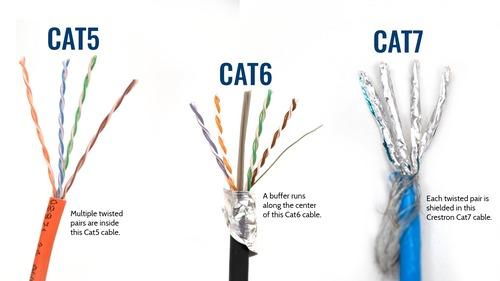
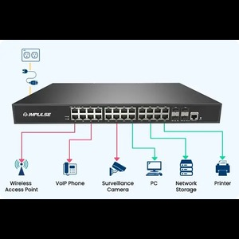

# Network
A Network is a system of connection between two or more computers or devices that enables sharing of information and resources. Through networks, devices can communicate with each other and exchange data.

**The main objectives of networks are:**
- Data Sharing: Sharing data, files, and software among different devices.
- Resource Sharing: Sharing printers, scanners, hard drives, etc.
- Communication: Communication via email, messaging, video conferencing, etc.
- Internet Access: Facilitating access to the internet.

Networks can be of various types, such as:
- LAN (Local Area Network): A network used within a small area, such as an office or home, connecting computers.
- WAN (Wide Area Network): A network used over large geographical areas, such as between cities or countries.
- MAN (Metropolitan Area Network): A network used within a single city or part of a city.
- PAN (Personal Area Network): A small network connecting two devices, such as a Bluetooth or Wi-Fi connection.

Network components or elements include:
- Router
- Switch
- Hub
- Modem
- Cables
Data is transmitted via networks, and these networks can be part of larger systems like the internet or intranet.

# Network Cable (Network Cabling)
A network cable refers to a system or technology used to connect various devices or computers. It is a physical medium (cable) that transmits data and signals between networked devices. Network cables are typically Ethernet cables, fiber optic cables, or coaxial cables.

An RJ45 connector is widely used because this interface has become standardized. Vendors have agreed to create devices according to these standards, making compatibility much easier for users. This standardization prevents customers from being locked into a single vendor's proprietary protocols and specifications.

Types of Network Cables:
- Ethernet Cable:
Common types include Cat 5 (Cat 5), Cat 5e (Cat 5 enhanced), Cat 6 (Cat 6), Cat 6a, etc.
Cable length: Typically effective up to 100 meters.

- Ethernet Cable Pinout (PoE-enabled):
Ethernet cables follow T568A or T568B standards for wiring connections. Below is how data and power pins are connected:

T568A Standard (PoE):

- Pin 1 (White/Green): Data
- Pin 2 (Green): Data
- Pin 3 (White/Orange): Data
- Pin 4 (Blue): Power
- Pin 5 (White/Blue): Power
- Pin 6 (Orange): Data
- Pin 7 (White/Brown): Power
- Pin 8 (Brown): Power

T568B Standard (PoE):

- Pin 1 (White/Orange): Data
- Pin 2 (Orange): Data
- Pin 3 (White/Green): Data
- Pin 4 (Blue): Power
- Pin 5 (White/Blue): Power
- Pin 6 (Green): Data
- Pin 7 (White/Brown): Power
- Pin 8 (Brown): Power

Fiber Optic Cable:
There are two types of fiber optic cables:

- Single-Mode Fiber (SMF):
  - Distance: Typically 20 kilometers (20,000 meters) or more.
  - Speed: This cable transmits signals using a single core (core) with light, capable of transmitting signals over very long distances at very high speeds (10Gbps or more).
  - Usage: It is used in long-distance networks, such as internet backbones, transcontinental networks, and other long-range communication systems.

- Multi-Mode Fiber (MMF):
  - Distance: Typically effective from 300 meters to 5 kilometers, depending on speed and type of cable.
  - Speed: Multi-mode fiber cables generally operate over shorter distances and at somewhat lower speeds (1Gbps to 10Gbps), but they are capable of handling signal reflection and return loss better.
  - Usage: They are typically used in data centers, local area networks (LAN), and educational institutions or small business networks.

- Coaxial Cable (Coaxial Cable):
  - Coaxial cables are typically used by cable television providers or internet service providers.

Additional Types of Cables:
- Patch Cable:
This is a short network cable commonly used to connect routers, switches, or computers.

- Crossover Cable:
This cable is typically used to connect two devices of the same type (e.g., computer-to-computer or router-to-router). One side follows the T568A standard wiring and the other follows the T568B standard wiring.

# Background

Cisco was founded in 1984, and like many companies, it began with its fair share of controversies. They are credited with inventing the router, and this has become their claim to fame. “We invented the router.” However, if you type this into Google, you’ll find that a sixty-year-old individual claims, “No, I invented the router, and Cisco stole it.” Either way, it's a valid point. Perhaps that sixty-year-old did invent the router, and Cisco did steal the idea. But without a doubt, Cisco took the concept, brought it to the world, and popularized it. They developed it on a massive scale, earning their reputation as the pioneers of routers and a fundamental building block for today’s networks.

Now, Cisco is undoubtedly a leader in the network equipment industry. A large portion of the world’s network infrastructure is associated with their name, and they are renowned for their stability and reliability.

Let’s imagine we have an office in New York with a PC, a server, and a printer, all of which need to communicate with each other. To achieve this, I’ll install a network switch and connect the devices to it using Ethernet cables. This switch would look something like this. The switch acts as a connector device for my Local Area Network (LAN).

In the New York office, I might also have a laptop that connects via a wireless network. This allows me to send a file from one person to another, store a file on a server, or even use a shared printer so that everyone doesn’t have to buy their own inkjet printer—something that can be a challenging task. All these forms of communication are supported by the switch. Now all my devices in the New York office can communicate with each other. I’ve created a local area network, which is a network that connects devices within a specific geographical area, such as an office or a university campus.

However, I don’t want all these devices to only communicate among themselves. They’ll likely need to connect to the internet as well. For this, I will use a router. A router is capable of making advanced routing decisions to direct network traffic between different network segments. This is how it works, and it would look something like this. Additionally, to protect against hackers or other malicious users attempting to compromise our network, I’ll set up a firewall. This firewall will safeguard various network segments from each other.

Now, the Local Area Network (LAN) in New York is connected to the internet. But in the modern business world, companies don’t operate from just one office. Suppose we also have an office in Boston with similar devices and its own LAN. To connect the New York and Boston offices so that the devices can communicate with each other, I could establish a secure connection through the internet or, alternatively, set up a dedicated connection between the two offices’ routers. This would provide a Wide Area Network (WAN) connection between the two offices.

## The Purpose of Networking

The primary purpose of networking is to connect various devices with each other. Some of the key features of networks include:

Topology: The structure that determines how devices are connected to one another.
Network Speed: Typically, the higher the speed, the higher the cost.
Security: This includes firewalls, routers, and switches that maintain network safety.
Availability: Ensuring that the network is accessible and avoiding a single point of failure by implementing redundancy.
Scalability: The network must be easily expandable as the company grows.
Reliability: Networks should operate consistently and reliably over time.
Eventually, it might be necessary for companies to communicate beyond their local network. This is where routers come into play. A router allows you to connect your Local Area Network (LAN) to a Wide Area Network (WAN) or a larger network, essentially providing the ability to communicate outside your local environment. Routers act as boundaries, defining divisions between networks. They also often provide security features, although they mainly focus on managing and directing network traffic.

# How Routers Work

Routers establish boundaries between networks. When designing a network, routers are used to segment network traffic and prevent data from unnecessarily flooding an entire corporate network. They perform tasks such as Network Address Translation (NAT), a service that converts your internal network IP addresses into internet-accessible addresses. This feature is essential and is implemented by nearly 99% of routers, though it’s not strictly required.

So, what does a router do? Essentially, a router acts as a type of translator or bridge between your internal network and external networks, managing the flow of information and creating a form of division between your LAN and the rest of the internet or other networks.

In short, routers divide boundaries between networks, making communication possible while optimizing efficiency, reducing traffic overloads, and adding a layer of security to network operations.

## Switch

A switch is a network device used to connect multiple devices or computers within a network and works to ensure that data packets are delivered to their correct destinations. A switch operates at the data link layer and is used in LAN (Local Area Network) environments.

## LAN 

A LAN (Local Area Network) is a networking system that connects computers and other devices within a small, limited geographical area (such as a home, office, school, or building). LAN allows users to share information with each other, share resources such as printers, file servers, etc., and access internet connections.

## WAN
A WAN (Wide Area Network) is a large regional or international network that connects multiple LANs (Local Area Networks) or other smaller networks. WAN typically spans a large geographical area, such as a city, country, or even across the entire globe. It is used for communication between computers, servers, databases, and other network resources.

# Router
A Router is a network device that transfers data between two or more networks. It determines the path of data packets within networks and directs them to their correct destination. Routers typically establish connections between the internet and a local network (LAN) or a wide area network (WAN).

Now let's talk about Wireless Access Points.

This was a revolutionary technology that changed the world. Wi-Fi was initially a huge security vulnerability, but it has become much more secure over time.

# Wireless Access Point (WAP)
A Wireless Access Point (WAP) is a network device that helps connect wireless devices (such as smartphones, laptops, tablets, etc.) to a wired network. It operates as part of a LAN (Local Area Network) and creates a Wi-Fi network, allowing devices to access the internet or network resources.

