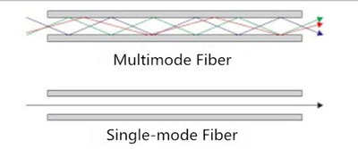
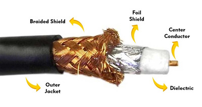

# Network
A Network is a system of connection between two or more computers or devices that enables sharing of information and resources. Through networks, devices can communicate with each other and exchange data.

**The main objectives of networks are:**
- Data Sharing: Sharing data, files, and software among different devices.
- Resource Sharing: Sharing printers, scanners, hard drives, etc.
- Communication: Communication via email, messaging, video conferencing, etc.
- Internet Access: Facilitating access to the internet.

Networks can be of various types, such as:
- LAN (Local Area Network): A network used within a small area, such as an office or home, connecting computers.
- WAN (Wide Area Network): A network used over large geographical areas, such as between cities or countries.
- MAN (Metropolitan Area Network): A network used within a single city or part of a city.
- PAN (Personal Area Network): A small network connecting two devices, such as a Bluetooth or Wi-Fi connection.

Network components or elements include:
- Router
- Switch
- Hub
- Modem
- Cables
Data is transmitted via networks, and these networks can be part of larger systems like the internet or intranet.

# Network Cable (Network Cabling)
A network cable refers to a system or technology used to connect various devices or computers. It is a physical medium (cable) that transmits data and signals between networked devices. Network cables are typically Ethernet cables, fiber optic cables, or coaxial cables.

An RJ45 connector is widely used because this interface has become standardized. Vendors have agreed to create devices according to these standards, making compatibility much easier for users. This standardization prevents customers from being locked into a single vendor's proprietary protocols and specifications.

Types of Network Cables:
- Ethernet Cable:
Common types include Cat 5 (Cat 5), Cat 5e (Cat 5 enhanced), Cat 6 (Cat 6), Cat 6a, etc.
Cable length: Typically effective up to 100 meters.

- Ethernet Cable Pinout (PoE-enabled):
Ethernet cables follow T568A or T568B standards for wiring connections. Below is how data and power pins are connected:

T568A Standard (PoE):

- Pin 1 (White/Green): Data
- Pin 2 (Green): Data
- Pin 3 (White/Orange): Data
- Pin 4 (Blue): Power
- Pin 5 (White/Blue): Power
- Pin 6 (Orange): Data
- Pin 7 (White/Brown): Power
- Pin 8 (Brown): Power

T568B Standard (PoE):

- Pin 1 (White/Orange): Data
- Pin 2 (Orange): Data
- Pin 3 (White/Green): Data
- Pin 4 (Blue): Power
- Pin 5 (White/Blue): Power
- Pin 6 (Green): Data
- Pin 7 (White/Brown): Power
- Pin 8 (Brown): Power

Fiber Optic Cable:
There are two types of fiber optic cables:

- Single-Mode Fiber (SMF):
  - Distance: Typically 20 kilometers (20,000 meters) or more.
  - Speed: This cable transmits signals using a single core (core) with light, capable of transmitting signals over very long distances at very high speeds (10Gbps or more).
  - Usage: It is used in long-distance networks, such as internet backbones, transcontinental networks, and other long-range communication systems.

- Multi-Mode Fiber (MMF):
  - Distance: Typically effective from 300 meters to 5 kilometers, depending on speed and type of cable.
  - Speed: Multi-mode fiber cables generally operate over shorter distances and at somewhat lower speeds (1Gbps to 10Gbps), but they are capable of handling signal reflection and return loss better.
  - Usage: They are typically used in data centers, local area networks (LAN), and educational institutions or small business networks.

- Coaxial Cable (Coaxial Cable):
  - Coaxial cables are typically used by cable television providers or internet service providers.

Additional Types of Cables:
- Patch Cable:
This is a short network cable commonly used to connect routers, switches, or computers.

- Crossover Cable:
This cable is typically used to connect two devices of the same type (e.g., computer-to-computer or router-to-router). One side follows the T568A standard wiring and the other follows the T568B standard wiring.

