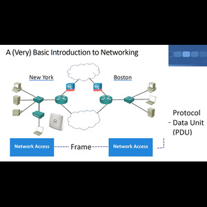
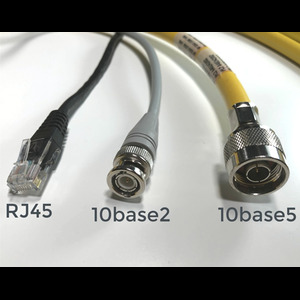
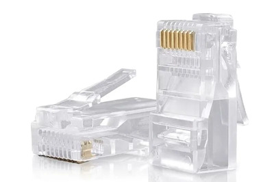
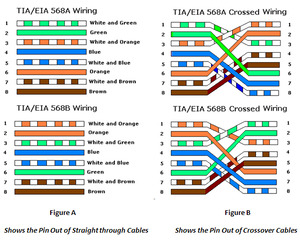
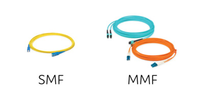
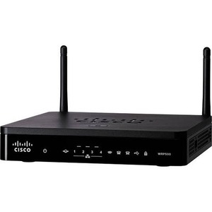

# Background

Cisco was founded in 1984, and like many companies, it began with its fair share of controversies. They are credited with inventing the router, and this has become their claim to fame. “We invented the router.” However, if you type this into Google, you’ll find that a sixty-year-old individual claims, “No, I invented the router, and Cisco stole it.” Either way, it's a valid point. Perhaps that sixty-year-old did invent the router, and Cisco did steal the idea. But without a doubt, Cisco took the concept, brought it to the world, and popularized it. They developed it on a massive scale, earning their reputation as the pioneers of routers and a fundamental building block for today’s networks.

Now, Cisco is undoubtedly a leader in the network equipment industry. A large portion of the world’s network infrastructure is associated with their name, and they are renowned for their stability and reliability.



Let’s imagine we have an office in New York with a PC, a server, and a printer, all of which need to communicate with each other. To achieve this, I’ll install a network switch and connect the devices to it using Ethernet cables. This switch would look something like this. The switch acts as a connector device for my Local Area Network (LAN).

In the New York office, I might also have a laptop that connects via a wireless network. This allows me to send a file from one person to another, store a file on a server, or even use a shared printer so that everyone doesn’t have to buy their own inkjet printer—something that can be a challenging task. All these forms of communication are supported by the switch. Now all my devices in the New York office can communicate with each other. I’ve created a local area network, which is a network that connects devices within a specific geographical area, such as an office or a university campus.

However, I don’t want all these devices to only communicate among themselves. They’ll likely need to connect to the internet as well. For this, I will use a router. A router is capable of making advanced routing decisions to direct network traffic between different network segments. This is how it works, and it would look something like this. Additionally, to protect against hackers or other malicious users attempting to compromise our network, I’ll set up a firewall. This firewall will safeguard various network segments from each other.

Now, the Local Area Network (LAN) in New York is connected to the internet. But in the modern business world, companies don’t operate from just one office. Suppose we also have an office in Boston with similar devices and its own LAN. To connect the New York and Boston offices so that the devices can communicate with each other, I could establish a secure connection through the internet or, alternatively, set up a dedicated connection between the two offices’ routers. This would provide a Wide Area Network (WAN) connection between the two offices.

## The Purpose of Networking

The primary purpose of networking is to connect various devices with each other. Some of the key features of networks include:

- **Topology:** The structure that determines how devices are connected to one another.
- **Network Speed:** Typically, the higher the speed, the higher the cost.
- **Security:** This includes firewalls, routers, and switches that maintain network safety.
- **Availability:** Ensuring that the network is accessible and avoiding a single point of failure by implementing redundancy.
- **Scalability:** The network must be easily expandable as the company grows.
- **Reliability:** Networks should operate consistently and reliably over time.

Eventually, it might be necessary for companies to communicate beyond their local network. This is where routers come into play. A router allows you to connect your Local Area Network (LAN) to a Wide Area Network (WAN) or a larger network, essentially providing the ability to communicate outside your local environment. Routers act as boundaries, defining divisions between networks. They also often provide security features, although they mainly focus on managing and directing network traffic.

# Network
A Network is a system of connection between two or more computers or devices that enables sharing of information and resources. Through networks, devices can communicate with each other and exchange data.

**The main objectives of networks are:**
- **Data Sharing:** Sharing data, files, and software among different devices.
- **Resource Sharing:** Sharing printers, scanners, hard drives, etc.
- **Communication:** Communication via email, messaging, video conferencing, etc.
- **Internet Access:** Facilitating access to the internet.

Networks can be of various types, such as:
- **LAN (Local Area Network):** A network used within a small area, such as an office or home, connecting computers.
- **WAN (Wide Area Network):** A network used over large geographical areas, such as between cities or countries.
- **MAN (Metropolitan Area Network):** A network used within a single city or part of a city.
- **PAN (Personal Area Network):** A small network connecting two devices, such as a Bluetooth or Wi-Fi connection.

Network components or elements include:
- Router
- Switch
- Hub
- Modem
- Cables
Data is transmitted via networks, and these networks can be part of larger systems like the internet or intranet.



# Network Cable (Network Cabling)
A network cable refers to a system or technology used to connect various devices or computers. It is a physical medium (cable) that transmits data and signals between networked devices. Network cables are typically Ethernet cables, fiber optic cables, or coaxial cables.

An RJ45 connector is widely used because this interface has become standardized. Vendors have agreed to create devices according to these standards, making compatibility much easier for users. This standardization prevents customers from being locked into a single vendor's proprietary protocols and specifications.



Types of Network Cables:
- Ethernet Cable:
Common types include Cat 5 (Cat 5), Cat 5e (Cat 5 enhanced), Cat 6 (Cat 6), Cat 6a, etc.
Cable length: Typically effective up to 100 meters.


- Ethernet Cable Pinout (PoE-enabled):
Ethernet cables follow T568A or T568B standards for wiring connections. Below is how data and power pins are connected:

T568A Standard (PoE):

- Pin 1 (White/Green): Data
- Pin 2 (Green): Data
- Pin 3 (White/Orange): Data
- Pin 4 (Blue): Power
- Pin 5 (White/Blue): Power
- Pin 6 (Orange): Data
- Pin 7 (White/Brown): Power
- Pin 8 (Brown): Power

T568B Standard (PoE):

- Pin 1 (White/Orange): Data
- Pin 2 (Orange): Data
- Pin 3 (White/Green): Data
- Pin 4 (Blue): Power
- Pin 5 (White/Blue): Power
- Pin 6 (Green): Data
- Pin 7 (White/Brown): Power
- Pin 8 (Brown): Power



Fiber Optic Cable:
There are two types of fiber optic cables:

- Single-Mode Fiber (SMF):
  - Distance: Typically 20 kilometers (20,000 meters) or more.
  - Speed: This cable transmits signals using a single core (core) with light, capable of transmitting signals over very long distances at very high speeds (10Gbps or more).
  - Usage: It is used in long-distance networks, such as internet backbones, transcontinental networks, and other long-range communication systems.

- Multi-Mode Fiber (MMF):
  - Distance: Typically effective from 300 meters to 5 kilometers, depending on speed and type of cable.
  - Speed: Multi-mode fiber cables generally operate over shorter distances and at somewhat lower speeds (1Gbps to 10Gbps), but they are capable of handling signal reflection and return loss better.
  - Usage: They are typically used in data centers, local area networks (LAN), and educational institutions or small business networks.



- Coaxial Cable (Coaxial Cable):
  - Coaxial cables are typically used by cable television providers or internet service providers.


Additional Types of Cables:
- Patch Cable:
This is a short network cable commonly used to connect routers, switches, or computers.


- Crossover Cable:
This cable is typically used to connect two devices of the same type (e.g., computer-to-computer or router-to-router). One side follows the T568A standard wiring and the other follows the T568B standard wiring.


## Switch

A switch is a network device used to connect multiple devices or computers within a network and works to ensure that data packets are delivered to their correct destinations. A switch operates at the data link layer and is used in LAN (Local Area Network) environments.


## LAN 

A LAN (Local Area Network) is a networking system that connects computers and other devices within a small, limited geographical area (such as a home, office, school, or building). LAN allows users to share information with each other, share resources such as printers, file servers, etc., and access internet connections.


## WAN
A WAN (Wide Area Network) is a large regional or international network that connects multiple LANs (Local Area Networks) or other smaller networks. WAN typically spans a large geographical area, such as a city, country, or even across the entire globe. It is used for communication between computers, servers, databases, and other network resources.


# How Routers Work

Routers establish boundaries between networks. When designing a network, routers are used to segment network traffic and prevent data from unnecessarily flooding an entire corporate network. They perform tasks such as Network Address Translation (NAT), a service that converts your internal network IP addresses into internet-accessible addresses. This feature is essential and is implemented by nearly 99% of routers, though it’s not strictly required.

So, what does a router do? Essentially, a router acts as a type of translator or bridge between your internal network and external networks, managing the flow of information and creating a form of division between your LAN and the rest of the internet or other networks.

In short, routers divide boundaries between networks, making communication possible while optimizing efficiency, reducing traffic overloads, and adding a layer of security to network operations.

# Router
A Router is a network device that transfers data between two or more networks. It determines the path of data packets within networks and directs them to their correct destination. Routers typically establish connections between the internet and a local network (LAN) or a wide area network (WAN).



Now let's talk about Wireless Access Points.

This was a revolutionary technology that changed the world. Wi-Fi was initially a huge security vulnerability, but it has become much more secure over time.

# Wireless Access Point (WAP)
A Wireless Access Point (WAP) is a network device that helps connect wireless devices (such as smartphones, laptops, tablets, etc.) to a wired network. It operates as part of a LAN (Local Area Network) and creates a Wi-Fi network, allowing devices to access the internet or network resources.


# Metropolitan Area Network (MAN)
A Metropolitan Area Network (MAN) refers to a computer network that spans a specific metropolitan or city area. It is larger than a Local Area Network (LAN) but smaller than a Wide Area Network (WAN).

**Characteristics of MAN:**

- **Geographical Range:** A MAN typically covers a city or metropolitan area, or its surrounding regions (usually between 10 to 50 kilometers in range).

- **High-Speed Connections:** MANs generally use high-speed fiber optic cables or other fast connection technologies, ensuring fast data transfer.

- **Multiple LAN Connections:** MAN connects multiple Local Area Networks (LANs). This means that several offices or buildings are linked together and can share data.

- **User Types:** MANs are usually used by large organizations, universities, government offices, or the general public in a city or region.

Examples of MAN:

- A citywide Wi-Fi network
- A network used to connect various buildings in a university
- A network that connects various government offices in a city

Advantages of MAN:

- Fast and efficient communication within a city or area
- Quick connection of multiple offices or buildings
- Improved services for multiple users in a computer network.
- In general, a MAN is a network that connects one or more LANs and ensures fast information exchange within a specific city or area.

# PAN (Personal Area Network)
A Personal Area Network (PAN) is a small, personal network typically used within a single person or a small area. It is used for connecting devices such as smartphones, laptops, tablets, printers, headphones, etc.

Characteristics of PAN:

- Range and Coverage: A PAN typically operates within a very small area, such as a room, a house, or a close proximity of devices belonging to one person. Its range is generally limited to about 10 meters (30 feet).

Device Connectivity: PAN allows multiple personal devices to be connected, such as:

- Data exchange between smartphones and laptops
- Connecting various devices via Bluetooth or Wi-Fi
- Connection between a smartwatch and a smartphone
- Communication Technologies: Technologies like Bluetooth, Infrared, and Wi-Fi are typically used to create a PAN. These allow devices to connect with each other and exchange information.

Examples of PAN:

- Bluetooth headphones connected to a smartphone
- Wireless keyboards or mice connected to a computer
- Infrared devices (e.g., remote controls) that control home appliances
- Connection between two or more devices via Wi-Fi, such as a laptop and a printer

Advantages of PAN:

- Personal and Secure: Since it operates in a small area, PAN is usually personal and secure.
- Easy and Fast Connections: It helps quickly and easily connect devices.
- Seamless Data Sharing: Data can be shared between devices without the need for wires or cables.

In summary, a PAN (Personal Area Network) is a small, personal network, primarily used to establish communication between a person’s devices. It is typically operated through Bluetooth or Wi-Fi.

# Network Speed
We will discuss how we manage speed. Some people refer to it as megabytes per second, others as megabits per second, or gigabits per second. What does it actually mean?

If you have a 100 megabits per second (Mbps) connection, you send your 10 MB file by breaking it into smaller 1500-byte packets, and each packet will have some header data, such as where it came from, where it's going, port numbers, etc. This extra information serves as overhead for transmission and routing. As a result, you might get something like 80 megabits per second, meaning it will be a bit less due to this additional overhead. Again, this is just an estimate, not the actual number.

10 MB (megabytes) = 80 megabits (since 1 byte = 8 bits).

If you use a 100 Mbps network, the transfer time can be calculated as:

``` java
Transfer Time = Network Speed (in  bps) / File Size (in  bits)
              = 100 megabits per second/ 80 megabits
              = 0.8seconds
```

Suppose you have a 1.5 GB music collection. First, I would say, "Alright, it’s 1500 megabytes in size, correct?" Then, multiply by 8 because I need to convert it to megabits. So, 1500 times 8 equals 12,000 megabits of data that I need to transfer. Now, I’ll say, if I transfer at 100 megabits per second, and if I actually get a throughput of 100 megabits per second, it would take about two minutes.

So, what do you understand? When we work with networks, we always need to keep in mind the conversion between "bits per second" and "bytes per second."

``` css
1 TeraByte = 1024 GigaByte
1 GigaByte = 1024 Megabyte
1 Megabyte = 1024 KiloByte
1 KiloByte = 1024 Byte
1 Byte     = 8 Bit
```

# Network Model


## OSI Model


The Open Systems Interconnection (OSI) model is an international standard set by the International Organization for Standardization (ISO), meaning it is an ISO standard. It provides a general-purpose framework that defines and standardizes how computers communicate with each other over a network. The OSI model is conceptual, meaning it is not a physical object or an actual protocol or technology. Its seven layers of data transmission operations are divided into specific related groups, where each layer provides services to the layer above it and receives services from the layer below it.

Here, I am connected through a switch between a sender (like my laptop) and a receiver (like my email server). I will send an email to my email server. First, the sender will generate traffic that will be sent to the receiver. When the packet is created, it will move from the upper layers down to the lower layers. The sender will first create data for layer 7, the application layer. For example, if I am sending an email, it will contain fields like 'sender' and 'receiver', then it will be encapsulated within data for layer 6 (the presentation layer). After that, it will be encapsulated in the data for layer 5 (the session layer). Layers 5, 6, and 7 are called the upper layers and are more important for application developers than for network engineers. When network engineers reach layer 4, the sender will create a segment and encapsulate it with the header of layer 4 (the transport layer). Layer 4 will check the header and identify the traffic by its port number to determine whether it is for the email server application or the web server application. It could be either TCP or UDP, and the port number will be included, such as port 80 for web traffic or port 25 for our email example. Now, the packet is prepared and transmitted from the sender. Then, layer 3 will check the header and confirm that the packet is for its destination based on the IP address. It will encapsulate the data. First, it will check the layer 2 header and verify if the packet is for it. It will encapsulate the data. In this way, the entire packet is encapsulated in the sender's system and moves to the next layer. When it reaches the receiver, the operations will reverse, starting from the physical layer and moving upwards. In this way, the entire packet is de-encapsulated in the receiver’s system and moves upwards to the upper layers.

The OSI model provides a great advantage for engineers because they can focus on their specific layer and follow the standards of the layers above and below. It is an open standard. To help remember the layers of the OSI model, there are some acronyms. One popular acronym is "Please Do Not Throw Sausage Pizza Away," which helps you easily remember the names of the OSI model’s layers.

1.	Physical
2.	Data Link
3.	Network
4.	Transport
5.	Session
6.	Presentation
7.	Application

There are also other acronyms, such as "Please Don't Need Those Stupid Packets Anyway" or "Please Do Not Touch Superman’s Private Area."

The Open Systems Interconnection (OSI) model is a theoretical network model used to explain how communication is managed between different network protocols and devices. It is designed as a framework of 7 layers, with each layer performing a specific function or responsibility. Below is an explanation of the 7 layers of the OSI model:

- **Physical Layer**
  - Function: This layer is hardware-related and its job is to ensure the availability of suitable physical media for data transmission (such as cables, signals, etc.). It transmits data at the bit level.
  - Example: Cables, routers, hubs, modems, switches (physical connectivity)
- **Data Link Layer**
  - Function: This layer establishes data links and converts data packets into frames. It also performs error detection and correction during data transmission.
  - Example: Ethernet, MAC (Media Access Control), PPP (Point-to-Point Protocol)
- **Network Layer**
  - Function: This layer handles routing and addressing to ensure that data reaches its destination. It uses IP (Internet Protocol) to send packets from one place to another.
  - Example: IP, ICMP (Internet Control Message Protocol), Routers
- **Transport Layer**
  - Function: This layer is responsible for managing the processes of connection establishment, maintenance, and termination, ensuring correct and effective data transfer. It also handles session creation and error correction.
  - Example: TCP (Transmission Control Protocol), UDP (User Datagram Protocol)
- **Session Layer**
  - Function: This layer establishes, maintains, and terminates communication sessions between two programs. It also coordinates the session during data transfer.
  - Example: NetBIOS, RPC (Remote Procedure Call), SMB (Server Message Block)
- **Presentation Layer**
   - Function: This layer converts data into a format that is usable by the application layer. It also manages data encoding, encryption, and compression.
   - Example: JPEG, GIF, Encryption methods (SSL/TLS)
- **Application Layer**
  - Function: This is the layer that directly interacts with the user, where various applications run to use network services. It provides various services for data.
  - Example: HTTP, FTP, SMTP, DNS, POP3, Telnet
  - Summary: The OSI model provides a 7-layer framework for managing communication and information flow between network protocols and systems. Each layer performs a specific task, ensuring the correct exchange of information through collaboration with the other layers.

