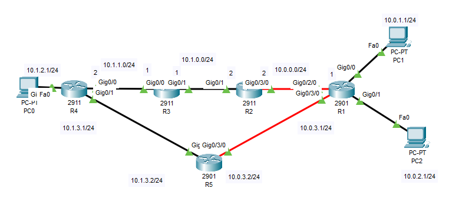
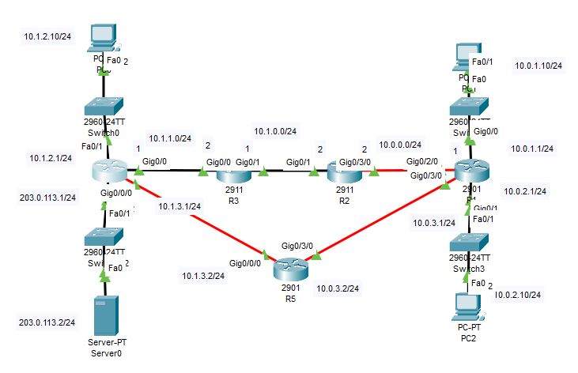

# Administrative Distance (AD) কী?

**Administrative Distance (AD)** হলো একটি সংখ্যাগত মান যা রাউটার ব্যবহার করে **বিভিন্ন রাউটিং সোর্স (protocols বা methods)** থেকে প্রাপ্ত রুটগুলোর মধ্যে সবচেয়ে **বিশ্বাসযোগ্য বা নির্ভরযোগ্য** রুটটি বেছে নিতে।

**সোজা করে বললে**: যদি একাধিক রাউটিং প্রোটোকল একই গন্তব্যে পৌঁছানোর রুট দেয়, তাহলে রাউটার **যার AD মান সবচেয়ে কম**, সেই রুটটিকে বেছে নেয়।

---

## AD-এর মূল উদ্দেশ্য

একাধিক রাউটিং সোর্স থেকে যদি একটি রাউটার একই গন্তব্যের রুট পায়, তবে কাকে বিশ্বাস করবে? এই বিশ্বাসযোগ্যতার ভিত্তিতেই AD কাজ করে।

---

## Administrative Distance এর বিস্তারিত তালিকা:

| **রাউটিং সোর্স / প্রোটোকল** | **AD মান (Administrative Distance)** | **বিশেষ তথ্য** |
|-----------------------------|------------------------------|----------------|
| **Connected Interface**     | 0                            | সরাসরি সংযুক্ত নেটওয়ার্ক, সবচেয়ে নির্ভরযোগ্য |
| **Static Route**            | 1                            | ম্যানুয়ালি দেওয়া রুট |
| **External BGP (eBGP)**     | 20                           | ইন্টারনেটের জন্য ব্যবহৃত, বাইরের Autonomous System থেকে |
| **EIGRP (Internal)**        | 90                           | Cisco-এর উন্নত ও দ্রুত রাউটিং প্রোটোকল |
| **IGRP**                    | 100                          | পুরনো Cisco প্রোটোকল |
| **OSPF**                    | 110                          | ওপেন স্ট্যান্ডার্ড প্রোটোকল |
| **IS-IS**                   | 115                          | লিংক স্টেট প্রোটোকল, OSPF-এর বিকল্প |
| **RIP**                     | 120                          | হপ কাউন্ট ভিত্তিক, সহজ তবে ধীর |
| **EIGRP (External)**        | 170                          | বাইরের সোর্স থেকে আসা EIGRP রুট |
| **Internal BGP (iBGP)**     | 200                          | একই Autonomous System এর মধ্যে BGP |
| **Unknown / Invalid Route** | 255                          | রাউটার কখনো এই রুট গ্রহণ করবে না |

---

## উদাহরণ দিয়ে বোঝানো যাক:

ধরা যাক, একটি রাউটার একই গন্তব্যে পৌঁছাতে নিচের ৩টি রুট পেয়েছে:
- RIP (AD = 120)
- OSPF (AD = 110)
- EIGRP (AD = 90)

 রাউটার EIGRP থেকে আসা রুটটি বেছে নেবে, কারণ তার **AD মান সবচেয়ে কম (90)**।

---

## মনে রাখার সহজ নিয়ম:

- **AD যত কম → রাউট তত বেশি নির্ভরযোগ্য**
- **AD যদি 255 হয় → রাউট গ্রহণযোগ্য নয়**
- **একই গন্তব্যে একাধিক রুট থাকলে → রাউটার কম AD মানের রুট বেছে নেয়**

---

## টিপস:

- চাইলে static route-এর AD মান পরিবর্তন করে dynamic রুটের চেয়েও বেশি preference দেওয়া যায়।
- AD শুধুমাত্র তখনই বিবেচ্য, যখন **একই গন্তব্যে একাধিক সোর্স** থেকে রুট আসে।

---
# মেট্রিকস
নেটওয়ার্কিং ও রাউটিং-এ **মেট্রিকস (Metrics)** হলো এমন কিছু মান (value) যা রাউটিং প্রোটোকল ব্যবহার করে **সেরা পথ (best path)** নির্ধারণ করে একটি গন্তব্যে ডেটা পাঠানোর জন্য। যখন একাধিক পথ থাকে, তখন রাউটার মেট্রিকস বিশ্লেষণ করে সবচেয়ে উপযুক্ত (সাধারণত সর্বনিম্ন) মানটি নির্বাচন করে।

### রাউটিং-এ সাধারণত ব্যবহৃত কিছু মেট্রিকস:

| **মেট্রিকের নাম** | **বর্ণনা** |
|-------------------|-------------|
| **হপ কাউন্ট (Hop Count)** | কতগুলো রাউটার বা ডিভাইস অতিক্রম করে গন্তব্যে পৌঁছাতে হবে, তার সংখ্যা। যত কম, তত ভালো। |
| **ডিলে (Delay)** | প্যাকেট পাঠাতে যে সময় লাগে। সময় যত কম, পথ তত ভালো। |
| **ব্যান্ডউইথ (Bandwidth)** | রুটে কত ডেটা পাঠানো সম্ভব – বেশি ব্যান্ডউইথ মানে ভালো রুট। |
| **লোড (Load)** | রুটে কতটা ট্রাফিক বা ব্যস্ততা রয়েছে – কম লোড মানে ভালো রুট। |
| **রিলায়াবিলিটি (Reliability)** | রুটের স্থায়িত্ব ও নির্ভরযোগ্যতা – কম packet loss বা সমস্যা থাকলে বেশি রিলায়াবল। |
| **কস্ট (Cost)** | রাউটিং প্রোটোকল নিজস্বভাবে নির্ধারণ করা মান, যা বিভিন্ন বিষয়কে বিবেচনায় নেয়। |

প্রত্যেক রাউটিং প্রোটোকল (যেমন RIP, OSPF, EIGRP) নিজের মতো করে কোন মেট্রিক ব্যবহার করবে তা নির্ধারণ করে।

নিচে প্রধান প্রধান রাউটিং প্রোটোকলগুলোর সঙ্গে তাদের ব্যবহৃত **মেট্রিক (Metric)** গুলোর তালিকা ও তুলনা দেয়া হলো:

---

### ১. **RIP (Routing Information Protocol)**

- **ব্যবহৃত মেট্রিক**: হপ কাউন্ট (Hop Count)
- **সর্বোচ্চ হপ**: ১৫ (এর বেশি হলে রুট অচল)
- **গুণ**: সহজবোধ্য
- **দুর্বলতা**: বড় নেটওয়ার্কে স্লো ও কম স্কেলেবল

---

### ২. **OSPF (Open Shortest Path First)**

- **ব্যবহৃত মেট্রিক**: কস্ট (Cost)
  - কস্ট নির্ধারিত হয়: ব্যান্ডউইথ-এর ভিত্তিতে
- **সর্বনিম্ন কস্ট = সেরা রুট**
- **গুণ**: দ্রুত, স্কেলেবল, বড় নেটওয়ার্কের জন্য উপযুক্ত
- **দুর্বলতা**: কনফিগারেশন কিছুটা জটিল

---

### ৩. **EIGRP (Enhanced Interior Gateway Routing Protocol)**

- **ব্যবহৃত মেট্রিক**:
  - **Bandwidth**
  - **Delay**
  - (চাইলে) Reliability, Load, MTU
- **কম্পোজিট মেট্রিক**: মানে, একাধিক ফ্যাক্টর মিলিয়ে রুট বাছাই
- **গুণ**: খুব দ্রুত, কার্যকর, Cisco ডিভাইসে ভালো চলে
- **দুর্বলতা**: শুধুমাত্র Cisco ডিভাইসে সীমাবদ্ধ (default ভাবে)

---

### ৪. **BGP (Border Gateway Protocol)**

- **ব্যবহৃত মেট্রিক (মূলত বলা হয় “Attributes”)**:
  - Path length (AS Path)
  - Origin type
  - MED (Multi Exit Discriminator)
  - Local Preference
  - Weight (Cisco specific)
- **গুণ**: ইন্টারনেট-লেভেলের রাউটিংয়ের জন্য আদর্শ
- **দুর্বলতা**: কনফিগারেশন ও পরিচালনা কঠিন

---

### তুলনামূলক টেবিল:

| প্রোটোকল | ব্যবহৃত মেট্রিক | দ্রুততা | স্কেলেবিলিটি | কনফিগারেশন জটিলতা |
|----------|------------------|----------|----------------|---------------------|
| **RIP**  | Hop Count        | ধীর       | কম              | সহজ                |
| **OSPF** | Cost (Bandwidth ভিত্তিক) | দ্রুত    | উচ্চ             | মাঝারি/জটিল        |
| **EIGRP**| Bandwidth, Delay (কম্পোজিট) | খুব দ্রুত | উচ্চ             | মাঝারি              |
| **BGP**  | বিভিন্ন Attributes | মাঝারি     | খুব উচ্চ         | জটিল                |

---

**Administrative Distance (AD)** হলো একটি মান (value) যা রাউটার ব্যবহার করে **বিভিন্ন রাউটিং প্রোটোকলের মধ্যে সেরা রুট** নির্বাচন করতে। যখন একই গন্তব্যের জন্য একাধিক প্রোটোকল রুট সরবরাহ করে, তখন রাউটার **সর্বনিম্ন AD** এর প্রোটোকল থেকে রুটটি বেছে নেয়।

---

# অটোনোমাস সিস্টেম (AS)
একটি Autonomous System (AS) হলো একটি স্বতন্ত্র নেটওয়ার্ক বা নেটওয়ার্কগুলোর সমষ্টি, যা একটি নির্দিষ্ট প্রশাসনিক কর্তৃপক্ষের অধীনে পরিচালিত হয় এবং এর নিজস্ব রাউটিং নীতি (Routing Policy) থাকে। অটোনোমাস সিস্টেম (AS) হল ইন্টারনেটের একটি বৃহৎ নেটওয়ার্ক যা একটি একক প্রশাসনিক কর্তৃপক্ষের অধীনে পরিচালিত হয়। সাধারণত, এটি ইন্টারনেট সার্ভিস প্রোভাইডার (ISP), কর্পোরেট নেটওয়ার্ক, বা বিশ্ববিদ্যালয় দ্বারা নিয়ন্ত্রিত হয়। প্রতিটি অটোনোমাস সিস্টেমের একটি অনন্য **AS নম্বর (ASN)** থাকে, যা ইন্টারনেট রাউটিং প্রোটোকল (যেমন BGP - Border Gateway Protocol) ব্যবহার করে অন্যান্য AS-এর সাথে যোগাযোগ করে।

🔹 প্রতিটি AS-এর একটি স্বতন্ত্র Autonomous System Number (ASN) থাকে।
🔹 ইন্টারনেট সার্ভিস প্রোভাইডার (ISP), কর্পোরেট নেটওয়ার্ক, এবং বড় বড় প্রতিষ্ঠানের নিজস্ব AS থাকে।

প্রতিটি Autonomous System (AS)-কে একটি নম্বর নির্ধারণ করা যেতে পারে, যা স্বাভাবিকভাবেই AS নম্বর (ASN) নামে পরিচিত। ঠিক যেমন পাবলিক IP ঠিকানা, তেমনি Internet Assigned Numbers Authority (IANA, www.iana.org) বিশ্বব্যাপী ASN বরাদ্দের অধিকার নিয়ন্ত্রণ করে।

IANA এই কর্তৃত্ব বিভিন্ন সংস্থার কাছে হস্তান্তর করে, সাধারণত সেই সংস্থাগুলোর কাছেই, যারা পাবলিক IP ঠিকানা বরাদ্দ করে। উদাহরণস্বরূপ, উত্তর আমেরিকায়, American Registry for Internet Numbers (ARIN, www.arin.net) পাবলিক IP ঠিকানার পরিসর এবং ASN বরাদ্দের দায়িত্ব পালন করে।

### **অটোনোমাস সিস্টেমের বৈশিষ্ট্য:**
1. **একক প্রশাসনিক নিয়ন্ত্রণ** - একটি AS সাধারণত একক সংস্থা বা প্রতিষ্ঠানের নিয়ন্ত্রণে থাকে।
2. **স্বতন্ত্র রাউটিং নীতি** - প্রতিটি AS তাদের নিজস্ব রাউটিং নীতি নির্ধারণ করতে পারে।
3. **BGP ব্যবহার করে যোগাযোগ** - বিভিন্ন AS একে অপরের সাথে ইন্টারনেট গেটওয়ে প্রোটোকল (BGP) ব্যবহার করে সংযুক্ত থাকে।

### **অটোনোমাস সিস্টেমের ধরন:**
1. **Single-homed AS** – শুধুমাত্র একটি ISP-এর সাথে সংযুক্ত।
2. **Multi-homed AS** – একাধিক ISP-এর সাথে সংযুক্ত কিন্তু নিজস্ব ট্রানজিট সার্ভিস প্রদান করে না।
3. **Transit AS** – অন্যান্য নেটওয়ার্কের জন্য ট্রানজিট সার্ভিস প্রদান করে।

বাংলাদেশে, বিভিন্ন ISP এবং সরকারি-বেসরকারি সংস্থাগুলোর নিজস্ব ASN রয়েছে যা আন্তর্জাতিক নেটওয়ার্কিং ও ইন্টারনেট রাউটিং পরিচালনার জন্য ব্যবহৃত হয়। 

---

# **OSPF (Open Shortest Path First) কী?**  
**OSPF (Open Shortest Path First)** হলো একটি **ইন্টেরিয়র গেটওয়ে প্রোটোকল (IGP)**, যা **একটি AS-এর অভ্যন্তরে** রাউটিং পরিচালনার জন্য ব্যবহৃত হয়। এটি **লিংক-স্টেট রাউটিং প্রোটোকল**, যেখানে প্রতিটি রাউটার তাদের প্রতিবেশী রাউটারগুলোর সংযোগ সম্পর্কে তথ্য সংগ্রহ করে এবং **Shortest Path First (SPF) algorithm** ব্যবহার করে গন্তব্য পর্যন্ত সর্বোত্তম পথ নির্ধারণ করে।  

- OSPF শুধুমাত্র **একটি AS-এর মধ্যে কাজ করে** এবং বহিরাগত নেটওয়ার্কের জন্য ব্যবহার করা হয় না।  
- এটি **Dijkstra's Algorithm** ব্যবহার করে দ্রুত এবং দক্ষ রাউটিং নির্ধারণ করে।  
- OSPF বিভিন্ন **এরিয়া (Area)**-তে বিভক্ত হয়ে কাজ করে।  
- OSPF: **Open Shortest Path First**
- এটি একটি **লিংক স্টেট বা SPF প্রযুক্তি** ভিত্তিক প্রোটোকল
- **IETF এর OSPF ওয়ার্কিং গ্রুপ কর্তৃক উন্নয়ন করা (RFC 1247)**
- **OSPFv2 (IPv4) — RFC2328**
- **OSPFv3 (IPv6) — RFC2740**

---

### **অটোনোমাস সিস্টেম (AS) এবং OSPF-এর পার্থক্য**  

| বিষয় | Autonomous System (AS) | OSPF |
|-------|------------------|------|
| **কাজের ক্ষেত্র** | ইন্টারনেট এবং বৃহৎ নেটওয়ার্কগুলোর মধ্যে | শুধুমাত্র একটি AS-এর অভ্যন্তরে |
| **ব্যবহৃত প্রোটোকল** | BGP (Border Gateway Protocol) | OSPF (Interior Gateway Protocol) |
| **রাউটিং পদ্ধতি** | একাধিক নেটওয়ার্ক বা ISP-এর মধ্যে রাউটিং পরিচালনা করে | AS-এর ভেতরে রাউটিং পরিচালনা করে |
| **নিয়ন্ত্রণ ব্যবস্থা** | একক প্রশাসনিক কর্তৃপক্ষের অধীনে থাকে | এরিয়া ভিত্তিক ব্যবস্থা, যেমন OSPF Area 0 (Backbone Area) |

---

### **OSPF এবং AS-এর সংযোগ**  
যেহেতু OSPF শুধুমাত্র **একটি AS-এর মধ্যে কাজ করে**, তাই যখন একটি AS অন্য AS-এর সাথে যোগাযোগ করে, তখন **BGP (Border Gateway Protocol)** ব্যবহার করা হয়। তবে OSPF-এর মাধ্যমে **AS-এর ভেতরে** ইন্টারনাল রাউটিং করা হয়, এবং যদি একাধিক AS-এর মধ্যে সংযোগ করতে হয়, তাহলে **OSPF External Routes (Type 5 LSAs)** ব্যবহার করে **BGP থেকে পাওয়া রুটগুলোর বিজ্ঞপ্তি** (advertise) করা হয়।  

🔹 OSPF **Type 5 (External LSA)** এবং **Type 4 (ASBR Summary LSA)** ব্যবহার করে **AS-এর বাইরে (External Network) থেকে আসা রুট** ম্যানেজ করতে পারে।  
🔹 OSPF-এর মাধ্যমে AS-এর ভিতরে রাউটিং সহজ ও দ্রুত হয়, তবে বহিরাগত নেটওয়ার্ক সংযোগের জন্য BGP প্রয়োজন।  

Here’s the **full Bangla translation** of your OSPF Basics document. I've broken it into sections for clarity, but the entire content has been translated:

---

**পরিকল্পিত হয়েছে:**  
- TCP/IP পরিবেশের জন্য  
- দ্রুত কনভার্জেন্সের জন্য  
- ভ্যারিয়েবল লেন্থ সাবনেট মাস্কের জন্য  
- Discontiguous সাবনেটের জন্য  
- Incremental আপডেটের জন্য  
- রাউট অথেনটিকেশনের জন্য  
- IP প্রোটোকল 89 তে চালিত হয়

---

### লিংক স্টেট রাউটিং প্রোটোকল

- টপোলজি সংক্রান্ত তথ্য একটি পৃথক ডেটাবেসে সংরক্ষিত থাকে
- তিনটি টেবিল ব্যবহার করা হয়:
  1. প্রতিবেশী টেবিল (Neighbor Table)
  2. টপোলজি টেবিল (Topology Table)
  3. রাউটিং টেবিল (Routing Table)
  
- SPF (Shortest Path First) অ্যালগরিদম ব্যবহার করে সেরা পথ নির্বাচন
- লিংক সক্রিয় কিনা তা জানার জন্য হ্যালো বার্তা পাঠানো হয়
- নেটওয়ার্ক পরিবর্তনের ক্ষেত্রে তাৎক্ষণিক আপডেট পাঠানো হয়

---

### ডেটা স্ট্রাকচার

1. **Neighbor Table:** প্রতিবেশী রাউটারের তালিকা  
2. **Topology Table (LSDB):** রাউটার ও তাদের লিংকের বিস্তারিত তথ্য  
3. **Routing Table:** শুধুমাত্র সেরা পথ নির্দেশ করে  

---

### SPF ট্রি এবং ব্যান্ডউইথ

- প্রতিটি রাউটার একটি SPF ট্রি তৈরি করে এবং নিজেকে মূল (root) ধরে
- শুধুমাত্র পরিবর্তন হওয়া তথ্যই প্রেরণ করা হয়
- মাল্টিকাস্ট ব্যবহার করে নেটওয়ার্কে প্যাকেট পাঠানো হয়

---

### দ্রুত কনভার্জেন্স

- পরিবর্তন শনাক্ত করে LSA (Link State Advertisement) পাঠানো হয়
- ডেটাবেস সমন্বিত করা হয়
- প্রতিটি রাউটার গন্তব্য নেটওয়ার্কের জন্য রাউটিং টেবিল তৈরি করে

---

### OSPF এর প্রাথমিক কার্যক্রম

- হ্যালো মেসেজ পাঠিয়ে প্রতিবেশী আবিষ্কার করা
- টপোলজি টেবিল (LSDB) আদান-প্রদান
- SPF অ্যালগরিদম দিয়ে সেরা পথ নির্বাচন
- SPF ভিত্তিক সেরা পথগুলো রাউটিং টেবিলে সংরক্ষিত হয়

---

### OSPF প্রতিবেশী আবিষ্কারের প্রক্রিয়া

- OSPF শুরুতে "Down State"-এ থাকে
- হ্যালো মেসেজ 224.0.0.5/FF02::5 ঠিকানায় মাল্টিকাস্ট হয়
- হ্যালো মেসেজের মিল খুঁজে পেলে প্রতিক্রিয়া পাঠায় (Unicast)
- এ অবস্থাকে বলা হয় "Two-way State"

---

### হ্যালো প্যাকেটের উপাদানসমূহ

- রাউটার ID  
- হ্যালো ও ডেড ইন্টারভাল  
- প্রতিবেশীদের তালিকা  
- নেটওয়ার্ক মাস্ক  
- রাউটার প্রায়োরিটি  
- এরিয়া ID  
- DR এবং BDR IP  
- অথেনটিকেশন তথ্য (যদি থাকে)
---

### নেটওয়ার্ক তথ্য আবিষ্কার

- "2-way" সম্পর্ক গঠনের পর তথ্য আদান-প্রদান শুরু হয়
- বেশি রাউটার ID যাকে দেওয়া হয় সে প্রথমে তথ্য পাঠায় (Exstart Stage)
- এরপর LSDB আদান-প্রদান হয় (Exchange Stage)

---

### LSDB সংযোজন

- DBD পাওয়ার পর LSAck দিয়ে নিশ্চিতকরণ পাঠানো হয়
- তথ্য মিলিয়ে দেখা হয় আপডেট কিনা
- নতুন হলে বিস্তারিত জানতে LSR পাঠানো হয় (Loading Stage)
- সব তথ্য মিললে পৌঁছে “Full Stage”-এ

---

### রাউটিং তথ্য রক্ষণাবেক্ষণ

- প্রতি ১০ সেকেন্ডে হ্যালো বার্তা পাঠানো হয় (LAN এর জন্য)
- পরিবর্তনের সাথে সাথে আপডেট পাঠানো হয়
- লিংক স্টেট সিকোয়েন্স নাম্বার ব্যবহার করা হয় (4-byte)

---

### OSPF প্যাকেটের ধরন

1. **Hello** — প্রতিবেশী গঠন
2. **DBD** — ডেটাবেস সমন্বয়
3. **LSR** — নির্দিষ্ট তথ্যের অনুরোধ
4. **LSU** — নির্দিষ্ট তথ্য প্রেরণ
5. **LSAck** — প্যাকেট নিশ্চিতকরণ

---

### OSPF প্যাকেট ফরম্যাট

- সব প্যাকেট IP পে-লোডে আবদ্ধ (TCP নয়)
- নির্ভরযোগ্যতা নিশ্চিত করতে নিজস্ব Acknowledgement ব্যবহৃত হয়

**Header Fields:**
- ভার্সন, প্যাকেট টাইপ, দৈর্ঘ্য, রাউটার ID, এরিয়া ID, চেকসাম, অথেনটিকেশন টাইপ

---

### প্যাকেট ডেটার বিষয়বস্তু

- Hello → প্রতিবেশীদের তালিকা  
- DBD → LSDB এর সারাংশ  
- LSR → প্রয়োজনীয় LSU এর ধরন ও রাউটার ID  
- LSU → পূর্ণ LSA এন্ট্রি  
- LSAck → ফাঁকা থাকে

---

### OSPFv3 (IPv6) এর পার্থক্য

- এখনো ৩২-বিট রাউটার ID ব্যবহার করে
- প্যাকেট টাইপগুলো আগের মতোই
- আইপি হেডারে পরিবর্তন: গন্তব্য FF02::5 (128-বিট)
- DBD ও LSU প্যাকেট ১২৮-বিট প্রিফিক্স বহন করে

---

### OSPF নেটওয়ার্ক টপোলজি

- বিভিন্ন ধরনের লিংক থাকে:
  - **Broadcast Multi-access**
  - **Point-to-Point**
  - **Non Broadcast Multi-access (NBMA)**

---

### Broadcast Multi-access Network

- Ethernet বা Token Ring
- প্রতিবেশী সম্পর্ক স্বয়ংক্রিয়ভাবে হয়
- DR/BDR নির্বাচন হয়
- Default হ্যালো: ১০ সেকেন্ড | ডেড: ৪০ সেকেন্ড
- DR কে প্যাকেট পাঠানো হয় 224.0.0.6 ঠিকানায়

---

### DR/BDR নির্বাচন

- সর্বোচ্চ প্রায়োরিটি → DR
- দ্বিতীয় সর্বোচ্চ → BDR
- সমতায় → উচ্চতম IP ঠিকানা
- DR/BDR নির্বাচন preemptive নয়

---

### Point-to-Point Network

- সাধারণত PPP বা HDLC সংযোগ
- প্রতিবেশী সম্পর্ক স্বয়ংক্রিয়ভাবে গঠিত
- DR/BDR প্রয়োজন নেই

---

### Non Broadcast Multi-access (NBMA)

- Frame Relay / ATM / X.25
- ব্রডকাস্টের ক্ষমতা নেই
- প্রতিবেশী ম্যানুয়ালি যুক্ত করতে হয়
- DR/BDR নির্বাচন হয়
- Default হ্যালো: ৩০ সেকেন্ড | ডেড: ১২০ সেকেন্ড

---

## লিংক-স্টেট রাউটিং প্রোটোকল (Link-State Routing Protocol):

- **টপোলজি তথ্য বন্যা (Topology Information Flooding)**:  
  - রাউটারগুলি **লিংক-স্টেট অ্যাডভার্টাইজমেন্ট (LSA)** ব্যবহার করে নেটওয়ার্কের প্রতিটি বিবরণ সমস্ত রাউটারে প্রচার করে।  
  - রাউটারগুলি **এলএসএ (LSA)** ব্যবহার করে নেটওয়ার্কের প্রায় প্রতিটি বিস্তারিত তথ্য (যেমন সংযুক্ত সাবনেট, প্রতিবেশী রাউটার) অন্যান্য সব রাউটারে পাঠায়।
    
- **এলএসডিবি (LSDB – Link-State Database)**:  
  - বন্যা প্রক্রিয়া শেষে সমস্ত রাউটারের **এলএসডিবি-তে** একই টপোলজি তথ্য সংরক্ষিত হয়।  
  - প্লাবিত হওয়ার পর প্রতিটি রাউটারের মেমরিতে নেটওয়ার্কের অভিন্ন টপোলজি ডেটাবেস (LSDB) তৈরি হয়।  

- **ওএসপিএফ (OSPF – Open Shortest Path First)**:   
  - এটি এলএসএ এবং এলএসডিবি ব্যবহার করে নেটওয়ার্ক টপোলজি সংগঠিত করে।  

- **এলএসএ (LSA – Link-State Advertisement)**:  
  - নেটওয়ার্ক টপোলজির নির্দিষ্ট তথ্য বহন করে রাউটার এর এলএসএ সাবনেটের অস্তিত্ব জানায় ।  
  - প্রতিটি এলএসএ একটি ডেটা স্ট্রাকচার যা রাউটার বা লিংকের তথ্য ধারণ করে।  

- **বন্যা প্রক্রিয়া (Flooding Process)**:  
  - **ধাপ ১**: একটি রাউটার তার এলএসএ তৈরি করে এবং প্রতিবেশী রাউটারে পাঠায়।  
  - **ধাপ ২**: প্রতিটি রাউটার এলএসএ পেলে, সেটি অন্য প্রতিবেশীদের কাছে ফরওয়ার্ড করে (যদি তারা এটি ইতিমধ্যে না জানে)।  
  - "এই এলএসএটি কি আপনার কাছে আছে?"—জিজ্ঞাসা করে রাউটারগুলি ডুপ্লিকেট এলএসএ এড়ায়।  

- **পুনরায় বন্যা (Re-Flooding)**:  
  - **টপোলজি পরিবর্তন**: লিংক ডাউন/আপ হলে সংশ্লিষ্ট রাউটার নতুন এলএসএ বন্যা করে।  
  - **বার্ধক্য টাইমার**: ডিফল্টভাবে প্রতি ৩০ মিনিটে এলএসএ পুনরায় পাঠানো হয়।  
  - টপোলজি স্থিতিশীল রাখতে রাউটারগুলি পর্যায়ক্রমে এলএসএ হালনাগাদ করে।  

- **সর্বোত্তম পথ গণনা (Shortest Path Calculation)**:  
    - **ডিজকস্ট্রা এস.পি.এফ অ্যালগরিদম (Dijkstra’s SPF Algorithm)**:  
      - লিংক-স্টেট বন্যার পর, প্রতিটি রাউটারের LSDB-তে নেটওয়ার্কের **অভিন্ন টপোলজি ডেটা** থাকে, কিন্তু এটি স্বয়ংক্রিয়ভাবে রাউটিং টেবিলে রুট যোগ করে না।  
      - LSDB নেটওয়ার্কের সম্পূর্ণ ম্যাপ ধারণ করলেও, এটি সরাসরি রাউটারকে বলতে পারে না কোন পথটি "সেরা"।  
      - **SPF অ্যালগরিদম** প্রতিটি রাউটার **স্বাধীনভাবে** LSDB বিশ্লেষণ করে, গাণিতিকভাবে সর্বনিম্ন ব্যয় বা দূরত্বের ভিত্তিতে শর্টেস্ট পাথ বেছে নেয় (যেমন: ব্যান্ডউইথ, লেটেন্সি)।  
    - এই অ্যালগরিদম টপোলজি ডেটার উপর ভিত্তি করে প্রতিটি গন্তব্য সাবনেটের জন্য সবচেয়ে কার্যকর রুট গণনা করে।  

- **আউটপুট (Outcome)**:  
  - SPF অ্যালগরিদমের ফলাফল হিসাবে, রাউটার তার **আইপি রাউটিং টেবিলে** নতুন রুট এন্ট্রি যোগ করে।  
   - প্রতিটি রুটে অন্তর্ভুক্ত থাকে:  
     - **সাবনেট নম্বর ও মাস্ক** (যেমন: `192.168.1.0/24`)  
     - **বহির্গামী ইন্টারফেস** (যে পোর্ট/ইন্টারফেস দিয়ে ডেটা পাঠানো হবে)  
     - **পরবর্তী-হপ রাউটারের আইপি** (যে রাউটারের কাছে ডেটা ফরওয়ার্ড করতে হবে)।  

---

- **ওএসপিএফ-এর তিনটি প্রধান পর্যায় (Three Main Stages of OSPF)**:  
  1. **প্রতিবেশী গঠন (Neighbor Adjacency)**:  
     - একই নেটওয়ার্ক সেগমেন্টে (যেমন: একটি ল্যান) সংযুক্ত রাউটারগুলি পরস্পরের সাথে **প্রতিবেশী সম্পর্ক** তৈরি করে।  
     - এই সম্পর্কের মাধ্যমে তারা এলএসএ বিনিময়ের জন্য প্রস্তুত হয়।  

  2. **ডাটাবেস বিনিময় (Database Exchange)**:  
     - প্রতিবেশী রাউটারগুলি তাদের **এলএসএ** আদান-প্রদান করে, যাতে সবাই একই LSDB রেকর্ড করতে পারে।  
     - এই প্রক্রিয়ায় নেটওয়ার্কের টপোলজি সম্পর্কে সমস্ত রাউটারের জ্ঞান সমান হয়।  

  3. **সর্বোত্তম রুট নির্বাচন (Best Route Addition)**:  
     - প্রতিটি রাউটার **স্বাধীনভাবে** SPF অ্যালগরিদম চালিয়ে নিজের LSDB থেকে শর্টেস্ট পাথ গণনা করে।  
     - গণনা শেষে, প্রাপ্ত রুটগুলি স্থানীয় **আইপিভি৪ রাউটিং টেবিলে** যোগ করা হয়।  

---

- **ওএসপিএফ হ্যালো প্রক্রিয়া ও প্রতিবেশী গঠন (OSPF Hello Process & Neighbor Adjacency)**:  
  - **প্রতিবেশী সাক্ষাতের উপমা**:  
    - নতুন প্রতিবেশীর সাথে দেখা করার মতো OSPF রাউটারগুলি **হ্যালো বার্তা** আদান-প্রদানের মাধ্যমে একে অপরকে শনাক্ত করে।  
    - রাউটারগুলি নেটওয়ার্কে "হ্যালো" বলে পরিচয় দেয় এবং প্রতিবেশীর রাউটার আইডি (RID) শেখে।  

- **রাউটার আইডি (Router ID – RID)**:  
  - **অনন্য শনাক্তকারী**: প্রতিটি OSPF রাউটারের একটি ৩২-বিট **RID** থাকে, যা সাধারণত ডটেড-ডেসিমাল (যেমন: `1.1.1.1`) ফরম্যাটে দেখানো হয়।  
  - RID রাউটারের জন্য একটি নামের মতো কাজ করে। ডিফল্টভাবে, IOS রাউটারের কোনো ইন্টারফেসের IPv4 ঠিকানা ব্যবহার করে।  


---

- **হ্যালো বার্তার বৈশিষ্ট্য (Hello Message Features)**:  
  1. **প্রোটোকল টাইপ**: আইপি প্রোটোকল টাইপ **৮৯** ব্যবহার করে।  
  2. **মাল্টিকাস্ট ঠিকানা**: হ্যালো প্যাকেটগুলি **224.0.0.5** মাল্টিকাস্ট আইপি ঠিকানায় পাঠানো হয়।  
      - এই ঠিকানায় শুধুমাত্র OSPF রাউটারগুলি শোনে।  
  3. **হ্যালো টাইমার**: রাউটারগুলি নির্দিষ্ট সময় অন্তর হ্যালো বার্তা পাঠায় (ডিফল্ট: ১০ সেকেন্ড)।  

---

- **প্রতিবেশী গঠনের ধাপ (Neighbor State Transitions)**:  
  1. **ডাউন স্টেট (Down)**:  
     - লিঙ্ক ডাউন থাকলে বা কোনো হ্যালো বার্তা না পেলে রাউটারগুলি একে অপরকে শনাক্ত করতে পারে না।  
     - এর প্রাথমিক ধাপে R1 ও R2 একে অপরের অস্তিত্ব জানে না।  

  2. **ইনিট স্টেট (Init)**:  
     - একটি রাউটার প্রথম হ্যালো পেলে প্রতিবেশীকে **Init** স্টেটে তালিকাভুক্ত করে।  
     - উদাহরণস্বরূপ, R2 প্রথমবার R1-এর হ্যালো পেলে তাকে Init স্টেটে রাখে।  

  3. **২-ওয়ে স্টেট (2-Way)**:  
     - উভয় রাউটার একে অপরের হ্যালো প্যাকেট পেলে **2-Way** স্টেটে প্রবেশ করে।  
     - এই স্টেটে তারা নিশ্চিত করে তাদের OSPF প্যারামিটার (এলাকা, টাইমার) মিলেছে।  
 - **গুরুত্ব**:  
     - প্রতিবেশীর RID হ্যালো বার্তায় তালিকাভুক্ত থাকে।  
     - সমস্ত কনফিগারেশন চেক সম্পন্ন হয়।  
     - এলএসডিবি বিনিময়ের জন্য প্রস্তুত।  

---

- **প্রতিবেশী সম্পর্কের গুরুত্ব (Key Insights)**:  
  - **ডায়নামিক ডিসকভারি**: নতুন রাউটার যোগ করলে হ্যালো বার্তার মাধ্যমে স্বয়ংক্রিয়ভাবে শনাক্ত হয়।  
  - **সমস্যা সমাধান**:  
    - `show ip ospf neighbor` কমান্ড দিয়ে প্রতিবেশীর স্ট্যাটাস (2-Way/Full) চেক করুন।  
    - RID কনফ্লিক্ট এড়াতে কাস্টম RID সেট করুন।  
  - **স্টেট ট্রানজিশন**:  
    - **Down → Init → 2-Way**: এই ধাপগুলির মাধ্যমে রাউটারগুলি যোগাযোগের ভিত্তিতে সম্পর্ক গড়ে তোলে।  

---

**ওএসপিএফ প্রতিবেশীদের মধ্যে এলএসডিবি বিনিময় (LSDB Exchange Between OSPF Neighbors)**:  
- **প্রক্রিয়ার উদ্দেশ্য**:  
  - ২-ওয়ে স্টেট অর্জনের পর, প্রতিবেশী রাউটারগুলি তাদের **লিংক-স্টেট ডাটাবেস (LSDB)**-এর তথ্য বিনিময় করে।  
  - টপোলজি ডেটা সিঙ্ক্রোনাইজ করতে রাউটারগুলি একে অপরের LSDB শেয়ার করে।  

---

**ডাটাবেস বিনিময়ের ধাপ (Steps of LSDB Exchange)**:  
1. **ডাটাবেস ডেসক্রিপশন (DD) প্যাকেট**:  
   - প্রতিবেশী রাউটারগুলি প্রথমে **এলএসএ-র তালিকা** (চেকলিস্ট) আদান-প্রদান করে।  
   - LSDB-র সম্পূর্ণ ডেটা না পাঠিয়ে শুধু এলএসএ আইডির তালিকা শেয়ার করা হয়।  
   - **উদাহরণ**: R1, R2-কে ১০টি এলএসএ-র তালিকা পাঠায়। R2 দেখে তার LSDB-তে ৬টি রয়েছে, বাকি ৪টি রিকোয়েস্ট করে।  

2. **লিংক-স্টেট রিকোয়েস্ট (LSR)**:  
   - প্রয়োজনীয় এলএসএগুলি **LSR প্যাকেট**-এর মাধ্যমে অনুরোধ করা হয়।  
   - R2, R1-কে বলবে, "আমাকে এলএসএ নং ৭, ৮, ৯, ১০ পাঠাও।"  

3. **লিংক-স্টেট আপডেট (LSU)**:  
   - LSR পেলে, রাউটারগুলি **LSU প্যাকেট**-এর মাধ্যমে প্রকৃত এলএসএ ডেটা পাঠায়।  
   - LSU প্যাকেটে এলএসএ-র বিস্তারিত তথ্য (যেমন: সংযুক্ত সাবনেট, লিংক ব্যয়) থাকে।  

4. **লিংক-স্টেট অ্যাডভার্টাইজমেন্ট (LSA)**:  
   - LSU প্যাকেটের ভিতরে **এলএসএ** ডেটা স্ট্রাকচার জমা হয়, যা LSDB-তে সংরক্ষিত হয়।  
   - এলএসএ হল টপোলজি বর্ণনাকারী ডেটা ব্লক।  

5. **পূর্ণ (Full) স্টেট**:  
   - সমস্ত এলএসএ বিনিময় শেষ হলে, রাউটারগুলি **Full** স্টেটে পৌঁছায়।  
   - এই স্টেটে প্রতিবেশীদের LSDB সম্পূর্ণ সিঙ্ক্রোনাইজড হয়।  

---

**প্রোটোকল বার্তার প্রকার (OSPF Message Types)**:  
- **DD (Database Description)**: এলএসএ তালিকা বিনিময়।  
- **LSR (Link-State Request)**: অনুপস্থিত এলএসএ চাওয়া।  
- **LSU (Link-State Update)**: এলএসএ ডেটা পাঠানো।  
- **LSAck (Link-State Acknowledgment)**: LSU প্যাকেটের স্বীকারোক্তি।  

---

**ওএসপিএফ প্রতিবেশীদের মধ্যে এলএসডিবি বিনিময় (LSDB Exchange Between OSPF Neighbors)**:  
- **প্রক্রিয়ার উদ্দেশ্য**:  
  - ২-ওয়ে স্টেট অর্জনের পর, প্রতিবেশী রাউটারগুলি তাদের **লিংক-স্টেট ডাটাবেস (LSDB)**-এর তথ্য বিনিময় করে।  
  - টপোলজি ডেটা সিঙ্ক্রোনাইজ করতে রাউটারগুলি একে অপরের LSDB শেয়ার করে।  

---

**ডাটাবেস বিনিময়ের ধাপ (Steps of LSDB Exchange)**:  
1. **ডাটাবেস ডেসক্রিপশন (DD) প্যাকেট**:  
   - প্রতিবেশী রাউটারগুলি প্রথমে **এলএসএ-র তালিকা** (চেকলিস্ট) আদান-প্রদান করে।  
   - LSDB-র সম্পূর্ণ ডেটা না পাঠিয়ে শুধু এলএসএ আইডির তালিকা শেয়ার করা হয়।  
   - **উদাহরণ**: R1, R2-কে ১০টি এলএসএ-র তালিকা পাঠায়। R2 দেখে তার LSDB-তে ৬টি রয়েছে, বাকি ৪টি রিকোয়েস্ট করে।  

2. **লিংক-স্টেট রিকোয়েস্ট (LSR)**:  
   - প্রয়োজনীয় এলএসএগুলি **LSR প্যাকেট**-এর মাধ্যমে অনুরোধ করা হয়।  
   - *বাংলা*: R2, R1-কে বলবে, "আমাকে এলএসএ নং ৭, ৮, ৯, ১০ পাঠাও।"  

3. **লিংক-স্টেট আপডেট (LSU)**:  
   - LSR পেলে, রাউটারগুলি **LSU প্যাকেট**-এর মাধ্যমে প্রকৃত এলএসএ ডেটা পাঠায়।  
   - *বাংলা*: LSU প্যাকেটে এলএসএ-র বিস্তারিত তথ্য (যেমন: সংযুক্ত সাবনেট, লিংক ব্যয়) থাকে।  

4. **লিংক-স্টেট অ্যাডভার্টাইজমেন্ট (LSA)**:  
   - LSU প্যাকেটের ভিতরে **এলএসএ** ডেটা স্ট্রাকচার জমা হয়, যা LSDB-তে সংরক্ষিত হয়।  
   - এলএসএ হল টপোলজি বর্ণনাকারী ডেটা ব্লক।  

5. **পূর্ণ (Full) স্টেট**:  
   - সমস্ত এলএসএ বিনিময় শেষ হলে, রাউটারগুলি **Full** স্টেটে পৌঁছায়।  
   - এই স্টেটে প্রতিবেশীদের LSDB সম্পূর্ণ সিঙ্ক্রোনাইজড হয়।  

---

**প্রোটোকল বার্তার প্রকার (OSPF Message Types)**:  
- **DD (Database Description)**: এলএসএ তালিকা বিনিময়।  
- **LSR (Link-State Request)**: অনুপস্থিত এলএসএ চাওয়া।  
- **LSU (Link-State Update)**: এলএসএ ডেটা পাঠানো।  
- **LSAck (Link-State Acknowledgment)**: LSU প্যাকেটের স্বীকারোক্তি।  

---

**ওএসপিএফ প্রতিবেশী ও এলএসডিবি রক্ষণাবেক্ষণ (OSPF Neighbor & LSDB Maintenance)**:  

### **১. প্রতিবেশী সম্পর্ক পর্যবেক্ষণ (Neighbor Monitoring)**:  
- **হ্যালো বার্তা ও টাইমার**:  
  - প্রতিটি রাউটার **হ্যালো ইন্টারভাল** (ডিফল্ট: ১০ সেকেন্ড) অনুযায়ী প্রতিবেশীকে হ্যালো বার্তা পাঠায়।  
  - নিয়মিত হ্যালো পাঠিয়ে রাউটারগুলি প্রতিবেশীর জীবিত অবস্থা নিশ্চিত করে।  
- **ডেড ইন্টারভাল**:  
  - যদি কোনো প্রতিবেশী **ডেড ইন্টারভাল** (ডিফল্ট: ৪০ সেকেন্ড) সময়ের মধ্যে হ্যালো না পাঠায়, সম্পর্ক ভেঙে যায়।  
  - হ্যালো না পেলে রাউটারটি প্রতিবেশীকে "ডাউন" স্টেটে চিহ্নিত করে।  

---

### **২. টপোলজি পরিবর্তন মোকাবেলা (Handling Topology Changes)**:  
- **এলএসএ প্লাবিত করা (LSA Flooding)**:  
  - লিঙ্ক ব্যর্থ হলে বা টপোলজি পরিবর্তন হলে সংশ্লিষ্ট রাউটার **নতুন এলএসএ** তৈরি করে সমস্ত প্রতিবেশীতে প্লাবিত করে।  
  - উদাহরণস্বরূপ, রাউটারের একটি ইন্টারফেস ডাউন হলে, এটি সংশ্লিষ্ট এলএসএ আপডেট করে বন্যা করে।  
- **SPF পুনরায় চালানো**:  
  - প্রতিটি রাউটার **ডিজকস্ট্রা অ্যালগরিদম** চালিয়ে নতুন রুট গণনা করে রাউটিং টেবিল আপডেট করে।  
  - LSDB হালনাগাদ হওয়ার পর সব রাউটার নতুন সর্বোত্তম পথ বের করে।  

---

### **৩. নিয়মিত এলএসএ রিফ্লডিং (Periodic LSA Re-Flooding)**:  
- **৩০ মিনিটের টাইমার**:  
  - ডিফল্টভাবে, প্রতিটি এলএসএ **৩০ মিনিট** পরপর পুনরায় প্লাবিত করা হয়, এমনকি কোনো পরিবর্তন না হলেও।  
  - এটি নেটওয়ার্কের স্থিতিশীলতা ও LSDB-র সামঞ্জস্যতা নিশ্চিত করে।  
- **এলএসএ বার্ধক্য (LSA Aging)**:  
  - প্রতিটি এলএসএ-র একটি পৃথক **এজিং টাইমার** থাকে, যা ৩০ মিনিটে রিসেট হয়।  
  - টাইমার শেষ হলে এলএসএটি নতুন করে প্রচার করা হয়।  

---

**ইথারনেটে OSPF-এর মনোনীত রাউটার (DR) ও ব্যাকআপ DR (BDR)**:  

### **১. DR/BDR-এর ভূমিকা**:  
- **ডিজাইনেটেড রাউটার (DR)**:  
  - ইথারনেট লিঙ্কে **LSDB বিনিময়ের কেন্দ্রীয় নোড** হিসেবে কাজ করে।  
  - DR অন্যান্য সব রাউটারের সাথে এলএসএ আদান-প্রদান করে, যাতে নেটওয়ার্ক ট্র্যাফিক কমে।  
- **ব্যাকআপ DR (BDR)**:  
  - DR ব্যর্থ হলে এর দায়িত্ব নেয়।  
  - BDR ডিআর-এর বিকল্প হিসেবে সক্রিয় থাকে।  
- **DROther**:  
  - যেসব রাউটার DR/BDR নয়, তারা শুধুমাত্র DR/BDR-এর সাথে যোগাযোগ করে।  
  - DROther রাউটারগুলি একে অপরের সাথে **পূর্ণ (Full) স্টেট**-এ পৌঁছায় না।  

---

### **২. DR/BDR নির্বাচন প্রক্রিয়া**:  
- **নির্বাচনের মানদণ্ড**:  
  - **উচ্চ OSPF প্রাইঅরিটি** (ডিফল্ট: ১) এবং **রাউটার আইডি (RID)**-এর ভিত্তিতে DR/BDR নির্বাচিত হয়।  
  - প্রাইঅরিটি ও RID যার বেশি, সে DR হয়।  

---

### **৩. মাল্টিকাস্ট ঠিকানা**:  
- **224.0.0.5 (All OSPF Routers)**:  
  - DR এই ঠিকানায় সব রাউটারকে LSU/হ্যালো বার্তা পাঠায়।  
- **224.0.0.6 (All DR Routers)**:  
  - অন্যান্য রাউটারগুলি DR/BDR-কে LSU/LSR বার্তা পাঠায় এই ঠিকানায়।  
  - *বাংলা*: এটি নেটওয়ার্ক ট্র্যাফিক কমিয়ে দক্ষতা বাড়ায়।  

---

### **৪. প্রতিবেশী স্টেট**:  
- **DROther রাউটার**:  
  - `show ip ospf neighbor`-এ **2-Way** স্টেট দেখায় (পূর্ণ স্টেটে পৌঁছায় না)।  
  - DROther রাউটারগুলি শুধু DR/BDR-এর সাথে যোগাযোগ করে।  
- **DR/BDR**:  
  - অন্যান্য সব রাউটারের সাথে **Full** স্টেটে থাকে।
  
---

### **৫. প্রধান পরিভাষা**:  
- **প্রতিবেশী (Neighbor)**:  
  - 2-Way স্টেটে থাকা রাউটার (হ্যালো আদান-প্রদান হয়েছে)।  
- **সংলগ্ন প্রতিবেশী (Adjacent Neighbor)**:  
  - Full স্টেটে থাকা রাউটার (LSDB সম্পূর্ণ সিঙ্ক্রোনাইজড)।  
- **DROther**:  
  - DR/BDR ছাড়া অন্য রাউটার, যারা শুধু DR/BDR-এর সাথে সংলগ্ন হয়।  

---

**ওএসপিএফ-এ SPF অ্যালগরিদমের মাধ্যমে সর্বোত্তম রুট গণনা (OSPF SPF Algorithm for Best Route Calculation)**:  

### **১. SPF অ্যালগরিদমের ভূমিকা**:  
- **এলএসডিবি বিশ্লেষণ**:  
  - প্রতিটি রাউটার **লিংক-স্টেট ডাটাবেস (LSDB)** ব্যবহার করে নেটওয়ার্কের সম্পূর্ণ টপোলজি ম্যাপ তৈরি করে।  
  - *বাংলা*: LSDB-তে এলএসএ-র তথ্য থাকলেও সরাসরি রাউটিং টেবিলে যুক্ত করা যায় না। SPF অ্যালগরিদম চালিয়ে রুট বের করতে হয়।  
- **গন্তব্য সাবনেটের সব রুট খুঁজে বের করা**:  
  - SPF অ্যালগরিদম রাউটার থেকে গন্তব্য পর্যন্ত **সমস্ত সম্ভাব্য পথ** গণনা করে।  
  - *বাংলা*: একাধিক রুট থাকলে সর্বনিম্ন মেট্রিক (খরচ) বিশিষ্ট পথ বেছে নেওয়া হয়।  

---

### **২. মেট্রিক গণনার পদ্ধতি**:  
- **ইন্টারফেস খরচের যোগফল**:  
  - প্রতিটি রুটের মেট্রিক = পথের সমস্ত **আউটগোয়িং ইন্টারফেসের OSPF খরচের সমষ্টি**।  
  - শুধুমাত্র বহির্গামী (আউটগোয়িং) ইন্টারফেসের খরচ যোগ করা হয়, আগত (ইনকামিং) ইন্টারফেসের নয়।  
- **খরচ নির্ধারণ**:  
  - OSPF ইন্টারফেস খরচ সাধারণত **ব্যান্ডউইথের ভিত্তিতে** সেট করা হয় (যেমন: 100 Mbps লিঙ্কের খরচ = 1)।  

---

### **৩. উদাহরণ: চিত্র ১৯.১১ ও টেবিল ১৯.৬ অনুযায়ী R1-এর রুট গণনা**:  
| **রুট পথ**          | **ইন্টারফেস খরচ** | **মোট মেট্রিক** |  
|-----------------------|---------------------|------------------|  
| R1 → R7 → R8          | 10 + 180 + 10       | 200              |  
| R1 → R5 → R6 → R8     | 20 + 30 + 40 + 10   | **100** (সর্বোত্তম) |  
| R1 → R2 → R3 → R4 → R8| 30 + 60 + 20 + 5 +10| 125              |  

- **সিদ্ধান্ত**:  
  - R1 `172.16.3.0/24` সাবনেটে যাওয়ার জন্য **R5**-কে নেক্সট-হপ হিসেবে বেছে নেয় (সর্বনিম্ন মেট্রিক = ১০০)।  

---

### **৪. প্রকৌশলীদের জন্য প্রয়োজনীয় জ্ঞান**:  
- **মেট্রিক ভবিষ্যদ্বাণী**:  
  - নেটওয়ার্ক ডায়াগ্রাম ও ইন্টারফেস খরচ জেনে প্রকৌশলীরা প্রতিটি রুটের মেট্রিক ম্যানুয়ালি গণনা করতে পারেন।  
  - SPF অ্যালগরিদমের গাণিতিক জটিলতা না জেনেও রুট নির্বাচন পূর্বাভাস দেওয়া যায়।  
- **কনফিগারেশন চেক**:  
  - `show ip ospf interface` কমান্ড দিয়ে ইন্টারফেসের OSPF খরচ যাচাই করুন।  

---

**ওএসপিএফ এলাকা নকশা (OSPF Area Design)**:  

### **১. এলাকা ব্যবহারের উদ্দেশ্য**:  
- **সিঙ্গেল-এরিয়া সমস্যা**:  
  - বড় নেটওয়ার্কে (যেমন: ৯০০+ রাউটার) SPF গণনা, মেমরি ব্যবহার ও কনভারজেন্স সময় বেড়ে যায়।  
  - একক এলাকায় LSDB-র আকার বৃদ্ধি পেলে রাউটারের CPU ও RAM-এ চাপ সৃষ্টি করে।  
- **এলাকায় বিভক্ত করার সুবিধা**:  
  - **ক্ষুদ্রতর LSDB**: প্রতিটি এলাকার রাউটার শুধু নিজ এলাকার টপোলজি প্রক্রিয়া করে।  
  - **কম SPF গণনার সময়**: ছোট এলাকার টপোলজি বিশ্লেষণে কম রিসোর্স লাগে।  

---

### **২. এলাকা নকশার মূল নিয়ম**:  
- **ব্যাকবোন এলাকা (Area 0)**:  
  - **বিশেষ এলাকা** যার সাথে সব নন-ব্যাকবোন এলাকা যুক্ত থাকতে **বাধ্য**।  
  - Area 0 ছাড়া অন্য এলাকাগুলো পরস্পরের সাথে সরাসরি যোগাযোগ করতে পারে না।  
- **এলাকা সংলগ্নতা**:  
  - প্রতিটি এলাকা অবশ্যই **সংলগ্ন (Contiguous)** হতে হবে (বিচ্ছিন্ন অংশ নয়)।  
- **সাবনেট ভিত্তিক এলাকা বরাদ্দ**:  
  - একই সাবনেটের সব ইন্টারফেস একই এলাকায় রাখুন।  

---

### **৩. রাউটারের ধরন**:  
- **এলাকা বর্ডার রাউটার (ABR)**:  
  - **একাধিক এলাকার** সাথে সংযুক্ত (যেমন: Area 0 ও Area 1)।  
  - *বাংলা*: ABR নন-ব্যাকবোন এলাকার LSDB সামারি করে ব্যাকবোনে প্রচার করে।  
  - **উদাহরণ**: চিত্র ১৯.১৩-এ D1 ও D2 ABR হিসেবে কাজ করে।  
- **ব্যাকবোন রাউটার**:  
  - Area 0-এর সাথে সংযুক্ত যেকোনো রাউটার (ABR সহ)।  
- **অভ্যন্তরীণ রাউটার**:  
  - শুধুমাত্র একটি নন-ব্যাকবোন এলাকার (যেমন: Area 1) সাথে সংযুক্ত।  

---

### **৪. রুটের প্রকারভেদ**:  
- **ইন্ট্রা-এরিয়া রুট (Intra-Area)**:  
  - একই এলাকার ভিতরের সাবনেটের রুট।  
  - যেমন—Area 1-এর ভিতরের রাউটারগুলির মধ্যে যোগাযোগ।  
- **ইন্টার-এরিয়া রুট (Inter-Area)**:  
  - ভিন্ন এলাকার সাবনেটের রুট (ABR-এর মাধ্যমে)।  
  - যেমন—Area 1 থেকে Area 2-তে যাওয়ার রুট।  

---

**ওএসপিএফ এলাকা কিভাবে SPF গণনার সময় কমায় (How OSPF Areas Reduce SPF Computation Time)**:  

### **১. ক্ষুদ্রতর LSDB (Smaller LSDB)**:  
- **এলাকাভিত্তিক টপোলজি ডেটা**:  
  - প্রতিটি এলাকার রাউটার শুধুমাত্র **নিজ এলাকার রাউটার ও লিঙ্কের তথ্য** LSDB-তে সংরক্ষণ করে।  
  -  Area 1-এর রাউটারগুলি শুধু Area 1-এর টপোলজি প্রসেস করে, পুরো নেটওয়ার্কের নয়।  
- **SPF প্রসেসিং কমে**:  
  - ছোট LSDB মানে SPF অ্যালগরিদমের গণনা জটিলতা ও সময় হ্রাস পায়।  

---

### **২. সামারি এলএসএ (Summary LSA)**:  
- **ইন্টার-এরিয়া রুট সংক্ষেপণ**:  
  - ABR (Area Border Router) অন্যান্য এলাকার সাবনেটকে **সামারি LSA**-র মাধ্যমে প্রচার করে।  
  - ABR D1 Area 1-এর সাবনেটগুলিকে Area 0-এ সংক্ষিপ্ত করে জানায়।  
- **টপোলজি তথ্য বাদ**:  
  - সামারি LSA-তে শুধু **সাবনেট আইডি ও মাস্ক** থাকে, টপোলজির বিস্তারিত তথ্য থাকে না।  
  - এটি SPF-কে অন্যান্য এলাকার লিঙ্ক ও রাউটার প্রসেস করতে বাধ্য করে না।  

---

### **৩. টপোলজি পরিবর্তনের স্থানীয়করণ (Localized Topology Changes)**:  
- **এলাকাভিত্তিক প্রভাব**:  
  - কোনো এলাকায় লিঙ্ক ডাউন/আপ হলে শুধুমাত্র **সেই এলাকার রাউটার** SPF পুনরায় চালায়।  
- **কনভারজেন্স সময় উন্নতি**:  
  - কম রাউটার SPF চালালে নেটওয়ার্ক দ্রুত স্থিতিশীল হয়।  

---

### **৪. সুবিধাসমূহ (Benefits)**:  
- **CPU ও মেমরি সাশ্রয়**:  
  - ছোট LSDB কম CPU সাইকেল ও RAM ব্যবহার করে।  
- **ব্যান্ডউইথ দক্ষতা**:  
  - সামারি LSA-র মাধ্যমে কম ডেটা ট্রান্সমিশন হয়।  
- **স্কেলেবিলিটি**:  
  - বড় নেটওয়ার্ক (৫০+ রাউটার) সহজে ম্যানেজ করা যায়।  

---

**ওএসপিএফভি২ এলএসএ প্রকার (OSPFv2 LSA Types)**:  

### **১. রাউটার এলএসএ (Type 1)**:  
- **বর্ণনা**:  
  - প্রতিটি রাউটার নিজের জন্য একটি **রাউটার এলএসএ** তৈরি করে।  
  - *বাংলা*: এটি রাউটারের RID, ইন্টারফেস, আইপি ঠিকানা/মাস্ক এবং প্রতিবেশীদের তথ্য ধারণ করে।  
- **উদাহরণ**:  
  - চিত্র ১৯.১৫-এ R1, R2, R3, R4 প্রত্যেকে নিজস্ব রাউটার এলএসএ তৈরি করে।  

---

### **২. নেটওয়ার্ক এলএসএ (Type 2)**:  
- **বর্ণনা**:  
  - **ডিআর (Designated Router)** যুক্ত লিঙ্কের (যেমন: ইথারনেট LAN/WAN) জন্য তৈরি হয়।  
  - *বাংলা*: ডিআর এই এলএসএ-তে সাবনেট আইডি, মাস্ক এবং সংযুক্ত রাউটারগুলির RID তালিকাভুক্ত করে।  
- **উদাহরণ**:  
  - চিত্র ১৯.১৫-এ R2-R3 লিঙ্কের ডিআর একটি নেটওয়ার্ক এলএসএ তৈরি করে।  

---

### **৩. সামারি এলএসএ (Type 3)**:  
- **বর্ণনা**:  
  - **ABR (Area Border Router)** দ্বারা অন্য এলাকার সাবনেট সম্পর্কে সংক্ষিপ্ত তথ্য প্রচার করে।  
  - *বাংলা*: এতে শুধু সাবনেট আইডি ও মাস্ক থাকে, টপোলজি বিস্তারিত নয়।  
- **উদাহরণ**:  
  - চিত্র ১৯.১৩-এ ABR D1 Area 1-এর সাবনেটকে Area 0-এ সামারি এলএসএ হিসেবে প্রচার করে।  

---

**মুখ্য বিষয় (Key Takeaways)**:  
- **ইন্ট্রা-এরিয়া যোগাযোগ**:  
  - Type 1 ও Type 2 এলএসএ একই এলাকার ভিতরের টপোলজি বর্ণনা করে।  
  - *বাংলা*: এসপিএফ অ্যালগরিদম এই ডেটা ব্যবহার করে রুটিং টেবিল তৈরি করে।  
- **ইন্টার-এরিয়া যোগাযোগ**:  
  - Type 3 এলএসএ অন্যান্য এলাকার সাবনেট সম্পর্কে মৌলিক তথ্য দেয়।  
  - *বাংলা*: ABR এই এলএসএ তৈরি করে, যা SPF-কে অন্যান্য এলাকার টপোলজি প্রসেস করতে বাধ্য করে না।  
- **সিসিএনএ ফোকাস**:  
  - একক-এলাকা নকশায় Type 3 এলএসএ ব্যবহৃত হয় না (যেহেতু সব ইন্টারফেস একই এলাকায় থাকে)।  

---

**চিত্র ১৯.১৫-১৯.১৭-এর সারসংক্ষেপ**:  
- **একক-এলাকা নকশা**:  
  - ৪টি রাউটার এলএসএ (Type 1) এবং ৩টি নেটওয়ার্ক এলএসএ (Type 2) বিদ্যমান।  
- **SPF মডেল**:  
  - রাউটার ও নেটওয়ার্ক এলএসএ-র মাধ্যমে নেটওয়ার্কের সম্পূর্ণ টপোলজি ম্যাপ তৈরি হয় (চিত্র ১৯.১৬)।

---

**Key Takeaways**:  
- **এলাকা = দক্ষতা**: SPF-এর কাজের চাপ কমিয়ে নেটওয়ার্ক পারফরম্যান্স বাড়ায়।  
- **ABR-এর ভূমিকা**: টপোলজি সংক্ষেপণ করে ইন্টার-এরিয়া যোগাযোগ সম্ভব করে।  
- **স্থিতিশীলতা**: স্থানীয় টপোলজি পরিবর্তন গ্লোবাল প্রভাব সীমিত রাখে।

---

### **৬. Key Takeaways**:  
- **৫০+ রাউটার নেটওয়ার্কে এলাকা ব্যবহার করুন**:  
  - SPF গণনা ও মেমরি ব্যবহার অপ্টিমাইজ করতে।  
- **ABR-এর গুরুত্ব**:  
  - নন-ব্যাকবোন এলাকাগুলোকে ব্যাকবোনের সাথে সংযুক্ত করে।  
- **LSDB সামারি**:  
  - ABR নন-ব্যাকবোন এলাকার টপোলজি সংক্ষেপে ব্যাকবোনে জানায়, ট্রাফিক কমায়।  
- **নকশা টিপস**:  
  - Area 0-কে সর্বদা স্থিতিশীল ও উচ্চ-ব্যান্ডউইথ লিঙ্কে রাখুন।  
  - `show ip ospf interface` দিয়ে এলাকা কনফিগারেশন যাচাই করুন।


---

### **৫. Key Takeaways**:  
- **SPF অ্যালগরিদম** OSPF-এর হৃদয়: এটি LSDB-র ডেটাকে ব্যবহারযোগ্য রুটে রূপান্তর করে।  
- **খরচের যোগফল**: রাউটিং টেবিলে যুক্ত হওয়ার আগে প্রতিটি পথের মেট্রিক যাচাই করা হয়।  
- **ইন্টারফেস খরচ টিউনিং**: নেটওয়ার্ক দক্ষতা বাড়াতে ইন্টারফেস খরচ কাস্টমাইজ করুন (যেমন: উচ্চ ব্যান্ডউইথ = কম খরচ)।

### **৬. Key Takeaways**:  
- **DR-এর গুরুত্ব**:  
  - ইথারনেটে LSDB বিনিময়ের দক্ষতা বাড়ায়।  
  - *বাংলা*: DR ছাড়া প্রতিটি রাউটারের সাথে LSDB শেয়ার করলে ট্র্যাফিক অতিরিক্ত হতো।  
- **স্টেট চেক**:  
  - `show ip ospf neighbor` দিয়ে DR/BDR ও প্রতিবেশী স্টেট যাচাই করুন।  
- **প্রাইঅরিটি কনফিগার**:  
  - `ip ospf priority <value>` কমান্ড দিয়ে DR নির্বাচন নিয়ন্ত্রণ করুন।

### **মুখ্য বিষয় (Key Takeaways)**:  
1. **হ্যালো ও ডেড টাইমার**:  
   - প্রতিবেশী সম্পর্ক টিকিয়ে রাখতে হ্যালো বার্তা ও টাইমার অপরিহার্য।  
   - `show ip ospf interface` কমান্ড দিয়ে টাইমার সেটিংস চেক করুন।  
2. **টপোলজি পরিবর্তনের দ্রুত প্রতিক্রিয়া**:  
   - লিঙ্ক ডাউন হলে OSPF দ্রুত এলএসএ প্লাবিত করে এবং SPF পুনরায় চালায়।  
3. **নিয়মিত রিফ্লডিং**:  
   - স্থিতিশীল নেটওয়ার্কেও LSDB-র ডেটা যাচাই করতে ৩০ মিনিট অন্তর এলএসএ পুনরায় পাঠানো হয়।  
4. **ডিবাগিং**:  
   - `debug ip ospf hello` বা `debug ip ospf events` কমান্ড ব্যবহার করে প্রতিবেশী ইস্যু ডায়াগনোস করুন।
- **Full স্টেট** OSPF প্রতিবেশীদের সফল LSDB বিনিময় নিশ্চিত করে।  
- ডাটাবেস বিনিময়ের পর SPF অ্যালগরিদম চালিয়ে রাউটিং টেবিল আপডেট হয়।  
- **LSU প্যাকেট**-ই একমাত্র বার্তা যা প্রকৃত এলএসএ ডেটা বহন করে।  
- **সমস্যা সমাধান**: `show ip ospf database` কমান্ড দিয়ে LSDB-র সামঞ্জস্যতা যাচাই করুন। 


```
r1
enable
conf ter 
interface GigabitEthernet0/0
no shut
ip address 10.0.1.2 255.255.255.0 

interface GigabitEthernet0/2/0
 ip address 10.0.0.1 255.255.255.0
 no shut

interface GigabitEthernet0/2/0
 ip address 10.0.0.1 255.255.255.0
 no shut

r2
interface GigabitEthernet0/1
 ip address 10.1.0.2 255.255.255.0
 no shut

interface GigabitEthernet0/3/0
 ip address 10.0.0.2 255.255.255.0
 no shut

r3
interface GigabitEthernet0/0
 ip address 10.1.1.1 255.255.255.0
 no shut

 interface GigabitEthernet0/1
 ip address 10.1.0.1 255.255.255.0
 no shut

 r4

 interface GigabitEthernet0/0
 ip address 10.1.1.2 255.255.255.0
 no shut

 interface GigabitEthernet0/1
 ip address 10.1.3.1 255.255.255.0
 no shut

 interface GigabitEthernet0/2
 ip address 10.1.2.1 255.255.255.0
 no shut


 r5
 interface GigabitEthernet0/0
 ip address 10.1.3.2 255.255.255.0
no shut

interface GigabitEthernet0/3/0
 ip address 10.0.3.2 255.255.255.0
 no shut
```

ospf conf

```
r1 r2 r3 r4 r5

Enable
Conf term
Router ospf 1
Network 10.0.0.0 0.255.255.255 area 0

r1 
Router#sh run | section ospf
router ospf 1
 log-adjacency-changes
 network 10.0.0.0 0.255.255.255 area 0

Router#sh ip pro

Routing Protocol is "ospf 1"

  Outgoing update filter list for all interfaces is not set

  Incoming update filter list for all interfaces is not set 

  Router ID 10.0.3.1

  Number of areas in this router is 1. 1 normal 0 stub 0 nssa
  Maximum path: 4

  Routing for Networks:
    10.0.0.0 0.255.255.255 area 0

  Routing Information Sources:  
    Gateway         Distance      Last Update 
    10.0.3.1             110      00:13:13
    10.1.0.2             110      00:13:19
    10.1.1.1             110      00:13:32
    10.1.3.1             110      00:13:41
    10.1.3.2             110      00:13:14
  Distance: (default is 110)

  Router#sh ip ospf neighbor 


Neighbor ID     Pri   State           Dead Time   Address         Interface
10.1.0.2          1   FULL/DR         00:00:37    10.0.0.2        GigabitEthernet0/2/0
10.1.3.2          1   FULL/DR         00:00:37    10.0.3.2        GigabitEthernet0/3/0
Router#

Router#sh ip route
Codes: L - local, C - connected, S - static, R - RIP, M - mobile, B - BGP
       D - EIGRP, EX - EIGRP external, O - OSPF, IA - OSPF inter area
       N1 - OSPF NSSA external type 1, N2 - OSPF NSSA external type 2
       E1 - OSPF external type 1, E2 - OSPF external type 2, E - EGP
       i - IS-IS, L1 - IS-IS level-1, L2 - IS-IS level-2, ia - IS-IS inter area
       * - candidate default, U - per-user static route, o - ODR
       P - periodic downloaded static route

Gateway of last resort is not set

     10.0.0.0/8 is variably subnetted, 12 subnets, 2 masks
C       10.0.0.0/24 is directly connected, GigabitEthernet0/2/0
L       10.0.0.1/32 is directly connected, GigabitEthernet0/2/0
C       10.0.1.0/24 is directly connected, GigabitEthernet0/0
L       10.0.1.2/32 is directly connected, GigabitEthernet0/0
C       10.0.2.0/24 is directly connected, GigabitEthernet0/1
L       10.0.2.2/32 is directly connected, GigabitEthernet0/1
C       10.0.3.0/24 is directly connected, GigabitEthernet0/3/0
L       10.0.3.1/32 is directly connected, GigabitEthernet0/3/0
O       10.1.0.0/24 [110/2] via 10.0.0.2, 01:05:15, GigabitEthernet0/2/0
O       10.1.1.0/24 [110/3] via 10.0.0.2, 01:05:05, GigabitEthernet0/2/0
                    [110/3] via 10.0.3.2, 01:05:05, GigabitEthernet0/3/0
O       10.1.2.0/24 [110/3] via 10.0.3.2, 01:05:05, GigabitEthernet0/3/0
O       10.1.3.0/24 [110/2] via 10.0.3.2, 01:05:05, GigabitEthernet0/3/0


Router#sh ip ospf databas
            OSPF Router with ID (10.0.3.1) (Process ID 1)

                Router Link States (Area 0)

Link ID         ADV Router      Age         Seq#       Checksum Link count
10.0.3.1        10.0.3.1        348         0x80000008 0x0013a1 4
10.1.3.1        10.1.3.1        376         0x80000007 0x000eba 3
10.1.1.1        10.1.1.1        367         0x80000006 0x0044ae 2
10.1.0.2        10.1.0.2        354         0x80000006 0x0038bc 2
10.1.3.2        10.1.3.2        348         0x80000006 0x00ce14 2

                Net Link States (Area 0)
Link ID         ADV Router      Age         Seq#       Checksum
10.1.3.1        10.1.3.1        376         0x80000005 0x007630
10.1.1.2        10.1.3.1        376         0x80000006 0x001c95
10.1.0.1        10.1.1.1        367         0x80000003 0x00c9e5
10.0.0.2        10.1.0.2        354         0x80000003 0x00d1f0
10.0.3.2        10.1.3.2        348         0x80000003 0x007d2a


Router#sh ip ospf databas
            OSPF Router with ID (10.0.3.1) (Process ID 1)

                Router Link States (Area 0)

Link ID         ADV Router      Age         Seq#       Checksum Link count
10.0.3.1        10.0.3.1        348         0x80000008 0x0013a1 4
10.1.3.1        10.1.3.1        376         0x80000007 0x000eba 3
10.1.1.1        10.1.1.1        367         0x80000006 0x0044ae 2
10.1.0.2        10.1.0.2        354         0x80000006 0x0038bc 2
10.1.3.2        10.1.3.2        348         0x80000006 0x00ce14 2

                Net Link States (Area 0)
Link ID         ADV Router      Age         Seq#       Checksum
10.1.3.1        10.1.3.1        376         0x80000005 0x007630
10.1.1.2        10.1.3.1        376         0x80000006 0x001c95
10.1.0.1        10.1.1.1        367         0x80000003 0x00c9e5
10.0.0.2        10.1.0.2        354         0x80000003 0x00d1f0
10.0.3.2        10.1.3.2        348         0x80000003 0x007d2a

```
## Router ID (রাউটার আইডি)
### **OSPF-এর উন্নত বিষয়বস্তুসমূহ (Router ID, Passive Interfaces, Default Route Injection)** 

#### **Router ID (রাউটার আইডি)**
- OSPF রাউটারগুলো একে অপরকে সনাক্ত করতে একটি রাউটার আইডি ব্যবহার করে, যা দেখতে IPv4 ঠিকানার মতো।
- ডিফল্টভাবে রাউটার আইডি নির্ধারণ হয়:
  - সর্বোচ্চ আইপি সহ লুপব্যাক ইন্টারফেসের মাধ্যমে।
  - যদি লুপব্যাক না থাকে, তাহলে অন্য ইন্টারফেসগুলোর মধ্যে যেটির আইপি সর্বোচ্চ, সেটি ব্যবহৃত হয়।
- লুপব্যাক ইন্টারফেস সাধারণত কখনও ডাউন হয় না, তাই এটি ব্যবহার করলে রাউটার আইডি পরিবর্তন হয় না এবং সিস্টেম আরও স্থিতিশীল থাকে।
- ম্যানুয়ালি রাউটার আইডি নির্ধারণ করাও সম্ভব (`router-id` কমান্ড দ্বারা)।
- ভালো অভ্যাস হলো এমন একটি IP ব্যবহার করা যা রাউটারে কনফিগার করা আছে—ট্রাবলশুটিং সহজ হয়।

#### **উদাহরণ (Router ID):**
- `show ip interface brief` কমান্ডে দেখা যায় FastEthernet3/0 ইন্টারফেসে 10.0.3.1 IP আছে এবং কোনো লুপব্যাক নেই → এই IP হবে রাউটার আইডি।
- `show ip protocols` কমান্ডে রাউটার আইডি যাচাই করা যায়।
- যদি Loopback0 (IP: 1.1.1.1) কনফিগার করা থাকে, তবে সেটি রাউটার আইডি হিসেবে ব্যবহৃত হবে—even if it's numerically lower than others.

#### **রাউটার আইডি পরিবর্তন করতে হলে:**
- OSPF চালু থাকার পর লুপব্যাক অ্যাড করলে, রাউটার আইডি সঙ্গে সঙ্গে পরিবর্তন হবে না।
- পরিবর্তন করতে হলে OSPF প্রসেস রিস্টার্ট করতে হবে (রাউটার রিবুট অথবা OSPF শাটডাউন ও পুনরায় চালু)।
- প্রোডাকশন এনভায়রনমেন্টে এটি ডিসরাপটিভ হতে পারে, তাই সাধারণত পরবর্তী রিবুট পর্যন্ত অপেক্ষা করাই নিরাপদ।

---

#### **Passive Interface (প্যাসিভ ইন্টারফেস)**
- প্যাসিভ ইন্টারফেস OSPF-এ বিজ্ঞাপিত হয় কিন্তু কোনো adjacency গঠন করে না।
- এই ইন্টারফেস থেকে কোনো অভ্যন্তরীণ OSPF তথ্য বাইরে পাঠানো হয় না → এটি নিরাপত্তাজনিত দিক থেকে গুরুত্বপূর্ণ।

#### **ব্যবহারিক দৃষ্টান্ত:**
- উদাহরণে, R1 রাউটারের লুপব্যাক ইন্টারফেস R6 (অন্য প্রতিষ্ঠানের অংশ) এর সাথে সংযুক্ত।
- লুপব্যাক ইন্টারফেস ফিজিক্যাল নয়, তাই এটি প্যাসিভ হিসেবে কনফিগার করাই উত্তম।
- একইভাবে, FastEthernet2/0 ইন্টারফেসকেও প্যাসিভ করা হবে—যাতে অন্যান্য রাউটার এই নেটওয়ার্ক সম্পর্কে জানতে পারে, কিন্তু আমাদের তথ্য বাইরে না যায়।


#### **কনফিগারেশন কমান্ডসমূহ:**
- গ্লোবাল কনফিগ মোডে যান:
  ```bash
  router ospf 1
  passive-interface loopback 0
  passive-interface FastEthernet2/0
  ```
- যদি বেশিরভাগ ইন্টারফেস প্যাসিভ করতে চান, তাহলে:
  ```bash
  passive-interface default
  no passive-interface FastEthernet0/0
  no passive-interface FastEthernet1/0
  ```

---



```
r4(config)#do sh ip protocols

Routing Protocol is "ospf 1"
  Outgoing update filter list for all interfaces is not set 
  Incoming update filter list for all interfaces is not set 
  Router ID 203.0.113.1
  Number of areas in this router is 1. 1 normal 0 stub 0 nssa
  Maximum path: 4
  Routing for Networks:
    10.0.0.0 0.255.255.255 area 0
  Routing Information Sources:  
    Gateway         Distance      Last Update 
    10.0.3.1             110      00:04:07
    10.1.0.2             110      00:04:16
    10.1.1.2             110      00:04:20
    10.1.3.2             110      00:04:07
    203.0.113.1          110      00:04:26
  Distance: (default is 110)
```
```
r4(config)#do sh ip int brief

Interface              IP-Address      OK? Method Status                Protocol 
GigabitEthernet0/0     10.1.1.1        YES manual up                    up 
GigabitEthernet0/1     10.1.2.1        YES manual up                    up 
GigabitEthernet0/2     203.0.113.1     YES manual up                    up 
GigabitEthernet0/0/0   10.1.3.1        YES manual up                    up 
Vlan1                  unassigned      YES unset  administratively down down
```

loop back Address r4 router id create

```
r4(config)#int loopback 0
r4(config-if)#ip add 1.1.1.1 255.255.255.255
r4(config-if)#end

r4#sh ip protocols 

Routing Protocol is "ospf 1"
  Outgoing update filter list for all interfaces is not set 
  Incoming update filter list for all interfaces is not set 
  Router ID 203.0.113.1
  Number of areas in this router is 1. 1 normal 0 stub 0 nssa
  Maximum path: 4
  Routing for Networks:
    10.0.0.0 0.255.255.255 area 0
  Routing Information Sources:  
    Gateway         Distance      Last Update 
    10.0.3.1             110      00:09:15
    10.1.0.2             110      00:09:24
    10.1.1.2             110      00:09:28
    10.1.3.2             110      00:09:15
    203.0.113.1          110      00:09:33
  Distance: (default is 110)
  ```
  but still router id 203.0.113.1
  ```
  r4#sh run | sec ospf
router ospf 1
 log-adjacency-changes
 network 10.0.0.0 0.255.255.255 area 0
 ```
so we close the ospf r4 the create ospf again  manually
```
r4(config)#no router ospf 1
r4(config)#end
r4(config)#router ospf 1 
r4(config-router)#network 10.0.0.0 0.255.255.255 area 0
r4(config)#end
r4#sh ip protocols

Routing Protocol is "ospf 1"
  Outgoing update filter list for all interfaces is not set 
  Incoming update filter list for all interfaces is not set 
  Router ID 1.1.1.1
  Number of areas in this router is 1. 1 normal 0 stub 0 nssa
  Maximum path: 4
  Routing for Networks:
    10.0.0.0 0.255.255.255 area 0
  Routing Information Sources:  
    Gateway         Distance      Last Update 
    1.1.1.1              110      00:11:11
    10.0.3.1             110      00:21:41
    10.1.0.2             110      00:21:49
    10.1.1.2             110      00:11:12
    10.1.3.2             110      00:21:41
  Distance: (default is 110)
```
loop back Address r4 router id create
```
r4(config)#int loopback 1
r4(config-if)#ip add 2.2.2.2 255.255.255.255
r4(config-if)#end


r4(config)#router ospf 1
r4(config-router)#router-id 2.2.2.2

Reload or use "clear ip ospf process" command, for this to take effect

r4(config-router)# end

r4#sh ip protoc

Routing Protocol is "ospf 1"
  Outgoing update filter list for all interfaces is not set 
  Incoming update filter list for all interfaces is not set 
  Router ID 1.1.1.1
  Number of areas in this router is 1. 1 normal 0 stub 0 nssa
  Maximum path: 4
  Routing for Networks:
    10.0.0.0 0.255.255.255 area 0
  Routing Information Sources:  
    Gateway         Distance      Last Update 
    1.1.1.1              110      00:03:05
    10.0.3.1             110      00:13:34
    10.1.0.2             110      00:13:42
    10.1.1.2             110      00:03:05
    10.1.3.2             110      00:13:35
  Distance: (default is 110)
```
we can see the router id 1.1.1.1
now we clear the ospf by cmd
```
  r4#clear ip ospf process 
Reset ALL OSPF processes? [no]: yes

r4#sh ip protocols 

Routing Protocol is "ospf 1"
  Outgoing update filter list for all interfaces is not set 
  Incoming update filter list for all interfaces is not set 
  Router ID 2.2.2.2
  Number of areas in this router is 1. 1 normal 0 stub 0 nssa
  Maximum path: 4
  Routing for Networks:
    10.0.0.0 0.255.255.255 area 0
  Routing Information Sources:  
    Gateway         Distance      Last Update 
    1.1.1.1              110      00:04:59
    2.2.2.2              110      00:01:07
    10.0.3.1             110      00:15:27
    10.1.0.2             110      00:15:35
    10.1.1.2             110      00:04:58
    10.1.3.2             110      00:15:27
  Distance: (default is 110)

r4#sh run | sec ospf
router ospf 1
 router-id 2.2.2.2
 log-adjacency-changes
 network 10.0.0.0 0.255.255.255 area 0

```
now for passive interfaces r4
```
r4#show ip interface brief
Interface              IP-Address      OK? Method Status                Protocol 
GigabitEthernet0/0     10.1.1.1        YES manual up                    up 
GigabitEthernet0/1     10.1.2.1        YES manual up                    up 
GigabitEthernet0/2     203.0.113.1     YES manual up                    up 
GigabitEthernet0/0/0   10.1.3.1        YES manual up                    up 
Loopback0              1.1.1.1         YES manual up                    up 
Loopback1              2.2.2.2         YES manual up                    up 
Vlan1                  unassigned      YES unset  administratively down down
r4#configure
r4#configure  te
r4#configure  terminal 
Enter configuration commands, one per line.  End with CNTL/Z.
r4(config)#pass
r4(config)#passive-interface 
r4(config)#router ospf 1
r4(config-router)#pass
r4(config-router)#passive-interface gig
r4(config-router)#passive-interface gigabitEthernet 0/2
r4(config-router)#network 203.0.113.0 0.0.0.255 area 0
```
confirm from r1
```
r1#sh ip route
Codes: L - local, C - connected, S - static, R - RIP, M - mobile, B - BGP
       D - EIGRP, EX - EIGRP external, O - OSPF, IA - OSPF inter area
       N1 - OSPF NSSA external type 1, N2 - OSPF NSSA external type 2
       E1 - OSPF external type 1, E2 - OSPF external type 2, E - EGP
       i - IS-IS, L1 - IS-IS level-1, L2 - IS-IS level-2, ia - IS-IS inter area
       * - candidate default, U - per-user static route, o - ODR
       P - periodic downloaded static route

Gateway of last resort is not set

     10.0.0.0/8 is variably subnetted, 12 subnets, 2 masks
C       10.0.0.0/24 is directly connected, GigabitEthernet0/2/0
L       10.0.0.1/32 is directly connected, GigabitEthernet0/2/0
C       10.0.1.0/24 is directly connected, GigabitEthernet0/0
L       10.0.1.1/32 is directly connected, GigabitEthernet0/0
C       10.0.2.0/24 is directly connected, GigabitEthernet0/1
L       10.0.2.1/32 is directly connected, GigabitEthernet0/1
C       10.0.3.0/24 is directly connected, GigabitEthernet0/3/0
L       10.0.3.1/32 is directly connected, GigabitEthernet0/3/0
O       10.1.0.0/24 [110/2] via 10.0.0.2, 03:55:25, GigabitEthernet0/2/0
O       10.1.1.0/24 [110/3] via 10.0.0.2, 02:16:25, GigabitEthernet0/2/0
O       10.1.2.0/24 [110/4] via 10.0.0.2, 00:10:08, GigabitEthernet0/2/0
O       10.1.3.0/24 [110/4] via 10.0.0.2, 00:10:08, GigabitEthernet0/2/0
O    203.0.113.0/24 [110/4] via 10.0.0.2, 00:00:46, GigabitEthernet0/2/0
```
learn static route from dynamically for all router

```
r4(config)#ip route 0.0.0.0 0.0.0.0 203.0.113.2
r4(config)# router ospf 1 
r4(config-router)#default-information originate 
r4(config-router)#do sh ip route
Codes: L - local, C - connected, S - static, R - RIP, M - mobile, B - BGP
       D - EIGRP, EX - EIGRP external, O - OSPF, IA - OSPF inter area
       N1 - OSPF NSSA external type 1, N2 - OSPF NSSA external type 2
       E1 - OSPF external type 1, E2 - OSPF external type 2, E - EGP
       i - IS-IS, L1 - IS-IS level-1, L2 - IS-IS level-2, ia - IS-IS inter area
       * - candidate default, U - per-user static route, o - ODR
       P - periodic downloaded static route

Gateway of last resort is 203.0.113.2 to network 0.0.0.0

     1.0.0.0/32 is subnetted, 1 subnets
C       1.1.1.1/32 is directly connected, Loopback0
     2.0.0.0/32 is subnetted, 1 subnets
C       2.2.2.2/32 is directly connected, Loopback1
     10.0.0.0/8 is variably subnetted, 11 subnets, 2 masks
O       10.0.0.0/24 [110/3] via 10.1.1.2, 02:28:49, GigabitEthernet0/0
O       10.0.1.0/24 [110/4] via 10.1.1.2, 02:28:49, GigabitEthernet0/0
O       10.0.2.0/24 [110/4] via 10.1.1.2, 02:28:49, GigabitEthernet0/0
O       10.0.3.0/24 [110/4] via 10.1.1.2, 02:28:49, GigabitEthernet0/0
O       10.1.0.0/24 [110/2] via 10.1.1.2, 02:28:49, GigabitEthernet0/0
C       10.1.1.0/24 is directly connected, GigabitEthernet0/0
L       10.1.1.1/32 is directly connected, GigabitEthernet0/0
C       10.1.2.0/24 is directly connected, GigabitEthernet0/1
L       10.1.2.1/32 is directly connected, GigabitEthernet0/1
C       10.1.3.0/24 is directly connected, GigabitEthernet0/0/0
L       10.1.3.1/32 is directly connected, GigabitEthernet0/0/0
     203.0.113.0/24 is variably subnetted, 2 subnets, 2 masks
C       203.0.113.0/24 is directly connected, GigabitEthernet0/2
L       203.0.113.1/32 is directly connected, GigabitEthernet0/2
S*   0.0.0.0/0 [1/0] via 203.0.113.2
```

নিচে OSPF এরিয়া ও সংশ্লিষ্ট ধারণাগুলোকে **বুলেট পয়েন্ট আকারে** উপস্থাপন করা হলো:

---

### 🔹 OSPF এরিয়া (Area) ও তার প্রয়োজনীয়তা

- Link State রাউটিং প্রোটোকলে প্রতিটি রাউটার নেটওয়ার্কের পূর্ণ টপোলজি শিখে নেয়।
- বড় নেটওয়ার্কে এটি সমস্যা সৃষ্টি করে:
  - রাউটিং টেবিলে প্রচুর রুট জমে যায়।
  - বেশি মেমোরি ও CPU ব্যবহৃত হয়।
  - নেটওয়ার্ক পরিবর্তনের সময় পুনরায় কনভার্জেন্সে সময় লাগে।
- এই সমস্যার সমাধানে OSPF একটি **হায়ারার্কিক্যাল ডিজাইন** ব্যবহার করে:
  - নেটওয়ার্ককে ছোট ছোট এরিয়াতে বিভক্ত করা হয়।
  - রাউটার শুধুমাত্র নিজের এরিয়ার পূর্ণ তথ্য রাখে এবং অন্য এরিয়ার সারাংশ রাখে।

---

### 🔹 OSPF এরিয়ার ধরণ

- **Area 0 (Backbone Area):**
  - সব ট্রানজিট ট্র্যাফিক Area 0 দিয়ে যেতে বাধ্য।
  - End user সরাসরি Area 0-তে থাকে না।

- **Non-Backbone Area:**
  - End user সংযুক্ত থাকে।
  - Backbone Area-র সাথে সংযুক্ত হয়।

- ছোট নেটওয়ার্কে Area বিভাজন দরকার হয় না—সব রাউটার Area 0-তে রাখা যায়।

---

### 🔹 OSPF Area কনফিগারেশন

- `network` কমান্ড দিয়ে ইন্টারফেস Area-তে যুক্ত করা হয়।
- উদাহরণ:  
  ```
  network 10.0.0.0 0.0.255.255 area 0
  ```
- দুটি রাউটার adjacency গঠন করতে হলে তাদের একই Area-তে থাকতে হবে।

---

### 🔹 OSPF রাউটারের ধরণ

- **Backbone Router:**
  - সব ইন্টারফেস Area 0-তে থাকে।
  - Area 0-এর পূর্ণ LSDB সংরক্ষণ করে।
  - `O` দিয়ে শুরু হওয়া রুটগুলো Intra-Area route।

- **ABR (Area Border Router):**
  - একাধিক Area-তে ইন্টারফেস থাকে (যেমন Area 0 ও Area 1)।
  - নেটওয়ার্ককে বিভিন্ন Area-তে ভাগ করে।
  - Flooding ও LSDB আলাদা রাখে।
  - Inter-Area summarization এখানে কনফিগার হয়।
  - Summarization ম্যানুয়ালি করতে হয় `area range` কমান্ড দিয়ে।
  - আইডিয়ালি ABR শুধুমাত্র ২টি এরিয়াতে যুক্ত থাকে।

- **ASBR (Autonomous System Boundary Router):**
  - অন্য প্রোটোকল (EIGRP, RIP, Static) থেকে রাউট রিডিস্ট্রিবিউট করে।
  - Routing Table-এ `O*E1` অথবা `O*E2` টাইপে External Route দেখা যায়।

- **Normal Area Router:**
  - সব ইন্টারফেস একটি Non-Backbone Area-তে থাকে।
  - শুধুমাত্র নিজ Area-এর LSDB রাখে।
  - ABR থেকে সারাংশ রুট গ্রহণ করে।

---

### 🔹 Summarization (Route Summarization)

- ABR-এ করা হয়—সিস্টেমে নিজে থেকে হয় না।
- উদাহরণ:
  - Area 0:  
    ```
    area 0 range 10.1.0.0 255.255.0.0
    ```
  - Area 1:  
    ```
    area 1 range 10.0.0.0 255.255.0.0
    ```

---

### 🔹 Routing Table-এ Route টাইপ

- **Intra-Area Route:** `O`  
- **Inter-Area Route (ABR থেকে):** `O IA`  
- **External Route (ASBR থেকে):** `O*E1` / `O*E2`

---

### 🔹 উপকারিতা

- রাউটিং টেবিলে কম এন্ট্রি থাকে → কম মেমোরি লাগে।
- এক Area-র পরিবর্তন অন্য Area-কে প্রভাবিত করে না।
- নেটওয়ার্ক স্কেলেবল ও স্থিতিশীল হয়।

---


r4 route show

```
r4>enable
r4#show ip route
Codes: L - local, C - connected, S - static, R - RIP, M - mobile, B - BGP
       D - EIGRP, EX - EIGRP external, O - OSPF, IA - OSPF inter area
       N1 - OSPF NSSA external type 1, N2 - OSPF NSSA external type 2
       E1 - OSPF external type 1, E2 - OSPF external type 2, E - EGP
       i - IS-IS, L1 - IS-IS level-1, L2 - IS-IS level-2, ia - IS-IS inter area
       * - candidate default, U - per-user static route, o - ODR
       P - periodic downloaded static route

Gateway of last resort is not set

     1.0.0.0/32 is subnetted, 1 subnets
C       1.1.1.1/32 is directly connected, Loopback0
     2.0.0.0/32 is subnetted, 1 subnets
C       2.2.2.2/32 is directly connected, Loopback1
     10.0.0.0/8 is variably subnetted, 11 subnets, 2 masks
O       10.0.0.0/24 [110/3] via 10.1.1.2, 08:40:42, GigabitEthernet0/0
O       10.0.1.0/24 [110/4] via 10.1.1.2, 08:40:42, GigabitEthernet0/0
O       10.0.2.0/24 [110/4] via 10.1.1.2, 08:40:42, GigabitEthernet0/0
O       10.0.3.0/24 [110/4] via 10.1.1.2, 08:40:42, GigabitEthernet0/0
O       10.1.0.0/24 [110/2] via 10.1.1.2, 08:40:42, GigabitEthernet0/0
C       10.1.1.0/24 is directly connected, GigabitEthernet0/0
L       10.1.1.1/32 is directly connected, GigabitEthernet0/0
C       10.1.2.0/24 is directly connected, GigabitEthernet0/1
L       10.1.2.1/32 is directly connected, GigabitEthernet0/1
C       10.1.3.0/24 is directly connected, GigabitEthernet0/0/0
L       10.1.3.1/32 is directly connected, GigabitEthernet0/0/0


```
r1 route show
```
r1>enable
r1#show ip route
Codes: L - local, C - connected, S - static, R - RIP, M - mobile, B - BGP
       D - EIGRP, EX - EIGRP external, O - OSPF, IA - OSPF inter area
       N1 - OSPF NSSA external type 1, N2 - OSPF NSSA external type 2
       E1 - OSPF external type 1, E2 - OSPF external type 2, E - EGP
       i - IS-IS, L1 - IS-IS level-1, L2 - IS-IS level-2, ia - IS-IS inter area
       * - candidate default, U - per-user static route, o - ODR
       P - periodic downloaded static route

Gateway of last resort is not set

     10.0.0.0/8 is variably subnetted, 12 subnets, 2 masks
C       10.0.0.0/24 is directly connected, GigabitEthernet0/2/0
L       10.0.0.1/32 is directly connected, GigabitEthernet0/2/0
C       10.0.1.0/24 is directly connected, GigabitEthernet0/0
L       10.0.1.1/32 is directly connected, GigabitEthernet0/0
C       10.0.2.0/24 is directly connected, GigabitEthernet0/1
L       10.0.2.1/32 is directly connected, GigabitEthernet0/1
C       10.0.3.0/24 is directly connected, GigabitEthernet0/3/0
L       10.0.3.1/32 is directly connected, GigabitEthernet0/3/0
O       10.1.0.0/24 [110/2] via 10.0.0.2, 08:40:09, GigabitEthernet0/2/0
O       10.1.1.0/24 [110/3] via 10.0.0.2, 08:40:09, GigabitEthernet0/2/0
O       10.1.2.0/24 [110/4] via 10.0.0.2, 08:40:09, GigabitEthernet0/2/0
O       10.1.3.0/24 [110/4] via 10.0.0.2, 08:40:09, GigabitEthernet0/2/0

```
configure ABR on r2 

```
r2(config)#do sh run | sec ospf
router ospf 1
 log-adjacency-changes
 network 10.0.0.0 0.255.255.255 area 0

 r2(config-router)#do sh ip route
Codes: L - local, C - connected, S - static, R - RIP, M - mobile, B - BGP
       D - EIGRP, EX - EIGRP external, O - OSPF, IA - OSPF inter area
       N1 - OSPF NSSA external type 1, N2 - OSPF NSSA external type 2
       E1 - OSPF external type 1, E2 - OSPF external type 2, E - EGP
       i - IS-IS, L1 - IS-IS level-1, L2 - IS-IS level-2, ia - IS-IS inter area
       * - candidate default, U - per-user static route, o - ODR
       P - periodic downloaded static route

Gateway of last resort is not set

     10.0.0.0/8 is variably subnetted, 10 subnets, 2 masks
C       10.0.0.0/24 is directly connected, GigabitEthernet0/3/0
L       10.0.0.2/32 is directly connected, GigabitEthernet0/3/0
O       10.0.1.0/24 [110/2] via 10.0.0.1, 11:09:29, GigabitEthernet0/3/0
O       10.0.2.0/24 [110/2] via 10.0.0.1, 11:09:29, GigabitEthernet0/3/0
O       10.0.3.0/24 [110/2] via 10.0.0.1, 11:09:29, GigabitEthernet0/3/0
C       10.1.0.0/24 is directly connected, GigabitEthernet0/1
L       10.1.0.2/32 is directly connected, GigabitEthernet0/1
O       10.1.1.0/24 [110/2] via 10.1.0.1, 11:09:29, GigabitEthernet0/1
O       10.1.2.0/24 [110/3] via 10.1.0.1, 11:09:29, GigabitEthernet0/1
O       10.1.3.0/24 [110/3] via 10.1.0.1, 11:09:29, GigabitEthernet0/1

r2(config)#router ospf 1
r2(config-router)#no network 10.0.0.0 0.255.255.255 area 0
r2(config-router)#network 10.1.0.0 0.0.255.255 area 0
r2(config-router)#network 10.0.0.0 0.0.255.255 area 1

```

```
r5(config)#do sh run | sec ospf
router ospf 1
 log-adjacency-changes
 network 10.0.0.0 0.255.255.255 area 0
r5(config)#router ospf 1
r5(config-router)#no network 10.0.0.0 0.255.255.255 area 0
r5(config-router)#network 10.1.0.0 0.0.255.255 area 0
r5(config-router)#network 10.0.0.0 0.0.255.255 area 1

```

```

r1(config)#do sh run | sec ospf
router ospf 1
 log-adjacency-changes
 network 10.0.0.0 0.255.255.255 area 0
 r1(config)#router ospf 1
r1(config-router)#no network 10.0.0.0 0.255.255.255 area 0
r1(config-router)#network 10.0.0.0 0.0.255.255 area 1

```


```

r4#show ip route
Codes: L - local, C - connected, S - static, R - RIP, M - mobile, B - BGP
       D - EIGRP, EX - EIGRP external, O - OSPF, IA - OSPF inter area
       N1 - OSPF NSSA external type 1, N2 - OSPF NSSA external type 2
       E1 - OSPF external type 1, E2 - OSPF external type 2, E - EGP
       i - IS-IS, L1 - IS-IS level-1, L2 - IS-IS level-2, ia - IS-IS inter area
       * - candidate default, U - per-user static route, o - ODR
       P - periodic downloaded static route

Gateway of last resort is not set

     1.0.0.0/32 is subnetted, 1 subnets
C       1.1.1.1/32 is directly connected, Loopback0
     2.0.0.0/32 is subnetted, 1 subnets
C       2.2.2.2/32 is directly connected, Loopback1
     10.0.0.0/8 is variably subnetted, 11 subnets, 2 masks
O IA    10.0.0.0/24 [110/3] via 10.1.1.2, 01:05:39, GigabitEthernet0/0
O IA    10.0.1.0/24 [110/4] via 10.1.1.2, 01:05:39, GigabitEthernet0/0
O IA    10.0.2.0/24 [110/4] via 10.1.1.2, 01:05:39, GigabitEthernet0/0
O IA    10.0.3.0/24 [110/4] via 10.1.1.2, 01:05:39, GigabitEthernet0/0
O       10.1.0.0/24 [110/2] via 10.1.1.2, 01:05:39, GigabitEthernet0/0
C       10.1.1.0/24 is directly connected, GigabitEthernet0/0
L       10.1.1.1/32 is directly connected, GigabitEthernet0/0
C       10.1.2.0/24 is directly connected, GigabitEthernet0/1
L       10.1.2.1/32 is directly connected, GigabitEthernet0/1
C       10.1.3.0/24 is directly connected, GigabitEthernet0/0/0
L       10.1.3.1/32 is directly connected, GigabitEthernet0/0/0

```

r2 and r5 ar cmd for route summarization

```
r2(config)#router ospf 1
r2(config-router)#area 0 range 10.1.0.0 255.255.0.0 
r2(config-router)#area 1 range 10.0.0.0 255.255.0.0

```

```

r5(config)#router ospf 1
r5(config-router)#area 0 range 10.1.0.0 255.255.0.0 
r5(config-router)#area 1 range 10.0.0.0 255.255.0.0

```
r4 route

```
r4#show ip route
Codes: L - local, C - connected, S - static, R - RIP, M - mobile, B - BGP
       D - EIGRP, EX - EIGRP external, O - OSPF, IA - OSPF inter area
       N1 - OSPF NSSA external type 1, N2 - OSPF NSSA external type 2
       E1 - OSPF external type 1, E2 - OSPF external type 2, E - EGP
       i - IS-IS, L1 - IS-IS level-1, L2 - IS-IS level-2, ia - IS-IS inter area
       * - candidate default, U - per-user static route, o - ODR
       P - periodic downloaded static route

Gateway of last resort is not set

     1.0.0.0/32 is subnetted, 1 subnets
C       1.1.1.1/32 is directly connected, Loopback0
     2.0.0.0/32 is subnetted, 1 subnets
C       2.2.2.2/32 is directly connected, Loopback1
     10.0.0.0/8 is variably subnetted, 8 subnets, 3 masks
O IA    10.0.0.0/16 [110/4] via 10.1.1.2, 00:04:50, GigabitEthernet0/0
O       10.1.0.0/24 [110/2] via 10.1.1.2, 02:48:43, GigabitEthernet0/0
C       10.1.1.0/24 is directly connected, GigabitEthernet0/0
L       10.1.1.1/32 is directly connected, GigabitEthernet0/0
C       10.1.2.0/24 is directly connected, GigabitEthernet0/1
L       10.1.2.1/32 is directly connected, GigabitEthernet0/1
C       10.1.3.0/24 is directly connected, GigabitEthernet0/0/0
L       10.1.3.1/32 is directly connected, GigabitEthernet0/0/0

```
r1 route

```
r1#show ip route
Codes: L - local, C - connected, S - static, R - RIP, M - mobile, B - BGP
       D - EIGRP, EX - EIGRP external, O - OSPF, IA - OSPF inter area
       N1 - OSPF NSSA external type 1, N2 - OSPF NSSA external type 2
       E1 - OSPF external type 1, E2 - OSPF external type 2, E - EGP
       i - IS-IS, L1 - IS-IS level-1, L2 - IS-IS level-2, ia - IS-IS inter area
       * - candidate default, U - per-user static route, o - ODR
       P - periodic downloaded static route

Gateway of last resort is not set

     10.0.0.0/8 is variably subnetted, 9 subnets, 3 masks
C       10.0.0.0/24 is directly connected, GigabitEthernet0/2/0
L       10.0.0.1/32 is directly connected, GigabitEthernet0/2/0
C       10.0.1.0/24 is directly connected, GigabitEthernet0/0
L       10.0.1.1/32 is directly connected, GigabitEthernet0/0
C       10.0.2.0/24 is directly connected, GigabitEthernet0/1
L       10.0.2.1/32 is directly connected, GigabitEthernet0/1
C       10.0.3.0/24 is directly connected, GigabitEthernet0/3/0
L       10.0.3.1/32 is directly connected, GigabitEthernet0/3/0
O IA    10.1.0.0/16 [110/3] via 10.0.0.2, 00:12:58, GigabitEthernet0/2/0

```


