# নেটওয়ার্ক 
নেটওয়ার্ক (Network) হলো দুটি বা তার বেশি কম্পিউটার বা ডিভাইসের একটি সংযুক্তি ব্যবস্থা, যা তথ্য ও সম্পদ শেয়ার করতে সক্ষম। নেটওয়ার্কের মাধ্যমে ডিভাইসগুলো একে অপরের সাথে যোগাযোগ করতে পারে এবং তথ্য আদান-প্রদান করতে পারে।

**নেটওয়ার্কের প্রধান উদ্দেশ্য হলো:**

- তথ্য শেয়ারিং: বিভিন্ন ডিভাইসের মধ্যে ডেটা, ফাইল, সফটওয়্যার ইত্যাদি শেয়ার করা।
- রিসোর্স শেয়ারিং: প্রিন্টার, স্ক্যানার, হার্ডডিস্ক ইত্যাদি শেয়ার করা।
- কমিউনিকেশন: ইমেইল, মেসেজিং, ভিডিও কনফারেন্সিং ইত্যাদি মাধ্যমে যোগাযোগ করা।
- ইন্টারনেট অ্যাক্সেস: ইন্টারনেট ব্যবহার করতে সহায়তা করা।
- নেটওয়ার্ক বিভিন্ন ধরনের হতে পারে, যেমন:
  - LAN (Local Area Network): এটি ছোট এলাকায় ব্যবহৃত নেটওয়ার্ক, যেমন একটি অফিস বা বাড়ির মধ্যে কম্পিউটারগুলোর সংযোগ।
  - WAN (Wide Area Network): এটি বৃহৎ এলাকায় ব্যবহৃত নেটওয়ার্ক, যেমন দুটি শহরের বা দেশগুলোর মধ্যে সংযোগ।
  - MAN (Metropolitan Area Network): এটি একটি শহরের বা একটি শহরের কিছু অংশে ব্যবহৃত নেটওয়ার্ক।
  - PAN (Personal Area Network): এটি একটি ছোট নেটওয়ার্ক, যেমন দুটি ডিভাইসের মধ্যে ব্লুটুথ বা Wi-Fi সংযোগ।

নেটওয়ার্ক কম্পোনেন্টস বা উপাদানগুলো হল:
- রাউটার (Router)
- সুইচ (Switch)
- হাব (Hub)
- মডেম (Modem)
- কেবল (Cables), নেটওয়ার্কের মাধ্যমে ডেটা আদান-প্রদান করা হয়, এবং এটি ইন্টারনেট বা ইনট্রানেটের মতো বড় সিস্টেমের অংশ হতে পারে।


**নেটওয়ার্ক কেবল (Network Cable)**

নেটওয়ার্ক কেব্লিঙ্ক বলতে এমন একটি সিস্টেম বা প্রযুক্তি বোঝানো হয় যা বিভিন্ন ডিভাইস বা কম্পিউটারকে সংযুক্ত করতে ব্যবহৃত হয়। এটি একটি শারীরিক মাধ্যম (কেবল) যা নেটওয়ার্কের ডিভাইসগুলোর মধ্যে ডেটা এবং সংকেত প্রেরণ করে। নেটওয়ার্ক কেব্লিঙ্ক সাধারণত ইথারনেট কেবল, ফাইবার অপটিক কেবল, বা কোঅ্যাক্সিয়াল কেবল হয়ে থাকে।

একটি RJ45 কানেক্টর, এটি যেকোনো ল্যাপটপে প্লাগ ইন করতে চাই কারণ এই ইন্টারফেসটি স্ট্যান্ডার্ডাইজড হয়েছে এবং বিভিন্ন ভেন্ডররা একে একে স্পেসিফিকেশন বা স্ট্যান্ডার্ড অনুযায়ী ডিভাইস তৈরি করতে সম্মত হয়েছে, যা জীবনকে অনেক সহজ করে তোলে। পুরানো দিনে ভেন্ডররা কেবল তাদের ইচ্ছামত কাজ করত। তারা তাদের নিজস্ব প্রোটোকল এবং স্পেসিফিকেশন তৈরি করত, যা গ্রাহকদের জন্য ভালো ছিল না।এটা ভেন্ডরের জন্য দুর্দান্ত ছিল কারণ যদি আমরা তাদের সরঞ্জাম কিনতাম, তাহলে আমরা সেই ভেন্ডরের সাথে লকড হয়ে যেতাম।

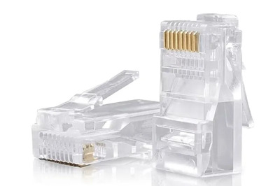

নেটওয়ার্ক কেব্লিঙ্কের ধরণ:
- ইথারনেট কেবল (Ethernet Cable):ক্যাট 5 (Cat 5), ক্যাট 5e (Cat 5 enhanced), ক্যাট 6 (Cat 6), ক্যাট 6a ইত্যাদি 
  - কেবলের দৈর্ঘ্য: সাধারণত ১০০ মিটার পর্যন্ত কার্যকরী হয়।
    
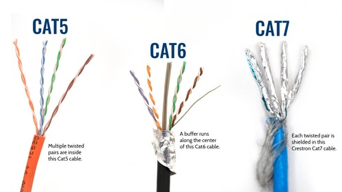

  - Ethernet কেবলের পিনআউট (PoE সহ):
এটি T568A বা T568B স্ট্যান্ডার্ড অনুসারে হয়, এবং নিচে দেখানো হয়েছে কিভাবে ডেটা এবং পাওয়ার পিন সংযুক্ত থাকে:

    - T568A Standard (PoE):
      - পিন ১ (White/Green): ডেটা
      - পিন ২ (Green): ডেটা
      - পিন ৩ (White/Orange): ডেটা
      - পিন ৪ (Blue): পাওয়ার
      - পিন ৫ (White/Blue): পাওয়ার
      - পিন ৬ (Orange): ডেটা
      - পিন ৭ (White/Brown): পাওয়ার
      - পিন ৮ (Brown): পাওয়ার
    - T568B Standard (PoE):
      - পিন ১ (White/Orange): ডেটা
      - পিন ২ (Orange): ডেটা
      - পিন ৩ (White/Green): ডেটা
      - পিন ৪ (Blue): পাওয়ার
      - পিন ৫ (White/Blue): পাওয়ার
      - পিন ৬ (Green): ডেটা
      - পিন ৭ (White/Brown): পাওয়ার
      - পিন ৮ (Brown): পাওয়ার
      
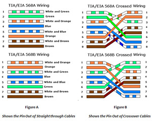

অশিল্ডেড টুইস্টেড পেয়ার (UTP) হল ৪টি তারের জোড়া নিয়ে গঠিত একটি সেট, যেখানে প্রতিটি তার একে অপরের চারপাশে পেঁচানো থাকে যাতে বৈদ্যুতিন চৌম্বকীয় ব্যাঘাত (EMI) প্রতিরোধ করা যায়। উদাহরণস্বরূপ, এখানে একটি টুইস্টেড পেয়ার দেখা যাচ্ছে। ইথারনেটের জন্য ব্যবহৃত UTP তে ৪টি পেয়ার থাকে। প্রতিটি তারের ওপর একটি রঙ কোডেড প্লাস্টিক ইনস্যুলেশন থাকে এবং তারগুলো একটি বাইরের জ্যাকেটে আবৃত থাকে। ইথারনেট পরিবেশে, এই তারগুলো RJ-45 কানেক্টরের সাথে সংযুক্ত থাকে। UTP বা অশিল্ডেড টুইস্টেড পেয়ারের সুবিধা হল এটি কম ব্যয়বহুল এবং অন্যান্য ক্যাবলিং পদ্ধতির তুলনায় যেমন শিল্ডেড টুইস্টেড পেয়ার বা কোঅ্যাক্সিয়াল ক্যাবল, ইনস্টল করা সহজ। UTP এর বিভিন্ন ক্যাটাগরি রয়েছে। সর্বাধিক দূরত্ব হল ১০০ মিটার, যদি সিগন্যাল পুনঃউৎপাদনকারী ডিভাইস যেমন হাব বা সুইচ ব্যবহার না করা হয়। এটি হল সেই ধরণের ক্যাবলিং, যা আপনি সম্ভবত আপনার নেটওয়ার্কিং ক্যারিয়ারে অনেকবার পাবেন, এবং এটি RJ-45 কানেক্টর ব্যবহার করে। 

এখন RJ-45 কানেক্টরের পিন পজিশন সম্পর্কে কথা বলা যাক। দুটি প্রধান বাস্তবায়ন রয়েছে, T568A এবং T568B, এবং প্রতিটি বাস্তবায়নে ক্যাবলিংয়ের পেয়ারিংয়ের মধ্যে কিছুটা পার্থক্য রয়েছে। TIA/EIA-568 টেলিকমিউনিকেশন ক্যাবলিং সিস্টেমের জন্য মান নির্ধারণ করতে তৈরি করা হয়েছে, যেখানে EIA হল ইলেকট্রনিক ইন্ডাস্ট্রিজ অ্যালায়েন্স এবং এটি একটি মানভিত্তিক সংস্থা। TIA/EIA-568C কাঠামোবদ্ধ ক্যাবলিং স্ট্যান্ডার্ড নির্ধারণ করার চেষ্টা করে। A এবং B এর মধ্যে পার্থক্য হল ক্যাবলিংয়ের পেয়ারিং। লক্ষ্য করুন যে A তে সাদা সবুজ স্ট্রাইপ এবং সবুজ সলিড পিন ১ এবং ২ এ সংযুক্ত থাকে, তবে B তে সাদা কমলা স্ট্রাইপ এবং সলিড কমলা পিন ১ এবং ২ এ সংযুক্ত থাকে। এটি বলে যে 568A এবং 568B এর মধ্যে কমলা এবং সবুজের ক্যাবলিংয়ে কিছু পার্থক্য রয়েছে। তবে, এটি কোনও পার্থক্য তৈরি করবে না যেহেতু উভয় কনফিগারেশনই পিনগুলিকে সোজা সংযুক্ত করে। অন্য কথায়, পিন ১ একে অপরের সাথে সংযুক্ত থাকে, পিন ২ পিন ২ এর সাথে সংযুক্ত থাকে এবং এইভাবে চলতে থাকে। 

সবচেয়ে জনপ্রিয় বাস্তবায়ন সাধারণত B হয়, তবে এটি কোনও পার্থক্য তৈরি করবে না যদি উভয় পক্ষ সোজা সংযোগ থাকে। আপনি প্রি-মেড ক্যাবল কিনতে পারেন বা আপনি নিজের ক্যাবল তৈরি করার সিদ্ধান্ত নিতে পারেন। প্রি-মেড ক্যাবল সাধারণত আরও ব্যয়বহুল, তবে এর সুবিধা হল যে এগুলি পরীক্ষা করা হয় এবং আপনি নিজে তৈরি না করেও ব্যবহার করতে পারেন। নিজের ক্যাবল তৈরি করা সস্তা এবং আপনি আপনার প্রয়োজনীয় দৈর্ঘ্য অনুযায়ী ক্যাবল তৈরি করতে পারেন। যখন নিজের ক্যাবল তৈরি করবেন, তখন আপনাকে প্রতিটি রঙের তার আলাদা করতে হবে সঠিক অর্ডারে এবং তারপর প্রতিটি রঙের তারটি RJ-45 কানেক্টরের উপযুক্ত স্লটে রাখতে হবে। তারপর ক্র্যাম্পিং টুল ব্যবহার করে তারটি ক্র্যাম্প করতে হবে এবং অবশেষে ভুলে যাবেন না যে আপনি নিশ্চিত করতে পরীক্ষা করুন যে আপনি সঠিকভাবে ক্র্যাম্প করেছেন কিনা। সোজা সংযোগকারী ক্যাবল হল একটি ধরনের টুইস্টেড পেয়ার কপার ক্যাবল, যা আপনি প্রায়ই লোকাল এরিয়া নেটওয়ার্ক (LAN) এ দেখতে পাবেন। একটি স্ট্যান্ডার্ড সোজা সংযোগকারী ক্যাবলে, এক প্রান্তে কানেক্টরের প্রতিটি পিন অন্য প্রান্তের সম্পর্কিত পিনের সাথে সংযুক্ত থাকে। অন্য কথায়, MDI ডিভাইসের পিন ১, এই ক্ষেত্রে পিসি, পিন ১ এর সাথে সংযুক্ত থাকে MDIX ডিভাইসে, যা এই ক্ষেত্রে একটি হাব। পিন ২ পিন ২ এর সাথে সংযুক্ত থাকে, পিন ৩ পিন ৩ এর সাথে এবং এইভাবে চলতে থাকে। MDI বা মিডিয়া ইন্ডিপেনডেন্ট ইন্টারফেস হল একটি ইথারনেট পোর্ট সংযোগ, যা সাধারণত পিসির নেটওয়ার্ক ইন্টারফেস কার্ড (NIC) এ ব্যবহৃত হয়। MDI রাউটারগুলোও ব্যবহার করে এবং এটি ইথারনেট সুইচগুলোর আপলিঙ্ক পোর্টে ব্যবহার করা যেতে পারে। কিছু পুরানো সুইচে, আপনি সাধারণত আপলিঙ্ক পোর্টে একটি বোতাম দেখতে পাবেন, যা আপনাকে সেই পোর্টের কার্যক্রম পরিবর্তন করতে দেয়। এর মানে হলো আপনি MDI থেকে MDIX এ বা আবার MDIX থেকে MDI তে মোড পরিবর্তন করতে পারবেন। এর ফলে আপনি একটি সোজা সংযোগকারী ক্যাবল ব্যবহার করে এক সুইচ থেকে আরেক সুইচে সংযোগ করতে পারবেন, যা ক্রসওভার ক্যাবলের বদলে হবে, যেটি আমি একটু পরে উল্লেখ করব। অতীতে, আপনি একটি পিসি হাবের সাথে সোজা সংযোগকারী ক্যাবল ব্যবহার করে সংযুক্ত করতেন, যেমন এই উদাহরণে। এখন সোজা সংযোগকারী ক্যাবল ব্যবহার করা হয় তখন যেখানে আপনি পিসি সুইচে, পিসি ব্রিজে, অথবা পিসি হাবে সংযোগ করেন। 

আমি এই ডিভাইসগুলোর কার্যক্রম এবং হাব, ব্রিজ এবং সুইচের মধ্যে পার্থক্য ব্যাখ্যা করব, তবে ক্যাবলিংয়ের দৃষ্টিকোণ থেকে, আপনি পিসি থেকে এই ডিভাইসগুলির একটির সাথে সোজা সংযোগকারী ক্যাবল ব্যবহার করবেন। অতীতে, যখন একে অপরের সমান ধরনের ডিভাইস যেমন দুটি পিসি অথবা দুটি রাউটার সংযুক্ত করতে হতো, তখন ক্রসওভার ক্যাবল ব্যবহার করা হতো। তাই এই ক্ষেত্রে, পিনগুলি সোজা না হয়ে একে অপরের সাথে ক্রস হয়ে থাকে। এই উদাহরণে, দুটি MDI ডিভাইস, অর্থাৎ দুটি পিসি, যা একে অপরের সাথে যোগাযোগ করতে প্রয়োজন, তাদের জন্য একটি ক্রসওভার ক্যাবল প্রয়োজন। এটি 10Base-T বা 100Base-TX এর উদাহরণ। এখানে পিন ৪, ৫, ৭ এবং ৮ ব্যবহার করা হয়নি তবে লক্ষ্য করুন পিন ১ ক্রস করা হয়েছে পিন ৩ এর সাথে, পিন ২ পিন ৬ এর সাথে, পিন ৩ পিন ১ এর সাথে এবং পিন ৬ পিন ২ এর সাথে সংযুক্ত। অন্য কথায়, TX বা ট্রান্সমিট এবং RX বা রিসিভ সঠিকভাবে ক্যাবল করা হয়েছে যাতে TX+ RX+ এর সাথে সংযুক্ত থাকে এবং এইভাবে চলতে থাকে।

MDI (Media Dependent Interface) এবং MDIX (Media Dependent Interface Crossover) হল ইথারনেট ডিভাইসের পোর্টের দুটি প্রকার যা সাধারণত নেটওয়ার্কের সংযোগে ব্যবহৃত হয়। তাদের মধ্যে প্রধান পার্থক্য হল পিনের সংযোগের ধরন। 

### MDI (Media Dependent Interface)
MDI হলো একটি ইথারনেট পোর্ট যা সাধারণত কম্পিউটার বা নেটওয়ার্ক ইন্টারফেস কার্ড (NIC) তে পাওয়া যায়। এটি এক ধরনের পোর্ট যেখানে পিন ১ এবং ২ তে ডেটা ট্রান্সমিট করা হয় এবং পিন ৩ এবং ৬ তে ডেটা রিসিভ করা হয়।

### MDIX (Media Dependent Interface Crossover)
MDIX হলো একটি ইথারনেট পোর্ট যা সাধারণত সুইচ বা হাবের আপলিঙ্ক পোর্টে ব্যবহৃত হয়। MDIX পোর্টের পিনগুলোর সংযোগ ক্রস করা থাকে, অর্থাৎ, পিন ১ এবং ৩ একে অপরের সাথে সংযুক্ত থাকে, এবং পিন ২ এবং ৬ একে অপরের সাথে সংযুক্ত থাকে। এটি এমনভাবে ডিজাইন করা হয়েছে যাতে এটি স্বয়ংক্রিয়ভাবে ডেটা ট্রান্সমিট এবং রিসিভের জন্য সঠিক সংযোগ তৈরি করতে পারে।

### MDI থেকে MDIX মোড
MDI এবং MDIX মোডের মধ্যে যে পার্থক্য রয়েছে, সেটি একটি সুইচ বা হাবে ব্যবহারকারী ডিভাইসগুলির সংযোগে গুরুত্বপূর্ণ। তবে আধুনিক সুইচ এবং রাউটারগুলি সাধারণত **Auto MDI-X** ফিচার সহ আসে, যা ডিভাইসটির পোর্টের সংযোগ পিনের ধরন স্বয়ংক্রিয়ভাবে সনাক্ত করে এবং সঠিক সংযোগ তৈরি করে। এর মানে হল যে আপনি যদি দুটি MDIX পোর্ট (যেমন দুটি সুইচ) সংযুক্ত করতে চান, তবে আপনাকে ক্রসওভার ক্যাবল ব্যবহারের প্রয়োজন পড়ে না। এটি **MDI থেকে MDIX মোড** পরিবর্তন করতে সক্ষম হয়। 

### উদাহরণ:
- যদি একটি সুইচের MDIX পোর্টে একটি পিসি সংযুক্ত করা হয়, তবে MDIX পোর্টটি স্বয়ংক্রিয়ভাবে MDI মোডে চলে আসে এবং সোজা সংযোগকারী ক্যাবল ব্যবহার করে সংযোগ সম্পন্ন হয়। 
- একইভাবে, যদি দুটি সুইচ সংযুক্ত করা হয়, তবে Auto MDI-X ব্যবহারের মাধ্যমে তারা ক্রসওভার ক্যাবল ছাড়াই সংযুক্ত হতে পারে।

MDI থেকে MDIX মোড পরিবর্তন করার জন্য, সুইচের পোর্টে সাধারণত একটি বোতাম বা সেটিং থাকে যা ব্যবহারকারীকে এটি ম্যানুয়ালি কনফিগার করতে দেয়।

- ফাইবার অপটিক কেবল (Fiber Optic Cable): Single-mode fiber এবং Multi-mode fiber দুই ধরনের ফাইবার অপটিক কেবল রয়েছে।
  - Single-Mode Fiber (SMF):
      - দূরত্ব: সাধারণত ২০ কিলোমিটার (২০,০০০ মিটার) বা তার বেশি।
      - গতি: এই কেবল একক কোর (core) দিয়ে আলোর সিগন্যাল প্রেরণ করে, এবং এটি খুব দীর্ঘ দূরত্বে উচ্চ গতি (10Gbps বা তার বেশি) সিগন্যাল ট্রান্সমিট করতে সক্ষম।
      - ব্যবহার: এটি লং ডিস্ট্যান্স নেটওয়ার্কে ব্যবহৃত হয়, যেমন ইন্টারনেট ব্যাকবোন, ট্রান্স-প্রতিবেশী নেটওয়ার্ক এবং অন্যান্য লং রেঞ্জ কমিউনিকেশন সিস্টেম।
  - Multi-Mode Fiber (MMF):
     - দূরত্ব: সাধারণত ৩০০ মিটার থেকে ৫ কিলোমিটার পর্যন্ত কার্যকরী (গতি এবং কেবলটির ধরন অনুযায়ী)।
     - গতি: Multi-mode ফাইবার কেবল সাধারণত কম দূরত্বে কাজ করে এবং এটি কিছুটা কম গতি (1Gbps থেকে 10Gbps) দিয়ে কাজ করে, তবে এটি অনেক সিগন্যাল রিফ্লেকশন এবং রিটার্ন লস সহ্য করতে সক্ষম।
     - ব্যবহার: এটি সাধারণত ডেটা সেন্টার, লোকাল এরিয়া নেটওয়ার্ক (LAN), এবং শিক্ষা প্রতিষ্ঠান বা ছোট প্রতিষ্ঠানের নেটওয়ার্কে ব্যবহৃত হয়।

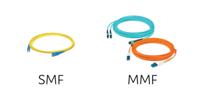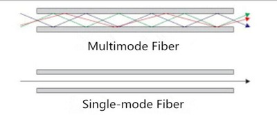

- কোঅ্যাক্সিয়াল কেবল (Coaxial Cable): এটি সাধারণত কেবল টেলিভিশন বা ইন্টারনেট সার্ভিস প্রোভাইডার দ্বারা ব্যবহৃত হয়।


অতিরিক্ত কিছু কেবল টাইপ:
- Patch Cable:
এটি একটি ছোট নেটওয়ার্ক কেবল যা সাধারণত রাউটার, সুইচ, অথবা কম্পিউটার এর মধ্যে সংযোগ স্থাপন করতে ব্যবহৃত হয়।

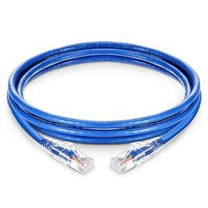
- Crossover Cable:
এই কেবলটি সাধারণত দুইটি একই ধরনের ডিভাইস (যেমন কম্পিউটার থেকে কম্পিউটার, বা রাউটার থেকে রাউটার) সংযুক্ত করার জন্য ব্যবহৃত হয়।
এর মধ্যে একপাশে T568A এবং অন্যপাশে T568B ওয়্যারিং থাকে।


### Broadcast domains 10BaseT
এটি একটি একক ব্রডকাস্ট ডোমেনও। অন্য কথায়, যদি ডিভাইস A একটি ব্রডকাস্ট পাঠায়, তবে নেটওয়ার্কের সকল ডিভাইস সেই ব্রডকাস্ট গ্রহণ করবে এবং সেই ব্রডকাস্ট প্রক্রিয়া করতে হবে। যখন একটি ডিভাইস একটি ব্রডকাস্ট গ্রহণ করে, এটি সেটি প্রক্রিয়া করবে, অন্য কথায় এটি নেটওয়ার্ক ইন্টারফেস কার্ডে গ্রহণ করবে এবং তারপর OSI মডেলের উপরের স্তরে পাঠিয়ে দেবে। উদাহরণস্বরূপ, একটি পিসির সিপিইউ বা কেন্দ্রীয় প্রসেসিং ইউনিট তখন বাধাগ্রস্ত হবে যখন পিসি একটি ব্রডকাস্ট গ্রহণ করবে। 

তাহলে, যদি ডিভাইস A শুরু করে অনেক ব্রডকাস্ট পাঠাতে, তাহলে সেই ব্রডকাস্টগুলি নেটওয়ার্কের সকল ডিভাইস দ্বারা গ্রহণ করা হবে এবং প্রতিটি ডিভাইস বাধাগ্রস্ত হবে এবং ব্রডকাস্ট প্রক্রিয়া করতে হবে। সুতরাং, প্রতিটি পিসির সিপিইউ বাধাগ্রস্ত হবে A দ্বারা পাঠানো প্রতিটি ব্রডকাস্ট দ্বারা এবং সেই ব্রডকাস্ট প্রক্রিয়া করতে হবে। 

যদি A একটি ব্রডকাস্ট পাঠায়, কিন্তু ট্রাফিক শুধুমাত্র B এর জন্য উদ্দেশ্যপ্রাপ্ত হয়, তবুও C এবং D সেই ব্রডকাস্ট গ্রহণ করতে হবে, সেটি প্রক্রিয়া করতে হবে এবং পরে ফেলে দিতে হবে। কিন্তু সমস্যা হল, তাদের সিপিইউ বাধাগ্রস্ত হবে, যা পিসি ধীরগতির হতে পারে।

তাহলে, ম্যাক্সিমাম সেগমেন্ট দৈর্ঘ্য, সেগমেন্টে সর্বাধিক হোস্ট এবং ক্যাবল ভাঙার সমস্যা সম্পর্কে যে সব সমস্যা ছিল, সেই কারণে 10base2 কে প্রতিস্থাপন করা হয়েছিল 10baseT দ্বারা। 10baseT ব্যবহার করে অশিল্ডেড টুইস্টেড পেয়ার, যা বর্তমানে নেটওয়ার্কে দেখা খুব কম সম্ভাবনা। তাই 10baseT বা টুইস্টেড পেয়ার ইথারনেট সেই ক্যাবলের ব্যবহারকে বোঝায়, যা অন্তরকযুক্ত তামার তারের দ্বারা তৈরি, যেগুলি জোড়া হিসেবে পেঁচানো হয় এবং সর্বাধিক দৈর্ঘ্য 100 মিটার। এই ক্যাবলটি অনেক পাতলা এবং আরও নমনীয়, কোঅ্যাক্সিয়াল ক্যাবলের তুলনায়, যা 10base2 এবং 10base5 নেটওয়ার্কে ব্যবহার করা হত।

10baseT-তে আমরা সাধারণত অশিল্ডেড টুইস্টেড পেয়ার ক্যাবল ব্যবহার করি, তবে শিল্ডেড টুইস্টেড পেয়ার ক্যাবল ব্যবহার করা হতে পারে গোলমালপূর্ণ পরিবেশে যেখানে প্রতিটি তারের জোড়ার চারপাশে একটি শিল্ড এবং ক্যাবলগুলির চারপাশে একটি সামগ্রিক শিল্ড থাকে, যা অতিরিক্ত বৈদ্যুতিন চৌম্বকীয় ব্যাঘাত থেকে তাদের সুরক্ষা দেয়। এটি এমন পরিবেশে হতে পারে যেখানে নেটওয়ার্ক ক্যাবল বৈদ্যুতিক ক্যাবলের কাছে থাকে। সুতরাং অতিরিক্ত সুরক্ষার প্রয়োজন হয়। তবে বেশিরভাগ নেটওয়ার্ক অশিল্ডেড টুইস্টেড পেয়ার ব্যবহার করে, যেখানে ক্যাবলগুলিকে একে অপরের মধ্যে ব্যাঘাতের বিরুদ্ধে সুরক্ষিত করা হয় না।

একটি আরেকটি বিষয় হল, 10baseT মানে 10Mbps, "base" মানে হলো বেসব্যান্ড, ব্রডব্যান্ড নয়, এবং "T" মানে হলো টুইস্টেড পেয়ার যার সর্বাধিক সেগমেন্ট সাইজ 100 মিটার। ব্যবহার করা কানেক্টরগুলি হল RJ-45 কানেক্টর, যেমনটি এখানে দেখা যাচ্ছে, এবং আপনি হয়তো পূর্বে অনেকবার RJ-45 কানেক্টর আপনার পিসিতে সংযুক্ত করেছেন। গিগাবিট ইথারনেট স্ট্যান্ডার্ডে সমস্ত পিন সংযুক্ত হওয়া প্রয়োজন। এই একটি উদাহরণ, যেখানে গিগাবিটের জন্য ক্রসওভার ক্যাবল T568B স্ট্যান্ডার্ড ব্যবহার করা হয়েছে। লক্ষ্য করুন, সমস্ত পিন ক্রসওভার ফ্যাশনে কনফিগার করা আছে এবং এই উদাহরণে সমস্ত ৪টি ওয়্যার পেয়ার ব্যবহৃত হয়েছে।

পূর্বে, আপনাকে জানার প্রয়োজন ছিল কখন স্ট্রেইট-থ্রু বা ক্রসওভার ক্যাবল ব্যবহার করতে হবে। উদাহরণস্বরূপ, রাউটার থেকে সুইচ, পিসি থেকে সুইচ, পিসি থেকে ব্রিজ বা পিসি থেকে হাব, এগুলোর জন্য স্ট্রেইট-থ্রু ক্যাবল ব্যবহার করা হত। অন্যদিকে, রাউটার থেকে রাউটার, সুইচ থেকে সুইচ, পিসি থেকে পিসি, হাব থেকে হাব অথবা ব্রিজ থেকে সুইচ, পিসি থেকে সার্ভার এবং রাউটার থেকে রাউটার সংযোগের জন্য ক্রসওভার ক্যাবল প্রয়োজন। তবে আজকাল অটোমেটিক ক্রসওভার বা অটো এমডিআইএক্স ব্যাপকভাবে ব্যবহৃত হচ্ছে। অটো এমডিআইএক্স ১৯৯৮ সালে পরিচিতি পায় এবং এটি ক্রসওভার ক্যাবলের প্রয়োজনীয়তা পুরোটাই অপ্রাসঙ্গিক করে দেয়। এমডিআই ডিভাইসগুলি সাধারণত রাউটার বা পিসি হয় এবং এমডিআইএক্স ডিভাইসগুলি সাধারণত সুইচ বা হাব হয়। এমডিআইএক্স ডিভাইসগুলি হল মিডিয়া ডিপেনডেন্ট ইন্টারফেস ক্রসওভার ডিভাইস। পূর্বে, এমডিআই ডিভাইস যেমন পিসি সুইচ বা হাবে সংযোগ করতে হলে ক্রসওভার ক্যাবল ব্যবহার করতে হত। পুরনো দিনের সুইচে একটি বোতাম থাকত যা এমডিআই থেকে এমডিআইএক্স মোডে পরিবর্তন করতে সাহায্য করত, এর মাধ্যমে একটি সুইচ থেকে সুইচে স্ট্রেইট-থ্রু ক্যাবল ব্যবহার করে সংযোগ করা যেত। তবে আজকাল অনেক ক্ষেত্রে, অটো এমডিআই/এমডিআইএক্স স্বয়ংক্রিয়ভাবে কাজ শুরু করে, যখন ক্যাবল সংযুক্ত করা হয়। ডিভাইসগুলি ক্যাবলের ধরন স্বয়ংক্রিয়ভাবে সনাক্ত করতে পারে, তাই আজকাল ক্যাবল ধরন নিয়ে চিন্তা করার প্রয়োজন কমে গেছে। উদাহরণস্বরূপ, স্ট্রেইট-থ্রু ক্যাবল হাব বা সুইচের মধ্যে ব্যবহার করা যেতে পারে। অতীতে, ২টি সুইচের মধ্যে ক্রসওভার ক্যাবল ব্যবহার করা হত, কিন্তু আজকাল সেই প্রয়োজন আর নেই। স্ট্রেইট-থ্রু ক্যাবল ব্যবহৃত হতে পারে এবং ডিভাইসগুলি বুঝে নিবে কোন পোর্টটি এমডিআই এবং কোন পোর্টটি এমডিআইএক্স।  তবে সাবধান থাকুন, এটি সবসময় সত্য নয়। সাইটে আপনি একটি পুরনো সিসকো সুইচ পেতে পারেন যা অটো এমডিআই/এমডিআইএক্স সমর্থন করে না, সেক্ষেত্রে আপনাকে সঠিক ক্যাবল টাইপ ব্যবহার করতে হতে পারে।

### Cable Categories Cat 1 to Cat 8
কেবল বিভিন্ন ক্যাটাগরির মধ্যে বিভক্ত। সাধারণত, যত উচ্চ ক্যাটাগরি হয়, তত বেশি প্যাঁচ এবং কেবলটি তত কম বৈদ্যুতিন চুম্বকীয় হস্তক্ষেপের প্রতি সংবেদনশীল হয়। উচ্চ ক্যাটাগরির কেবলের ক্ষেত্রে ক্রসটক এবং সিস্টেম নয়ের জন্য স্পেসিফিকেশন আরও কঠোর হয়। উচ্চ ক্যাটাগরি কেবলগুলি সাধারণত উচ্চ ফ্রিকোয়েন্সি এবং উচ্চ গতির সমর্থন করে। আমি যদি তোমার জায়গায় হতাম, তবে আমি কেবলের সমস্ত ক্যাটাগরি মনে রাখার চেষ্টা করতাম না। শুধু এটাকে নেটওয়ার্ক বা ডকুমেন্টেশনে তুমি যে বিভিন্ন ক্যাটাগরি দেখতে পাবে, তার ব্যাখ্যা হিসেবে দেখো। ক্যাটাগরি ১ পূর্বে টেলিফোন এবং মডেমের জন্য ব্যবহৃত হত। সুতরাং 
- ক্যাটাগরি ১ একটি অশিল্ডেড টুইস্টেড ক্যাবলিংয়ের গ্রেড ছিল যা টেলিফোন যোগাযোগের জন্য ডিজাইন করা হয়েছিল এবং একসময় প্রিমাইজ ওয়্যারিংয়ে সবচেয়ে সাধারণ ছিল, তবে এটি ডেটা ট্রান্সমিশনের জন্য উপযুক্ত নয়।
- ক্যাটাগরি ২ পূর্বে টেলিফোন এবং ৪ এমবিপিএস পর্যন্ত ডেটা নেটওয়ার্কের জন্য ব্যবহৃত হত।
- ক্যাটাগরি ৩ পূর্বে ১০ এমবিপিএস পর্যন্ত ডেটা নেটওয়ার্কের জন্য ব্যবহৃত হত, এখন সাধারণত এটি টেলিফোনের জন্য ব্যবহৃত হয়।
- ক্যাটাগরি ৪ ২০ মেগাহার্জ পর্যন্ত সংজ্ঞায়িত হয়েছিল এবং ১৬ এমবিপিএস পর্যন্ত গতি সমর্থন করত।
- ক্যাটাগরি ৫ ১০০ মেগাহার্জ পর্যন্ত সংজ্ঞায়িত এবং ২ পেয়ার ব্যবহার করলে ১০ বা ১০০ এমবিপিএস এবং ৪ পেয়ার ব্যবহার করলে ১ গিগাবিট প্রতি সেকেন্ড পর্যন্ত গতি সমর্থন করত।
- ক্যাটাগরি ৬ ২৫০ মেগাহার্জ পর্যন্ত ফ্রিকোয়েন্সি সংজ্ঞায়িত করে এবং সিগন্যাল Noise এবং ইন্টারফেয়ারেন্স কমানোর জন্য প্রতি ইঞ্চি তন্তু প্যাঁচের সংখ্যা বৃদ্ধি করে।
- ক্যাটাগরি ৭ বা ক্যাট ৭ ৬০০ মেগাহার্জ পর্যন্ত ফ্রিকোয়েন্সি সংজ্ঞায়িত করে এবং ১০ গিগাবিট প্রতি সেকেন্ড পর্যন্ত ১০০ মিটার পর্যন্ত গতি সমর্থন করে।
- ক্যাট ৮ হল পরবর্তী প্রজন্মের টুইস্টেড পেয়ার কেব্লিং স্পেসিফিকেশন এবং এটি ৪০ গিগাবিট প্রতি সেকেন্ড সমর্থন করার জন্য উন্নত হচ্ছে

ক্যাটাগরি ১, ২ এবং ৪ আর ব্যবহৃত হয় না। ক্যাটাগরি ৩ ডেটা নেটওয়ার্কে আর ব্যবহৃত হয় না এবং সাধারণত ক্যাটাগরি ৫ আর ব্যবহৃত হয় না, তবে অনেক ইনস্টলেশনে ক্যাটাগরি ৫ পাওয়া যায়, তাই তুমি এখনো এটি দেখতে পেতে পারো। ক্যাটাগরি ৫ই একটি উন্নতি ছিল ক্যাটাগরি ৫ এর উপরে, 
- এটি ১০০ মেগাহার্জ পর্যন্ত ফ্রিকোয়েন্সি সমর্থন করে এবং
- ১ গিগাবিট প্রতি সেকেন্ড পর্যন্ত গতি সমর্থন করে। এর
- একটি সর্বাধিক দৈর্ঘ্য ১০০ মিটার এবং
- এটি ক্যাটাগরি ৫ এর মতো কিন্তু ক্যাটাগরি ৫ এর স্পেসিফিকেশন উন্নত করেছে,
- noise এবং সিগন্যাল ইন্টারফেয়ারেন্স কমিয়েছে, ফলে কিছু ক্রসটক নতুন স্পেসিফিকেশন দিয়ে উন্নত হয়েছে।

ক্যাটাগরি ৫ এর স্পেসিফিকেশন ক্যাটাগরি ৫ এর স্পেসিফিকেশনকে উন্নত করেছে ক্রসটক স্পেসিফিকেশনে কিছু কড়া নিয়মের মাধ্যমে এবং নতুন ক্রসটক স্পেসিফিকেশন এনেছে যা আসল ক্যাটাগরি ৫ এর স্পেসিফিকেশনে উপস্থিত ছিল না। ক্যাটাগরি ৫ এবং ক্যাটাগরি ৫ই এর ব্যান্ডউইথ একই, অর্থাৎ ১০০ মেগাহার্জ এবং ফিজিক্যাল কেবল কন্সট্রাকশনও এক। বাস্তবে, অধিকাংশ ক্যাটাগরি ৫ কেবলই ক্যাটাগরি ৫ই স্পেসিফিকেশন পূর্ণ করে, যদিও তা পরীক্ষিত বা সার্টিফাইড না হতে পারে।  এটি ১০ গিগাবিট প্রতি সেকেন্ড পর্যন্ত সমর্থন করে তবে কেবলমাত্র ৫৫ মিটার পর্যন্ত। 

ক্যাটাগরি ৬ কেবল যা সাধারণত ক্যাট৬ নামে পরিচিত, এটি গিগাবিট ইথারনেটের জন্য স্ট্যান্ডার্ড কেবল এবং ক্যাটাগরি ৫ বা ক্যাটাগরি ৫ই এবং ক্যাটাগরি ৩ কেবলের স্ট্যান্ডার্ডের সঙ্গে ব্যাকওয়ার্ড কম্প্যাটিবল। ক্যাটাগরি ৫ বা ক্যাটাগরি ৫ই এর তুলনায় ক্যাটাগরি ৬ ক্রসটক এবং সিস্টেম নয়ের জন্য আরও কঠোর স্পেসিফিকেশন প্রদান করে। ক্যাটাগরি ৬ কেবল স্ট্যান্ডার্ড ২৫০ মেগাহার্জ পর্যন্ত পারফরম্যান্স প্রদান করে এবং এটি ১০বেস-টি, ১০০বেস-টিএক্স অথবা ফাস্ট ইথারনেট এবং ১০০০বেসট বা গিগাবিট ইথারনেট সহ ১০ গিগাবিট ইথারনেটের জন্য উপযুক্ত। ক্যাটাগরি ৬এ বা অগমেন্টেড ক্যাটাগরি ৬ ৫০০ মেগাহার্জ পর্যন্ত ফ্রিকোয়েন্সি সংজ্ঞায়িত করে, যা ক্যাটাগরি ৬ এর দ্বিগুণ। এটি ক্রসটকের সাথে সম্পর্কিত উন্নতি অন্তর্ভুক্ত করে এবং ১০ গিগাবিট প্রতি সেকেন্ড পর্যন্ত গতি সমর্থন করে তবে এই ক্ষেত্রে ১০০ মিটার পর্যন্ত কেবল দৈর্ঘ্য সমর্থন করে। ক্যাটাগরি ৬ এর সর্বাধিক কেবল দৈর্ঘ্য ছিল ৫৫ মিটার একটি অনুকূল পরিবেশে তবে কেবল ৩৭ মিটার এমন পরিবেশে যেখানে অনেক ক্রসটক হয়, যেমন কেবলের সাথে একত্রিত হলে। তাই ক্যাটাগরি ৬এ বা ক্যাটাগরি ৬এ স্পেসিফিকেশন উন্নত করেছে যা ১০ গিগাবিট পর্যন্ত ১০০ মিটার সমর্থন করে।  

ক্যাট ৭ এ কানেক্টরগুলি টেরর কানেক্টর হতে পারে, যা সাধারণত ৮পি, ৮সি অথবা ৮ পিন ৮ যোগাযোগ যা আমরা সাধারণত আরজে-৪৫ কানেক্টর হিসাবে চিনি। এখানে একটি টেরর কানেক্টর এবং ক্যাট ৭ এর একটি উদাহরণ দেওয়া হয়েছে, লক্ষ্য করুন ক্যাট ৭ এর কেবলের পেয়ারগুলো একটি ফয়েল শিল্ড দ্বারা সুরক্ষিত এবং পেয়ারগুলির প্যাঁচের সংখ্যা এবং প্রতি ইঞ্চি প্যাঁচের সংখ্যা বৃদ্ধি করা হয়েছে ক্রসটক থেকে সুরক্ষিত থাকতে এবং অতিরিক্ত ১০ কপার টুইনক্স রয়েছে। ক্যাট ৭ কে ক্লাস এফ হিসেবেও পরিচিত এবং এতে ক্লাস এফএও রয়েছে যা ১০০ মেগাহার্জ প্রতি সেকেন্ড পর্যন্ত ফ্রিকোয়েন্সি সংজ্ঞায়িত করে এবং থিওরি অনুযায়ী এটি ৪০ গিগাবিট প্রতি সেকেন্ড এবং ১০০ গিগাবিট প্রতি সেকেন্ড ৫০ মিটার পর্যন্ত সমর্থন করে। এটি বর্তমানে একটি আইএসও বা আইএসও স্ট্যান্ডার্ড হলেও এটি টিআইএ/ইআইএ দ্বারা স্বীকৃত নয়। নতুন ইনস্টলেশনের জন্য সাধারণত ক্যাট ৬এ বা ক্যাট ৭ ব্যবহার করার পরামর্শ দেওয়া হয়। যদি বিদ্যমান ক্যাট ৬ কেবল ব্যবহার করা হয়, তবে কেবলের সেগমেন্টগুলোকে ৩৫০ মেগাহার্জ পর্যন্ত পরীক্ষা করতে হবে এবং টিআইএ/ইআইএ পরামর্শ অনুসারে সীমাবদ্ধ থাকতে হবে। 

এখন ক্যাট ৮ হল পরবর্তী প্রজন্মের টুইস্টেড পেয়ার কেব্লিং স্পেসিফিকেশন এবং এটি ৪০ গিগাবিট প্রতি সেকেন্ড সমর্থন করার জন্য উন্নত হচ্ছে, অর্থাৎ ১০ গিগাবিট ইথারনেটের ৪ গুণ গতি। ক্যাট ৮ এর জন্য প্রযুক্তিগত পরামর্শ মার্চ ২০১৩ সালে মুক্তি পায় এবং এতে রয়েছে ক্লাস ১ এবং ক্লাস ২, অর্থাৎ ক্যাট ৮.১ কেবল এবং ক্যাট ৮.২ কেবেল। ক্যাট ৮.১ সম্পূর্ণভাবে ক্যাট ৬এ এর সাথে ব্যাকওয়ার্ড কম্প্যাটিবল এবং আরজে-৪৫ কানেক্টর ব্যবহার করে আন্তঃসাংবাদিক। ক্যাট ৮.২ ক্যাট ৭ কেবলের সঙ্গে আন্তঃসাংবাদিক হয়, তা আরজে-৪৫ অথবা টেরর কানেক্টর ব্যবহার করে।

### DAC cable SFP
আপনি যে আরেকটি তামা কেবলটি দেখতে পারেন তা হলো ডাইরেক্ট অ্যাটাচমেন্ট কেবল বা DAC কেবল। এই কেবলটি বিভিন্ন দৈর্ঘ্যে পাওয়া যায়, ১৫ মিটার পর্যন্ত। এটি তামার টুইনাক্স ব্যবহার করে এবং প্রতিটি প্রান্তে SFP থাকে। একটি SFP বা স্মল ফর্ম-ফ্যাক্টর প্লাগেবল হল একটি হট প্লাগেবল ট্রান্সসিভার এবং এটি বিভিন্ন মিডিয়া টাইপ যেমন ফাইবার বা তামা সমর্থন করতে পারে। এটি GBIC বা গিগাবিট ইন্টারফেস কনভার্টারগুলির পরিবর্তে ব্যবহৃত হয়। এখানে প্রদর্শিত হচ্ছে একটি উন্নত ছোট ফর্ম প্লাগেবল বা SFP+ যা ১০ Gbps পর্যন্ত ডেটা রেট সমর্থন করে। তাই একটি DAC কেবল একটি SFP+ স্লটে প্রবেশ করে এবং দুটি ডিভাইসের মধ্যে ১০ Gbps সংযোগ সক্ষম করে। অন্যান্য SFP বা SFP+ ফাইবার সমর্থন করবে যা দীর্ঘতর দৈর্ঘ্যে যেতে পারে। তবে এই কেবলটি দুটি ডিভাইসের মধ্যে ১০ গিগাবিট তামা সংযোগের সুবিধা দেয়, যেমন ৭ মিটার মতো স্বল্প দূরত্বে।

### Roll Over Cable
রোলওভার কেবল একটি বিশেষ কেবল যা নেটওয়ার্কিং ডিভাইসের কনসোল সংযোগ করতে ব্যবহৃত হয়। এটি আপনাকে আপনার PC বা ল্যাপটপের সিরিয়াল পোর্ট থেকে রাউটার বা সুইচের কনসোলের সাথে সংযোগ স্থাপন করতে সহায়তা করে। যদি আপনার PC তে সিরিয়াল পোর্ট বা COM পোর্ট থাকে, তাহলে আপনি সরাসরি রোলওভার কেবলের মাধ্যমে রাউটার বা সুইচের কনসোলে সংযোগ করতে পারেন। তবে, অনেক আধুনিক PC তে সিরিয়াল পোর্ট থাকে না, তাই আপনাকে একটি USB থেকে সিরিয়াল পোর্ট কনভার্টার কিনতে হবে, যার একটি পাশে USB সংযোগ এবং অন্য পাশে DB9 পুরুষ কনেক্টর থাকবে। এটি আপনাকে DB9 নারী কনসোল কেবল আপনার PC তে সংযোগ করতে সক্ষম করবে, যার অন্য পাশে RJ-45 কনেক্টর অথবা অন্য DB9 কনেক্টর থাকতে পারে। বেশিরভাগ সিসকো সুইচ এবং রাউটার RJ-45 কনেক্টর ব্যবহার করে, তবে আপনি HP-এর মতো অন্যান্য বিক্রেতাদের ডিভাইসেও DB9 কনেক্টর দেখতে পারেন। তাই একটি DB9 সিরিয়াল আপনার PC তে এবং RJ-45 বা DB9 সিরিয়াল কেবল নেটওয়ার্কিং ডিভাইসের কনসোল পোর্টে সংযোগ করা হবে। একটি রোলওভার কেবলে সব পিনগুলি উল্টানো বা রোলওভার করা থাকে, যেমন পিন ১ পিন ৮-এ, পিন ২ পিন ৭-এ, পিন ৩ পিন ৬-এ এবং এরকম চলতে থাকে যতক্ষণ না পিন ৮ পিন ১-এ সংযুক্ত হয়। আপনি একটি সাধারণ Cat5 বা Cat6 কেবল রোলওভার কেবল হিসেবে ব্যবহার করতে পারেন এবং তারপর শুধু পিন আউটগুলি সরাসরি সংযোগ থেকে রোলওভার কনফিগারেশনে পরিবর্তন করতে পারেন, তবে সাধারণত এটি প্রয়োজন হয় না কারণ বেশিরভাগ নেটওয়ার্কিং ডিভাইস কনসোল কেবল নিয়ে আসে। এই ভিডিওটি ইথারনেট এবং ডেটা ফ্লো সম্পর্কে অনেক কিছু ব্যাখ্যা করেছে, পরবর্তী ভিডিওতে আমরা দেখব কীভাবে ট্রাফিক হাব, ব্রিজ, সুইচ এবং রাউটার দ্বারা ফরওয়ার্ড করা হয়।

---------------------------------------------------------------------------------------------------------------------------
ইথারনেট ১৯৭০-এর দশকে উদ্ভূত হয়েছিল, যা আমাদের অনেকের জন্য অনেক পুরনো মনে হতে পারে। রবার্ট মেটকালফ ছিলেন একজন ব্যক্তি যিনি ইথারনেট উন্নয়নে যুক্ত ছিলেন। তিনি ১৯৭৯ সালে ৩কম নামে একটি কোম্পানি প্রতিষ্ঠা করেছিলেন, যা পরবর্তীতে হুয়াওয়াই প্যাকর্ড দ্বারা কেনা হয়েছিল। ইথারনেট এবং নেটওয়ার্কিং টেলিফোনি পরিবেশের তুলনায় অনেক নতুন, কারণ আলেকজান্ডার গ্রাহাম বেল অনেক অনেক বছর আগে টেলিফোন সিস্টেম উদ্ভাবন করেছিলেন, ইথারনেটের আগমনের অনেক আগে। আমি আপনাকে একটি সংক্ষিপ্ত ইতিহাস জানাতে যাচ্ছি, যা ইথারনেটের ইতিহাস জানা গুরুত্বপূর্ণ, কারণ এটি আমাদের আজকের নেটওয়ার্ক কিভাবে পৌঁছেছে তা ব্যাখ্যা করতে সাহায্য করে এবং কিছু ধারণা স্পষ্ট করতে পারে যা আজকের নেটওয়ার্কে এখনও প্রাসঙ্গিক।

আদি ইথারনেট বাস্তবায়নে যেই নেটওয়ার্ক আর্কিটেকচার ব্যবহৃত হয়েছিল তা ছিল বাস টপোলজি। বাস টপোলজিতে, প্রতিটি ডিভাইস একক কেবলে সংযুক্ত হয় এবং ক্লায়েন্টরা একটি যোগাযোগ লাইনের বা বাসের মাধ্যমে শেয়ার করে। এটি একটি টেলিফোনি পরিবেশে ব্যবহৃত পার্টি লাইন সিস্টেমের মতো ছিল, যেখানে একক কেবল ব্যবহার করে দূরবর্তী এলাকাগুলোতে টেলিফোন সেবা প্রদান করা হতো। সেই সময়ে, কল করার আগে আপনাকে শুনে নিশ্চিত হতে হতো যে কেউ অন্য কেউ কথা বলছে না। একটি কল আসলে, পার্টি লাইনে সংযুক্ত সমস্ত ফোন বাজতে থাকতো। একই ঘটনা ইথারনেট পরিবেশে বাস টপোলজি ব্যবহারের সময় ঘটে। যখন ট্রাফিক সেই কেবলে পাঠানো হয়, এটি সমস্ত ডিভাইস দ্বারা প্রাপ্ত হয় যারা বাসের সাথে সংযুক্ত। এই শেয়ার করা অবকাঠামো মানে, যখন কোনও ডিভাইস সেই নেটওয়ার্কে ট্রাফিক পাঠায়, তখন সমস্ত ডিভাইসই ট্রাফিক গ্রহণ করে। যখন একটি ডিভাইস কথা বলতে চায় বা যোগাযোগ করতে চায়, তাকে নিশ্চিত করতে হবে যে অন্য কোনো ডিভাইস কথা বলছে না, অন্যথায় সংঘর্ষ হতে পারে।

প্রারম্ভিক ইথারনেট বাস্তবায়নে আমরা যা পেয়েছিলাম তা ছিল 10base5, যা থিকনেট নামে পরিচিত এবং এর সর্বোচ্চ সেগমেন্ট আকার ছিল ৫০০ মিটার। আরেকটি শারীরিক বাস্তবায়ন ছিল 10base2, যাকে থিননেট বলা হত, যার সর্বোচ্চ দূরত্ব ছিল ১৮৫ মিটার। ইথারনেটের প্রাথমিক বাস্তবায়নগুলি বাস টপোলজি ব্যবহার করত, যার মানে যখন কোনও ডিভাইস কেবলে একটি সিগন্যাল পাঠায়, সমস্ত ডিভাইসই সেই সিগন্যাল গ্রহণ করত।

এখন 10base2 বাস্তবায়ন নিয়ে আলোচনা করি, যা আশা করি আপনাকে ইথারনেটের বর্তমান বাস্তবায়নের কিছু কারণ বুঝতে সাহায্য করবে। মূলত, ঐতিহাসিক কারণে কিছু কিছু জিনিস আজও একইভাবে করা হয়। 10base2 কক্সিয়াল কেবল বা কক্স কেবল ব্যবহার করত, যার সর্বোচ্চ গতিবেগ ছিল ১০ এমবিপিএস। 10base2 এর মধ্যে "10" মানে ১০ এমবিপিএস গতি, "2" মানে সর্বোচ্চ সেগমেন্ট দৈর্ঘ্য ১৮৫ মিটার, এবং "বেস" মানে হলো বেসব্যান্ড, যা ব্রডব্যান্ডের বিপরীত।

এখন, বেসব্যান্ড এবং ব্রডব্যান্ডের মধ্যে পার্থক্য কি? বেসব্যান্ড শুধুমাত্র একটি সিগন্যালকে একসময় একক তারের মধ্যে চলতে দেয়, এবং সেই সিগন্যাল সমস্ত ফ্রিকোয়েন্সি ব্যবহার করে। অন্যদিকে, ব্রডব্যান্ড, যা কখনও কখনও কেবল টেলিভিশন সেবায় ব্যবহৃত হয়, একই কক্সিয়াল কেবল ব্যবহার করে, একাধিক সিগন্যালকে একসাথে তারের মধ্যে পাঠাতে দেয়।ইথারনেটের 10base2 ব্যবহৃত কক্সিয়াল কেবলের স্পেসিফিকেশন কেবল টেলিভিশন ব্যবহৃত কক্সিয়াল কেবলের থেকে আলাদা। তবে আমি যে পয়েন্টটি বোঝাতে চাই, তা হল, কক্সিয়াল কেবল যা বেসব্যান্ড সিগন্যাল ব্যবহার করে, তা শুধুমাত্র একক সিগন্যাল এক সময়ে প্রেরণ বা গ্রহণ করতে পারে। অন্যদিকে, ব্রডব্যান্ড কক্সিয়াল কেবল ব্যবহার করে যা একসাথে একাধিক সিগন্যাল পাঠাতে পারে। ইথারনেট বেসব্যান্ড সিগন্যালিং ব্যবহার করে, অর্থাৎ 10base2 বা 10base5 এর মতো পুরনো সংস্করণে। 10base2 কেবল ব্যবহৃত হলে, ডিভাইসগুলি নেটওয়ার্কে সংযোগ করতে BNC কনেক্টর ব্যবহার করা হতো। যদিও এই তথ্যটি খুব গুরুত্বপূর্ণ নয়, তবে এটি ইতিহাসের একটি অংশ যা আপনাকে বুঝতে সাহায্য করবে কেন আজকের নেটওয়ার্কে কিছু নির্দিষ্ট পদ্ধতিতে কাজ করা হয়।

এটি বোঝা গুরুত্বপূর্ণ যে একটি একক কেবলে ইন-সিট কনেক্টর থাকত, যা বিভিন্ন ডিভাইসকে একটি কেবলে সংযুক্ত করার সুযোগ দিত। একাধিক ডিভাইস একটি একক কেবলে সংযুক্ত থাকত এবং শেষে টার্মিনেটর ব্যবহার করা হতো যাতে সিগন্যালগুলি ফিরে না আসে এবং সংঘর্ষ সৃষ্টি না করে। টার্মিনেটরের কাজ ছিল সিগন্যালটি বন্ধ করে দেওয়া বা ধ্বংস করা যখন তা কেবলের শেষ প্রান্তে পৌঁছাত। এর মাধ্যমে নিশ্চিত করা হতো যে সিগন্যালটি ফিরে এসে সংঘর্ষ সৃষ্টি না করে। বেসব্যান্ড সিগন্যালিং ব্যবহার করার কারণেই এটি প্রয়োজনীয় ছিল, কারণ বেসব্যান্ড এক সময় শুধুমাত্র একটি সিগন্যাল প্রেরণ করার অনুমতি দেয়।

সিসকো ১৯৮৪ সালে শুরু হয়েছিল এবং যেকোনো কোম্পানি যেন কিছু অদ্ভুত বিতর্কের সাথে শুরু হয়। তারা রাউটার উদ্ভাবনের দাবিদার। এটি তাদের খ্যাতি। "আমরা রাউটার উদ্ভাবন করেছি।" যদিও, আপনি যদি গুগলে এটি টাইপ করেন, আপনি দেখতে পাবেন যে একজন ষাট বছর বয়সী ব্যক্তি বলছেন, "না, আমি রাউটার উদ্ভাবন করেছি, এবং সিসকো এটি চুরি করেছে।" যাই হোক, এটা ঠিক। হয়তো সেই ষাট বছর বয়সী ব্যক্তি রাউটার উদ্ভাবন করেছেন এবং সিসকো এটি চুরি করেছে। তবে অপ্রতিরোধ্যভাবে, সিসকো সেই ধারণাটি নিয়ে এসে সেটিকে পৃথিবীজুড়ে প্রচার করেছে। তারা ব্যাপকভাবে এটি তৈরি করেছে। তাহলে, সিসকোর খ্যাতি হল তারা আজকের নেটওয়ার্কের এক প্রাথমিক ভিত্তি রাউটার তৈরি করেছে। এখন সিসকো হল, সন্দেহাতীতভাবে, স্থিতিশীল নেটওয়ার্ক যন্ত্রপাতির শিল্প নেতা। তাদের বিশ্বের নেটওয়ার্ক অবকাঠামোর বিশাল একটি অংশ তাদের নামের সাথে সম্পর্কিত এবং তাদের স্থিতিশীলতার জন্য খ্যাতি রয়েছে।

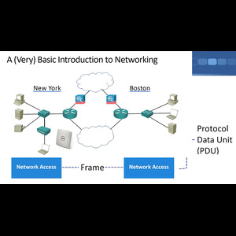

ধরি, আমাদের একটি অফিস আছে নিউ ইয়র্কে, যেখানে আমাদের একটি পিসি, একটি সার্ভার এবং একটি প্রিন্টার রয়েছে, এবং তাদের একে অপরের সাথে যোগাযোগ করতে হবে। এর জন্য, আমি একটি নেটওয়ার্ক সুইচ বসাব এবং ইথারনেট কেবল দিয়ে ডিভাইসগুলো সুইচে সংযুক্ত করব, এবং এই রকম দেখতে একটি সুইচ হবে। সুইচ হল আমার লোকাল এরিয়া নেটওয়ার্ক (LAN) এর জন্য সংযোগ স্থাপনকারী ডিভাইস। নিউ ইয়র্ক অফিসে, হয়তো আমার একটি ল্যাপটপও থাকবে যা ওয়্যারলেস নেটওয়ার্কের মাধ্যমে সংযুক্ত হবে। তাহলে আমি, একটি ফাইল পাঠাতে পারি এই ব্যক্তির থেকে ওই ব্যক্তির কাছে বা একটি ফাইল সার্ভারে সংরক্ষণ করতে পারি, অথবা হয়তো একটি প্রিন্টার থাকতে পারে যা সবাই শেয়ার করছে এবং ব্যবহার করছে, যাতে সবাইকে তাদের নিজস্ব ইনকজেট প্রিন্টার কিনতে না হয়। যেগুলি সমর্থন করা খুবই কষ্টকর, এইটা বলার মতো। সুতরাং, আপনার প্রতিষ্ঠানের মধ্যে সব এই ধরনের যোগাযোগ ঘটতে পারে। সব কিছুই সুইচের মাধ্যমে সমর্থিত। এখন আমার সমস্ত ডিভাইস নিউ ইয়র্কে একে অপরের সাথে কথা বলতে সক্ষম। আমি একটি লোকাল এরিয়া নেটওয়ার্ক তৈরি করেছি, যা এমন একটি নেটওয়ার্ক যা একই স্থানীয় এলাকায়, যেমন একটি অফিস বা বিশ্ববিদ্যালয় ক্যাম্পাসে ডিভাইসগুলোকে সংযুক্ত করে। তবে, আমি চাই না যে আমার অফিসের সমস্ত ডিভাইস শুধুমাত্র একে অপরের সাথে কথা বলুক, তারা ইন্টারনেটের অন্যান্য ডিভাইসের সাথে যোগাযোগও করতে চাবে। এর জন্য, আমি একটি রাউটার ব্যবহার করব, যা নেটওয়ার্কের বিভিন্ন অংশের মধ্যে ট্র্যাফিক রুট করার জন্য উন্নত রাউটিং সিদ্ধান্ত নিতে সক্ষম। রাউটারটি এভাবেই কাজ করে এবং এটি এইরকম দেখতে হবে। এছাড়াও, ইন্টারনেটে হ্যাকারদের মতো খারাপ লোকেরা আক্রমণ করতে পারে, তাই আমি একটি ফায়ারওয়াল স্থাপন করব যা আমাদের নেটওয়ার্কের বিভিন্ন অংশকে একে অপর থেকে নিরাপদ রাখবে।

এখন, নিউ ইয়র্কের অফিসের লোকাল এরিয়া নেটওয়ার্ক ইন্টারনেটের সাথে সংযুক্ত। কিন্তু, একটি বড় কোম্পানিতে একটিমাত্র অফিস থাকে না। ধরুন, আমাদের বস্টনেও একটি অফিস রয়েছে, যেখানে একই ধরনের ডিভাইস থাকবে এবং লোকাল এরিয়া নেটওয়ার্কও থাকবে। আমার নিউ ইয়র্ক এবং বস্টন অফিসের মধ্যে সংযোগ করতে হবে, যাতে দুটি অফিসের ডিভাইসগুলো একে অপরের সাথে যোগাযোগ করতে পারে। আমি যদি চাই, তবে ইন্টারনেটের মাধ্যমে সিকিউরভাবে যোগাযোগ করতে পারি, তবে আরেকটি উপায় হল, দুইটি অফিসের রাউটারগুলির মধ্যে একটি নিবেদিত সংযোগ স্থাপন করা, যা আমাকে দুটি অফিসের মধ্যে একটি বিস্তৃত এলাকা নেটওয়ার্ক (WAN) সংযোগ প্রদান করবে। 

নেটওয়ার্কিংয়ের মূল উদ্দেশ্য হল আমাদের বিভিন্ন ডিভাইসের মধ্যে সংযোগ স্থাপন করা। নেটওয়ার্কের বৈশিষ্ট্যগুলির মধ্যে রয়েছে টপোলজি, যার মাধ্যমে ডিভাইসগুলো একে অপরের সাথে সংযুক্ত হয়, এবং নেটওয়ার্কের গতি, যা সাধারণত বেশি হলে খরচও বেশি হয়। নেটওয়ার্কের অন্যান্য বৈশিষ্ট্যগুলির মধ্যে রয়েছে নিরাপত্তা, যেখানে ফায়ারওয়াল, রাউটার এবং সুইচের নিরাপত্তা ব্যবস্থা অন্তর্ভুক্ত থাকে। এছাড়া, আমাদের নেটওয়ার্কের উপলব্ধতা নিশ্চিত করতে হবে, যেখানে একটি একক ব্যর্থতা এড়াতে বিভিন্ন উপাদানগুলিকে ডাবল করা হয়। স্কেলেবিলিটি এবং নির্ভরযোগ্যতাও গুরুত্বপূর্ণ, যেখানে নেটওয়ার্কটি সহজেই বৃদ্ধি পেতে সক্ষম এবং নির্ভরযোগ্যভাবে কাজ করতে হবে।

অবশেষে, বলব যে, সম্ভবত খুব দ্রুত নয়, কিন্তু একসময় মানুষ বলবে, "আমাদের নিজেদের প্রতিষ্ঠান থেকে বাইরে যোগাযোগ করতে হবে।" তখন আমরা আসি রাউটার এর কাজের দিকে। একটি রাউটার আপনাকে আপনার লোকাল এরিয়া নেটওয়ার্কের (LAN) বাইরে, ওয়াইড এরিয়া নেটওয়ার্কে (WAN), বা বৃহত্তর নেটওয়ার্কে যোগাযোগ করার সুযোগ দেয়। মূলত, রাউটার আপনার নেটওয়ার্ক এবং অন্য একটি নেটওয়ার্কের মধ্যে বিভাজন সীমানা চিহ্নিত করে।রাউটার আপনার নেটওয়ার্ক এবং ইন্টারনেটের মধ্যে বিভাজন সীমানা চিহ্নিত করে। সাধারণত, এটি একটি সুরক্ষা সীমানাও সরবরাহ করে, তবে এটি আপনার ট্রাফিককে সীমাবদ্ধও রাখে। তাই, যখন আমি সব ধরনের যোগাযোগ এখানে প্রেরণ করি, তখন অনেক সময় আমাদের কাছে তথ্যের বন্যা হতে পারে। আমরা বিভিন্ন ধরনের বার্তা নিয়ে আলোচনা করব, কিন্তু আপনি হয়তো ব্রডকাস্ট দেখতে পাবেন যা আপনার পুরো প্রতিষ্ঠানে ছড়িয়ে যাচ্ছে এবং লিক হয়ে অন্য জায়গায় চলে যাচ্ছে। তবে এটি স্কেলেবল হবে না যদি প্রতিটি ব্রডকাস্ট আপনার কোম্পানি থেকে বাইরে চলে যায় এবং সবাই একে অপরের ট্রাফিক দেখতে শুরু করে। তাই এটি এমনভাবে কাজ করে না।

এখানে রাউটার বিভাজন সীমানা তৈরি করে। এখন আমি কিছু ফিচার যোগ করতে পারি যা একটি রাউটারকে সমর্থন করা উচিত, যেমন নিরাপত্তা। আপনি জানেন, এটি অবশ্যই একটি গুরুত্বপূর্ণ কাজ, তবে এটি আবশ্যক নয়। এটি শুধু একটি সীমানা। আমি মনে করি যে একটি রাউটার নেটওয়ার্ক অ্যাড্রেস ট্রান্সলেশন (NAT) নামক একটি সেবা প্রদান করবে, যা আপনার নেটওয়ার্কের আইপি অ্যাড্রেসিংকে ইন্টারনেটের অ্যাড্রেসিংয়ে রূপান্তরিত করবে। এটি একটি দুর্দান্ত ফিচার এবং প্রায় ৯৯% রাউটার এটি করে, তবে এটি আবশ্যক নয়। তাহলে, রাউটার কী করে? এটি আপনার নেটওয়ার্ক থেকে অন্য নেটওয়ার্ক, আপনার পৃথিবী থেকে পৃথিবীর বাকি অংশে এক ধরনের বিভাজন তৈরি করে।
 
## HUB
HUB একটি নেটওয়ার্ক ডিভাইস যা একাধিক ডিভাইসের মধ্যে ডেটা ট্রান্সফার করে। এটি একটি শারীরিক স্তরের ডিভাইস (Layer 1 device) এবং সাধারণত একটি মাল্টি-পোর্ট রিপিটার হিসেবে কাজ করে। HUB একটি ডিভাইস যা প্রাপ্ত সিগন্যালকে অ্যাম্প্লিফাই করে এবং সেটি সমস্ত সংযুক্ত পোর্টে পাঠিয়ে দেয়। এটি ট্রাফিকের কোনো বিশেষ তথ্য বা ডেটা সম্পর্কে জানে না এবং শুধু সিগন্যালটি অন্য পোর্টে পাঠানোর কাজ করে।

### HUB-এর প্রধান বৈশিষ্ট্য:
1. **সিগন্যাল রেপিটেশন**: HUB কোনও ডেটা বিশ্লেষণ না করে কেবলমাত্র সিগন্যালটি গ্রহন করে এবং সেটি অন্য সব পোর্টে পুনরায় পাঠিয়ে দেয়।
2. **ব্রডকাস্ট**: HUB-এ প্রেরিত একটি ফ্রেম সমস্ত সংযুক্ত ডিভাইসের কাছে পৌঁছায়। উদাহরণস্বরূপ, যদি একটি কম্পিউটার HUB-এ একটি ফ্রেম পাঠায়, তাহলে HUB সেই ফ্রেমটি সব ডিভাইসে পাঠায়।
3. **কনফ্লিক্ট ডোমেইন**: HUB একটি একক কনফ্লিক্ট ডোমেইন তৈরি করে। অর্থাৎ, যদি দুটি ডিভাইস একসঙ্গে ডেটা পাঠায়, তাহলে সংঘর্ষ হতে পারে এবং সেই কারণে নেটওয়ার্কের গতি কমে যায়।
4. **থ্রুপুট কমে যাওয়া**: HUB ব্যবহৃত হলে যখন একাধিক ডিভাইস যোগাযোগ করে, তখন নেটওয়ার্কের ব্যান্ডউইথ ভাগ হয়ে যায়, ফলে প্রতি ডিভাইসের জন্য কম ব্যান্ডউইথ থাকে এবং নেটওয়ার্কের কার্যকারিতা কমে যায়।

এটি একটি প্রাথমিক এবং পুরনো প্রযুক্তি, বর্তমানে HUB-এর বদলে সুইচ (Switch) ব্যবহার করা বেশি জনপ্রিয়, কারণ সুইচ শুধু নির্দিষ্ট ডিভাইসের কাছে ডেটা পাঠায় এবং ট্রাফিকের সমস্যা কমায়।

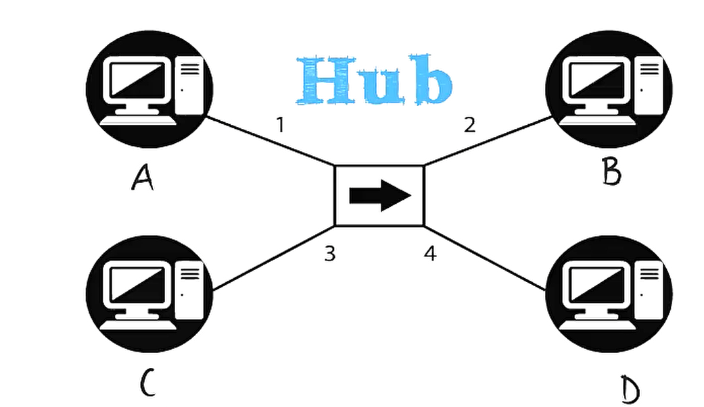
ধরে নিই যে A C-কে ট্রাফিক পাঠাচ্ছে। সুতরাং, ফ্রেমের উৎস ঠিকানা A এবং গন্তব্য ঠিকানা C। A সেই ফ্রেমটি HUB-এ পাঠায়, তাহলে HUB সেই ফ্রেমের সাথে কী করবে? যেহেতু একটি HUB হল একটি মাল্টি-পোর্ট রিপিটার, অন্য কথায় এটি একটি রিপিটার যা একাধিক পোর্টে কাজ করে এবং এর কোনো ট্রাফিকের ওপর কোনো বুঝ নেই, এটি কেবল সিগন্যালটি অ্যাম্প্লিফাই করবে এবং সমস্ত পোর্টে ফ্রেম পাঠাবে, যেগুলোর মধ্যে এটি গ্রহণ করেছে। সুতরাং, এটি একটি ফ্রেম গ্রহণ করে, সেটি অ্যাম্প্লিফাই করে এবং অন্য সব পোর্টে পাঠিয়ে দেয়, যেগুলি ফ্রেমটি প্রথমে প্রাপ্ত হয়নি। সুতরাং, এই টপোলজিতে প্রতিটি ডিভাইস A থেকে C-এ পাঠানো ফ্রেমটি পাবে।

এখন, A C-এ একটি ফ্রেম পাঠাচ্ছে, কিন্তু A ছাড়া অন্য সব ডিভাইস ফ্রেমটি গ্রহণ করবে। B এবং D এর নেটওয়ার্ক ইন্টারফেস কার্ড (NIC) ফ্রেমটি গ্রহণ করবে এবং গন্তব্য MAC ঠিকানা পড়বে, তারা দেখতে পাবে যে গন্তব্য MAC ঠিকানা C এবং তাই ফ্রেমটি তাদের জন্য নয় এবং তাদের NIC গুলি ফ্রেমটি বাদ দিবে। অতএব, D এবং B-এ পাঠানো ফ্রেমগুলি তাদের NIC গুলির মাধ্যমে বাদ পড়ে যাবে। তবে, C হোস্ট ফ্রেমটি গ্রহণ করবে কারণ ফ্রেমটি তার জন্য প্রেরিত। C-এ NIC গন্তব্য MAC ঠিকানা পড়বে এবং এটি দেখে যে ফ্রেমের গন্তব্য MAC ঠিকানা হল নিজেই, সুতরাং এটি ফ্রেমটি গ্রহণ করবে, লেয়ার 2 হেডারগুলি সরিয়ে ফেলবে এবং প্যাকেটটি উচ্চ স্তরের প্রোটোকলে পাঠাবে।

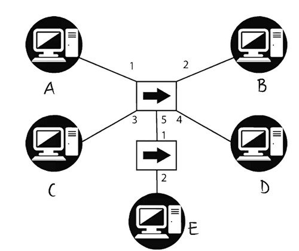

এখন, ধরে নেওয়া যাক যে A C-কে পিং করছে, তাই এটি রিটার্ন ট্রাফিকের প্রয়োজন। সুতরাং C একটি ফ্রেম পাঠাবে, যার উৎস MAC ঠিকানা C এবং গন্তব্য MAC ঠিকানা A। C সেই ফ্রেমটি HUB-এ পাঠায়, HUB সেই ফ্রেমের সাথে কী করবে? আবার, একটি HUB শুধুমাত্র একটি মাল্টি-পোর্ট রিপিটার, এটি ট্রাফিকের ডেটা বুঝে না এবং কেবল সিগন্যালটি অ্যাম্প্লিফাই করবে। তাই ফ্রেমটি B এবং D-এ পাঠানো হবে, যেগুলি ফ্রেমটি বাদ দিয়ে দেবে কারণ গন্তব্য MAC ঠিকানা তাদের জন্য নয়। A ফ্রেমটি গ্রহণ করবে কারণ এটি তার জন্য প্রেরিত, তারপর এটি লেয়ার 2 হেডারগুলি সরিয়ে ফেলবে এবং ডেটা আরও প্রক্রিয়ার জন্য উচ্চ স্তরের প্রোটোকলে পাঠাবে।

অতএব, A এবং C একে অপরের সাথে যোগাযোগ করছে, তবে এটি গুরুত্বপূর্ণ যে HUB একটি শারীরিক স্তরের ডিভাইস যা কেবল একটি মাল্টি-পোর্ট রিপিটার এবং ফ্রেমগুলিকে সমস্ত ইন্টারফেসে অ্যাম্প্লিফাই করবে। B এবং D A এবং C এর মধ্যে পাঠানো সমস্ত ফ্রেম দেখতে পাবে। শারীরিকভাবে এই টপোলজি একটি স্টার টপোলজি, কিন্তু যুক্তির দিক থেকে এটি এমনভাবে কাজ করে না। HUB-এর শারীরিক টপোলজি একটি স্টার, কিন্তু যুক্তিগতভাবে এটি একটি বাস টপোলজি। নেটওয়ার্কে শারীরিক এবং যুক্তিগত টপোলজির মধ্যে পার্থক্য বুঝতে খুবই গুরুত্বপূর্ণ।

এটা মনে রাখা জরুরি যে যখন একটি ডিভাইস HUB পরিবেশে ট্রাফিক পাঠায়, তখন সমস্ত ডিভাইস একটি ফ্রেম পায়, এবং এটি 10BASE2 বা 10BASE5 এর মতো ঠিক কাজ করে। HUB এমনভাবে কাজ করে যেমন 10BASE2 পরিবেশে যখন নেটওয়ার্কে কোনও সংঘর্ষ ঘটে, তা সব ডিভাইসে প্রভাব ফেলে। এটি একটি একক সংঘর্ষ ডোমেইন, যেখানে যেকোনো জায়গায় সংঘর্ষ হলে ডিভাইসগুলো ব্যাকঅফ করবে, একটি জামিং সিগন্যাল পাঠাবে এবং আবার ট্রান্সমিট করার চেষ্টা করবে। HUB পরিবেশে ডিভাইসের সংখ্যা বাড়ানোর সঙ্গে সঙ্গে সংঘর্ষের সংখ্যা বৃদ্ধি পায় এবং নেটওয়ার্কের throughput কমে যায়। 

এছাড়া, ব্রডকাস্ট সমস্ত ডিভাইস দ্বারা গ্রহণ করা হয় কারণ এটি একটি একক ব্রডকাস্ট ডোমেইন। B দ্বারা পাঠানো একটি ব্রডকাস্ট সকল ডিভাইস দ্বারা গ্রহণ করা হবে। এটি একটি একক ব্রডকাস্ট ডোমেইন কারণ সমস্ত ডিভাইসকে নেটওয়ার্কের অন্যান্য ডিভাইস দ্বারা পাঠানো ব্রডকাস্ট প্রক্রিয়া করতে হয়। ব্রডকাস্ট ট্রাফিক সমস্ত নেটওয়ার্কে প্রবাহিত হবে এবং প্রতিটি ডিভাইসের CPU কে বিরক্ত করবে, যা obviously আদর্শ নয়। ব্যান্ডউইথের দিক থেকে এটি হতে পারে 10BASE-T, যেখানে 10 মানে 10 Mbps, কিন্তু এটি 10 Mbps সবার মধ্যে ভাগ করা। 

ধরি যে আমাদের নেটওয়ার্কে 10 Mbps ব্যান্ডউইথ রয়েছে এবং চারটি ডিভাইস রয়েছে, যেখানে সর্বোচ্চ ব্যবহৃত ব্যান্ডউইথ 30%, তার মানে প্রতিটি ডিভাইস মাত্র 0.75 Mbps থ্রুপুট পাবে। এটি 10 Mbps নির্দিষ্ট নয়, এটি 10 Mbps সবার মধ্যে ভাগ করা।

সারাংশে, HUB গুলি OSI মডেলের শারীরিক স্তরে অবস্থান করে। এগুলি বুদ্ধিমান নয় এবং তারা যে ফ্রেমগুলি পুনরাবৃত্তি করছে তা বুঝে না। HUB শুধুমাত্র সিগন্যালটি গ্রহণ করে এবং অন্যান্য সব পোর্টে পাঠিয়ে দেয়, তবে যেখানে এটি গ্রহণ হয়েছে সে পোর্টটি বাদে। HUB তাদের সময়ের জন্য ভাল ছিল, কিন্তু বর্তমানে এগুলি সাধারণত সুইচ দ্বারা প্রতিস্থাপিত হয়েছে। তবে সবসময় একটি ব্যতিক্রম থাকে। ওয়্যারলেস নেটওয়ার্ক HUB এর মতো কাজ করে; যদি আপনার ৫৪ এমবিপিএস ওয়্যারলেস নেটওয়ার্ক থাকে, তবে সাবধান থাকুন, এটি ৫৪ এমবিপিএস ডেডিকেটেড নয়, অথবা যদি আপনার ২০০ এমবিপিএস ওয়্যারলেস নেটওয়ার্ক থাকে, তবে সাবধান থাকুন, এটি সমস্ত ডিভাইসের মধ্যে ভাগ করা হয়। সুতরাং আপনাকে আপনার ওয়্যারলেস নেটওয়ার্কের গতি ভাগ করতে হবে সংযুক্ত ডিভাইসগুলির মধ্যে। ওয়্যারলেস নেটওয়ার্কে আরও কিছু সমস্যা থাকে যা থ্রুপুট আরও কমিয়ে দেয়, তবে গল্পের নৈতিকতা হল যে, ওয়্যারলেস নেটওয়ার্ক HUB হিসেবে কাজ করে। HUB গুলি ভাগ করা ডিভাইস ছিল যা তাদের সময়ে ভাল ছিল, কিন্তু আজকের সুইচগুলির তুলনায় খুব ধীর ছিল। অতএব, সময়ের সাথে HUB গুলি ব্রিজ দ্বারা প্রতিস্থাপিত হয়েছে এবং ব্রিজ গুলি সুইচ দ্বারা প্রতিস্থাপিত হয়েছে। ব্রিজ একটি লেয়ার ২ ডিভাইস, অন্য কথায় এটি OSI মডেলের ডেটা লিঙ্ক স্তরে অবস্থান করে, ব্রিজগুলি HUB এর চেয়ে আরও বুদ্ধিমান। তারা একটি MAC ঠিকানা টেবিল ব্যবহার করে ডিভাইসগুলি টপোলজি কোথায় রয়েছে তা জানতে। সুতরাং তারা কেবল সিগন্যাল পুনরাবৃত্তি করে এবং এটি বুঝে না, বরং ব্রিজগুলি একটি টেবিল বজায় রাখে যা MAC ঠিকানাগুলির তালিকা শিখে নেয় এবং সেই অনুযায়ী ট্রাফিক পাঠায়।

# ব্রিজ (Bridge)
ব্রিজ (Bridge) হল একটি নেটওয়ার্ক ডিভাইস যা দুটি বা দুটি বেশি নেটওয়ার্ক সেগমেন্টকে একত্রিত করে। এটি মূলত লেয়ার 2 ডিভাইস, যা OSI মডেলের ডেটা লিঙ্ক লেয়ারে কাজ করে। ব্রিজের প্রধান কাজ হল দুটি নেটওয়ার্ক সেগমেন্টের মধ্যে তথ্য আদান-প্রদান করা এবং যোগাযোগ নিশ্চিত করা।

### ব্রিজের কাজের মূল বৈশিষ্ট্য:

1. **MAC ঠিকানা টেবিল ব্যবহার**: ব্রিজ একটি MAC ঠিকানা টেবিল তৈরি করে, যেখানে এটি শিখে নেয় যে কোন ডিভাইস কোন পোর্টে সংযুক্ত রয়েছে। এটি এই টেবিল ব্যবহার করে ফ্রেম ফরওয়ার্ডিং সিদ্ধান্ত নেয়।

2. **ফ্রেম ফরওয়ার্ডিং**: যখন একটি ফ্রেম ব্রিজে আসে, ব্রিজ প্রথমে এর সোর্স এবং ডেস্টিনেশন MAC ঠিকানা চেক করে। তারপর, যদি ব্রিজ জানে কোথায় গন্তব্য MAC ঠিকানা রয়েছে, এটি সেই পোর্টে ফ্রেমটি ফরওয়ার্ড করে। অন্যথায়, এটি ফ্রেমটি সমস্ত পোর্টে পাঠায় (ফ্লাডিং)।

3. **সংঘর্ষের ডোমেন ভাগ করা**: ব্রিজে প্রতিটি পোর্ট আলাদা সংঘর্ষের ডোমেন তৈরি করে। এর মানে, একটি পোর্টে সংঘর্ষ হলেও তা অন্য পোর্টগুলিকে প্রভাবিত করে না, যা হাবের ক্ষেত্রে হয়।

4. **ব্রডকাস্ট ডোমেন**: যদিও প্রতিটি পোর্ট একটি আলাদা সংঘর্ষের ডোমেন তৈরি করে, ব্রিজ এখনও একটি একক ব্রডকাস্ট ডোমেন হয়। অর্থাৎ, ব্রিজে একটি পোর্টে পাঠানো ব্রডকাস্ট ফ্রেমটি অন্য সব পোর্টে পাঠানো হয়।

5. **নেটওয়ার্ক পারফরম্যান্স উন্নতি**: ব্রিজ হাবের তুলনায় আরো বুদ্ধিমান, কারণ এটি শুধু তথ্য ফরওয়ার্ড করে না বরং MAC ঠিকানা টেবিল ব্যবহার করে ট্রাফিক পরিচালনা করে, যা নেটওয়ার্কের কার্যকারিতা বৃদ্ধি করে এবং ব্যান্ডউইথ সংরক্ষণ করে।

### ব্রিজের সুবিধা:
- **ব্যান্ডউইথ সংরক্ষণ**: ব্রিজ শুধুমাত্র সেই পোর্টে ফ্রেম ফরওয়ার্ড করে যেখানে গন্তব্য ডিভাইস রয়েছে, ফলে অন্য পোর্টগুলিতে অপ্রয়োজনীয় ট্রাফিক পাঠানো হয় না।
- **সংঘর্ষের ডোমেন ভেঙে দেয়**: ব্রিজ একাধিক সংঘর্ষের ডোমেন তৈরি করে, ফলে এক পোর্টে সংঘর্ষের প্রভাব অন্য পোর্টে পড়ে না।
- **নেটওয়ার্কের বিভাজন**: ব্রিজ ব্যবহার করে একাধিক নেটওয়ার্ক সেগমেন্ট একত্রিত করা যায়, যা নেটওয়ার্কটিকে আরও স্কেলেবল এবং ম্যানেজযোগ্য করে তোলে।

### সীমাবদ্ধতা:
- **ব্রডকাস্ট ট্রাফিক**: ব্রিজ এখনও একটি একক ব্রডকাস্ট ডোমেন তৈরি করে, তাই ব্রডকাস্ট ট্রাফিক সমস্ত ডিভাইসে পৌঁছায়, যা নেটওয়ার্কের পারফরম্যান্সকে প্রভাবিত করতে পারে।
- **ধীর গতির প্রক্রিয়াকরণ**: ব্রিজ সাধারণত সফ্টওয়্যারে প্রক্রিয়া করে, তাই এটি স্যুইচের মতো হার্ডওয়্যারে প্রক্রিয়া করা ডিভাইসগুলির তুলনায় ধীরগতিতে কাজ করে।

সাধারণত, স্যুইচ (Switch) প্রযুক্তি ব্রিজের তুলনায় উন্নত এবং বেশি ব্যবহৃত, কিন্তু ব্রিজ এবং স্যুইচের কাজের ধরন অনেকটাই একই।

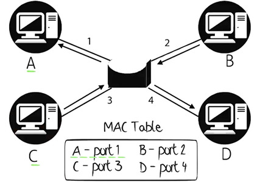

পূর্ববর্তী উদাহরণের মতো, আমরা ধারণা করি যে C, A এর প্রতি উত্তর দিচ্ছে। তাই C একটি ফ্রেম ব্রিজে পাঠায়, ব্রিজ ফ্রেমের সোর্স MAC ঠিকানা পড়বে এবং তারপর তার MAC ঠিকানা টেবিলটি সেই তথ্য দিয়ে আপডেট করবে। এখন ব্রিজ জানে যে C পোর্ট 3-এ এবং A পোর্ট 1-এ রয়েছে, কারণ এটি পূর্ববর্তী ফ্রেম থেকে এটি শিখেছে। এখন, একটি হাবের মতো নয়, ব্রিজ ফ্রেমটি সমস্ত পোর্টে ফরওয়ার্ড করে না। ফ্রেমের গন্তব্য ঠিকানা A, ব্রিজ জানে যে MAC ঠিকানা A পোর্ট 1-এ রয়েছে, তাই এটি শুধুমাত্র পোর্ট 1-এ ফ্রেমটি ফরওয়ার্ড করবে। সুতরাং C থেকে আসা ফ্রেমটি শুধুমাত্র পোর্ট 1-এ যাবে, এটি পোর্ট 2 বা পোর্ট 4 থেকে পাঠানো হবে না কারণ ব্রিজ জানে যে A পোর্ট 1-এ রয়েছে। এটি কি মানে? সমস্ত পরবর্তী ফ্রেম A এবং C থেকে শুধুমাত্র পোর্ট 1 এবং 3 ব্যবহার করবে। অন্য কথায়, যদি A আরেকটি ফ্রেম C তে পাঠায় তবে এটি শুধুমাত্র পোর্ট 3-এ যাবে, কারণ A এবং C এর MAC ঠিকানা MAC ঠিকানা টেবিলে রয়েছে এবং ব্রিজ সেই টেবিলের তথ্যের উপর ভিত্তি করে ট্রাফিক ফরওয়ার্ড করবে। B এবং D এখন A এবং C এর মধ্যে ফ্রেমগুলি আর পাচ্ছে না। 
C থেকে A তে আসা ফ্রেমগুলি পোর্ট 3 থেকে পোর্ট 1-এ যাবে এবং A থেকে C তে আসা ফ্রেমগুলি পোর্ট 1 থেকে পোর্ট 3-এ যাবে। সুতরাং A এবং C একটি আলাদা কথোপকথন করতে পারে যা B এবং D থেকে স্বাধীন। B এবং D এখন A এবং C এর মধ্যে পাঠানো ফ্রেমগুলি আর পাচ্ছে না। A এবং C এর মধ্যে পাঠানো ফ্রেমগুলি শুধুমাত্র পোর্ট 1 এবং 3 এর মধ্যে সীমাবদ্ধ। এইভাবে ব্যান্ডউইথ সংরক্ষিত হচ্ছে, ডিভাইসগুলি নিজস্ব উদ্দেশ্যে নয় এমন ট্রাফিকের প্রক্রিয়া নিয়ে অপ্রয়োজনীয় কাজ করছে না। ব্রিজের জন্য এটি একটি প্রধান সুবিধা। ব্রিজ সময়ের সাথে সমস্ত MAC ঠিকানাগুলি শিখে ফেলবে, তাই ব্রিজ শিখে নেবে যে A পোর্ট 1-এ, B পোর্ট 2-এ, C পোর্ট 3-এ এবং D পোর্ট 4-এ রয়েছে। এর মানে হল যে সময়ের সাথে B এবং D একটি আলাদা কথোপকথন করতে পারে যা A এবং C থেকে স্বাধীন। দুটি কথোপকথন একে অপরকে প্রভাবিত করবে না। প্রত্যেকটি কথোপকথনের ফ্রেম অন্য কথোপকথনের সঙ্গে হস্তক্ষেপ করবে না। সুতরাং B এবং D একই সময়ে A এবং C এর সাথে যোগাযোগ করতে পারে। এখন ব্রিজের সুবিধাগুলি নিয়ে চলুন। প্রতিটি পোর্ট একটি আলাদা সংঘর্ষের ডোমেন। সুতরাং পোর্ট 1-এ একটি সংঘর্ষ হলে, এটি পোর্ট 3-কে প্রভাবিত করবে না। প্রতিটি ইন্টারফেস একটি আলাদা সংঘর্ষের ডোমেন। 

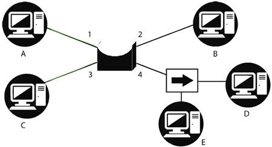

এই উদাহরণে আমাদের কাছে 1, 2, 3, 4 এই সংঘর্ষের ডোমেনগুলি রয়েছে। যদি A এবং B একটি কথোপকথন করছে এবং পোর্ট 3-এ একটি সংঘর্ষ ঘটে, তবে এটি A এবং B কে প্রভাবিত করবে না। তারা এমনকি নেটওয়ার্কে সংঘর্ষ হয়েছে তা জানতেও পারবে না। এখন এই টপোলজিতে আমাদের কাছে একটি হাব সংযুক্ত রয়েছে ব্রিজের পোর্ট 4-এ। একটি হাব একটি একক সংঘর্ষের ডোমেন। তাই হাবে যে কোনও সংঘর্ষ ঘটলে, তা হাবের সাথে সংযুক্ত ডিভাইসগুলিকে প্রভাবিত করবে তবে টপোলজির অন্যান্য ডিভাইসগুলিকে প্রভাবিত করবে না। এটি অর্থাৎ, যদি হাবে একটি সংঘর্ষ ঘটে তবে এটি ডিভাইস D এবং E কে প্রভাবিত করবে, তবে এটি A, C, এবং B-কে প্রভাবিত করবে না। সংঘর্ষের সমস্যাটি হলো, যদি একটি সংঘর্ষ ঘটে, তবে ডিভাইসগুলিকে একটি র্যান্ডম সময়ের জন্য ব্যাকঅফ করতে হয় এবং তারপর তাদের নেটওয়ার্কে পুনরায় প্রবেশের চেষ্টা করতে হয়। তাই যদি ডিভাইস D এবং E একটি সংঘর্ষের ডোমেন শেয়ার করে, তবে তাদের ব্যান্ডউইথ এবং থ্রুপুট A, C, এবং B এর চেয়ে কম হবে, যারা একটি আলাদা সংঘর্ষের ডোমেনের মধ্যে রয়েছে। A, C এবং B একটি একক ব্রডকাস্ট ডোমেন এবং একক সংঘর্ষের ডোমেনের মধ্যে একটি ডেডিকেটেড লিঙ্কে রয়েছে। তবে D এবং E একটি হাবের সাথে সংযুক্ত থাকায় তাদের ব্যান্ডউইথ শেয়ার করতে হয়।  Host A, C এবং B আলাদা সংঘর্ষের ডোমেনের মধ্যে রয়েছে। এখন এটি মনে রাখা গুরুত্বপূর্ণ যে একটি ব্রিজ এখনও একটি একক ব্রডকাস্ট ডোমেন। সুতরাং, যদি A একটি ব্রডকাস্ট পাঠায়, তবে এটি এই টপোলজির সবার দ্বারা গ্রহণ করা হবে। সব ডিভাইস ব্রডকাস্ট গ্রহণ করবে এবং কিছু ক্ষেত্রে এটি ভাল হতে পারে, তবে বেশিরভাগ ক্ষেত্রে এটি নয়। নেটওয়ার্কিংয়ে, আমরা সাধারণত সমস্ত ব্রডকাস্ট ট্রাফিক সীমাবদ্ধ করতে চাই। যখন নেটওয়ার্কে খুব বেশি ব্রডকাস্ট হয়, এটি সমস্ত ডিভাইসকে ধীর করতে পারে এবং সবচেয়ে খারাপ ক্ষেত্রে এটি আপনার নেটওয়ার্ককে ভেঙে ফেলবে। অন্য কথায়, আপনার নেটওয়ার্কটি কাজ করবে না। যে পরিস্থিতিকে আমরা "ব্রডকাস্ট স্টর্ম" বলি। ব্রিজগুলি একবার আবার তথ্য সফ্টওয়ারে প্রক্রিয়া করে, হার্ডওয়্যারে নয়, এবং তাই স্যুইচের মতো ডিভাইসগুলির তুলনায় ধীর গতিতে কাজ করে, যেগুলি হার্ডওয়্যারে ফ্রেম প্রক্রিয়া করে। ব্রিজের পোর্টের সংখ্যা স্যুইচগুলির তুলনায় সীমিত। আজকের পরিবেশে স্যুইচগুলি মূলত ব্রিজগুলির পরিবর্তে কাজ করে, তবে এটি আপনার জন্য এটি উপলব্ধি করা গুরুত্বপূর্ণ যে একটি ব্রিজ এবং একটি স্যুইচ খুব সমানভাবে কাজ করে। সারাংশে, একটি ব্রিজ একটি লেয়ার 2 ডিভাইস, যা OSI মডেলে ডেটা লিঙ্ক লেয়ারে কাজ করে। এটি একটি হাবের চেয়ে আরও বুদ্ধিমান কারণ এটি একটি MAC ঠিকানা টেবিল রয়েছে এবং এটি শিখে নেয় কোথায় MAC ঠিকানাগুলি রয়েছে এবং তারপর সেই MAC ঠিকানাগুলি MAC ঠিকানা টেবিলে যুক্ত করে এবং এরপরে শিক্ষিত সিদ্ধান্ত নিয়ে ট্রাফিক কোথায় ফরওয়ার্ড করতে হবে তা নির্ধারণ করে, যা MAC ঠিকানা টেবিলে থাকা তথ্যের উপর ভিত্তি করে। 

একটি হাব একটি শারীরিক ডিভাইস যা শুধুমাত্র সমস্ত পোর্টে সিগন্যাল পুনরাবৃত্তি করে, ছাড়া সেই পোর্টটি যার উপর ট্রাফিক গ্রহণ করা হয়েছে। একটি ব্রিজ তখন ফ্রেমটি সমস্ত পোর্টে প্লাড করে যখন এটি জানে না কোথায় ফ্রেমটি পাঠাতে হবে, অন্য কথায় এটি শিখেনি যে গন্তব্য MAC ঠিকানা কোথায় রয়েছে। এটি ব্রডকাস্টকেও সমস্ত পোর্টে প্লাড করে। সুতরাং একটি ব্রিজের প্রতিটি পোর্ট একটি আলাদা সংঘর্ষের ডোমেন, তবে একটি ব্রিজ এখনও একটি একক ব্রডকাস্ট ডোমেন।

## Switch
সুইচ (Switch) হলো একটি নেটওয়ার্ক ডিভাইস যা একাধিক ডিভাইস বা কম্পিউটারকে একটি নেটওয়ার্কের মধ্যে সংযুক্ত করতে ব্যবহৃত হয় এবং ডেটা প্যাকেটগুলো সঠিক গন্তব্যে পৌঁছানোর জন্য কাজ করে। সুইচ একটি ডেটা লিংক লেয়ার ডিভাইস, যা ল্যান (LAN) নেটওয়ার্কে ব্যবহৃত হয়।


সুইচগুলি ব্রিজের সাথে খুবই মিল রয়েছে কারণ উভয়ই OSI মডেলের লেয়ার ২ বা ডেটা লিংক লেয়ারে কাজ করে। সুইচিংয়ের তুলনায় ব্রিজিংয়ের একটি বড় সুবিধা হলো যে, প্রক্রিয়াকরণটি হার্ডওয়্যার ব্যবহার করে করা যায়, যাকে ASICs বা অ্যাপ্লিকেশন-স্পেসিফিক ইন্টিগ্রেটেড সার্কিট বলা হয়। সুইচগুলি যে পরিমাণ পোর্ট সাপোর্ট করতে পারে তা ব্রিজের তুলনায় অনেক বেশি, কিছু সুইচে শতাধিক পোর্ট সাপোর্ট করা হয়। অন্যদিকে, ব্রিজে কিছু পোর্টের সীমাবদ্ধতা ছিল। সুইচগুলি এই কাজ করতে পারে কারণ প্রক্রিয়াকরণটি হার্ডওয়্যারে করা হয় এবং বর্তমানে আসলে প্রক্রিয়াকরণটি ওয়্যার স্পিডে হয়, যার মানে হলো যে দুইটি ডিভাইস সুইচের মাধ্যমে সংযুক্ত হলে তাদের মধ্যে কোনো পারফরম্যান্সের অবনতি ঘটে না, অর্থাৎ সুইচগুলি এক পোর্ট থেকে অন্য পোর্টে ট্রাফিক সরানোর সময় তেমন কোনো ধীরগতির সৃষ্টি না করে এটি করতে সক্ষম। আজকের নেটওয়ার্কে ব্রিজগুলির জায়গায় সুইচগুলো ব্যবহৃত হচ্ছে।

 | সুইচগুলি | ব্রিজ |
 | - | - |
 | সুইচগুলিতে অনেক পোর্ট সাপোর্ট থাকে | তবে ব্রিজের পোর্টের সংখ্যা সীমিত |
 | সুইচগুলি ASICs ব্যবহার করে হার্ডওয়্যারে প্রক্রিয়াকরণ করে | ব্রিজগুলি সফটওয়্যারে প্রক্রিয়াকরণ করে |

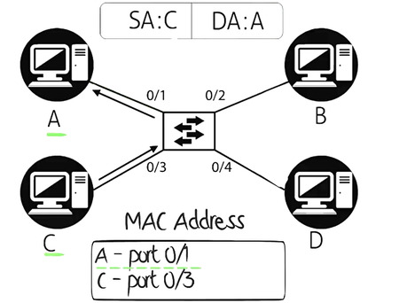

 যদি A একটি ফ্রেম C-কে পাঠায় এবং সেই ফ্রেমটি সুইচের পোর্ট ১-এ পৌঁছায়, তবে সুইচ সেই ফ্রেমটি কী করবে? এখন এই উদাহরণে ধরুন সুইচটি নতুনভাবে চালু হয়েছে। তাই MAC অ্যাড্রেস টেবিলটি খালি, এটি টপোলজির মধ্যে কোথায় কোথায় ডিভাইস রয়েছে তা শিখেনি। তখন সুইচটি, ঠিক ব্রিজের মতো, ফ্রেমটি সমস্ত পোর্টে পাঠাবে কারণ এটি জানে না C কোথায় রয়েছে।

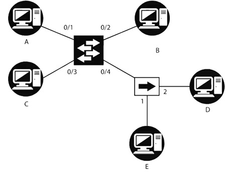

যখন একটি অজানা MAC অ্যাড্রেস সহ ফ্রেম সুইচে পৌঁছায়, তখন সেই ফ্রেমটি সমস্ত পোর্টে ছড়িয়ে দেওয়া হয়, যেগুলির মাধ্যমে ফ্রেমটি আসেনি। তবে, একটি ব্রিজের মতো, সুইচটি কেবল ফ্রেমটি ছড়িয়ে দেয় না, বরং এটি শিখে নেয় যে ডিভাইসগুলি কোথায় রয়েছে। যেমন, যেহেতু ফ্রেমটি পোর্ট ১-এ এসেছে এবং ফ্রেমের সোর্স MAC অ্যাড্রেস A, তাই এটি MAC অ্যাড্রেস টেবিলটিতে লেখা হবে। এখন সুইচ জানে যে MAC অ্যাড্রেস A পোর্ট ১-এ পাওয়া যায়। যখন C A-কে উত্তর দেয়, তখন ফ্রেমটি সুইচের পোর্ট ৩-এ পৌঁছাবে এবং সুইচ তার MAC অ্যাড্রেস টেবিলটি আপডেট করবে, অর্থাৎ সুইচ জানবে যে MAC অ্যাড্রেস C পোর্ট ৩-এ পাওয়া যায়।

এখন, যেহেতু সুইচ জানে যে গন্তব্য MAC অ্যাড্রেস A কোথায় আছে, এটি কেবল পোর্ট ১-এ ট্রাফিক পাঠাবে, কারণ A তার MAC অ্যাড্রেস টেবিলের মধ্যে পোর্ট ১-এ পাওয়া যায়। সুইচ আর ফ্রেমটি সমস্ত পোর্টে পাঠাবে না। এভাবেই, একটি ব্রিজের মতো, A এবং C-এর মধ্যে সমস্ত পরবর্তী ফ্রেম কেবল পোর্ট ১ এবং পোর্ট ৩ এর মধ্যে চলবে। ট্রাফিক পোর্ট ২ বা পোর্ট ৪ থেকে প্রেরিত হবে না। সুইচের প্রতিটি ইন্টারফেস একটি আলাদা সংঘর্ষ ডোমেইন। যদি এই হাবে সংঘর্ষ ঘটে, তবে তা সুইচের অন্য পোর্টগুলিতে প্রভাব ফেলবে না। প্রতিটি পোর্ট একটি আলাদা সংঘর্ষ ডোমেইন তৈরি করে। এই টপোলজিতে ৪টি সংঘর্ষ ডোমেইন রয়েছে। একটি হাব আবার একটি একক সংঘর্ষ ডোমেইন। সুইচ একটি ব্রডকাস্ট এবং মাল্টিকাস্ট ট্রাফিক ডিফল্টভাবে ফ্লাড করে। এই জন্য এটি একটি একক ব্রডকাস্ট ডোমেইন। A যদি একটি ব্রডকাস্ট পাঠায়, তবে এটি সমস্ত পোর্টে ফ্লাড করা হবে এবং সমস্ত ডিভাইস সেই ট্রাফিক পাবে, যা ব্রিজের মতোই কাজ করে। এছাড়া, সুইচগুলির কিছু বড় সুবিধা রয়েছে, যেমন অনেক পোর্ট সমর্থন করতে পারে এবং অনেক সুইচের কাছে ১০০টি পোর্ট পর্যন্ত থাকতে পারে। সুইচগুলি ওয়্যার স্পিডে কাজ করতে সক্ষম এবং তারা ফ্রেমগুলি এক পোর্ট থেকে অন্য পোর্টে তৎপরতার সাথে স্থানান্তর করতে পারে।

# ডুপ্লেক্স মোড" (Duplex Mode)
"ডুপ্লেক্স মোড" (Duplex Mode) একটি কমিউনিকেশন সিস্টেমের সেটিং যা ডেটা ট্রান্সফারের দিক নির্ধারণ করে। এটি দুটি প্রধান ধরনের হয়:

1. **ফুল ডুপ্লেক্স (Full Duplex)**: এই মোডে ডেটা একযোগভাবে দুটি দিক থেকে প্রবাহিত হতে পারে। অর্থাৎ, দুটি ডিভাইস একে অপরকে একই সময়ে ডেটা পাঠাতে এবং গ্রহণ করতে পারে। উদাহরণস্বরূপ, টেলিফোনে দুইজনের একযোগে কথা বলা।

2. **হাফ ডুপ্লেক্স (Half Duplex)**: এই মোডে ডেটা এক দিক থেকে অন্য দিক যেতে পারে, তবে একে অপরকে একসাথে ডেটা পাঠানো এবং গ্রহণ করা সম্ভব নয়। একে একে, একটি ডিভাইস ডেটা পাঠাবে, এবং অন্যটি গ্রহণ করবে। উদাহরণস্বরূপ, দুইটি রেডিও স্টেশন, যেখানে একে একে কথা বলা হয়।

ডুপ্লেক্স মোড মূলত নেটওয়ার্কিং, টেলিকমিউনিকেশন, এবং ডেটা ট্রান্সফার প্রযুক্তিতে ব্যবহৃত হয় এবং এটি নির্ধারণ করে কিভাবে ডেটা একে অপরের মধ্যে ট্রান্সফার হবে।

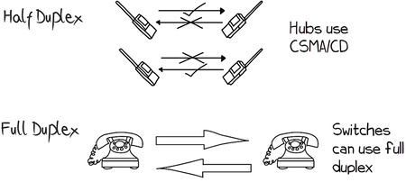

হাফ ডুপ্লেক্স যোগাযোগ হল একটি ওয়াকী টকি যেমন যেখানে শুধুমাত্র একপাশে এক সময়ে পাঠানো যেতে পারে। এক পক্ষ বলবে "হ্যালো! আপনি কেমন আছেন?" এবং "ওভার" শব্দটি অন্য পক্ষকে বলতে ইঙ্গিত করবে। তারপর অন্য পক্ষ কিছু বলবে এবং "ওভার" দিয়ে শেষ করবে, যাতে প্রথম পক্ষ আবার কিছু বলবে। এই গল্পের মোরাল হল যে শুধুমাত্র এক পক্ষই এক সময়ে বার্তা প্রেরণ করতে পারে। যদি উভয় পক্ষ এক সময়ে প্রেরণ করতে চেষ্টা করে, তাহলে সংঘর্ষ হবে, এটি হাফ ডুপ্লেক্স। অন্যদিকে, ফুল ডুপ্লেক্স যোগাযোগ হল একটি ল্যান্ডলাইন টেলিফোনের মতো, যেখানে আপনি একসাথে কথা বলতে এবং শোনার সুযোগ পান। ল্যান্ডলাইন টেলিফোনে দুই পক্ষ একসাথে কথা বলতে এবং শুনতে পারে, যেখানে ওয়াকী টকি হাফ ডুপ্লেক্স ডিভাইস যেখানে এক পক্ষ পাঠাতে পারে এবং অন্য পক্ষ গ্রহণ করতে হবে। ওয়াকী টকি এক সময়ে একটি পক্ষ কথা বলতে পারে, ল্যান্ডলাইন টেলিফোনে উভয় পক্ষ একসাথে কথা বলতে পারে। ওয়াকী টকি হাফ ডুপ্লেক্সের অনুরূপ, ল্যান্ডলাইন টেলিফোন ফুল ডুপ্লেক্সের। হাবগুলি আবার CSMA/CD ব্যবহার করে, অর্থাৎ হাফ ডুপ্লেক্স যেখানে এক সময়ে শুধুমাত্র এক পক্ষই প্রেরণ করতে পারে। তবে একটি সুইচের একটি পৃথক পোর্টে, আপনি সেই পোর্টগুলি ফুল ডুপ্লেক্স ব্যবহার করতে সেট করতে পারেন, যার মানে হল যে সুইচ এবং পিসি উভয়ই একই সময়ে প্রেরণ এবং গ্রহণ করতে পারে। তবে একটি বিষয় মাথায় রাখবেন, যখন আপনি ফুল ডুপ্লেক্স সক্ষম করেন, তখন সংঘর্ষ শনাক্তকরণ বন্ধ হয়ে যায় কারণ ডিভাইসগুলি সেই ধারণায় কাজ করে যে তারা একসাথে প্রেরণ এবং গ্রহণ করতে পারে। তাই সংঘর্ষ শনাক্তকরণের প্রয়োজন নেই কারণ কোনও সংঘর্ষ হবে না। তবে, এটি সমস্যা সৃষ্টি করতে পারে যেখানে একপক্ষ ফুল ডুপ্লেক্সে সেট করা এবং অন্য পক্ষ হাফ ডুপ্লেক্সে সেট করা থাকে। এটি গুরুত্বপূর্ণ যে ফুল ডুপ্লেক্স উভয় পক্ষেই সক্রিয় করা হোক যদি আপনি ফুল ডুপ্লেক্স ব্যবহার করতে চান। তবে, এই উদাহরণে, যদি ফুল ডুপ্লেক্স সক্রিয় করা হয়, তাহলে শুধুমাত্র ১০ Mbps না পেয়ে, আপনি তা ২০ Mbps-এ বাড়াতে পারেন, কারণ উভয় পক্ষই একই সময়ে প্রেরণ এবং গ্রহণ করতে পারে। সুতরাং, শুধু একটি হাবের পরিবর্তে একটি সুইচ প্রতিস্থাপন করলেই, আমরা এই নেটওয়ার্কের থ্রুপুট ০.৭৫ Mbps থেকে ২০ Mbps-এ বৃদ্ধি করতে পারি, আমরা শুধু হাবটি সুইচ দিয়ে প্রতিস্থাপন করেছি এবং ফুল ডুপ্লেক্স সক্ষম করেছি। এখন ফুল ডুপ্লেক্স সাধারণত স্বয়ংক্রিয়ভাবে ডিভাইসগুলির মধ্যে আলোচনার মাধ্যমে নির্ধারিত হয়। সুতরাং, সুইচ এবং পিসি উভয় যদি এটি সমর্থন করে, তবে তারা ফুল ডুপ্লেক্স ব্যবহার করতে আলোচনা করবে এবং সঠিকভাবে নির্বাচন করবে। নেটওয়ার্কে এটি ঘটে যে একপক্ষ ফুল ডুপ্লেক্স চয়ন করে এবং অন্যপক্ষ হাফ ডুপ্লেক্স চয়ন করে। এবং এটি সেই লিঙ্কে অনেক সমস্যা সৃষ্টি করবে। সুতরাং, যদি ব্যবহারকারীরা ধীর গতির থ্রুপুট নিয়ে অভিযোগ করে, তবে উভয় পক্ষের ডুপ্লেক্স চেক করুন এবং এটি সঠিকভাবে আলোচিত হয়েছে কিনা তা পরীক্ষা করুন, কারণ এটি ভুলভাবে আলোচিত হতে পারে। গতি, একইভাবে, সুইচ এবং পিসির মধ্যে আলোচিত হতে পারে এবং তা ভুলভাবে আলোচিত হতে পারে। এই দিনগুলিতে পিসিগুলির গিগাবিট পোর্ট থাকে, এবং সুতরাং ব্যান্ডউইথ ০.৭৫ Mbps থেকে ২ গিগাবিট প্রতি সেকেন্ডে বৃদ্ধি পেতে পারে। সুইচগুলির থ্রুপুট হাবগুলির তুলনায় অনেক বেশি এবং তাই আজকাল সুইচগুলি হাব বা ব্রিজের মতো অন্যান্য ডিভাইসের তুলনায় বেশি পছন্দ করা হয়। তবে মনে রাখবেন যে, ওয়্যারলেস নেটওয়ার্কে অ্যাক্সেস পয়েন্টগুলি হাবের মতো কাজ করে, যার একটি ভাগ করা পরিকাঠামো থাকে, যার মানে হল যে এটি ভাগ করা ব্যান্ডউইথ, যেখানে সুইচগুলির সাথে ডিভাইসগুলির জন্য নিবেদিত ব্যান্ডউইথ থাকে। সুতরাং, সারসংক্ষেপে, একটি সুইচ OSI মডেলের একটি লেয়ার ২ ডিভাইস, এটি ডেটা লিঙ্ক লেয়ারে কাজ করে। সুইচগুলির হাব এবং ব্রিজের তুলনায় বড় সুবিধা রয়েছে এবং তা নেটওয়ার্কের থ্রুপুট এবং স্কেলেবিলিটির সাথে সম্পর্কিত। সুইচগুলি হার্ডওয়্যার-এ ফ্রেম প্রক্রিয়া করে, সফ্টওয়্যারের পরিবর্তে, এবং সুতরাং এটি তার তারের গতিতে ফ্রেম প্রক্রিয়া করতে সক্ষম। পাশাপাশি এটি হাব এবং ব্রিজের তুলনায় অনেক বেশি পোর্ট সমর্থন করে। আজকাল সুইচগুলি লেয়ার ৩ তেও কাজ করতে পারে, তাই একে লেয়ার ৩ সুইচ বলা হয়। তবে এই মুহূর্তে আমরা কেবল নিখুঁত লেয়ার ২ সুইচ সম্পর্কে কথা বলছি। এখন আমরা রাউটারগুলি আলোচনা করব এবং তারপর লেয়ার ৩ সুইচগুলির সম্পর্কে কথা বলব।


 
## LAN 

LAN (Local Area Network) হলো একটি নেটওয়ার্কিং ব্যবস্থা যা একটি ছোট, সীমিত ভূগোলিক অঞ্চলে (যেমন একটি বাড়ি, অফিস, স্কুল বা একটি বিল্ডিং) কম্পিউটার এবং অন্যান্য ডিভাইসগুলিকে সংযুক্ত করে। LAN ব্যবহারকারীদের একে অপরের সাথে তথ্য শেয়ার করতে, রিসোর্স যেমন প্রিন্টার, ফাইল সার্ভার ইত্যাদি শেয়ার করতে এবং ইন্টারনেট সংযোগ ব্যবহার করতে সাহায্য করে।


## WAN
WAN (Wide Area Network) হলো একটি বড় আঞ্চলিক বা আন্তর্জাতিক নেটওয়ার্ক যা বেশ কয়েকটি LAN (Local Area Network) অথবা অন্যান্য ছোট নেটওয়ার্ককে সংযুক্ত করে। WAN সাধারণত একটি বড় ভূগোলিক এলাকা, যেমন একটি শহর, দেশ বা এমনকি পৃথিবীজুড়ে বিস্তৃত থাকে এবং এটি কম্পিউটার, সার্ভার, ডেটাবেস এবং অন্যান্য নেটওয়ার্ক রিসোর্সের মধ্যে যোগাযোগের জন্য ব্যবহৃত হয়।


## রাউটার (Router)

রাউটার (Router) হলো একটি নেটওয়ার্ক ডিভাইস যা দুটি বা তার বেশি নেটওয়ার্কের মধ্যে ডেটা ট্রান্সফার করার কাজ করে। এটি নেটওয়ার্কের মধ্যে ডেটা প্যাকেটগুলির পথ নির্ধারণ করে এবং সেগুলিকে সঠিক গন্তব্যে পৌঁছানোর জন্য পরিচালনা করে। রাউটার সাধারণত ইন্টারনেট এবং লোকাল নেটওয়ার্ক (LAN) বা ওয়াইড এরিয়া নেটওয়ার্ক (WAN) এর মধ্যে সংযোগ স্থাপন করে।


এখন আমরা আসি ওয়ারলেস অ্যাক্সেস পয়েন্টগুলোর দিকে। 
এটি ছিল একটি বিপ্লবী প্রযুক্তি যা পৃথিবীকে বদলে দিয়েছিল। ওয়াইফাই ছিল একটি বিশাল সুরক্ষা দুর্বলতা, তবে এখন এটি বেশ নিরাপদ হয়ে উঠেছে।

এই ভিডিওতে আমরা যে বিভিন্ন নেটওয়ার্ক ডিভাইসের মধ্যে ডেটা প্রবাহের পদ্ধতি দেখছিলাম, তার মধ্যে এই ভিডিওতে আমরা রাউটার সম্পর্কে আলোচনা করবো। রাউটার হলো লেয়ার ৩ ডিভাইস, অর্থাৎ এটি নেটওয়ার্ক লেয়ারে কাজ করে। রাউটার ম্যাক ঠিকানা দ্বারা রাউটিং সিদ্ধান্ত নেয় না, বরং আইপি ঠিকানাগুলি ব্যবহার করে এই সিদ্ধান্ত নেয় যে কোন ইন্টারফেসের মাধ্যমে ট্রাফিক পাঠানো হবে। যদিও রাউটার এখনও ইথারনেট ইন্টারফেসে ম্যাক ঠিকানা ব্যবহার করে, তবে ট্রাফিক কোন ইন্টারফেসের মাধ্যমে পাঠানো হবে, তা আইপি ঠিকানা দ্বারা নির্ধারিত হয়, ম্যাক ঠিকানা দ্বারা নয়। রাউটারের একাধিক সিরিয়াল এবং ইথারনেট ইন্টারফেস থাকতে পারে। ইথারনেট ইন্টারফেস ম্যাক ঠিকানা ব্যবহার করে ট্রাফিক ফরওয়ার্ড করার জন্য লেয়ার ২-এ, কিন্তু সিরিয়াল ইন্টারফেস যেটি PPP ব্যবহার করে তা ম্যাক ঠিকানা ব্যবহার করে না। তাই যখন ট্রাফিক একটি ইন্টারফেসে পৌঁছায় এবং রাউটারটি সিদ্ধান্ত নেয় কোন ইন্টারফেসের মাধ্যমে ট্রাফিক ফরওয়ার্ড করা হবে, তখন সেই সিদ্ধান্ত আইপি ঠিকানা দ্বারা নেওয়া হয়, ম্যাক ঠিকানা দ্বারা নয়। এই টপোলজিতে আমরা আবারও সম্পূর্ণ ৪৮-বিট ম্যাক ঠিকানা ব্যবহারের পরিবর্তে, আমি একে একটি সিম্পল ক্যারেক্টার দিয়ে উপস্থাপন করবো পড়ার সুবিধার্থে এবং ব্যবহারিক সুবিধার জন্য। যেমন, A হলো প্রথম PC এর ম্যাক ঠিকানা এবং এর আইপি ঠিকানা ১০.১.১.১, রাউটারের দুটি ইন্টারফেস রয়েছে। F0/0 এর আইপি ঠিকানা ১০.১.১.১০০ এবং এর ম্যাক ঠিকানা G, এবং F0/1 এর আইপি ঠিকানা ১০.১.২.১০০ এবং ম্যাক ঠিকানা H। এছাড়া কিছু অন্যান্য PC টপোলজিতে দেখানো হয়েছে, যার ম্যাক এবং আইপি ঠিকানা উল্লেখ করা হয়েছে। এই টপোলজিতে আমরা /24 সাবনেট মাস্ক ব্যবহার করছি, যা 255.255.255.0 হিসেবেও লেখা যেতে পারে। সহজ করার জন্য, এই টপোলজিতে PC A এবং PC C দুটি HUB এর মাধ্যমে সংযুক্ত যা রাউটারের F0/0 এর সাথে সংযুক্ত। PC B এবং PC D অন্য একটি HUB এর মাধ্যমে সংযুক্ত যা F0/1 ইন্টারফেসে রাউটারের সাথে সংযুক্ত। তাই রাউটারটি F0/0 এ Host A এবং Host C এর সাথে একই সাবনেটের আইপি ঠিকানা কনফিগার করা হয়েছে, এবং এর F0/1 ইন্টারফেসে B এবং D এর সাথে একই সাবনেটে কনফিগার করা হয়েছে। যখন আপনি একটি রাউটার বা লেয়ার ৩ সুইচে আইপি ঠিকানা কনফিগার করেন, তখন আইপি ঠিকানার সাথে মাস্ক কনফিগার করতে হয়। ফলে রাউটারটি জানে যে এখানে /24 মাস্ক ব্যবহার করা হয়েছে, কারণ এটি আইপি ঠিকানা কমান্ডের অংশ হিসাবে কনফিগার করা হয়েছিল। এরপর রাউটারটি তার রাউটিং টেবিল আপডেট করবে এবং জানাবে যে নেটওয়ার্ক ১০.১.১.০/২৪ F0/0 এর সাথে সরাসরি সংযুক্ত এবং নেটওয়ার্ক ১০.১.২.০/২৪ F0/1 এর সাথে সরাসরি সংযুক্ত। রাউটারগুলো তাদের রাউটিং টেবিলকে আইপি ঠিকানা ব্যবহার করে পূর্ণ করে না, বরং নেটওয়ার্ক ঠিকানা ব্যবহার করে রাউটিং টেবিল পূর্ণ করে। তারা রাউটিং সিদ্ধান্ত নেয় নেটওয়ার্ক ঠিকানা দ্বারা, একক আইপি ঠিকানা দ্বারা নয়। তাই এই উদাহরণে রাউটারগুলো আইপি ঠিকানা এবং /24 মাস্ক দিয়ে কনফিগার করা হয়েছে। যেমন, আইপি ঠিকানা ১০.১.১.১০০ এবং /২৪ মাস্ক সমান ১০.১.১.০/২৪ নেটওয়ার্কের। এই নেটওয়ার্কটি রাউটারের রাউটিং টেবিলে যোগ করা হয়। এই উদাহরণে রাউটারটি জানে যে নেটওয়ার্ক ১০.১.১.০-এ যেতে হলে F0/0 ইন্টারফেসের মাধ্যমে ট্রাফিক পাঠানো উচিত, এবং নেটওয়ার্ক ১০.১.২.০-এ যেতে হলে F0/1 ইন্টারফেসের মাধ্যমে ট্রাফিক পাঠানো উচিত।

## ওয়ারলেস অ্যাক্সেস পয়েন্ট (WAP)

ওয়ারলেস অ্যাক্সেস পয়েন্ট (Wireless Access Point - WAP) হলো একটি নেটওয়ার্ক ডিভাইস যা ওয়্যারলেস ডিভাইসগুলিকে (যেমন স্মার্টফোন, ল্যাপটপ, ট্যাবলেট ইত্যাদি) একটি ওয়্যারড নেটওয়ার্কের সাথে সংযুক্ত করতে সাহায্য করে। এটি একটি ল্যান (LAN) এর অংশ হিসেবে কাজ করে এবং একটি ওয়াই-ফাই নেটওয়ার্ক তৈরি করে, যাতে ডিভাইসগুলো ইন্টারনেট বা নেটওয়ার্ক রিসোর্স ব্যবহার করতে পারে।


# Metropolitan Area Network (MAN)
Metropolitan Area Network (MAN) বলতে এমন একটি কম্পিউটার নেটওয়ার্ক বোঝায় যা একটি নির্দিষ্ট মহানগর বা শহরের মধ্যে বিস্তৃত থাকে। এটি Local Area Network (LAN) এর চেয়ে বড় এবং Wide Area Network (WAN) এর চেয়ে ছোট হয়ে থাকে।

MAN এর বৈশিষ্ট্য:
- ভৌগোলিক বিস্তার: একটি MAN সাধারণত একটি শহর বা মহানগরী, বা তার আশেপাশের এলাকায় বিস্তৃত থাকে (সাধারণত ১০ কিলোমিটার থেকে ৫০ কিলোমিটার পরিসর)।

- উচ্চগতির সংযোগ: MAN সাধারণত উচ্চগতির ফাইবার অপটিক কেবল বা অন্যান্য দ্রুত সংযোগ প্রযুক্তি ব্যবহার করে, যা দ্রুত ডেটা ট্রান্সফার নিশ্চিত করে।

- একাধিক LAN সংযোগ: MAN এর মাধ্যমে একাধিক Local Area Network (LAN) সংযুক্ত থাকে। অর্থাৎ, একাধিক অফিস বা ভবন একে অপরের সাথে যুক্ত থাকে এবং ডেটা শেয়ার করতে পারে।

- ব্যবহারকারীর ধরন: MAN সাধারণত একটি বড় প্রতিষ্ঠান, বিশ্ববিদ্যালয়, সরকারী দপ্তর, অথবা শহর বা এলাকার সাধারণ জনগণের জন্য ব্যবহৃত হতে পারে।

MAN এর কিছু উদাহরণ:
- একটি শহরব্যাপী Wi-Fi নেটওয়ার্ক
- একটি বিশ্ববিদ্যালয়ের বিভিন্ন ভবনগুলোকে সংযুক্ত করতে ব্যবহৃত নেটওয়ার্ক
- শহরের বিভিন্ন সরকারি দপ্তরগুলোকে সংযুক্ত করা

MAN-এর সুবিধা:
- শহর বা এলাকার মধ্যে দ্রুত এবং কার্যকরী যোগাযোগ
- একাধিক অফিস বা ভবনকে দ্রুত সংযুক্ত করা
- কম্পিউটার নেটওয়ার্কে একাধিক ব্যবহারকারীর জন্য আরও উন্নত পরিসেবা
সাধারণভাবে, MAN হল এমন একটি নেটওয়ার্ক যা এক বা একাধিক LAN কে যুক্ত করে, একটি নির্দিষ্ট শহর বা এলাকার মধ্যে দ্রুত তথ্যের আদান প্রদান নিশ্চিত করে।

# PAN (Personal Area Network)
PAN (Personal Area Network) একটি ছোট, ব্যক্তিগত নেটওয়ার্ক যা সাধারণত এক ব্যক্তি বা একটি ছোট অঞ্চলের মধ্যে ব্যবহৃত হয়। এটি ডিভাইসগুলির মধ্যে সংযোগ স্থাপন করার জন্য ব্যবহার করা হয়, যেমন স্মার্টফোন, ল্যাপটপ, ট্যাবলেট, প্রিন্টার, হেডফোন ইত্যাদি।

 PAN-এর বৈশিষ্ট্য:
- ক্ষেত্র এবং বিস্তার: PAN সাধারণত খুব ছোট একটি পরিসরে কাজ করে, যেমন একটি রুম, একটি বাড়ি, অথবা একজন ব্যক্তির কাছাকাছি থাকা ডিভাইসের মধ্যে। এর পরিসর সাধারণত **10 মিটার (30 ফুট)** এর মধ্যে সীমাবদ্ধ থাকে।
- ডিভাইস সংযোগ: PAN এর মাধ্যমে একাধিক ব্যক্তিগত ডিভাইস সংযুক্ত করা যায়, যেমন:
   - স্মার্টফোন ও ল্যাপটপের মধ্যে ডেটা আদান-প্রদান
   - ব্লুটুথ বা ওয়াই-ফাই এর মাধ্যমে বিভিন্ন ডিভাইস সংযুক্ত করা
   - স্মার্টওয়াচ এবং স্মার্টফোনের মধ্যে সংযোগ
- যোগাযোগ প্রযুক্তি: PAN তৈরি করতে সাধারণত **ব্লুটুথ** (Bluetooth), **ইনফ্রারেড** (Infrared), এবং **Wi-Fi** এর মতো প্রযুক্তি ব্যবহার করা হয়। এর মাধ্যমে ডিভাইসগুলো একে অপরের সাথে সংযুক্ত থাকে এবং তথ্য আদান-প্রদান করতে পারে।

PAN-এর কিছু উদাহরণ:
- ব্লুটুথ হেডফোন যা স্মার্টফোনের সাথে সংযুক্ত থাকে।
- ওয়্যারলেস কীবোর্ড বা মাউস যা কম্পিউটারের সাথে সংযুক্ত।
- ইনফ্রারেড ডিভাইস (যেমন, রিমোট কন্ট্রোল) যা ঘরের বিভিন্ন যন্ত্রপাতি নিয়ন্ত্রণ করে।
- Wi-Fi-এর মাধ্যমে দুটি বা ততোধিক ডিভাইসের মধ্যে সংযোগ, যেমন ল্যাপটপ এবং প্রিন্টার।

PAN-এর সুবিধা:
- ব্যক্তিগত এবং নিরাপদ: কারণ এটি একটি ছোট পরিসরে কাজ করে, তাই PAN সাধারণত ব্যক্তিগত এবং নিরাপদ থাকে।
- সহজ এবং দ্রুত সংযোগ: এটি ডিভাইসগুলোকে দ্রুত এবং সহজে সংযুক্ত করতে সহায়তা করে।
- বাধাহীন ডেটা শেয়ারিং: বিভিন্ন ডিভাইসের মধ্যে কোনো তার বা কেবল ছাড়াই ডেটা শেয়ার করা সম্ভব।

সারসংক্ষেপে, PAN (Personal Area Network) হলো একটি ছোট, ব্যক্তিগত নেটওয়ার্ক, যা সাধারণত একজন ব্যক্তির ডিভাইসগুলির মধ্যে যোগাযোগ স্থাপন করার জন্য ব্যবহৃত হয়। এটি সাধারাণত ব্লুটুথ বা ওয়াই-ফাই-এর মাধ্যমে পরিচালিত হয়।

# নেটওয়ার্কের গতি
আমরা গতি কীভাবে পরিচালনা করি তা নিয়ে আলোচনা করব। কেউ কেউ মেগাবাইট প্রতি সেকেন্ড বলে, কেউ কেউ মেগাবিট প্রতি সেকেন্ড বলে, গিগাবিট প্রতি সেকেন্ড বলছে। আসলে এর মানে কী?

আপনি যদি ১০০ মেগাবিট প্রতি সেকেন্ডের সংযোগ থাকে, আপনি আপনার ১০ মেগাবাইটের ফাইলটি কেটে ছোট ছোট ১৫০০ বাইটের প্যাকেটগুলিতে পাঠান, এবং প্রতিটি প্যাকেটে কিছু হেডার ডেটা থাকবে, যেমন এটি কোথা থেকে এসেছে, গন্তব্য কোথায়, পোর্ট নম্বর ইত্যাদি। এই সমস্ত তথ্য প্রেরণ এবং রাউটিংয়ের জন্য অতিরিক্ত ওভারহেড হিসাবে কাজ করে। আপনি সম্ভবত ৮০ মেগাবিট প্রতি সেকেন্ডের মতো কিছু পাবেন, অর্থাৎ কিছুটা কম হবে, কারণ এই অতিরিক্ত ওভারহেডের কারণে। আবার, এটি ধারনা মাত্র, প্রকৃত সংখ্যা নয়।

- 10 MB (megabytes) = 80 megabits (since 1 byte = 8 bits).
- যদি আপনি ১০০ Mbps নেটওয়ার্ক ব্যবহার করেন, তাহলে ট্রান্সফার সময় হিসাব করা যেতে পারে:


``` java
Transfer Time = Network Speed (in  bps) / File Size (in  bits)
              = 100 megabits per second/ 80 megabits
              = 0.8seconds
```
ধরুন, আপনার কাছে ১.৫ গিগাবাইটের একটি সঙ্গীত সংগ্রহ আছে। প্রথমে বলব, ঠিক আছে, এটি ১৫০০ মেগাবাইটের আকার, সঠিক? তারপর ৮ দিয়ে গুণ করি, কারণ আমাকে মেগাবিটে পরিণত করতে হবে। তাহলে, ১৫০০ গুণ ৮, অর্থাৎ ১২,০০০ মেগাবিট ডেটা হবে যা আমাকে স্থানান্তর করতে হবে। এখন, বলব, আমি যদি ১০০ মেগাবিট প্রতি সেকেন্ডের সংযোগে স্থানান্তর করি, এবং যদি আমি বাস্তবে ১০০ মেগাবিট প্রতি সেকেন্ডে থ্রুপুট পেয়ে থাকি, তবে এটি হবে দুটি মিনিটের মতো।"তাহলে, কি বুঝতে পারছেন? যখন আমরা নেটওয়ার্কের সাথে কাজ করি, সবসময় মনে রাখতে হবে "বিট প্রতি সেকেন্ড" এবং "বাইট প্রতি সেকেন্ড" এর মধ্যে পরিবর্তনের বিষয়টি।

``` css
1 TeraByte = 1024 GigaByte
1 GigaByte = 1024 Megabyte
1 Megabyte = 1024 KiloByte
1 KiloByte = 1024 Byte
1 Byte     = 8 Bit
```
# Network Model


## OSI Model
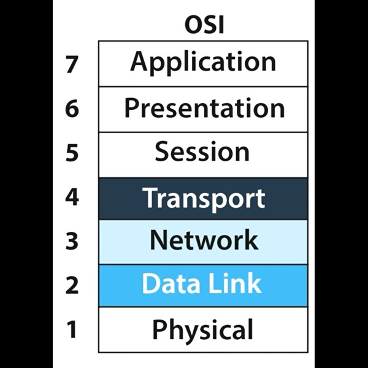

ওপেন সিস্টেমস ইন্টারকানেকশন (OSI) মডেল একটি আন্তর্জাতিক মান, যা আন্তর্জাতিক স্ট্যান্ডার্ড অর্গানাইজেশন (ISO) দ্বারা নির্ধারিত, অর্থাৎ এটি একটি ISO স্ট্যান্ডার্ড। এটি একটি সাধারণ উদ্দেশ্য ফ্রেমওয়ার্ক যা কম্পিউটারগুলির মধ্যে নেটওয়ার্কের মাধ্যমে একে অপরের সঙ্গে যোগাযোগ করার পদ্ধতিকে চিহ্নিত এবং মানক করে। OSI মডেলটি কনসেপ্টুয়াল, এটি একটি শারীরিক বস্তু বা প্রকৃত প্রোটোকল বা প্রযুক্তি নয়। এর সাত স্তরের ডেটা ট্রান্সমিশন পদ্ধতি অপারেশনগুলোকে নির্দিষ্ট সম্পর্কিত গ্রুপে বিভক্ত করে, যেখানে প্রতিটি স্তর তার উপরের স্তরের জন্য সেবা প্রদান করে এবং নিচের স্তর দ্বারা সেবা গ্রহণ করে।
এখানে আমি একটি প্রেরক (যেমন আমার ল্যাপটপ) এবং একটি গ্রহীতা (যেমন আমার ইমেল সার্ভার) এর মধ্যে একটি সুইচের মাধ্যমে সংযুক্ত আছি। আমি একটি ইমেল পাঠাবো আমার ইমেল সার্ভারে। প্রথমে প্রেরকটি একটি ট্র্যাফিক তৈরি করবে যা গ্রহীতার কাছে পাঠানো হবে। এই প্যাকেট তৈরি হওয়ার সময়, এটি উপরের স্তর থেকে শুরু করে নিচের স্তর পর্যন্ত যাবে। প্রেরক প্রথমে লেয়ার ৭-এর তথ্য তৈরি করবে, যা অ্যাপ্লিকেশন লেয়ার। যেমন, যদি আমি একটি ইমেল পাঠাই, তবে এতে 'প্রেরক' এবং 'গ্রহীতা' ক্ষেত্রের মতো তথ্য থাকবে, তারপর এটি লেয়ার ৬ (প্রেজেন্টেশন লেয়ার) এর তথ্যের মধ্যে ইনক্যাপসুলেট হবে। এরপর এটি লেয়ার ৫ (সেশন লেয়ার) এর তথ্যের মধ্যে ইনক্যাপসুলেট হবে। লেয়ার ৫, ৬, এবং ৭ কে উপরের স্তর বলা হয় এবং এগুলি অ্যাপ্লিকেশন ডেভেলপারদের জন্য বেশি গুরুত্বপূর্ণ, নেটওয়ার্ক ইঞ্জিনিয়ারদের জন্য নয়। নেটওয়ার্ক ইঞ্জিনিয়াররা যখন লেয়ার ৪ পর্যন্ত পৌঁছান, এইভাবে প্রেরক সেগমেন্ট তৈরি করবে এবং লেয়ার ৪ (ট্রান্সপোর্ট লেয়ার) এর শিরোনাম সহ এটি ইনক্যাপসুলেট করবে। লেয়ার ৪ হেডার চেক করবে এবং পোর্ট নম্বর দেখে বুঝবে এই ট্র্যাফিকটি তার ইমেল সার্ভার অ্যাপ্লিকেশন নাকি ওয়েব সার্ভার অ্যাপ্লিকেশন।হবে TCP বা UDP, এবং এর মধ্যে পোর্ট নম্বর অন্তর্ভুক্ত থাকবে, যেমন পোর্ট ৮০ ওয়েব ট্র্যাফিকের জন্য, পোর্ট ২৫ আমাদের ইমেল উদাহরণের জন্য। এখন প্যাকেটটি প্রেরক পক্ষ থেকে প্রস্তুত হয়ে ট্রান্সমিট হবে। এরপর লেয়ার ৩ হেডার চেক করবে এবং IP ঠিকানা দেখে নিশ্চিত করবে যে এটি তার জন্য। এটি ইনক্যাপসুলেট করবে। প্রথমে এটি লেয়ার ২ হেডার চেক করবে এবং দেখতে হবে যে প্যাকেটটি তার জন্য কি না। এটি ইনক্যাপসুলেট করবে। এইভাবে পুরো প্যাকেটটি প্রেরক এর সিস্টেমে এনক্যাপসুলেট হয় এবং তা পরের স্তরে পৌঁছায়। যখন এটি গ্রহীতার কাছে পৌঁছাবে, তখন অপারেশনগুলি বিপরীতভাবে হবে, অর্থাৎ ফিজিক্যাল লেয়ার থেকে শুরু হয়ে উপরের দিকে যাবে। এইভাবে পুরো প্যাকেটটি গ্রহীতার সিস্টেমে ডি-এনক্যাপসুলেট হয় এবং তা উপরের স্তরে পৌঁছায়।

OSI মডেল ইঞ্জিনিয়ারদের জন্য একটি বড় সুবিধা প্রদান করে কারণ তারা তাদের নির্দিষ্ট স্তরের ওপর মনোযোগ দিতে পারে এবং উপরের এবং নিচের স্তরের স্ট্যান্ডার্ড অনুসরণ করতে পারে। এটি ওপেন স্ট্যান্ডার্ড । OSI মডেলের স্তরগুলি মনে রাখতে সাহায্য করার জন্য কিছু এক্রোনিম:
একটি জনপ্রিয় এক্রোনিম হল "Please Do Not Throw Sausage Pizza Away" — এর মাধ্যমে আপনি OSI মডেলের স্তরগুলির নাম সহজে মনে রাখতে পারেন:
1.	Physical
2.	Data Link
3.	Network
4.	Transport
5.	Session
6.	Presentation
7.	Application

আরও এক্রোনিমও আছে, যেমন "Please Don't Need Those Stupid Packets Anyway" বা "Please Do Not Touch Superman’s Private Area"।

OSI (Open Systems Interconnection) মডেল একটি তত্ত্বগত নেটওয়ার্ক মডেল যা বিভিন্ন নেটওয়ার্ক প্রোটোকল এবং ডিভাইসের মধ্যে যোগাযোগ কিভাবে পরিচালিত হয় তা ব্যাখ্যা করতে ব্যবহৃত হয়। এটি ৭টি স্তরের একটি কাঠামো হিসেবে ডিজাইন করা হয়েছে, যেখানে প্রতিটি স্তর নির্দিষ্ট একটি ফাংশন বা দায়িত্ব পালন করে। নিচে OSI মডেলের ৭টি স্তরের ব্যাখ্যা দেওয়া হলো:
- **ফিজিক্যাল লেয়ার (Physical Layer)**
  - ফাংশন: এই স্তরটি হার্ডওয়্যার সংক্রান্ত এবং এর কাজ হল ডেটা ট্রান্সমিশনের জন্য উপযুক্ত ফিজিক্যাল মিডিয়া (যেমন কেবল, সিগন্যাল ইত্যাদি) নিশ্চিত করা। এটি বিট স্তরে ডেটা ট্রান্সমিট করে।
  - উদাহরণ: কেবল, রাউটার, হাব, মডেম, সুইচ (ফিজিক্যাল কানেক্টিভিটি)
- **ডেটা লিঙ্ক লেয়ার (Data Link Layer)**
  - ফাংশন: এই স্তরটি ডেটা লিংক তৈরি করে এবং ডেটা প্যাকেটকে ফ্রেমে রূপান্তরিত করে। এটি ডেটা ট্রান্সমিশনের সময় ত্রুটি সনাক্তকরণ এবং সংশোধনও করে।
  - উদাহরণ: Ethernet, MAC (Media Access Control), PPP (Point-to-Point Protocol)
- **নেটওয়ার্ক লেয়ার (Network Layer)**
  - ফাংশন: এই স্তরটি ডেটার গন্তব্যস্থলে পৌঁছানোর জন্য রাউটিং এবং অ্যাড্রেসিং পরিচালনা করে। এটি প্যাকেটগুলোকে এক স্থান থেকে অন্য স্থানে প্রেরণ করতে IP (Internet Protocol) ব্যবহার করে।
  - উদাহরণ: IP, ICMP (Internet Control Message Protocol), Routers
- **ট্রান্সপোর্ট লেয়ার (Transport Layer)**
  - ফাংশন: এই স্তরটি ডেটা ট্রান্সমিশনকে দুটি প্রক্রিয়া, যেমন সংযোগের স্থাপনা, পরিচালনা এবং সমাপ্তি, থেকে শুরু করে সঠিক এবং কার্যকর ডেটা ট্রান্সফারের জন্য দায়িত্ববান। এটি সেশন তৈরি এবং ত্রুটি সংশোধনও করে।
  - উদাহরণ: TCP (Transmission Control Protocol), UDP (User Datagram Protocol)
- **সেশন লেয়ার (Session Layer)**
  - ফাংশন: এই স্তরটি দুটি প্রোগ্রামের মধ্যে যোগাযোগের সেশন স্থাপন, রক্ষণাবেক্ষণ এবং সমাপ্তি করে। এটি ডেটা ট্রান্সফারের সময় সেশন সমন্বয়ও করে।
  - উদাহরণ: NetBIOS, RPC (Remote Procedure Call), SMB (Server Message Block)
- **প্রেজেন্টেশন লেয়ার (Presentation Layer)**
  - ফাংশন: এই স্তরটি ডেটাকে এমনভাবে রূপান্তরিত করে যে এটি অ্যাপ্লিকেশন স্তরের জন্য ব্যবহারযোগ্য। এটি ডেটার এনকোডিং, এনক্রিপশন এবং কম্প্রেশনও পরিচালনা করে।
  - উদাহরণ: JPEG, GIF, Encryption methods (SSL/TLS)
- **অ্যাপ্লিকেশন লেয়ার (Application Layer)**
  - ফাংশন: এটি ব্যবহারকারীর সাথে সরাসরি সম্পর্কিত স্তর, যেখানে নেটওয়ার্ক পরিষেবা ব্যবহারের জন্য বিভিন্ন অ্যাপ্লিকেশন চলে। এটি ডেটার জন্য বিভিন্ন সেবা প্রদান করে।
  - উদাহরণ: HTTP, FTP, SMTP, DNS, POP3, Telnet

সারাংশ:
OSI মডেলটি নেটওয়ার্কিং প্রোটোকল এবং সিস্টেমের মধ্যে যোগাযোগ এবং তথ্য প্রবাহ পরিচালনার জন্য ৭টি স্তরের কাঠামো প্রদান করে। প্রতিটি স্তর একটি নির্দিষ্ট কাজ সম্পন্ন করে এবং একে অপরের সাথে সহযোগিতার মাধ্যমে সঠিক তথ্য আদান-প্রদান নিশ্চিত করে।

## TCP/IP Model
অতীতে IPX/SPX এবং AppleTalk মত অন্যান্য কম্পিউটিং প্রোটোকল ছিল, কিন্তু এখন সেগুলি বিলুপ্ত। TCP/IP এখন সর্বত্র ব্যবহৃত।
এবং যেখানে OSI রেফারেন্স মডেল কনসেপ্টুয়াল, TCP/IP স্ট্যাক প্রকৃতপক্ষে আজকের প্রোডাকশন নেটওয়ার্কে ডেটা স্থানান্তরের জন্য ব্যবহৃত হয়। TCP/IP-রও স্তরযুক্ত কাঠামো রয়েছে, তবে এটি OSI স্তরের সবগুলো ব্যবহার করে না, যদিও স্তরগুলির কার্যক্রম এবং ফাংশনে তাদের সমান।

TCP/IP ১৯৬০ এর দশকে মার্কিন যুক্তরাষ্ট্রের ডিফেন্স ডিপার্টমেন্টের (DoD) অ্যাডভান্সড রিসার্চ প্রজেক্টস এজেন্সি (ARPA) দ্বারা তৈরি করা হয়েছিল। TCP/IP মডেল (Transmission Control Protocol / Internet Protocol model) হল একটি নেটওয়ার্ক যোগাযোগ মডেল যা ইন্টারনেট এবং অন্যান্য কম্পিউটার নেটওয়ার্কে তথ্য স্থানান্তর এবং কমিউনিকেশন ব্যবস্থাপনা করে। এটি একটি প্রোটোকল স্ট্যাক যা মূলত ৪টি স্তরের মধ্যে বিভক্ত। TCP/IP মডেল OSI মডেলের থেকে কিছুটা ভিন্ন হলেও, দুটি মডেলই নেটওয়ার্ক কমিউনিকেশন নিশ্চিত করার জন্য প্রোটোকলের একটি স্তরভিত্তিক কাঠামো প্রদান করে।
এটি একটি প্রোটোকল স্ট্যাক, যা একাধিক প্রোটোকল নিয়ে গঠিত, যার মধ্যে TCP (ট্রান্সমিশন কন্ট্রোল প্রোটোকল) এবং IP (ইন্টারনেট প্রোটোকল) অন্তর্ভুক্ত। এটি একক প্রোটোকল নয়, বরং একটি প্রোটোকল স্ট্যাক। যদি দুটি হোস্ট একে অপরের সাথে যোগাযোগ করতে চায়, তাহলে একটি প্রোটোকল থাকবে যা নির্ধারণ করবে সেই যোগাযোগটি কিভাবে কাজ করবে। 
TCP/IP মডেলের ৪টি স্তর:
- অ্যাপ্লিকেশন লেয়ার (Application Layer):
  - ফাংশন: অ্যাপ্লিকেশন লেয়ারটি ব্যবহারকারী এবং নেটওয়ার্কের মধ্যে যোগাযোগের মূল মাধ্যম হিসেবে কাজ করে। এটি সরাসরি অ্যাপ্লিকেশনগুলো 
  - যেমন ব্রাউজার, ইমেইল ক্লায়েন্ট, ফাইল ট্রান্সফার প্রোটোকল (FTP) এবং অন্যান্য প্রোগ্রামের সাথে যোগাযোগ করে।
  - উদাহরণ: HTTP, FTP, SMTP, DNS, Telnet
  - কাজ: ডেটার ফরম্যাটিং, এনক্রিপশন, এবং এনকোডিং এর জন্য দায়ী।
- ট্রান্সপোর্ট লেয়ার (Transport Layer):
  - ফাংশন: ট্রান্সপোর্ট লেয়ারটি ডেটার নিরাপদ এবং নির্ভরযোগ্য স্থানান্তর নিশ্চিত করে। এটি ডেটা প্যাকেটগুলিকে সেগমেন্টে রূপান্তরিত করে এবং ত্রুটি 
  - সনাক্তকরণ ও সংশোধন পরিচালনা করে। TCP এবং UDP এই স্তরের প্রোটোকল।
  - উদাহরণ: TCP (Transmission Control Protocol), UDP (User Datagram Protocol)
  - কাজ: সংযোগ ভিত্তিক (TCP) অথবা সংযোগ বিহীন (UDP) ডেটা ট্রান্সমিশন।
- ইন্টারনেট লেয়ার (Internet Layer):
  - ফাংশন: ইন্টারনেট লেয়ারটি ডেটার গন্তব্যস্থলে পৌঁছানোর জন্য রাউটিং এবং অ্যাড্রেসিং নিশ্চিত করে। এটি মূলত IP প্রোটোকলের মাধ্যমে ডেটা প্যাকেটগুলিকে বিভিন্ন নেটওয়ার্কের মধ্যে প্রেরণ করে।
  - উদাহরণ: IP (Internet Protocol), ICMP (Internet Control Message Protocol)
  - কাজ: ডেটার জন্য সঠিক রুট নির্ধারণ (রাউটিং), এবং IP অ্যাড্রেসিং।
- নেটওয়ার্ক অ্যাক্সেস লেয়ার (Network Access Layer):
  - ফাংশন: নেটওয়ার্ক অ্যাক্সেস লেয়ারটি শারীরিক এবং ডেটা লিঙ্ক স্তরের কাজ পরিচালনা করে। এটি নেটওয়ার্কের ফিজিক্যাল মিডিয়া ও ডিভাইসের মধ্যে যোগাযোগের জন্য দায়ী এবং ডেটা ফ্রেম হিসেবে ট্রান্সফার করে।
  - উদাহরণ: Ethernet, Wi-Fi, ARP (Address Resolution Protocol)
  - কাজ: ফিজিক্যাল নেটওয়ার্কের মাধ্যমে ডেটা ট্রান্সফার।

TCP/IP মডেলের স্তরগুলি OSI মডেলের সাথে তুলনা:
- অ্যাপ্লিকেশন লেয়ার (Application Layer): OSI মডেলের অ্যাপ্লিকেশন, প্রেজেন্টেশন, এবং সেশন লেয়ারের সমন্বয়ে গঠিত।
- ট্রান্সপোর্ট লেয়ার (Transport Layer): OSI মডেলের ট্রান্সপোর্ট লেয়ারের সাথে সামঞ্জস্যপূর্ণ।
- ইন্টারনেট লেয়ার (Internet Layer): OSI মডেলের নেটওয়ার্ক লেয়ারের সাথে সামঞ্জস্যপূর্ণ।
- নেটওয়ার্ক অ্যাক্সেস লেয়ার (Network Access Layer): OSI মডেলের ডেটা লিঙ্ক এবং ফিজিক্যাল লেয়ারের সাথে সম্পর্কিত।

TCP/IP স্ট্যাকের চারটি স্তর থাকে, এবং এটি OSI মডেলের সঙ্গে সমানভাবে কাজ করে।
TCP/IP এবং OSI মডেলের মধ্যে সম্পর্ক ব্যাখ্যা করতে হলে, OSI মডেলে ৭টি স্তর থাকলেও, TCP/IP স্ট্যাক ৪টি স্তরের মধ্যে বিভক্ত।
অ্যাপ্লিকেশন স্তর OSI মডেলের অ্যাপ্লিকেশন, প্রেজেন্টেশন এবং সেশন স্তরের সাথে মেলে। এর নিচে ট্রান্সপোর্ট স্তর, যা OSI মডেলের ট্রান্সপোর্ট স্তরের সাথে মেলে। তার নিচে ইন্টারনেট স্তর, যা OSI মডেলের নেটওয়ার্ক স্তরের সাথে মেলে। এবং সবচেয়ে নিচে নেটওয়ার্ক অ্যাক্সেস স্তর, যা OSI মডেলের ডেটা লিঙ্ক এবং ফিজিক্যাল স্তরের সাথে মেলে।

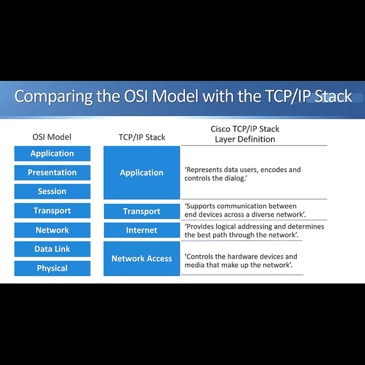

যখন দুটি হোস্ট একে অপরের সাথে যোগাযোগ করে, তারা প্রোটোকল ডেটা ইউনিট (PDU) এক্সচেঞ্জ করে। PDU হল পুরো যোগাযোগ, যা OSI মডেলের স্তর ৭ থেকে ১ পর্যন্ত বিস্তৃত।

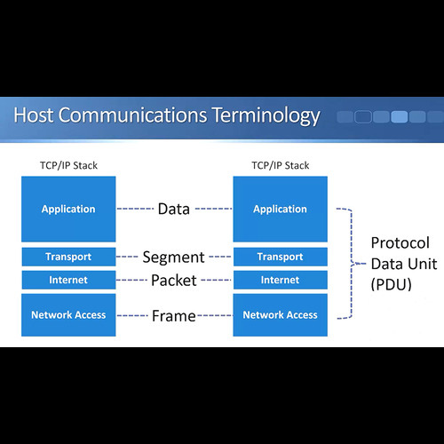
 TCP/IP স্তরের উপর ভিত্তি করে বিভিন্ন শব্দে ভাগ করতে পারি। অ্যাপ্লিকেশন স্তরের যোগাযোগকে বলা হয় ডেটা। ট্রান্সপোর্ট স্তরের মধ্যে যোগাযোগকে বলা হয় সেগমেন্ট। ইন্টারনেট স্তরের মধ্যে যোগাযোগকে বলা হয় প্যাকেট। এবং নেটওয়ার্ক অ্যাক্সেস স্তরের মধ্যে যোগাযোগকে বলা হয় ফ্রেম।


## OSI স্তর 
প্র্যাকটিক্যালভাবে, আমরা সাধারণত OSI মডেলের সাতটি স্তরের উপর ভিত্তি করে আলোচনা করি, কিন্তু এই টার্মিনোলজি বাস্তব জীবনে ব্যবহৃত হয়।

#### প্রথমে স্তর ৭
প্রথমে স্তর ৭, অ্যাপ্লিকেশন স্তর। এটি শেষ ব্যবহারকারীর অ্যাপ্লিকেশনগুলির জন্য নেটওয়ার্ক পরিষেবা প্রদান করে। এটি অন্য স্তরের মতো পরিষেবা প্রদান করে না। অ্যাপ্লিকেশন স্তরটি যোগাযোগের উদ্দেশ্য নিয়ে থাকা সঙ্গীর উপস্থিতি প্রতিষ্ঠা করে। এই সঙ্গীটি হবে সেই হোস্ট যার সাথে এই হোস্টটি যোগাযোগ করছে। 

#### স্তর ৬
পরবর্তী স্তর হল স্তর ৬, প্রেজেন্টেশন স্তর। এটি নিশ্চিত করে যে এক সিস্টেমের অ্যাপ্লিকেশন স্তরের পাঠানো তথ্য অন্য সিস্টেমের অ্যাপ্লিকেশন স্তরের পাঠযোগ্য। প্রেজেন্টেশন স্তরটি একটি সাধারণ ফরম্যাট ব্যবহার করে একাধিক ডেটা ফরম্যাটের মধ্যে অনুবাদ করতে পারে, উদাহরণস্বরূপ, এটি বিভিন্ন এনকোডিং স্কিমযুক্ত কম্পিউটারগুলির জন্য এটি করতে পারে। এবং আমাদের উচ্চতর স্তরের শেষ স্তর হল স্তর ৫, সেশন স্তর। 

#### স্তর ৫
স্তর ৫, সেশন স্তর এ দুটি যোগাযোগকারী হোস্টের মধ্যে সেশন স্থাপন, পরিচালনা এবং সমাপ্ত করে। সেশন স্তরটি দুইটি হোস্টের প্রেজেন্টেশন স্তরের মধ্যে কথোপকথন সিঙ্ক্রোনাইজ করে এবং ডেটা আদান-প্রদান পরিচালনা করে। উদাহরণস্বরূপ, আমরা যদি এমন একটি ওয়েব সার্ভার রাখি যার অনেক ব্যবহারকারী এটি ব্যবহার করছে, তাহলে আমাদের অনেক ইনকামিং সেশন থাকবে। সেশন স্তরটি সমস্ত সেশন ট্র্যাক রাখে। এটি কার্যকরী ডেটা স্থানান্তর, পরিষেবার শ্রেণী (CoS) এবং উচ্চতর স্তরের সমস্যাগুলির ব্যতিক্রম রিপোর্টিংও প্রদান করে।

#### স্তর ৪
প্রথম নীচের স্তরটি শুরু করি স্তর ৪, যা ট্রান্সপোর্ট স্তর। এই স্তরের প্রধান বৈশিষ্ট্য হল, TCP অথবা UDP ট্রান্সপোর্ট ব্যবহৃত হবে কিনা এবং পোর্ট নম্বর। যদি আপনি ইতিমধ্যেই TCP অথবা UDP অথবা পোর্ট নম্বর সম্পর্কে কিছু না জানেন, তবে এখনই চিন্তা করার দরকার নেই, কারণ আমরা পরবর্তী সেশনে স্তর ৪ নিয়ে আলোচনা করব। আপাতত, আপনাকে শুধু এটি জানার দরকার যে, যদি আমরা দুটি হোস্টের মধ্যে যোগাযোগ নির্ভরযোগ্য হতে চাই, তবে আমরা TCP ব্যবহার করব। যদি গতি নির্ভরযোগ্যতার চেয়ে বেশি গুরুত্বপূর্ণ হয়, যেমন ভয়েস বা ভিডিও ট্রাফিকের ক্ষেত্রে, তবে আমরা UDP ব্যবহার করব।
এই স্তরের আরেকটি প্রধান বৈশিষ্ট্য হল পোর্ট নম্বর। উদাহরণস্বরূপ, HTTP ওয়েব ট্রাফিকের জন্য পোর্ট নম্বর ৮০ এবং SMTP ইমেলের জন্য পোর্ট নম্বর ২৫। এখন, স্তর ৪ এর হেডারে আরও অনেক তথ্য থাকে, কিন্তু আমরা এই বিষয়গুলি পরবর্তী সেশনে আলোচনা করব।

স্তর ৪ (ট্রান্সপোর্ট স্তর) সংজ্ঞাটি হল এটি পৃথক যোগাযোগের জন্য ডেটাকে বিভক্ত, স্থানান্তর এবং পুনরায় একত্রিত করার পরিষেবা প্রদান করে। এটি বড় ফাইলগুলোকে ছোট ছোট সেগমেন্টে ভাগ করে, যাতে স্থানান্তর সমস্যার সম্ভাবনা কম হয়।

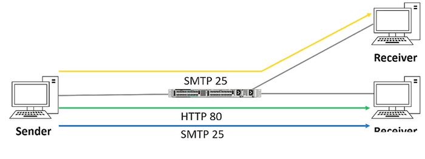

এখানে একটি উদাহরণ দেওয়া হয়েছে যেখানে বাম দিকে একটি প্রেরক এবং ডান দিকে দুটি প্রাপক রয়েছে। প্রেরক প্রথমে উপরের প্রাপককে ইমেইল (SMTP) ট্রাফিক পোর্ট ২৫ এ পাঠায় এবং একই সময়ে নিচের প্রাপককে HTTP ওয়েব ট্রাফিক পোর্ট ৮০ পাঠায়, এবং আরও একটি ইমেইল ট্রাফিকও পাঠায়। সুতরাং, আপনি দেখতে পাচ্ছেন যে প্রেরকের পক্ষে তিনটি সেশন রয়েছে, উপরের প্রাপকের পক্ষে একটি সেশন এবং নিচের প্রাপকের পক্ষে দুটি সেশন রয়েছে। এটি লেয়ার ৪, ট্রান্সপোর্ট লেয়ার যা বিভিন্ন সেশনগুলির ট্র্যাকিং এবং নিয়ন্ত্রণে দায়ী। প্রাপক যখন ট্রাফিক পায়, তখন এটি জানে কিভাবে ট্রাফিকটি নির্দিষ্ট অ্যাপ্লিকেশনের জন্য—যেমন, ওয়েব সার্ভার বা ইমেইল সার্ভার—এ পাঠাতে হবে। এটি পোর্ট নাম্বারের মাধ্যমে জানানো হয়, যেমন HTTP ওয়েব ট্রাফিক পোর্ট ৮০ ব্যবহার করে এবং SMTP ইমেইল ট্রাফিক পোর্ট ২৫ ব্যবহার করে।

প্রেরকও লেয়ার ৪ হেডারে একটি সোর্স পোর্ট নাম্বার যোগ করে। সোর্স এবং ডেস্টিনেশন পোর্ট নাম্বারের সংমিশ্রণ সেশন ট্র্যাক করতে ব্যবহৃত হয়। এই প্রক্রিয়াটি কিভাবে কাজ করে, সেটা আরও বিস্তারিতভাবে বুঝতে আমরা একটি উদাহরণ দেখলাম। সুতরাং, এখানে শুধুমাত্র একটি প্রেরক এবং একটি প্রাপক রয়েছে এবং এখানে ওয়েব ট্রাফিক পাঠানো হচ্ছে। প্রেরক যখন ট্রাফিক পাঠাবে, তখন এটি ডেস্টিনেশন পোর্ট ৮০ ব্যবহার করবে, যা ওয়েব ট্রাফিকের জন্য স্ট্যান্ডার্ড পোর্ট। এছাড়া এটি একটি র্যান্ডম সোর্স পোর্ট নাম্বার ব্যবহার করবে, যেমন ১৫০০। যখন প্রাপক ট্রাফিক পাঠাবে, তখন এটি সোর্স এবং ডেস্টিনেশন পোর্ট নাম্বার উল্টো করে দেবে। এটি হলো কিভাবে স্টেটফুল ফায়ারওয়ালগুলি কানেকশন ট্র্যাক করে।

লেয়ার ৪-এ দুটি প্রধান প্রোটোকল হল TCP (ট্রান্সপোর্ট কন্ট্রোল প্রোটোকল) এবং UDP (ইউজার ডাটাগ্রাম প্রোটোকল)। TCP একটি কানেকশন-ওরিয়েন্টেড প্রোটোকল। এর মধ্যে কানেকশন প্রতিষ্ঠার পরে ডেটা দুই হোস্টের মধ্যে দ্বিমুখীভাবে পাঠানো যায়। TCP সিকোয়েন্সিং করে, অর্থাৎ এটি ট্রাফিকে সিকোয়েন্স নাম্বার দেয় যাতে সেগমেন্টগুলি সঠিক অর্ডারে প্রক্রিয়া হয় এবং কোনও সেগমেন্ট হারানো না হয়। এটি রিলায়েবল, কারণ প্রাপক হোস্ট প্রেরককে নিশ্চিতকরণ পাঠায়, এবং যদি কোনও সেগমেন্ট হারিয়ে যায়, তাহলে প্রেরক সেগুলি পুনরায় পাঠাবে। TCP প্রবাহ নিয়ন্ত্রণও সম্পাদন করতে পারে।

TCP কানেকশন সেটআপ করার জন্য তিনটি-ধাপের হ্যান্ডশেক প্রক্রিয়া ব্যবহার করে। প্রথমে, প্রেরক একটি SYN (সিনক্রোনাইজড) মেসেজ প্রেরণ করে, তারপর প্রাপক SYN-ACK পাঠায় এবং অবশেষে প্রেরক ACK পাঠায়। এইভাবে দুই হোস্টের মধ্যে কানেকশন প্রতিষ্ঠিত হয়। TCP হেডারের গঠনও অনেক বড়, এতে সোর্স এবং ডেস্টিনেশন পোর্ট নাম্বার, সিকোয়েন্স নাম্বার, ACK নাম্বার, উইন্ডো সাইজ, চেকসাম এবং আরও অনেক কিছু থাকে।

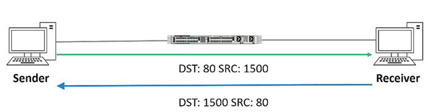

অন্যদিকে, UDP হল ইউজার ডাটাগ্রাম প্রোটোকল যা সর্বোচ্চ প্রচেষ্টা ভিত্তিতে ট্রাফিক পাঠায়, অর্থাৎ এটি কোনো কানেকশন স্থাপন করে না এবং ট্রাফিকের জন্য কোন রিলায়েবিলিটি প্রদান করে না। UDP প্রোটোকলটি হালকা এবং কম ওভারহেডযুক্ত, কারণ এর মধ্যে TCP-এর মতো সিকোয়েন্স নাম্বার, ACK ইত্যাদি থাকে না। UDP প্রোটোকলটি সাধারণত সেগুলির জন্য ব্যবহৃত হয় যেখানে দেরি বা লেটেন্সি কম থাকা জরুরি, যেমন ভয়েস বা ভিডিও কল। TCP ব্যবহার করার কারণে অতিরিক্ত লেটেন্সি যে সমস্যা সৃষ্টি করতে পারে, তা UDP ব্যবহার করে এড়ানো যায়।


#### থ্রি-ওয়ে হ্যান্ডশেক

নেটওয়ার্কিং-এ "থ্রি-ওয়ে হ্যান্ডশেক" (Three-Way Handshake) একটি গুরুত্বপূর্ণ প্রক্রিয়া যা TCP (Transmission Control Protocol) সংযোগ স্থাপনের জন্য ব্যবহার করা হয়। এটি ক্লায়েন্ট এবং সার্ভারের মধ্যে একটি নির্ভরযোগ্য সংযোগ স্থাপনের জন্য প্রয়োজনীয়।

থ্রি-ওয়ে হ্যান্ডশেকের তিনটি ধাপ হলোঃ

**SYN (Synchronize) পাঠানো**
 - ক্লায়েন্ট প্রথমে সার্ভারের কাছে একটি SYN প্যাকেট পাঠায়।
 - এটি ক্লায়েন্টের পক্ষ থেকে সংযোগ স্থাপনের জন্য একটি অনুরোধ।

**SYN-ACK (Synchronize-Acknowledge) প্রাপ্তি**
সার্ভার ক্লায়েন্টের SYN প্যাকেট পেলে তা গ্রহণ করে এবং একটি SYN-ACK পাঠায়।
এর মানে হলো, সার্ভার ক্লায়েন্টের সংযোগ অনুরোধ গ্রহণ করেছে এবং তার পক্ষে সম্মতি জানাচ্ছে।

**ACK (Acknowledge) পাঠানো**
ক্লায়েন্ট সার্ভারের SYN-ACK প্যাকেট পেলে একটি ACK প্যাকেট পাঠায়।
এটি ক্লায়েন্টের পক্ষ থেকে সার্ভারের SYN-ACK এর প্রাপ্তির নিশ্চয়তা।
এই তিনটি ধাপ সম্পন্ন হওয়ার পর ক্লায়েন্ট এবং সার্ভারের মধ্যে সংযোগ স্থাপিত হয় এবং ডেটা আদান-প্রদান শুরু করা সম্ভব হয়।

ক্লায়েন্ট একটি SYN প্যাকেট সার্ভারে পাঠায়।
সার্ভার SYN প্যাকেট পেয়ে SYN-ACK পাঠায়।
ক্লায়েন্ট সার্ভারের SYN-ACK পেয়ে ACK পাঠায়।
এই প্রক্রিয়ার মাধ্যমে একটি নির্ভরযোগ্য সংযোগ তৈরি হয়, যা ডেটা ট্রান্সমিশনের জন্য প্রস্তুত।

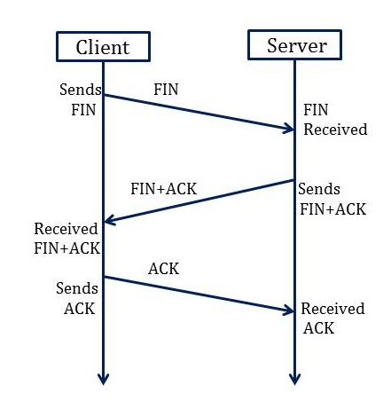

**সংযোগ সমাপ্তি (Connection Termination):**

থ্রি-ওয়ে হ্যান্ডশেকের মতো প্রক্রিয়া সংযোগ সমাপ্তির সময়ও ব্যবহৃত হয়। যখন কোনো ডিভাইস সংযোগ বন্ধ করতে চায়, তখন এটি FIN (finish) ফ্ল্যাগ সেট সহ একটি TCP সেগমেন্ট পাঠায়। অন্য ডিভাইস সেই FIN সেগমেন্টটি গ্রহণ করে এবং তার জন্য একটি ACK পাঠায়। দুটি ডিভাইস FIN এবং ACK সেগমেন্টের আদান-প্রদানের মাধ্যমে সংযোগটি সুষ্ঠুভাবে বন্ধ করে।

সবশেষে, কিছু সাধারণ অ্যাপ্লিকেশন এবং তাদের ডেস্টিনেশন পোর্ট সম্পর্কে আলোচনা করা হয়। TCP-এ FTP (ফাইল ট্রান্সফার প্রোটোকল) পোর্ট ২১, SSH (সিকিউর শেল) পোর্ট ২২, HTTP পোর্ট ৮০ এবং HTTPS পোর্ট ৪৪৩ ব্যবহার করে। UDP-এ TFTP (ট্রিভিয়াল ফাইল ট্রান্সফার প্রোটোকল) পোর্ট ৬৯ এবং SNMP (সিম্পল নেটওয়ার্ক ম্যানেজমেন্ট প্রোটোকল) পোর্ট ১৬১ ব্যবহার করে। DNS (ডোমেন নেম সিস্টেম) উভয় TCP এবং UDP ব্যবহার করতে পারে।

#### স্তর ৩
পরবর্তী স্তর হল স্তর ৩, নেটওয়ার্ক স্তর। নেটওয়ার্ক স্তরের সবচেয়ে গুরুত্বপূর্ণ তথ্য হল উত্স এবং গন্তব্য IP ঠিকানা। আবার, স্তর ৩ এর হেডারে আরও অনেক তথ্য থাকে, কিন্তু আমরা এগুলি পরবর্তী সেশনে আলোচনা করব। রাউটারগুলি স্তর ৩ ডিভাইস। তারা OSI মডেলের স্তর ৩ তে কাজ করে। নেটওয়ার্ক স্তরের সংজ্ঞাটি হল এটি দুটি হোস্ট সিস্টেমের মধ্যে সংযোগ এবং পথ নির্বাচন প্রদান করে, যা ভৌগলিকভাবে আলাদা নেটওয়ার্কে অবস্থান করতে পারে। নেটওয়ার্ক স্তরটি হোস্টগুলির সংযোগব্যবস্থা পরিচালনা করে এবং যৌক্তিক ঠিকানা প্রদান করে। IP ঠিকানা হল আমাদের যৌক্তিক ঠিকানা।

 নেটওয়ার্ক লেয়ার প্যাকেটকে তার গন্তব্যে রাউট করার জন্য দায়ী, এই কারণে রাউটারগুলি নেটওয়ার্ক লেয়ারে কাজ করে, এবং এটি কোয়ালিটি অফ সার্ভিসের (QoS) জন্যও দায়ী। QoS হলো এমন একটি ধারণা যেখানে কিছু নির্দিষ্ট ধরনের ট্রাফিকের জন্য অন্য ধরনের ট্রাফিকের তুলনায় ভাল সেবা প্রয়োজন। উদাহরণস্বরূপ, যদি আপনি VoIP বা ভিডিও কনফারেন্সিং করছেন, এটি দেরি (ডিলে) প্রতি সংবেদনশীল, তাই আমরা এটিকে ইমেইলের মতো অন্যান্য ট্রাফিকের চেয়ে ভালো QoS দেবো। IP, অর্থাৎ ইন্টারনেট প্রোটোকল, সবচেয়ে পরিচিত লেয়ার 3 প্রোটোকল। IPv4 এই সেকশনের মূল বিষয়, তবে IPv6 একটি উন্নত সংস্করণ যা IPv4 এর পরিবর্তে ব্যবহৃত হতে পারে। পরে, আমরা IPv6 এর প্রয়োজনীয়তা এবং এর ব্যবহার সম্পর্কে আলোচনা করবো, এবং কীভাবে এটি কনফিগার করা যায় তা দেখাবো। IP একটি সংযোগহীন প্রোটোকল, তাই লেয়ার 3 তে কোন acknowlegement নেই। তবে, আপনি TCP এর মাধ্যমে লেয়ার 4 এ বা উপরের লেয়ারগুলিতে নির্ভরযোগ্য ট্রাফিক পেতে পারেন। IP ছাড়াও, অন্যান্য লেয়ার 3 প্রোটোকলগুলির মধ্যে ICMP (ইন্টারনেট কন্ট্রোল মেসেজ প্রোটোকল) অন্তর্ভুক্ত, যা পিংয়ের জন্য ব্যবহৃত হয় এবং নিরাপদ যোগাযোগের জন্য IPSec ব্যবহৃত হয়। IP ছাড়া অন্যান্য প্রোটোকলও রয়েছে, তবে IP হল সবচেয়ে পরিচিত এবং সবচেয়ে ব্যাপকভাবে ব্যবহৃত। এই সেকশনে আমরা IP অ্যাড্রেসিং নিয়ে আলোচনা করবো, যা একটি যৌক্তিক অ্যাড্রেসিং স্কিম যা লেয়ার 3 তে বাস্তবায়িত হয়। নেটওয়ার্ক ডিজাইনাররা IP অ্যাড্রেসিং ব্যবহার করে সম্পূর্ণ নেটওয়ার্কটিকে ছোট ছোট সাবনেটওয়ার্কে ভাগ করেন, যা সাধারণত সাবনেট বলা হয়। সাবনেট ব্যবহার করার মাধ্যমে, পারফরম্যান্স এবং নিরাপত্তা উন্নত করা যায় এবং সমস্যা সমাধান সহজ হয়। এটি পারফরম্যান্স উন্নত করে কারণ একটি বড় ফ্ল্যাট নেটওয়ার্কের পরিবর্তে, আমরা এটি ছোট ছোট সাবনেটে ভাগ করি, এবং আমরা ট্রাফিককে শুধুমাত্র নির্দিষ্ট সাবনেটে সীমাবদ্ধ রাখতে পারি, যাতে এটি সব জায়গায় না ছড়িয়ে পড়ে। নিরাপত্তাও উন্নত হয়, উদাহরণস্বরূপ, অ্যাকাউন্টিং সার্ভারগুলো একটি নির্দিষ্ট সাবনেটে রাখা যায়, যাতে সেই সার্ভারে কিসের অ্যাক্সেস আছে তা নিয়ন্ত্রণ করা সহজ হয়। তাছাড়া, এটি সমস্যার সমাধান সহজতর করে, কারণ নেটওয়ার্কটি ছোট ছোট অংশে ভাগ করার মাধ্যমে, যদি কোনো সমস্যা হয়, তাহলে খুব সহজেই আমরা দেখতে পারি কোথায় সমস্যা এবং সেখানে মনোযোগ দিতে পারি। লেয়ার 3 তে IP অ্যাড্রেসিং ব্যবহৃত হয়।

#### IP Header

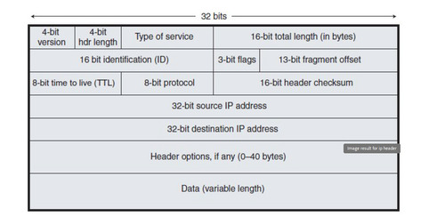

লেয়ার 3 এর অ্যাড্রেসিং ধারণা, যা IP অ্যাড্রেসিং ব্যবহার করে। এখন আমরা লেয়ার 3 এর IP হেডার সম্পর্কে আলোচনা করবো। IP হেডারের প্রথম অংশে 4-বিটের একটি ভার্সন থাকে, যা IPv4 অথবা IPv6 হতে পারে। এরপর 4-বিটের হেডার দৈর্ঘ্য থাকে, যা IP হেডারের দৈর্ঘ্য নির্ধারণ করে। এছাড়া টাইপ অফ সার্ভিস বাইটও থাকে, যা QoS তথ্য ধারণ করে, এবং আমরা এই প্যাকেটের উপর চিহ্নিতকরণ করতে পারি, যাতে রাউটারগুলি এটির জন্য বিশেষ সেবা প্রদান করতে পারে, যেমন VoIP ট্রাফিকের জন্য। এরপর, 16-বিটের প্যাকেটের মোট দৈর্ঘ্য থাকে। পরবর্তী অংশটি ফ্র্যাগমেন্ট তথ্যের জন্য ব্যবহৃত হয়, যা প্যাকেটকে ছোট ছোট অংশে ভাগ করার জন্য ব্যবহৃত হয়, যদি Ethernet এর মতো মিডিয়া টাইপে প্যাকেটের আকার বড় হয়। পরবর্তী 8-বিটের টাইম টু লিভ (TTL) ফিল্ডটি প্যাকেটের জীবনকাল নির্ধারণ করে, যাতে এটি একটি নির্দিষ্ট সময়ের পর নষ্ট হয়ে যায়, বিশেষত রাউটিং লুপ প্রতিরোধ করার জন্য। এরপর, 8-বিটের প্রোটোকল ফিল্ড থাকে, যা লেয়ার 4 এর তথ্য নির্ধারণ করে, সাধারণত TCP বা UDP। এরপর চেকসাম থাকে, যা প্যাকেটের অখণ্ডতা যাচাই করার জন্য ব্যবহৃত হয়। এরপর, সোর্স এবং ডেস্টিনেশন IP অ্যাড্রেস থাকে, যা প্যাকেটের উৎস এবং গন্তব্য নির্দেশ করে। শেষে, হেডার অপশন থাকে, যা অতিরিক্ত তথ্য রাখে, তবে এটি সাধারণত ব্যবহার করা হয় না। এবং সর্বশেষে, প্যাকেটের বাকি অংশ থাকে, যা ডেটা ধারণ করে। এটি হল লেয়ার 3 এবং IP হেডারের মৌলিক ধারণা।

#### স্তর ২
পরবর্তী স্তর হল স্তর ২, ডেটা লিঙ্ক স্তর। এখানে সবচেয়ে গুরুত্বপূর্ণ তথ্য হল উত্স এবং গন্তব্য স্তর ২ ঠিকানা। আবার, স্তর ৩ এবং ৪ এর মতো এখানে আরও অন্যান্য তথ্য অন্তর্ভুক্ত থাকে। উদাহরণস্বরূপ, যদি Ethernet স্তর ২ প্রযুক্তি হয়, তবে উত্স এবং গন্তব্য MAC ঠিকানা থাকে। বিভিন্ন স্তর ২ প্রযুক্তি তাদের ঠিকানার জন্য বিভিন্ন ফরম্যাট ব্যবহার করে। উদাহরণস্বরূপ, পুরানো Frame Relay DLCI নম্বর ব্যবহার করে ঠিকানাগুলির জন্য। Ethernet ব্যবহার করে যা সাধারণত আমাদের স্থানীয় নেটওয়ার্কে ব্যবহৃত হয়, এখানে MAC ঠিকানা ব্যবহৃত হয়। সুইচগুলি স্তর ২ ডিভাইস। আমাদের সুইচগুলি স্তর ২ সচেতন ডিভাইস। ডেটা লিঙ্ক স্তরের সংজ্ঞাটি হল এটি ডেটা প্রেরণের জন্য কিভাবে ফরম্যাট করা হবে এবং শারীরিক মিডিয়ায় অ্যাক্সেস কিভাবে নিয়ন্ত্রণ করা হবে তা নির্ধারণ করে। এটি সাধারণত ত্রুটি সনাক্তকরণ এবং সংশোধনও অন্তর্ভুক্ত করে, যাতে ডেটার নির্ভরযোগ্য ডেলিভারি নিশ্চিত করা যায়।

 লেয়ার 2 তে MAC অ্যাড্রেসিং ব্যবহৃত হয়, যদি আমরা Ethernet ব্যবহার করি। IP অ্যাড্রেসিং একটি যৌক্তিক অ্যাড্রেসিং স্কিম, তবে MAC অ্যাড্রেসিং একটি গ্লোবাল অ্যাড্রেসিং স্কিম। এই সেকশনটি MAC অ্যাড্রেসিংয়ের চেয়ে অনেক দীর্ঘ এবং জটিল, কারণ এখানে অনেক কাজ রয়েছে। লেয়ার 2 তে কোনো যৌক্তিক বিভাজন নেই ।

লেয়ার ২-এ ফ্রেম গুলি বিটে এনকোড এবং ডিকোড হয়, যা ফিজিক্যাল লেয়ারে অর্থাৎ বাস্তবিক তারে প্রেরণ করার জন্য প্রস্তুত হয়।  নির্ভরশীল প্রোটোকলের উপর ভিত্তি করে, ফিজিক্যাল লেয়ার-এর জন্য ত্রুটি নির্ণয় এবং সংশোধন সম্ভব হতে পারে। ইথারনেট হচ্ছে লেয়ার ২ এর একটি সাধারণ মাধ্যম যা ল্যান-এ ব্যবহৃত হয়। লেয়ার ২-এ প্রোটোকলগুলোতে যেমন ইথারনেট, ফ্রেম রিলেরি, FDDI, এবং PPP এর মতো প্রযুক্তি অন্তর্ভুক্ত। 

  **[Layer 2 protocol](https://en.wikipedia.org/wiki/List_of_network_protocols_(OSI_model))**


#### OSI স্তর ১
 OSI স্তর ১ বিট স্ট্রিম প্রেরণ করে, মানে এটি প্রকৃত বিটগুলো তারে প্রেরণ করে। এটি হতে পারে ক্যাবারের মাধ্যমে বৈদ্যুতিক সঙ্কেত, ফাইবার অপটিক ক্যাবলগুলির মাধ্যমে লাইটের সংকেত, অথবা ওয়্যারলেস প্রযুক্তির মাধ্যমে রেডিও সঙ্কেত। এটি নেটওয়ার্কের বৈদ্যুতিক এবং যান্ত্রিক স্তরের নিয়ন্ত্রণের দায়িত্বে থাকে এবং ডেটা প্রেরণ এবং গ্রহণের জন্য হার্ডওয়্যার সরবরাহ করে। এতে ক্যাবল, ইন্টারফেস কার্ড, এবং ইথারনেট বা ওয়ান পোর্টের প্রকার নির্ধারণের মতো ফিজিকাল দিকগুলি অন্তর্ভুক্ত। 
 বর্তমানে আমরা টুইস্টেড কাপার পেয়ার ক্যাবল, ফাইবার অপটিক ক্যাবল বা ওয়্যারলেস প্রযুক্তি ব্যবহার করি। UTP ক্যাবল (Unshielded Twisted Pair) সাধারণত ডেস্কটপ কম্পিউটারকে সুইচের সাথে সংযুক্ত করতে ব্যবহৃত হয়। RJ-45 কানেক্টর টাইপের সাথে এটি সংযুক্ত থাকে এবং সর্বোচ্চ ১০০ মিটার দৈর্ঘ্য হতে পারে। UTP ক্যাবল ক্যাটাগরি ৫ থেকে শুরু করে ক্যাটাগরি ৮ পর্যন্ত চলে, এবং এর পার্থক্য ব্যান্ডউইথ সমর্থনের উপর নির্ভর করে। ক্যাটাগরি ৬ ক্যাবল ১০ গিগাবিট ইথারনেট সমর্থন করে, এবং আরও উচ্চমানের ক্যাটাগরির ক্যাবলগুলো বর্তমানে উন্নত গিগাবিট স্পিডে ব্যবহার করা হয়।

UTP ক্যাবল দুটি ধরনের হতে পারে, স্ট্রেইট-থ্রু বা ক্রসওভার। স্ট্রেইট-থ্রু সাধারণত কম্পিউটার বা রাউটারকে সুইচের সাথে সংযোগ করতে ব্যবহৃত হয়, এবং ক্রসওভার দুটি একই ধরনের ডিভাইসের মধ্যে সংযোগের জন্য ব্যবহৃত হয়। আধুনিক সুইচগুলির ক্ষেত্রে, Auto MDI-X প্রযুক্তির জন্য স্ট্রেইট-থ্রু ক্যাবলও ক্রসওভার ছাড়াই ব্যবহার করা সম্ভব।

ফাইবার অপটিক ক্যাবল বর্তমানে লম্বা দূরত্ব এবং উচ্চ ব্যান্ডউইথের জন্য ব্যবহৃত হয়। ক্যাম্পাস বা বিল্ডিংসের মধ্যে সংযোগ স্থাপনের জন্য এটি আদর্শ। দুটি ধরণ থাকে—Single Mode এবং Multi Mode। Single Mode দীর্ঘ দূরত্ব এবং উচ্চ ব্যান্ডউইথের জন্য ব্যবহৃত হলেও বেশি ব্যয়বহুল। Multi Mode সাধারণত কয়েকশো মিটার দূরত্বে ব্যবহৃত হয়।

ফাইবার ক্যাবলের জন্য আলাদা ট্রান্সসিভার প্রয়োজন হয়, যা সুইচের একটি পোর্টে সংযোগ করার জন্য ব্যবহার করা হয়। RJ-45 কানেক্টর সরাসরি সুইচে সংযুক্ত হয়, তবে ফাইবারের জন্য ট্রান্সসিভার ব্যবহার করতে হবে।

শেষে, Power over Ethernet (PoE)-এর বিষয়টি উল্লেখযোগ্য। PoE একটি সহজ এবং সুবিধাজনক উপায় যা IP ফোন এবং ওয়্যারলেস অ্যাক্সেস পয়েন্টের মতো ডিভাইসগুলিতে পাওয়ার প্রেরণ করতে ব্যবহৃত হয়। একটি PoE সুইচ IP ফোন বা অ্যাক্সেস পয়েন্টে পাওয়ার এবং ডেটা একই ক্যাবলের মাধ্যমে প্রেরণ করে, ফলে আলাদা পাওয়ার সাপ্লাই লাগানোর প্রয়োজন হয় না। এছাড়াও, কোথাও পাওয়ার অ্যাক্সেস কঠিন হলে Power Injector ব্যবহার করা যেতে পারে। এটি পাওয়ার ও এথারনেট ক্যাবলের মাধ্যমে ওয়্যারলেস অ্যাক্সেস পয়েন্টের জন্য পাওয়ার প্রেরণ করে।

সারাংশ:
TCP/IP মডেল একটি গুরুত্বপূর্ণ নেটওয়ার্কিং প্রোটোকল স্ট্যাক যা ইন্টারনেটের কার্যক্রমের ভিত্তি। এটি চারটি স্তরের মাধ্যমে কম্পিউটার ও ডিভাইসগুলির মধ্যে যোগাযোগ পরিচালনা করে। TCP/IP মডেল মূলত বর্তমান নেটওয়ার্কিং বিশ্বের পছন্দের মডেল এবং এটি OSI মডেলের তুলনায় কিছুটা সরল, তবে কার্যকরী।

# নেটওয়ার্কের ট্রাফিক
নেটওয়ার্কে ট্রাফিকের মানে হলো ডেটা বা তথ্যের প্রবাহ যা এক বা একাধিক ডিভাইসের মধ্যে প্রেরিত হয়। এই ট্রাফিকের বিভিন্ন ধরনের থাকে এবং এগুলি বিভিন্নভাবে কাজ করে, যেমন:

- **ইউনিকাস্ট (Unicast)**:
এটি একটি নির্দিষ্ট উৎস থেকে একটি নির্দিষ্ট গন্তব্যে তথ্য প্রেরণের প্রক্রিয়া। অর্থাৎ, একটি সিস্টেম (উৎস) একটি নির্দিষ্ট ডিভাইসে (গন্তব্য) তথ্য পাঠায়। ইউনিকাস্ট ট্রাফিকের মাধ্যমে ডেটা এককভাবে একটি হোস্টে পৌঁছায়।

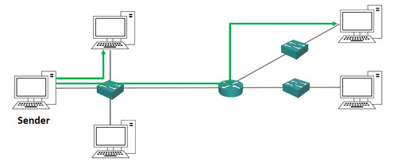

এখানে প্রেরক বাম পাশে আছে, এবং এটি একটি নির্দিষ্ট ট্রাফিক পাঠাচ্ছে একটি পিসিতে, যা ছবির উপরের অংশে আছে, এবং অন্য একটি ট্রাফিক পাঠাচ্ছে আরেকটি পিসিতে, যা ডানদিকে উপরের অংশে। তাই ইউনিকাস্ট ট্রাফিক, এটি প্রেরকের থেকে একক একটি হোস্টে যাচ্ছে, অর্থাৎ ইউনিকাস্ট

- **ব্রডকাস্ট (Broadcast)**:
ব্রডকাস্ট ট্রাফিক একটি নেটওয়ার্কের সমস্ত ডিভাইসে একই তথ্য পাঠায়। এটি একটি উৎস থেকে একটি কপি তৈরি হয়, এবং সেটি নেটওয়ার্কের সকল হোস্টে ছড়িয়ে পড়ে। তবে, ব্রডকাস্ট ট্রাফিক রাউটারের মাধ্যমে ফরোয়ার্ড করা হয় না, এটি শুধুমাত্র এক নেটওয়ার্কের মধ্যে সীমাবদ্ধ থাকে।

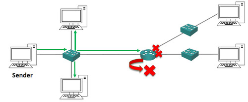

ব্রডকাস্ট ট্রাফিকের ক্ষেত্রে, প্রেরক একটি কপি ট্রাফিক পাঠায় যা সুইচে পৌঁছে, তারপর সেটি নেটওয়ার্কের অন্যান্য সব হোস্টে ছড়িয়ে পড়ে। এখানে দেখা যাচ্ছে, এটি সুইচের সাথে সংযুক্ত সব পিসিতে পৌঁছে যায়। শুধুমাত্র এক কপি ট্রাফিক প্রেরণ করা হয়, যা প্রতিটি হোস্টে পৌঁছায়। এটি রাউটারেও পৌঁছে, যেটির এই নেটওয়ার্কে একটি ইন্টারফেস আছে। এরপর রাউটার ট্রাফিকটি ফেলে দেয়, কারণ রাউটার ব্রডকাস্ট ট্রাফিক ফরোয়ার্ড করে না।

- **মাল্টিকাস্ট (Multicast)**:
মাল্টিকাস্ট ট্রাফিক একাধিক হোস্টে তথ্য পাঠানোর প্রক্রিয়া, তবে এটি শুধুমাত্র সেসব হোস্টে পাঠানো হয় যারা আগ্রহী বা এই তথ্য পাওয়ার জন্য সাবস্ক্রাইব করেছে। মাল্টিকাস্টের মাধ্যমে, এক কপি তথ্য একাধিক গন্তব্যে পাঠানো হয়, যা ব্যান্ডউইথ সাশ্রয়ে সহায়ক।

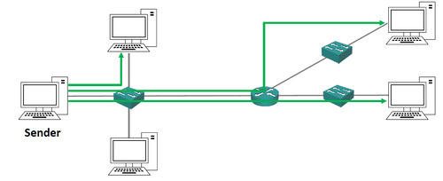

মাল্টিকাস্ট ট্রাফিকের ক্ষেত্রে, এটি একাধিক হোস্টে প্রেরিত হয়, তবে এটি একক কপি পাঠানো হয় যা আগ্রহী রিসিভারদের কাছে পৌঁছে যায়। এর ফলে ব্যান্ডউইথের সাশ্রয় হয়। উদাহরণস্বরূপ, ভিডিও স্ট্রিমিংয়ের জন্য যদি তিনটি আলাদা কপি পাঠানো হয়, তাহলে এটি ৩ মেগাবাইট ব্যান্ডউইথ গ্রহণ করবে। তবে মাল্টিকাস্টের মাধ্যমে একক কপি পাঠালে এটি কেবল ১ মেগাবাইট ব্যান্ডউইথ ব্যবহার করবে, এবং এটি শুধুমাত্র আগ্রহী রিসিভারদের কাছে পৌঁছে। 

ব্রডকাস্ট এবং মাল্টিকাস্ট ট্রাফিকের মধ্যে পার্থক্য হল যে, ব্রডকাস্ট ট্রাফিক নেটওয়ার্কের প্রতিটি স্থানে পৌঁছায়, যেখান থেকে রিসিভার এটি চেয়েছে বা না চেয়েছে, কিন্তু মাল্টিকাস্ট ট্রাফিক শুধুমাত্র সেসব রিসিভারদের কাছে পৌঁছায় যারা এটি চেয়েছে। মাল্টিকাস্ট ট্রাফিকের একটি ভালো উদাহরণ হলো রেডিও স্টেশন শোনার মতো, যেখানে সব রিসিভাররা একে একে রেডিও স্টেশনে টিউন করে এবং সেই ট্রাফিক গ্রহণ করে।

# নেটওয়ার্ক টপোলজি

নেটওয়ার্ক টপোলজি (Network Topology) হল একটি গ্রাফিকাল রূপ যা কম্পিউটার বা ডিভাইসের মধ্যে সংযোগের ধরণ এবং সম্পর্ককে প্রকাশ করে। এটি একটি নেটওয়ার্কের বিন্যাস এবং কিভাবে ডিভাইসগুলো একে অপরের সাথে সংযুক্ত থাকে তা বর্ণনা করে। টপোলজির মাধ্যমে নেটওয়ার্কের কার্যকারিতা, পারফরম্যান্স, রেডান্ডেন্সি এবং ব্যবস্থাপনা সম্পর্কে ধারণা পাওয়া যায়।

নেটওয়ার্ক টপোলজির বিভিন্ন ধরণ রয়েছে, এবং প্রতিটি ধরণের নিজস্ব সুবিধা এবং সীমাবদ্ধতা থাকে।

প্রধান ধরণের নেটওয়ার্ক টপোলজি
### স্টার টপোলজি (Star Topology):

**বর্ণনা:** 
একটি কেন্দ্রীয় ডিভাইস (হাব বা সুইচ)কে কেন্দ্র করে সব ডিভাইস সংযুক্ত থাকে।
উদাহরণ: একটি অফিসে, যেখানে কম্পিউটারগুলো একটি সুইচের মাধ্যমে সংযুক্ত।

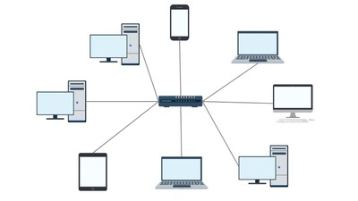

**সুবিধা:**
একটি ডিভাইসের সমস্যা হলে অন্য ডিভাইসগুলির উপর প্রভাব পড়ে না।
সহজে সমস্যার চিহ্নিতকরণ সম্ভব।

**সীমাবদ্ধতা:**
কেন্দ্রীয় ডিভাইসটি কাজ না করলে পুরো নেটওয়ার্ক অচল হয়ে যেতে পারে।

### বাস টপোলজি (Bus Topology):

**বর্ণনা:**
সমস্ত ডিভাইস একটি একক কমিউনিকেশন লাইন বা বাসের মাধ্যমে সংযুক্ত থাকে।
উদাহরণ: একটি পুরানো ছোট অফিসের নেটওয়ার্ক।

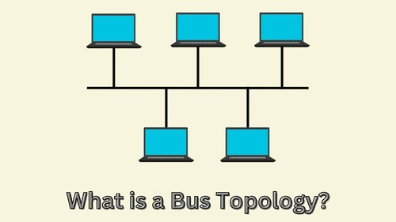

**সুবিধা:**
কম খরচে সেটআপ করা যায়।
ইনস্টলেশন সহজ।

**সীমাবদ্ধতা:**
একটি ডিভাইস বা লাইনের সমস্যা হলে পুরো নেটওয়ার্কে প্রভাব পড়তে পারে।

### রিং টপোলজি (Ring Topology):

**বর্ণনা:**
ডিভাইসগুলো একটি বন্ধ চক্রের মতো সংযুক্ত থাকে।

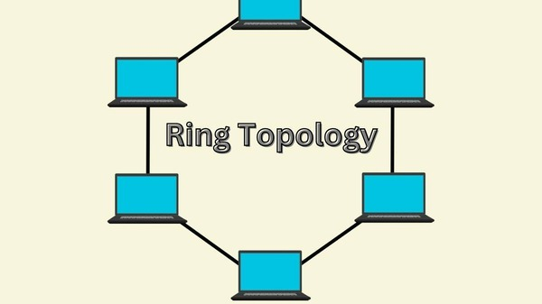

**উদাহরণ:** একটি সার্কুলার ম্যনেজমেন্ট কমিউনিকেশন সিস্টেম।

**সুবিধা:**
ডেটা সংক্রমণ খুবই নিয়মিতভাবে ঘটে।

**সীমাবদ্ধতা:**
একটি ডিভাইসের সমস্যা হলে সারা নেটওয়ার্ক অচল হতে পারে।

### মেশ টপোলজি (Mesh Topology):

**বর্ণনা:** 
সমস্ত ডিভাইস একে অপরের সাথে সরাসরি সংযুক্ত থাকে।

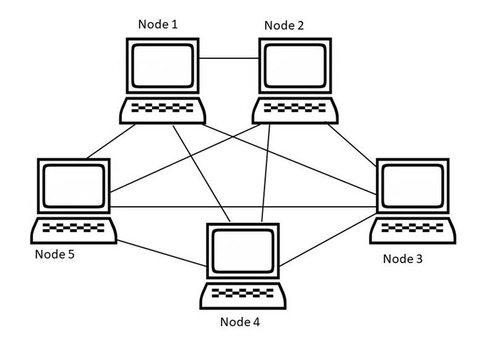

**উদাহরণ:** বড় ডেটা সেন্টারের নেটওয়ার্ক।

**সুবিধা:**
উচ্চ ডিগ্রি রেডান্ডেন্সি (Redundancy) থাকে।
কোনো একটি লিঙ্ক কাজ না করলে অন্য লিঙ্কের মাধ্যমে ডেটা চলতে পারে।

**সীমাবদ্ধতা:**
সংযোগ এবং রক্ষণাবেক্ষণের খরচ বেশি।

### হাইব্রিড টপোলজি (Hybrid Topology):

**বর্ণনা:** বিভিন্ন টপোলজির সংমিশ্রণ। অর্থাৎ, দুটি বা তার বেশি টপোলজির সংমিশ্রণ করে নেটওয়ার্ক তৈরি করা।

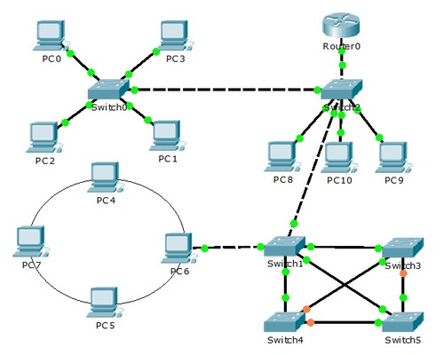

**উদাহরণ:** স্টার এবং মেশ টপোলজির সংমিশ্রণ।

**সুবিধা:**
বিভিন্ন নেটওয়ার্কের প্রয়োজনীয়তা অনুযায়ী টপোলজি তৈরি করা সম্ভব।

**সীমাবদ্ধতা:**
কিছুটা জটিল হতে পারে এবং রক্ষণাবেক্ষণ কঠিন হতে পারে।
টপোলজি নির্বাচন কিভাবে হয়?
নেটওয়ার্ক টপোলজি নির্বাচনের সময় নীচের বিষয়গুলো বিবেচনা করা হয়:

- বিনিয়োগের খরচ (Cost): টপোলজির ইনস্টলেশন এবং রক্ষণাবেক্ষণের খরচ কত।
- পারফরম্যান্স (Performance): কোন টপোলজি কম লেটেন্সি এবং দ্রুত ডেটা ট্রান্সমিশনের জন্য উপযোগী।
- বিস্তারযোগ্যতা (Scalability): নতুন ডিভাইস সংযোগে কত সহজ।
- বিশ্বস্ততা (Reliability): টপোলজির কোন অংশে সমস্যা হলে অন্যান্য অংশে প্রভাব কম।

**সারসংক্ষেপ:**
নেটওয়ার্ক টপোলজি একটি নেটওয়ার্কের কাঠামো নির্ধারণ করে এবং এটি ডেটা ট্রান্সমিশনের জন্য একটি নির্দিষ্ট পদ্ধতি প্রদান করে।

স্টার টপোলজি সাধারণত ছোট অফিসে ব্যবহৃত হয়।
বাস টপোলজি কম খরচের জন্য জনপ্রিয় হলেও কম নির্ভরযোগ্য।
রিং টপোলজি চক্রাকারে কাজ করে কিন্তু একটি সমস্যা হলে পুরো নেটওয়ার্ক ব্যাহত হয়।
মেশ টপোলজি উচ্চ নির্ভরযোগ্যতা প্রদান করে, তবে খরচ বেশি।
হাইব্রিড টপোলজি বিভিন্ন টপোলজির সংমিশ্রণ যা বিভিন্ন প্রয়োজনীয়তা অনুযায়ী ব্যবহার করা হয়।
নেটওয়ার্ক পরিকল্পনার জন্য সঠিক টপোলজি নির্বাচন অত্যন্ত গুরুত্বপূর্ণ, এবং এটি একটি নেটওয়ার্কের সফলতা নির্ধারণে বড় ভূমিকা পালন করে।

# সংখ্যার রূপান্তর বা কনভার্শন 

আইপি ঠিকানাগুলি দশমিক ফরম্যাটে লেখা হয়। তবে, সেগুলি কীভাবে নেটওয়ার্কগুলির মধ্যে যৌক্তিক আলাদা করা নিয়ন্ত্রণ করে, তা বুঝতে, এটি সাহায্য করে যদি আপনি সেগুলিকে সেভাবে ভাবেন যেমন একটি কম্পিউটার করে, অর্থাৎ বাইনারি হিসেবে।

যখন আমরা একটি সংখ্যা লিখি, প্রতিটি কলামে ০ থেকে ৯ পর্যন্ত ১০টি সম্ভাব্য পছন্দ থাকে, এবং যখনই আমরা বামদিকে একটি কলাম যোগ করি, এর মান ১০ গুণ বাড়ে। আমরা যে সংখ্যাটি লিখি, তার ডান পাশের কলামটি ১ এর প্রতিনিধিত্ব করে, তারপর ১০, ১০০, ১০০০, ১০০০০ এবং আরও অনেক কিছু। আপনি যদি ২৩৬ সংখ্যাটি লিখতে চান, তবে প্রথমে বড় কলামটি চেক করবেন, যেমন ১০০০। এটি ২৩৬-এ ফিট করবে কি না? উত্তর হচ্ছে না, কারণ ২৩৬ ছোট সংখ্যা ১০০০ থেকে। তারপর, ১০০ এর কলামে যাচ্ছেন, এবং দুটি ১০০ ফিট করবে, তাই বাকি থাকবে ৩৬। এরপর, আপনি ৩৬-এ ১০ কিভাবে ফিট করে তা পরীক্ষা করবেন, তিনটি ১০ ফিট করবে, আর বাকি থাকবে ৬। অবশেষে, আপনি ৬-এ ১ কিভাবে ফিট করে তা দেখতে পারবেন, সুতরাং আপনি ৬ পেতে পারবেন।

বাইনারি ঠিকানা কাজ করে ঠিক একইভাবে, তবে এটি এতটা স্বাভাবিক এবং সহজ নয়। কম্পিউটারগুলি দশমিকের পরিবর্তে বাইনারিতে কাজ করে, যেখানে কেবল দুটি পছন্দ থাকে: ০ বা ১। প্রতি কলামে দুটি পছন্দ থাকার ফলে, বাইনারি সিস্টেমে সংখ্যাগুলি ২ দ্বারা গুণিত হয়, ১০ দ্বারা গুণিত হওয়ার পরিবর্তে। বাইনারি কলামগুলো হলো ১, ২, ৪, ৮, ১৬, ৩২, ৬৪, ১২৮, ২৫৬, এবং আরও অনেক কিছু। যদি আমরা ২৩৬ সংখ্যাটি বাইনারিতে রূপান্তর করতে চাই, তবে শুরু হবে ২৫৬ দ্বারা ভাগ করা, যা ২৩৬-এ ফিট করবে না, সুতরাং ০ থাকবে। তারপর, ১২৮ ফিট করে, সুতরাং ১ হবে, বাকি থাকবে ১০৮, এবং পরবর্তীতে ৬৪, ৩২, ৮, ৪ এগুলির সাথে এর যোগফল হিসাব করা হবে, যা মোট ২৩৬ হবে। বাইনারি সংখ্যাটি হবে ১১১০১১০০।

অতঃপর, আপনাকে অনুশীলন করতে বলা হয়েছিল যে ১৭৯ কে বাইনারিতে রূপান্তর করতে হবে। এটি সহজেই শুরু করা যায় কলামগুলি লিখে এবং প্রতিটি মান চেক করে যে এটি সংখ্যাতে ফিট করে কি না। পরিশেষে, ১৭৯ বাইনারি হবে ১০১১০০১১।

এইভাবে দশমিক থেকে বাইনারিতে রূপান্তর করা হয়, এবং এটি পরবর্তী অংশে আইপি ঠিকানা বোঝার জন্য সহায়ক হবে।

সংখ্যার রূপান্তর বা কনভার্শন নিয়ে আলোচনা করলে, মূলত আমরা বিভিন্ন সংখ্যার পদ্ধতি, যেমন দশমিক, বাইনারি, অক্টাল এবং হেক্সাডেসিমেল সংখ্যা পদ্ধতির রূপান্তরের দিকে নজর দিই। এখানে প্রতিটি সংখ্যার সিস্টেমের মধ্যে রূপান্তর করা সম্পর্কে কিছু বিস্তারিত আলোচনা করা হল:

- **দশমিক থেকে বাইনারি রূপান্তর:** দশমিক (Decimal) সংখ্যা পদ্ধতিতে ১০টি সংখ্যা থাকে (০-৯)। বাইনারি (Binary) পদ্ধতিতে শুধুমাত্র দুটি সংখ্যা (০ এবং ১) থাকে। দশমিক সংখ্যাকে বাইনারি পদ্ধতিতে রূপান্তর করার জন্য, দশমিক সংখ্যাটিকে ধারাবাহিকভাবে ২ দিয়ে ভাগ করে এবং ভাগের অবশিষ্টাংশগুলি লেখেন। তারপর, অবশিষ্টাংশগুলিকে উল্টোভাবে পড়েন।

**পদ্ধতি**:
-- প্রথমে দশমিক সংখ্যাটিকে ২ দিয়ে ভাগ করুন। ভাগ করার পর যে ভাগফল হবে, তা আবার ২ দিয়ে ভাগ করুন। এবং ভাগের অবশিষ্টাংশ (remainder) লিখে রাখুন।

-- এই প্রক্রিয়াটি ততক্ষণ চালিয়ে যান, যতক্ষণ না ভাগফল ০ হয়ে যায়।

-- অবশেষে, অবশিষ্টাংশগুলোকে নিচ থেকে উপরে (reverse order) পড়ুন।


উদাহরণ: ২৩৬ ÷ ২ = ১১৮, ভাগফলে অবশিষ্টাংশ = ০

১১৮ ÷ ২ = ৫৯, ভাগফলে অবশিষ্টাংশ = ০

৫৯ ÷ ২ = ২৯, ভাগফলে অবশিষ্টাংশ = ১

২৯ ÷ ২ = ১৪, ভাগফলে অবশিষ্টাংশ = ১

১৪ ÷ ২ = ৭, ভাগফলে অবশিষ্টাংশ = ০

৭ ÷ ২ = ৩, ভাগফলে অবশিষ্টাংশ = ১

৩ ÷ ২ = ১, ভাগফলে অবশিষ্টাংশ = ১

১ ÷ ২ = ০, ভাগফলে অবশিষ্টাংশ = ১

এখন, অবশিষ্টাংশগুলো উল্টোভাবে পড়লেঃ
১ ১ ১ ০ ১ ১ ০ ০

তাহলে, ২৩৬ (Decimal) = 11101100 (Binary)

179 Binary ??

| 256 | 128 | 64 | 32 | 16 | 8 | 4 | 2 | 1 |  
| --- | -- | -- | -- | --| -- | -- | -- | -- |
| 0(179) | 1(51) | 0(51) | 1(19) | 1(3) | 0(3) | 0(3) | 1(1) | 1(0)| 
| 0 | 1 | 0 | 1 | 1 | 0 | 0 | 1 | 1 |

110011010

- **বাইনারি থেকে দশমিক রূপান্তর:** বাইনারি সংখ্যা থেকে দশমিক সংখ্যা বের করতে, বাইনারি সংখ্যাটির প্রতিটি বিটের মান ২ এর গুণফল দিয়ে যোগ করতে হয়। প্রতিটি বিটের অবস্থান অনুসারে তার মান নির্ধারণ করা হয়।

**পদ্ধতি**:
- বাইনারি সংখ্যার প্রতিটি বিটের জন্য, তার স্থানীয় মানের জন্য ২ এর শক্তি গুন করুন।
- এটা করার পর সব গুণফল যোগ করুন।

উদাহরণ: 
বাইনারি সংখ্যা: 1011
এর প্রতিটি বিটের মান:

```math
1×2^3=1×8=8
```
```math
0×2^2=0×4=0
```
```math
1×2^1=1×2=2
```
```math
1×2^0=1×1=1
```
এই মানগুলো যোগ করুন:

8+0+2+1=11

বাইনারি সংখ্যা 1011 দশমিক সংখ্যায় 11।

- **দশমিক থেকে অক্টাল রূপান্তর:** দশমিক সংখ্যাকে অক্টাল (Octal) সংখ্যায় রূপান্তর করার জন্য, দশমিক সংখ্যাটি ধারাবাহিকভাবে ৮ দিয়ে ভাগ করতে হয়। প্রতিটি ভাগের অবশিষ্টাংশগুলো উল্টোভাবে পড়লে অক্টাল সংখ্যা পাওয়া যায়।

পদ্ধতি:
-- দশমিক সংখ্যাটিকে ৮ দিয়ে ভাগ করুন।
-- ভাগফল (quotient) এর জন্য পুনরায় ৮ দিয়ে ভাগ করুন এবং ভাগশেষ (remainder) নোট করুন।
-- এটি পুনরাবৃত্তি করুন যতক্ষণ না ভাগফল ০ না হয়।
-- ভাগশেষগুলো উল্টানো (reverse) করে একত্র করুন, এটি হবে অক্টাল সংখ্যার রূপ।

উদাহরণ: আমরা দশমিক সংখ্যা 35 কে অক্টালে রূপান্তর করতে চাই।২৩৬ (Decimal) → ৩৬৪ (Octal)
 1. প্রথমে 35 কে ৮ দিয়ে ভাগ করি:

35÷8=4(ভাগফল) এবং ৩(ভাগশেষ)

2. এরপর ভাগফল ৪ কে আবার ৮ দিয়ে ভাগ করি:

4÷8=0 (ভাগফল) এবং ৪ (ভাগশেষ)

3. এখন ভাগশেষগুলোকে উল্টানো (reverse) করে একত্র করি:
   
  ভাগশেষগুলি: ৪ এবং ৩
  
  উল্টানো হলে: ৪৩

  35 দশমিক সংখ্যা 43 অক্টাল সংখ্যা।


- **অক্টাল থেকে দশমিক রূপান্তর:** অক্টাল সংখ্যার প্রতিটি বিটের মান ৮ এর গুণফলে যোগ করে দশমিক সংখ্যা পাওয়া যায়।

পদ্ধতি:
1. অক্টাল সংখ্যার প্রতিটি অংককে তার স্থান মানের সাথে গুণ করুন।
2. এই গুণফলগুলো যোগ করুন।

যেহেতু অক্টাল সংখ্যা ৮ এর ভিত্তিতে (base 8), প্রতিটি অংককে 8^𝑛^ (যেখানে 𝑛 হচ্ছে অংকের অবস্থান, ডান থেকে বামে গুণফল শুরু হয় ০ দিয়ে) এর সাথে গুণ করা হয়।

উদাহরণ:
আমরা অক্টাল সংখ্যা 173 কে দশমিক রূপে রূপান্তর করতে চাই।

অক্টাল সংখ্যা: 173
এটি তিনটি অংক নিয়ে গঠিত: ১, ৭, ৩

এখন আমরা প্রতিটি অংককে তার স্থান মানের সাথে গুণ করে যোগ করবো :
173~8 =
```math
(1×8^2)+(7×8^1)+(3×8^0) 
```
এটি গুনফল হিসেবে করা হলে:
```math
1 × 8^2 = 1 × 64 = 64
```

```math
7 × 8^1 = 7 × 8 = 56
```

```math
3 × 8^0 = 3 × 1 = 3
```

এখন এগুলো যোগ করলে:

64 + 56 + 3 = 123
অতএব, 173 অক্টাল সংখ্যা 123 দশমিক সংখ্যা।


- **দশমিক থেকে হেক্সাডেসিমেল রূপান্তর**: দশমিক সংখ্যা থেকে হেক্সাডেসিমেল (Hexadecimal) সংখ্যায় রূপান্তর করার জন্য, দশমিক সংখ্যাটিকে ১৬ দিয়ে ভাগ করতে হয় এবং প্রতিটি ভাগের অবশিষ্টাংশ থেকে হেক্সাডেসিমেল চিহ্ন তৈরি করতে হয় (যেমন, ১০=এ, ১১=বি ইত্যাদি)।

পদ্ধতি:
1. দশমিক সংখ্যাটি ১৬ দ্বারা ভাগ করুন।
2. বিভাগের ভাগফল এবং অবশিষ্টাংশ সংগ্রহ করুন।
3. এটি পুনরাবৃত্তি করুন যতক্ষণ না ভাগফল শূন্য না হয়।
4. অবশেষে, অবশিষ্টাংশগুলো উল্টোভাবে সাজান।

হেক্সাডেসিমেল সংখ্যা ১৬ এর ভিত্তিতে (base 16) লেখা হয় এবং এর মধ্যে ০ থেকে ৯ পর্যন্ত অঙ্ক এবং A, B, C, D, E, F পর্যন্ত অক্ষর ব্যবহার করা হয়। যেখানে:

A = 10

B = 11

C = 12

D = 13

E = 14

F = 15

উদাহরণ: আমরা দশমিক সংখ্যা 254 কে হেক্সাডেসিমেল রূপে রূপান্তর করতে চাই।

ধাপ ১: ২৫৪ কে ১৬ দিয়ে ভাগ করুন:

254 ÷ 16 = 15 (ভাগফল) এবং অবশিষ্টাংশ 14

254 ÷ 16 = 15 (ভাগফল) এবং অবশিষ্টাংশ 14

অবশিষ্টাংশ = 14, যা হেক্সাডেসিমেলে **'E'** হিসেবে লেখা হয়।

ধাপ ২: ১৫ কে আবার ১৬ দিয়ে ভাগ করুন:

15 ÷ 16 = 0 (ভাগফল) এবং অবশিষ্টাংশ 15

15 ÷ 16 = 0 (ভাগফল) এবং অবশিষ্টাংশ 15
অবশিষ্টাংশ = 15, যা হেক্সাডেসিমেলে **'F'** হিসেবে লেখা হয়।

ধাপ ৩: এখন, যেহেতু ভাগফল ০, আমাদের রূপান্তর শেষ।

এখন অবশিষ্টাংশগুলো উল্টোভাবে সাজালে:

𝐹𝐸 base 16

অতএব, 254 দশমিক সংখ্যা হেক্সাডেসিমেল সংখ্যা FE।

- **হেক্সাডেসিমেল থেকে দশমিক রূপান্তর**: হেক্সাডেসিমেল সংখ্যা থেকে দশমিক সংখ্যা বের করার জন্য, প্রতিটি হেক্সাডেসিমেল সংখ্যা বিটকে ১৬ এর গুণফলে যোগ করতে হয়।

হেক্সাডেসিমেল সংখ্যা ১৬ ভিত্তিক (base 16) এবং এর মধ্যে ০-৯ পর্যন্ত অঙ্ক এবং A, B, C, D, E, F পর্যন্ত অক্ষর থাকে, যেখানে A = 10, B = 11, C = 12, D = 13, E = 14, F = 15।
প্রত্যেকটি অঙ্কের মানকে তার অবস্থান (যেমন ১৬ এর শক্তি) দ্বারা গুণ করুন।
সবগুলো গুণফল যোগ করুন।

উদাহরণ: 
 আমরা হেক্সাডেসিমেল সংখ্যা 2F3 কে দশমিক সংখ্যায় রূপান্তর করতে চাই।

 আমরা 2F3 হেক্সাডেসিমেল সংখ্যাটিকে দশমিক রূপে রূপান্তর করবো।

ধাপ ১: প্রতিটি অঙ্কের মান বের করুন:

- প্রথম অঙ্ক: 2 (হেক্সাডেসিমেল মান ২)
- দ্বিতীয় অঙ্ক: F (হেক্সাডেসিমেল মান ১৫)
- তৃতীয় অঙ্ক: 3 (হেক্সাডেসিমেল মান ৩)

ধাপ ২: প্রতিটি অঙ্ককে তার অবস্থান অনুযায়ী গুণ করুন:

প্রথম অঙ্ক (২) অবস্থান ১৬² (যেহেতু এটি তৃতীয় স্থান):
```math
2 × 16^2 = 2 × 256 = 512
```
```math
2 × 16 ^ 2 = 2 × 256 = 512
```
দ্বিতীয় অঙ্ক (F বা ১৫) অবস্থান ১৬¹ (যেহেতু এটি দ্বিতীয় স্থান):
```math
15 × 16 ^ 1 = 15 × 16 = 240 
```
```math
15 × 16 ^ 1 = 15 × 16 = 240
```
তৃতীয় অঙ্ক (৩) অবস্থান ১৬⁰ (যেহেতু এটি প্রথম স্থান):

```math
3 × 16^0 = 3 × 1 = 3
```
```math
3 × 16^0 = 3 × 1 = 3
```

ধাপ ৩: সবগুলো গুণফল যোগ করুন:

512 + 240 + 3 = 755

অতএব, 2F3 হেক্সাডেসিমেল সংখ্যার দশমিক রূপ হচ্ছে 755।

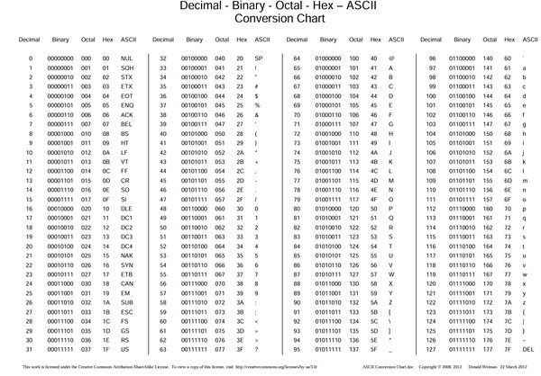

[download link](https://www.eecis.udel.edu/~amer/CISC651/ASCII-Conversion-Chart.pdf)

