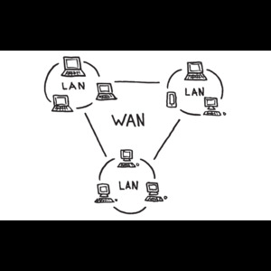

# নেটওয়ার্ক 
নেটওয়ার্ক (Network) হলো দুটি বা তার বেশি কম্পিউটার বা ডিভাইসের একটি সংযুক্তি ব্যবস্থা, যা তথ্য ও সম্পদ শেয়ার করতে সক্ষম। নেটওয়ার্কের মাধ্যমে ডিভাইসগুলো একে অপরের সাথে যোগাযোগ করতে পারে এবং তথ্য আদান-প্রদান করতে পারে।

**নেটওয়ার্কের প্রধান উদ্দেশ্য হলো:**

- তথ্য শেয়ারিং: বিভিন্ন ডিভাইসের মধ্যে ডেটা, ফাইল, সফটওয়্যার ইত্যাদি শেয়ার করা।
- রিসোর্স শেয়ারিং: প্রিন্টার, স্ক্যানার, হার্ডডিস্ক ইত্যাদি শেয়ার করা।
- কমিউনিকেশন: ইমেইল, মেসেজিং, ভিডিও কনফারেন্সিং ইত্যাদি মাধ্যমে যোগাযোগ করা।
- ইন্টারনেট অ্যাক্সেস: ইন্টারনেট ব্যবহার করতে সহায়তা করা।
- নেটওয়ার্ক বিভিন্ন ধরনের হতে পারে, যেমন:
  - LAN (Local Area Network): এটি ছোট এলাকায় ব্যবহৃত নেটওয়ার্ক, যেমন একটি অফিস বা বাড়ির মধ্যে কম্পিউটারগুলোর সংযোগ।
  - WAN (Wide Area Network): এটি বৃহৎ এলাকায় ব্যবহৃত নেটওয়ার্ক, যেমন দুটি শহরের বা দেশগুলোর মধ্যে সংযোগ।
  - MAN (Metropolitan Area Network): এটি একটি শহরের বা একটি শহরের কিছু অংশে ব্যবহৃত নেটওয়ার্ক।
  - PAN (Personal Area Network): এটি একটি ছোট নেটওয়ার্ক, যেমন দুটি ডিভাইসের মধ্যে ব্লুটুথ বা Wi-Fi সংযোগ।

নেটওয়ার্ক কম্পোনেন্টস বা উপাদানগুলো হল:
- রাউটার (Router)
- সুইচ (Switch)
- হাব (Hub)
- মডেম (Modem)
- কেবল (Cables), নেটওয়ার্কের মাধ্যমে ডেটা আদান-প্রদান করা হয়, এবং এটি ইন্টারনেট বা ইনট্রানেটের মতো বড় সিস্টেমের অংশ হতে পারে।


**নেটওয়ার্ক কেবল (Network Cable)**

নেটওয়ার্ক কেব্লিঙ্ক বলতে এমন একটি সিস্টেম বা প্রযুক্তি বোঝানো হয় যা বিভিন্ন ডিভাইস বা কম্পিউটারকে সংযুক্ত করতে ব্যবহৃত হয়। এটি একটি শারীরিক মাধ্যম (কেবল) যা নেটওয়ার্কের ডিভাইসগুলোর মধ্যে ডেটা এবং সংকেত প্রেরণ করে। নেটওয়ার্ক কেব্লিঙ্ক সাধারণত ইথারনেট কেবল, ফাইবার অপটিক কেবল, বা কোঅ্যাক্সিয়াল কেবল হয়ে থাকে।

একটি RJ45 কানেক্টর, এটি যেকোনো ল্যাপটপে প্লাগ ইন করতে চাই কারণ এই ইন্টারফেসটি স্ট্যান্ডার্ডাইজড হয়েছে এবং বিভিন্ন ভেন্ডররা একে একে স্পেসিফিকেশন বা স্ট্যান্ডার্ড অনুযায়ী ডিভাইস তৈরি করতে সম্মত হয়েছে, যা জীবনকে অনেক সহজ করে তোলে। পুরানো দিনে ভেন্ডররা কেবল তাদের ইচ্ছামত কাজ করত। তারা তাদের নিজস্ব প্রোটোকল এবং স্পেসিফিকেশন তৈরি করত, যা গ্রাহকদের জন্য ভালো ছিল না।এটা ভেন্ডরের জন্য দুর্দান্ত ছিল কারণ যদি আমরা তাদের সরঞ্জাম কিনতাম, তাহলে আমরা সেই ভেন্ডরের সাথে লকড হয়ে যেতাম।


নেটওয়ার্ক কেব্লিঙ্কের ধরণ:
- ইথারনেট কেবল (Ethernet Cable):ক্যাট 5 (Cat 5), ক্যাট 5e (Cat 5 enhanced), ক্যাট 6 (Cat 6), ক্যাট 6a ইত্যাদি 
  - কেবলের দৈর্ঘ্য: সাধারণত ১০০ মিটার পর্যন্ত কার্যকরী হয়।
  - Ethernet কেবলের পিনআউট (PoE সহ):
এটি T568A বা T568B স্ট্যান্ডার্ড অনুসারে হয়, এবং নিচে দেখানো হয়েছে কিভাবে ডেটা এবং পাওয়ার পিন সংযুক্ত থাকে:

    - T568A Standard (PoE):
      - পিন ১ (White/Green): ডেটা
      - পিন ২ (Green): ডেটা
      - পিন ৩ (White/Orange): ডেটা
      - পিন ৪ (Blue): পাওয়ার
      - পিন ৫ (White/Blue): পাওয়ার
      - পিন ৬ (Orange): ডেটা
      - পিন ৭ (White/Brown): পাওয়ার
      - পিন ৮ (Brown): পাওয়ার
    - T568B Standard (PoE):
      - পিন ১ (White/Orange): ডেটা
      - পিন ২ (Orange): ডেটা
      - পিন ৩ (White/Green): ডেটা
      - পিন ৪ (Blue): পাওয়ার
      - পিন ৫ (White/Blue): পাওয়ার
      - পিন ৬ (Green): ডেটা
      - পিন ৭ (White/Brown): পাওয়ার
      - পিন ৮ (Brown): পাওয়ার
- ফাইবার অপটিক কেবল (Fiber Optic Cable): Single-mode fiber এবং Multi-mode fiber দুই ধরনের ফাইবার অপটিক কেবল রয়েছে।
  - Single-Mode Fiber (SMF):
      - দূরত্ব: সাধারণত ২০ কিলোমিটার (২০,০০০ মিটার) বা তার বেশি।
      - গতি: এই কেবল একক কোর (core) দিয়ে আলোর সিগন্যাল প্রেরণ করে, এবং এটি খুব দীর্ঘ দূরত্বে উচ্চ গতি (10Gbps বা তার বেশি) সিগন্যাল ট্রান্সমিট করতে সক্ষম।
      - ব্যবহার: এটি লং ডিস্ট্যান্স নেটওয়ার্কে ব্যবহৃত হয়, যেমন ইন্টারনেট ব্যাকবোন, ট্রান্স-প্রতিবেশী নেটওয়ার্ক এবং অন্যান্য লং রেঞ্জ কমিউনিকেশন সিস্টেম।
  - Multi-Mode Fiber (MMF):
     - দূরত্ব: সাধারণত ৩০০ মিটার থেকে ৫ কিলোমিটার পর্যন্ত কার্যকরী (গতি এবং কেবলটির ধরন অনুযায়ী)।
     - গতি: Multi-mode ফাইবার কেবল সাধারণত কম দূরত্বে কাজ করে এবং এটি কিছুটা কম গতি (1Gbps থেকে 10Gbps) দিয়ে কাজ করে, তবে এটি অনেক সিগন্যাল রিফ্লেকশন এবং রিটার্ন লস সহ্য করতে সক্ষম।
     - ব্যবহার: এটি সাধারণত ডেটা সেন্টার, লোকাল এরিয়া নেটওয়ার্ক (LAN), এবং শিক্ষা প্রতিষ্ঠান বা ছোট প্রতিষ্ঠানের নেটওয়ার্কে ব্যবহৃত হয়।
- কোঅ্যাক্সিয়াল কেবল (Coaxial Cable): এটি সাধারণত কেবল টেলিভিশন বা ইন্টারনেট সার্ভিস প্রোভাইডার দ্বারা ব্যবহৃত হয়।

অতিরিক্ত কিছু কেবল টাইপ:
- Patch Cable:
এটি একটি ছোট নেটওয়ার্ক কেবল যা সাধারণত রাউটার, সুইচ, অথবা কম্পিউটার এর মধ্যে সংযোগ স্থাপন করতে ব্যবহৃত হয়।
- Crossover Cable:
এই কেবলটি সাধারণত দুইটি একই ধরনের ডিভাইস (যেমন কম্পিউটার থেকে কম্পিউটার, বা রাউটার থেকে রাউটার) সংযুক্ত করার জন্য ব্যবহৃত হয়।
এর মধ্যে একপাশে T568A এবং অন্যপাশে T568B ওয়্যারিং থাকে।
---------------------------------------------------------------------------------------------------------------------------
সিসকো ১৯৮৪ সালে শুরু হয়েছিল এবং যেকোনো কোম্পানি যেন কিছু অদ্ভুত বিতর্কের সাথে শুরু হয়। তারা রাউটার উদ্ভাবনের দাবিদার। এটি তাদের খ্যাতি। "আমরা রাউটার উদ্ভাবন করেছি।" যদিও, আপনি যদি গুগলে এটি টাইপ করেন, আপনি দেখতে পাবেন যে একজন ষাট বছর বয়সী ব্যক্তি বলছেন, "না, আমি রাউটার উদ্ভাবন করেছি, এবং সিসকো এটি চুরি করেছে।" যাই হোক, এটা ঠিক। হয়তো সেই ষাট বছর বয়সী ব্যক্তি রাউটার উদ্ভাবন করেছেন এবং সিসকো এটি চুরি করেছে। তবে অপ্রতিরোধ্যভাবে, সিসকো সেই ধারণাটি নিয়ে এসে সেটিকে পৃথিবীজুড়ে প্রচার করেছে। তারা ব্যাপকভাবে এটি তৈরি করেছে। তাহলে, সিসকোর খ্যাতি হল তারা আজকের নেটওয়ার্কের এক প্রাথমিক ভিত্তি রাউটার তৈরি করেছে। এখন সিসকো হল, সন্দেহাতীতভাবে, স্থিতিশীল নেটওয়ার্ক যন্ত্রপাতির শিল্প নেতা। তাদের বিশ্বের নেটওয়ার্ক অবকাঠামোর বিশাল একটি অংশ তাদের নামের সাথে সম্পর্কিত এবং তাদের স্থিতিশীলতার জন্য খ্যাতি রয়েছে।



ধরি, আমাদের একটি অফিস আছে নিউ ইয়র্কে, যেখানে আমাদের একটি পিসি, একটি সার্ভার এবং একটি প্রিন্টার রয়েছে, এবং তাদের একে অপরের সাথে যোগাযোগ করতে হবে। এর জন্য, আমি একটি নেটওয়ার্ক সুইচ বসাব এবং ইথারনেট কেবল দিয়ে ডিভাইসগুলো সুইচে সংযুক্ত করব, এবং এই রকম দেখতে একটি সুইচ হবে। সুইচ হল আমার লোকাল এরিয়া নেটওয়ার্ক (LAN) এর জন্য সংযোগ স্থাপনকারী ডিভাইস। নিউ ইয়র্ক অফিসে, হয়তো আমার একটি ল্যাপটপও থাকবে যা ওয়্যারলেস নেটওয়ার্কের মাধ্যমে সংযুক্ত হবে। তাহলে আমি, একটি ফাইল পাঠাতে পারি এই ব্যক্তির থেকে ওই ব্যক্তির কাছে বা একটি ফাইল সার্ভারে সংরক্ষণ করতে পারি, অথবা হয়তো একটি প্রিন্টার থাকতে পারে যা সবাই শেয়ার করছে এবং ব্যবহার করছে, যাতে সবাইকে তাদের নিজস্ব ইনকজেট প্রিন্টার কিনতে না হয়। যেগুলি সমর্থন করা খুবই কষ্টকর, এইটা বলার মতো। সুতরাং, আপনার প্রতিষ্ঠানের মধ্যে সব এই ধরনের যোগাযোগ ঘটতে পারে। সব কিছুই সুইচের মাধ্যমে সমর্থিত। এখন আমার সমস্ত ডিভাইস নিউ ইয়র্কে একে অপরের সাথে কথা বলতে সক্ষম। আমি একটি লোকাল এরিয়া নেটওয়ার্ক তৈরি করেছি, যা এমন একটি নেটওয়ার্ক যা একই স্থানীয় এলাকায়, যেমন একটি অফিস বা বিশ্ববিদ্যালয় ক্যাম্পাসে ডিভাইসগুলোকে সংযুক্ত করে। তবে, আমি চাই না যে আমার অফিসের সমস্ত ডিভাইস শুধুমাত্র একে অপরের সাথে কথা বলুক, তারা ইন্টারনেটের অন্যান্য ডিভাইসের সাথে যোগাযোগও করতে চাবে। এর জন্য, আমি একটি রাউটার ব্যবহার করব, যা নেটওয়ার্কের বিভিন্ন অংশের মধ্যে ট্র্যাফিক রুট করার জন্য উন্নত রাউটিং সিদ্ধান্ত নিতে সক্ষম। রাউটারটি এভাবেই কাজ করে এবং এটি এইরকম দেখতে হবে। এছাড়াও, ইন্টারনেটে হ্যাকারদের মতো খারাপ লোকেরা আক্রমণ করতে পারে, তাই আমি একটি ফায়ারওয়াল স্থাপন করব যা আমাদের নেটওয়ার্কের বিভিন্ন অংশকে একে অপর থেকে নিরাপদ রাখবে।

এখন, নিউ ইয়র্কের অফিসের লোকাল এরিয়া নেটওয়ার্ক ইন্টারনেটের সাথে সংযুক্ত। কিন্তু, একটি বড় কোম্পানিতে একটিমাত্র অফিস থাকে না। ধরুন, আমাদের বস্টনেও একটি অফিস রয়েছে, যেখানে একই ধরনের ডিভাইস থাকবে এবং লোকাল এরিয়া নেটওয়ার্কও থাকবে। আমার নিউ ইয়র্ক এবং বস্টন অফিসের মধ্যে সংযোগ করতে হবে, যাতে দুটি অফিসের ডিভাইসগুলো একে অপরের সাথে যোগাযোগ করতে পারে। আমি যদি চাই, তবে ইন্টারনেটের মাধ্যমে সিকিউরভাবে যোগাযোগ করতে পারি, তবে আরেকটি উপায় হল, দুইটি অফিসের রাউটারগুলির মধ্যে একটি নিবেদিত সংযোগ স্থাপন করা, যা আমাকে দুটি অফিসের মধ্যে একটি বিস্তৃত এলাকা নেটওয়ার্ক (WAN) সংযোগ প্রদান করবে। 

নেটওয়ার্কিংয়ের মূল উদ্দেশ্য হল আমাদের বিভিন্ন ডিভাইসের মধ্যে সংযোগ স্থাপন করা। নেটওয়ার্কের বৈশিষ্ট্যগুলির মধ্যে রয়েছে টপোলজি, যার মাধ্যমে ডিভাইসগুলো একে অপরের সাথে সংযুক্ত হয়, এবং নেটওয়ার্কের গতি, যা সাধারণত বেশি হলে খরচও বেশি হয়। নেটওয়ার্কের অন্যান্য বৈশিষ্ট্যগুলির মধ্যে রয়েছে নিরাপত্তা, যেখানে ফায়ারওয়াল, রাউটার এবং সুইচের নিরাপত্তা ব্যবস্থা অন্তর্ভুক্ত থাকে। এছাড়া, আমাদের নেটওয়ার্কের উপলব্ধতা নিশ্চিত করতে হবে, যেখানে একটি একক ব্যর্থতা এড়াতে বিভিন্ন উপাদানগুলিকে ডাবল করা হয়। স্কেলেবিলিটি এবং নির্ভরযোগ্যতাও গুরুত্বপূর্ণ, যেখানে নেটওয়ার্কটি সহজেই বৃদ্ধি পেতে সক্ষম এবং নির্ভরযোগ্যভাবে কাজ করতে হবে।

অবশেষে, বলব যে, সম্ভবত খুব দ্রুত নয়, কিন্তু একসময় মানুষ বলবে, "আমাদের নিজেদের প্রতিষ্ঠান থেকে বাইরে যোগাযোগ করতে হবে।" তখন আমরা আসি রাউটার এর কাজের দিকে। একটি রাউটার আপনাকে আপনার লোকাল এরিয়া নেটওয়ার্কের (LAN) বাইরে, ওয়াইড এরিয়া নেটওয়ার্কে (WAN), বা বৃহত্তর নেটওয়ার্কে যোগাযোগ করার সুযোগ দেয়। মূলত, রাউটার আপনার নেটওয়ার্ক এবং অন্য একটি নেটওয়ার্কের মধ্যে বিভাজন সীমানা চিহ্নিত করে।রাউটার আপনার নেটওয়ার্ক এবং ইন্টারনেটের মধ্যে বিভাজন সীমানা চিহ্নিত করে। সাধারণত, এটি একটি সুরক্ষা সীমানাও সরবরাহ করে, তবে এটি আপনার ট্রাফিককে সীমাবদ্ধও রাখে। তাই, যখন আমি সব ধরনের যোগাযোগ এখানে প্রেরণ করি, তখন অনেক সময় আমাদের কাছে তথ্যের বন্যা হতে পারে। আমরা বিভিন্ন ধরনের বার্তা নিয়ে আলোচনা করব, কিন্তু আপনি হয়তো ব্রডকাস্ট দেখতে পাবেন যা আপনার পুরো প্রতিষ্ঠানে ছড়িয়ে যাচ্ছে এবং লিক হয়ে অন্য জায়গায় চলে যাচ্ছে। তবে এটি স্কেলেবল হবে না যদি প্রতিটি ব্রডকাস্ট আপনার কোম্পানি থেকে বাইরে চলে যায় এবং সবাই একে অপরের ট্রাফিক দেখতে শুরু করে। তাই এটি এমনভাবে কাজ করে না।

এখানে রাউটার বিভাজন সীমানা তৈরি করে। এখন আমি কিছু ফিচার যোগ করতে পারি যা একটি রাউটারকে সমর্থন করা উচিত, যেমন নিরাপত্তা। আপনি জানেন, এটি অবশ্যই একটি গুরুত্বপূর্ণ কাজ, তবে এটি আবশ্যক নয়। এটি শুধু একটি সীমানা। আমি মনে করি যে একটি রাউটার নেটওয়ার্ক অ্যাড্রেস ট্রান্সলেশন (NAT) নামক একটি সেবা প্রদান করবে, যা আপনার নেটওয়ার্কের আইপি অ্যাড্রেসিংকে ইন্টারনেটের অ্যাড্রেসিংয়ে রূপান্তরিত করবে। এটি একটি দুর্দান্ত ফিচার এবং প্রায় ৯৯% রাউটার এটি করে, তবে এটি আবশ্যক নয়। তাহলে, রাউটার কী করে? এটি আপনার নেটওয়ার্ক থেকে অন্য নেটওয়ার্ক, আপনার পৃথিবী থেকে পৃথিবীর বাকি অংশে এক ধরনের বিভাজন তৈরি করে।
 
## Switch
সুইচ (Switch) হলো একটি নেটওয়ার্ক ডিভাইস যা একাধিক ডিভাইস বা কম্পিউটারকে একটি নেটওয়ার্কের মধ্যে সংযুক্ত করতে ব্যবহৃত হয় এবং ডেটা প্যাকেটগুলো সঠিক গন্তব্যে পৌঁছানোর জন্য কাজ করে। সুইচ একটি ডেটা লিংক লেয়ার ডিভাইস, যা ল্যান (LAN) নেটওয়ার্কে ব্যবহৃত হয়।


## LAN 

LAN (Local Area Network) হলো একটি নেটওয়ার্কিং ব্যবস্থা যা একটি ছোট, সীমিত ভূগোলিক অঞ্চলে (যেমন একটি বাড়ি, অফিস, স্কুল বা একটি বিল্ডিং) কম্পিউটার এবং অন্যান্য ডিভাইসগুলিকে সংযুক্ত করে। LAN ব্যবহারকারীদের একে অপরের সাথে তথ্য শেয়ার করতে, রিসোর্স যেমন প্রিন্টার, ফাইল সার্ভার ইত্যাদি শেয়ার করতে এবং ইন্টারনেট সংযোগ ব্যবহার করতে সাহায্য করে।


## WAN
WAN (Wide Area Network) হলো একটি বড় আঞ্চলিক বা আন্তর্জাতিক নেটওয়ার্ক যা বেশ কয়েকটি LAN (Local Area Network) অথবা অন্যান্য ছোট নেটওয়ার্ককে সংযুক্ত করে। WAN সাধারণত একটি বড় ভূগোলিক এলাকা, যেমন একটি শহর, দেশ বা এমনকি পৃথিবীজুড়ে বিস্তৃত থাকে এবং এটি কম্পিউটার, সার্ভার, ডেটাবেস এবং অন্যান্য নেটওয়ার্ক রিসোর্সের মধ্যে যোগাযোগের জন্য ব্যবহৃত হয়।


## রাউটার (Router)

রাউটার (Router) হলো একটি নেটওয়ার্ক ডিভাইস যা দুটি বা তার বেশি নেটওয়ার্কের মধ্যে ডেটা ট্রান্সফার করার কাজ করে। এটি নেটওয়ার্কের মধ্যে ডেটা প্যাকেটগুলির পথ নির্ধারণ করে এবং সেগুলিকে সঠিক গন্তব্যে পৌঁছানোর জন্য পরিচালনা করে। রাউটার সাধারণত ইন্টারনেট এবং লোকাল নেটওয়ার্ক (LAN) বা ওয়াইড এরিয়া নেটওয়ার্ক (WAN) এর মধ্যে সংযোগ স্থাপন করে।


এখন আমরা আসি ওয়ারলেস অ্যাক্সেস পয়েন্টগুলোর দিকে। 
এটি ছিল একটি বিপ্লবী প্রযুক্তি যা পৃথিবীকে বদলে দিয়েছিল। ওয়াইফাই ছিল একটি বিশাল সুরক্ষা দুর্বলতা, তবে এখন এটি বেশ নিরাপদ হয়ে উঠেছে।

## ওয়ারলেস অ্যাক্সেস পয়েন্ট (WAP)

ওয়ারলেস অ্যাক্সেস পয়েন্ট (Wireless Access Point - WAP) হলো একটি নেটওয়ার্ক ডিভাইস যা ওয়্যারলেস ডিভাইসগুলিকে (যেমন স্মার্টফোন, ল্যাপটপ, ট্যাবলেট ইত্যাদি) একটি ওয়্যারড নেটওয়ার্কের সাথে সংযুক্ত করতে সাহায্য করে। এটি একটি ল্যান (LAN) এর অংশ হিসেবে কাজ করে এবং একটি ওয়াই-ফাই নেটওয়ার্ক তৈরি করে, যাতে ডিভাইসগুলো ইন্টারনেট বা নেটওয়ার্ক রিসোর্স ব্যবহার করতে পারে।


# Metropolitan Area Network (MAN)
Metropolitan Area Network (MAN) বলতে এমন একটি কম্পিউটার নেটওয়ার্ক বোঝায় যা একটি নির্দিষ্ট মহানগর বা শহরের মধ্যে বিস্তৃত থাকে। এটি Local Area Network (LAN) এর চেয়ে বড় এবং Wide Area Network (WAN) এর চেয়ে ছোট হয়ে থাকে।

MAN এর বৈশিষ্ট্য:
- ভৌগোলিক বিস্তার: একটি MAN সাধারণত একটি শহর বা মহানগরী, বা তার আশেপাশের এলাকায় বিস্তৃত থাকে (সাধারণত ১০ কিলোমিটার থেকে ৫০ কিলোমিটার পরিসর)।

- উচ্চগতির সংযোগ: MAN সাধারণত উচ্চগতির ফাইবার অপটিক কেবল বা অন্যান্য দ্রুত সংযোগ প্রযুক্তি ব্যবহার করে, যা দ্রুত ডেটা ট্রান্সফার নিশ্চিত করে।

- একাধিক LAN সংযোগ: MAN এর মাধ্যমে একাধিক Local Area Network (LAN) সংযুক্ত থাকে। অর্থাৎ, একাধিক অফিস বা ভবন একে অপরের সাথে যুক্ত থাকে এবং ডেটা শেয়ার করতে পারে।

- ব্যবহারকারীর ধরন: MAN সাধারণত একটি বড় প্রতিষ্ঠান, বিশ্ববিদ্যালয়, সরকারী দপ্তর, অথবা শহর বা এলাকার সাধারণ জনগণের জন্য ব্যবহৃত হতে পারে।

MAN এর কিছু উদাহরণ:
- একটি শহরব্যাপী Wi-Fi নেটওয়ার্ক
- একটি বিশ্ববিদ্যালয়ের বিভিন্ন ভবনগুলোকে সংযুক্ত করতে ব্যবহৃত নেটওয়ার্ক
- শহরের বিভিন্ন সরকারি দপ্তরগুলোকে সংযুক্ত করা

MAN-এর সুবিধা:
- শহর বা এলাকার মধ্যে দ্রুত এবং কার্যকরী যোগাযোগ
- একাধিক অফিস বা ভবনকে দ্রুত সংযুক্ত করা
- কম্পিউটার নেটওয়ার্কে একাধিক ব্যবহারকারীর জন্য আরও উন্নত পরিসেবা
সাধারণভাবে, MAN হল এমন একটি নেটওয়ার্ক যা এক বা একাধিক LAN কে যুক্ত করে, একটি নির্দিষ্ট শহর বা এলাকার মধ্যে দ্রুত তথ্যের আদান প্রদান নিশ্চিত করে।

# PAN (Personal Area Network)
PAN (Personal Area Network) একটি ছোট, ব্যক্তিগত নেটওয়ার্ক যা সাধারণত এক ব্যক্তি বা একটি ছোট অঞ্চলের মধ্যে ব্যবহৃত হয়। এটি ডিভাইসগুলির মধ্যে সংযোগ স্থাপন করার জন্য ব্যবহার করা হয়, যেমন স্মার্টফোন, ল্যাপটপ, ট্যাবলেট, প্রিন্টার, হেডফোন ইত্যাদি।

 PAN-এর বৈশিষ্ট্য:
- ক্ষেত্র এবং বিস্তার: PAN সাধারণত খুব ছোট একটি পরিসরে কাজ করে, যেমন একটি রুম, একটি বাড়ি, অথবা একজন ব্যক্তির কাছাকাছি থাকা ডিভাইসের মধ্যে। এর পরিসর সাধারণত **10 মিটার (30 ফুট)** এর মধ্যে সীমাবদ্ধ থাকে।
- ডিভাইস সংযোগ: PAN এর মাধ্যমে একাধিক ব্যক্তিগত ডিভাইস সংযুক্ত করা যায়, যেমন:
   - স্মার্টফোন ও ল্যাপটপের মধ্যে ডেটা আদান-প্রদান
   - ব্লুটুথ বা ওয়াই-ফাই এর মাধ্যমে বিভিন্ন ডিভাইস সংযুক্ত করা
   - স্মার্টওয়াচ এবং স্মার্টফোনের মধ্যে সংযোগ
- যোগাযোগ প্রযুক্তি: PAN তৈরি করতে সাধারণত **ব্লুটুথ** (Bluetooth), **ইনফ্রারেড** (Infrared), এবং **Wi-Fi** এর মতো প্রযুক্তি ব্যবহার করা হয়। এর মাধ্যমে ডিভাইসগুলো একে অপরের সাথে সংযুক্ত থাকে এবং তথ্য আদান-প্রদান করতে পারে।

PAN-এর কিছু উদাহরণ:
- ব্লুটুথ হেডফোন যা স্মার্টফোনের সাথে সংযুক্ত থাকে।
- ওয়্যারলেস কীবোর্ড বা মাউস যা কম্পিউটারের সাথে সংযুক্ত।
- ইনফ্রারেড ডিভাইস (যেমন, রিমোট কন্ট্রোল) যা ঘরের বিভিন্ন যন্ত্রপাতি নিয়ন্ত্রণ করে।
- Wi-Fi-এর মাধ্যমে দুটি বা ততোধিক ডিভাইসের মধ্যে সংযোগ, যেমন ল্যাপটপ এবং প্রিন্টার।

PAN-এর সুবিধা:
- ব্যক্তিগত এবং নিরাপদ: কারণ এটি একটি ছোট পরিসরে কাজ করে, তাই PAN সাধারণত ব্যক্তিগত এবং নিরাপদ থাকে।
- সহজ এবং দ্রুত সংযোগ: এটি ডিভাইসগুলোকে দ্রুত এবং সহজে সংযুক্ত করতে সহায়তা করে।
- বাধাহীন ডেটা শেয়ারিং: বিভিন্ন ডিভাইসের মধ্যে কোনো তার বা কেবল ছাড়াই ডেটা শেয়ার করা সম্ভব।

সারসংক্ষেপে, PAN (Personal Area Network) হলো একটি ছোট, ব্যক্তিগত নেটওয়ার্ক, যা সাধারণত একজন ব্যক্তির ডিভাইসগুলির মধ্যে যোগাযোগ স্থাপন করার জন্য ব্যবহৃত হয়। এটি সাধারাণত ব্লুটুথ বা ওয়াই-ফাই-এর মাধ্যমে পরিচালিত হয়।

# নেটওয়ার্কের গতি
আমরা গতি কীভাবে পরিচালনা করি তা নিয়ে আলোচনা করব। কেউ কেউ মেগাবাইট প্রতি সেকেন্ড বলে, কেউ কেউ মেগাবিট প্রতি সেকেন্ড বলে, গিগাবিট প্রতি সেকেন্ড বলছে। আসলে এর মানে কী?

আপনি যদি ১০০ মেগাবিট প্রতি সেকেন্ডের সংযোগ থাকে, আপনি আপনার ১০ মেগাবাইটের ফাইলটি কেটে ছোট ছোট ১৫০০ বাইটের প্যাকেটগুলিতে পাঠান, এবং প্রতিটি প্যাকেটে কিছু হেডার ডেটা থাকবে, যেমন এটি কোথা থেকে এসেছে, গন্তব্য কোথায়, পোর্ট নম্বর ইত্যাদি। এই সমস্ত তথ্য প্রেরণ এবং রাউটিংয়ের জন্য অতিরিক্ত ওভারহেড হিসাবে কাজ করে। আপনি সম্ভবত ৮০ মেগাবিট প্রতি সেকেন্ডের মতো কিছু পাবেন, অর্থাৎ কিছুটা কম হবে, কারণ এই অতিরিক্ত ওভারহেডের কারণে। আবার, এটি ধারনা মাত্র, প্রকৃত সংখ্যা নয়।

- 10 MB (megabytes) = 80 megabits (since 1 byte = 8 bits).
- যদি আপনি ১০০ Mbps নেটওয়ার্ক ব্যবহার করেন, তাহলে ট্রান্সফার সময় হিসাব করা যেতে পারে:


``` java
Transfer Time = Network Speed (in  bps) / File Size (in  bits)
              = 100 megabits per second/ 80 megabits
              = 0.8seconds
```
ধরুন, আপনার কাছে ১.৫ গিগাবাইটের একটি সঙ্গীত সংগ্রহ আছে। প্রথমে বলব, ঠিক আছে, এটি ১৫০০ মেগাবাইটের আকার, সঠিক? তারপর ৮ দিয়ে গুণ করি, কারণ আমাকে মেগাবিটে পরিণত করতে হবে। তাহলে, ১৫০০ গুণ ৮, অর্থাৎ ১২,০০০ মেগাবিট ডেটা হবে যা আমাকে স্থানান্তর করতে হবে। এখন, বলব, আমি যদি ১০০ মেগাবিট প্রতি সেকেন্ডের সংযোগে স্থানান্তর করি, এবং যদি আমি বাস্তবে ১০০ মেগাবিট প্রতি সেকেন্ডে থ্রুপুট পেয়ে থাকি, তবে এটি হবে দুটি মিনিটের মতো।"তাহলে, কি বুঝতে পারছেন? যখন আমরা নেটওয়ার্কের সাথে কাজ করি, সবসময় মনে রাখতে হবে "বিট প্রতি সেকেন্ড" এবং "বাইট প্রতি সেকেন্ড" এর মধ্যে পরিবর্তনের বিষয়টি।

``` css
1 TeraByte = 1024 GigaByte
1 GigaByte = 1024 Megabyte
1 Megabyte = 1024 KiloByte
1 KiloByte = 1024 Byte
1 Byte     = 8 Bit
```
# Network Model


## OSI Model

ওপেন সিস্টেমস ইন্টারকানেকশন (OSI) মডেল একটি আন্তর্জাতিক মান, যা আন্তর্জাতিক স্ট্যান্ডার্ড অর্গানাইজেশন (ISO) দ্বারা নির্ধারিত, অর্থাৎ এটি একটি ISO স্ট্যান্ডার্ড। এটি একটি সাধারণ উদ্দেশ্য ফ্রেমওয়ার্ক যা কম্পিউটারগুলির মধ্যে নেটওয়ার্কের মাধ্যমে একে অপরের সঙ্গে যোগাযোগ করার পদ্ধতিকে চিহ্নিত এবং মানক করে। OSI মডেলটি কনসেপ্টুয়াল, এটি একটি শারীরিক বস্তু বা প্রকৃত প্রোটোকল বা প্রযুক্তি নয়। এর সাত স্তরের ডেটা ট্রান্সমিশন পদ্ধতি অপারেশনগুলোকে নির্দিষ্ট সম্পর্কিত গ্রুপে বিভক্ত করে, যেখানে প্রতিটি স্তর তার উপরের স্তরের জন্য সেবা প্রদান করে এবং নিচের স্তর দ্বারা সেবা গ্রহণ করে।
এখানে আমি একটি প্রেরক (যেমন আমার ল্যাপটপ) এবং একটি গ্রহীতা (যেমন আমার ইমেল সার্ভার) এর মধ্যে একটি সুইচের মাধ্যমে সংযুক্ত আছি। আমি একটি ইমেল পাঠাবো আমার ইমেল সার্ভারে। প্রথমে প্রেরকটি একটি ট্র্যাফিক তৈরি করবে যা গ্রহীতার কাছে পাঠানো হবে। এই প্যাকেট তৈরি হওয়ার সময়, এটি উপরের স্তর থেকে শুরু করে নিচের স্তর পর্যন্ত যাবে। প্রেরক প্রথমে লেয়ার ৭-এর তথ্য তৈরি করবে, যা অ্যাপ্লিকেশন লেয়ার। যেমন, যদি আমি একটি ইমেল পাঠাই, তবে এতে 'প্রেরক' এবং 'গ্রহীতা' ক্ষেত্রের মতো তথ্য থাকবে, তারপর এটি লেয়ার ৬ (প্রেজেন্টেশন লেয়ার) এর তথ্যের মধ্যে ইনক্যাপসুলেট হবে। এরপর এটি লেয়ার ৫ (সেশন লেয়ার) এর তথ্যের মধ্যে ইনক্যাপসুলেট হবে। লেয়ার ৫, ৬, এবং ৭ কে উপরের স্তর বলা হয় এবং এগুলি অ্যাপ্লিকেশন ডেভেলপারদের জন্য বেশি গুরুত্বপূর্ণ, নেটওয়ার্ক ইঞ্জিনিয়ারদের জন্য নয়। নেটওয়ার্ক ইঞ্জিনিয়াররা যখন লেয়ার ৪ পর্যন্ত পৌঁছান, এইভাবে প্রেরক সেগমেন্ট তৈরি করবে এবং লেয়ার ৪ (ট্রান্সপোর্ট লেয়ার) এর শিরোনাম সহ এটি ইনক্যাপসুলেট করবে। লেয়ার ৪ হেডার চেক করবে এবং পোর্ট নম্বর দেখে বুঝবে এই ট্র্যাফিকটি তার ইমেল সার্ভার অ্যাপ্লিকেশন নাকি ওয়েব সার্ভার অ্যাপ্লিকেশন।হবে TCP বা UDP, এবং এর মধ্যে পোর্ট নম্বর অন্তর্ভুক্ত থাকবে, যেমন পোর্ট ৮০ ওয়েব ট্র্যাফিকের জন্য, পোর্ট ২৫ আমাদের ইমেল উদাহরণের জন্য। এখন প্যাকেটটি প্রেরক পক্ষ থেকে প্রস্তুত হয়ে ট্রান্সমিট হবে। এরপর লেয়ার ৩ হেডার চেক করবে এবং IP ঠিকানা দেখে নিশ্চিত করবে যে এটি তার জন্য। এটি ইনক্যাপসুলেট করবে। প্রথমে এটি লেয়ার ২ হেডার চেক করবে এবং দেখতে হবে যে প্যাকেটটি তার জন্য কি না। এটি ইনক্যাপসুলেট করবে। এইভাবে পুরো প্যাকেটটি প্রেরক এর সিস্টেমে এনক্যাপসুলেট হয় এবং তা পরের স্তরে পৌঁছায়। যখন এটি গ্রহীতার কাছে পৌঁছাবে, তখন অপারেশনগুলি বিপরীতভাবে হবে, অর্থাৎ ফিজিক্যাল লেয়ার থেকে শুরু হয়ে উপরের দিকে যাবে। এইভাবে পুরো প্যাকেটটি গ্রহীতার সিস্টেমে ডি-এনক্যাপসুলেট হয় এবং তা উপরের স্তরে পৌঁছায়।

OSI মডেল ইঞ্জিনিয়ারদের জন্য একটি বড় সুবিধা প্রদান করে কারণ তারা তাদের নির্দিষ্ট স্তরের ওপর মনোযোগ দিতে পারে এবং উপরের এবং নিচের স্তরের স্ট্যান্ডার্ড অনুসরণ করতে পারে। এটি ওপেন স্ট্যান্ডার্ড । OSI মডেলের স্তরগুলি মনে রাখতে সাহায্য করার জন্য কিছু এক্রোনিম:
একটি জনপ্রিয় এক্রোনিম হল "Please Do Not Throw Sausage Pizza Away" — এর মাধ্যমে আপনি OSI মডেলের স্তরগুলির নাম সহজে মনে রাখতে পারেন:
1.	Physical
2.	Data Link
3.	Network
4.	Transport
5.	Session
6.	Presentation
7.	Application

আরও এক্রোনিমও আছে, যেমন "Please Don't Need Those Stupid Packets Anyway" বা "Please Do Not Touch Superman’s Private Area"।

OSI (Open Systems Interconnection) মডেল একটি তত্ত্বগত নেটওয়ার্ক মডেল যা বিভিন্ন নেটওয়ার্ক প্রোটোকল এবং ডিভাইসের মধ্যে যোগাযোগ কিভাবে পরিচালিত হয় তা ব্যাখ্যা করতে ব্যবহৃত হয়। এটি ৭টি স্তরের একটি কাঠামো হিসেবে ডিজাইন করা হয়েছে, যেখানে প্রতিটি স্তর নির্দিষ্ট একটি ফাংশন বা দায়িত্ব পালন করে। নিচে OSI মডেলের ৭টি স্তরের ব্যাখ্যা দেওয়া হলো:
- **ফিজিক্যাল লেয়ার (Physical Layer)**
  - ফাংশন: এই স্তরটি হার্ডওয়্যার সংক্রান্ত এবং এর কাজ হল ডেটা ট্রান্সমিশনের জন্য উপযুক্ত ফিজিক্যাল মিডিয়া (যেমন কেবল, সিগন্যাল ইত্যাদি) নিশ্চিত করা। এটি বিট স্তরে ডেটা ট্রান্সমিট করে।
  - উদাহরণ: কেবল, রাউটার, হাব, মডেম, সুইচ (ফিজিক্যাল কানেক্টিভিটি)
- **ডেটা লিঙ্ক লেয়ার (Data Link Layer)**
  - ফাংশন: এই স্তরটি ডেটা লিংক তৈরি করে এবং ডেটা প্যাকেটকে ফ্রেমে রূপান্তরিত করে। এটি ডেটা ট্রান্সমিশনের সময় ত্রুটি সনাক্তকরণ এবং সংশোধনও করে।
  - উদাহরণ: Ethernet, MAC (Media Access Control), PPP (Point-to-Point Protocol)
- **নেটওয়ার্ক লেয়ার (Network Layer)**
  - ফাংশন: এই স্তরটি ডেটার গন্তব্যস্থলে পৌঁছানোর জন্য রাউটিং এবং অ্যাড্রেসিং পরিচালনা করে। এটি প্যাকেটগুলোকে এক স্থান থেকে অন্য স্থানে প্রেরণ করতে IP (Internet Protocol) ব্যবহার করে।
  - উদাহরণ: IP, ICMP (Internet Control Message Protocol), Routers
- **ট্রান্সপোর্ট লেয়ার (Transport Layer)**
  - ফাংশন: এই স্তরটি ডেটা ট্রান্সমিশনকে দুটি প্রক্রিয়া, যেমন সংযোগের স্থাপনা, পরিচালনা এবং সমাপ্তি, থেকে শুরু করে সঠিক এবং কার্যকর ডেটা ট্রান্সফারের জন্য দায়িত্ববান। এটি সেশন তৈরি এবং ত্রুটি সংশোধনও করে।
  - উদাহরণ: TCP (Transmission Control Protocol), UDP (User Datagram Protocol)
- **সেশন লেয়ার (Session Layer)**
  - ফাংশন: এই স্তরটি দুটি প্রোগ্রামের মধ্যে যোগাযোগের সেশন স্থাপন, রক্ষণাবেক্ষণ এবং সমাপ্তি করে। এটি ডেটা ট্রান্সফারের সময় সেশন সমন্বয়ও করে।
  - উদাহরণ: NetBIOS, RPC (Remote Procedure Call), SMB (Server Message Block)
- **প্রেজেন্টেশন লেয়ার (Presentation Layer)**
  - ফাংশন: এই স্তরটি ডেটাকে এমনভাবে রূপান্তরিত করে যে এটি অ্যাপ্লিকেশন স্তরের জন্য ব্যবহারযোগ্য। এটি ডেটার এনকোডিং, এনক্রিপশন এবং কম্প্রেশনও পরিচালনা করে।
  - উদাহরণ: JPEG, GIF, Encryption methods (SSL/TLS)
- **অ্যাপ্লিকেশন লেয়ার (Application Layer)**
  - ফাংশন: এটি ব্যবহারকারীর সাথে সরাসরি সম্পর্কিত স্তর, যেখানে নেটওয়ার্ক পরিষেবা ব্যবহারের জন্য বিভিন্ন অ্যাপ্লিকেশন চলে। এটি ডেটার জন্য বিভিন্ন সেবা প্রদান করে।
  - উদাহরণ: HTTP, FTP, SMTP, DNS, POP3, Telnet

সারাংশ:
OSI মডেলটি নেটওয়ার্কিং প্রোটোকল এবং সিস্টেমের মধ্যে যোগাযোগ এবং তথ্য প্রবাহ পরিচালনার জন্য ৭টি স্তরের কাঠামো প্রদান করে। প্রতিটি স্তর একটি নির্দিষ্ট কাজ সম্পন্ন করে এবং একে অপরের সাথে সহযোগিতার মাধ্যমে সঠিক তথ্য আদান-প্রদান নিশ্চিত করে।

## TCP/IP Model
অতীতে IPX/SPX এবং AppleTalk মত অন্যান্য কম্পিউটিং প্রোটোকল ছিল, কিন্তু এখন সেগুলি বিলুপ্ত। TCP/IP এখন সর্বত্র ব্যবহৃত।
এবং যেখানে OSI রেফারেন্স মডেল কনসেপ্টুয়াল, TCP/IP স্ট্যাক প্রকৃতপক্ষে আজকের প্রোডাকশন নেটওয়ার্কে ডেটা স্থানান্তরের জন্য ব্যবহৃত হয়। TCP/IP-রও স্তরযুক্ত কাঠামো রয়েছে, তবে এটি OSI স্তরের সবগুলো ব্যবহার করে না, যদিও স্তরগুলির কার্যক্রম এবং ফাংশনে তাদের সমান।

TCP/IP ১৯৬০ এর দশকে মার্কিন যুক্তরাষ্ট্রের ডিফেন্স ডিপার্টমেন্টের (DoD) অ্যাডভান্সড রিসার্চ প্রজেক্টস এজেন্সি (ARPA) দ্বারা তৈরি করা হয়েছিল। TCP/IP মডেল (Transmission Control Protocol / Internet Protocol model) হল একটি নেটওয়ার্ক যোগাযোগ মডেল যা ইন্টারনেট এবং অন্যান্য কম্পিউটার নেটওয়ার্কে তথ্য স্থানান্তর এবং কমিউনিকেশন ব্যবস্থাপনা করে। এটি একটি প্রোটোকল স্ট্যাক যা মূলত ৪টি স্তরের মধ্যে বিভক্ত। TCP/IP মডেল OSI মডেলের থেকে কিছুটা ভিন্ন হলেও, দুটি মডেলই নেটওয়ার্ক কমিউনিকেশন নিশ্চিত করার জন্য প্রোটোকলের একটি স্তরভিত্তিক কাঠামো প্রদান করে।
এটি একটি প্রোটোকল স্ট্যাক, যা একাধিক প্রোটোকল নিয়ে গঠিত, যার মধ্যে TCP (ট্রান্সমিশন কন্ট্রোল প্রোটোকল) এবং IP (ইন্টারনেট প্রোটোকল) অন্তর্ভুক্ত। এটি একক প্রোটোকল নয়, বরং একটি প্রোটোকল স্ট্যাক। যদি দুটি হোস্ট একে অপরের সাথে যোগাযোগ করতে চায়, তাহলে একটি প্রোটোকল থাকবে যা নির্ধারণ করবে সেই যোগাযোগটি কিভাবে কাজ করবে। 
TCP/IP মডেলের ৪টি স্তর:
- অ্যাপ্লিকেশন লেয়ার (Application Layer):
  - ফাংশন: অ্যাপ্লিকেশন লেয়ারটি ব্যবহারকারী এবং নেটওয়ার্কের মধ্যে যোগাযোগের মূল মাধ্যম হিসেবে কাজ করে। এটি সরাসরি অ্যাপ্লিকেশনগুলো 
  - যেমন ব্রাউজার, ইমেইল ক্লায়েন্ট, ফাইল ট্রান্সফার প্রোটোকল (FTP) এবং অন্যান্য প্রোগ্রামের সাথে যোগাযোগ করে।
  - উদাহরণ: HTTP, FTP, SMTP, DNS, Telnet
  - কাজ: ডেটার ফরম্যাটিং, এনক্রিপশন, এবং এনকোডিং এর জন্য দায়ী।
- ট্রান্সপোর্ট লেয়ার (Transport Layer):
  - ফাংশন: ট্রান্সপোর্ট লেয়ারটি ডেটার নিরাপদ এবং নির্ভরযোগ্য স্থানান্তর নিশ্চিত করে। এটি ডেটা প্যাকেটগুলিকে সেগমেন্টে রূপান্তরিত করে এবং ত্রুটি 
  - সনাক্তকরণ ও সংশোধন পরিচালনা করে। TCP এবং UDP এই স্তরের প্রোটোকল।
  - উদাহরণ: TCP (Transmission Control Protocol), UDP (User Datagram Protocol)
  - কাজ: সংযোগ ভিত্তিক (TCP) অথবা সংযোগ বিহীন (UDP) ডেটা ট্রান্সমিশন।
- ইন্টারনেট লেয়ার (Internet Layer):
  - ফাংশন: ইন্টারনেট লেয়ারটি ডেটার গন্তব্যস্থলে পৌঁছানোর জন্য রাউটিং এবং অ্যাড্রেসিং নিশ্চিত করে। এটি মূলত IP প্রোটোকলের মাধ্যমে ডেটা প্যাকেটগুলিকে বিভিন্ন নেটওয়ার্কের মধ্যে প্রেরণ করে।
  - উদাহরণ: IP (Internet Protocol), ICMP (Internet Control Message Protocol)
  - কাজ: ডেটার জন্য সঠিক রুট নির্ধারণ (রাউটিং), এবং IP অ্যাড্রেসিং।
- নেটওয়ার্ক অ্যাক্সেস লেয়ার (Network Access Layer):
  - ফাংশন: নেটওয়ার্ক অ্যাক্সেস লেয়ারটি শারীরিক এবং ডেটা লিঙ্ক স্তরের কাজ পরিচালনা করে। এটি নেটওয়ার্কের ফিজিক্যাল মিডিয়া ও ডিভাইসের মধ্যে যোগাযোগের জন্য দায়ী এবং ডেটা ফ্রেম হিসেবে ট্রান্সফার করে।
  - উদাহরণ: Ethernet, Wi-Fi, ARP (Address Resolution Protocol)
  - কাজ: ফিজিক্যাল নেটওয়ার্কের মাধ্যমে ডেটা ট্রান্সফার।

TCP/IP মডেলের স্তরগুলি OSI মডেলের সাথে তুলনা:
- অ্যাপ্লিকেশন লেয়ার (Application Layer): OSI মডেলের অ্যাপ্লিকেশন, প্রেজেন্টেশন, এবং সেশন লেয়ারের সমন্বয়ে গঠিত।
- ট্রান্সপোর্ট লেয়ার (Transport Layer): OSI মডেলের ট্রান্সপোর্ট লেয়ারের সাথে সামঞ্জস্যপূর্ণ।
- ইন্টারনেট লেয়ার (Internet Layer): OSI মডেলের নেটওয়ার্ক লেয়ারের সাথে সামঞ্জস্যপূর্ণ।
- নেটওয়ার্ক অ্যাক্সেস লেয়ার (Network Access Layer): OSI মডেলের ডেটা লিঙ্ক এবং ফিজিক্যাল লেয়ারের সাথে সম্পর্কিত।

TCP/IP স্ট্যাকের চারটি স্তর থাকে, এবং এটি OSI মডেলের সঙ্গে সমানভাবে কাজ করে।
TCP/IP এবং OSI মডেলের মধ্যে সম্পর্ক ব্যাখ্যা করতে হলে, OSI মডেলে ৭টি স্তর থাকলেও, TCP/IP স্ট্যাক ৪টি স্তরের মধ্যে বিভক্ত।
অ্যাপ্লিকেশন স্তর OSI মডেলের অ্যাপ্লিকেশন, প্রেজেন্টেশন এবং সেশন স্তরের সাথে মেলে। এর নিচে ট্রান্সপোর্ট স্তর, যা OSI মডেলের ট্রান্সপোর্ট স্তরের সাথে মেলে। তার নিচে ইন্টারনেট স্তর, যা OSI মডেলের নেটওয়ার্ক স্তরের সাথে মেলে। এবং সবচেয়ে নিচে নেটওয়ার্ক অ্যাক্সেস স্তর, যা OSI মডেলের ডেটা লিঙ্ক এবং ফিজিক্যাল স্তরের সাথে মেলে।
যখন দুটি হোস্ট একে অপরের সাথে যোগাযোগ করে, তারা প্রোটোকল ডেটা ইউনিট (PDU) এক্সচেঞ্জ করে। PDU হল পুরো যোগাযোগ, যা OSI মডেলের স্তর ৭ থেকে ১ পর্যন্ত বিস্তৃত।

 TCP/IP স্তরের উপর ভিত্তি করে বিভিন্ন শব্দে ভাগ করতে পারি। অ্যাপ্লিকেশন স্তরের যোগাযোগকে বলা হয় ডেটা। ট্রান্সপোর্ট স্তরের মধ্যে যোগাযোগকে বলা হয় সেগমেন্ট। ইন্টারনেট স্তরের মধ্যে যোগাযোগকে বলা হয় প্যাকেট। এবং নেটওয়ার্ক অ্যাক্সেস স্তরের মধ্যে যোগাযোগকে বলা হয় ফ্রেম।
প্র্যাকটিক্যালভাবে, আমরা সাধারণত OSI মডেলের সাতটি স্তরের উপর ভিত্তি করে আলোচনা করি, কিন্তু এই টার্মিনোলজি বাস্তব জীবনে ব্যবহৃত হয়।

প্রথমে স্তর ৭, অ্যাপ্লিকেশন স্তর। এটি শেষ ব্যবহারকারীর অ্যাপ্লিকেশনগুলির জন্য নেটওয়ার্ক পরিষেবা প্রদান করে। এটি অন্য স্তরের মতো পরিষেবা প্রদান করে না। অ্যাপ্লিকেশন স্তরটি যোগাযোগের উদ্দেশ্য নিয়ে থাকা সঙ্গীর উপস্থিতি প্রতিষ্ঠা করে। এই সঙ্গীটি হবে সেই হোস্ট যার সাথে এই হোস্টটি যোগাযোগ করছে। 

পরবর্তী স্তর হল স্তর ৬, প্রেজেন্টেশন স্তর। এটি নিশ্চিত করে যে এক সিস্টেমের অ্যাপ্লিকেশন স্তরের পাঠানো তথ্য অন্য সিস্টেমের অ্যাপ্লিকেশন স্তরের পাঠযোগ্য। প্রেজেন্টেশন স্তরটি একটি সাধারণ ফরম্যাট ব্যবহার করে একাধিক ডেটা ফরম্যাটের মধ্যে অনুবাদ করতে পারে, উদাহরণস্বরূপ, এটি বিভিন্ন এনকোডিং স্কিমযুক্ত কম্পিউটারগুলির জন্য এটি করতে পারে। এবং আমাদের উচ্চতর স্তরের শেষ স্তর হল স্তর ৫, সেশন স্তর। 

স্তর ৫, সেশন স্তর এ দুটি যোগাযোগকারী হোস্টের মধ্যে সেশন স্থাপন, পরিচালনা এবং সমাপ্ত করে। সেশন স্তরটি দুইটি হোস্টের প্রেজেন্টেশন স্তরের মধ্যে কথোপকথন সিঙ্ক্রোনাইজ করে এবং ডেটা আদান-প্রদান পরিচালনা করে। উদাহরণস্বরূপ, আমরা যদি এমন একটি ওয়েব সার্ভার রাখি যার অনেক ব্যবহারকারী এটি ব্যবহার করছে, তাহলে আমাদের অনেক ইনকামিং সেশন থাকবে। সেশন স্তরটি সমস্ত সেশন ট্র্যাক রাখে। এটি কার্যকরী ডেটা স্থানান্তর, পরিষেবার শ্রেণী (CoS) এবং উচ্চতর স্তরের সমস্যাগুলির ব্যতিক্রম রিপোর্টিংও প্রদান করে।

 প্রথম নীচের স্তরটি শুরু করি স্তর ৪, যা ট্রান্সপোর্ট স্তর। এই স্তরের প্রধান বৈশিষ্ট্য হল, TCP অথবা UDP ট্রান্সপোর্ট ব্যবহৃত হবে কিনা এবং পোর্ট নম্বর। যদি আপনি ইতিমধ্যেই TCP অথবা UDP অথবা পোর্ট নম্বর সম্পর্কে কিছু না জানেন, তবে এখনই চিন্তা করার দরকার নেই, কারণ আমরা পরবর্তী সেশনে স্তর ৪ নিয়ে আলোচনা করব। আপাতত, আপনাকে শুধু এটি জানার দরকার যে, যদি আমরা দুটি হোস্টের মধ্যে যোগাযোগ নির্ভরযোগ্য হতে চাই, তবে আমরা TCP ব্যবহার করব। যদি গতি নির্ভরযোগ্যতার চেয়ে বেশি গুরুত্বপূর্ণ হয়, যেমন ভয়েস বা ভিডিও ট্রাফিকের ক্ষেত্রে, তবে আমরা UDP ব্যবহার করব।
এই স্তরের আরেকটি প্রধান বৈশিষ্ট্য হল পোর্ট নম্বর। উদাহরণস্বরূপ, HTTP ওয়েব ট্রাফিকের জন্য পোর্ট নম্বর ৮০ এবং SMTP ইমেলের জন্য পোর্ট নম্বর ২৫। এখন, স্তর ৪ এর হেডারে আরও অনেক তথ্য থাকে, কিন্তু আমরা এই বিষয়গুলি পরবর্তী সেশনে আলোচনা করব।

স্তর ৪ (ট্রান্সপোর্ট স্তর) সংজ্ঞাটি হল এটি পৃথক যোগাযোগের জন্য ডেটাকে বিভক্ত, স্থানান্তর এবং পুনরায় একত্রিত করার পরিষেবা প্রদান করে। এটি বড় ফাইলগুলোকে ছোট ছোট সেগমেন্টে ভাগ করে, যাতে স্থানান্তর সমস্যার সম্ভাবনা কম হয়।

পরবর্তী স্তর হল স্তর ৩, নেটওয়ার্ক স্তর। নেটওয়ার্ক স্তরের সবচেয়ে গুরুত্বপূর্ণ তথ্য হল উত্স এবং গন্তব্য IP ঠিকানা। আবার, স্তর ৩ এর হেডারে আরও অনেক তথ্য থাকে, কিন্তু আমরা এগুলি পরবর্তী সেশনে আলোচনা করব। রাউটারগুলি স্তর ৩ ডিভাইস। তারা OSI মডেলের স্তর ৩ তে কাজ করে। নেটওয়ার্ক স্তরের সংজ্ঞাটি হল এটি দুটি হোস্ট সিস্টেমের মধ্যে সংযোগ এবং পথ নির্বাচন প্রদান করে, যা ভৌগলিকভাবে আলাদা নেটওয়ার্কে অবস্থান করতে পারে। নেটওয়ার্ক স্তরটি হোস্টগুলির সংযোগব্যবস্থা পরিচালনা করে এবং যৌক্তিক ঠিকানা প্রদান করে। IP ঠিকানা হল আমাদের যৌক্তিক ঠিকানা।

পরবর্তী স্তর হল স্তর ২, ডেটা লিঙ্ক স্তর। এখানে সবচেয়ে গুরুত্বপূর্ণ তথ্য হল উত্স এবং গন্তব্য স্তর ২ ঠিকানা। আবার, স্তর ৩ এবং ৪ এর মতো এখানে আরও অন্যান্য তথ্য অন্তর্ভুক্ত থাকে। উদাহরণস্বরূপ, যদি Ethernet স্তর ২ প্রযুক্তি হয়, তবে উত্স এবং গন্তব্য MAC ঠিকানা থাকে। বিভিন্ন স্তর ২ প্রযুক্তি তাদের ঠিকানার জন্য বিভিন্ন ফরম্যাট ব্যবহার করে। উদাহরণস্বরূপ, পুরানো Frame Relay DLCI নম্বর ব্যবহার করে ঠিকানাগুলির জন্য। Ethernet ব্যবহার করে যা সাধারণত আমাদের স্থানীয় নেটওয়ার্কে ব্যবহৃত হয়, এখানে MAC ঠিকানা ব্যবহৃত হয়। সুইচগুলি স্তর ২ ডিভাইস। আমাদের সুইচগুলি স্তর ২ সচেতন ডিভাইস। ডেটা লিঙ্ক স্তরের সংজ্ঞাটি হল এটি ডেটা প্রেরণের জন্য কিভাবে ফরম্যাট করা হবে এবং শারীরিক মিডিয়ায় অ্যাক্সেস কিভাবে নিয়ন্ত্রণ করা হবে তা নির্ধারণ করে। এটি সাধারণত ত্রুটি সনাক্তকরণ এবং সংশোধনও অন্তর্ভুক্ত করে, যাতে ডেটার নির্ভরযোগ্য ডেলিভারি নিশ্চিত করা যায়।

এবং অবশেষে, আমরা স্তর ১, শারীরিক স্তর, যা নেটওয়ার্কের শারীরিক উপাদানগুলির সাথে সম্পর্কিত। উদাহরণস্বরূপ, ব্যবহৃত শারীরিক কেবলগুলি। শারীরিক স্তরের সংজ্ঞাটি হল এটি বিট স্থানান্তরের (১ এবং ০) সক্ষম করে এবং শেষ ডিভাইসগুলির মধ্যে শারীরিক সংযোগ সক্রিয়, রক্ষণাবেক্ষণ এবং নিষ্ক্রিয় করার জন্য প্রয়োজনীয় স্পেসিফিকেশন নির্ধারণ করে। উদাহরণস্বরূপ, ভোল্টেজ স্তর, শারীরিক ডেটা হার, সর্বোচ্চ স্থানান্তর দূরত্ব এবং শারীরিক সংযোগকারীগুলি ইত্যাদি।

সারাংশ:
TCP/IP মডেল একটি গুরুত্বপূর্ণ নেটওয়ার্কিং প্রোটোকল স্ট্যাক যা ইন্টারনেটের কার্যক্রমের ভিত্তি। এটি চারটি স্তরের মাধ্যমে কম্পিউটার ও ডিভাইসগুলির মধ্যে যোগাযোগ পরিচালনা করে। TCP/IP মডেল মূলত বর্তমান নেটওয়ার্কিং বিশ্বের পছন্দের মডেল এবং এটি OSI মডেলের তুলনায় কিছুটা সরল, তবে কার্যকরী।
