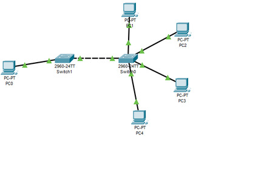

# SSH কনফিগার
Cisco switch-এ SSH কনফিগার করার জন্য নিচের স্টেপগুলো অনুসরণ করুন:

### ১. **হোস্টনেম এবং ডোমেইন নাম সেট করুন:**
SSH ব্যবহারের জন্য সুইচের হোস্টনেম এবং ডোমেইন নাম কনফিগার করা প্রয়োজন।

```bash
Switch# configure terminal
Switch(config)# hostname YourSwitchName
Switch(config)# ip domain-name yourdomain.com
```

### ২. **RSA কী জেনারেট করুন:**
SSH এনক্রিপশন ব্যবহৃত হয়, তাই নিরাপদ যোগাযোগের জন্য RSA কী জেনারেট করতে হবে।

```bash
Switch(config)# crypto key generate rsa
```
আপনি যখন কী সাইজের জন্য প্রম্পট পাবেন, তখন কমপক্ষে ১০২৪ বিট নির্বাচন করুন (২০৪৮ বিট নিরাপত্তার জন্য ভালো)।

```bash
The key modulus size is 2048
```

### ৩. **SSH সংস্করণ ২ সক্রিয় করুন:**
Cisco সুইচগুলি SSH সংস্করণ ১ এবং সংস্করণ ২ উভয়ই সাপোর্ট করে, তবে সংস্করণ ২ নিরাপদ। SSH সংস্করণ ২ সক্রিয় করতে নিচের কমান্ড ব্যবহার করুন:

```bash
Switch(config)# ip ssh version 2
```

### ৪. **একটি ব্যবহারকারীর নাম এবং পাসওয়ার্ড তৈরি করুন:**
SSH লগইন অ্যাক্সেসের জন্য একটি ব্যবহারকারীর নাম এবং পাসওয়ার্ড তৈরি করতে হবে।

```bash
Switch(config)# username yourusername privilege 15 secret yourpassword
```
- `privilege 15` পুরো প্রশাসনিক অ্যাক্সেস দেয়।
- `yourusername` এবং `yourpassword` পরিবর্তন করে আপনার পছন্দসই ব্যবহারকারীর নাম এবং পাসওয়ার্ড দিন।

### ৫. **VTY লাইনগুলিকে SSH অ্যাক্সেসের জন্য সক্ষম করুন:**
VTY লাইনগুলিতে SSH অ্যাক্সেস সক্ষম করতে হবে।

```bash
Switch(config)# line vty 0 15
Switch(config-line)# transport input ssh
Switch(config-line)# login local
```
এখানে, `line vty 0 15` মানে ০ থেকে ১৫ পর্যন্ত সকল VTY লাইন কনফিগার করা হবে।

### ৬. **SSH এর জন্য সুইচ রিবুট করুন:**
সব কনফিগারেশন করার পর, SSH অ্যাক্সেস পরীক্ষা করতে সুইচ রিবুট করতে পারেন বা শুধু SSH ব্যবহার করে সুইচে লগইন করার চেষ্টা করুন।

এখন আপনি SSH দিয়ে সুইচে লগইন করতে পারবেন। SSH ক্লায়েন্টের মাধ্যমে আপনার সুইচের IP ব্যবহার করে লগইন করুন:

```bash
ssh yourusername@Switch_IP_address
```

 ### উদাহরণ

```bash
Switch>enable
Switch#configure terminal
Enter configuration commands, one per line.  End with CNTL/Z.
Switch(config)#
Switch(config)#hostname ? [হোস্টনেম]
  WORD  This system's network name
Switch(config)#hostname cisco
cisco(config)#
cisco(config)#ip domain?
domain  domain-lookup  domain-name  
cisco(config)#ip domain-n
cisco(config)#ip domain-name ? [ ডোমেইন নাম]
  WORD  Default domain name
cisco(config)#ip domain-name cisco.com?
WORD  
cisco(config)#ip domain-name cisco.com
cisco(config)#
cisco(config)#crypto ? [*RSA কী জেনারেট]
  key  Long term key operations
cisco(config)#crypto key ?
  generate  Generate new keys
  zeroize   Remove keys
cisco(config)#crypto key gene
cisco(config)#crypto key generate ?
  rsa  Generate RSA keys
cisco(config)#crypto key generate rs
cisco(config)#crypto key generate rsa ?
  general-keys  Generate a general purpose RSA key pair for signing and
                encryption
  <cr>
cisco(config)#crypto key generate rsa 
The name for the keys will be: cisco.cisco.com
Choose the size of the key modulus in the range of 360 to 4096 for your
  General Purpose Keys. Choosing a key modulus greater than 512 may take
  a few minutes.

How many bits in the modulus [512]: 512
% Generating 512 bit RSA keys, keys will be non-exportable...[OK]

cisco(config)#
cisco(config)# ip ?
*Mar 1 0:4:30.372: RSA key size needs to be at least 768 bits for ssh version 2
*Mar 1 0:4:30.372: %SSH-5-ENABLED: SSH 1.5 has been enabled
  access-list      Named access-list
  arp              IP ARP global configuration
  default-gateway  Specify default gateway (if not routing IP)
  dhcp             Configure DHCP server and relay parameters
  domain           IP DNS Resolver
  domain-lookup    Enable IP Domain Name System hostname translation
  domain-name      Define the default domain name
  ftp              FTP configuration commands
  host             Add an entry to the ip hostname table
  name-server      Specify address of name server to use
  scp              Scp commands
  ssh              Configure ssh options
cisco(config)# ip ssh ?  [SSH ]
  authentication-retries  Specify number of authentication retries
  time-out                Specify SSH time-out interval
  version                 Specify protocol version to be supported
cisco(config)# ip ssh ver
cisco(config)# ip ssh version ?
  <1-2>  Protocol version
cisco(config)# ip ssh version 2
Please create RSA keys (of at least 768 bits size) to enable SSH v2.
cisco(config)#username ?  [username & Password]
  WORD  User name
cisco(config)#username cisco?
WORD  
cisco(config)#username cisco ?
  password   Specify the password for the user
  privilege  Set user privilege level
  secret     Specify the secret for the user
  <cr>
cisco(config)#username cisco se
cisco(config)#username cisco secret ? 
  0     Specifies an UNENCRYPTED secret will follow
  5     Specifies a HIDDEN secret will follow
  LINE  The UNENCRYPTED (cleartext) user secret
cisco(config)#username cisco secret cisco
cisco(config)#
cisco(config)#do show run
Building configuration...

Current configuration : 1178 bytes
!
version 15.0
no service timestamps log datetime msec
no service timestamps debug datetime msec
no service password-encryption
!
hostname cisco
!
!
!
ip ssh version 1
ip domain-name cisco.com
!
username cisco secret 5 $1$mERr$hx5rVt7rPNoS4wqbXKX7m0   [username & passsowrd]
!
!
!
spanning-tree mode pvst
spanning-tree extend system-id
 --More-- 
cisco(config)#do show ip interface brief 
Interface              IP-Address      OK? Method Status                Protocol 
FastEthernet0/1        unassigned      YES manual up                    up 
FastEthernet0/2        unassigned      YES manual down                  down 
FastEthernet0/3        unassigned      YES manual down                  down 
FastEthernet0/4        unassigned      YES manual down                  down 
FastEthernet0/5        unassigned      YES manual down                  down 
FastEthernet0/6        unassigned      YES manual down                  down 
FastEthernet0/7        unassigned      YES manual down                  down 
FastEthernet0/8        unassigned      YES manual down                  down 
FastEthernet0/9        unassigned      YES manual down                  down 
FastEthernet0/10       unassigned      YES manual down                  down 
FastEthernet0/11       unassigned      YES manual down                  down 
FastEthernet0/12       unassigned      YES manual down                  down 
FastEthernet0/13       unassigned      YES manual down                  down 
FastEthernet0/14       unassigned      YES manual down                  down 
FastEthernet0/15       unassigned      YES manual down                  down 
FastEthernet0/16       unassigned      YES manual down                  down 
FastEthernet0/17       unassigned      YES manual down                  down 
FastEthernet0/18       unassigned      YES manual down                  down 
FastEthernet0/19       unassigned      YES manual down                  down 
FastEthernet0/20       unassigned      YES manual down                  down 
FastEthernet0/21       unassigned      YES manual down                  down 
FastEthernet0/22       unassigned      YES manual down                  down 
FastEthernet0/23       unassigned      YES manual down                  down 
FastEthernet0/24       unassigned      YES manual down                  down 
GigabitEthernet0/1     unassigned      YES manual down                  down 
GigabitEthernet0/2     unassigned      YES manual down                  down 
Vlan1                  unassigned      YES manual administratively down down

cisco(config)#interface
cisco(config)#interface vlan 1
cisco(config-if)#no shutdown

cisco(config-if)#
%LINK-5-CHANGED: Interface Vlan1, changed state to up

%LINEPROTO-5-UPDOWN: Line protocol on Interface Vlan1, changed state to up

cisco(config-if)#do show ip interface brief 
Interface              IP-Address      OK? Method Status                Protocol 
FastEthernet0/1        unassigned      YES manual up                    up 
FastEthernet0/2        unassigned      YES manual down                  down 
FastEthernet0/3        unassigned      YES manual down                  down 
FastEthernet0/4        unassigned      YES manual down                  down 
FastEthernet0/5        unassigned      YES manual down                  down 
FastEthernet0/6        unassigned      YES manual down                  down 
FastEthernet0/7        unassigned      YES manual down                  down 
FastEthernet0/8        unassigned      YES manual down                  down 
FastEthernet0/9        unassigned      YES manual down                  down 
FastEthernet0/10       unassigned      YES manual down                  down 
FastEthernet0/11       unassigned      YES manual down                  down 
FastEthernet0/12       unassigned      YES manual down                  down 
FastEthernet0/13       unassigned      YES manual down                  down 
FastEthernet0/14       unassigned      YES manual down                  down 
FastEthernet0/15       unassigned      YES manual down                  down 
FastEthernet0/16       unassigned      YES manual down                  down 
FastEthernet0/17       unassigned      YES manual down                  down 
FastEthernet0/18       unassigned      YES manual down                  down 
FastEthernet0/19       unassigned      YES manual down                  down 
FastEthernet0/20       unassigned      YES manual down                  down 
FastEthernet0/21       unassigned      YES manual down                  down 
FastEthernet0/22       unassigned      YES manual down                  down 
FastEthernet0/23       unassigned      YES manual down                  down 
FastEthernet0/24       unassigned      YES manual down                  down 
GigabitEthernet0/1     unassigned      YES manual down                  down 
GigabitEthernet0/2     unassigned      YES manual down                  down 
Vlan1                  unassigned      YES manual up                    up

cisco(config-if)#ip address 192.168.0.2 255.255.255.0
cisco(config-if)#do show ip interface brief
Interface              IP-Address      OK? Method Status                Protocol 
FastEthernet0/1        unassigned      YES manual up                    up 
FastEthernet0/2        unassigned      YES manual down                  down 
FastEthernet0/3        unassigned      YES manual down                  down 
FastEthernet0/4        unassigned      YES manual down                  down 
FastEthernet0/5        unassigned      YES manual down                  down 
FastEthernet0/6        unassigned      YES manual down                  down 
FastEthernet0/7        unassigned      YES manual down                  down 
FastEthernet0/8        unassigned      YES manual down                  down 
FastEthernet0/9        unassigned      YES manual down                  down 
FastEthernet0/10       unassigned      YES manual down                  down 
FastEthernet0/11       unassigned      YES manual down                  down 
FastEthernet0/12       unassigned      YES manual down                  down 
FastEthernet0/13       unassigned      YES manual down                  down 
FastEthernet0/14       unassigned      YES manual down                  down 
FastEthernet0/15       unassigned      YES manual down                  down 
FastEthernet0/16       unassigned      YES manual down                  down 
FastEthernet0/17       unassigned      YES manual down                  down 
FastEthernet0/18       unassigned      YES manual down                  down 
FastEthernet0/19       unassigned      YES manual down                  down 
FastEthernet0/20       unassigned      YES manual down                  down 
FastEthernet0/21       unassigned      YES manual down                  down 
FastEthernet0/22       unassigned      YES manual down                  down 
FastEthernet0/23       unassigned      YES manual down                  down 
FastEthernet0/24       unassigned      YES manual down                  down 
GigabitEthernet0/1     unassigned      YES manual down                  down 
GigabitEthernet0/2     unassigned      YES manual down                  down 
Vlan1                  192.168.0.2     YES manual up                    up
cisco(config)#ip default-gateway 192.168.0.1
cisco(config)#line vty 0 15
cisco(config-line)#password ?
  7     Specifies a HIDDEN password will follow
  LINE  The UNENCRYPTED (cleartext) line password
cisco(config-line)#password cisco
cisco(config-line)#login
cisco(config-line)#exit
cisco(config-line)#password ?
  7     Specifies a HIDDEN password will follow
  LINE  The UNENCRYPTED (cleartext) line password
cisco(config-line)#password cisco
cisco(config-line)#login
cisco(config-line)#exit
cisco(config)#enable secret cisco
cisco(config)#service passw
cisco(config)#service password-encryption 
cisco(config)#do show run 
Building configuration...

Current configuration : 1320 bytes
!
version 15.0
no service timestamps log datetime msec
no service timestamps debug datetime msec
service password-encryption
!
hostname cisco
!
enable secret 5 $1$mERr$hx5rVt7rPNoS4wqbXKX7m0
!
!
!
ip ssh version 1
ip domain-name cisco.com
!
username cisco secret 5 $1$mERr$hx5rVt7rPNoS4wqbXKX7m0
!
!
!
spanning-tree mode pvst
spanning-tree extend system-id
!
interface FastEthernet0/1
!
interface FastEthernet0/2
!
interface FastEthernet0/3
!
interface FastEthernet0/4
!
interface FastEthernet0/5
!
interface FastEthernet0/6
!
interface FastEthernet0/7
!
interface FastEthernet0/8
!
interface FastEthernet0/9
!
interface FastEthernet0/10
!
interface FastEthernet0/11
!
interface FastEthernet0/12
!
interface FastEthernet0/13
!
interface FastEthernet0/14
!
interface FastEthernet0/15
!
interface FastEthernet0/16
!
interface FastEthernet0/17
!
interface FastEthernet0/18
!
interface FastEthernet0/19
!
interface FastEthernet0/20
!
interface FastEthernet0/21
!
interface FastEthernet0/22
!
interface FastEthernet0/23
!
interface FastEthernet0/24
!
interface GigabitEthernet0/1
!
interface GigabitEthernet0/2
!
interface Vlan1
 ip address 192.168.0.2 255.255.255.0
!
ip default-gateway 192.168.0.1
!
!
!
!
line con 0
!
line vty 0 4
 password 7 0822455D0A16
 login
line vty 5 15
 password 7 0822455D0A16
 login
!
!
!
!
end

cisco(config)#line vty 0 15  [ssh/telnet allow]
cisco(config-line)#trans
cisco(config-line)#tra
cisco(config-line)#transport ?
  input   Define which protocols to use when connecting to the terminal server
  output  Define which protocols to use for outgoing connections
cisco(config-line)#transport inpu
cisco(config-line)#transport input ?
  all     All protocols
  none    No protocols
  ssh     TCP/IP SSH protocol
  telnet  TCP/IP Telnet protocol
cisco(config-line)# transport input all 
cisco(config-line)# do show run
Building configuration...

Current configuration : 1320 bytes
!
version 15.0
no service timestamps log datetime msec
no service timestamps debug datetime msec
service password-encryption
!
hostname cisco
!
enable secret 5 $1$mERr$hx5rVt7rPNoS4wqbXKX7m0
!
!
!
ip ssh version 1
ip domain-name cisco.com
!
username cisco secret 5 $1$mERr$hx5rVt7rPNoS4wqbXKX7m0
!
!
!
spanning-tree mode pvst
spanning-tree extend system-id
!
interface FastEthernet0/1
!
interface FastEthernet0/2
!
interface FastEthernet0/3
!
interface FastEthernet0/4
!
interface FastEthernet0/5
!
interface FastEthernet0/6
!
interface FastEthernet0/7
!
interface FastEthernet0/8
!
interface FastEthernet0/9
!
interface FastEthernet0/10
!
interface FastEthernet0/11
!
interface FastEthernet0/12
!
interface FastEthernet0/13
!
interface FastEthernet0/14
!
interface FastEthernet0/15
!
interface FastEthernet0/16
!
interface FastEthernet0/17
!
interface FastEthernet0/18
!
interface FastEthernet0/19
!
interface FastEthernet0/20
!
interface FastEthernet0/21
!
interface FastEthernet0/22
!
interface FastEthernet0/23
!
interface FastEthernet0/24
!
interface GigabitEthernet0/1
!
interface GigabitEthernet0/2
!
interface Vlan1
 ip address 192.168.0.2 255.255.255.0
!
ip default-gateway 192.168.0.1
!
!
!
!
line con 0
!
line vty 0 4
 password 7 0822455D0A16
 login
line vty 5 15
 password 7 0822455D0A16
 login
!
!
!
!
end
```

এই ছিলো SSH কনফিগারেশন প্রক্রিয়া!
# পোর্ট সিকিউরিটি
সিস্কো পোর্ট সিকিউরিটি কনফিগার করার জন্য নিম্নলিখিত স্টেপগুলি অনুসরণ করতে পারেন:

### 1. পোর্ট সিকিউরিটি সক্রিয় করা
প্রথমে, আপনাকে পোর্টটি সিলেক্ট করতে হবে যেটি সিকিউরিটি কনফিগার করতে চান। এরপর, আপনি সেই পোর্টে সিকিউরিটি অ্যাক্টিভেট করবেন। উদাহরণস্বরূপ, যদি আপনি ইথারনেট পোর্ট 0/1 ব্যবহার করেন, তাহলে:

```bash
Switch(config)# interface fastEthernet 0/1
Switch(config-if)# switchport port-security
```
### Violation Shutdown
**পোর্ট সিকিউরিটি ভায়োলেশন (Port Security Violation)** হলো সেই ঘটনা যখন কোনো পোর্টে অনুমোদিত MAC ঠিকানা ছাড়া অন্য কোনো ডিভাইস সংযুক্ত হয়। এটি **নেটওয়ার্ক সিকিউরিটি** বাড়ানোর জন্য গুরুত্বপূর্ণ, কারণ এটি অপ্রত্যাশিত বা অবাঞ্ছিত ডিভাইসগুলোকে পোর্টে সংযোগ করতে বাধা দেয়।

- **পোর্ট সিকিউরিটি ভায়োলেশন কিভাবে কাজ করে?**

যখন একটি ডিভাইস একটি পোর্টে সংযুক্ত হয়, সিস্কো সুইচ **MAC ঠিকানা** শনাক্ত করে। যদি ঐ পোর্টের জন্য কনফিগার করা MAC ঠিকানার সাথে নতুন কোনো MAC ঠিকানা মিল না খায়, তবে সেটি **ভায়োলেশন** হিসেবে গণ্য হয়। এবং এরপর স্যুইচ যেই **ভায়োলেশন অ্যাকশন** কনফিগার করা থাকে, তা অনুযায়ী ব্যবস্থা নেয়।

- **পোর্ট সিকিউরিটি ভায়োলেশন অ্যাকশন**

সিস্কো সুইচে পোর্ট সিকিউরিটি ভায়োলেশন ঘটলে তিন ধরনের অ্যাকশন নেয়া যায়:

1. **Protect**:
   - অজানা MAC ঠিকানার প্যাকেট ড্রপ করা হয়, তবে কোনো নোটিফিকেশন পাঠানো হয় না।
   
   কনফিগারেশন:
   ```bash
   switchport port-security violation protect
   ```

2. **Restrict**:
   - অজানা MAC ঠিকানার প্যাকেট ড্রপ করা হয় এবং স্যুইচ একটি নোটিফিকেশন (syslog) পাঠায়।
   
   কনফিগারেশন:
   ```bash
   switchport port-security violation restrict
   ```

3. **Shutdown (ডিফল্ট অপশন)**:
   - পোর্টটি স্বয়ংক্রিয়ভাবে **শাটডাউন** হয়ে যায় এবং কোন প্যাকেট পাস করতে পারে না। এটি সবচেয়ে কড়া নিরাপত্তা।
   
   কনফিগারেশন:
   ```bash
   switchport port-security violation shutdown
   ```

**উদাহরণ কনফিগারেশন:**
ধরা যাক, আপনি যদি FastEthernet0/1 পোর্টে পোর্ট সিকিউরিটি কনফিগার করতে চান এবং ভায়োলেশন ঘটলে পোর্টটি বন্ধ (shutdown) করতে চান, তাহলে কনফিগারেশন হবে:

```bash
Switch(config)#interface FastEthernet0/1
Switch(config-if)#switchport mode access
Switch(config-if)#switchport port-security
Switch(config-if)#switchport port-security maximum 1
Switch(config-if)#switchport port-security violation shutdown
Switch(config-if)#switchport port-security mac-address sticky
```

এখানে:
- **`switchport port-security violation shutdown`**: যদি অন্য কোনো অজানা MAC ঠিকানা পোর্টে যুক্ত হয়, পোর্টটি বন্ধ হয়ে যাবে (shutdown)।
- **`switchport port-security maximum 1`**: একে সীমিত করা হবে ১টি MAC ঠিকানায়।
- **`switchport port-security mac-address sticky`**: যেই MAC ঠিকানা প্রথমে সংযুক্ত হবে, সেগুলো সিস্টেমে অটোমেটিক্যালি সংরক্ষিত হবে।

**পোর্ট সিকিউরিটি ভায়োলেশন চেক করা:**
ভায়োলেশন ঘটে থাকলে তার বিস্তারিত জানার জন্য আপনি নিচের কমান্ডটি ব্যবহার করতে পারেন:
```bash
show port-security
show port-security interface FastEthernet0/1
```

এটি আপনাকে পোর্ট সিকিউরিটির বর্তমান স্ট্যাটাস এবং ভায়োলেশন তথ্য দেখাবে।

### ভায়োলেশন সম্পর্কে সচেতনতা:
- **পোর্ট শাটডাউন** (shutdown) অবস্থায়, পোর্টটি পুনরায় **enable** করতে হবে। এটি করতে:
  ```bash
  Switch(config)#interface FastEthernet0/1
  Switch(config-if)#shutdown
  Switch(config-if)#no shutdown
  ```
### Violation Shutdown Troubleshooting:
যদি পোর্টটি **err-disable** হয়ে যায়, তাহলে এটি চেক করতে পারেন:

```bash
Switch# show interface status err-disabled
```

এবং পোর্টটি পুনরায় সক্রিয় করতে:

```bash
Switch# show port-security interface fastEthernet 0/1
Switch# clear port-security sticky interface fastEthernet 0/1
```

এভাবে, **Violation Shutdown** পোর্ট সিকিউরিটির একটি গুরুত্বপূর্ণ অংশ যা নেটওয়ার্কের নিরাপত্তা নিশ্চিত করে।
### 2. পোর্ট সিকিউরিটির নিয়ম সেট করা
আপনার পোর্ট সিকিউরিটির জন্য কিছু প্যারামিটার কনফিগার করতে হবে, যেমন:

- **ম্যাক অ্যাড্রেস সীমা**: কতটি MAC অ্যাড্রেস পোর্টে অনুমোদিত হবে
- **অ্যাকশন**: যদি কোনো নিষিদ্ধ ডিভাইস পোর্টে সংযুক্ত হয় তাহলে কি হবে (সেটআপ করা যেতে পারে "restrict", "protect", বা "shutdown" অ্যাকশন)
- **MAC অ্যাড্রেস লক করা**: পোর্টে ম্যানুয়ালি নির্দিষ্ট MAC অ্যাড্রেস সেট করা।
- **Port Security Sticky Mode** সিস্কো সুইচে একটি ফিচার যা পোর্টে সংযুক্ত MAC অ্যাড্রেসগুলোকে **স্বয়ংক্রিয়ভাবে সুরক্ষিত** করে রাখে। এই মোডে, যখন একটি ডিভাইস প্রথমবারের মতো একটি পোর্টে সংযুক্ত হয়, তখন পোর্টটি ঐ ডিভাইসের MAC অ্যাড্রেসটিকে "sticky" হিসেবে স্মরণ করে রাখে। এর মানে হলো, সিস্কো সুইচ ঐ MAC অ্যাড্রেসটিকে পোর্ট সিকিউরিটির তালিকায় অস্থায়ীভাবে যোগ করে এবং ভবিষ্যতে ঐ MAC অ্যাড্রেসটি শুধুমাত্র ঐ পোর্টে ব্যবহৃত হতে পারে।

Sticky মোডে কনফিগার করলে, ডিভাইসটির MAC অ্যাড্রেসটি সেই পোর্টে স্টোর হয়ে যায় এবং পুনরায় সুইচ রিস্টার্ট হলে, সিস্টেম ঐ MAC অ্যাড্রেসগুলো আবারও স্বয়ংক্রিয়ভাবে পুনরুদ্ধার করে, এর ফলে নতুন করে MAC অ্যাড্রেস যুক্ত করার প্রয়োজন হয় না।

#### Sticky Mode-এর সুবিধা:
1. **স্বয়ংক্রিয় MAC অ্যাড্রেস সংরক্ষণ**: আপনি যখন কোনো ডিভাইস সংযুক্ত করেন, তখন ঐ ডিভাইসের MAC অ্যাড্রেস পোর্টে স্বয়ংক্রিয়ভাবে যুক্ত হয়ে যায়।
2. **সুরক্ষা**: এটি পোর্টে শুধুমাত্র অনুমোদিত MAC অ্যাড্রেসগুলো সংযুক্ত থাকতে নিশ্চিত করে, ফলে নকল বা অননুমোদিত ডিভাইসের সংযোগ বন্ধ হয়ে যায়।
3. **কনফিগারেশন সহজ করা**: আপনি ম্যানুয়ালি MAC অ্যাড্রেস কনফিগার না করে, শুধুমাত্র Sticky মোড ব্যবহার করে সমস্ত MAC অ্যাড্রেস কনফিগার করতে পারেন।

#### Sticky Mode-এর কাজের পদ্ধতি:
- যখন একটি ডিভাইস প্রথমবার পোর্টে সংযুক্ত হয়, তখন ঐ MAC অ্যাড্রেসটি সিস্কো সুইচে `sticky` হিসেবে সংরক্ষিত হয়ে যায়।
- ঐ MAC অ্যাড্রেসটির পরে যদি পোর্টে আরেকটি ডিভাইস সংযুক্ত করা হয় যার MAC অ্যাড্রেসটি আগে থেকেই স্টোর করা থাকে, তবে ঐ ডিভাইসটি পোর্টে কাজ করবে।
- যদি ঐ MAC অ্যাড্রেসটির সীমা পার হয়ে যায় বা অন্য কোনো অননুমোদিত MAC অ্যাড্রেস সংযুক্ত হয়, তখন নির্দিষ্ট অ্যাকশন যেমন `restrict`, `shutdown`, বা `protect` কার্যকর হয়।

#### Sticky Mode কনফিগার করার উদাহরণ:
```bash
Switch(config)# interface fastEthernet 0/1
Switch(config-if)# switchport port-security
Switch(config-if)# switchport port-security mac-address sticky
Switch(config-if)# switchport port-security maximum 2
Switch(config-if)# switchport port-security violation restrict
```

এভাবে, **Sticky Mode** পোর্ট সিকিউরিটির মাধ্যমে আপনাকে স্বয়ংক্রিয়ভাবে সুরক্ষিত MAC অ্যাড্রেস ব্যবস্থাপনা করতে সাহায্য করে।
#### উদাহরণ:
1. পোর্টে একমাত্র একটি MAC অ্যাড্রেস অনুমোদিত হবে:
```bash
Switch(config-if)# switchport port-security maximum 1
Switch(config-if)# switchport port-security violation restrict
```

2. একটি নির্দিষ্ট MAC অ্যাড্রেস কনফিগার করা:
```bash
Switch(config-if)# switchport port-security mac-address 0010.1234.5678
```

3. পোর্ট সিকিউরিটি নিষিদ্ধ করার জন্য:
```bash
Switch(config-if)# switchport port-security violation shutdown
```

#### 3. পোর্ট সিকিউরিটি স্ট্যাটাস চেক করা
আপনি পোর্ট সিকিউরিটির বর্তমান স্ট্যাটাস দেখতে চাইলে নিচের কমান্ড ব্যবহার করতে পারেন:

```bash
Switch# show port-security interface fastEthernet 0/1
```

#### 4. পোর্ট সিকিউরিটি ডিএকটিভেট করা
যদি আপনি পোর্ট সিকিউরিটি নিষ্ক্রিয় করতে চান:

```bash
Switch(config-if)# no switchport port-security
```
**উদাহরণ**
```
Switch>
Switch>enable
Switch#config
Switch#configure te
Switch#configure terminal 
Enter configuration commands, one per line.  End with CNTL/Z.
Switch(config)#interface fas
Switch(config)#interface fastEthernet 0/1
Switch(config-if)#switchport port-security
Command rejected: FastEthernet0/1 is a dynamic port.
Switch(config-if)#switchport mode access
Switch(config-if)#switchport port-security
```
এটি মানে যে, আপনি যে ইন্টারফেসে পোর্ট সিকিউরিটি কনফিগার করতে চাচ্ছেন, সেই ইন্টারফেসটি ডাইনামিক পোর্ট হিসেবে কনফিগার করা আছে, যা ভলেটাইল বা পরিবর্তনযোগ্য। Cisco সুইচে কিছু পোর্টে ডাইনামিক পোর্ট কনফিগারেশন থাকতে পারে, এবং এই ধরনের পোর্টে পোর্ট সিকিউরিটি প্রয়োগ করা যায় না।

**সমস্যা সমাধানের জন্য সমাধান:**
- ইন্টারফেসটিকে Access Mode এ স্যুইচ করুন:

 - প্রথমে আপনাকে ইন্টারফেসটিকে access mode এ সেট করতে হবে। এরপর আপনি পোর্ট সিকিউরিটি কনফিগার করতে পারবেন।
   নির্দেশনা:
   ```bash
      Switch(config)#interface FastEthernet0/1
      Switch(config-if)#switchport mode access
   ```
- পোর্ট সিকিউরিটি কনফিগার করুন:
     এখন, আপনি সহজেই পোর্ট সিকিউরিটি কনফিগার করতে পারবেন।
  ```bash
      Switch(config-if)#switchport port-security
  ```
```bash
Switch(config-if)#switchport port-security ?
  aging        Port-security aging commands
  mac-address  Secure mac address
  maximum      Max secure addresses
  violation    Security violation mode
  <cr>
Switch(config-if)#switchport port-security maxi
Switch(config-if)#switchport port-security maximum ?
  <1-132>  Maximum addresses
Switch(config-if)#switchport port-security maximum 1
Switch(config-if)#switchport port-security maximum 2
```
switchport port-security maximum 1 কমান্ডটি ব্যবহার করে আপনি একটি পোর্টে সর্বাধিক 1টি MAC ঠিকানা অনুমোদিত করতে পারেন।

এটির মাধ্যমে আপনি নির্দিষ্ট করে দেন যে, ঐ পোর্টে কেবল 1টি ডিভাইসের MAC ঠিকানা কানেক্ট হতে পারবে। যদি অন্য কোনো MAC ঠিকানা ওই পোর্টে সংযুক্ত হয়, তবে এটি একটি ভায়োলেশন সৃষ্টি করবে, এবং সেটি নির্ধারিত ভায়োলেশন অ্যাকশন অনুযায়ী (যেমন: Shutdown, Protect, বা Restrict) কাজ করবে।

আইপি টেলিফোন এবং পিসির জন্য  ঐ পোর্টে কেবল 2টি ডিভাইসের MAC ঠিকানা কানেক্ট হতে পারবে।

```bash
Switch(config)#interface fastEthernet 0/1
Switch(config-if)#swit
Switch(config-if)#switchport por
Switch(config-if)#switchport port-security ?
  aging        Port-security aging commands
  mac-address  Secure mac address
  maximum      Max secure addresses
  violation    Security violation mode
  <cr>
Switch(config-if)#switchport port-security vio
Switch(config-if)#switchport port-security violation ?
  protect   Security violation protect mode
  restrict  Security violation restrict mode
  shutdown  Security violation shutdown mode
Switch(config-if)#switchport port-security violation shutdo
Switch(config-if)#switchport port-security violation shutdown 
Switch(config-if)#switchport port-security mac
Switch(config-if)#switchport port-security mac-address ?
  H.H.H   48 bit mac address
  sticky  Configure dynamic secure addresses as sticky
Switch(config-if)#switchport port-security mac-address sti
Switch(config-if)#switchport port-security mac-address sticky
Switch(config-if)#do sh mac add
          Mac Address Table
-------------------------------------------

Vlan    Mac Address       Type        Ports
----    -----------       --------    -----

   1    0001.c7ad.88d7    DYNAMIC     Fa0/3
   1    000b.be53.27b3    STATIC      Fa0/1
   1    0030.f276.6c65    DYNAMIC     Fa0/2
   1    0090.21ce.31b1    DYNAMIC     Fa0/4


Switch(config-if)# do sh run
Building configuration...

Current configuration : 1272 bytes
!
version 15.0
no service timestamps log datetime msec
no service timestamps debug datetime msec
no service password-encryption
!
hostname Switch
!
spanning-tree mode pvst
spanning-tree extend system-id
!
interface FastEthernet0/1
 switchport mode access
 switchport port-security
 switchport port-security maximum 2
 switchport port-security mac-address sticky 
 switchport port-security mac-address sticky 000B.BE53.27B3
!
--More--

Switch(config-if)#do sh port-security
Secure Port MaxSecureAddr CurrentAddr SecurityViolation Security Action
               (Count)       (Count)        (Count)
--------------------------------------------------------------------
        Fa0/1        2          1                 0         Shutdown
----------------------------------------------------------------------
Switch(config-if)#^Z
Switch#
%SYS-5-CONFIG_I: Configured from console by console
Switch#show port-security ?
  address    Show secure address
  interface  Show secure interface
  <cr>
Switch#show port-security inter
Switch#show port-security interface ?
  Ethernet         IEEE 802.3
  FastEthernet     FastEthernet IEEE 802.3
  GigabitEthernet  GigabitEthernet IEEE 802.3z
Switch#show port-security interface F
Switch#show port-security interface FastEthernet 
Switch#show port-security interface FastEthernet ?
  <0-9>  FastEthernet interface number
Switch#show port-security interface FastEthernet 0?
/  
Switch#show port-security interface FastEthernet 0/1
Port Security              : Enabled
Port Status                : Secure-up
Violation Mode             : Shutdown
Aging Time                 : 0 mins
Aging Type                 : Absolute
SecureStatic Address Aging : Disabled
Maximum MAC Addresses      : 2
Total MAC Addresses        : 1
Configured MAC Addresses   : 0
Sticky MAC Addresses       : 1
Last Source Address:Vlan   : 000B.BE53.27B3:1
Security Violation Count   : 0

%%%%%if we change condition&&&&&&&
Switch#show port-security interface FastEthernet 0/1
Port Security              : Enabled
Port Status                : Secure-shutdown
Violation Mode             : Shutdown
Aging Time                 : 0 mins
Aging Type                 : Absolute
SecureStatic Address Aging : Disabled
Maximum MAC Addresses      : 2
Total MAC Addresses        : 2
Configured MAC Addresses   : 0
Sticky MAC Addresses       : 2
Last Source Address:Vlan   : 0090.21CE.31B1:1
Security Violation Count   : 1
Switch#show ip int brief
Interface              IP-Address      OK? Method Status                Protocol 
FastEthernet0/1        unassigned      YES manual down                  down 
FastEthernet0/2        unassigned      YES manual up                    up 
FastEthernet0/3        unassigned      YES manual up                    up 
FastEthernet0/4        unassigned      YES manual up                    up 
FastEthernet0/5        unassigned      YES manual down                  down 
FastEthernet0/6        unassigned      YES manual down                  down 
FastEthernet0/7        unassigned      YES manual down                  down 
FastEthernet0/8        unassigned      YES manual down                  down 
FastEthernet0/9        unassigned      YES manual down                  down 
FastEthernet0/10       unassigned      YES manual down                  down 
FastEthernet0/11       unassigned      YES manual down                  down 
FastEthernet0/12       unassigned      YES manual down                  down 
FastEthernet0/13       unassigned      YES manual down                  down 
FastEthernet0/14       unassigned      YES manual down                  down 
FastEthernet0/15       unassigned      YES manual down                  down 
FastEthernet0/16       unassigned      YES manual down                  down 
FastEthernet0/17       unassigned      YES manual down                  down 
FastEthernet0/18       unassigned      YES manual down                  down 
FastEthernet0/19       unassigned      YES manual down                  down 
FastEthernet0/20       unassigned      YES manual down                  down 
FastEthernet0/21       unassigned      YES manual down                  down 
FastEthernet0/22       unassigned      YES manual down                  down 
FastEthernet0/23       unassigned      YES manual down                  down 
FastEthernet0/24       unassigned      YES manual down                  down 
GigabitEthernet0/1     unassigned      YES manual down                  down 
GigabitEthernet0/2     unassigned      YES manual down                  down 
Vlan1                  unassigned      YES manual administratively down down

Switch#show inter fastEthernet 0/1
FastEthernet0/1 is down, line protocol is down **(err-disabled)**
  Hardware is Lance, address is 00e0.a363.5c01 (bia 00e0.a363.5c01)
 BW 100000 Kbit, DLY 1000 usec,
     reliability 255/255, txload 1/255, rxload 1/255
  Encapsulation ARPA, loopback not set
  Keepalive set (10 sec)
  Full-duplex, 100Mb/s
  input flow-control is off, output flow-control is off
  ARP type: ARPA, ARP Timeout 04:00:00
  Last input 00:00:08, output 00:00:05, output hang never
  Last clearing of "show interface" counters never
  Input queue: 0/75/0/0 (size/max/drops/flushes); Total output drops: 0
  Queueing strategy: fifo
  Output queue :0/40 (size/max)
  5 minute input rate 0 bits/sec, 0 packets/sec
  5 minute output rate 0 bits/sec, 0 packets/sec
     956 packets input, 193351 bytes, 0 no buffer
     Received 956 broadcasts, 0 runts, 0 giants, 0 throttles
     0 input errors, 0 CRC, 0 frame, 0 overrun, 0 ignored, 0 abort
     0 watchdog, 0 multicast, 0 pause input
     0 input packets with dribble condition detected
     2357 packets output, 263570 bytes, 0 underruns
     0 output errors, 0 collisions, 10 interface resets
     0 babbles, 0 late collision, 0 deferred
     0 lost carrier, 0 no carrier
     0 output buffer failures, 0 output buffers swapped out
Switch#configure terminal 
Enter configuration commands, one per line.  End with CNTL/Z.
Switch(config)#inter
Switch(config)#interface fa
Switch(config)#interface fastEthernet 0/1
Switch(config-if)#show por
Switch(config-if)#shu
Switch(config-if)#shutdown 

%LINK-5-CHANGED: Interface FastEthernet0/1, changed state to administratively down
Switch(config-if)#do sh ip interface brief
Interface              IP-Address      OK? Method Status                Protocol 
FastEthernet0/1        unassigned      YES manual administratively down down 
--More--

Switch(config-if)#no shutdown 

Switch(config-if)#
%LINK-5-CHANGED: Interface FastEthernet0/1, changed state to up

%LINEPROTO-5-UPDOWN: Line protocol on Interface FastEthernet0/1, changed state to up

Switch(config-if)#do sh ip interface brief
Interface              IP-Address      OK? Method Status                Protocol 
FastEthernet0/1        unassigned      YES manual up                    up 
--More--
Switch(config-if)#do sh port inter f0/1
Port Security              : Enabled
Port Status                : Secure-up
Violation Mode             : Shutdown
Aging Time                 : 0 mins
Aging Type                 : Absolute
SecureStatic Address Aging : Disabled
Maximum MAC Addresses      : 2
Total MAC Addresses        : 2
Configured MAC Addresses   : 0
Sticky MAC Addresses       : 2
Last Source Address:Vlan   : 0090.21CE.31B1:1
Security Violation Count   : 0
```
এই স্টেপগুলি ব্যবহার করে আপনি সিস্কো সুইচে পোর্ট সিকিউরিটি কনফিগার করতে পারেন।

# স্পিড এবং ডুপ্লেক্স সেটিংস 
আপনি যদি বলছেন যে সুইচের নেটওয়ার্ক স্লো হয়ে যাচ্ছে স্পিড এবং ডুপ্লেক্স সেটিংসের কারণে, তাহলে এটা বেশ সাধারণ একটি সমস্যা হতে পারে। স্পিড এবং ডুপ্লেক্স হল নেটওয়ার্ক ডাটা ট্রান্সফারের গতি এবং মেথড। যদি এগুলোর মধ্যে মিসম্যাচ হয়, তাহলে স্লো কানেকশন বা ডাটা ট্রান্সফারের সমস্যা হতে পারে। নিচে কিছু বিষয় বিস্তারিতভাবে দেওয়া হলো:

### ১. **স্পিড (Speed)**:
এটি হল ডাটা ট্রান্সফারের গতি। সাধারণত স্পিড ১০ Mbps, ১০০ Mbps, ১ Gbps ইত্যাদি হয়ে থাকে। যদি এক ডিভাইস ১ Gbps এ সেট করা থাকে এবং অন্যটি ১০০ Mbps এ, তাহলে কানেকশন স্লো হতে পারে।

### ২. **ডুপ্লেক্স (Duplex)**:
ডুপ্লেক্স হল ডাটা ট্রান্সফারের কিভাবে হবে তা নির্ধারণ করে। 
- **হাফ-ডুপ্লেক্স (Half-duplex)**: এক সময় শুধু ডাটা পাঠানো অথবা গ্রহণ করা যাবে।
- **ফুল-ডুপ্লেক্স (Full-duplex)**: একই সময়ে পাঠানো এবং গ্রহণ করা সম্ভব, যা দ্রুত ডাটা ট্রান্সফার নিশ্চিত করে।

### সমস্যার সমাধান:
- **মিসম্যাচিং সেটিংস**: যদি এক ডিভাইস অটো-নেগোশিয়েট (Auto-Negotiate) এ সেট করা থাকে এবং অন্যটি একটি নির্দিষ্ট স্পিড বা ডুপ্লেক্সে সেট করা থাকে, তাহলে সঠিকভাবে সিঙ্ক না হওয়ায় স্লো কানেকশন হতে পারে। উভয় ডিভাইসে স্পিড এবং ডুপ্লেক্স সঠিকভাবে সেট আছে কিনা, তা চেক করুন।
  
- **অটো-নেগোশিয়েট ব্যবহার করুন**: বেশিরভাগ ক্ষেত্রে, উভয় ডিভাইসকে অটো-নেগোশিয়েট (Auto-Negotiate) সেট করলে এটি স্বয়ংক্রিয়ভাবে সঠিক স্পিড এবং ডুপ্লেক্স মেলাতে সাহায্য করবে।

- **ম্যানুয়ালি সেট করুন**: যদি অটো-নেগোশিয়েট কাজ না করে, তাহলে উভয় ডিভাইসে স্পিড এবং ডুপ্লেক্স ম্যানুয়ালি একই করতে হবে।

- **কেবলের সমস্যা**: মাঝে মাঝে কেবলের কারণেও সমস্যা হতে পারে। যদি কেবলের মান ভালো না হয় বা কেবল ড্যামেজ হয়ে যায়, তাহলে নেটওয়ার্ক স্পিড স্লো হতে পারে। সঠিক ক্যাটেগরি (যেমন Cat5e, Cat6) কেবল ব্যবহার করা জরুরি।

আপনি কি ডিভাইসগুলোর স্পিড এবং ডুপ্লেক্স সেটিংস চেক করেছেন?
```bash
Switch1>
Switch1>enable
Switch1#config
Switch1#configure ter
Switch1#configure terminal 
Enter configuration commands, one per line.  End with CNTL/Z.
Switch(1config)#do sh ip interface brief
Interface              IP-Address      OK? Method Status                Protocol 
FastEthernet0/1        unassigned      YES manual up                    up 
FastEthernet0/2        unassigned      YES manual up                    up 
FastEthernet0/3        unassigned      YES manual down                  down 
FastEthernet0/4        unassigned      YES manual down                  down 
FastEthernet0/5        unassigned      YES manual down                  down 
FastEthernet0/6        unassigned      YES manual down                  down 
FastEthernet0/7        unassigned      YES manual down                  down 
FastEthernet0/8        unassigned      YES manual down                  down 
FastEthernet0/9        unassigned      YES manual down                  down 
FastEthernet0/10       unassigned      YES manual down                  down 
FastEthernet0/11       unassigned      YES manual down                  down 
FastEthernet0/12       unassigned      YES manual down                  down 
FastEthernet0/13       unassigned      YES manual down                  down 
FastEthernet0/14       unassigned      YES manual down                  down 
FastEthernet0/15       unassigned      YES manual down                  down 
FastEthernet0/16       unassigned      YES manual down                  down 
FastEthernet0/17       unassigned      YES manual down                  down 
FastEthernet0/18       unassigned      YES manual down                  down 
FastEthernet0/19       unassigned      YES manual down                  down 
FastEthernet0/20       unassigned      YES manual down                  down 
FastEthernet0/21       unassigned      YES manual down                  down 
FastEthernet0/22       unassigned      YES manual down                  down 
FastEthernet0/23       unassigned      YES manual down                  down 
FastEthernet0/24       unassigned      YES manual down                  down 
GigabitEthernet0/1     unassigned      YES manual down                  down 
GigabitEthernet0/2     unassigned      YES manual down                  down 
Vlan1                  unassigned      YES manual administratively down down
Switch1(config)#int
Switch1(config)#interface fas
Switch1(config)#interface fastEthernet 0/1
Switch1(config-if)#speed ?
  10    Force 10 Mbps operation
  100   Force 100 Mbps operation
  auto  Enable AUTO speed configuration
Switch1(config-if)#speed  100 ?
  <cr>
Switch1(config-if)#speed  100 
Switch1(config-if)#duplex ?
  auto  Enable AUTO duplex configuration
  full  Force full duplex operation
  half  Force half-duplex operation
Switch1(config-if)#duplex full ?
  <cr>
Switch1(config-if)#duplex full 
Switch1(config-if)#
%LINK-3-UPDOWN: Interface FastEthernet0/1, changed state to down

%LINEPROTO-5-UPDOWN: Line protocol on Interface FastEthernet0/1, changed state to down

Switch1(config-if)#do sh ip interface brief
Interface              IP-Address      OK? Method Status                Protocol 
FastEthernet0/1        unassigned      YES manual down                  down 
FastEthernet0/2        unassigned      YES manual up                    up 
FastEthernet0/3        unassigned      YES manual down                  down 
FastEthernet0/4        unassigned      YES manual down                  down 
FastEthernet0/5        unassigned      YES manual down                  down 
FastEthernet0/6        unassigned      YES manual down                  down 
FastEthernet0/7        unassigned      YES manual down                  down 
FastEthernet0/8        unassigned      YES manual down                  down 
FastEthernet0/9        unassigned      YES manual down                  down 
FastEthernet0/10       unassigned      YES manual down                  down 
FastEthernet0/11       unassigned      YES manual down                  down 
FastEthernet0/12       unassigned      YES manual down                  down 
FastEthernet0/13       unassigned      YES manual down                  down 
FastEthernet0/14       unassigned      YES manual down                  down 
FastEthernet0/15       unassigned      YES manual down                  down 
FastEthernet0/16       unassigned      YES manual down                  down 
FastEthernet0/17       unassigned      YES manual down                  down 
FastEthernet0/18       unassigned      YES manual down                  down 
FastEthernet0/19       unassigned      YES manual down                  down 
FastEthernet0/20       unassigned      YES manual down                  down 
FastEthernet0/21       unassigned      YES manual down                  down 
 --More-- 
%LINK-3-UPDOWN: Interface FastEthernet0/2, changed state to down

%LINEPROTO-5-UPDOWN: Line protocol on Interface FastEthernet0/2, changed state to down

%LINK-5-CHANGED: Interface FastEthernet0/2, changed state to up

%LINEPROTO-5-UPDOWN: Line protocol on Interface FastEthernet0/2, changed state to up
FastEthernet0/22       unassigned      YES manual down                  down 
FastEthernet0/23       unassigned      YES manual down                  down 
FastEthernet0/24       unassigned      YES manual down                  down 
GigabitEthernet0/1     unassigned      YES manual down                  down 
GigabitEthernet0/2     unassigned      YES manual down                  down 
Vlan1                  unassigned      YES manual administratively down down
Switch1(config-if)#
Switch1(config-if)#

[for another switch]
Switch>
Switch>ena
Switch>enable 
Switch#conf
Switch#configure 
Configuring from terminal, memory, or network [terminal]? t
Enter configuration commands, one per line.  End with CNTL/Z.
Switch(config)#inter
Switch(config)#do sh ip interface brief
Interface              IP-Address      OK? Method Status                Protocol 
FastEthernet0/1        unassigned      YES manual down                  down 
FastEthernet0/2        unassigned      YES manual up                    up 
FastEthernet0/3        unassigned      YES manual down                  down 
FastEthernet0/4        unassigned      YES manual down                  down 
FastEthernet0/5        unassigned      YES manual down                  down 
FastEthernet0/6        unassigned      YES manual down                  down 
FastEthernet0/7        unassigned      YES manual down                  down 
FastEthernet0/8        unassigned      YES manual down                  down 
FastEthernet0/9        unassigned      YES manual down                  down 
FastEthernet0/10       unassigned      YES manual down                  down 
FastEthernet0/11       unassigned      YES manual down                  down 
FastEthernet0/12       unassigned      YES manual down                  down 
FastEthernet0/13       unassigned      YES manual down                  down 
FastEthernet0/14       unassigned      YES manual down                  down 
FastEthernet0/15       unassigned      YES manual down                  down 
FastEthernet0/16       unassigned      YES manual down                  down 
FastEthernet0/17       unassigned      YES manual down                  down 
FastEthernet0/18       unassigned      YES manual down                  down 
FastEthernet0/19       unassigned      YES manual down                  down 
FastEthernet0/20       unassigned      YES manual down                  down 
FastEthernet0/21       unassigned      YES manual down                  down 
FastEthernet0/22       unassigned      YES manual down                  down 
FastEthernet0/23       unassigned      YES manual down                  down 
FastEthernet0/24       unassigned      YES manual down                  down 
GigabitEthernet0/1     unassigned      YES manual down                  down 
GigabitEthernet0/2     unassigned      YES manual down                  down 
Vlan1                  unassigned      YES manual administratively down down
Switch(config)#inter
Switch(config)#interface fas
Switch(config)#interface fastEthernet 0/1
Switch(config-if)#?
  authentication    Auth Manager Interface Configuration Commands
  cdp               Global CDP configuration subcommands
  channel-group     Etherchannel/port bundling configuration
  channel-protocol  Select the channel protocol (LACP, PAgP)
  description       Interface specific description
  dot1x             Interface Config Commands for IEEE 802.1X
  duplex            Configure duplex operation.
  exit              Exit from interface configuration mode
  ip                Interface Internet Protocol config commands
  lldp              LLDP interface subcommands
  mdix              Set Media Dependent Interface with Crossover
  mls               mls interface commands
  no                Negate a command or set its defaults
  shutdown          Shutdown the selected interface
  spanning-tree     Spanning Tree Subsystem
  speed             Configure speed operation.
  storm-control     storm configuration
  switchport        Set switching mode characteristics
  tx-ring-limit     Configure PA level transmit ring limit
Switch(config-if)#spee
Switch(config-if)#speed ?
  10    Force 10 Mbps operation
  100   Force 100 Mbps operation
  auto  Enable AUTO speed configuration
Switch(config-if)#speed 100
Switch(config-if)#speed 100 
Switch(config-if)#du
Switch(config-if)#duplex ?
  auto  Enable AUTO duplex configuration
  full  Force full duplex operation
  half  Force half-duplex operation
Switch(config-if)#duplex full
Switch(config-if)#
%LINK-5-CHANGED: Interface FastEthernet0/1, changed state to up

%LINEPROTO-5-UPDOWN: Line protocol on Interface FastEthernet0/1, changed state to up

[now both switch is up]

Switch# show  interface fastEthernet 0/1
FastEthernet0/1 is up, line protocol is up (connected)
  Hardware is Lance, address is 00d0.bcb3.c801 (bia 00d0.bcb3.c801)
 BW 100000 Kbit, DLY 1000 usec,
     reliability 255/255, txload 1/255, rxload 1/255
  Encapsulation ARPA, loopback not set
  Keepalive set (10 sec)
  Full-duplex, 100Mb/s                                  [**speed/duplex**]
  input flow-control is off, output flow-control is off
  ARP type: ARPA, ARP Timeout 04:00:00
  Last input 00:00:08, output 00:00:05, output hang never
  Last clearing of "show interface" counters never
  Input queue: 0/75/0/0 (size/max/drops/flushes); Total output drops: 0
  Queueing strategy: fifo
  Output queue :0/40 (size/max)
  5 minute input rate 0 bits/sec, 0 packets/sec
  5 minute output rate 0 bits/sec, 0 packets/sec
     956 packets input, 193351 bytes, 0 no buffer
     Received 956 broadcasts, 0 runts, 0 giants, 0 throttles
     0 input errors, 0 CRC, 0 frame, 0 overrun, 0 ignored, 0 abort
     0 watchdog, 0 multicast, 0 pause input
     0 input packets with dribble condition detected
     2357 packets output, 263570 bytes, 0 underruns
     0 output errors, 0 collisions, 10 interface resets                 [collision]
     0 babbles, 0 late collision, 0 deferred
     0 lost carrier, 0 no carrier
     0 output buffer failures, 0 output buffers swapped out

```
# Late collision
**Late collision** সিসকো সুইচে সাধারণত একটি সমস্যা বোঝায়, যেখানে একটি **কলিশন** 512 বিট টাইম (যা প্রায় 64 বাইট) এর পরে ঘটেছে। ইথারনেট যোগাযোগে কলিশন হওয়া সাধারণত স্বাভাবিক, কিন্তু যদি এটি নির্ধারিত সময়ের পরে ঘটে, তবে সেটিকে **late collision** বলা হয়।

এখন, সিসকো সুইচে **late collision** কেন ঘটে এবং কীভাবে এটি সমাধান করা যায়, তা দেখে নেওয়া যাক:

### **Late Collision এর কারণ:**
1. **অতিরিক্ত কেবল দৈর্ঘ্য**: যদি কেবলটি খুব দীর্ঘ হয়, তবে সিগন্যালের প্যাকেট পৌঁছাতে দেরি হতে পারে এবং কলিশন সঠিক সময়ে সনাক্ত করা হয় না। ফলে late collision ঘটে।
   
2. **নেটওয়ার্ক কার্ড বা NIC ত্রুটি**: যদি কোনও ডিভাইসের নেটওয়ার্ক ইন্টারফেস কার্ড (NIC) ঠিকমতো কাজ না করে, তবে late collision হতে পারে।
   
3. **Duplex মিসম্যাচ**: এক পোর্টে যদি ফুল ডুপ্লেক্স এবং অন্য পোর্টে হাফ ডুপ্লেক্স থাকে, তবে এতে কলিশন হওয়ার সম্ভাবনা বাড়ে এবং সেটা late collision হিসেবে পরিচিত হয়।
   
4. **সুইচ পোর্ট সমস্যা**: সুইচের পোর্টে যদি কোনো সমস্যা থাকে, তবে তা late collision ঘটাতে পারে।

### **Late Collision এর প্রভাব:**
- নেটওয়ার্কের পারফরম্যান্স ধীরে ধীরে কমে যেতে পারে।
- প্যাকেট হারানো বা নেটওয়ার্কে সমস্যা সৃষ্টি হতে পারে।

### **Late Collision সমাধান:**
1. **কেবল চেক করা**: কেবলের দৈর্ঘ্য যদি বেশি হয়, তবে সেটি কমানো উচিত।
   
2. **হার্ডওয়্যার পরীক্ষা করা**: নেটওয়ার্ক কার্ড বা সুইচ পোর্টে কোনও সমস্যা থাকলে তা ঠিক করা।
   
3. **Duplex সেটিং ঠিক করা**: সুনিশ্চিত করুন যে দুইটি ডিভাইসের ডুপ্লেক্স মুড মিল আছে। অর্থাৎ, যদি একটি পোর্ট ফুল ডুপ্লেক্সে থাকে, তাহলে অপর পোর্টও ফুল ডুপ্লেক্সে থাকা উচিত।
   
4. **সুইচ কনফিগারেশন চেক করা**: সুইচের পোর্ট সেটিংস সঠিক কিনা তা যাচাই করা।

### **Cisco সুইচে Late Collision চেক করার জন্য কমান্ড:**
1. **show interface [interface]**: এই কমান্ড দিয়ে আপনি ইন্টারফেসের স্ট্যাটাস দেখতে পারবেন, যার মধ্যে late collision এর তথ্য থাকবে।

    উদাহরণ:
    ```bash
    show interface GigabitEthernet0/1
    ```
    এখানে "late collisions" এর সংখ্যা দেখতে পাবেন।

2. **clear counters**: এই কমান্ড দিয়ে আপনি কাউন্টার রিসেট করতে পারবেন এবং আবার পর্যবেক্ষণ করতে পারবেন।

    উদাহরণ:
    ```bash
    clear counters
    ```

এইভাবে আপনি সিসকো সুইচে late collision সমস্যা চিহ্নিত এবং সমাধান করতে পারবেন। আশা করি এটা আপনার জন্য সহায়ক হবে! কোনও প্রশ্ন থাকলে আমাকে জানাবেন।

**CRC (Cyclic Redundancy Check)** হলো একটি সাধারণ ত্রুটি সনাক্তকরণ পদ্ধতি যা ডেটা ট্রান্সমিশন বা সংরক্ষণে ব্যবহৃত হয়। সিসকো সুইচে **CRC error** সাধারণত তখন ঘটে যখন ডেটা প্যাকেটগুলি যাত্রাপথে বা পোর্টের মাধ্যমে গমনকালে ক্ষতিগ্রস্ত হয়।

### **CRC Error এর কারণ:**

1. **কেবল বা কানেকশন সমস্যা**: যদি কেবলটি ত্রুটিপূর্ণ বা নষ্ট হয়, তাহলে এটি CRC ত্রুটি ঘটাতে পারে।
   
2. **নেটওয়ার্ক ইন্টারফেস কার্ড (NIC) এর ত্রুটি**: একটি খারাপ NIC বা পোর্টও CRC ত্রুটি সৃষ্টি করতে পারে।
   
3. **ডুপ্লেক্স মিসম্যাচ**: এক পোর্ট যদি ফুল ডুপ্লেক্সে থাকে এবং অপর পোর্ট হাফ ডুপ্লেক্সে থাকে, তবে এটি CRC ত্রুটি সৃষ্টি করতে পারে।

4. **ভৌত বা পরিবেশগত সমস্যা**: যেমন, ইলেকট্রনিক বা তাপজনিত কারণে সিগন্যালের ক্ষতি, অথবা বৈদ্যুতিক গোলমাল (interference) হতে পারে CRC ত্রুটির কারণ।

### **CRC Error এর প্রভাব:**
- নেটওয়ার্কের পারফরম্যান্স কমে যেতে পারে।
- প্যাকেট হারানো বা সংযোগে স্থিরতা সমস্যা হতে পারে।
- নির্দিষ্ট ডিভাইস বা নেটওয়ার্কের অংশ কাজ করতে সমস্যা সৃষ্টি হতে পারে।

### **Cisco সুইচে CRC Error চেক করার জন্য কমান্ড:**

1. **show interface [interface]**: এই কমান্ড ব্যবহার করে আপনি একটি ইন্টারফেসের উপর CRC ত্রুটির তথ্য দেখতে পারেন।

   উদাহরণ:
   ```bash
   show interface GigabitEthernet0/1
   ```

   এখানে আপনি "input errors" এর অধীনে **CRC errors** দেখতে পারবেন। যদি CRC ত্রুটি থাকে, তবে সেটি নিশ্চিতভাবেই ইন্ডিকেট করে যে কিছু সমস্যা রয়েছে।

2. **clear counters**: এই কমান্ড দিয়ে আপনি কাউন্টার রিসেট করতে পারবেন এবং আবার চেক করতে পারবেন।

   উদাহরণ:
   ```bash
   clear counters
   ```

### **CRC Error সমাধান:**

1. **কেবল পরীক্ষা করুন**: কেবল বা কানেকশনের অবস্থা চেক করুন। ক্ষতিগ্রস্ত বা নষ্ট কেবল প্রতিস্থাপন করুন।
   
2. **Duplex settings চেক করুন**: নিশ্চিত করুন যে দুইটি পোর্টের ডুপ্লেক্স সেটিংস মিল রয়েছে। এক পোর্টে যদি ফুল ডুপ্লেক্স থাকে, অন্য পোর্টও ফুল ডুপ্লেক্স হতে হবে।

3. **NIC বা পোর্ট পরীক্ষা করুন**: যদি একটি পোর্ট বা NIC ত্রুটিপূর্ণ থাকে, তবে সেটি রিপ্লেস করুন বা পুনরায় কনফিগার করুন।

4. **পরিবেশগত বা ইলেকট্রনিক গোলমাল চেক করুন**: যদি কোনও বৈদ্যুতিক গোলমাল বা পরিবেশগত সমস্যা থাকে, তবে সেটা ঠিক করার চেষ্টা করুন।

### **উপসংহার:**
CRC ত্রুটি হচ্ছে একটি সিগন্যাল বা ডেটা ট্রান্সমিশনের মধ্যে সমস্যা, যা নেটওয়ার্কের পারফরম্যান্সে ব্যাপক প্রভাব ফেলতে পারে। সঠিক ডিভাইস এবং কনফিগারেশন যাচাই করলে CRC ত্রুটি সমাধান করা সম্ভব।

আশা করি এই ব্যাখ্যাটি আপনার জন্য সহায়ক ছিল! যদি আরও কিছু প্রশ্ন থাকে, নির্দ্বিধায় জানাবেন।

 # MAC অ্যাড্রেস টেবিল দেখা

 

 ```bash
Switch>
Switch>enable
Switch#show  mac
Switch#show  mac-add
Switch#show  mac-address-table 
          Mac Address Table
-------------------------------------------

Vlan    Mac Address       Type        Ports
----    -----------       --------    -----

   1    0001.42bb.9887    DYNAMIC     Fa0/1
   1    000a.41de.c901    DYNAMIC     Fa0/2
   1    0060.47bd.31cb    DYNAMIC     Fa0/2
   1    00d0.ffa5.826d    DYNAMIC     Fa0/2
   1    00e0.f780.a1e1    DYNAMIC     Fa0/2
   1    00e0.f95a.d6eb    DYNAMIC     Fa0/2
Switch#show  mac-address-table  ?
  dynamic     dynamic entry type
  interfaces  interface entry type
  static      static entry type
  <cr>
  Switch#show  cdp
Switch#show  cdp ?
  entry      Information for specific neighbor entry
  interface  CDP interface status and configuration
  neighbors  CDP neighbor entries
  <cr>
Switch#show  cdp ne
Switch#show  cdp neighbors 
Capability Codes: R - Router, T - Trans Bridge, B - Source Route Bridge
                  S - Switch, H - Host, I - IGMP, r - Repeater, P - Phone
Device ID    Local Intrfce   Holdtme    Capability   Platform    Port ID
Switch       Fas 0/2          130            S       2960        Fas 0/1
Switch#

```
