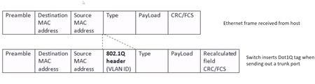

# ক্যাম্পাস নেটওয়ার্ক 
নেটওয়ার্ক ডিজাইন মডেলটি সাধারণত **অ্যাক্সেস লেয়ার**, **ডিস্ট্রিবিউশন লেয়ার**, এবং **কোর লেয়ার**-এ বিভক্ত করা হয়। এটি একটি **হায়ারারকিকাল নেটওয়ার্ক ডিজাইন মডেল** যা ক্যাম্পাস নেটওয়ার্কে (CAN) বা বড় প্রতিষ্ঠানের নেটওয়ার্ক ডিজাইন করার জন্য ব্যবহৃত হয়। এই মডেলটি নেটওয়ার্ককে **স্কেলেবিলিটি**, **বিশ্বস্ততা**, এবং **ম্যানেজেবিলিটি** নিশ্চিত করার জন্য ডিজাইন করা হয়েছে।

এখানে তিনটি লেয়ারের বিস্তারিত ব্যাখ্যা:

### 1. **অ্যাক্সেস লেয়ার (Access Layer)**
   - **ফাংশন:** 
     - অ্যাক্সেস লেয়ার হল সেই স্থান যেখানে **এন্ড ডিভাইস** (যেমন ডেস্কটপ, প্রিন্টার, ফোন) নেটওয়ার্কের সাথে সংযুক্ত হয়।
     - এটি **ইউজারের অ্যাক্সেস** পরিচালনা করে এবং ব্যবহারকারীর ডিভাইসগুলিকে নেটওয়ার্কের অন্যান্য অংশের সাথে সংযোগ করার সুযোগ দেয়।
     - এই লেয়ারটি নেটওয়ার্কে **এন্ড ডিভাইস**-এর জন্য **নেটওয়ার্ক অ্যাক্সেস** সরবরাহ করে।
   - **ডিভাইস:**
     - **অ্যাক্সেস সুইচ**: এটি ব্যবহারকারীর ডিভাইসগুলিকে নেটওয়ার্কে সংযুক্ত করার জন্য ব্যবহৃত হয়।
     - **ওয়্যারলেস অ্যাক্সেস পয়েন্ট (WAP)**: ওয়্যারলেস ডিভাইসের জন্য।
     - **নিরাপত্তা বৈশিষ্ট্য**: এই লেয়ারে **পোর্ট সিকিউরিটি**, **VLANs** এবং **QoS (Quality of Service)** এর মতো নিরাপত্তা বৈশিষ্ট্যগুলি ব্যবহৃত হতে পারে।
   - **উদাহরণ:**
     - একটি ভবনের বিভিন্ন তলায় অ্যাক্সেস সুইচগুলি এবং ব্যবহারকারীর ডিভাইস যেমন ডেস্কটপ কম্পিউটার এবং আইপি ফোন সংযুক্ত থাকা।

### 2. **ডিস্ট্রিবিউশন লেয়ার (Distribution Layer)**
   - **ফাংশন:**
     - ডিস্ট্রিবিউশন লেয়ার হল **অ্যাক্সেস লেয়ার** এবং **কোর লেয়ার** এর মধ্যে একটি **সংযুক্তি পয়েন্ট**। এটি নেটওয়ার্কের মধ্যে **পলিসি-ভিত্তিক সংযোগ** প্রদান করে।
     - এটি **রাউটিং**, **ট্রাফিক ম্যানেজমেন্ট**, এবং **ইন্টার-VLAN রাউটিং** এর মতো কাজ করে।
     - ডিস্ট্রিবিউশন লেয়ারটি **স্কেলেবিলিটি** এবং **রিডান্ডেন্সি** প্রদান করে।
   - **ডিভাইস:**
     - **ডিস্ট্রিবিউশন সুইচ**: এটি অ্যাক্সেস লেয়ার সুইচকে কোর লেয়ারের সাথে সংযুক্ত করে।
     - **রিডান্ডেন্ট জোড়া**: রিডান্ডেন্সি প্রদান করতে, ডিস্ট্রিবিউশন সুইচগুলি সাধারণত জোড়ায় মোতায়েন করা হয়।
     - **রাউটিং প্রোটোকল**: এই লেয়ারে রাউটিং কাজ চলে (ডায়নামিক বা স্ট্যাটিক)।
   - **উদাহরণ:**
     - একটি ডিস্ট্রিবিউশন সুইচ যা একাধিক অ্যাক্সেস লেয়ার সুইচের ট্রাফিক একত্রিত করে এবং কোর লেয়ারে রুট করে।

### 3. **কোর লেয়ার (Core Layer)**
   - **ফাংশন:**
     - কোর লেয়ার হল নেটওয়ার্কের **ব্যাকবোন** এবং এটি উচ্চ-গতির, নির্ভরযোগ্য এবং কার্যকরী ডেটা স্থানান্তর নিশ্চিত করে।
     - এটি **ডেটা ট্রান্সফার** দ্রুত এবং কার্যকরীভাবে পরিচালনা করে, বিশেষত দীর্ঘ দূরত্বে ক্যাম্পাসের বিভিন্ন অংশে।
     - কোর লেয়ারটি সাধারণত **কমপ্লেক্সিটি** থেকে মুক্ত থাকে এবং **দ্রুত ডেটা ফরওয়ার্ডিং** এর জন্য ডিজাইন করা হয়।
   - **ডিভাইস:**
     - **কোর সুইচ/রাউটার**: এটি ডিস্ট্রিবিউশন লেয়ার এবং নেটওয়ার্কের অন্যান্য অংশের মধ্যে উচ্চ-গতির সংযোগ প্রদান করে।
     - **রিডান্ডেন্সি**: কোর লেয়ারেও রিডান্ডেন্সি থাকে (যেমন **ডুয়াল-কোর সুইচ**), যা নিশ্চিত করে যে কোনো একক পয়েন্টে ব্যর্থতার কারণে নেটওয়ার্কে সমস্যা না হয়।
   - **উদাহরণ:**
     - উচ্চ-গতির সুইচ বা রাউটার যা ডিস্ট্রিবিউশন লেয়ারের ডিভাইসগুলির মধ্যে দ্রুত ডেটা স্থানান্তর নিশ্চিত করে।

---

### একটি সাধারণ নেটওয়ার্ক মডেল:
একটি সাধারণ হায়ারারকিকাল নেটওয়ার্ক ডিজাইন এরকম দেখাবে:

```pgsql
+----------------------------------+
|          কোর লেয়ার             |
|   (হাই-স্পিড ব্যাকবোন সুইচ)     |
+----------------------------------+
                ^
                |
+----------------------------------+
|     ডিস্ট্রিবিউশন লেয়ার         |
|   (অ্যাগ্রিগেশন ও রাউটিং সুইচ)  |
+----------------------------------+
                ^
                |
+----------------------------------+
|          অ্যাক্সেস লেয়ার        |
| (এন্ড-ইউজার সুইচ ও ডিভাইস)      |
+----------------------------------+
```

### গুরুত্বপূর্ণ পয়েন্ট:
- **স্কেলেবিলিটি**: প্রতিটি লেয়ার আলাদা ভাবে স্কেল করা যেতে পারে। যেমন, অ্যাক্সেস লেয়ারে আরও সুইচ যোগ করা যেতে পারে যদি ব্যবহারকারীর সংখ্যা বাড়ে।
- **রিডান্ডেন্সি**: ডিস্ট্রিবিউশন এবং কোর লেয়ারগুলি সাধারণত **রিডান্ডেন্ট জোড়ায়** মোতায়েন করা হয় যাতে কোনো ব্যর্থতার ক্ষেত্রে নেটওয়ার্কের কার্যক্রম অব্যাহত থাকে।
- **পারফরম্যান্স**: কোর লেয়ারটি **উচ্চ-গতির ডেটা স্থানান্তর** নিশ্চিত করার জন্য ডিজাইন করা হয়েছে, যখন ডিস্ট্রিবিউশন লেয়ার **রাউটিং** এবং **নীতি** প্রয়োগের কাজ করে।

এই মডেলটি বড় ক্যাম্পাস বা অফিস নেটওয়ার্ক ডিজাইন করার জন্য একটি মৌলিক কাঠামো প্রদান করে।
**3-লেয়ার আর্কিটেকচার** একটি জনপ্রিয় নেটওয়ার্ক ডিজাইন মডেল যা কম্পিউটার নেটওয়ার্কিংয়ে ব্যবহৃত হয়, বিশেষ করে বড় আকারের নেটওয়ার্ক যেমন ডেটা সেন্টার, এন্টারপ্রাইজ নেটওয়ার্ক, এবং ক্যাম্পাস LAN-এ। এটি নেটওয়ার্কটিকে তিনটি পৃথক লেয়ারে ভাগ করে: **অ্যাক্সেস লেয়ার**, **ডিস্ট্রিবিউশন লেয়ার**, এবং **কোর লেয়ার**। প্রতিটি লেয়ারের একটি নির্দিষ্ট ভূমিকা রয়েছে এবং এটি নেটওয়ার্কের ডিজাইন, ব্যবস্থাপনা এবং স্কেলেবিলিটি সহজ করে তোলে।


### ৩টি লেয়ারের সংক্ষিপ্ত বিবরণ:

1. **অ্যাক্সেস লেয়ার (Access Layer):**
   - **উদ্দেশ্য**: অ্যাক্সেস লেয়ারটি **এন্ড ডিভাইস** (যেমন কম্পিউটার, ফোন, প্রিন্টার) কে নেটওয়ার্কের সাথে সংযুক্ত করার জন্য দায়ী।
   - **মূল কার্যাবলী**:
     - **ইউজার ডিভাইস কানেক্টিভিটি**: ডিভাইসগুলো যেমন ডেস্কটপ, আইপি ফোন, এবং ওয়্যারলেস এক্সেস পয়েন্ট (WAP) নেটওয়ার্কে সংযুক্ত হয়।
     - **ট্রাফিক ফরওয়ার্ডিং**: একই নেটওয়ার্কের মধ্যে এন্ড ডিভাইসের মধ্যে ট্রাফিক ফরওয়ার্ডিং।
     - **নেটওয়ার্ক অ্যাক্সেস কন্ট্রোল**: **পোর্ট সিকিউরিটি**, **VLANs**, এবং **এ্যাক্সেস কন্ট্রোল লিস্ট (ACLs)**-এর মাধ্যমে নিরাপত্তা এবং অ্যাক্সেস নিয়ন্ত্রণ।
     - **কোয়ালিটি অফ সার্ভিস (QoS)**: ক্রিটিকাল অ্যাপ্লিকেশন (যেমন ভয়েস বা ভিডিও) জন্য যথাযথ ব্যান্ডউইথ বরাদ্দ নিশ্চিত করা।
   - **ডিভাইসসমূহ**: সুইচ, ওয়্যারলেস অ্যাক্সেস পয়েন্ট (WAP), এবং অন্যান্য এজ ডিভাইস।
   
   - **উদাহরণ**: 
     - একটি **সুইচ** যা অফিসে কর্মচারীদের কম্পিউটারগুলো সংযুক্ত করে অথবা একটি **ওয়াই-ফাই এক্সেস পয়েন্ট** যা ব্যবহারকারীদের ওয়্যারলেসভাবে সংযুক্ত হতে দেয়।

2. **ডিস্ট্রিবিউশন লেয়ার (Distribution Layer):**
   - **উদ্দেশ্য**: ডিস্ট্রিবিউশন লেয়ারটি অ্যাক্সেস লেয়ার এবং কোর লেয়ারের মধ্যে একটি মধ্যবর্তী স্তর হিসেবে কাজ করে। এটি **অ্যাক্সেস লেয়ার থেকে ট্রাফিক সংগ্রহ** এবং কোর লেয়ারে পাঠানোর জন্য দায়ী।
   - **মূল কার্যাবলী**:
     - **রাউটিং এবং সুইচিং**: এই লেয়ারটি বিভিন্ন **VLAN** বা **সাবনেট** এর মধ্যে রাউটিং পরিচালনা করে। এটি সাধারণত **লেয়ার 3 (রাউটিং)** ডিভাইস যেমন রাউটার বা মাল্টি-লেয়ার সুইচ ব্যবহার করে।
     - **নীতি প্রয়োগ**: **কোয়ালিটি অফ সার্ভিস (QoS)**, **নিরাপত্তা**, এবং **লোড ব্যালান্সিং** এর মতো নেটওয়ার্ক নীতি প্রয়োগ করা হয়।
     - **রেডান্ডেন্সি**: অ্যাক্সেস এবং কোর লেয়ারের মধ্যে যোগাযোগের জন্য **রেডান্ডেন্ট** ডিভাইস সরবরাহ করা হয়, যাতে কোনও ডিভাইস ব্যর্থ হলে নেটওয়ার্ক চালু থাকে।
     - **ট্রাফিক সংগ্রহ**: অ্যাক্সেস লেয়ারের ট্রাফিক সংগ্রহ করে কোর লেয়ারে পাঠানো হয়।
   - **ডিভাইসসমূহ**: মাল্টি-লেয়ার সুইচ, রাউটার, বা ডিস্ট্রিবিউশন সুইচ।
   
   - **উদাহরণ**:
     - একটি **রাউটার** যা ইন্টার-ভিএলএএন রাউটিং সম্পাদন করে অথবা একটি **ডিস্ট্রিবিউশন সুইচ** যা একাধিক অ্যাক্সেস সুইচকে কোর লেয়ারে সংযুক্ত করে।

3. **কোর লেয়ার (Core Layer):**
   - **উদ্দেশ্য**: কোর লেয়ার নেটওয়ার্কের **ব্যাকবোন** হিসেবে কাজ করে এবং দ্রুত, কম লেটেন্সি সহ ট্রাফিক ফরওয়ার্ডিং প্রদান করে।
   - **মূল কার্যাবলী**:
     - **হাই-স্পিড ডেটা ট্রান্সপোর্ট**: কোর লেয়ারটি দ্রুত এবং দক্ষভাবে ট্রাফিক ফরওয়ার্ডিংয়ের জন্য ডিজাইন করা হয়, যাতে লেটেন্সি কম থাকে এবং থ্রুপুট বেশি হয়।
     - **নেটওয়ার্ক ব্যাকবোন**: এটি বিভিন্ন **ডিস্ট্রিবিউশন লেয়ার** এবং অন্য নেটওয়ার্ক (যেমন ইন্টারনেট বা অন্যান্য ডেটা সেন্টার) এর সাথে সংযুক্ত করে।
     - **রেডান্ডেন্সি এবং রিসাইলিয়েন্স**: কোর লেয়ারের সুইচগুলো সাধারণত **রেডান্ডেন্ট পেয়ার**-এ স্থাপন করা হয়, যাতে কোনও একটি সুইচ ব্যর্থ হলেও নেটওয়ার্ক চালু থাকে।
     - **ন্যূনতম প্রক্রিয়াকরণ**: কোর লেয়ার সাধারণত কমপ্লেক্স প্রক্রিয়া করেনা, শুধুমাত্র দ্রুত ডেটা ফরওয়ার্ড করে।
   - **ডিভাইসসমূহ**: উচ্চ পারফরম্যান্স, উচ্চ ধারণক্ষমতা সম্পন্ন সুইচ এবং রাউটার।

   - **উদাহরণ**:
     - একটি **হাই-স্পিড রাউটার** যা নেটওয়ার্কের বিভিন্ন অংশের মধ্যে সংযোগ স্থাপন করে অথবা একটি **কোর সুইচ** যা একাধিক ডিস্ট্রিবিউশন সুইচের মধ্যে সংযোগ স্থাপন করে।

### ৩-লেয়ার আর্কিটেকচারের ডায়াগ্রাম:

```
+------------------+         +--------------------+         +------------------+
|     অ্যাক্সেস     |         |   ডিস্ট্রিবিউশন    |         |      কোর        |
|     লেয়ার       |         |   লেয়ার           |         |      লেয়ার     |
| (এন্ড ডিভাইস     |         | (এগ্রিগেশন ও       |         | (ব্যাকবোন ও      |
|  কানেক্টিভিটি)   |         |  রাউটিং লেয়ার)    |         |  হাই-স্পিড      |
|                  |         |                    |         |  ফরওয়ার্ডিং)   |
+------------------+         +--------------------+         +------------------+
        |                           |                           |
        |                           |                           |
+------------------+       +--------------------+       +------------------+
| অ্যাক্সেস সুইচ   |-------| ডিস্ট্রিবিউশন সুইচ |-------| কোর সুইচ        |
+------------------+       +--------------------+       +------------------+
        |                           |                           |
   এন্ড ডিভাইসসমূহ              এগ্রিগেটেড ট্রাফিক            হাই-স্পিড ব্যাকবোন
```

### প্রতিটি লেয়ারের সংক্ষিপ্ত বিবরণ:

| লেয়ার              | উদ্দেশ্য                                      | ব্যবহৃত ডিভাইসসমূহ                     | কার্যাবলী                                                  |
|---------------------|-----------------------------------------------|----------------------------------------|------------------------------------------------------------|
| **অ্যাক্সেস লেয়ার** | এন্ড ডিভাইসকে সংযুক্ত করা।                    | অ্যাক্সেস সুইচ, ওয়্যারলেস অ্যাক্সেস পয়েন্ট (WAP), ইত্যাদি। | এন্ড ডিভাইস সংযোগ, নেটওয়ার্ক অ্যাক্সেস কন্ট্রোল, QoS নীতি  |
| **ডিস্ট্রিবিউশন লেয়ার** | ট্রাফিক সংগ্রহ এবং VLAN-এর মধ্যে রাউটিং করা।  | মাল্টি-লেয়ার সুইচ, রাউটার              | রাউটিং, ট্রাফিক সংগ্রহ, নীতি প্রয়োগ, রেডান্ডেন্সি          |
| **কোর লেয়ার**      | দ্রুত ডেটা ফরওয়ার্ডিং এবং নেটওয়ার্ক ব্যাকবোন। | হাই-ক্যাপাসিটি সুইচ, রাউটার            | হাই-স্পিড ডেটা ফরওয়ার্ডিং, নেটওয়ার্ক ব্যাকবোন, প্রক্রিয়াকরণ কম|

### ৩-লেয়ার আর্কিটেকচারের সুবিধা:

1. **মডুলারিটি এবং স্কেলেবিলিটি**:
   - প্রতিটি লেয়ার আলাদাভাবে স্কেল করা যায়, যেমন অ্যাক্সেস লেয়ারের সুইচ বাড়ানো যায় যখন ব্যবহারকারী ডিভাইস বাড়ে বা কোর লেয়ারের সুইচ বাড়ানো যায় যখন ট্রাফিক বৃদ্ধি পায়।

2. **রেডান্ডেন্সি এবং রিসাইলিয়েন্স**:
   - ডিস্ট্রিবিউশন এবং কোর লেয়ারে **রেডান্ডেন্সি** অন্তর্ভুক্ত থাকে, যা একক ব্যর্থতার ঝুঁকি কমিয়ে দেয়।

3. **সহজ ব্যবস্থাপনা**:
   - তিনটি লেয়ারের স্পষ্ট বিভাজন নেটওয়ার্কের পরিচালনা এবং সমস্যা সমাধান সহজ করে তোলে, কারণ প্রতিটি লেয়ার নির্দিষ্ট কার্যাবলী করে।

4. **ভাল নেটওয়ার্ক সেগমেন্টেশন**:
   - নেটওয়ার্কের সেগমেন্টেশন ভালভাবে করা যায়, যা নিরাপত্তা এবং কার্যক্ষমতা বৃদ্ধির জন্য গুরুত্বপূর্ণ।

### সম্ভাব্য অসুবিধা:
- **খরচ**: মাল্টি-লেয়ার ডিজাইন বাস্তবায়ন করতে বেশ কিছু ডিভাইস প্রয়োজন, যা খরচ বাড়াতে পারে।
- **জটিলতা**: যদিও ৩-লেয়ার আর্কিটেকচার নেটওয়ার্ক ডিজাইনকে সহজ করে, তবে এটি ঠিকভাবে কনফিগার ও পরিচালনা করতে কিছু জটিলতা সৃষ্টি করতে পারে।

### উপসংহার:
**৩-লেয়ার আর্কিটেকচার** একটি প্রতিষ্ঠিত এবং কার্যকর নেটওয়ার্ক ডিজাইন মডেল যা **বড় নেটওয়ার্ক** এর জন্য উপযুক্ত। এটি নেটওয়ার্কটিকে তিনটি লেয়ারে ভাগ করে, যা **এন্ড ডিভাইস সংযোগ**, **রাউটিং ও নীতি প্রয়োগ**, এবং **দ্রুত ডেটা ফরওয়ার্ডিং** এর জন্য স্পষ্টভাবে বিভক্ত। এটি **স্কেলেবিলিটি**, **রেডান্ডেন্সি**, এবং **হাই পারফরম্যান্স** সরবরাহ করে, এবং **এন্টারপ্রাইজ নেটওয়ার্ক** এবং **ক্যাম্পাস এনভায়রনমেন্ট** এর মতো বড় আকারের ডিপ্লয়মেন্টে উপযোগী।
# স্পাইন-লিফ আর্কিটেকচার
**স্পাইন-লিফ আর্কিটেকচার** (Spine-Leaf Architecture) একটি আধুনিক নেটওয়ার্ক ডিজাইন মডেল যা মূলত ডেটা সেন্টার এবং বড় স্কেল নেটওয়ার্কের জন্য ব্যবহৃত হয়। এটি একটি **ফ্ল্যাট, হাইপারস্কেল নেটওয়ার্ক** তৈরি করতে ব্যবহৃত হয়, যেখানে **স্পাইন** এবং **লিফ** নামক দুটি প্রধান স্তর থাকে।


### স্পাইন-লিফ আর্কিটেকচারের মূল উপাদান:

1. **স্পাইন লেয়ার**:
   - স্পাইন লেয়ার হল নেটওয়ার্কের **কোর স্তর**। এটি একটি **হাই-স্পিড ব্যাকবোন** হিসেবে কাজ করে যা লিফ সুইচগুলোর মধ্যে যোগাযোগ স্থাপন করে।
   - স্পাইন লেয়ারে সাধারণত **হাই-ক্যাপাসিটি, লেয়ার 3 সুইচ** বা রাউটার ব্যবহার করা হয়।
   - স্পাইন সুইচগুলি লিফ সুইচের সাথে **শুধুমাত্র একদিকে সংযুক্ত থাকে**, অর্থাৎ প্রতিটি লিফ সুইচ স্পাইন সুইচের সাথে সরাসরি সংযুক্ত থাকে, কিন্তু স্পাইন সুইচ একে অপরের সাথে সংযুক্ত হয় না।

2. **লিফ লেয়ার**:
   - লিফ লেয়ার হল **এ্যাক্সেস লেয়ার**, যেখানে ডিভাইসগুলো (যেমন সার্ভার, স্টোরেজ, ইত্যাদি) নেটওয়ার্কের সাথে সংযুক্ত হয়।
   - লিফ সুইচগুলি **স্পাইন সুইচের সাথে সংযুক্ত** এবং **এন্ড-ডিভাইস** (যেমন সার্ভার) এর সাথে সংযোগ স্থাপন করে।
   - লিফ সুইচগুলি নেটওয়ার্কের মধ্যে ট্রাফিক ফরওয়ার্ডিং এবং রাউটিং সম্পর্কিত কাজগুলি সম্পাদন করে, তবে তারা সাধারণত স্পাইন সুইচের মাধ্যমে একে অপরের সাথে যোগাযোগ করে।

### স্পাইন-লিফ আর্কিটেকচারের কাজের পদ্ধতি:

1. **ডেটা ট্রান্সমিশন**: 
   - ডিভাইসগুলো (যেমন সার্ভার) যখন একে অপরের সাথে যোগাযোগ করতে চায়, তারা প্রথমে লিফ সুইচের মাধ্যমে যোগাযোগ করে। 
   - তারপর লিফ সুইচটি **স্পাইন সুইচ** এর মাধ্যমে অন্য লিফ সুইচে ট্রাফিক রাউট করে। 
   - একটি গুরুত্বপূর্ণ বিষয় হল, **স্পাইন সুইচগুলি শুধুমাত্র লিফ সুইচগুলোর সাথে সংযুক্ত থাকে**, তারা একে অপরের সাথে সংযুক্ত হয় না, যা নেটওয়ার্ককে আরও সোজা এবং স্কেলেবল করে।

2. **স্কেলেবিলিটি**: 
   - স্পাইন-লিফ আর্কিটেকচার **অ্যাডিশনাল লিফ এবং স্পাইন সুইচ** যোগ করার মাধ্যমে সহজেই স্কেল করা যায়, যা নেটওয়ার্কের ব্যান্ডউইথ এবং দক্ষতা বাড়ায়।
   - নতুন সার্ভার বা ডিভাইস সংযুক্ত করতে, শুধু লিফ লেয়ারে নতুন সুইচ যোগ করতে হয়, যা স্কেলেবিলিটি সহজ করে তোলে।

3. **লো লেটেন্সি**: 
   - স্পাইন-লিফ আর্কিটেকচারে, একটি লিফ সুইচ থেকে অন্য লিফ সুইচে যোগাযোগ করার সময়, ট্রাফিক সাধারণত **একটি হপ** (একটি সুইচ পাস) এর মধ্যে চলে, ফলে লেটেন্সি কম হয় এবং ডেটা দ্রুত পৌঁছায়।

### স্পাইন-লিফ আর্কিটেকচারের সুবিধা:

1. **উচ্চ পারফরম্যান্স**: 
   - স্পাইন লেয়ারের উচ্চ স্পিড ট্রান্সপোর্ট ক্ষমতা নিশ্চিত করে যে ডেটা দ্রুত এবং দক্ষতার সাথে স্থানান্তরিত হয়।

2. **স্কেলেবিলিটি**: 
   - সহজেই অতিরিক্ত লিফ সুইচ এবং স্পাইন সুইচ যোগ করে নেটওয়ার্কের আকার বাড়ানো যায়, যা বড় আকারের ডেটা সেন্টার এবং ক্যাম্পাস নেটওয়ার্কে গুরুত্বপূর্ণ।

3. **লো লেটেন্সি**: 
   - ট্রাফিক কম হপে স্পাইন সুইচের মাধ্যমে ফরওয়ার্ড হয়, ফলে কম লেটেন্সি এবং দ্রুত ডেটা ট্রান্সমিশন হয়।

4. **ফ্ল্যাট নেটওয়ার্ক**: 
   - এই ডিজাইনটি একটি ফ্ল্যাট নেটওয়ার্ক তৈরি করে, যেখানে কমপ্লেক্স রাউটিং এবং সুইচিং সমস্যাগুলি কম থাকে এবং নেটওয়ার্কটি সহজে পরিচালনা করা যায়।

5. **রেডান্ডেন্সি**: 
   - স্পাইন-লিফ আর্কিটেকচারে, **স্পাইন সুইচগুলি রেডান্ডেন্ট পেয়ারে** ব্যবহার করা হয়, যাতে কোনো এক সুইচ ব্যর্থ হলেও নেটওয়ার্কের যোগাযোগ বজায় থাকে।

### স্পাইন-লিফ আর্কিটেকচারের ডায়াগ্রাম:

```
+--------------------+       +--------------------+
|      লিফ সুইচ     |-------|      লিফ সুইচ     |
|  (সার্ভার/ডিভাইস) |       |  (সার্ভার/ডিভাইস) |
+--------------------+       +--------------------+
          |                         |
          |                         |
          |-------------------------|
          |                         |
    +--------------------+   +--------------------+
    |      স্পাইন সুইচ   |---|      স্পাইন সুইচ   |
    |  (হাই-স্পিড ব্যাকবোন)|   |  (হাই-স্পিড ব্যাকবোন)|
    +--------------------+   +--------------------+
```

### স্পাইন-লিফ আর্কিটেকচারের চ্যালেঞ্জ:

1. **ব্যয়**: 
   - অধিক স্পাইন সুইচ এবং লিফ সুইচ ব্যবহার করার জন্য প্রয়োজনীয় **যন্ত্রপাতি** এবং **স্টাফিং** খরচ বেড়ে যেতে পারে।
   
2. **কনফিগারেশন এবং মেইনটেনেন্স**: 
   - যদিও ডিজাইনটি সহজ, তবে **কনফিগারেশন** এবং **ম্যানেজমেন্ট** কিছুটা চ্যালেঞ্জিং হতে পারে, বিশেষ করে যখন নেটওয়ার্ক স্কেল বড় হয়।
   
3. **কেবেলিং এবং স্পেস**:
   - অনেক লিফ এবং স্পাইন সুইচ থাকতে পারে, যা **কেবেলিং এবং ফিজিক্যাল স্পেস**-এর জন্য সমস্যা তৈরি করতে পারে, বিশেষ করে বড় ডেটা সেন্টারে।

### উপসংহার:

**স্পাইন-লিফ আর্কিটেকচার** একটি **অত্যন্ত স্কেলেবল এবং কার্যকরী ডিজাইন** যা ডেটা সেন্টার এবং বড় নেটওয়ার্কের জন্য আদর্শ। এটি **লো লেটেন্সি**, **হাই পারফরম্যান্স**, এবং **সহজ স্কেলিং** প্রদান করে, যা সমসাময়িক নেটওয়ার্ক ডিজাইনে গুরুত্বপূর্ণ। যদিও এর খরচ এবং কনফিগারেশন কিছুটা চ্যালেঞ্জিং হতে পারে, তবে এটি ডেটা সেন্টার বা ক্যাম্পাস নেটওয়ার্কের জন্য একটি অত্যন্ত কার্যকর সমাধান।

# VLAN
**VLAN (Virtual Local Area Network)** হলো একটি ভার্চুয়াল নেটওয়ার্ক যা একাধিক পিসি বা ডিভাইসকে একই ফিজিক্যাল নেটওয়ার্কে হলেও আলাদা আলাদা নেটওয়ার্ক হিসেবে কাজ করতে সক্ষম করে। VLAN এর মাধ্যমে, একাধিক সাবনেটের মধ্যে ট্রাফিক ভাগ করা যায় এবং এটি ক্যাম্পাস, অফিস, বা বড় নেটওয়ার্কে নিরাপত্তা এবং পারফরম্যান্স উন্নত করতে সাহায্য করে। এখানে VLAN এর কিছু মূল বৈশিষ্ট্য এবং তা কিভাবে কাজ করে তা বিস্তারিতভাবে আলোচনা করা হলো:

**VLAN Access Port** একটি সুইচ পোর্ট যা শুধুমাত্র একটি নির্দিষ্ট VLAN (Virtual Local Area Network) এর জন্য কাজ করে। এটি সাধারনত **এন্ড ডিভাইস** (যেমন কম্পিউটার, প্রিন্টার, টেলিফোন) সংযোগ করতে ব্যবহৃত হয়। যখন একটি পোর্টকে **VLAN Access Port** হিসেবে কনফিগার করা হয়, তখন ওই পোর্টের মাধ্যমে যে ডেটা ট্রান্সফার হয়, তা শুধুমাত্র নির্দিষ্ট VLAN এর অংশ হয় এবং অন্য VLAN এর ট্রাফিক এড়িয়ে যায়।

### VLAN Access Port এর বৈশিষ্ট্য:
1. **একটি VLAN এর সদস্য:** Access port সাধারণত শুধুমাত্র একটি নির্দিষ্ট VLAN এর অংশ হয়ে থাকে। উদাহরণস্বরূপ, একটি পোর্ট VLAN 10 এর সদস্য হলে, সেই পোর্টের মাধ্যমে কেবল VLAN 10 এর ডেটা ট্রান্সফার হবে।
   
2. **VLAN Tagging নয়:** Access port এর মাধ্যমে যে ডেটা চলে, তা **tagging** করা থাকে না। অর্থাৎ, একটিমাত্র VLAN এর ডেটা ছাড়া অন্য কোনো VLAN এর ডেটা এই পোর্ট দিয়ে পাস করতে পারে না।

3. **End Device-দের সংযোগ:** Access port সাধারনত ব্যবহার করা হয় কম্পিউটার, প্রিন্টার, বা অন্যান্য ডিভাইস সংযুক্ত করতে। এটি ব্যবহারকারীর শেষের ডিভাইস (End Device) এবং সুইচের মধ্যে সংযোগ স্থাপন করে।

### কিভাবে কনফিগার করা হয়:
Cisco সুইচে VLAN Access Port কনফিগার করার জন্য সাধারণত এই কমান্ডগুলো ব্যবহার করা হয়:

```bash
Switch(config)# interface fastEthernet 0/1
Switch(config-if)# switchport mode access
Switch(config-if)# switchport access vlan 10
```

এখানে:
- **`switchport mode access`**: পোর্টটিকে access মোডে সেট করে।
- **`switchport access vlan 10`**: এই পোর্টটিকে VLAN 10 এর জন্য নির্ধারণ করে।

### ব্যবহার:
- **VLAN Access Port** ব্যবহৃত হয় যখন কোনো ডিভাইস (যেমন, কম্পিউটার বা প্রিন্টার) শুধুমাত্র একটি নির্দিষ্ট VLAN এর অংশ হতে হবে এবং একাধিক VLAN এর ট্রাফিকের সাথে মিশে না যায়।
- এটি সাধারণত **এন্ড-টু-এন্ড ডিভাইস** এর জন্য ব্যবহৃত হয়, যেখানে একাধিক VLAN-এর ট্রাফিক ট্রান্সফার করার প্রয়োজন নেই।

এভাবে, **VLAN Access Port** এর মাধ্যমে নির্দিষ্ট VLAN এর ট্রাফিকের জন্য একটি সুরক্ষিত এবং সহজ সংযোগ প্রদান করা হয়।

### 1. **VLAN কনফিগারেশন:**
   - একটি VLAN সাধারণত সুইচ পোর্টের মাধ্যমে কনফিগার করা হয়।
   - প্রতিটি VLAN এর একটি ইউনিক আইডি (VLAN ID) থাকে, যা **১ থেকে ৪০৯৫৯** পর্যন্ত হতে পারে।
   - প্রতিটি পোর্ট একটি নির্দিষ্ট VLAN-এ নির্ধারিত থাকে। এই পোর্টে সংযুক্ত ডিভাইস বা হোস্টগুলো একই VLAN এর আওতায় থাকবে।
   
### 2. **VLAN এর সুবিধা:**
   - **ব্রডকাস্ট ডোমেন ভাগ করা:** VLAN ব্যবহার করে একটি বড় নেটওয়ার্ককে ছোট ছোট ব্রডকাস্ট ডোমেনে ভাগ করা যায়, যার ফলে ব্রডকাস্ট ট্র্যাফিক কমে যায়।
   - **নিরাপত্তা:** এক VLAN-এর মধ্যে থাকা ডিভাইসগুলোর মধ্যে শুধুমাত্র ডেটা ট্রান্সফার হয়। অন্য VLAN এর ডিভাইসের সাথে কোনো যোগাযোগ সম্ভব হয় না, যতক্ষণ না সেগুলি রাউটারের মাধ্যমে সংযুক্ত না হয়।
   - **নেটওয়ার্ক পারফরম্যান্স উন্নত করা:** একাধিক VLAN ব্যবহার করে নেটওয়ার্কের পারফরম্যান্স এবং প্রাচুর্যতা বৃদ্ধি পায়, কারণ ট্র্যাফিক আলাদা VLAN গুলির মধ্যে ভাগ করা যায়।

### 3. **VLAN টাইপস:**
   - **ডাটা VLAN:** এই VLAN ডেটা ট্র্যাফিক সরবরাহের জন্য ব্যবহৃত হয়। সাধারণত, এটি ব্যবহারকারীর পিসি বা সার্ভারের সাথে সংযুক্ত থাকে।
   - **ভয়েস VLAN:** এই VLAN শুধু ভয়েস ট্র্যাফিক (VoIP) এর জন্য ব্যবহৃত হয়। এটি কলের গুণমান এবং নির্ভরযোগ্যতা নিশ্চিত করতে সহায়ক।
   - **ম্যানেজমেন্ট VLAN:** এটি নেটওয়ার্ক ডিভাইসগুলোর পরিচালনা এবং কনফিগারেশনের জন্য ব্যবহৃত হয়। যেমন, সুইচ বা রাউটারের জন্য ব্যবহৃত VLAN।
   - **ডিফল্ট VLAN (VLAN 1):** সাধারণত, একটি সুইচের সমস্ত পোর্ট ডিফল্টভাবে VLAN 1-এ থাকে, তবে সাধারণত নিরাপত্তার কারণে এটি পরিবর্তন করা হয়।

### 4. **VLAN কনফিগারেশন:**
   - **VLAN তৈরি করা:** VLAN তৈরি করতে আপনাকে ‘vlan <vlan_number>’ কমান্ডটি ব্যবহার করতে হবে।
   - **পোর্টে VLAN অ্যাসাইন করা:** প্রতিটি সুইচ পোর্টের জন্য VLAN অ্যাসাইন করতে হবে। যেমন, 'interface FastEthernet0/1' এবং তারপর 'switchport access vlan <vlan_number>' কমান্ডটি ব্যবহার করা হয়।
   - **VLAN নামকরণ:** VLAN তৈরি করার সময় আপনি একটি নামও দিতে পারেন, যেমন ‘vlan 10’ এবং ‘name Sales’।

### 5. **VLAN এবং রাউটার:**
   - VLAN গুলি একে অপরের মধ্যে যোগাযোগ করতে সক্ষম নয়, যদি না তাদের মধ্যে রাউটার ব্যবহার করা হয়।
   - এই জন্য, VLAN গুলির মধ্যে যোগাযোগের জন্য একটি রাউটার বা **Router-on-a-Stick** কনফিগারেশন প্রয়োজন। এই কনফিগারেশনে, রাউটারটি একাধিক VLAN-এর মধ্যে ট্র্যাফিক ফরওয়ার্ড করার জন্য একটি ইন্টারফেস ব্যবহার করে।

### 6. **VLAN Trunking:**
   - যখন একাধিক VLAN এর মধ্যে ট্রাফিক পাঠানো হয়, তখন আপনাকে **trunk ports** কনফিগার করতে হবে। Trunk পোর্টগুলি একাধিক VLAN এর ট্র্যাফিক একসাথে ফরওয়ার্ড করতে সক্ষম।
   - ট্রাঙ্ক পোর্ট কনফিগার করতে, 'switchport mode trunk' কমান্ড ব্যবহার করা হয়। 

### 7. **VLAN এর উদাহরণ:**
   - একটি অফিসে দুটি বিভাগ থাকতে পারে: **Engineering** এবং **Sales**। আপনি এই দুটি বিভাগকে আলাদা VLAN-এ ভাগ করতে পারেন (যেমন VLAN 10 ইঞ্জিনিয়ারিংয়ের জন্য এবং VLAN 20 সেলসের জন্য)। এর ফলে, তারা একে অপরের সাথে সরাসরি যোগাযোগ করতে পারবে না, যা নিরাপত্তা উন্নত করতে সহায়ক।

VLAN নেটওয়ার্কিং ব্যবস্থার মধ্যে ব্যবহৃত একটি শক্তিশালী প্রযুক্তি, যা নিরাপত্তা, পারফরম্যান্স এবং ব্যবস্থাপনা সহজতর করতে সাহায্য করে।


- আমাদের ভার্চুয়াল লোকাল এরিয়া নেটওয়ার্কগুলি একটি লেয়ার 2 ফিচার যা আমাদের সুইচগুলিতে প্রয়োগ করা হয়।
- প্রথমে রাউটার অপারেশন দেখলে,
   - আপনি ইতিমধ্যেই জানেন যে রাউটারগুলি OSI স্ট্যাকের লেয়ার 3-এ কাজ করে। আলাদা IP সাবনেটে থাকা হোস্টগুলিকে একে অপরের সাথে যোগাযোগ করতে রাউটার ব্যবহার করে ট্রাফিক পাঠাতে হয়।
   - রাউটারের প্রধান কাজ হচ্ছে ভিন্ন ভিন্ন IP সাবনেটের মধ্যে ট্রাফিক রাউট করা।
   - রাউটার বা ফায়ারওয়ালে সিকিউরিটি রুল ব্যবহার করে খুব সহজে লেয়ার 3-এ বিভিন্ন IP সাবনেটের মধ্যে অনুমোদিত ট্রাফিক নিয়ন্ত্রণ করা যায়। উদাহরণস্বরূপ, ধরুন আপনার সমস্ত ইঞ্জিনিয়ারিং হোস্ট 10.10.10.0/24 সাবনেটে এবং একাউন্টিং হোস্ট 10.10.20.0/24 সাবনেটে রয়েছে।
   - আপনি খুব সহজেই রাউটার বা ফায়ারওয়ালে সিকিউরিটি রুল প্রয়োগ করতে পারেন, যাতে 10.10.10.0 সাবনেট থেকে 10.10.20.0 সাবনেটে ট্রাফিক ব্লক করা হয়, যদি আপনার ইঞ্জিনিয়ারিং হোস্টগুলি কখনই একাউন্টিং হোস্টগুলির সাথে কথা না বলে।
   - আপনি আসলে দেখতে পাবেন কিভাবে এই কনফিগারেশনটি পরে আমরা অ্যাক্সেস কন্ট্রোল লিস্ট সেকশনে সেট করতে পারি। রাউটারগুলি ডিফল্টভাবে ব্রডকাস্ট ট্রাফিক ফরওয়ার্ড করে না, তারা লেয়ার 3-এ নেটওয়ার্কগুলিকে ছোট ডোমেইনে ভাগ করে পারফরম্যান্স এবং নিরাপত্তা প্রদান করে।


- এখন সুইচ অপারেশনগুলো দেখা যাক, সুইচগুলি OSI স্ট্যাকের লেয়ার 2-এ কাজ করে এবং তারা ডিফল্টভাবে ব্রডকাস্ট ট্রাফিক ফরওয়ার্ড করে, রাউটারের বিপরীতে। তাই, ডিফল্টভাবে, একটি ক্যাম্পাস সুইচড নেটওয়ার্ক এক বড় ব্রডকাস্ট ডোমেইন হয়ে থাকে।
- আপনার সুইচগুলি ব্রডকাস্ট ট্রাফিক প্রতিটি জায়গায় ফ্লাড করে, এমনকি ভিন্ন IP সাবনেটের মধ্যেও, এবং এটি পারফরম্যান্স এবং নিরাপত্তার উদ্বেগ সৃষ্টি করে।
- যদি আপনি একটি লোকাল এরিয়া নেটওয়ার্ক (LAN) উদাহরণ দেখেন, তাহলে এখানে একটি সাধারণ LAN রয়েছে, যেখানে একটি সুইচ আছে এবং কিছু ইঞ্জিনিয়ারিং পিসি এবং কিছু সেলস পিসি সুইচের সাথে সংযুক্ত।
- ইঞ্জিনিয়ারিং এবং সেলস পিসিগুলি লেয়ার 3-এ আলাদা IP সাবনেটে রয়েছে, এবং তাদের মধ্যে ট্রাফিক রাউট করার জন্য একটি রাউটার রয়েছে।
- যদি আমরা একই IP সাবনেটে ইউনিকাস্ট ট্রাফিক পাঠাই, যেমন SALES PC2 (10.10.20.10) SALES PC1 (10.10.20.11) এর সাথে যোগাযোগ করতে চায়, তখন এটি সুইচে পৌঁছাবে এবং যতক্ষণ পর্যন্ত সুইচটি SALES PC1 এর MAC ঠিকানা শিখে না নেয়, সুইচটি শুধুমাত্র সেই পোর্টে ট্রাফিকটি পাঠাবে, যেখানে SALES PC1 সংযুক্ত।
- এটি পারফরম্যান্স এবং নিরাপত্তার জন্য খুবই ভালো, কারণ ট্রাফিকটি সঠিক জায়গায় যাচ্ছে।
- কিন্তু যদি আমরা ভিন্ন IP সাবনেটের মধ্যে ইউনিকাস্ট ট্রাফিক পাঠাই, যেমন সেলস পিসি একটি ইঞ্জিনিয়ারিং পিসির সাথে কথা বলতে চায়, তখন SALES PC2 ট্রাফিকটি পাঠাবে, যা সুইচে পৌঁছাবে।
- সুইচ তারপর ট্রাফিকটি রাউটারে পাঠাবে, কারণ গন্তব্য IP ঠিকানা ইঞ্জিনিয়ারিং পিসির, কিন্তু গন্তব্য MAC ঠিকানা SALES পিসির ডিফল্ট গেটওয়ে হবে।
- রাউটার তখন ট্রাফিকটি ইঞ্জিনিয়ারিং সাবনেটে রাউট করবে এবং এটি আবার সুইচে পাঠাবে।
- যদি সুইচটি ইতিমধ্যে ENG PC1 এর MAC ঠিকানা শিখে থাকে, তাহলে এটি সহজেই ট্রাফিকটি সেই পিসিতে পাঠাবে।
- তাই আপনি দেখতে পাবেন যে ইউনিকাস্ট ট্রাফিক, তা একই সাবনেটে হোক বা ভিন্ন সাবনেটে হোক, পারফরম্যান্স এবং নিরাপত্তার জন্য খুবই ভালো, কারণ ট্রাফিকটি সঠিক জায়গায় যাচ্ছে এবং আপনি খুব সহজেই রাউটারে সিকিউরিটি পলিসি প্রয়োগ করতে পারেন যাতে আপনার IP সাবনেটগুলির মধ্যে ট্রাফিক সীমিত করা যায়।
- যদি আমরা সেলস এবং ইঞ্জিনিয়ারিং সাবনেটের মধ্যে ট্রাফিক না চায়, তবে খুব সহজেই একটি রাউটার বা ফায়ারওয়ালে সিকিউরিটি পলিসি দিয়ে তা করতে পারি।
- তবে ব্রডকাস্ট ট্রাফিকের ক্ষেত্রে এটি ভিন্ন। এখন, আমাদের উদাহরণে, SALES PC2 কিছু ব্রডকাস্ট ট্রাফিক পাঠাবে, যেমন একটি ARP রিকোয়েস্ট, এবং এটি সুইচে পৌঁছাবে।
- সুইচ তখন ব্রডকাস্ট ট্রাফিক নিয়ে সমস্ত পোর্টে ফ্লাড করে, শুধুমাত্র সেই পোর্টটি বাদে, যেখানে ট্রাফিকটি এসেছে। ফলে ট্রাফিকটি সব জায়গায় পৌঁছে যায়, ইঞ্জিনিয়ারিং সাবনেট এবং সেলস সাবনেট উভয় ক্ষেত্রেই।
- এই কারণে সমস্যা সৃষ্টি হয়, কারণ এটি নিরাপত্তাকে প্রভাবিত করে, কারণ ট্রাফিকটি রাউটার বা ফায়ারওয়ালের লেয়ার 3 সিকিউরিটি পলিসি বাইপাস করে।
- হয়তো আমাদের রাউটারে এমন একটি সিকিউরিটি পলিসি ছিল, যা সেলস এবং ইঞ্জিনিয়ারিং পিসির মধ্যে ট্রাফিক ব্লক করছিল, কিন্তু যখন সেলস পিসি ব্রডকাস্ট ট্রাফিক পাঠায়, এটি সেই পলিসি বাইপাস করে এবং ইঞ্জিনিয়ারিং পিসিগুলিতে পৌঁছে যায়।
- যদি কেউ লেয়ার 2 আক্রমণ করে, এটি হবে এমন এক উপায় যার মাধ্যমে তারা আপনার সিকিউরিটি পলিসি বাইপাস করতে পারে।
- এটি পারফরম্যান্সকেও প্রভাবিত করে, কারণ প্রতিটি শেষ হোস্টকে ট্রাফিকটি প্রক্রিয়া করতে হয়, সব সেলস পিসি এবং সব ইঞ্জিনিয়ারিং পিসি থেকেও। এটি পারফরম্যান্সের ওপর প্রভাব ফেলে কারণ লিঙ্কে অতিরিক্ত ব্যান্ডউইথ ব্যবহার হয়, যেখানে ট্রাফিকের প্রয়োজন নেই।


এটি তুলে ধরার জন্য, আসুন আমরা একটু ভিন্ন নেটওয়ার্ক টপোলজি দেখি।
- এখানে একই সুইচটি মাঝখানে রয়েছে, যেখানে সেলস এবং ইঞ্জিনিয়ারিং পিসিগুলি সংযুক্ত, এবং সেই সুইচটি আরেকটি সুইচের সাথে সংযুক্ত রয়েছে, যা বিল্ডিংয়ের অন্য অংশে অবস্থিত এবং সেখানে একাউন্টিং পিসিগুলি প্লাগ ইন করা হয়েছে।
- আবার, যখন সেলস পিসি কিছু ব্রডকাস্ট ট্রাফিক পাঠায়, তখন এটি সুইচের সব পোর্টে ফ্লাড হয়ে যায়।
- এটি অন্য সুইচে পৌঁছায় এবং সেখানে সব পোর্টে ফ্লাড হয়ে যায়। ফলে, একাউন্টিং পিসিগুলির এবং সেই সুইচের লিঙ্কে, যেখানে একাউন্টিং পিসিগুলি সংযুক্ত, ট্রাফিকটি ফ্লাড হয়ে যায়, যখন আসলে সেখানে ট্রাফিক পাঠানোর কোন প্রয়োজন ছিল না।
- এই ছিল সমস্যা, এবং VLANs, আমাদের ভার্চুয়াল লোকাল এরিয়া নেটওয়ার্কগুলি তার সমাধান।
- আমরা আমাদের সুইচগুলিতে VLAN প্রয়োগ করে LAN এর পারফরম্যান্স এবং নিরাপত্তা বাড়াতে পারি।
- VLANs লেয়ার 2-এ LAN-কে আলাদা ব্রডকাস্ট ডোমেইনে ভাগ করে, তাই VLANs একটি লেয়ার 2 ফিচার যা আপনার সুইচে প্রয়োগ করা হয়।
- সাধারণত, একটি IP সাবনেট এবং একটি VLAN এর মধ্যে একে অপরের সাথে সম্পর্ক থাকে।
- তাহলে, একই নেটওয়ার্ক টপোলজি উদাহরণে, আমরা একটি ইঞ্জিনিয়ারিং VLAN এবং একটি সেলস VLAN সুইচে তৈরি করি।
- আমরা সমস্ত ইঞ্জিনিয়ারিং পিসি এবং ইঞ্জিনিয়ারিং সাবনেটের রাউটার ইন্টারফেসকে ইঞ্জিনিয়ারিং VLAN-এ রাখি, এবং সমস্ত সেলস পিসি এবং সেলস সাবনেটের রাউটার ইন্টারফেসকে সেলস VLAN-এ রাখি, এবং সুইচ শুধুমাত্র একই VLAN এর মধ্যে ট্রাফিক পাঠাতে দেয়।
- এখন কী হবে, দেখুন। একই IP সাবনেটে ইউনিকাস্ট ট্রাফিকের জন্য, আসলে এটি আগের মতোই হবে।
- সেলস PC2 কিছু ট্রাফিক পাঠাবে, যার গন্তব্য SALES PC1।
- এটি সুইচে পৌঁছাবে এবং সুইচটি ইতিমধ্যেই SALES PC1 এর MAC ঠিকানা শিখে নিয়েছে, তাই এটি ট্রাফিকটি সেই পোর্টে পাঠিয়ে দেবে।
- এটা আগের মতোই ছিল, কিন্তু ভিন্ন IP সাবনেটের মধ্যে ইউনিকাস্ট ট্রাফিকের ক্ষেত্রে কি হবে? সেলস PC2 এখন ইঞ্জিনিয়ারিং পিসির সাথে কিছু ট্রাফিক পাঠাবে, এটি সুইচে পৌঁছাবে।
- আপনি জানেন, আমি বলেছিলাম সুইচ শুধুমাত্র একই VLAN এর মধ্যে ট্রাফিক পাঠাতে দেয়? এখানে গন্তব্য MAC ঠিকানা সেলস পিসির ডিফল্ট গেটওয়ে হবে, যা সেলস VLAN-এ রয়েছে।
- তাই সুইচটি ট্রাফিকটি রাউটার পর্যন্ত পাঠাবে, শুধুমাত্র সেই পোর্টে, কারণ এটি এর MAC ঠিকানা আগে থেকেই শিখে নিয়েছে। রাউটার পরে ট্রাফিকটি ইঞ্জিনিয়ারিং VLAN-এ রাউট করবে এবং এটি ইঞ্জিনিয়ারিং ইন্টারফেসের মাধ্যমে পাঠাবে।
- এটি ইঞ্জিনিয়ারিং VLAN-এ সুইচে পৌঁছাবে এবং সুইচটি ট্রাফিকটি ইঞ্জিনিয়ারিং পিসির কাছে পাঠাবে। এটি করতে দেওয়া হচ্ছে কারণ এটি ইঞ্জিনিয়ারিং VLAN-এ রয়েছে।
- তাই ইউনিকাস্ট ট্রাফিকের জন্য, সেটা একই সাবনেটে হোক বা ভিন্ন সাবনেটে, এটি আসলে একইভাবে কাজ করবে, VLAN ব্যবহার করি বা না করি।
- যেখানে বড় পার্থক্য আসে এবং বড় উপকারিতা হয় তা হচ্ছে ব্রডকাস্ট ট্রাফিকের ক্ষেত্রে। এখন, SALES PC2 কিছু ব্রডকাস্ট ট্রাফিক পাঠাবে, যা সুইচে পৌঁছাবে এবং এটি সব পোর্টে ফ্লাড হবে, কিন্তু শুধুমাত্র সেই পোর্টগুলোতে যা একই VLAN-এ রয়েছে।
- তাই এটি সমস্ত সেলস পিসি এবং সেলস রাউটার ইন্টারফেসে পৌঁছাবে, কিন্তু এটি কোনো ইঞ্জিনিয়ারিং পিসিতে পৌঁছাবে না, অর্থাৎ ট্রাফিকটি শুধুমাত্র যেখানে প্রয়োজন সেখানে ফ্লাড হবে।
- এটি নিরাপত্তা এবং পারফরম্যান্স উন্নত করে।

 # VLAN অ্যাক্সেস পোর্ট 
 আমাদের অ্যাক্সেস পোর্টগুলি সুইচ ইন্টারফেসে কনফিগার করা হয় যেখানে শেষ হোস্টগুলি প্লাগ ইন করা থাকে, এবং অ্যাক্সেস পোর্টগুলি একটিই নির্দিষ্ট VLAN এর সাথে কনফিগার করা হয়। উদাহরণস্বরূপ, 
 - আমাদের একটি ইঞ্জিনিয়ারিং পিসি রয়েছে, এটি সুইচে ওই পোর্টে প্লাগ ইন করা হয়েছে, এবং আমরা এটি ইঞ্জিনিয়ারিং VLAN এর অ্যাক্সেস পোর্ট হিসেবে কনফিগার করি।
 - কনফিগারেশনটি সম্পূর্ণ সুইচে করা হয়।
 - শেষ হোস্টটি VLAN সম্পর্কে কিছু জানে না, এটি জানেও না যে VLAN বিদ্যমান। শেষ হোস্টটি VLAN সম্পর্কে কিছু জানার প্রয়োজন নেই।
 - সুইচগুলি শুধুমাত্র একই VLAN এর মধ্যে ট্রাফিক অনুমোদন করে।
 - VLAN কনফিগার করার সুবিধা হল যে এটি আমাদের ক্যাম্পাস LAN কে ছোট ব্রডকাস্ট ডোমেনে বিভক্ত করে।
      - উদাহরণস্বরূপ, এখানে একটি ইঞ্জিনিয়ারিং VLAN এবং একটি সেলস VLAN থাকবে।
      -  আমার সব ইঞ্জিনিয়ারিং পিসি এবং ইঞ্জিনিয়ারিং আইপি সাবনেটের রাউটার ইন্টারফেস ইঞ্জিনিয়ারিং VLAN এ যাবে, এবং আমার সব সেলস পিসি এবং সেলস সাবনেটের রাউটার ইন্টারফেস সেলস VLAN এ যাবে।
      -  যখন আমি একই আইপি সাবনেটে ইউনিকাস্ট ট্রাফিক প্রেরণ করি, যেমন সেলস PC2 থেকে সেলস PC1 এ, ট্রাফিক সুইচে আসে, এবং সুইচ ইতিমধ্যেই সেলস PC1 এর MAC ঠিকানা জানে।
      -  এটি শুধু সেই এক পোর্টে ট্রাফিকটি পাঠিয়ে দেয়। এখন, যদি আমরা VLAN গুলি ভুলভাবে কনফিগার করি, যেমন সেলস PC1 যদি ভুল করে ইঞ্জিনিয়ারিং VLAN এ চলে যায় সেলস VLAN এর বদলে, তাহলে আমাদের সেলস পিসিগুলি আর এটি সাথে যোগাযোগ করতে পারবে না। আসলে, কেউই এর সাথে যোগাযোগ করতে পারবে না।
      -  সেলস PC2 যদি 10.10.20.11 আইপি ঠিকানার সাথে ট্রাফিক প্রেরণ করে, তাহলে সুইচ ভিন্ন VLAN গুলির মধ্যে ট্রাফিক ফরওয়ার্ড করবে না, সেটা রাউটারের মাধ্যমে যেতে হবে, সুতরাং ট্রাফিক সেলস PC1 এ পৌঁছাবে না। তাই VLAN কনফিগার করার সময় সতর্ক থাকতে হবে। একই আইপি সাবনেটে থাকা হোস্টগুলি একই VLAN এ থাকা উচিত।
      -  ভিন্ন আইপি সাবনেটে থাকা হোস্টগুলিও একই VLAN এ থাকা উচিত, তবে এটি আলাদা VLAN হবে।
      -  ডিফল্ট VLAN হল VLAN 1।
      -  ডিফল্টভাবে, সুইচের সব পোর্টই VLAN 1 এ থাকে, এবং আপনি যদি VLAN গুলি ম্যানুয়ালি কনফিগার না করেন, তাহলে আপনার ক্যাম্পাস LAN একটি বৃহত ব্রডকাস্ট ডোমেন হয়ে যাবে, যা আমরা চাই না।
      -  এটি পারফরম্যান্স এবং সিকিউরিটির জন্য খারাপ। সুতরাং আমরা নির্দিষ্ট VLAN কনফিগার করব।
      - এটি কনফিগার করার জন্য কমান্ড হল,
           - উদাহরণ হিসেবে আমরা বলি, আমাদের ইঞ্জিনিয়ারিং পিসিগুলি FastEthernet0/3, FastEthernet0/4, FastEthernet0/5, এবং FastEthernet0/6 পোর্টগুলিতে আছে, এবং রাউটারের ইন্টারফেস FastEthernet 0/1 ইঞ্জিনিয়ারিং VLAN এ যাবে।
           - FastEthernet0/2, FastEthernet0/6, এবং FastEthernet0/7 পোর্টগুলি সেলস VLAN এ যাবে।
           - কনফিগারেশনে, প্রথমে 'vlan 10' লিখে VLAN তৈরি করতে হবে, তারপর এটি 'Eng' নাম দিতে হবে।
           - এরপর, আমরা 'interface FastEthernet0/1', 'switchport mode access', এবং 'switchport access vlan 10' কমান্ড দিয়ে ইঞ্জিনিয়ারিং VLAN এ কনফিগার করব।
           - আমরা একইভাবে FastEthernet0/3 থেকে FastEthernet0/5 পোর্টগুলিকেও VLAN 10 এ কনফিগার করতে পারি, এবং 'interface range FastEthernet0/3 - 5' লিখে একযোগে এই পোর্টগুলিতে কনফিগারেশন করতে পারি।
           - সেলস VLAN এর জন্য আমরা 'vlan 20' ব্যবহার করব এবং 'name Sales' দিয়ে নাম দেব। এরপর FastEthernet 0/2 পোর্টে এবং 'interface range FastEthernet 0/6 - 7' দিয়ে সেলস VLAN কনফিগার করব।
           - কনফিগারেশন শেষে, 'show vlan brief' কমান্ড দিয়ে যাচাই করতে হবে যে সব VLAN সঠিকভাবে কনফিগার হয়েছে এবং কোন পোর্ট কোন VLAN এ আছে তা দেখার জন্য।


```
Switch>
Switch>enable 
Switch#configu
Switch#configure ter
Switch#configure terminal 
Enter configuration commands, one per line.  End with CNTL/Z.
Switch(config)#
Switch(config)#
Switch(config)#vlan ?
  <1-4094>  ISL VLAN IDs 1-1005
Switch(config)#vlan 10
Switch(config-vlan)#?
VLAN configuration commands:
  exit         Apply changes, bump revision number, and exit mode
  name         Ascii name of the VLAN
  no           Negate a command or set its defaults
  remote-span  Add the Remote Switched Port Analyzer (RSPAN) feature to the VLAN
Switch(config-vlan)#name ?
  WORD  The ascii name for the VLAN
Switch(config-vlan)#name eng
Switch(config-vlan)#exit
Switch(config)#interface fas
Switch(config)#interface fastEthernet 0/1
Switch(config-if)#switchport ?
  access         Set access mode characteristics of the interface
  mode           Set trunking mode of the interface
  nonegotiate    Device will not engage in negotiation protocol on this
                 interface
  port-security  Security related command
  priority       Set appliance 802.1p priority
  protected      Configure an interface to be a protected port
  trunk          Set trunking characteristics of the interface
  voice          Voice appliance attributes
Switch(config-if)#switchport mo
Switch(config-if)#switchport mode ?
  access   Set trunking mode to ACCESS unconditionally
  dynamic  Set trunking mode to dynamically negotiate access or trunk mode
  trunk    Set trunking mode to TRUNK unconditionally
Switch(config-if)#switchport mode acc
Switch(config-if)#switchport mode access ?
  <cr>
Switch(config-if)#switchport mode access 
Switch(config-if)#switchport access vlan 10
Switch(config-if)#exit
Switch(config-if)#interface fastEthernet 0/3
Switch(config-if)#sw
Switch(config-if)#switchport mode
Switch(config-if)#switchport mode acc
Switch(config-if)#switchport mode access
Switch(config-if)#switchport access vlan 10
Switch(config-if)#exit
Switch(config)#interface fastEthernet 0/4
Switch(config-if)#swi
Switch(config-if)#switchport mod
Switch(config-if)#switchport mode acc
Switch(config-if)#switchport mode acc
Switch(config-if)#switchport mode access
Switch(config-if)#switchport access vlan 10
Switch(config-if)#exit
Switch(config)#interface fastEthernet 0/5
Switch(config-if)#switchport mode access 
Switch(config-if)#switchport access vlan 10
Switch(config-if)#exit
Switch(config)#interface fastEthernet 0/2
Switch(config-if)#switchport mode access 
Switch(config-if)#switchport access vlan 20
Switch(config-if)#interface fastEthernet 0/6
Switch(config-if)#switchport mode access 
Switch(config-if)#switchport access vlan 20
Switch(config-if)#exit
Switch(config-if)#interface fastEthernet 0/7
Switch(config-if)#switchport mode access 
Switch(config-if)#switchport access vlan 20
Switch(config-if)#exit
Switch(config)#do show vlan

VLAN Name                             Status    Ports
---- -------------------------------- --------- -------------------------------
1    default                          active    Fa0/8, Fa0/9
                                                Fa0/10, Fa0/11, Fa0/12, Fa0/13
                                                Fa0/14, Fa0/15, Fa0/16, Fa0/17
                                                Fa0/18, Fa0/19, Fa0/20, Fa0/21
                                                Fa0/22, Fa0/23, Fa0/24, Gig0/1
                                                Gig0/2
10   eng                              active    Fa0/1, Fa0/3, Fa0/4, Fa0/5
20   sales                            active    Fa0/2, Fa0/6, Fa0/7
1002 fddi-default                     active    
1003 token-ring-default               active    
1004 fddinet-default                  active    
1005 trnet-default                    active    

VLAN Type  SAID       MTU   Parent RingNo BridgeNo Stp  BrdgMode Trans1 Trans2
---- ----- ---------- ----- ------ ------ -------- ---- -------- ------ ------
1    enet  100001     1500  -      -      -        -    -        0      0
10   enet  100010     1500  -      -      -        -    -        0      0
20   enet  100020     1500  -      -      -        -    -        0      0
1002 fddi  101002     1500  -      -      -        -    -        0      0   
1003 tr    101003     1500  -      -      -        -    -        0      0   
1004 fdnet 101004     1500  -      -      -        ieee -        0      0   
1005 trnet 101005     1500  -      -      -        ibm  -        0      0   

```
# VLAN ট্রাঙ্ক

VLAN (Virtual Local Area Network) trunking হল একটি নেটওয়ার্ক প্রযুক্তি যা একাধিক VLAN এর মধ্যে ডেটা প্রেরণ করতে সক্ষম। এটি মূলত সুইচের মধ্যে VLAN তথ্য প্রেরণ করার জন্য ব্যবহৃত হয়। VLAN trunking প্রায়শই IEEE 802.1Q প্রোটোকল ব্যবহার করে, যা ডেটা ফ্রেমে VLAN ট্যাগিং যোগ করে, যাতে ফ্রেমটি কোন VLAN থেকে এসেছে তা শনাক্ত করা যায়।

### VLAN Trunking এর মূল দিকগুলি:
1. **VLAN ট্যাগিং (VLAN Tagging):** VLAN ট্রাঙ্ক লিঙ্কের মাধ্যমে প্রেরিত ডেটা ফ্রেমগুলিতে একটি VLAN ট্যাগ থাকে যা কোন VLAN এর অন্তর্গত সে সম্পর্কে জানায়। সাধারণত, 802.1Q প্রোটোকল ব্যবহার করা হয়।

2. **Trunk লিঙ্ক:** এটি সুইচের মধ্যে একাধিক VLAN এর জন্য যোগাযোগের পথ হিসাবে কাজ করে। এক্সেস পোর্টের বিপরীতে, যা একটি নির্দিষ্ট VLAN এর জন্য থাকে, ট্রাঙ্ক পোর্ট একাধিক VLAN ট্র্যাফিক প্রেরণ করতে সক্ষম।

3. **একরকম (Access Mode) এবং ট্রাঙ্ক মোড (Trunk Mode):** 
   - **Access পোর্ট:** এই পোর্টে শুধুমাত্র একটি VLAN এর ট্রাফিক চলে।
   - **Trunk পোর্ট:** এই পোর্টে একাধিক VLAN এর ট্রাফিক চলে এবং সাধারণত এটি 802.1Q ট্যাগিং ব্যবহার করে।

### VLAN Trunking কনফিগারেশন:
1. **সুইচের পোর্টে ট্রাঙ্ক সেট করা:**
   ```
   Switch# configure terminal
   Switch(config)# interface gigabitethernet 0/1
   Switch(config-if)# switchport mode trunk
   Switch(config-if)# switchport trunk encapsulation dot1q
   ```

2. **VLAN Allow List (কোন VLAN গুলি ট্রাঙ্কে যাবে তা নির্ধারণ):**
   ```
   Switch(config-if)# switchport trunk allowed vlan 10,20,30
   ```

3. **VLAN ট্যাগিং এবং প্রোটোকল:**
   - সাধারণত, 802.1Q ট্যাগিং ব্যবহার করা হয়, যা ট্রাঙ্ক পোর্টে ট্যাগ যুক্ত করে VLAN এর মধ্যে পার্থক্য সৃষ্টি করে।

### VLAN Trunking এর সুবিধা:
- **স্কেলেবিলিটি:** একাধিক VLAN এর মধ্যে ট্রাফিক প্রেরণ করার জন্য একাধিক পোর্টের প্রয়োজন হয় না।
- **ডেটা সুরক্ষা:** VLAN সেগমেন্টেশন ডেটাকে নিরাপদ রাখে, কারণ এক VLAN এর ডেটা অন্য VLAN এর সাথে মিশে না।
- **ভাল ব্যবস্থাপনা:** নেটওয়ার্ককে আরও ভালোভাবে পরিচালনা করা যায়, যেমন পোর্টগুলি একাধিক VLAN এর জন্য ব্যবহার করা।

VLAN trunking নেটওয়ার্ক ডিজাইন এবং দক্ষ পরিচালনার জন্য খুবই গুরুত্বপূর্ণ একটি কৌশল।

আপনি যে ল্যাব টপোলজি দেখেছেন, তাতে একটি সুইচ ছিল এবং সেখানে কিছু ইঞ্জিনিয়ারিং এবং সেলস পিসি সংযুক্ত ছিল, যেগুলি লেয়ার 3-এ ভিন্ন আইপি সাবনেটে ছিল। আমরা সেগুলিকে লেয়ার 2-এ আলাদা VLAN-এ রেখেছিলাম, যা ব্রডকাস্ট ডোমেনগুলিকে লেয়ার 2 এবং লেয়ার 3 উভয় স্তরে বিভক্ত করে, আমাদের আরও ভাল পারফরম্যান্স এবং নিরাপত্তা প্রদান করে। 0তবে সুইচগুলির মধ্যে সংযোগের ক্ষেত্রে কী হবে? পূর্ববর্তী উদাহরণে, সেখানে শুধু একটি সুইচ ছিল। এখন এখানে একটি নতুন উদাহরণ দেখানো হচ্ছে, যেখানে আমাদের ইঞ্জিনিয়ারিং পিসি, সেলস পিসি এবং একটি রাউটার রয়েছে, কিন্তু তারা একই সুইচে সংযুক্ত নয়। 


- এখন যদি আপনি ENG PC1-কে দেখেন, তবে যদি আমি আরও একটি ইঞ্জিনিয়ারিং পিসি সেই সুইচে সংযুক্ত করি, তবে তারা একে অপরের সাথে যোগাযোগ করতে পারবে।
- তবে সমস্যা হল, বর্তমানে সমস্ত লিঙ্কগুলি সুইচগুলির মধ্যে ডিফল্ট VLAN 1-এ রয়েছে। অর্থাৎ, এক সুইচে একই VLAN-এ থাকা পিসিগুলি একে অপরের সাথে যোগাযোগ করতে পারে, তবে তারা অন্য সুইচে থাকা পিসিগুলির সাথে যোগাযোগ করতে পারে না, এমনকি যদি তারা একই VLAN-এ থাকে। তাই, আমরা যে পদ্ধতি ব্যবহার করতে পারি, তা হলো সুইচগুলির মধ্যে লিঙ্কগুলি কনফিগার করা।
- আমরা সেগুলিকে ইঞ্জিনিয়ারিং VLAN-এ রাখতে পারি, এবং এখন আমাদের সব ইঞ্জিনিয়ারিং পিসি একে অপরের সাথে যোগাযোগ করতে পারবে, তারা যে সুইচে সংযুক্ত থাকুক না কেন।
- তবে সমস্যা হলো, সেলস পিসিগুলি এখনও একে অপরের সাথে যোগাযোগ করতে পারছে না। তাই আমাদের এমন কিছু করতে হবে যাতে ভিন্ন VLAN-এ থাকা পিসিগুলি সুইচের মধ্যে একে অপরের সাথে যোগাযোগ করতে পারে, এবং সেটা আমরা ট্রাঙ্ক পোর্ট কনফিগার করে করি।
- ট্রাঙ্কিংয়ের জন্য ব্যবহৃত প্রোটোকল হচ্ছে Dot1Q। তাই, সুইচগুলির মধ্যে লিঙ্কগুলির জন্য আমরা অ্যাক্সেস পোর্ট কনফিগার করার পরিবর্তে ট্রাঙ্ক পোর্ট কনফিগার করব, যা আমাদের সমস্ত VLAN-এর জন্য ট্রাফিক বহন করবে।
- একটি অ্যাক্সেস পোর্ট একটি নির্দিষ্ট VLAN-এর জন্য ট্রাফিক বহন করে। Dot1Q ট্রাঙ্কগুলি সেই লিঙ্কগুলির জন্য কনফিগার করা হয়, যেখানে আমরা একাধিক VLAN-এর জন্য ট্রাফিক বহন করতে চাই।
- পুরোনো একটি প্রোটোকল ছিল ISL (Inter-Switch Link), যা একটি Cisco প্রোপ্রাইটারি ট্রাঙ্কিং প্রোটোকল ছিল, কিন্তু এটি এখন বাতিল হয়েছে। বর্তমানে শিল্পের মান হচ্ছে শুধুমাত্র **Dot1Q** ব্যবহার করা।
- **Dot1Q** কিভাবে কাজ করে? যখন সুইচ একটি ট্রাঙ্ক পোর্টের মাধ্যমে অন্য সুইচে ট্রাফিক প্রেরণ করে, তখন এটি Layer 2 Dot1Q হেডারে সঠিক VLAN-এর তথ্য ট্যাগ করে। যেভাবে Ethernet ফ্রেমের ফরম্যাট দেখানো হয়, সেখানে একটি স্ট্যান্ডার্ড Ethernet ফ্রেম থাকে, যা সুইচ থেকে হোস্টের দিকে আসে।


*create vlan switch0 
```
Switch(config)#vlan
Switch(config)#vlan 10
Switch(config-vlan)#name eng
Switch(config-vlan)#exit
Switch(config)#vlan 20
Switch(config-vlan)#name sales
Switch(config-vlan)#exit
```
*create vlan switch1
```
Switch1(config)#vlan
Switch1(config)#vlan 10
Switch1(config-vlan)#name eng
Switch1(config-vlan)#exit
Switch1(config)#vlan 20
Switch1(config-vlan)#name sales
Switch1(config-vlan)#exit
```
*create vlan switch2
```
Switch2(config)#vlan
Switch2(config)#vlan 10
Switch2(config-vlan)#name eng
Switch2(config-vlan)#exit
Switch2(config)#vlan 20
Switch2(config-vlan)#name sales
Switch2(config-vlan)#exit
```
*create vlan switch3
```
Switch3(config)#vlan
Switch3(config)#vlan 10
Switch3(config-vlan)#name eng
Switch3(config-vlan)#exit
Switch3(config)#vlan 20
Switch3(config-vlan)#name sales
Switch3(config-vlan)#exit
```
* create vlan switch 4
```
Switch4(config)#vlan
Switch4(config)#vlan 10
Switch4(config-vlan)#name eng
Switch4(config-vlan)#exit
Switch4(config)#vlan 20
Switch4(config-vlan)#name sales
Switch4(config-vlan)#exit
```
*sales pcs in to vlan
```
**for switch0
Switch(config)#interface fastEthernet 0/2
Switch(config-if)#switchport mode access 
Switch(config-if)#switchport access vlan 20
Switch(config-vlan)#exit
&&
**for switch3
Switch3(config)#interface fastEthernet 0/3
Switch3(config-if)#switchport mode access 
Switch3(config-if)#switchport access vlan 20
Switch3(config-vlan)#exit
```
*eng pcs in to vlan
```
**for switch1
Switch1(config)#interface fastEthernet 0/2
Switch1(config-if)#switchport mode access 
Switch1(config-if)#switchport access vlan 20
Switch1(config-vlan)#exit
&&
**for switch2
Switch2(config)#interface fastEthernet 0/3
Switch2(config-if)#switchport mode access 
Switch2(config-if)#switchport access vlan 20
Switch2(config-vlan)#exit
&&
**for switch4
Switch4(config)#interface fastEthernet 0/3
Switch4(config-if)#switchport mode access 
Switch4(config-if)#switchport access vlan 20
Switch4(config-vlan)#exit
```
  ## Dot1Q Trunk
**Dot1Q Trunk** বা **IEEE 802.1Q Trunk** হল একটি নেটওয়ার্ক প্রযুক্তি যা VLAN (Virtual Local Area Network) ট্যাগিং এর জন্য ব্যবহৃত হয়। এটি বিভিন্ন VLAN এর ট্রাফিক একত্রিত করার জন্য একটি একক শারীরিক লিঙ্কের মাধ্যমে ডেটা ট্রান্সমিট করতে সাহায্য করে, যাতে VLAN ট্রাফিক গুলোর মধ্যে কোন বিভ্রান্তি না ঘটে।

### Dot1Q Trunk কীভাবে কাজ করে:
1. **ট্যাগিং ফ্রেম**: একটি ট্রাঙ্ক লিঙ্কের মাধ্যমে যেকোনো ডেটা ট্রান্সমিট করার সময়, সেটি **VLAN ট্যাগ** দিয়ে চিহ্নিত করা হয়। এই ট্যাগটি ফ্রেমের সাথে যোগ করা হয়, যা নিশ্চিত করে কোন VLAN এর আওতায় ওই ফ্রেমটি পড়ে।

2. **ফ্রেম ফরম্যাট**: 802.1Q প্রোটোকল একটি 4-বাইটের ট্যাগ ফিল্ড ফ্রেমে যোগ করে। এই ট্যাগ ফিল্ডটি **Ethernet** ফ্রেমে **Source MAC Address** এবং **EtherType/Length** ফিল্ডের মধ্যে যুক্ত হয়।

3. **ট্রাঙ্ক লিঙ্কের সুবিধা**: ট্রাঙ্ক লিঙ্ক একাধিক VLAN এর ট্রাফিক একত্রে পরিবহণ করতে সক্ষম। যেমন, একটি শারীরিক সংযোগে একাধিক VLAN এর ডেটা প্রেরণ করা যায়।

### উদাহরণ:
ধরা যাক, দুটি সুইচ (Switch A এবং Switch B) আছে। Switch A-এ VLAN 10 এবং VLAN 20 তৈরি করা হয়েছে, এবং এই VLAN গুলির ট্রাফিক Switch B তে প্রেরণ করা হচ্ছে। এখানে **Dot1Q trunking** ব্যবহৃত হলে, এই ট্রাফিক দুটি VLAN-এর তথ্য সহকারে একক লিঙ্কের মাধ্যমে প্রেরিত হবে।

### ট্রাঙ্ক কনফিগারেশন:
যেকোনো সুইচে ট্রাঙ্ক পোর্ট কনফিগার করার সময়, আপনি সাধারণত এই ধরনের কমান্ড ব্যবহার করবেন:

```bash
Switch(config)# interface GigabitEthernet 0/1
Switch(config-if)# switchport mode trunk
Switch(config-if)# switchport trunk encapsulation dot1q
```

এটি **GigabitEthernet 0/1** পোর্টকে একটি ট্রাঙ্ক পোর্ট হিসেবে কনফিগার করে, যা 802.1Q এনক্যাপসুলেশন ব্যবহার করবে। 

### উপকারিতা:
- **বহু VLAN সমর্থন**: একক লিঙ্কে একাধিক VLAN এর ট্রাফিক প্রেরণ করা যায়।
- **নেটওয়ার্কের দক্ষতা বৃদ্ধি**: একাধিক ভিন্ন VLAN গুলির জন্য আলাদা আলাদা ফিজিক্যাল লাইন স্থাপন করতে হয় না।
  
অর্থাৎ, **Dot1Q trunking** নেটওয়ার্কের মধ্যে VLAN সংযোগে উচ্চ কার্যকারিতা এবং সহজতা আনে।
- যখন সুইচ এটি ট্রাঙ্ক পোর্টের মাধ্যমে অন্য সুইচে পাঠায়, তখন এটি Dot1Q ট্যাগ যোগ করে বলে দেয় যে, এই ট্রাফিকটি কোন VLAN-এর জন্য। আর অন্য সুইচ যখন এটি হোস্টের দিকে পাঠায়, তখন এটি Dot1Q ট্যাগ সরিয়ে ফেলে, কারণ আমাদের এন্ড হোস্ট VLAN-aware নয়, তাই ট্যাগ দেখলে তাদের বিভ্রান্তি হবে না।
- এটি যে ভাবে কাজ করে তা হল, Sales PC2 যখন ব্রডকাস্ট ট্রাফিক পাঠায়, তা প্রথমে Switch1-এ পৌঁছায়। সেখানে Sales VLAN-এ অন্য কোনো পিসি নেই, তাই এটি অন্য কোনো এন্ড হোস্টে পাঠায় না, তবে Switch1-এ একটি ট্রাঙ্ক পোর্ট রয়েছে যা Switch2-এর সাথে সংযুক্ত, তাই এটি ট্রাফিক Switch2-এ পাঠায়।
- যখন এটি Switch2-এ পৌঁছায়, তখন এটি দেখে যে সেখানে একটি Engineering PC রয়েছে, যেটি Engineering VLAN-এ রয়েছে, তাই এটি জানে যে এই ট্রাফিক তার জন্য নয় এবং এটিকে সেখান থেকে পাঠায় না।
- তবে Switch2-এর একটি ট্রাঙ্ক পোর্ট রয়েছে, তাই এটি ট্রাফিক Switch3-এ পাঠায়, Dot1Q ট্যাগ সহ, জানিয়ে দেয় যে এটি Sales VLAN-এর জন্য। Switch3-এ Sales VLAN-এ একটি এন্ড হোস্ট রয়েছে, যেটি রাউটার।
- রাউটারের সাথে সংযুক্ত পোর্টটি Sales VLAN-এ একটি অ্যাক্সেস পোর্ট হিসেবে কনফিগার করা, তাই সুইচ এটি রাউটারে পাঠায়। যখন এটি রাউটারের দিকে পাঠানো হয়, এটি একটি অ্যাক্সেস পোর্টে যাবে, তাই Dot1Q ট্যাগ সরিয়ে ফেলা হবে। Switch3-এর একটি ট্রাঙ্ক পোর্টের মাধ্যমে Switch4-এ সংযুক্ত থাকে, তাই এটি আবার Dot1Q ট্যাগ সহ পাঠাবে, জানিয়ে দেবে যে এটি Sales VLAN-এর জন্য।
- যখন এটি Switch4-এ পৌঁছায়, সেখানে একটি এন্ড হোস্ট রয়েছে, যেটি Sales VLAN-এ একটি অ্যাক্সেস পোর্ট হিসেবে কনফিগার করা, তাই এটি ট্রাফিক Sales PC1-এ পাঠাবে এবং Dot1Q ট্যাগটি সরিয়ে ফেলবে, তারপর আবার Switch5-এ পাঠাবে, যেটি আবার একটি ট্রাঙ্ক পোর্টের মাধ্যমে পাঠাবে, তাই এটি আবার Sales VLAN-এর জন্য Dot1Q ট্যাগ রাখবে। এটি হলো কিভাবে আমাদের Dot1Q ট্রাঙ্কগুলি কাজ করে। এখন, আপনার শেষ হোস্ট, যেমন সাধারণ ডেস্কটপ পিসি, সাধারণত শুধুমাত্র এক ভিএলএন এর সদস্য থাকে এবং তারা ভিএলএন সচেতন নয়। তাই এসব হোস্টের জন্য, সুইচটি অ্যাক্সেস পোর্ট হিসেবে কনফিগার করা হয়।
- তবে একটি বিশেষ ক্ষেত্রে, যেমন ভার্চুয়ালাইজড হোস্ট (যেমন VMware বা Microsoft HyperV), যেখানে একই হোস্টে বিভিন্ন আইপি সাবনেটের ভার্চুয়াল মেশিন রয়েছে। যেমন, একটি হোস্ট যা ইঞ্জিনিয়ারিং ভার্চুয়াল মেশিন চালাচ্ছে এবং একটি সেলস ভার্চুয়াল মেশিনও চালাচ্ছে, সেক্ষেত্রে আপনি সেই হোস্টে ভিএলএন ট্রাঙ্ক করতে হবে যাতে এটি জানে কোন ভার্চুয়াল মেশিনে ট্রাফিক পাঠানো হবে।


এখানে একটি উদাহরণ দেওয়া হয়েছে, যেখানে একটি VMware হোস্ট রয়েছে এবং এটি সেলস এবং ইঞ্জিনিয়ারিং ভার্চুয়াল মেশিন চালাচ্ছে। এই হোস্টটি একটি শারীরিক পোর্টের সাথে সংযুক্ত, যেমন FastEthernet0/1, যা ট্রাঙ্ক পোর্ট হিসেবে কনফিগার করা হয়েছে, অ্যাক্সেস পোর্ট হিসেবে নয়। সাধারণ হোস্টের ক্ষেত্রে, যেমন একটি সাধারণ ডেস্কটপ পিসি বা সার্ভার, আপনি সুইচটিকে অ্যাক্সেস পোর্ট হিসেবে কনফিগার করেন। যখন অন্য একটি সুইচের সাথে পোর্ট সংযুক্ত থাকে, তখন আপনি সেটি ট্রাঙ্ক হিসেবে কনফিগার করেন। ভার্চুয়ালাইজড হোস্টের ক্ষেত্রে, যেমন VMware হোস্ট, সেটাও ট্রাঙ্ক হিসেবে কনফিগার করা হয়। 


আরেকটি বিশেষ ব্যবহার ক্ষেত্র হলো আইপি ফোনগুলি। 
- যখন আপনি আইপি ফোন ব্যবহার করেন, তখন সুইচটি শারীরিকভাবে আইপি ফোনের সাথে সংযুক্ত থাকে এবং তারপর পিসিটি ফোনের পেছনে সংযুক্ত থাকে।
- এর সুবিধা হলো, এটি সুইচে শুধুমাত্র একটি শারীরিক পোর্ট ব্যবহার করে।
- এই পদ্ধতিতে, আমরা ফোন কল এবং ডেটা ট্রাফিক আলাদা রাখতে চাই, তবে এগুলি একই কেবল মাধ্যমে যাচ্ছে। কারণ আমরা ফোন ট্রাফিককে প্রাধান্য দিতে চাই, কারণ এটি বিলম্বের প্রতি সংবেদনশীল, এবং অন্য একটি কারণ হলো সুরক্ষা।
- আমরা চাই না যে আমাদের ফোন কল এবং ডেটা ট্রাফিক একই আইপি সাবনেটে এবং একই ভিএলএন-এ থাকে, কারণ এটি কাউকে ট্রাফিক স্নিফ করতে এবং আমাদের ফোন কল শুনতে আরও সহজ করে দিতে পারে। তাই আমরা আমাদের ফোন ট্রাফিক এবং পিসির ডেটা ট্রাফিককে আলাদা আইপি সাবনেট এবং ভিএলএন-এ রাখব।


এখন, আমরা কিভাবে এই কনফিগারেশনটি বাস্তবায়ন করতে হবে তা দেখব। উদাহরণ হিসেবে, FastEthernet0/24 পোর্টটি অন্য একটি সুইচের সাথে সংযুক্ত রয়েছে। 
- ঐ পোর্টটি "Trunk to SW2" হিসেবে বর্ণনা করা হয়েছে। তারপর ট্রাঙ্কিং কমান্ড হিসেবে "switchport trunk encapsulation dot1q" এবং "switchport mode trunk" ব্যবহার করা হয়েছে।
- নতুন সুইচগুলিতে শুধুমাত্র Dot1Q সমর্থিত হয়, তাই এই কমান্ডটি ব্যবহারে কোন ত্রুটি বার্তা আসলে চিন্তা করার কিছু নেই। 

এটি হলো কিভাবে আমরা একটি পোর্টকে ট্রাঙ্ক পোর্ট হিসেবে কনফিগার করতে পারি। একই কনফিগারেশনটি অন্য সুইচের পোর্টেও করতে হবে।

- ট্রাফিকের জন্য একাধিক VLAN, যেমন ভয়েস VLAN এবং ডেটা VLAN, ফোনে পাঠানোর জন্য আমাদের এক বিশেষ কনফিগারেশন করতে হয়।
- তবে, আমরা এটিকে ‘switchport mode trunk’ হিসেবে কনফিগার করি না, আমরা এটিকে ‘switchport mode access’ হিসেবে কনফিগার করি। এটি একটি বিশেষ ক্ষেত্রে ঘটে যখন একটি আইপি ফোন সংযুক্ত থাকে।
- এরপর আমরা ‘switchport access vlan 10’ বলি, যা আমাদের ডেটা VLAN এবং ‘switchport voice vlan 20’ দিয়ে ভয়েস VLAN কনফিগার করি।
- যখন একটি সিস্কো আইপি ফোন সিস্কো সুইচের সাথে সংযুক্ত হয়, সুইচটি এটি স্বয়ংক্রিয়ভাবে শনাক্ত করে এবং জানে যে এটি পিসির VLAN এবং ফোনের জন্য ভয়েস ট্রাফিক VLAN।
- শেষতঃ, নেটিভ VLAN সম্পর্কে বলা যায় যে, সুইচটিকে জানা দরকার কোন VLAN-এ ট্রাঙ্ক পোর্টে আসা আনট্যাগড ট্রাফিকটি নির্ধারণ করবে। এটি পুরানো সময়ে প্রয়োজনীয় ছিল যখন সুইচ একটি hub এর সাথে সংযুক্ত ছিল, তবে এখন hubs চলে গেছে।
- সুতরাং, নেটিভ VLAN ব্যবহার করার জন্য কিছু নিরাপত্তা ঝুঁকি রয়েছে, তাই সেরা পদ্ধতি হল এটি একটি অপ্রচলিত VLAN-এ পরিবর্তন করা।
- **নেটিভ VLAN দুটি সুইচের মধ্যে একই থাকতে হবে, অন্যথায় ট্রাঙ্ক পোর্ট সক্রিয় হবে না**।
- ট্রাঙ্ক কনফিগারেশন এবং নেটিভ VLAN সেট করার উদাহরণ হিসেবে, আমি ‘vlan 199’ তৈরি করেছি এবং ‘switchport trunk native vlan 199’ কমান্ড ব্যবহার করেছি।
- দ্বিতীয় সুইচেও একই কনফিগারেশন করতে হবে। এভাবে কনফিগারেশনটি যাচাই করতে আমরা ‘show interface gig0/1 switchport’ কমান্ড ব্যবহার করি, যা আমাদের ট্রাঙ্ক পোর্ট, ডট1Q এনক্যাপসুলেশন এবং নেটিভ VLAN দেখাবে।
- পরিশেষে, ট্রাঙ্ক পোর্টে প্রয়োজনীয় VLANs সীমিত করা নিরাপত্তা এবং কর্মক্ষমতা উন্নত করার জন্য করা হয়।
- উদাহরণস্বরূপ, যদি একটি সুইচের মধ্যে একটি নির্দিষ্ট VLAN এর জন্য ট্রাফিক না থাকে, তবে আমরা সেই VLAN-এর ট্রাফিক অন্য সুইচে পাঠাব না। এটি করতে, ‘switchport trunk allowed vlan 10,30’ কমান্ড ব্যবহার করা হয়, যা শুধুমাত্র প্রয়োজনীয় VLANs কে ট্রাঙ্ক পোর্টে প্রেরণ করবে।

**Dynamic Trunking Protocol (DTP)** হল Cisco-এর একটি প্রোটোকল যা সুইচের মধ্যে **trunk link** (VLAN ট্রাফিক বহনকারী লিঙ্ক) স্বয়ংক্রিয়ভাবে কনফিগার এবং পরিচালনা করতে ব্যবহৃত হয়। DTP স্বয়ংক্রিয়ভাবে দুইটি সুইচের মধ্যে ট্রাঙ্ক লিঙ্ক তৈরি করে এবং তারপরে একে **Dynamic Trunking** বা **"auto-negotiation"** পদ্ধতিতে চালাতে সাহায্য করে। 

DTP এর মাধ্যমে, সুইচগুলি ট্রাঙ্ক লিঙ্কের জন্য স্বয়ংক্রিয়ভাবে একে অপরের সাথে যোগাযোগ করে এবং বিভিন্ন ট্রাঙ্কিং মোডে একটি লিঙ্ক প্রতিষ্ঠা করতে পারে। এর ফলে, নেটওয়ার্ক প্রশাসকদের জন্য ট্রাঙ্ক লিঙ্ক কনফিগার করার কাজ সহজ হয় এবং কনফিগারেশন ভুলের সম্ভাবনা কমে।

### DTP এর মোডসমূহ:

1. **Dynamic Auto (default mode)**:
   - **Switch port** স্বয়ংক্রিয়ভাবে **trunking** সংযোগ প্রতিষ্ঠার চেষ্টা করবে যদি অপর সুইচ ট্রাঙ্কিং মোডে থাকে।
   - যদি অপর সুইচ **trunking** মোডে না থাকে, তবে লিঙ্কটি **access port** হিসেবে কনফিগার করা হবে।

2. **Dynamic Desirable**:
   - **Switch port** সবসময় ট্রাঙ্কিং সংযোগের চেষ্টা করবে। যদি অপর সুইচ **Dynamic Auto** বা **Trunking** মোডে থাকে, তখন ট্রাঙ্ক লিঙ্ক প্রতিষ্ঠিত হবে।
   - **Dynamic Desirable** মোডটি **Dynamic Auto** এর চেয়ে আগ্রহী এবং শক্তিশালী ট্রাঙ্কিং কনফিগারেশন তৈরি করে।

3. **Trunk**:
   - এই মোডে পোর্ট সবসময় ট্রাঙ্ক পোর্ট হিসেবেই কাজ করবে এবং অন্যান্য পোর্টের সাথে ট্রাঙ্ক লিঙ্ক তৈরি করবে, যদি লিঙ্কটি সক্ষম হয়।
   
4. **Access**:
   - পোর্টটি **access port** হিসেবে কাজ করবে, অর্থাৎ এটি একটিই VLAN পোর্টে কাজ করবে এবং ট্রাঙ্ক লিঙ্ক তৈরির জন্য ব্যবহৃত হবে না।

### DTP কনফিগারেশন:

DTP প্রোটোকল কনফিগার করার জন্য, আপনাকে **switchport mode** কমান্ড ব্যবহার করতে হবে। যেমন:

```bash
Switch(config)# interface GigabitEthernet 0/1
Switch(config-if)# switchport mode dynamic desirable
```

এই কমান্ডটি **GigabitEthernet 0/1** পোর্টে DTP মোড **Dynamic Desirable** সেট করবে, যাতে এটি ট্রাঙ্ক লিঙ্ক তৈরি করার চেষ্টা করবে।

### DTP এর সুবিধাসমূহ:
1. **স্বয়ংক্রিয় ট্রাঙ্কিং কনফিগারেশন**: DTP পোর্টের মধ্যে ট্রাঙ্ক সংযোগ স্বয়ংক্রিয়ভাবে কনফিগার করার জন্য নির্ধারিত মোড ব্যবহার করে।
2. **সহজ কনফিগারেশন**: বিশেষজ্ঞদের জন্য এটি কাজ সহজ করে দেয় কারণ DTP দ্বারা সুইচগুলি একে অপরের সাথে যোগাযোগ করে এবং ট্রাঙ্ক লিঙ্ক কনফিগার করা সহজ হয়।
3. **নেটওয়ার্ক রক্ষণাবেক্ষণ**: DTP সর্বদা ট্রাঙ্কিং সম্পর্কিত সমস্ত কার্যক্রম মনিটর করতে সক্ষম, যাতে আপনি দ্রুত সমস্যাগুলি শনাক্ত করতে পারেন।

### DTP কনফিগারেশনের একটি উদাহরণ:
ধরা যাক, দুটি সুইচের মধ্যে **GigabitEthernet 0/1** পোর্টে DTP চালু করতে হবে। প্রথমে, সুইচটি **Dynamic Desirable** মোডে কনফিগার করতে হবে:

```bash
Switch1(config)# interface GigabitEthernet 0/1
Switch1(config-if)# switchport mode dynamic desirable
```

এটি নিশ্চিত করবে যে, **GigabitEthernet 0/1** পোর্টটি ট্রাঙ্ক লিঙ্ক স্থাপন করতে চেষ্টা করবে। যদি অপর সুইচও ট্রাঙ্কিং মোডে থাকে, তবে লিঙ্কটি ট্রাঙ্ক পোর্ট হিসেবে কার্যকর হবে। 

### DTP এবং **802.1Q**:
- **DTP** প্রোটোকল কেবল একটি **trunking negotiation** প্রোটোকল এবং **802.1Q** হল **VLAN tagging** প্রোটোকল।
- DTP একে অপরের সাথে **trunking** সংযোগ স্থাপন করতে সাহায্য করে, এবং 802.1Q প্রোটোকল লিঙ্কের মাধ্যমে ট্রাফিকের VLAN তথ্য সংযুক্ত করে। 

**এটি একটি খুব শক্তিশালী এবং কার্যকরী টুল**, তবে অনেক সময় এতে নিরাপত্তা সমস্যা সৃষ্টি হতে পারে, যেমন অপ্রত্যাশিত ট্রাঙ্ক লিঙ্ক তৈরি হওয়া, তাই অনেক নেটওয়ার্কে DTP নিষ্ক্রিয় রাখা হয়।

# VTP (VLAN Trunking Protocol)

#### **VTP কী?**  
VTP (VLAN Trunking Protocol) হল **Cisco সুইচিং নেটওয়ার্কে VLAN ম্যানেজমেন্ট সহজ করার জন্য ব্যবহৃত একটি প্রোটোকল**। এটি একটি **Layer 2 (Data Link Layer)** প্রোটোকল, যা একাধিক সুইচের মধ্যে **VLAN কনফিগারেশন স্বয়ংক্রিয়ভাবে আপডেট** করে।

---

## **VTP-এর কাজ কীভাবে করে?**  
VTP ব্যবহার করে **VLAN তৈরি, পরিবর্তন ও মুছা যায়** এবং সেই তথ্য **trunk links** ব্যবহার করে নেটওয়ার্কের অন্যান্য সুইচগুলোর মধ্যে বিতরণ করা হয়। এর ফলে প্রতিটি সুইচে VLAN ম্যানুয়ালি কনফিগার করার দরকার হয় না, যা নেটওয়ার্ক অ্যাডমিনদের জন্য সময় সাশ্রয়ী।

---

## **VTP-এর মূল উপাদানসমূহ:**  
✅ **VTP ডোমেইন (VTP Domain)** → একই ডোমেইনের সুইচগুলোর মধ্যে VLAN তথ্য শেয়ার হয়।  
✅ **VTP মোড (VTP Modes)** → সুইচগুলো বিভিন্ন মোডে কাজ করতে পারে।  
✅ **VTP সার্ভার (VTP Server)** → এটি VLAN কনফিগারেশন তৈরি, পরিবর্তন ও মুছে ফেলতে পারে এবং তা অন্যান্য সুইচে আপডেট পাঠায়।  
✅ **VTP ক্লায়েন্ট (VTP Client)** → এটি VLAN পরিবর্তন করতে পারে না, শুধুমাত্র VTP সার্ভার থেকে তথ্য গ্রহণ করে।  
✅ **VTP ট্রান্সপারেন্ট (VTP Transparent)** → এটি VLAN পরিবর্তন করে, কিন্তু অন্যান্য সুইচে VTP তথ্য ফরোয়ার্ড করে না।  
✅ **VTP রিভিশন নম্বর (VTP Revision Number)** → VLAN পরিবর্তন ট্র্যাক করতে ব্যবহার করা হয়।  

---

## **VTP-এর ৩টি মোড**  
| **VTP মোড** | **বৈশিষ্ট্য** |
|-------------|--------------|
| **Server Mode** | VLAN তৈরি, পরিবর্তন ও মুছতে পারে এবং তা অন্যান্য সুইচে আপডেট পাঠায়। |
| **Client Mode** | VLAN পরিবর্তন করতে পারে না, শুধুমাত্র VTP সার্ভার থেকে তথ্য গ্রহণ করে। |
| **Transparent Mode** | নিজস্ব VLAN কনফিগার সংরক্ষণ করে, কিন্তু VTP তথ্য অন্য সুইচে ফরোয়ার্ড করে না। |

---

## **VTP কনফিগারেশন উদাহরণ (CLI কমান্ডসহ)**  
ধরা যাক, আমাদের নেটওয়ার্কে তিনটি সুইচ আছে:  
- **Switch1 (Server Mode)**  
- **Switch2 (Client Mode)**  
- **Switch3 (Transparent Mode)**  

### **🔹 Step 1: Switch1 (VTP Server Mode) কনফিগার করা**  
```bash
Switch1# configure terminal
Switch1(config)# vtp domain MyDomain
Switch1(config)# vtp mode server
Switch1(config)# vtp password mypassword
Switch1(config)# vtp version 2
Switch1(config)# exit
```
🔹 **VTP Domain:** `MyDomain`  
🔹 **VTP Mode:** Server  
🔹 **VTP Password:** `mypassword`  

---

### **🔹 Step 2: Switch2 (VTP Client Mode) কনফিগার করা**  
```bash
Switch2# configure terminal
Switch2(config)# vtp domain MyDomain
Switch2(config)# vtp mode client
Switch2(config)# vtp password mypassword
Switch2(config)# exit
```
✅ **এখন এই সুইচ VLAN পরিবর্তন করতে পারবে না, শুধুমাত্র VTP সার্ভার থেকে তথ্য গ্রহণ করবে।**  

---

### **🔹 Step 3: Switch3 (VTP Transparent Mode) কনফিগার করা**  
```bash
Switch3# configure terminal
Switch3(config)# vtp domain MyDomain
Switch3(config)# vtp mode transparent
Switch3(config)# vtp password mypassword
Switch3(config)# exit
```
✅ **এই মোডে সুইচ নিজস্ব VLAN সংরক্ষণ করবে এবং অন্যান্য সুইচের জন্য VTP তথ্য ফরোয়ার্ড করবে।**

---

## **VTP চেক করার কমান্ড:**  
✅ **VTP স্ট্যাটাস চেক করতে:**  
```bash
Switch# show vtp status
```
✅ **VLAN লিস্ট দেখতে:**  
```bash
Switch# show vlan brief
```
✅ **Trunk পোর্ট চেক করতে:**  
```bash
Switch# show interfaces trunk
```

---

## **VTP ব্যবহারের সুবিধা ও অসুবিধা**  

| **সুবিধা** | **অসুবিধা** |
|------------|------------|
| VLAN ম্যানেজমেন্ট সহজ হয়। | ভুলভাবে কনফিগার করলে পুরো নেটওয়ার্ক ক্ষতিগ্রস্ত হতে পারে। |
| নেটওয়ার্কে কনসিস্টেন্সি বজায় থাকে। | শুধুমাত্র Cisco সুইচে কাজ করে। |
| VLAN পরিবর্তন স্বয়ংক্রিয়ভাবে সিঙ্ক হয়। | VTP সার্ভার ভুল কনফিগার হলে ক্লায়েন্ট সুইচের VLAN নষ্ট হয়ে যেতে পারে। |

---

### **🔹 সারাংশ**  
✔ **VTP VLAN ম্যানেজমেন্ট স্বয়ংক্রিয় করে।**  
✔ **VTP-এর ৩টি মোড: Server, Client, Transparent।**  
✔ **VTP রিভিশন নম্বর ব্যবহার করে VLAN পরিবর্তন ট্র্যাক করা হয়।**  
✔ **Cisco সুইচে VTP ব্যবহার করে সহজেই VLAN কনফিগার করা যায়।**  


এটি আপনাকে VTP সার্ভার হিসাবে কনফিগার করা সুইচগুলিতে VLAN যুক্ত, সম্পাদনা বা মুছতে দেয়, এবং তারপরে অন্য সুইচগুলিকে যা VTP ক্লায়েন্ট হিসাবে কনফিগার করা হয়েছে, তাদের VLAN ডেটাবেস সার্ভারের সাথে সিঙ্ক্রোনাইজ করা হবে। 
- ধরুন আপনি একটি VTP সার্ভারে যান, সেখানে এখন পর্যন্ত আপনার কোনও কনফিগারেশন নেই, এবং সার্ভারে আপনি VLAN Eng এবং VLAN Sales তৈরি করেন।
- এই কনফিগারেশনটি VTP ক্লায়েন্ট সুইচগুলিতে পাঠানো হবে।
- এর ফলে আপনাকে আপনার সমস্ত VLAN আপনার বিভিন্ন সুইচে তৈরি করার দরকার হবে না, এবং যদি পরে Sales VLAN আর প্রয়োজন না হয়, আপনি এটি VTP সার্ভারে মুছে ফেললে এটি স্বয়ংক্রিয়ভাবে সমস্ত ক্লায়েন্টে মুছে যাবে।
- অথবা যদি VLAN 10 আগে ছিল এবং আপনি এটি VLAN 100 তে পরিবর্তন করেন, সেই তথ্যও সমস্ত সুইচে সিঙ্ক্রোনাইজ হবে। এটি একটি বড় ক্যাম্পাসে অনেক সুইচ পরিচালনা করার সময় সুবিধাজনক হতে পারে।
- তবে, আপনাকে পোর্ট লেভেল VLAN কনফিগারেশন অবশ্যই করতে হবে। সুইচগুলি কোনওভাবে যাদুর মাধ্যমে জানবে না কোন শারীরিক পোর্টটি Eng বা Sales VLAN-এ থাকবে।
- তবে এটি VLAN ডেটাবেস কনফিগারেশন সুইচগুলিতে সঞ্চালনা করা থেকে আপনাকে বাঁচিয়ে দেবে।
- তবে VTP ব্যবহার করার সময় সতর্ক থাকুন, কারণ এটি শুধুমাত্র VLAN যোগ করতে দেয় না, আপনি VLAN মুছতেও পারেন এবং সম্পাদনা করতে পারেন।
- সুতরাং, যদি আপনি ভুল করে একটি সুইচ নিয়ে আসেন যার উচ্চ VLAN ডেটাবেস সংস্করণ নম্বর আছে এবং এতে আপনার সমস্ত প্রোডাকশন VLAN নেই, যেমন ধরুন আপনি বর্তমানে VLAN Eng এবং VLAN Sales ব্যবহার করছেন, এবং আপনি একটি পুরনো সুইচ বের করেন যা VLAN Eng এবং VLAN Sales রাখে না এবং এটি VTP সার্ভার (ডিফল্ট) এবং এর একটি উচ্চ সংস্করণ নম্বর রয়েছে, তবে যখন আপনি এটি আপনার ক্যাম্পাসে সংযুক্ত করবেন, এটি অন্য সুইচগুলিকে আপডেট করবে।
- তারা Eng এবং Sales VLAN মুছে ফেলবে এবং আপনার সমস্ত PC নেটওয়ার্ক থেকে বাইরে চলে যাবে।
- এটি অফিসে একটি খুব খারাপ দিন হবে এবং একটি ক্যারিয়ার-সীমাবদ্ধ ভুল হবে।
- তাই, যদি আপনি VTP ব্যবহার করেন, সতর্ক থাকুন।
- আপনি যদি DTP এবং VTP উভয়ই ব্যবহার করেন, তবে VTP ডোমেইন নামটি প্রতিবেশী সুইচগুলিতে DTP দ্বারা ট্রাঙ্ক তৈরি হতে হলে মেলাতে হবে।
- **যাইহোক, DTP ব্যবহার না করার পরামর্শ দেওয়া হয়**।
- **আপনার ট্রাঙ্ক পোর্টগুলি ম্যানুয়ালি কনফিগার করা উচিত**।
- VTP এর বিভিন্ন মোড রয়েছে: VTP সার্ভার, VTP ক্লায়েন্ট, এবং VTP ট্রান্সপারেন্ট।
- একটি VTP সার্ভার হিসাবে কনফিগার করা সুইচে আপনি VLAN যোগ, সম্পাদনা বা মুছতে পারেন।
- একটি VTP সার্ভার একটি উচ্চ সংস্করণ নম্বর সহ অন্য একটি সার্ভার থেকে তার VLAN ডেটাবেস সিঙ্ক্রোনাইজ করবে, তাই আপনাকে সেখানে শুধুমাত্র একটি মাস্টার সার্ভার রাখার প্রয়োজন নেই।
- **আপনি একাধিক সার্ভার রাখতে পারেন রিডান্ডেন্সির জন্য**, তবে শুধুমাত্র একটি সার্ভার আসল VLAN ডেটাবেসের কপি থাকবে।
- **যে সার্ভারের সর্বোচ্চ সংস্করণ নম্বর রয়েছে, তা মাস্টার হিসাবে কাজ করবে**।
- পরবর্তী মোড হল VTP ক্লায়েন্ট।
- **একটি VTP ক্লায়েন্টে, আপনি VLAN যোগ, সম্পাদনা বা মুছতে পারবেন না**।
- এটি শুধুমাত্র একটি সার্ভার থেকে তথ্য পেতে পারে।
- একটি VTP ক্লায়েন্ট সর্বোচ্চ সংস্করণ নম্বর সহ একটি সার্ভার থেকে তার VLAN ডেটাবেস সিঙ্ক্রোনাইজ করবে।
- এবং শেষটি হল VTP ট্রান্সপারেন্ট।
- **একটি VTP ট্রান্সপারেন্ট হিসাবে কনফিগার করা সুইচ VTP ডোমেইনে অংশগ্রহণ করে না**।
- **এটি VLAN তথ্য বিজ্ঞাপন বা শিখবে না, তবে এটি এটি অগ্রসর করবে**।
- সুতরাং, যদি আপনি একটি VTP সার্ভার এবং একটি VTP ক্লায়েন্ট এবং VTP ট্রান্সপারেন্ট সুইচ মাঝখানে রাখেন, এটি সার্ভারের তথ্য ক্লায়েন্টে পাঠিয়ে দেবে।
- **আপনার VTP ট্রান্সপারেন্ট সুইচে আপনি VLAN যোগ, সম্পাদনা বা মুছতে পারেন, তবে এটি তার নিজের স্থানীয় VLAN ডেটাবেসে থাকবে, তাই এটি ডোমেইনে অংশগ্রহণ করবে না**।
- এটি শুধু স্বাধীনভাবে কাজ করবে।
- এখন, যখন আমরা এটি নিয়ে কথা বলছি, আসুন দেখি কীভাবে VTP একত্রিত হয় আপনার বিভিন্ন মোডের সুইচগুলির সাথে, কারণ এটি এমন কিছু ছিল যা আমি প্রথম VTP শিখার সময় বিভ্রান্ত হয়েছিলাম। 0
- এখানে আমাদের উদাহরণে, VTP সার্ভারটি উপরে এবং অন্যান্য সুইচগুলি নিচে VTP ক্লায়েন্ট ছাড়া, VTP ট্রান্সপারেন্ট সুইচের মাধ্যমে রয়েছে।
- আমাদের উদাহরণ নেটওয়ার্কে, আমরা Engineering এবং Sales VLAN প্রয়োজন। সুতরাং, আমরা VTP সার্ভারে Engineering এবং Sales VLAN কনফিগার করি।
- VTP ক্লায়েন্ট সুইচগুলি তাদের ডেটাবেস সিঙ্ক্রোনাইজ করবে, তারা সেই VLAN সম্পর্কে শিখবে এবং এটি তাদের ডেটাবেসে যোগ করবে। VTP ক্লায়েন্ট নিচে ডান দিকে একই তথ্য শিখবে, কারণ VTP ট্রান্সপারেন্ট সুইচ এটিকে এর দিকে পাঠিয়ে দেবে, তবে VTP ট্রান্সপারেন্ট সুইচ তার VLAN ডেটাবেস আপডেট করবে না।
- এটি Eng এবং Sales VLAN গুলি শুধু সার্ভারে কনফিগার করা হয়েছে বলেই এগুলি যোগ করবে না। সুতরাং, VTP ট্রান্সপারেন্ট সুইচে আপনাকে VLAN গুলি সেখানে যোগ করতে হবে।
- ক্যাম্পাসে, এটি এখনও Sales এবং Engineering VLANs-এ PCs রয়েছে। এটি সেগুলির সম্পর্কে জানতে হবে।
- আপনি সেখানে VLAN গুলি যোগ করবেন। VTP কনফিগারেশনের জন্য, আপনাকে VTP ডোমেইন নির্দিষ্ট করতে হবে। এখানে আমরা 'vtp domain flackbox' বলেছি এবং তারপরে মোড সেট করতে হবে, এটি হতে পারে 'vtp mode server', অথবা 'vtp mode client', অথবা 'vtp mode transparent', এবং ডিফল্ট মোড হল VTP সার্ভার।
- আপনার VLAN গুলি যোগ করার জন্য, আপনি এই তথ্য ইতিমধ্যেই জানেন, যেমন 'vlan 20' 'name sales'।
- তাই এই শেষ উদাহরণে, VTP ক্লায়েন্টগুলিতে আমরা বলব 'vtp domain flackbox' এবং তারপরে 'vtp mode client'।
- VTP সার্ভারে, আমরা বলব 'vtp domain flackbox' এবং 'vtp mode server'। ট্রান্সপারেন্টে, আমরা বলব 'vtp mode transparent'।
- তারপরে সার্ভারে, আমরা VLAN 10 এবং VLAN 20 কনফিগার করব, এবং ট্রান্সপারেন্ট সুইচে, যেখানে আমরা VLAN 10 এবং VLAN 20 কনফিগার করব।
- তারপর, সমস্ত সুইচ জানবে তাদের বিভিন্ন VLANs সম্পর্কে। আমাদের শুধুমাত্র পোর্ট স্তরে কনফিগার করতে হবে, সঠিক ক্লায়েন্ট PCs কে সঠিক অ্যাক্সেস পোর্টে রাখতে হবে।
- ঠিক আছে, এটি ছিল VTP এর সবকিছু, তবে ভেরিফিকেশন বাদে। এটি ভেরিফাই করার জন্য, 'show vtp status' কমান্ডটি ব্যবহার করুন, এটি আপনাকে ডোমেইন নাম, মোড (যেমন ক্লায়েন্ট, সার্ভার, বা ট্রান্সপারেন্ট), এবং বর্তমান সংস্করণ নম্বর দেখাবে।
- ঠিক আছে, এটি ছিল VTP এর তত্ত্ব। পরবর্তী লেকচারটিতে, আমরা ল্যাবে এটি কনফিগার করব।

VTP কনফিগারেশনে, আপনাকে VTP ডোমেন নির্ধারণ করতে হবে। এখানে আমরা ‘vtp domain flackbox’ বলেছি এবং তারপর মোড সেট করতে হবে, এটি হতে পারে ‘vtp mode server’, ‘vtp mode client’, অথবা ‘vtp mode transparent’, এবং ডিফল্ট মোড হল VTP সার্ভার। VLAN যোগ করতে, আপনাকে এই তথ্য আগে থেকেই জানা আছে, উদাহরণস্বরূপ, ‘vlan 20’ ‘name sales’। তাই এই শেষ উদাহরণে, VTP ক্লায়েন্টে আমরা বলব ‘vtp domain flackbox’ এবং তারপর ‘vtp mode client’। VTP সার্ভারে আমরা বলব ‘vtp domain flackbox’ এবং ‘vtp mode server’। ট্রান্সপারেন্টে, আমরা বলব ‘vtp mode transparent’। তারপর সার্ভারে, আমরা VLAN 10 এবং VLAN 20 কনফিগার করব, এবং ট্রান্সপারেন্ট সুইচে, আমরা সেখানে VLAN 10 এবং VLAN 20 কনফিগার করব। তারপর, সব সুইচই বিভিন্ন VLAN সম্পর্কে জানবে। এরপর আমাদের শুধু পোর্ট লেভেলে এগুলো কনফিগার করতে হবে, এবং ক্লায়েন্ট PCs-কে সঠিক এক্সেস পোর্টে রাখতে হবে। ঠিক আছে, এটি VTP এর পুরো ব্যাপার, যাচাই ছাড়া। যাচাই করতে, ‘show vtp status’ ব্যবহার করুন, এটি আপনাকে ডোমেন নাম দেখাবে, এছাড়াও মোডটি কী, এটি ক্লায়েন্ট, সার্ভার, অথবা ট্রান্সপারেন্ট কিনা, এবং বর্তমান রিভিশন নম্বরও দেখাবে। ঠিক আছে, এটি VTP এর তত্ত্ব। পরবর্তী লেকচারে, আমরা এটি ল্যাবে কনফিগার করব।


# পোর্ট সিকিউরিটি
সিস্কো পোর্ট সিকিউরিটি কনফিগার করার জন্য নিম্নলিখিত স্টেপগুলি অনুসরণ করতে পারেন:

### 1. পোর্ট সিকিউরিটি সক্রিয় করা
প্রথমে, আপনাকে পোর্টটি সিলেক্ট করতে হবে যেটি সিকিউরিটি কনফিগার করতে চান। এরপর, আপনি সেই পোর্টে সিকিউরিটি অ্যাক্টিভেট করবেন। উদাহরণস্বরূপ, যদি আপনি ইথারনেট পোর্ট 0/1 ব্যবহার করেন, তাহলে:

```bash
Switch(config)# interface fastEthernet 0/1
Switch(config-if)# switchport port-security
```
### Violation Shutdown
**পোর্ট সিকিউরিটি ভায়োলেশন (Port Security Violation)** হলো সেই ঘটনা যখন কোনো পোর্টে অনুমোদিত MAC ঠিকানা ছাড়া অন্য কোনো ডিভাইস সংযুক্ত হয়। এটি **নেটওয়ার্ক সিকিউরিটি** বাড়ানোর জন্য গুরুত্বপূর্ণ, কারণ এটি অপ্রত্যাশিত বা অবাঞ্ছিত ডিভাইসগুলোকে পোর্টে সংযোগ করতে বাধা দেয়।

- **পোর্ট সিকিউরিটি ভায়োলেশন কিভাবে কাজ করে?**

যখন একটি ডিভাইস একটি পোর্টে সংযুক্ত হয়, সিস্কো সুইচ **MAC ঠিকানা** শনাক্ত করে। যদি ঐ পোর্টের জন্য কনফিগার করা MAC ঠিকানার সাথে নতুন কোনো MAC ঠিকানা মিল না খায়, তবে সেটি **ভায়োলেশন** হিসেবে গণ্য হয়। এবং এরপর স্যুইচ যেই **ভায়োলেশন অ্যাকশন** কনফিগার করা থাকে, তা অনুযায়ী ব্যবস্থা নেয়।

- **পোর্ট সিকিউরিটি ভায়োলেশন অ্যাকশন**

সিস্কো সুইচে পোর্ট সিকিউরিটি ভায়োলেশন ঘটলে তিন ধরনের অ্যাকশন নেয়া যায়:

1. **Protect**:
   - অজানা MAC ঠিকানার প্যাকেট ড্রপ করা হয়, তবে কোনো নোটিফিকেশন পাঠানো হয় না।
   
   কনফিগারেশন:
   ```bash
   switchport port-security violation protect
   ```

2. **Restrict**:
   - অজানা MAC ঠিকানার প্যাকেট ড্রপ করা হয় এবং স্যুইচ একটি নোটিফিকেশন (syslog) পাঠায়।
   
   কনফিগারেশন:
   ```bash
   switchport port-security violation restrict
   ```

3. **Shutdown (ডিফল্ট অপশন)**:
   - পোর্টটি স্বয়ংক্রিয়ভাবে **শাটডাউন** হয়ে যায় এবং কোন প্যাকেট পাস করতে পারে না। এটি সবচেয়ে কড়া নিরাপত্তা।
   
   কনফিগারেশন:
   ```bash
   switchport port-security violation shutdown
   ```

**উদাহরণ কনফিগারেশন:**
ধরা যাক, আপনি যদি FastEthernet0/1 পোর্টে পোর্ট সিকিউরিটি কনফিগার করতে চান এবং ভায়োলেশন ঘটলে পোর্টটি বন্ধ (shutdown) করতে চান, তাহলে কনফিগারেশন হবে:

```bash
Switch(config)#interface FastEthernet0/1
Switch(config-if)#switchport mode access
Switch(config-if)#switchport port-security
Switch(config-if)#switchport port-security maximum 1
Switch(config-if)#switchport port-security violation shutdown
Switch(config-if)#switchport port-security mac-address sticky
```

এখানে:
- **`switchport port-security violation shutdown`**: যদি অন্য কোনো অজানা MAC ঠিকানা পোর্টে যুক্ত হয়, পোর্টটি বন্ধ হয়ে যাবে (shutdown)।
- **`switchport port-security maximum 1`**: একে সীমিত করা হবে ১টি MAC ঠিকানায়।
- **`switchport port-security mac-address sticky`**: যেই MAC ঠিকানা প্রথমে সংযুক্ত হবে, সেগুলো সিস্টেমে অটোমেটিক্যালি সংরক্ষিত হবে।

**পোর্ট সিকিউরিটি ভায়োলেশন চেক করা:**
ভায়োলেশন ঘটে থাকলে তার বিস্তারিত জানার জন্য আপনি নিচের কমান্ডটি ব্যবহার করতে পারেন:
```bash
show port-security
show port-security interface FastEthernet0/1
```

এটি আপনাকে পোর্ট সিকিউরিটির বর্তমান স্ট্যাটাস এবং ভায়োলেশন তথ্য দেখাবে।

### ভায়োলেশন সম্পর্কে সচেতনতা:
- **পোর্ট শাটডাউন** (shutdown) অবস্থায়, পোর্টটি পুনরায় **enable** করতে হবে। এটি করতে:
  ```bash
  Switch(config)#interface FastEthernet0/1
  Switch(config-if)#shutdown
  Switch(config-if)#no shutdown
  ```
### Violation Shutdown Troubleshooting:
যদি পোর্টটি **err-disable** হয়ে যায়, তাহলে এটি চেক করতে পারেন:

```bash
Switch# show interface status err-disabled
```

এবং পোর্টটি পুনরায় সক্রিয় করতে:

```bash
Switch# show port-security interface fastEthernet 0/1
Switch# clear port-security sticky interface fastEthernet 0/1
```

এভাবে, **Violation Shutdown** পোর্ট সিকিউরিটির একটি গুরুত্বপূর্ণ অংশ যা নেটওয়ার্কের নিরাপত্তা নিশ্চিত করে।
### 2. পোর্ট সিকিউরিটির নিয়ম সেট করা
আপনার পোর্ট সিকিউরিটির জন্য কিছু প্যারামিটার কনফিগার করতে হবে, যেমন:

- **ম্যাক অ্যাড্রেস সীমা**: কতটি MAC অ্যাড্রেস পোর্টে অনুমোদিত হবে
- **অ্যাকশন**: যদি কোনো নিষিদ্ধ ডিভাইস পোর্টে সংযুক্ত হয় তাহলে কি হবে (সেটআপ করা যেতে পারে "restrict", "protect", বা "shutdown" অ্যাকশন)
- **MAC অ্যাড্রেস লক করা**: পোর্টে ম্যানুয়ালি নির্দিষ্ট MAC অ্যাড্রেস সেট করা।
- **Port Security Sticky Mode** সিস্কো সুইচে একটি ফিচার যা পোর্টে সংযুক্ত MAC অ্যাড্রেসগুলোকে **স্বয়ংক্রিয়ভাবে সুরক্ষিত** করে রাখে। এই মোডে, যখন একটি ডিভাইস প্রথমবারের মতো একটি পোর্টে সংযুক্ত হয়, তখন পোর্টটি ঐ ডিভাইসের MAC অ্যাড্রেসটিকে "sticky" হিসেবে স্মরণ করে রাখে। এর মানে হলো, সিস্কো সুইচ ঐ MAC অ্যাড্রেসটিকে পোর্ট সিকিউরিটির তালিকায় অস্থায়ীভাবে যোগ করে এবং ভবিষ্যতে ঐ MAC অ্যাড্রেসটি শুধুমাত্র ঐ পোর্টে ব্যবহৃত হতে পারে।

Sticky মোডে কনফিগার করলে, ডিভাইসটির MAC অ্যাড্রেসটি সেই পোর্টে স্টোর হয়ে যায় এবং পুনরায় সুইচ রিস্টার্ট হলে, সিস্টেম ঐ MAC অ্যাড্রেসগুলো আবারও স্বয়ংক্রিয়ভাবে পুনরুদ্ধার করে, এর ফলে নতুন করে MAC অ্যাড্রেস যুক্ত করার প্রয়োজন হয় না।

#### Sticky Mode-এর সুবিধা:
1. **স্বয়ংক্রিয় MAC অ্যাড্রেস সংরক্ষণ**: আপনি যখন কোনো ডিভাইস সংযুক্ত করেন, তখন ঐ ডিভাইসের MAC অ্যাড্রেস পোর্টে স্বয়ংক্রিয়ভাবে যুক্ত হয়ে যায়।
2. **সুরক্ষা**: এটি পোর্টে শুধুমাত্র অনুমোদিত MAC অ্যাড্রেসগুলো সংযুক্ত থাকতে নিশ্চিত করে, ফলে নকল বা অননুমোদিত ডিভাইসের সংযোগ বন্ধ হয়ে যায়।
3. **কনফিগারেশন সহজ করা**: আপনি ম্যানুয়ালি MAC অ্যাড্রেস কনফিগার না করে, শুধুমাত্র Sticky মোড ব্যবহার করে সমস্ত MAC অ্যাড্রেস কনফিগার করতে পারেন।

#### Sticky Mode-এর কাজের পদ্ধতি:
- যখন একটি ডিভাইস প্রথমবার পোর্টে সংযুক্ত হয়, তখন ঐ MAC অ্যাড্রেসটি সিস্কো সুইচে `sticky` হিসেবে সংরক্ষিত হয়ে যায়।
- ঐ MAC অ্যাড্রেসটির পরে যদি পোর্টে আরেকটি ডিভাইস সংযুক্ত করা হয় যার MAC অ্যাড্রেসটি আগে থেকেই স্টোর করা থাকে, তবে ঐ ডিভাইসটি পোর্টে কাজ করবে।
- যদি ঐ MAC অ্যাড্রেসটির সীমা পার হয়ে যায় বা অন্য কোনো অননুমোদিত MAC অ্যাড্রেস সংযুক্ত হয়, তখন নির্দিষ্ট অ্যাকশন যেমন `restrict`, `shutdown`, বা `protect` কার্যকর হয়।

#### Sticky Mode কনফিগার করার উদাহরণ:
```bash
Switch(config)# interface fastEthernet 0/1
Switch(config-if)# switchport port-security
Switch(config-if)# switchport port-security mac-address sticky
Switch(config-if)# switchport port-security maximum 2
Switch(config-if)# switchport port-security violation restrict
```

এভাবে, **Sticky Mode** পোর্ট সিকিউরিটির মাধ্যমে আপনাকে স্বয়ংক্রিয়ভাবে সুরক্ষিত MAC অ্যাড্রেস ব্যবস্থাপনা করতে সাহায্য করে।
#### উদাহরণ:
1. পোর্টে একমাত্র একটি MAC অ্যাড্রেস অনুমোদিত হবে:
```bash
Switch(config-if)# switchport port-security maximum 1
Switch(config-if)# switchport port-security violation restrict
```

2. একটি নির্দিষ্ট MAC অ্যাড্রেস কনফিগার করা:
```bash
Switch(config-if)# switchport port-security mac-address 0010.1234.5678
```

3. পোর্ট সিকিউরিটি নিষিদ্ধ করার জন্য:
```bash
Switch(config-if)# switchport port-security violation shutdown
```

#### 3. পোর্ট সিকিউরিটি স্ট্যাটাস চেক করা
আপনি পোর্ট সিকিউরিটির বর্তমান স্ট্যাটাস দেখতে চাইলে নিচের কমান্ড ব্যবহার করতে পারেন:

```bash
Switch# show port-security interface fastEthernet 0/1
```

#### 4. পোর্ট সিকিউরিটি ডিএকটিভেট করা
যদি আপনি পোর্ট সিকিউরিটি নিষ্ক্রিয় করতে চান:

```bash
Switch(config-if)# no switchport port-security
```
**উদাহরণ**
```
Switch>
Switch>enable
Switch#config
Switch#configure te
Switch#configure terminal 
Enter configuration commands, one per line.  End with CNTL/Z.
Switch(config)#interface fas
Switch(config)#interface fastEthernet 0/1
Switch(config-if)#switchport port-security
Command rejected: FastEthernet0/1 is a dynamic port.
Switch(config-if)#switchport mode access
Switch(config-if)#switchport port-security
```
এটি মানে যে, আপনি যে ইন্টারফেসে পোর্ট সিকিউরিটি কনফিগার করতে চাচ্ছেন, সেই ইন্টারফেসটি ডাইনামিক পোর্ট হিসেবে কনফিগার করা আছে, যা ভলেটাইল বা পরিবর্তনযোগ্য। Cisco সুইচে কিছু পোর্টে ডাইনামিক পোর্ট কনফিগারেশন থাকতে পারে, এবং এই ধরনের পোর্টে পোর্ট সিকিউরিটি প্রয়োগ করা যায় না।

**সমস্যা সমাধানের জন্য সমাধান:**
- ইন্টারফেসটিকে Access Mode এ স্যুইচ করুন:

 - প্রথমে আপনাকে ইন্টারফেসটিকে access mode এ সেট করতে হবে। এরপর আপনি পোর্ট সিকিউরিটি কনফিগার করতে পারবেন।
   নির্দেশনা:
   ```bash
      Switch(config)#interface FastEthernet0/1
      Switch(config-if)#switchport mode access
   ```
- পোর্ট সিকিউরিটি কনফিগার করুন:
     এখন, আপনি সহজেই পোর্ট সিকিউরিটি কনফিগার করতে পারবেন।
  ```bash
      Switch(config-if)#switchport port-security
  ```
```bash
Switch(config-if)#switchport port-security ?
  aging        Port-security aging commands
  mac-address  Secure mac address
  maximum      Max secure addresses
  violation    Security violation mode
  <cr>
Switch(config-if)#switchport port-security maxi
Switch(config-if)#switchport port-security maximum ?
  <1-132>  Maximum addresses
Switch(config-if)#switchport port-security maximum 1
Switch(config-if)#switchport port-security maximum 2
```
switchport port-security maximum 1 কমান্ডটি ব্যবহার করে আপনি একটি পোর্টে সর্বাধিক 1টি MAC ঠিকানা অনুমোদিত করতে পারেন।

এটির মাধ্যমে আপনি নির্দিষ্ট করে দেন যে, ঐ পোর্টে কেবল 1টি ডিভাইসের MAC ঠিকানা কানেক্ট হতে পারবে। যদি অন্য কোনো MAC ঠিকানা ওই পোর্টে সংযুক্ত হয়, তবে এটি একটি ভায়োলেশন সৃষ্টি করবে, এবং সেটি নির্ধারিত ভায়োলেশন অ্যাকশন অনুযায়ী (যেমন: Shutdown, Protect, বা Restrict) কাজ করবে।

আইপি টেলিফোন এবং পিসির জন্য  ঐ পোর্টে কেবল 2টি ডিভাইসের MAC ঠিকানা কানেক্ট হতে পারবে।

```bash
Switch(config)#interface fastEthernet 0/1
Switch(config-if)#swit
Switch(config-if)#switchport por
Switch(config-if)#switchport port-security ?
  aging        Port-security aging commands
  mac-address  Secure mac address
  maximum      Max secure addresses
  violation    Security violation mode
  <cr>
Switch(config-if)#switchport port-security vio
Switch(config-if)#switchport port-security violation ?
  protect   Security violation protect mode
  restrict  Security violation restrict mode
  shutdown  Security violation shutdown mode
Switch(config-if)#switchport port-security violation shutdo
Switch(config-if)#switchport port-security violation shutdown 
Switch(config-if)#switchport port-security mac
Switch(config-if)#switchport port-security mac-address ?
  H.H.H   48 bit mac address
  sticky  Configure dynamic secure addresses as sticky
Switch(config-if)#switchport port-security mac-address sti
Switch(config-if)#switchport port-security mac-address sticky
Switch(config-if)#do sh mac add
          Mac Address Table
-------------------------------------------

Vlan    Mac Address       Type        Ports
----    -----------       --------    -----

   1    0001.c7ad.88d7    DYNAMIC     Fa0/3
   1    000b.be53.27b3    STATIC      Fa0/1
   1    0030.f276.6c65    DYNAMIC     Fa0/2
   1    0090.21ce.31b1    DYNAMIC     Fa0/4


Switch(config-if)# do sh run
Building configuration...

Current configuration : 1272 bytes
!
version 15.0
no service timestamps log datetime msec
no service timestamps debug datetime msec
no service password-encryption
!
hostname Switch
!
spanning-tree mode pvst
spanning-tree extend system-id
!
interface FastEthernet0/1
 switchport mode access
 switchport port-security
 switchport port-security maximum 2
 switchport port-security mac-address sticky 
 switchport port-security mac-address sticky 000B.BE53.27B3
!
--More--

Switch(config-if)#do sh port-security
Secure Port MaxSecureAddr CurrentAddr SecurityViolation Security Action
               (Count)       (Count)        (Count)
--------------------------------------------------------------------
        Fa0/1        2          1                 0         Shutdown
----------------------------------------------------------------------
Switch(config-if)#^Z
Switch#
%SYS-5-CONFIG_I: Configured from console by console
Switch#show port-security ?
  address    Show secure address
  interface  Show secure interface
  <cr>
Switch#show port-security inter
Switch#show port-security interface ?
  Ethernet         IEEE 802.3
  FastEthernet     FastEthernet IEEE 802.3
  GigabitEthernet  GigabitEthernet IEEE 802.3z
Switch#show port-security interface F
Switch#show port-security interface FastEthernet 
Switch#show port-security interface FastEthernet ?
  <0-9>  FastEthernet interface number
Switch#show port-security interface FastEthernet 0?
/  
Switch#show port-security interface FastEthernet 0/1
Port Security              : Enabled
Port Status                : Secure-up
Violation Mode             : Shutdown
Aging Time                 : 0 mins
Aging Type                 : Absolute
SecureStatic Address Aging : Disabled
Maximum MAC Addresses      : 2
Total MAC Addresses        : 1
Configured MAC Addresses   : 0
Sticky MAC Addresses       : 1
Last Source Address:Vlan   : 000B.BE53.27B3:1
Security Violation Count   : 0

%%%%%if we change condition&&&&&&&
Switch#show port-security interface FastEthernet 0/1
Port Security              : Enabled
Port Status                : Secure-shutdown
Violation Mode             : Shutdown
Aging Time                 : 0 mins
Aging Type                 : Absolute
SecureStatic Address Aging : Disabled
Maximum MAC Addresses      : 2
Total MAC Addresses        : 2
Configured MAC Addresses   : 0
Sticky MAC Addresses       : 2
Last Source Address:Vlan   : 0090.21CE.31B1:1
Security Violation Count   : 1
Switch#show ip int brief
Interface              IP-Address      OK? Method Status                Protocol 
FastEthernet0/1        unassigned      YES manual down                  down 
FastEthernet0/2        unassigned      YES manual up                    up 
FastEthernet0/3        unassigned      YES manual up                    up 
FastEthernet0/4        unassigned      YES manual up                    up 
FastEthernet0/5        unassigned      YES manual down                  down 
FastEthernet0/6        unassigned      YES manual down                  down 
FastEthernet0/7        unassigned      YES manual down                  down 
FastEthernet0/8        unassigned      YES manual down                  down 
FastEthernet0/9        unassigned      YES manual down                  down 
FastEthernet0/10       unassigned      YES manual down                  down 
FastEthernet0/11       unassigned      YES manual down                  down 
FastEthernet0/12       unassigned      YES manual down                  down 
FastEthernet0/13       unassigned      YES manual down                  down 
FastEthernet0/14       unassigned      YES manual down                  down 
FastEthernet0/15       unassigned      YES manual down                  down 
FastEthernet0/16       unassigned      YES manual down                  down 
FastEthernet0/17       unassigned      YES manual down                  down 
FastEthernet0/18       unassigned      YES manual down                  down 
FastEthernet0/19       unassigned      YES manual down                  down 
FastEthernet0/20       unassigned      YES manual down                  down 
FastEthernet0/21       unassigned      YES manual down                  down 
FastEthernet0/22       unassigned      YES manual down                  down 
FastEthernet0/23       unassigned      YES manual down                  down 
FastEthernet0/24       unassigned      YES manual down                  down 
GigabitEthernet0/1     unassigned      YES manual down                  down 
GigabitEthernet0/2     unassigned      YES manual down                  down 
Vlan1                  unassigned      YES manual administratively down down

Switch#show inter fastEthernet 0/1
FastEthernet0/1 is down, line protocol is down **(err-disabled)**
  Hardware is Lance, address is 00e0.a363.5c01 (bia 00e0.a363.5c01)
 BW 100000 Kbit, DLY 1000 usec,
     reliability 255/255, txload 1/255, rxload 1/255
  Encapsulation ARPA, loopback not set
  Keepalive set (10 sec)
  Full-duplex, 100Mb/s
  input flow-control is off, output flow-control is off
  ARP type: ARPA, ARP Timeout 04:00:00
  Last input 00:00:08, output 00:00:05, output hang never
  Last clearing of "show interface" counters never
  Input queue: 0/75/0/0 (size/max/drops/flushes); Total output drops: 0
  Queueing strategy: fifo
  Output queue :0/40 (size/max)
  5 minute input rate 0 bits/sec, 0 packets/sec
  5 minute output rate 0 bits/sec, 0 packets/sec
     956 packets input, 193351 bytes, 0 no buffer
     Received 956 broadcasts, 0 runts, 0 giants, 0 throttles
     0 input errors, 0 CRC, 0 frame, 0 overrun, 0 ignored, 0 abort
     0 watchdog, 0 multicast, 0 pause input
     0 input packets with dribble condition detected
     2357 packets output, 263570 bytes, 0 underruns
     0 output errors, 0 collisions, 10 interface resets
     0 babbles, 0 late collision, 0 deferred
     0 lost carrier, 0 no carrier
     0 output buffer failures, 0 output buffers swapped out
Switch#configure terminal 
Enter configuration commands, one per line.  End with CNTL/Z.
Switch(config)#inter
Switch(config)#interface fa
Switch(config)#interface fastEthernet 0/1
Switch(config-if)#show por
Switch(config-if)#shu
Switch(config-if)#shutdown 

%LINK-5-CHANGED: Interface FastEthernet0/1, changed state to administratively down
Switch(config-if)#do sh ip interface brief
Interface              IP-Address      OK? Method Status                Protocol 
FastEthernet0/1        unassigned      YES manual administratively down down 
--More--

Switch(config-if)#no shutdown 

Switch(config-if)#
%LINK-5-CHANGED: Interface FastEthernet0/1, changed state to up

%LINEPROTO-5-UPDOWN: Line protocol on Interface FastEthernet0/1, changed state to up

Switch(config-if)#do sh ip interface brief
Interface              IP-Address      OK? Method Status                Protocol 
FastEthernet0/1        unassigned      YES manual up                    up 
--More--
Switch(config-if)#do sh port inter f0/1
Port Security              : Enabled
Port Status                : Secure-up
Violation Mode             : Shutdown
Aging Time                 : 0 mins
Aging Type                 : Absolute
SecureStatic Address Aging : Disabled
Maximum MAC Addresses      : 2
Total MAC Addresses        : 2
Configured MAC Addresses   : 0
Sticky MAC Addresses       : 2
Last Source Address:Vlan   : 0090.21CE.31B1:1
Security Violation Count   : 0
```
এই স্টেপগুলি ব্যবহার করে আপনি সিস্কো সুইচে পোর্ট সিকিউরিটি কনফিগার করতে পারেন।

# স্পিড এবং ডুপ্লেক্স সেটিংস 
আপনি যদি বলছেন যে সুইচের নেটওয়ার্ক স্লো হয়ে যাচ্ছে স্পিড এবং ডুপ্লেক্স সেটিংসের কারণে, তাহলে এটা বেশ সাধারণ একটি সমস্যা হতে পারে। স্পিড এবং ডুপ্লেক্স হল নেটওয়ার্ক ডাটা ট্রান্সফারের গতি এবং মেথড। যদি এগুলোর মধ্যে মিসম্যাচ হয়, তাহলে স্লো কানেকশন বা ডাটা ট্রান্সফারের সমস্যা হতে পারে। নিচে কিছু বিষয় বিস্তারিতভাবে দেওয়া হলো:

### ১. **স্পিড (Speed)**:
এটি হল ডাটা ট্রান্সফারের গতি। সাধারণত স্পিড ১০ Mbps, ১০০ Mbps, ১ Gbps ইত্যাদি হয়ে থাকে। যদি এক ডিভাইস ১ Gbps এ সেট করা থাকে এবং অন্যটি ১০০ Mbps এ, তাহলে কানেকশন স্লো হতে পারে।

### ২. **ডুপ্লেক্স (Duplex)**:
ডুপ্লেক্স হল ডাটা ট্রান্সফারের কিভাবে হবে তা নির্ধারণ করে। 
- **হাফ-ডুপ্লেক্স (Half-duplex)**: এক সময় শুধু ডাটা পাঠানো অথবা গ্রহণ করা যাবে।
- **ফুল-ডুপ্লেক্স (Full-duplex)**: একই সময়ে পাঠানো এবং গ্রহণ করা সম্ভব, যা দ্রুত ডাটা ট্রান্সফার নিশ্চিত করে।

### সমস্যার সমাধান:
- **মিসম্যাচিং সেটিংস**: যদি এক ডিভাইস অটো-নেগোশিয়েট (Auto-Negotiate) এ সেট করা থাকে এবং অন্যটি একটি নির্দিষ্ট স্পিড বা ডুপ্লেক্সে সেট করা থাকে, তাহলে সঠিকভাবে সিঙ্ক না হওয়ায় স্লো কানেকশন হতে পারে। উভয় ডিভাইসে স্পিড এবং ডুপ্লেক্স সঠিকভাবে সেট আছে কিনা, তা চেক করুন।
  
- **অটো-নেগোশিয়েট ব্যবহার করুন**: বেশিরভাগ ক্ষেত্রে, উভয় ডিভাইসকে অটো-নেগোশিয়েট (Auto-Negotiate) সেট করলে এটি স্বয়ংক্রিয়ভাবে সঠিক স্পিড এবং ডুপ্লেক্স মেলাতে সাহায্য করবে।

- **ম্যানুয়ালি সেট করুন**: যদি অটো-নেগোশিয়েট কাজ না করে, তাহলে উভয় ডিভাইসে স্পিড এবং ডুপ্লেক্স ম্যানুয়ালি একই করতে হবে।

- **কেবলের সমস্যা**: মাঝে মাঝে কেবলের কারণেও সমস্যা হতে পারে। যদি কেবলের মান ভালো না হয় বা কেবল ড্যামেজ হয়ে যায়, তাহলে নেটওয়ার্ক স্পিড স্লো হতে পারে। সঠিক ক্যাটেগরি (যেমন Cat5e, Cat6) কেবল ব্যবহার করা জরুরি।

আপনি কি ডিভাইসগুলোর স্পিড এবং ডুপ্লেক্স সেটিংস চেক করেছেন?
```bash
Switch1>
Switch1>enable
Switch1#config
Switch1#configure ter
Switch1#configure terminal 
Enter configuration commands, one per line.  End with CNTL/Z.
Switch(1config)#do sh ip interface brief
Interface              IP-Address      OK? Method Status                Protocol 
FastEthernet0/1        unassigned      YES manual up                    up 
FastEthernet0/2        unassigned      YES manual up                    up 
FastEthernet0/3        unassigned      YES manual down                  down 
FastEthernet0/4        unassigned      YES manual down                  down 
FastEthernet0/5        unassigned      YES manual down                  down 
FastEthernet0/6        unassigned      YES manual down                  down 
FastEthernet0/7        unassigned      YES manual down                  down 
FastEthernet0/8        unassigned      YES manual down                  down 
FastEthernet0/9        unassigned      YES manual down                  down 
FastEthernet0/10       unassigned      YES manual down                  down 
FastEthernet0/11       unassigned      YES manual down                  down 
FastEthernet0/12       unassigned      YES manual down                  down 
FastEthernet0/13       unassigned      YES manual down                  down 
FastEthernet0/14       unassigned      YES manual down                  down 
FastEthernet0/15       unassigned      YES manual down                  down 
FastEthernet0/16       unassigned      YES manual down                  down 
FastEthernet0/17       unassigned      YES manual down                  down 
FastEthernet0/18       unassigned      YES manual down                  down 
FastEthernet0/19       unassigned      YES manual down                  down 
FastEthernet0/20       unassigned      YES manual down                  down 
FastEthernet0/21       unassigned      YES manual down                  down 
FastEthernet0/22       unassigned      YES manual down                  down 
FastEthernet0/23       unassigned      YES manual down                  down 
FastEthernet0/24       unassigned      YES manual down                  down 
GigabitEthernet0/1     unassigned      YES manual down                  down 
GigabitEthernet0/2     unassigned      YES manual down                  down 
Vlan1                  unassigned      YES manual administratively down down
Switch1(config)#int
Switch1(config)#interface fas
Switch1(config)#interface fastEthernet 0/1
Switch1(config-if)#speed ?
  10    Force 10 Mbps operation
  100   Force 100 Mbps operation
  auto  Enable AUTO speed configuration
Switch1(config-if)#speed  100 ?
  <cr>
Switch1(config-if)#speed  100 
Switch1(config-if)#duplex ?
  auto  Enable AUTO duplex configuration
  full  Force full duplex operation
  half  Force half-duplex operation
Switch1(config-if)#duplex full ?
  <cr>
Switch1(config-if)#duplex full 
Switch1(config-if)#
%LINK-3-UPDOWN: Interface FastEthernet0/1, changed state to down

%LINEPROTO-5-UPDOWN: Line protocol on Interface FastEthernet0/1, changed state to down

Switch1(config-if)#do sh ip interface brief
Interface              IP-Address      OK? Method Status                Protocol 
FastEthernet0/1        unassigned      YES manual down                  down 
FastEthernet0/2        unassigned      YES manual up                    up 
FastEthernet0/3        unassigned      YES manual down                  down 
FastEthernet0/4        unassigned      YES manual down                  down 
FastEthernet0/5        unassigned      YES manual down                  down 
FastEthernet0/6        unassigned      YES manual down                  down 
FastEthernet0/7        unassigned      YES manual down                  down 
FastEthernet0/8        unassigned      YES manual down                  down 
FastEthernet0/9        unassigned      YES manual down                  down 
FastEthernet0/10       unassigned      YES manual down                  down 
FastEthernet0/11       unassigned      YES manual down                  down 
FastEthernet0/12       unassigned      YES manual down                  down 
FastEthernet0/13       unassigned      YES manual down                  down 
FastEthernet0/14       unassigned      YES manual down                  down 
FastEthernet0/15       unassigned      YES manual down                  down 
FastEthernet0/16       unassigned      YES manual down                  down 
FastEthernet0/17       unassigned      YES manual down                  down 
FastEthernet0/18       unassigned      YES manual down                  down 
FastEthernet0/19       unassigned      YES manual down                  down 
FastEthernet0/20       unassigned      YES manual down                  down 
FastEthernet0/21       unassigned      YES manual down                  down 
 --More-- 
%LINK-3-UPDOWN: Interface FastEthernet0/2, changed state to down

%LINEPROTO-5-UPDOWN: Line protocol on Interface FastEthernet0/2, changed state to down

%LINK-5-CHANGED: Interface FastEthernet0/2, changed state to up

%LINEPROTO-5-UPDOWN: Line protocol on Interface FastEthernet0/2, changed state to up
FastEthernet0/22       unassigned      YES manual down                  down 
FastEthernet0/23       unassigned      YES manual down                  down 
FastEthernet0/24       unassigned      YES manual down                  down 
GigabitEthernet0/1     unassigned      YES manual down                  down 
GigabitEthernet0/2     unassigned      YES manual down                  down 
Vlan1                  unassigned      YES manual administratively down down
Switch1(config-if)#
Switch1(config-if)#

[for another switch]
Switch>
Switch>ena
Switch>enable 
Switch#conf
Switch#configure 
Configuring from terminal, memory, or network [terminal]? t
Enter configuration commands, one per line.  End with CNTL/Z.
Switch(config)#inter
Switch(config)#do sh ip interface brief
Interface              IP-Address      OK? Method Status                Protocol 
FastEthernet0/1        unassigned      YES manual down                  down 
FastEthernet0/2        unassigned      YES manual up                    up 
FastEthernet0/3        unassigned      YES manual down                  down 
FastEthernet0/4        unassigned      YES manual down                  down 
FastEthernet0/5        unassigned      YES manual down                  down 
FastEthernet0/6        unassigned      YES manual down                  down 
FastEthernet0/7        unassigned      YES manual down                  down 
FastEthernet0/8        unassigned      YES manual down                  down 
FastEthernet0/9        unassigned      YES manual down                  down 
FastEthernet0/10       unassigned      YES manual down                  down 
FastEthernet0/11       unassigned      YES manual down                  down 
FastEthernet0/12       unassigned      YES manual down                  down 
FastEthernet0/13       unassigned      YES manual down                  down 
FastEthernet0/14       unassigned      YES manual down                  down 
FastEthernet0/15       unassigned      YES manual down                  down 
FastEthernet0/16       unassigned      YES manual down                  down 
FastEthernet0/17       unassigned      YES manual down                  down 
FastEthernet0/18       unassigned      YES manual down                  down 
FastEthernet0/19       unassigned      YES manual down                  down 
FastEthernet0/20       unassigned      YES manual down                  down 
FastEthernet0/21       unassigned      YES manual down                  down 
FastEthernet0/22       unassigned      YES manual down                  down 
FastEthernet0/23       unassigned      YES manual down                  down 
FastEthernet0/24       unassigned      YES manual down                  down 
GigabitEthernet0/1     unassigned      YES manual down                  down 
GigabitEthernet0/2     unassigned      YES manual down                  down 
Vlan1                  unassigned      YES manual administratively down down
Switch(config)#inter
Switch(config)#interface fas
Switch(config)#interface fastEthernet 0/1
Switch(config-if)#?
  authentication    Auth Manager Interface Configuration Commands
  cdp               Global CDP configuration subcommands
  channel-group     Etherchannel/port bundling configuration
  channel-protocol  Select the channel protocol (LACP, PAgP)
  description       Interface specific description
  dot1x             Interface Config Commands for IEEE 802.1X
  duplex            Configure duplex operation.
  exit              Exit from interface configuration mode
  ip                Interface Internet Protocol config commands
  lldp              LLDP interface subcommands
  mdix              Set Media Dependent Interface with Crossover
  mls               mls interface commands
  no                Negate a command or set its defaults
  shutdown          Shutdown the selected interface
  spanning-tree     Spanning Tree Subsystem
  speed             Configure speed operation.
  storm-control     storm configuration
  switchport        Set switching mode characteristics
  tx-ring-limit     Configure PA level transmit ring limit
Switch(config-if)#spee
Switch(config-if)#speed ?
  10    Force 10 Mbps operation
  100   Force 100 Mbps operation
  auto  Enable AUTO speed configuration
Switch(config-if)#speed 100
Switch(config-if)#speed 100 
Switch(config-if)#du
Switch(config-if)#duplex ?
  auto  Enable AUTO duplex configuration
  full  Force full duplex operation
  half  Force half-duplex operation
Switch(config-if)#duplex full
Switch(config-if)#
%LINK-5-CHANGED: Interface FastEthernet0/1, changed state to up

%LINEPROTO-5-UPDOWN: Line protocol on Interface FastEthernet0/1, changed state to up

[now both switch is up]

Switch# show  interface fastEthernet 0/1
FastEthernet0/1 is up, line protocol is up (connected)
  Hardware is Lance, address is 00d0.bcb3.c801 (bia 00d0.bcb3.c801)
 BW 100000 Kbit, DLY 1000 usec,
     reliability 255/255, txload 1/255, rxload 1/255
  Encapsulation ARPA, loopback not set
  Keepalive set (10 sec)
  Full-duplex, 100Mb/s                                  [**speed/duplex**]
  input flow-control is off, output flow-control is off
  ARP type: ARPA, ARP Timeout 04:00:00
  Last input 00:00:08, output 00:00:05, output hang never
  Last clearing of "show interface" counters never
  Input queue: 0/75/0/0 (size/max/drops/flushes); Total output drops: 0
  Queueing strategy: fifo
  Output queue :0/40 (size/max)
  5 minute input rate 0 bits/sec, 0 packets/sec
  5 minute output rate 0 bits/sec, 0 packets/sec
     956 packets input, 193351 bytes, 0 no buffer
     Received 956 broadcasts, 0 runts, 0 giants, 0 throttles
     0 input errors, 0 CRC, 0 frame, 0 overrun, 0 ignored, 0 abort
     0 watchdog, 0 multicast, 0 pause input
     0 input packets with dribble condition detected
     2357 packets output, 263570 bytes, 0 underruns
     0 output errors, 0 collisions, 10 interface resets                 [collision]
     0 babbles, 0 late collision, 0 deferred
     0 lost carrier, 0 no carrier
     0 output buffer failures, 0 output buffers swapped out

```
### Late collision
**Late collision** সিসকো সুইচে সাধারণত একটি সমস্যা বোঝায়, যেখানে একটি **কলিশন** 512 বিট টাইম (যা প্রায় 64 বাইট) এর পরে ঘটেছে। ইথারনেট যোগাযোগে কলিশন হওয়া সাধারণত স্বাভাবিক, কিন্তু যদি এটি নির্ধারিত সময়ের পরে ঘটে, তবে সেটিকে **late collision** বলা হয়।

এখন, সিসকো সুইচে **late collision** কেন ঘটে এবং কীভাবে এটি সমাধান করা যায়, তা দেখে নেওয়া যাক:

### **Late Collision এর কারণ:**
1. **অতিরিক্ত কেবল দৈর্ঘ্য**: যদি কেবলটি খুব দীর্ঘ হয়, তবে সিগন্যালের প্যাকেট পৌঁছাতে দেরি হতে পারে এবং কলিশন সঠিক সময়ে সনাক্ত করা হয় না। ফলে late collision ঘটে।
   
2. **নেটওয়ার্ক কার্ড বা NIC ত্রুটি**: যদি কোনও ডিভাইসের নেটওয়ার্ক ইন্টারফেস কার্ড (NIC) ঠিকমতো কাজ না করে, তবে late collision হতে পারে।
   
3. **Duplex মিসম্যাচ**: এক পোর্টে যদি ফুল ডুপ্লেক্স এবং অন্য পোর্টে হাফ ডুপ্লেক্স থাকে, তবে এতে কলিশন হওয়ার সম্ভাবনা বাড়ে এবং সেটা late collision হিসেবে পরিচিত হয়।
   
4. **সুইচ পোর্ট সমস্যা**: সুইচের পোর্টে যদি কোনো সমস্যা থাকে, তবে তা late collision ঘটাতে পারে।

### **Late Collision এর প্রভাব:**
- নেটওয়ার্কের পারফরম্যান্স ধীরে ধীরে কমে যেতে পারে।
- প্যাকেট হারানো বা নেটওয়ার্কে সমস্যা সৃষ্টি হতে পারে।

### **Late Collision সমাধান:**
1. **কেবল চেক করা**: কেবলের দৈর্ঘ্য যদি বেশি হয়, তবে সেটি কমানো উচিত।
   
2. **হার্ডওয়্যার পরীক্ষা করা**: নেটওয়ার্ক কার্ড বা সুইচ পোর্টে কোনও সমস্যা থাকলে তা ঠিক করা।
   
3. **Duplex সেটিং ঠিক করা**: সুনিশ্চিত করুন যে দুইটি ডিভাইসের ডুপ্লেক্স মুড মিল আছে। অর্থাৎ, যদি একটি পোর্ট ফুল ডুপ্লেক্সে থাকে, তাহলে অপর পোর্টও ফুল ডুপ্লেক্সে থাকা উচিত।
   
4. **সুইচ কনফিগারেশন চেক করা**: সুইচের পোর্ট সেটিংস সঠিক কিনা তা যাচাই করা।

### **Cisco সুইচে Late Collision চেক করার জন্য কমান্ড:**
1. **show interface [interface]**: এই কমান্ড দিয়ে আপনি ইন্টারফেসের স্ট্যাটাস দেখতে পারবেন, যার মধ্যে late collision এর তথ্য থাকবে।

    উদাহরণ:
    ```bash
    show interface GigabitEthernet0/1
    ```
    এখানে "late collisions" এর সংখ্যা দেখতে পাবেন।

2. **clear counters**: এই কমান্ড দিয়ে আপনি কাউন্টার রিসেট করতে পারবেন এবং আবার পর্যবেক্ষণ করতে পারবেন।

    উদাহরণ:
    ```bash
    clear counters
    ```

এইভাবে আপনি সিসকো সুইচে late collision সমস্যা চিহ্নিত এবং সমাধান করতে পারবেন। আশা করি এটা আপনার জন্য সহায়ক হবে! কোনও প্রশ্ন থাকলে আমাকে জানাবেন।

**CRC (Cyclic Redundancy Check)** হলো একটি সাধারণ ত্রুটি সনাক্তকরণ পদ্ধতি যা ডেটা ট্রান্সমিশন বা সংরক্ষণে ব্যবহৃত হয়। সিসকো সুইচে **CRC error** সাধারণত তখন ঘটে যখন ডেটা প্যাকেটগুলি যাত্রাপথে বা পোর্টের মাধ্যমে গমনকালে ক্ষতিগ্রস্ত হয়।

### **CRC Error এর কারণ:**

1. **কেবল বা কানেকশন সমস্যা**: যদি কেবলটি ত্রুটিপূর্ণ বা নষ্ট হয়, তাহলে এটি CRC ত্রুটি ঘটাতে পারে।
   
2. **নেটওয়ার্ক ইন্টারফেস কার্ড (NIC) এর ত্রুটি**: একটি খারাপ NIC বা পোর্টও CRC ত্রুটি সৃষ্টি করতে পারে।
   
3. **ডুপ্লেক্স মিসম্যাচ**: এক পোর্ট যদি ফুল ডুপ্লেক্সে থাকে এবং অপর পোর্ট হাফ ডুপ্লেক্সে থাকে, তবে এটি CRC ত্রুটি সৃষ্টি করতে পারে।

4. **ভৌত বা পরিবেশগত সমস্যা**: যেমন, ইলেকট্রনিক বা তাপজনিত কারণে সিগন্যালের ক্ষতি, অথবা বৈদ্যুতিক গোলমাল (interference) হতে পারে CRC ত্রুটির কারণ।

### **CRC Error এর প্রভাব:**
- নেটওয়ার্কের পারফরম্যান্স কমে যেতে পারে।
- প্যাকেট হারানো বা সংযোগে স্থিরতা সমস্যা হতে পারে।
- নির্দিষ্ট ডিভাইস বা নেটওয়ার্কের অংশ কাজ করতে সমস্যা সৃষ্টি হতে পারে।

### **Cisco সুইচে CRC Error চেক করার জন্য কমান্ড:**

1. **show interface [interface]**: এই কমান্ড ব্যবহার করে আপনি একটি ইন্টারফেসের উপর CRC ত্রুটির তথ্য দেখতে পারেন।

   উদাহরণ:
   ```bash
   show interface GigabitEthernet0/1
   ```

   এখানে আপনি "input errors" এর অধীনে **CRC errors** দেখতে পারবেন। যদি CRC ত্রুটি থাকে, তবে সেটি নিশ্চিতভাবেই ইন্ডিকেট করে যে কিছু সমস্যা রয়েছে।

2. **clear counters**: এই কমান্ড দিয়ে আপনি কাউন্টার রিসেট করতে পারবেন এবং আবার চেক করতে পারবেন।

   উদাহরণ:
   ```bash
   clear counters
   ```

### **CRC Error সমাধান:**

1. **কেবল পরীক্ষা করুন**: কেবল বা কানেকশনের অবস্থা চেক করুন। ক্ষতিগ্রস্ত বা নষ্ট কেবল প্রতিস্থাপন করুন।
   
2. **Duplex settings চেক করুন**: নিশ্চিত করুন যে দুইটি পোর্টের ডুপ্লেক্স সেটিংস মিল রয়েছে। এক পোর্টে যদি ফুল ডুপ্লেক্স থাকে, অন্য পোর্টও ফুল ডুপ্লেক্স হতে হবে।

3. **NIC বা পোর্ট পরীক্ষা করুন**: যদি একটি পোর্ট বা NIC ত্রুটিপূর্ণ থাকে, তবে সেটি রিপ্লেস করুন বা পুনরায় কনফিগার করুন।

4. **পরিবেশগত বা ইলেকট্রনিক গোলমাল চেক করুন**: যদি কোনও বৈদ্যুতিক গোলমাল বা পরিবেশগত সমস্যা থাকে, তবে সেটা ঠিক করার চেষ্টা করুন।

### **উপসংহার:**
CRC ত্রুটি হচ্ছে একটি সিগন্যাল বা ডেটা ট্রান্সমিশনের মধ্যে সমস্যা, যা নেটওয়ার্কের পারফরম্যান্সে ব্যাপক প্রভাব ফেলতে পারে। সঠিক ডিভাইস এবং কনফিগারেশন যাচাই করলে CRC ত্রুটি সমাধান করা সম্ভব।

আশা করি এই ব্যাখ্যাটি আপনার জন্য সহায়ক ছিল! যদি আরও কিছু প্রশ্ন থাকে, নির্দ্বিধায় জানাবেন।

 # MAC অ্যাড্রেস টেবিল দেখা


 ```bash
Switch>
Switch>enable
Switch#show  mac
Switch#show  mac-add
Switch#show  mac-address-table 
          Mac Address Table
-------------------------------------------

Vlan    Mac Address       Type        Ports
----    -----------       --------    -----

   1    0001.42bb.9887    DYNAMIC     Fa0/1
   1    000a.41de.c901    DYNAMIC     Fa0/2
   1    0060.47bd.31cb    DYNAMIC     Fa0/2
   1    00d0.ffa5.826d    DYNAMIC     Fa0/2
   1    00e0.f780.a1e1    DYNAMIC     Fa0/2
   1    00e0.f95a.d6eb    DYNAMIC     Fa0/2
Switch#show  mac-address-table  ?
  dynamic     dynamic entry type
  interfaces  interface entry type
  static      static entry type
  <cr>
  Switch#show  cdp
Switch#show  cdp ?
  entry      Information for specific neighbor entry
  interface  CDP interface status and configuration
  neighbors  CDP neighbor entries
  <cr>
Switch#show  cdp ne
Switch#show  cdp neighbors 
Capability Codes: R - Router, T - Trans Bridge, B - Source Route Bridge
                  S - Switch, H - Host, I - IGMP, r - Repeater, P - Phone
Device ID    Local Intrfce   Holdtme    Capability   Platform    Port ID
Switch       Fas 0/2          130            S       2960        Fas 0/1
Switch#

```
# CDP (Cisco Discovery Protocol)
Cisco CDP (Cisco Discovery Protocol) হল একটি প্রটোকল যা Cisco ডিভাইসগুলোকে একে অপরের সম্পর্কে তথ্য শেয়ার করতে সাহায্য করে। এটি ল্যান (LAN) বা ওয়াইড অ্যারিয়া নেটওয়ার্ক (WAN)-এ একটি ডিভাইসের সাথে সংযুক্ত অন্যান্য Cisco ডিভাইসের তথ্য আবিষ্কার করতে ব্যবহার করা হয়।

CDP দিয়ে আপনি নেটওয়ার্কের মধ্যে অন্যান্য Cisco ডিভাইসের তথ্য যেমন তাদের মডেল, IP ঠিকানা, পোর্টের নাম, এবং অন্যান্য তথ্য দেখতে পারেন।

### CDP দেখতে:
Cisco ডিভাইসে CDP তথ্য দেখতে হলে আপনি CLI তে এই কমান্ডটি ব্যবহার করতে পারেন:

```
show cdp neighbors
```

এই কমান্ডটি আপনাকে নেটওয়ার্কে সংযুক্ত অন্যান্য Cisco ডিভাইসের সংক্ষিপ্ত তথ্য দেখাবে।

### CDP এর বিস্তারিত তথ্য দেখতে:
```
show cdp neighbors detail
```

এই কমান্ডটি আপনাকে আরও বিস্তারিত তথ্য দেখাবে যেমন ডিভাইসের মডেল, IP ঠিকানা, পোর্ট, এবং আরো কিছু।

### CDP বন্ধ/চালু করা:
আপনি যদি CDP বন্ধ বা চালু করতে চান, তাহলে এই কমান্ডগুলি ব্যবহার করতে পারেন:

- CDP চালু করতে:
  ```
  cdp run
  ```

- CDP বন্ধ করতে:
  ```
  no cdp run
  ```

CDP সাধারণত ব্যবহারকারীকে নেটওয়ার্কের সংযুক্ত ডিভাইসগুলো দ্রুত সনাক্ত করতে সাহায্য করে, যা নেটওয়ার্ক ট্রাবলশুটিং এবং কনফিগারেশন ম্যানেজমেন্টে কাজে আসে।

### CDP (Cisco Discovery Protocol) – সিস্কো ডিসকভারি প্রোটোকল

**CDP** (Cisco Discovery Protocol) হল একটি প্রোটোকল যা **Cisco** দ্বারা তৈরি এবং ব্যবহৃত হয়, যার মাধ্যমে নেটওয়ার্কে থাকা **Cisco ডিভাইস**গুলো একে অপরের সম্পর্কে তথ্য সংগ্রহ এবং শেয়ার করতে পারে। এটি **লিংক লেয়ার প্রোটোকল**, অর্থাৎ ডেটা লিংক লেয়ারে কাজ করে, এবং **নেটওয়ার্কে একে অপরের অবস্থান ও কনফিগারেশন সম্পর্কে তথ্য শেয়ার** করতে সহায়তা করে।

### CDP কিভাবে কাজ করে:
CDP সিস্টেমে থাকা সিস্কো ডিভাইসগুলো (যেমন রাউটার, সুইচ, ওয়্যারলেস এক্সেস পয়েন্ট ইত্যাদি) একে অপরের সাথে **নির্বাচিত তথ্য শেয়ার** করে, যেমন:
- ডিভাইসের নাম
- ডিভাইসের আইপি ঠিকানা
- পোর্ট নাম
- ডিভাইসের টাইপ
- সফটওয়্যার ভার্সন
- ম্যাক অ্যাড্রেস

এই তথ্যগুলো একে অপরের সাথে শেয়ার হওয়ার মাধ্যমে, নেটওয়ার্কে থাকা অন্যান্য ডিভাইসগুলো সহজেই সংযোগের তথ্য জানতে পারে এবং নেটওয়ার্ক টপোলজি সম্পর্কে ধারণা পেতে পারে।

### CDP এর সুবিধা:
1. **নেটওয়ার্ক ডিভাইস শনাক্তকরণ:** CDP ব্যবহার করে, একটি সিস্কো ডিভাইস সহজেই নেটওয়ার্কে সংযুক্ত অন্য সিস্কো ডিভাইসগুলোর তথ্য শনাক্ত করতে পারে।
2. **নেটওয়ার্ক টপোলজি ম্যানেজমেন্ট:** CDP এর মাধ্যমে নেটওয়ার্কের টপোলজি এবং ডিভাইস সংযোগের অবস্থান সম্পর্কে ধারণা পাওয়া যায়।
3. **ট্রাবলশুটিং সহজ করা:** যদি কোনো সমস্যা হয়, তবে CDP এর মাধ্যমে আপনি তাড়াতাড়ি সমস্যার উৎস শনাক্ত করতে পারবেন।
4. **অটোমেটিক ডিভাইস শনাক্তকরণ:** CDP পোর্ট বা লিংক পরিবর্তন হলে এটি ডিভাইসের তথ্য আপডেট করে, যাতে নেটওয়ার্ক প্রশাসকরা দ্রুত পরিবর্তনের বিষয়ে জানাতে পারেন।

### CDP এর সীমাবদ্ধতা:
- **সর্বোচ্চ 1 Hop:** CDP সাধারণত শুধুমাত্র এক হপ (hop) দূরের ডিভাইসের তথ্য শেয়ার করে। অর্থাৎ, CDP একে অপরের সাথে সংযুক্ত সরাসরি ডিভাইসগুলোর মধ্যে কাজ করে।
- **সর্বোচ্চ এক্সেস:** শুধুমাত্র সিস্কো ডিভাইসের মধ্যে এটি কাজ করে, অন্য ব্র্যান্ডের ডিভাইসের সাথে এটি কাজ করবে না।

### CDP কমান্ড উদাহরণ:
- **show cdp neighbors**: এই কমান্ডটি দিয়ে আপনি দেখতে পারবেন নেটওয়ার্কে আপনার ডিভাইসের সাথে সংযুক্ত সিস্কো ডিভাইসগুলোর তালিকা।
- **show cdp entry [device name]**: একটি নির্দিষ্ট ডিভাইসের বিস্তারিত তথ্য দেখতে।

### সারাংশ:
CDP হল সিস্কো ডিভাইসগুলোর মধ্যে স্বয়ংক্রিয়ভাবে তথ্য শেয়ার করার জন্য ব্যবহৃত একটি প্রোটোকল, যা নেটওয়ার্কে ডিভাইস শনাক্তকরণ, টপোলজি ম্যানেজমেন্ট, এবং ট্রাবলশুটিং সহজ করে তোলে।

এটি যদি আরও বিস্তারিতভাবে জানতে চান বা কোনো প্রশ্ন থাকে, জানাতে পারেন!

### LLDP (Link Layer Discovery Protocol) – লিংক লেয়ার ডিসকভারি প্রোটোকল

**LLDP** (Link Layer Discovery Protocol) একটি **অপেন স্ট্যান্ডার্ড প্রোটোকল** যা নেটওয়ার্কে থাকা ডিভাইসগুলোকে একে অপরের সম্পর্কে তথ্য শেয়ার করতে সহায়তা করে। এটি **IEEE 802.1AB স্ট্যান্ডার্ড** অনুসরণ করে এবং বিভিন্ন ব্র্যান্ডের নেটওয়ার্ক ডিভাইসের মধ্যে কাজ করে, যেমন সিস্কো, হিউই, জুনিপার, ডেল, এবং অন্যান্য ব্র্যান্ডের ডিভাইসগুলো। LLDP লিংক লেয়ার প্রোটোকল হওয়ায় এটি মূলত ডিভাইসগুলোর ম্যাক অ্যাড্রেস এবং নেটওয়ার্ক লিংক সম্পর্কিত তথ্য শেয়ার করে।

### LLDP কিভাবে কাজ করে:
LLDP ডিভাইসগুলো **লিংক লেয়ার** (Layer 2) এ তথ্য পাঠায়। এই তথ্যের মধ্যে থাকতে পারে:
- ডিভাইসের নাম
- ডিভাইসের আইপি ঠিকানা
- পোর্ট নাম
- ডিভাইসের টাইপ
- ম্যাক অ্যাড্রেস
- ডিভাইসের সাথে সংযুক্ত অন্য ডিভাইসের তথ্য
- VLAN বা অন্যান্য নেটওয়ার্ক কনফিগারেশন সম্পর্কিত তথ্য

LLDP প্রতিটি ডিভাইসে একটি নির্দিষ্ট সময় অন্তর (default 30 সেকেন্ড) তথ্য পাঠায় এবং অন্য ডিভাইসগুলো সেই তথ্য গ্রহণ করে। এটি শুধুমাত্র ডিভাইসের সাথে সরাসরি সংযুক্ত ডিভাইসগুলির তথ্য শেয়ার করে।

### LLDP এর সুবিধা:
1. **ভিন্ন ব্র্যান্ডের ডিভাইসের সাথে কাজ:** LLDP ওপেন স্ট্যান্ডার্ড হওয়ায় এটি সিস্কো ছাড়াও অন্যান্য ব্র্যান্ডের ডিভাইসগুলির সাথে কাজ করতে পারে। যেমন, হিউই, ডেল, জুনিপার ইত্যাদি।
2. **নেটওয়ার্ক টপোলজি শনাক্তকরণ:** LLDP ব্যবহার করে আপনি সহজেই নেটওয়ার্কের টপোলজি জানতে পারবেন, যেমন কোন ডিভাইসটি কোথায় সংযুক্ত রয়েছে।
3. **ট্রাবলশুটিং সহজতর:** যখন কোনো নেটওয়ার্ক সমস্যা দেখা দেয়, LLDP আপনাকে সমস্যার উৎস দ্রুত শনাক্ত করতে সহায়তা করে। 
4. **স্বয়ংক্রিয় ডিভাইস শনাক্তকরণ:** LLDP দ্বারা ডিভাইসগুলোর মধ্যে তথ্য আদান-প্রদান স্বয়ংক্রিয়ভাবে ঘটে, যা নেটওয়ার্ক কনফিগারেশন এবং ডিভাইস ম্যানেজমেন্ট সহজ করে তোলে।

### LLDP এর সীমাবদ্ধতা:
1. **শুধুমাত্র লিংক লেয়ার তথ্য:** LLDP শুধুমাত্র লিংক লেয়ার সম্পর্কিত তথ্য শেয়ার করে, যেমন পোর্ট এবং ম্যাক অ্যাড্রেস। এর মাধ্যমে আরো উচ্চ স্তরের (উদাহরণস্বরূপ, আইপি ঠিকানা) তথ্য পাওয়া সম্ভব নয়।
2. **নেটওয়ার্ক নিরাপত্তা ঝুঁকি:** LLDP এর মাধ্যমে ডিভাইসের সম্পর্কিত তথ্য শেয়ার করার কারণে, যদি সঠিকভাবে কনফিগার না করা হয় তবে এটি নেটওয়ার্কে নিরাপত্তা ঝুঁকি সৃষ্টি করতে পারে।

### LLDP কমান্ড উদাহরণ:
- **show lldp neighbors**: এই কমান্ডটি দিয়ে আপনি আপনার ডিভাইসের সাথে সংযুক্ত অন্য ডিভাইসগুলোর তালিকা দেখতে পারবেন।
- **show lldp entry [device name]**: একটি নির্দিষ্ট ডিভাইসের বিস্তারিত তথ্য দেখতে।

### LLDP এর ব্যবহার:
LLDP নেটওয়ার্কের বিভিন্ন ডিভাইসগুলোর মধ্যে **অটোমেটিক ডিভাইস শনাক্তকরণ এবং তথ্য শেয়ারিং** এর জন্য ব্যবহৃত হয়। এটি বিশেষভাবে উপকারী যখন ভিন্ন ভিন্ন ব্র্যান্ডের ডিভাইস একসাথে কাজ করে এবং নেটওয়ার্কের টপোলজি বা ডিভাইস কনফিগারেশন সম্পর্কে তথ্য জানা প্রয়োজন হয়।

### সারাংশ:
LLDP একটি ওপেন স্ট্যান্ডার্ড প্রোটোকল যা বিভিন্ন ব্র্যান্ডের ডিভাইসের মধ্যে **লিংক লেয়ার তথ্য শেয়ার করতে** ব্যবহৃত হয়। এটি নেটওয়ার্কের টপোলজি এবং ডিভাইসের সম্পর্কিত তথ্য জানা সহজ করে তোলে এবং ট্রাবলশুটিংকে আরও কার্যকরী করে।


# বুট আপ প্রক্রিয়া
আপনার ডিভাইসে চারটি বিল্ট-ইন মেমরি লোকেশন রয়েছে। প্রথমে, ROM (Read Only Memory) আছে, এরপর Flash মেমরি, পুরনো ডিভাইসে এটি মাদারবোর্ডের ক্যাশে তে ইনস্টল করা থাকে, নতুন ডিভাইসে এটি একটি রিমুভেবল CompactFlash কার্ড হয়। তারপর NVRAM (Non-Volatile RAM) এবং শেষমেষ RAM (Random Access Memory) রয়েছে। আপনি একটি বাহ্যিক USB মেমরি স্টিকও ডিভাইসে প্লাগ ইন করে ব্যবহার করতে পারেন।

ROM হলো প্রথম মেমরি যা ডিভাইস চালু হওয়ার সময় ব্যবহৃত হয়। ROM এর দুটি প্রধান কাজ আছে: প্রথমে Power On Self Test (POST) চালানো যা হার্ডওয়্যারের সমস্যা পরীক্ষা করে এবং তারপর bootstrap লোড করে। Bootstrap Flash মেমরিতে IOS সফটওয়্যার ইমেজ খুঁজে লোড করে। যদি Flash মেমরিতে কোনো IOS ইমেজ না পাওয়া যায়, তাহলে ডিভাইস ROMMON প্রম্পট দেখাবে, যার মানে হলো ডিভাইস বুট আপ করতে ব্যর্থ হয়েছে। ROMMON ব্যবহার করে আপনি হারানো বা দুর্নীতিগ্রস্ত সফটওয়্যার ইমেজ পুনরুদ্ধার করতে পারেন। এই ক্ষেত্রে, আপনি USB বা বাহ্যিক TFTP সার্ভার থেকে বুট করতে পারেন।

Flash মেমরি হলো যেখানে ডিভাইসের সফটওয়্যার ইমেজ সেভ থাকে। যখন ডিভাইস বুট হয়, এটি Flash থেকে প্রথম যে ইমেজটি পায়, সেটি লোড হয়, তবে আপনি ‘boot system’ কমান্ড ব্যবহার করে ইমেজটি ওভাররাইড করতে পারেন। ডিভাইসের ফ্যাক্টরি থেকে আসার সময় একটিই সফটওয়্যার ইমেজ থাকে, তবে আপনি সফটওয়্যার আপগ্রেড করে Flash এ নতুন ইমেজ কপি করতে পারেন, যার ফলে সেখানে দুইটি ইমেজ থাকতে পারে।

NVRAM হলো যেখানে ডিভাইসের স্টার্টআপ কনফিগ ফাইল সেভ থাকে। যখন সিস্টেম IOS সিস্টেম ইমেজ Flash থেকে লোড করে, তখন NVRAM থেকে স্টার্টআপ কনফিগ লোড হয়ে রানিং কনফিগে চলে আসে। যদি স্টার্টআপ কনফিগ ফাইল না থাকে, তাহলে সিস্টেম Setup Wizard লোড করবে।

অবশেষে, RAM (Random Access Memory) হলো ডিভাইসের সাধারণ কাজের মেমরি। IOS সিস্টেম ইমেজ এবং স্টার্টআপ কনফিগ RAM এ লোড হয়ে ডিভাইসের কাজ করে। RAM ভলাটাইল মেমরি হওয়ায় এটি পাওয়ার অফ বা রিবুট হলে ডাটা হারিয়ে ফেলে, তাই আমাদের প্রয়োজনীয় ফাইলগুলো স্থায়ীভাবে Flash বা NVRAM এ সংরক্ষণ করতে হয়।

এছাড়াও, VLAN ডেটাবেস (vlan.dat) সুইচে VLAN তথ্য সেভ করে থাকে এবং এটি Flash বা NVRAM এ রাখা হয়, সুইচের মডেলের ওপর নির্ভর করে। আপনি একটি বাহ্যিক TFTP সার্ভার থেকে সিস্টেম ইমেজ এবং/অথবা স্টার্টআপ কনফিগ লোড করতে পারেন, Flash বা NVRAM থেকে না, তবে এটি সুপারিশ করা হয় না, কারণ যদি ডিভাইসটি TFTP সার্ভারের সাথে সংযোগ হারায়, তাহলে ডিভাইসটি বুট করতে পারবে না। সুতরাং, একমাত্র পরিস্থিতি যেখানে আপনি এটি করবেন তা হল যদি আপনি একটি নতুন সিস্টেম ইমেজ লোড করতে চান এবং আপনার ডিভাইসে তা সংরক্ষণ করার জন্য যথেষ্ট Flash মেমরি নেই। সেক্ষেত্রে, আপনি এটি একটি বাহ্যিক TFTP সার্ভারে সেভ করতে পারেন এবং সেখান থেকে বুট করতে পারেন, তবে এটি সত্যিই সুপারিশ করা হয় না কারণ TFTP সার্ভারের সাথে সংযোগ হারালে আপনার ডিভাইসটি বুট হবে না। ঠিক আছে, এই ছিল সব তথ্য। এখন, সবকিছু ল্যাবে প্রদর্শন করার সময় এসেছে।


# কনফিগ ফাইল ব্যাকআপ 
আপনি এগুলি একটি বাইরের FTP বা TFTP সার্ভারে, একটি USB স্টিকে অথবা ডিভাইসের ফ্ল্যাশে ব্যাকআপ করতে পারেন। ব্যাকআপ নেওয়ার কারণ হতে পারে, আপনি সিস্টেম ইমেজটি একটি অফ-বক্স TFTP সার্ভারে ব্যাকআপ করতে চান, যাতে পরে যদি ইমেজটি পুনরুদ্ধার করতে হয়, তাহলে আবার সিসকো ওয়েবসাইট থেকে এটি ডাউনলোড করার প্রয়োজন হয় না। এটি আপনাকে TFTP সার্ভারে ইতিমধ্যেই পাওয়া যাবে। স্পষ্টভাবে বললে, ফ্ল্যাশে সিস্টেম ইমেজের ব্যাকআপ নেওয়ার কোন মানে নেই, কারণ এটি ইতিমধ্যেই ফ্ল্যাশে থাকে। কনফিগ ফাইলের ব্যাকআপ নেওয়ার কারণ হতে পারে যদি পরে আপনি এটি রোলব্যাক করতে চান। আপনি আবার একটি অফ-বক্স অবস্থানে কপি নিতে পারেন, অথবা ফ্ল্যাশে ব্যাকআপ নেওয়া বেশি সুবিধাজনক হতে পারে। যদি আপনি পুরানো কনফিগ ফাইলটি পুনরুদ্ধার করতে চান, তবে এটি সরাসরি স্টার্টআপ কনফিগ বা রানিং-কনফিগ-এ কপি করা যাবে না, কারণ তখন এটি মার্জ হয়ে যাবে। পুনরুদ্ধারের জন্য, আপনাকে একটি রিপ্লেসমেন্ট দরকার, মার্জ নয়। সেক্ষেত্রে, প্রথমে ডিভাইসটি ফ্যাক্টরি রিসেট করতে হবে, তারপর পুরানো কনফিগ কপি করে স্টার্টআপ-কনফিগে রাখতে হবে এবং পুনরায় বুট করতে হবে। এরপর আপনি আপনার পুরানো কনফিগ দিয়ে ফিরে আসবেন। সিস্টেম ইমেজ বা কনফিগ ফাইলের কপি নেওয়ার জন্য কিছু কমান্ডের উদাহরণ হতে পারে, যেমন 'copy flash tftp', যা সিস্টেম ইমেজ ব্যাকআপ করার জন্য ব্যবহার করা হয়, অথবা 'copy running-config tftp', যা কনফিগ ফাইলের কপি নিতে সাহায্য করে। আপনি 'copy startup-config usb' কমান্ড ব্যবহার করে USB তে ব্যাকআপ নিতে পারেন। এবার আমার রাউটারটি 192.168.0.1 ঠিকানায় এবং TFTP সার্ভারটি 192.168.0.4 ঠিকানায় রয়েছে। প্রথমে আমি সিস্টেম ইমেজ এবং রানিং-কনফিগ TFTP সার্ভারে ব্যাকআপ নিব।
- রাউটারে গিয়ে 'show flash' কমান্ড দিয়ে সিস্টেম ইমেজ দেখতে হবে। আপনি দেখতে পাবেন যে সিস্টেম ইমেজটি শুরু হয় c2900-universalk9-mz দিয়ে।  এরপর TFTP সার্ভারে গিয়ে দেখুন যে ফাইলটি নেই।
-  এবার, রাউটার থেকে 'copy flash tftp' কমান্ড ব্যবহার করলেই সিস্টেম ইমেজটি TFTP সার্ভারে কপি হয়ে যাবে। যখন আপনি TFTP সার্ভারে ফিরে যাবেন এবং রিফ্রেশ করবেন, তখন ফাইলটি দেখতে পাবেন।
-  এরপর কনফিগ ফাইলের ব্যাকআপ নেওয়ার জন্য 'copy run tftp' কমান্ড ব্যবহার করে রানিং কনফিগ TFTP সার্ভারে কপি করতে হবে।
```bash
-  Router>
Router>enable
Router#confi
Router#configure 
Configuring from terminal, memory, or network [terminal]? t
Enter configuration commands, one per line.  End with CNTL/Z.
Router(config)#interface
Router(config)#interface giga
Router#configure terminal 
Enter configuration commands, one per line.  End with CNTL/Z.
Router(config)#interface g
Router(config)#interface gigabitEthernet 0/0
Router(config-if)#ip add
Router(config-if)#ip address 192.168.0.1 255.255.255.0
Router(config-if)#no shutdow
Router(config-if)#no shutdown 

Router(config-if)#
%LINK-5-CHANGED: Interface GigabitEthernet0/0, changed state to up

%LINEPROTO-5-UPDOWN: Line protocol on Interface GigabitEthernet0/0, changed state to up
Router(config)#do sh flash

System flash directory:
File  Length   Name/status
  3   33591768 c2900-universalk9-mz.SPA.151-4.M4.bin
  2   28282    sigdef-category.xml
  1   227537   sigdef-default.xml
[33847587 bytes used, 221896413 available, 255744000 total]
249856K bytes of processor board System flash (Read/Write)
Router(config)#exit
Router#
%SYS-5-CONFIG_I: Configured from console by console

Router#
Router#copy flash tftp
Source filename []? c2900-universalk9-mz.SPA.151-4.M4.bin
Address or name of remote host []? 192.168.0.4
Destination filename [c2900-universalk9-mz.SPA.151-4.M4.bin]? 

Writing c2900-universalk9-mz.SPA.151-4.M4.bin....!!!!!!!!!!!!!!!!!!!!!!!!!!!!!!!!!!!!!!!!!!!!!!!!!!!!!!!!!!!!!!!!!!!!!!!!!!!!!!!!!!!!!!!!!!!!!!!!!!!!!!!!!!!!!!!!!!!!!!!!!!!!!!!!!!!!!!!!!!!!!!!!!!!!!!!!!!!!!!!!!!!!!!!!!!!!!!!!!!!!!!!!!!!!!!!!!!!!!!!!!!!!!!!!!!!!!!!!!!!!!!!!!!!!!!!!!!!!!!!!!!!!!!!!!!!!!!!!!!!!!!!!!!!!!!!!!!!!!!!!!!!!!!!!!!!!!!!!!!!!!!!!!!!!!!!!!!!!!!!!!!!!!!!!!!!!!!!!!!!!!!!!!!!!!!!!!!!!!!!!!!!!!!!!!!!!!!!!!!!!!!!!!!!!!!!!!!!!!!!!!!!!!!!!!!!!!!!!!!!!!!!!!!!!!!!!!!!!!!!!!!!!!!!!!!!!!!!!!!!!!!!!!!!!!!!!!!!!!!!!!!!!!!!!!!!!!!!!!!!!!!!!!!!!!!!!!!!!!!!!!!!!!!!!!!!!!!!!!!!!!!!!!!!!!!!!!!!!!!!!!!!!!!!!!!!!!!!!!!!!!!!!!!!!!!!!!!!!!!!!!!!!!!!!!!!!!!!!!!!!!!!!!!!!!!!!!!!!!!!!!!!!!!!!!!!!!!!!!!
[OK - 33591768 bytes]

33591768 bytes copied in 3.978 secs (886625 bytes/sec)
```
- আপনার কনফিগ ফাইলের ব্যাকআপ নিতে, আমি আবার রাউটারে ফিরে যাব। এবং এর জন্য, আমি 'copy run tftp' কমান্ডটি ব্যবহার করব। এটি আমার রানিং কনফিগ ফাইলটি সেখানে কপি করবে।
- এরপর, এটি আবার আমাকে রিমোট হোস্টের ঠিকানা চাইবে, TFTP সার্ভারের ঠিকানা হবে 192.168.0.4।
- তারপর, এটি আমাকে ফাইলের নাম কী রাখতে চাই তা জিজ্ঞেস করবে। আমি এটিকে R1-Monday নামকরণ করব কারণ আজ সোমবার। ফাইলের নামের সাথে প্রকৃত তারিখ যোগ করা একটি ভাল ধারণা। অবশ্যই, "Monday" থেকে একটু বেশি নির্দিষ্ট হওয়া ভালো। এরপর এন্টার চাপব।
- এটি একটি খুব ছোট ফাইল, তাই কপি করতে খুব কম সময় নিবে।

```bash
Router>
Router>ena
Router>enable 
Router#copy run tftp 
Address or name of remote host []? 192.168.0.4
Destination filename [Router-confg]? R1-Monday

Writing running-config...!!
[OK - 621 bytes]

621 bytes copied in 0.001 secs (621000 bytes/sec)
Router#
Router#show flas

System flash directory:
File  Length   Name/status
  3   33591768 c2900-universalk9-mz.SPA.151-4.M4.bin
  2   28282    sigdef-category.xml
  1   227537   sigdef-default.xml
[33847587 bytes used, 221896413 available, 255744000 total]
249856K bytes of processor board System flash (Read/Write)
```
- আমরা ফ্ল্যাশে ব্যাকআপ নেব এবং পরে এটি পুনরুদ্ধার করব। তাই আমি আবার রাউটারে ফিরে গিয়ে 'show flash' করব, এবং দেখতে পাবো যে সেখানে এখন কোন ব্যাকআপ ফাইল নেই। এরপর, আমি 'copy run flash' করব এবং ফাইলের নাম দিব R1-Lab।
- এখন আমি গ্লোবাল কনফিগারেশনে গিয়ে হোস্টনেম পরিবর্তন করে R2 করব। আমি এখনও এটি স্টার্টআপ-কনফিগে সেভ করিনি। তাই যদি আমি এটি আবার R0uter এ ফিরিয়ে আনতে চাই, আমি শুধু রিবুট করতে পারি। কিন্তু যখন আমি 'copy run start' করব, তখন এই হোস্টনেম এখন রানিং-কনফিগ এবং স্টার্টআপ-কনফিগে থাকবে। আমি যদি 'show run' করি, আমি দেখতে পাবো আমার হোস্টনেম R2, এবং 'show start' করলে স্টার্টআপ-কনফিগেও হোস্টনেম R2 দেখতে পাবো। ধরুন, আমি এই নতুন কনফিগ পছন্দ করছি না এবং পুরানো কনফিগে ফিরে যেতে চাই ।
- আপনি যেটা করবেন তা হলো, প্রথমে স্টার্টিং কনফিগ সেট করবেন এবং তারপর এটি ফ্ল্যাশে সেভ করবেন, এরপর আপনি যা ইচ্ছা পরিবর্তন করতে পারবেন।
-  তারপর স্টার্টআপ-কনফিগে ফিরে যাওয়ার জন্য, আপনাকে 'write erase' করতে হবে স্টার্টআপ-কনফিগ মুছে ফেলার জন্য।
-   এরপর যখন আমি 'show start' করব, দেখবেন যে স্টার্টআপ-কনফিগ চলে গেছে।
-   এরপর আমি 'show flash' করব, শুধুমাত্র আমার ব্যাকআপ কনফিগের নাম চেক করতে, এবং তারপর 'copy flash start' করব।
-    সোর্স ফাইলের নাম আমি কপি পেস্ট করব, এটি ছিল R1-Lab। ডেস্টিনেশন ফাইলের নাম হবে স্টার্টআপ-কনফিগ।
-    এখন, যদি আমি 'reload' করি, যখন এটি আবার শুরু হবে,এটি মূল কনফিগ সহ ফিরে আসবে।
```bash
Router#
Router#
Router#copy run flash
Destination filename [running-config]? R1-Lab
Building configuration...
[OK]
Router#configu
Router#configure te
Router#configure terminal 
Enter configuration commands, one per line.  End with CNTL/Z.
Router(config)#hostname R2
R2(config)#do copy run start
Destination filename [startup-config]? 
Building configuration...
[OK]
R2(config)#do sh run
Building configuration...

Current configuration : 617 bytes
!
version 15.1
no service timestamps log datetime msec
no service timestamps debug datetime msec
no service password-encryption
!
hostname R2
!
!
!
!
!
!
!
!
ip cef
no ipv6 cef
!
!

R2(config)#do show start
Using 617 bytes
!
version 15.1
no service timestamps log datetime msec
no service timestamps debug datetime msec
no service password-encryption
!
hostname R2
!
!
!
!
!
!
!
!
ip cef
no ipv6 cef
!
!
!
!
 --More-- 

R2 con0 is now available

Press RETURN to get started.

R2>
R2>en
R2>enable 
R2#wr eras
R2#wr erase 
Erasing the nvram filesystem will remove all configuration files! Continue? [confirm]
[OK]
Erase of nvram: complete
%SYS-7-NV_BLOCK_INIT: Initialized the geometry of nvram
R2#sh star
R2#sh startup-config 
startup-config is not present
R2#sh flash

System flash directory:
File  Length   Name/status
  4   621      R1-Lab
  3   33591768 c2900-universalk9-mz.SPA.151-4.M4.bin
  2   28282    sigdef-category.xml
  1   227537   sigdef-default.xml
[33848208 bytes used, 221895792 available, 255744000 total]
249856K bytes of processor board System flash (Read/Write)


R2#copy flas
R2#copy flash: star
R2#copy flash: startup-config 
Source filename []? R1-Lab
Destination filename [startup-config]? 
[OK]

621 bytes copied in 0.416 secs (1492 bytes/sec)
R2#reload
Proceed with reload? [confirm]
System Bootstrap, Version 15.1(4)M4, RELEASE SOFTWARE (fc1)
Technical Support: http://www.cisco.com/techsupport
Copyright (c) 2010 by cisco Systems, Inc.
Total memory size = 512 MB - On-board = 512 MB, DIMM0 = 0 MB
CISCO2901/K9 platform with 524288 Kbytes of main memory
Main memory is configured to 72/-1(On-board/DIMM0) bit mode with ECC disabled

Readonly ROMMON initialized

program load complete, entry point: 0x80803000, size: 0x1b340
program load complete, entry point: 0x80803000, size: 0x1b340

IOS Image Load Test
___________________
Digitally Signed Release Software
program load complete, entry point: 0x81000000, size: 0x3bcd3d8
Self decompressing the image :
########################################################################## [OK]
Smart Init is enabled
smart init is sizing iomem
                  TYPE      MEMORY_REQ
     Onboard devices &
          buffer pools      0x0228F000
-----------------------------------------------
                TOTAL:      0x0228F000
Rounded IOMEM up to: 36Mb.
Using 6 percent iomem. [36Mb/512Mb]

              Restricted Rights Legend

Use, duplication, or disclosure by the Government is
subject to restrictions as set forth in subparagraph
(c) of the Commercial Computer Software - Restricted
Rights clause at FAR sec. 52.227-19 and subparagraph
(c) (1) (ii) of the Rights in Technical Data and Computer
Software clause at DFARS sec. 252.227-7013.

           cisco Systems, Inc.
           170 West Tasman Drive
           San Jose, California 95134-1706

Cisco IOS Software, C2900 Software (C2900-UNIVERSALK9-M), Version 15.1(4)M5, RELEASE SOFTWARE (fc2)Technical Support: http://www.cisco.com/techsupport
Copyright (c) 1986-2007 by Cisco Systems, Inc.
Compiled Wed 18-Jul-07 04:52 by pt_team
Image text-base: 0x2100F918, data-base: 0x24729040

This product contains cryptographic features and is subject to United
States and local country laws governing import, export, transfer and
use. Delivery of Cisco cryptographic products does not imply
third-party authority to import, export, distribute or use encryption.
Importers, exporters, distributors and users are responsible for
compliance with U.S. and local country laws. By using this product you
agree to comply with applicable laws and regulations. If you are unable
to comply with U.S. and local laws, return this product immediately.

A summary of U.S. laws governing Cisco cryptographic products may be found at:
http://www.cisco.com/wwl/export/crypto/tool/stqrg.html

If you require further assistance please contact us by sending email to
export@cisco.com.

Cisco CISCO2901/K9 (revision 1.0) with 491520K/32768K bytes of memory.
Processor board ID FTX152400KS
2 Gigabit Ethernet interfaces
DRAM configuration is 64 bits wide with parity disabled.
255K bytes of non-volatile configuration memory.
249856K bytes of ATA System CompactFlash 0 (Read/Write)

Press RETURN to get started!
```
